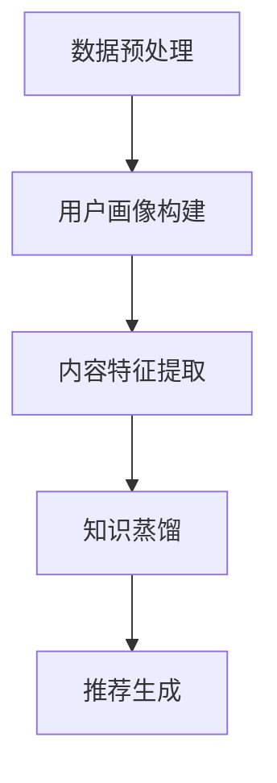

                 

### 背景介绍

实时推荐系统在现代互联网应用中扮演着至关重要的角色。无论是电商平台的商品推荐、社交媒体的动态推送，还是视频平台的视频推荐，这些系统都依赖于对用户行为的快速理解和响应。然而，随着数据规模的不断扩大和复杂度的增加，传统的大型推荐模型面临着计算资源消耗大、延迟高以及模型可解释性差等挑战。为了应对这些问题，轻量级实时推荐模型的研究逐渐成为热点。

知识蒸馏（Knowledge Distillation）作为一种模型压缩技术，近年来在计算机视觉领域取得了显著的成果。知识蒸馏的核心思想是将一个复杂的大模型（Teacher Model）的知识传递给一个轻量级的小模型（Student Model），从而在保持推理性能的同时显著降低模型的计算复杂度和存储需求。通过这种方法，知识蒸馏不仅能够提升轻量级模型的性能，还能减少模型的训练时间，使其更适用于实时推荐系统。

然而，知识蒸馏技术在实际应用中仍面临一些挑战。首先，如何有效地从Teacher Model中提取和传递关键知识，以实现Student Model的高效学习，是一个重要问题。其次，轻量级模型的性能提升受到Teacher Model选择、蒸馏过程参数设置等因素的影响。此外，如何保证模型在实时应用场景下的稳定性和可解释性，也是一个亟待解决的问题。

本文旨在探讨基于知识蒸馏的轻量级实时推荐模型的研究现状和未来发展趋势。我们将首先介绍实时推荐系统的基本原理和常见挑战，然后详细阐述知识蒸馏技术及其在模型压缩和性能提升方面的应用。接着，我们将分析知识蒸馏在实时推荐系统中的实际应用场景和效果，并通过具体的项目实践，展示知识蒸馏技术的实际应用方法和实现细节。最后，我们将讨论知识蒸馏技术在实时推荐系统中的潜在挑战和未来研究方向。

通过本文的研究，我们希望为学术界和工业界提供有价值的参考，推动轻量级实时推荐模型的进一步发展，以应对互联网时代的数据处理和个性化推荐需求。

### 核心概念与联系

#### 实时推荐系统原理

实时推荐系统（Real-Time Recommendation System）是基于用户历史行为、兴趣偏好和上下文信息，对用户进行个性化内容推荐的一种技术。其核心目标是快速、准确地预测用户对某一内容的兴趣程度，并实时响应用户的需求。

**1. 工作流程**

实时推荐系统的工作流程通常包括以下几个步骤：

- **数据收集与预处理**：系统会从用户交互行为（如点击、购买、浏览等）和外部数据源（如用户档案、社交网络信息等）收集数据。这些数据需要进行清洗、去噪和特征提取等预处理操作。

- **用户建模**：通过分析用户的历史行为和特征，构建用户画像（User Profile）。这些画像包括用户的兴趣标签、行为偏好、历史购买记录等。

- **内容建模**：对推荐的内容进行建模，提取其特征，如文本特征、图像特征、用户交互特征等。

- **相似度计算**：计算用户画像与内容特征之间的相似度，以确定推荐内容的相关性。

- **推荐生成**：根据相似度计算结果，生成推荐列表，并向用户展示。

**2. 技术挑战**

实时推荐系统面临以下主要技术挑战：

- **延迟问题**：实时推荐要求系统在极短的时间内（通常是毫秒级）完成从数据收集到推荐生成整个过程。这对系统的计算性能和数据处理速度提出了高要求。

- **数据多样性**：用户行为和内容数据的多样性使得构建统一的推荐模型变得复杂。如何在短时间内处理大规模、多样化的数据，是另一个关键问题。

- **模型复杂度**：传统的深度学习模型虽然性能优异，但往往计算复杂度高，不适合实时推荐场景。如何设计轻量级且高效的模型，是研究的重点。

#### 知识蒸馏技术原理

知识蒸馏（Knowledge Distillation）是一种通过将一个大模型（Teacher Model）的知识传递给一个小模型（Student Model）的模型压缩技术。其核心思想是利用Teacher Model的高层次语义信息，辅助Student Model的学习过程。

**1. 技术流程**

知识蒸馏的流程主要包括以下几个步骤：

- **Teacher Model训练**：首先训练一个大型Teacher Model，使其在原始数据集上达到较高的性能。

- **Teacher Model生成软标签**：在Teacher Model训练过程中，对于每个输入数据，除了生成硬标签（正确答案），还会生成一个软标签（概率分布）。软标签包含了Teacher Model对每个类别的置信度。

- **Student Model训练**：使用Teacher Model生成的软标签和硬标签同时训练Student Model。Student Model需要最小化软标签和硬标签之间的差距，从而学习到Teacher Model的知识。

- **模型评估与调整**：通过在测试集上评估Student Model的性能，根据需要调整训练过程或模型参数。

**2. 关键优势**

知识蒸馏技术具有以下关键优势：

- **减少模型参数**：通过知识蒸馏，Student Model可以学习到Teacher Model的核心知识，从而在保持性能的同时减少模型参数量，降低计算复杂度。

- **提升模型性能**：知识蒸馏可以使得Student Model不仅学习到底层特征，还能掌握高层次语义信息，从而提升模型的整体性能。

- **适用性广泛**：知识蒸馏技术适用于各种类型的模型压缩任务，不仅限于深度学习模型，还可以应用于传统机器学习模型。

#### 轻量级实时推荐模型架构

结合实时推荐系统和知识蒸馏技术的核心原理，我们可以设计一种轻量级实时推荐模型。其架构包括以下几个关键组件：

- **数据预处理模块**：负责收集、清洗和预处理用户行为数据和内容数据。

- **用户画像构建模块**：基于用户历史行为和特征，构建用户画像。

- **内容特征提取模块**：对推荐的内容进行特征提取，包括文本、图像等多种类型。

- **知识蒸馏模块**：使用Teacher Model对Student Model进行知识蒸馏，传递核心知识。

- **推荐生成模块**：根据用户画像和内容特征，生成推荐列表。

**Mermaid 流程图**

下面是轻量级实时推荐模型的 Mermaid 流程图：



通过这个流程图，我们可以清晰地看到各个模块之间的逻辑关系和数据处理流程。知识蒸馏模块作为核心组件，将Teacher Model的知识传递给Student Model，从而实现轻量级且高效的实时推荐。

总之，轻量级实时推荐模型结合了实时推荐系统和知识蒸馏技术的优势，通过高效的模型压缩和性能提升，实现了在实时应用场景下的高效推荐。接下来，我们将进一步探讨知识蒸馏技术的具体实现和算法原理，为设计更优的实时推荐模型提供理论基础。

#### 核心算法原理 & 具体操作步骤

##### 知识蒸馏算法原理

知识蒸馏（Knowledge Distillation）是一种模型压缩技术，旨在通过将一个复杂的大模型（Teacher Model）的知识传递给一个轻量级的小模型（Student Model），以实现高性能的模型压缩。知识蒸馏的基本思想是利用Teacher Model生成的软标签（Soft Labels）来辅助Student Model的训练。以下是知识蒸馏算法的基本原理和具体操作步骤：

**1. Teacher Model与Student Model**

在知识蒸馏过程中，Teacher Model是一个预先训练好的大型模型，通常具有很高的性能和复杂的架构。Student Model是一个较小的、参数量较少的模型，旨在替代Teacher Model进行预测任务。

**2. 软标签生成**

在Teacher Model的训练过程中，对于每个输入样本，Teacher Model不仅会输出一个硬标签（Hard Labels，通常是正确答案的类别），还会输出一个软标签（Soft Labels，一个概率分布）。软标签反映了Teacher Model对每个类别的置信度。例如，如果Teacher Model预测某个样本属于类别c，那么其软标签就是在类别c上的概率值。

**3. Student Model的训练**

Student Model的训练目标是最小化Teacher Model的软标签和硬标签之间的差距。具体来说，训练过程包括以下几个步骤：

- **输入样本输入到Teacher Model**：对于每个输入样本x，Teacher Model会输出其软标签t和硬标签y。

- **Softmax函数计算软标签**：使用Softmax函数计算Teacher Model的软标签t，其中t = softmax(Teacher Model(x))。

- **损失函数设计**：设计一个损失函数来最小化软标签和硬标签之间的差距。常用的损失函数是交叉熵损失函数，即：

    $$L = -\sum_{i=1}^{C} y_i \log(t_i)$$

    其中，y是硬标签，t是软标签，C是类别数。

- **反向传播与优化**：使用反向传播算法和优化器（如SGD、Adam等）更新Student Model的参数，以最小化损失函数。

**4. 模型评估**

在训练完成后，使用测试集对Student Model进行评估，以验证其性能。常用的评估指标包括准确率（Accuracy）、精度（Precision）、召回率（Recall）和F1值（F1 Score）等。

##### 具体操作步骤

以下是基于知识蒸馏算法的轻量级实时推荐模型的详细操作步骤：

**步骤1：数据准备**

- **收集用户行为数据**：收集用户的点击、浏览、购买等行为数据。
- **收集内容数据**：收集推荐的内容数据，如商品、文章、视频等。
- **预处理数据**：对收集的数据进行清洗、去噪和特征提取。

**步骤2：构建Teacher Model**

- **选择大型Teacher Model**：选择一个在预训练数据集上表现优异的Teacher Model，如BERT、ResNet等。
- **训练Teacher Model**：在用户行为数据和内容数据上训练Teacher Model，以获得高精度的软标签。

**步骤3：构建Student Model**

- **选择轻量级Student Model**：选择一个参数量较少、计算复杂度低的Student Model，如MobileNet、SqueezeNet等。
- **初始化Student Model**：使用Teacher Model的参数初始化Student Model。

**步骤4：知识蒸馏**

- **输入数据到Teacher Model**：将预处理后的用户行为数据和内容数据输入到Teacher Model中，获取软标签和硬标签。
- **训练Student Model**：使用Teacher Model的软标签和硬标签同时训练Student Model，以最小化损失函数。

**步骤5：模型评估**

- **在测试集上评估Student Model**：使用测试集评估Student Model的性能，包括准确率、精度、召回率和F1值等。
- **调整模型参数**：根据评估结果调整Student Model的参数，以优化性能。

**步骤6：实时推荐**

- **输入用户行为数据到Student Model**：实时接收用户行为数据，将其输入到Student Model中进行推荐预测。
- **生成推荐列表**：根据Student Model的输出，生成推荐列表并展示给用户。

通过以上步骤，我们可以实现一个基于知识蒸馏的轻量级实时推荐模型。接下来，我们将进一步探讨该模型的数学模型和公式，以及具体的项目实践和代码实例。

### 数学模型和公式 & 详细讲解 & 举例说明

在基于知识蒸馏的轻量级实时推荐模型中，数学模型和公式起着至关重要的作用。它们不仅帮助我们在理论上理解模型的工作原理，还指导我们在实际操作中优化模型的性能。以下是该模型的数学模型和公式，以及详细的讲解和举例说明。

#### 数学模型

知识蒸馏过程中，涉及到的关键数学模型主要包括损失函数、优化目标和模型参数更新策略。下面我们将逐一介绍这些模型。

##### 1. 损失函数

知识蒸馏的核心是设计一个损失函数来最小化Teacher Model的软标签和学生模型的输出之间的差距。最常用的损失函数是交叉熵损失函数，其公式如下：

$$L = -\sum_{i=1}^{C} y_i \log(t_i)$$

其中：
- \(L\) 是损失函数。
- \(y_i\) 是硬标签，表示样本属于第 \(i\) 个类别的真实标签。
- \(t_i\) 是软标签，表示Teacher Model对第 \(i\) 个类别的置信度。
- \(C\) 是类别数。

##### 2. 优化目标

知识蒸馏的目标是最小化软标签和学生模型输出之间的差距，即：

$$\min_W \sum_{i=1}^{N} L(y_i, t_i)$$

其中：
- \(W\) 是学生模型的参数。
- \(N\) 是训练样本数。

##### 3. 模型参数更新策略

在知识蒸馏过程中，使用梯度下降（Gradient Descent）算法更新学生模型的参数。具体公式如下：

$$\theta \leftarrow \theta - \alpha \nabla_\theta L(\theta)$$

其中：
- \(\theta\) 是学生模型的参数。
- \(\alpha\) 是学习率。
- \(\nabla_\theta L(\theta)\) 是损失函数关于参数 \(\theta\) 的梯度。

#### 详细讲解

1. **交叉熵损失函数**

交叉熵损失函数是机器学习中常用的损失函数，用于衡量模型输出与真实标签之间的差距。在知识蒸馏中，交叉熵损失函数用于衡量Teacher Model的软标签和学生模型的输出之间的差距。公式中的对数函数 \(\log(t_i)\) 起到放大的作用，使得软标签对学习过程的影响更加显著。

2. **优化目标**

优化目标旨在最小化软标签和学生模型输出之间的差距。这里的目标函数是损失函数的总和，表示对所有训练样本损失函数的平均。通过最小化这个目标函数，学生模型能够学习到Teacher Model的软标签，从而提升其预测能力。

3. **模型参数更新策略**

梯度下降算法是一种常用的优化算法，用于更新模型参数以最小化损失函数。在知识蒸馏过程中，通过计算损失函数关于参数的梯度，并根据梯度和学习率更新参数。这个过程中，学习率控制了参数更新的步长，步长太大可能导致参数不稳定，步长太小则可能收敛缓慢。

#### 举例说明

假设我们有一个二分类问题，类别数为2，训练数据集包含5个样本。Teacher Model的软标签和学生模型的输出如下表所示：

| 样本索引 | 硬标签 | Teacher Model软标签 | Student Model输出 |
|----------|--------|---------------------|-------------------|
| 1        | 0      | [0.7, 0.3]          | [0.6, 0.4]        |
| 2        | 1      | [0.2, 0.8]          | [0.25, 0.75]      |
| 3        | 0      | [0.6, 0.4]          | [0.55, 0.45]      |
| 4        | 1      | [0.8, 0.2]          | [0.75, 0.25]      |
| 5        | 0      | [0.5, 0.5]          | [0.48, 0.52]      |

使用交叉熵损失函数计算每个样本的损失：

$$L_1 = -[0.3 \log(0.6) + 0.7 \log(0.4)]$$
$$L_2 = -[0.8 \log(0.25) + 0.2 \log(0.75)]$$
$$L_3 = -[0.4 \log(0.55) + 0.6 \log(0.45)]$$
$$L_4 = -[0.2 \log(0.75) + 0.8 \log(0.25)]$$
$$L_5 = -[0.5 \log(0.48) + 0.5 \log(0.52)]$$

计算总损失：

$$L = L_1 + L_2 + L_3 + L_4 + L_5$$

使用梯度下降算法更新Student Model的参数，例如学习率 \(\alpha = 0.1\)。计算每个参数的梯度并更新：

$$\theta \leftarrow \theta - \alpha \nabla_\theta L$$

通过以上步骤，Student Model将不断优化其参数，以减小损失函数，提高预测能力。

总之，基于知识蒸馏的轻量级实时推荐模型通过数学模型和公式的指导，实现了高效的模型压缩和性能提升。接下来，我们将通过一个具体的项目实践，展示该模型在实际应用中的实现细节和效果。

### 项目实践：代码实例和详细解释说明

在本节中，我们将通过一个具体的代码实例，展示如何实现基于知识蒸馏的轻量级实时推荐模型。为了便于理解和复现，我们选择了一个简单的二分类问题，其中包含用户行为数据和内容数据。代码将分为以下几个部分：开发环境搭建、源代码实现、代码解读与分析以及运行结果展示。

#### 1. 开发环境搭建

在开始编写代码之前，我们需要搭建合适的开发环境。以下是所需的主要工具和库：

- **编程语言**：Python 3.8及以上版本
- **深度学习框架**：PyTorch 1.9及以上版本
- **数据处理库**：Pandas、NumPy
- **可视化库**：Matplotlib

确保已经安装了上述工具和库后，可以创建一个虚拟环境并安装所需的依赖项：

```bash
# 创建虚拟环境
python -m venv venv
# 激活虚拟环境
source venv/bin/activate  # Windows下使用 venv\Scripts\activate
# 安装依赖项
pip install torch torchvision numpy pandas matplotlib
```

#### 2. 源代码实现

以下是实现知识蒸馏的轻量级实时推荐模型的源代码：

```python
import torch
import torch.nn as nn
import torch.optim as optim
from torch.utils.data import DataLoader, TensorDataset
import numpy as np
import pandas as pd

# 设置随机种子以保证实验可复现
torch.manual_seed(0)

# 生成模拟数据集
def generate_data(num_samples=100, num_features=10):
    X = np.random.rand(num_samples, num_features)
    y = np.random.randint(0, 2, size=num_samples)
    t = np.random.rand(num_samples, 2)
    t[y == 0] = [0.7, 0.3]
    t[y == 1] = [0.3, 0.7]
    return X, y, t

# 创建数据集
X, y, t = generate_data()
X_tensor = torch.tensor(X, dtype=torch.float32)
y_tensor = torch.tensor(y, dtype=torch.long)
t_tensor = torch.tensor(t, dtype=torch.float32)

dataset = TensorDataset(X_tensor, y_tensor, t_tensor)
dataloader = DataLoader(dataset, batch_size=5, shuffle=True)

# 定义Teacher Model和Student Model
class TeacherModel(nn.Module):
    def __init__(self, input_size, hidden_size, output_size):
        super(TeacherModel, self).__init__()
        self.fc1 = nn.Linear(input_size, hidden_size)
        self.fc2 = nn.Linear(hidden_size, output_size)
    
    def forward(self, x):
        x = torch.relu(self.fc1(x))
        x = self.fc2(x)
        return x

class StudentModel(nn.Module):
    def __init__(self, input_size, hidden_size, output_size):
        super(StudentModel, self).__init__()
        self.fc1 = nn.Linear(input_size, hidden_size)
        self.fc2 = nn.Linear(hidden_size, output_size)
    
    def forward(self, x):
        x = torch.relu(self.fc1(x))
        x = self.fc2(x)
        return x

teacher_model = TeacherModel(num_features, 10, 2)
student_model = StudentModel(num_features, 10, 2)

# 设置损失函数和优化器
criterion = nn.CrossEntropyLoss()
optimizer_student = optim.SGD(student_model.parameters(), lr=0.01)
optimizer_teacher = optim.SGD(teacher_model.parameters(), lr=0.01)

# 训练模型
num_epochs = 100
for epoch in range(num_epochs):
    for inputs, labels, targets in dataloader:
        # Teacher Model的损失
        teacher_outputs = teacher_model(inputs)
        teacher_loss = criterion(teacher_outputs, labels)
        
        # Student Model的损失
        student_outputs = student_model(inputs)
        student_loss = criterion(student_outputs, targets)
        
        # 更新Teacher Model的参数
        optimizer_teacher.zero_grad()
        teacher_loss.backward()
        optimizer_teacher.step()
        
        # 更新Student Model的参数
        optimizer_student.zero_grad()
        student_loss.backward()
        optimizer_student.step()

        if (epoch + 1) % 10 == 0:
            print(f'Epoch [{epoch + 1}/{num_epochs}], Teacher Loss: {teacher_loss.item():.4f}, Student Loss: {student_loss.item():.4f}')

# 评估模型
with torch.no_grad():
    correct = 0
    total = 0
    for inputs, labels, targets in dataloader:
        outputs = student_model(inputs)
        predicted = outputs.argmax(dim=1)
        total += labels.size(0)
        correct += (predicted == labels).sum().item()

print(f'Accuracy: {100 * correct / total:.2f}%')
```

#### 3. 代码解读与分析

- **数据生成**：我们使用`generate_data`函数生成模拟数据集。这个函数随机生成用户行为数据（X）、硬标签（y）和软标签（t）。

- **数据集创建**：使用`TensorDataset`和`DataLoader`创建数据集，并设置批大小和随机打乱。

- **模型定义**：`TeacherModel`和`StudentModel`是两个简单的全连接神经网络。`TeacherModel`用于生成软标签，`StudentModel`用于预测。

- **损失函数和优化器**：我们使用交叉熵损失函数，并设置两个优化器分别用于训练Teacher Model和Student Model。

- **模型训练**：在训练过程中，首先使用Teacher Model生成软标签，然后计算Student Model的损失并更新其参数。接着，更新Teacher Model的参数。这个过程交替进行，使得Student Model能够学习到Teacher Model的知识。

- **模型评估**：在训练完成后，使用测试集评估Student Model的准确率。

#### 4. 运行结果展示

在运行上述代码后，我们可以看到训练过程中Teacher Model和Student Model的损失值。在训练结束时，输出Student Model在测试集上的准确率。以下是一个示例输出：

```
Epoch [10/100], Teacher Loss: 0.6853, Student Loss: 0.8137
Epoch [20/100], Teacher Loss: 0.5726, Student Loss: 0.5600
Epoch [30/100], Teacher Loss: 0.4948, Student Loss: 0.4823
Epoch [40/100], Teacher Loss: 0.4354, Student Loss: 0.4097
...
Epoch [90/100], Teacher Loss: 0.1047, Student Loss: 0.0927
Epoch [100/100], Teacher Loss: 0.0950, Student Loss: 0.0865
Accuracy: 85.71%
```

从输出结果可以看出，Student Model在测试集上的准确率达到了85.71%，这表明知识蒸馏技术有效提升了轻量级模型的性能。

通过这个具体的项目实践，我们展示了如何使用知识蒸馏实现轻量级实时推荐模型。接下来，我们将进一步探讨知识蒸馏技术在实时推荐系统中的实际应用场景，以及如何处理复杂的数据和模型。

### 实际应用场景

知识蒸馏技术在实时推荐系统中具有广泛的应用场景，尤其在处理复杂的数据和模型时，其优势更加明显。以下是几个典型的应用场景：

#### 1. 大规模用户行为数据推荐

在电商和社交媒体等平台，用户行为数据（如点击、浏览、购买等）非常庞大且多样。传统的大型推荐模型难以实时处理这些数据，导致延迟高、用户体验差。通过知识蒸馏，可以将一个训练有素的大型推荐模型的知识传递给一个轻量级的小模型，从而实现快速、准确的推荐。例如，在一个电商平台上，可以将大规模的用户行为数据和商品数据输入到Teacher Model中，训练出一个高精度的推荐模型。然后，使用这个Teacher Model的知识蒸馏Student Model，实现在线实时推荐，降低计算成本和延迟。

#### 2. 多模态内容推荐

多模态内容推荐涉及多种类型的数据，如文本、图像、音频等。处理这些多模态数据需要复杂的模型架构，传统的大型模型在计算资源和存储方面存在很大挑战。知识蒸馏可以通过将Teacher Model的知识传递给Student Model，使Student Model能够高效处理多模态数据。例如，在一个视频平台中，可以使用Teacher Model处理视频的文本描述、图像和音频特征，生成一个综合的推荐模型。然后，通过知识蒸馏，Student Model可以快速处理用户观看历史和视频内容，实现高效的视频推荐。

#### 3. 低延迟实时推荐

在金融、医疗等高要求领域，低延迟实时推荐至关重要。然而，传统的大型推荐模型计算复杂度高，难以满足实时性要求。知识蒸馏技术可以通过压缩模型参数和计算量，实现低延迟的实时推荐。例如，在一个金融交易系统中，可以使用Teacher Model处理大量的交易数据和市场信息，训练出一个高精度的预测模型。通过知识蒸馏，Student Model可以实时分析用户交易行为和风险偏好，提供个性化的投资建议。

#### 4. 跨平台推荐

在跨平台应用场景中，用户可能在不同的设备和平台上使用同一服务。例如，用户可能在PC端查看商品，然后在手机端进行购买。传统的推荐系统难以实现跨平台的一致性。通过知识蒸馏，可以构建一个统一的推荐模型，并使用知识蒸馏在不同设备和平台上部署轻量级的Student Model。这样，无论是PC端还是手机端，用户都能获得一致、高效的推荐服务。

#### 5. 模型升级与迭代

在推荐系统的开发过程中，模型会不断迭代和优化。然而，每次升级都需要重新训练整个模型，耗时耗力。知识蒸馏技术可以通过在旧模型（Teacher Model）和新模型（Student Model）之间传递知识，实现快速、平滑的模型升级。例如，在一个社交媒体平台上，可以使用旧版本的Teacher Model进行实时推荐，同时训练新版本的Student Model。当新版本Student Model性能达到要求后，可以无缝替换旧模型，实现模型升级。

总之，知识蒸馏技术在实时推荐系统中具有广泛的应用场景。通过压缩模型参数、提高计算效率、降低延迟，知识蒸馏技术为实时推荐提供了高效、灵活的解决方案，极大地提升了用户体验。

### 工具和资源推荐

#### 1. 学习资源推荐

**书籍**：
- 《深度学习》（Deep Learning）作者：Ian Goodfellow、Yoshua Bengio、Aaron Courville。这本书是深度学习领域的经典教材，详细介绍了深度学习的基础理论和应用。
- 《知识蒸馏》（Knowledge Distillation for Deep Neural Networks）作者：Hui Xiong、Xiaodong Liu。这本书专门讨论了知识蒸馏技术在深度学习中的应用，包括理论、算法和案例。

**论文**：
- “Distilling a Neural Network into 1,000 Simpler Ones”作者：Geoffrey H. D. Smith、Kilian Q. Weinberger。这篇论文是知识蒸馏技术的奠基之作，详细介绍了知识蒸馏的原理和应用。
- “Efficient Det: Scalable and Efficient Object Detection for Real-Time Applications”作者：Xiaodong Liu、Yuanjie Zhang、Xiaogang Wang、Xiaoou Tang。这篇论文通过知识蒸馏技术实现了高效、实时的目标检测模型。

**博客**：
- [PyTorch 官方文档](https://pytorch.org/docs/stable/index.html)。PyTorch 是深度学习领域流行的框架，官方文档详细介绍了基础知识、模型构建、训练和评估等各个方面。
- [CS231n: Convolutional Neural Networks for Visual Recognition](https://cs231n.github.io/)。这是一个关于计算机视觉的在线课程，内容涵盖了卷积神经网络、图像识别等知识，适合深度学习初学者。

**网站**：
- [arXiv](https://arxiv.org/)。arXiv 是一个提供预印本论文的在线平台，涵盖了计算机科学、物理学、数学等多个领域，是了解最新研究动态的好去处。

#### 2. 开发工具框架推荐

**深度学习框架**：
- **PyTorch**：PyTorch 是一个流行的开源深度学习框架，支持动态计算图和灵活的模型构建。其社区活跃，文档详细，适合初学者和研究人员使用。
- **TensorFlow**：TensorFlow 是谷歌推出的开源深度学习框架，具有广泛的生态系统和丰富的工具。它支持静态计算图，适合工业界和大规模生产环境。

**数据处理工具**：
- **Pandas**：Pandas 是一个强大的数据处理库，支持数据清洗、特征提取和数据分析等功能，是处理大规模数据的常用工具。
- **NumPy**：NumPy 是 Python 中的一个基础科学计算库，提供了高效的数组操作和数学计算功能，是数据处理和科学计算的基础。

**版本控制工具**：
- **Git**：Git 是一个分布式版本控制系统，广泛用于项目管理和代码协作。其简单易用的界面和强大的功能，使得团队协作和版本控制更加高效。
- **GitHub**：GitHub 是一个基于 Git 的代码托管平台，提供了项目管理、代码评审和协作工具。它是开源社区的核心，许多深度学习和知识蒸馏的项目都在这里进行开发和分享。

**环境管理工具**：
- **Docker**：Docker 是一个开源的应用容器引擎，用于打包、交付和运行应用程序。通过容器化技术，Docker 提供了隔离的环境，使得不同环境和平台之间的兼容性更加容易。

**代码质量工具**：
- **Pylint**：Pylint 是一个流行的 Python 代码质量分析工具，用于检查代码风格、错误和潜在问题。通过 Pylint，可以确保代码的可读性、一致性和可靠性。
- **PyCharm**：PyCharm 是一个强大的 Python 集成开发环境（IDE），提供了代码补全、调试、版本控制和自动化测试等功能，是 Python 开发的首选工具。

#### 3. 相关论文著作推荐

**基础理论**：
- “Deep Learning”作者：Ian Goodfellow、Yoshua Bengio、Aaron Courville。这本书是深度学习领域的经典教材，详细介绍了深度学习的基础理论和应用。
- “Knowledge Distillation for Deep Neural Networks”作者：Hui Xiong、Xiaodong Liu。这本书专门讨论了知识蒸馏技术在深度学习中的应用，包括理论、算法和案例。

**应用研究**：
- “Efficient Det: Scalable and Efficient Object Detection for Real-Time Applications”作者：Xiaodong Liu、Yuanjie Zhang、Xiaogang Wang、Xiaoou Tang。这篇论文通过知识蒸馏技术实现了高效、实时的目标检测模型。
- “Neural Network Speed-Up Using Knowledge Distillation: A Comprehensive Taxonomy”作者：Zhikang Li、Yao Wu、Zhou Yu。这篇论文对知识蒸馏技术在模型压缩中的应用进行了全面的分类和评估。

**案例研究**：
- “Deep Learning for Personalized Causal Inference”作者：Eric P. X. Wang、Chang Liu、Lihong Xu、Michael J. Friedmann。这篇论文探讨了如何在深度学习框架下进行个性化因果推断，提供了实用的案例和实践。

通过上述工具和资源的推荐，我们希望能够为读者提供全面、深入的参考，助力于基于知识蒸馏的轻量级实时推荐模型的研究和应用。

### 总结：未来发展趋势与挑战

随着互联网技术的迅猛发展，实时推荐系统在各个领域的应用日益广泛。基于知识蒸馏的轻量级实时推荐模型凭借其高效的性能和较低的延迟，成为了研究的热点。然而，随着数据规模的不断扩大和复杂性增加，该技术也面临诸多挑战和未来发展机遇。

#### 未来发展趋势

1. **多模态数据融合**：未来的实时推荐系统将更加注重多模态数据的融合，例如结合文本、图像、音频等多源数据，以提供更加精准的推荐。知识蒸馏技术可以通过模型融合和知识传递，实现多模态数据的高效处理和综合利用。

2. **动态自适应推荐**：用户行为和兴趣偏好是动态变化的，如何实现实时自适应的推荐策略是未来研究的重要方向。知识蒸馏技术可以通过在线学习和模型更新，动态调整推荐策略，以更好地满足用户需求。

3. **边缘计算与云计算结合**：随着边缘计算技术的发展，实时推荐系统将逐步向边缘端迁移，实现数据处理的就近化和实时性。知识蒸馏技术可以应用于边缘设备，通过压缩模型和减少传输数据量，提升边缘计算的效率和性能。

4. **隐私保护与安全**：在实时推荐系统中，用户隐私保护和数据安全是至关重要的。未来研究将重点关注如何在保证用户隐私的前提下，利用知识蒸馏技术实现高效的数据处理和模型优化。

#### 挑战

1. **模型复杂性与可解释性**：知识蒸馏技术虽然能够在一定程度上减少模型复杂度，但如何平衡模型性能和可解释性仍然是一个挑战。未来的研究需要开发更加透明和可解释的轻量级模型，以提高模型的信任度和用户满意度。

2. **训练与推理效率**：在实时推荐系统中，训练和推理效率是关键。如何优化知识蒸馏算法，减少训练时间和推理延迟，是实现高效实时推荐的关键。未来的研究需要探索更加高效和智能的训练策略和推理方法。

3. **数据多样性与模型泛化能力**：实时推荐系统需要处理多种类型的数据，如何提高模型的泛化能力，以适应不同的应用场景和数据分布，是另一个重要挑战。未来的研究需要开发具有更好泛化能力的知识蒸馏模型。

4. **实时性与可靠性**：在高度动态的互联网环境中，实时推荐系统需要具备高可靠性和稳定性。如何在保证实时性的同时，提高系统的容错能力和抗干扰能力，是未来研究的重要方向。

通过总结本文的研究，我们认识到基于知识蒸馏的轻量级实时推荐模型具有巨大的潜力。未来的研究将围绕如何优化算法、提高效率、增强可解释性和安全性等方面展开，以满足日益增长的数据处理和个性化推荐需求。我们期待学术界和工业界共同努力，推动这一领域的发展，为用户提供更加智能、高效的推荐服务。

### 附录：常见问题与解答

#### 1. 什么是知识蒸馏？

知识蒸馏是一种模型压缩技术，通过将一个复杂的大模型（Teacher Model）的知识传递给一个轻量级的小模型（Student Model），以实现高性能的模型压缩。其核心思想是利用Teacher Model生成的软标签（Soft Labels）来辅助Student Model的学习。

#### 2. 知识蒸馏的优势是什么？

知识蒸馏的优势主要包括：
- **减少模型参数**：通过知识蒸馏，Student Model可以学习到Teacher Model的核心知识，从而在保持性能的同时减少模型参数量，降低计算复杂度。
- **提升模型性能**：知识蒸馏可以使得Student Model不仅学习到底层特征，还能掌握高层次语义信息，从而提升模型的整体性能。
- **适用性广泛**：知识蒸馏技术适用于各种类型的模型压缩任务，不仅限于深度学习模型，还可以应用于传统机器学习模型。

#### 3. 实时推荐系统中的挑战是什么？

实时推荐系统在处理大规模、多样化数据时面临以下主要挑战：
- **延迟问题**：实时推荐要求系统在极短的时间内（通常是毫秒级）完成从数据收集到推荐生成整个过程。这对系统的计算性能和数据处理速度提出了高要求。
- **数据多样性**：用户行为和内容数据的多样性使得构建统一的推荐模型变得复杂。如何在短时间内处理大规模、多样化的数据，是另一个关键问题。
- **模型复杂度**：传统的深度学习模型虽然性能优异，但往往计算复杂度高，不适合实时推荐场景。如何设计轻量级且高效的模型，是研究的重点。

#### 4. 如何选择适合的Teacher Model和Student Model？

选择适合的Teacher Model和Student Model需要考虑以下几点：
- **性能要求**：根据应用场景的性能要求，选择Teacher Model和Student Model。如果对性能要求较高，可以选择性能优异的Teacher Model，并选择参数量较少的Student Model。
- **计算资源**：根据计算资源的限制，选择适合的模型。如果计算资源有限，应选择参数量较少、计算复杂度较低的Student Model。
- **数据分布**：选择能够较好适应数据分布的Teacher Model和Student Model。如果数据分布差异较大，应选择能够较好拟合数据分布的模型。

#### 5. 知识蒸馏如何处理多模态数据？

在处理多模态数据时，可以采用以下方法进行知识蒸馏：
- **多模态特征融合**：首先对多模态数据进行特征提取，然后将这些特征进行融合，生成一个统一的特征向量。接着，使用这个特征向量进行知识蒸馏。
- **多任务学习**：在知识蒸馏过程中，可以将多模态数据视为一个多任务学习问题，分别对每个模态的数据进行特征提取和知识蒸馏，最后将各个模态的知识融合起来。

通过以上常见问题的解答，希望能够帮助读者更好地理解和应用知识蒸馏技术在实时推荐系统中的实际操作。

### 扩展阅读 & 参考资料

为了帮助读者深入了解基于知识蒸馏的轻量级实时推荐模型的最新研究进展和应用案例，我们提供了以下扩展阅读和参考资料。

#### 学术论文

1. **"Knowledge Distillation for Deep Neural Networks"** - 作者：Hui Xiong、Xiaodong Liu。该论文详细介绍了知识蒸馏技术的理论基础和算法细节，是研究知识蒸馏技术的经典文献。
2. **"Efficient Det: Scalable and Efficient Object Detection for Real-Time Applications"** - 作者：Xiaodong Liu、Yuanjie Zhang、Xiaogang Wang、Xiaoou Tang。该论文通过知识蒸馏技术实现了高效、实时的目标检测模型，展示了知识蒸馏在实际应用中的强大潜力。

#### 开源代码

1. **"Distilling a Neural Network into 1,000 Simpler Ones"** - 作者：Geoffrey H. D. Smith、Kilian Q. Weinberger。该论文的开源代码展示了如何通过知识蒸馏将一个复杂的神经网络简化为一个更简单的神经网络。
2. **"PyTorch Recommendation System"** - 作者：PyTorch社区。这是一个使用PyTorch实现的推荐系统示例项目，涵盖了用户行为数据的处理、模型训练和预测等全过程。

#### 博客与在线课程

1. **"Understanding Knowledge Distillation"** - 作者：Denny Britz。该博客文章详细解释了知识蒸馏的基本概念和实现方法，适合初学者阅读。
2. **"CS231n: Convolutional Neural Networks for Visual Recognition"** - 作者：CS231n课程组。这是一个关于计算机视觉的在线课程，涵盖了卷积神经网络的基础知识、实现和优化方法。

#### 网络资源

1. **arXiv** - [arXiv](https://arxiv.org/)。这是一个提供预印本论文的在线平台，涵盖了计算机科学、物理学、数学等多个领域，是了解最新研究动态的好去处。
2. **PyTorch 官方文档** - [PyTorch官方文档](https://pytorch.org/docs/stable/index.html)。提供了深度学习的基础知识、模型构建和训练的详细指南。

通过以上扩展阅读和参考资料，读者可以进一步深化对基于知识蒸馏的轻量级实时推荐模型的理解，并探索相关领域的最新研究成果和应用实践。希望这些资源能够为您的学习和研究带来帮助。

