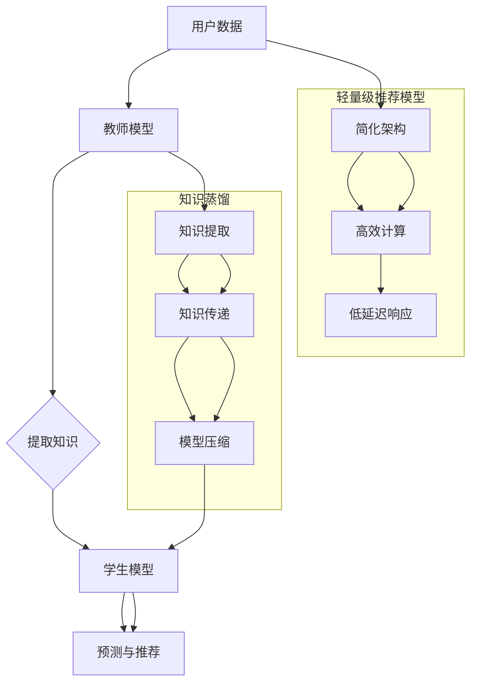

                 

### 背景介绍

#### 1.1 研究背景

随着互联网的快速发展，推荐系统在电子商务、社交媒体、新闻推送等领域中扮演着越来越重要的角色。推荐系统能够根据用户的历史行为和偏好，为用户提供个性化的信息和服务，从而提高用户满意度和参与度。然而，传统推荐模型通常采用深度学习技术，例如基于协同过滤、基于内容、以及混合模型等，这些模型在处理大规模数据集时面临计算资源消耗大、模型复杂度高、训练时间过长等问题。

#### 1.2 轻量级推荐模型的必要性

随着用户数据的爆炸性增长，传统深度学习推荐模型在计算效率、模型复杂度方面逐渐暴露出其局限性。轻量级推荐模型因其高效的计算性能和较低的资源消耗，逐渐受到研究者和行业用户的关注。轻量级推荐模型不仅能够处理大规模数据集，还能够快速响应，提高用户体验。此外，轻量级推荐模型还可以部署在资源受限的移动设备上，使得个性化推荐服务更加普及。

#### 1.3 知识蒸馏的概念

知识蒸馏（Knowledge Distillation）是一种将复杂模型的知识传递给简化模型的技术。在深度学习中，知识蒸馏通过训练一个大的教师模型，然后将教师模型的知识传递给一个小的学生模型，使得学生模型能够在保留主要特征表达能力的同时，降低模型的复杂度和计算成本。知识蒸馏的核心思想是将高维特征映射到低维空间，从而实现知识的压缩和传递。

#### 1.4 研究意义

本文旨在探讨基于知识蒸馏的轻量级推荐模型的研究意义。通过知识蒸馏技术，我们可以将复杂的深度学习模型简化，从而构建出计算成本较低的轻量级推荐模型。这不仅能够提高推荐系统的计算效率，还能降低部署成本，使得推荐系统在更多场景中得到广泛应用。

### 轻量级推荐模型的必要性

在当前互联网环境中，推荐系统已经深入到了我们的日常生活。无论是电商平台的商品推荐，社交媒体的好友推荐，还是新闻平台的个性化推送，推荐系统都起到了至关重要的作用。然而，随着用户数据的不断增长，传统推荐模型面临着越来越多的挑战。

首先，传统深度学习推荐模型在处理大规模数据集时，往往需要大量的计算资源。这不仅导致了模型训练时间的延长，还增加了硬件设备的成本。其次，复杂模型的结构通常包含数十万甚至数百万的参数，这增加了模型的计算复杂度，使其难以在资源受限的设备上部署。最后，深度学习模型的过拟合现象较为严重，需要大量的训练数据和复杂的模型结构来避免，这进一步增加了模型的训练成本。

在这种背景下，轻量级推荐模型应运而生。轻量级推荐模型通过优化模型结构、减少参数数量、提高计算效率等方式，能够有效地解决传统推荐模型在计算资源和模型复杂度方面的瓶颈。轻量级推荐模型不仅能够在保持较高推荐质量的同时，降低计算成本和部署难度，还能为用户提供更加快速和个性化的服务。

### 知识蒸馏的概念

知识蒸馏是一种将复杂模型的知识传递给简化模型的技术，起源于深度学习领域。知识蒸馏的基本思想是通过训练一个大的教师模型（Teacher Model），然后将其知识传递给一个小的学生模型（Student Model），使得学生模型能够在保持主要特征表达能力的同时，降低模型的复杂度和计算成本。

#### 2.1 教师模型与学生模型

在知识蒸馏中，教师模型通常是一个复杂的深度学习模型，拥有大量的参数和多层结构。它通过学习大规模数据集，可以捕捉到丰富的特征和模式。学生模型则是一个简化版的模型，通常具有较少的参数和较简单的结构。学生模型的目的是通过学习教师模型的知识，提升自身的性能。

#### 2.2 知识传递过程

知识蒸馏的过程可以分为以下几个步骤：

1. **教师模型的训练**：首先，使用大量数据训练教师模型，使其能够准确地捕捉到输入数据的特征和模式。

2. **提取知识**：在教师模型训练完成后，从其内部提取知识，通常使用内部层（Intermediate Layers）的激活值或软标签（Soft Labels）作为知识载体。

3. **学生模型的训练**：使用提取的知识训练学生模型。学生模型的训练目标是使其输出与教师模型的输出尽量一致。

4. **性能评估**：通过评估学生模型的性能，来衡量知识蒸馏的效果。通常，使用准确率（Accuracy）、损失函数（Loss Function）等指标来评估学生模型的性能。

#### 2.3 知识蒸馏的优势

知识蒸馏具有以下几个显著优势：

1. **模型简化**：通过将复杂模型的知识传递给简化模型，可以大大减少模型的参数数量和计算复杂度，从而提高计算效率。

2. **降低过拟合**：知识蒸馏通过从教师模型中提取知识，可以减少学生模型的过拟合现象，提高其泛化能力。

3. **易部署**：轻量级的学生模型不仅计算成本低，而且易于在资源受限的设备上部署，从而实现实时推荐。

4. **高效学习**：知识蒸馏可以快速地将复杂模型的知识传递给学生模型，从而加速模型训练过程。

综上所述，知识蒸馏技术为构建轻量级推荐模型提供了有效的技术手段，使得推荐系统在保持较高性能的同时，具有更高的计算效率和部署灵活性。

#### 2.4 研究意义

知识蒸馏在构建轻量级推荐模型中具有重要意义。首先，知识蒸馏能够将复杂深度学习模型的知识有效传递给轻量级模型，使得轻量级模型在保持较高推荐质量的同时，显著降低计算资源和模型复杂度。其次，知识蒸馏技术具有高效性，能够加速模型训练过程，提高系统响应速度。此外，知识蒸馏可以显著减少过拟合现象，提高模型的泛化能力。因此，基于知识蒸馏的轻量级推荐模型有望在推荐系统中发挥重要作用，为用户提供更加精准、高效和个性化的服务。

### 核心概念与联系

#### 3.1 轻量级推荐模型的概念

轻量级推荐模型（Lite Recommender Model）是一种设计用于在资源受限的环境下运行的推荐系统模型。这些模型通常具有较少的参数、简单的架构以及高效的计算性能，从而能够在有限的计算资源下快速处理推荐任务。轻量级推荐模型的关键特点包括低计算复杂度、快速训练和低延迟响应，使其非常适合部署在移动设备、物联网设备以及在线服务中。

#### 3.2 知识蒸馏在轻量级推荐模型中的应用

知识蒸馏（Knowledge Distillation）作为一种有效的模型压缩技术，在轻量级推荐模型的构建中发挥了关键作用。通过知识蒸馏，复杂的深度学习模型（教师模型）可以将知识传递给一个简化版的学生模型。这一过程不仅有助于降低学生模型的参数数量和计算复杂度，还能够保留教师模型的主要特征表达能力，从而提高轻量级推荐模型在数据处理和预测质量上的表现。

#### 3.3 核心概念之间的联系

轻量级推荐模型和知识蒸馏之间的联系主要体现在以下几个方面：

1. **模型压缩与知识传递**：知识蒸馏通过提取复杂模型（教师模型）的知识，并将其传递给简化模型（学生模型），实现了模型压缩的目的。这一过程不仅减少了模型参数的数量，还优化了计算资源的使用。

2. **性能保持与优化**：知识蒸馏在保留教师模型主要特征表达能力的同时，通过优化学生模型的训练过程，提高了轻量级推荐模型在数据处理和预测准确性上的表现。

3. **资源优化与部署**：轻量级推荐模型结合知识蒸馏技术，能够在保证推荐质量的前提下，显著降低计算资源和存储资源的需求，从而实现更高效和更灵活的部署。

为了更好地理解轻量级推荐模型与知识蒸馏之间的联系，我们可以通过以下Mermaid流程图来展示核心概念与架构：



在这个流程图中，用户数据首先被输入到教师模型中进行处理，教师模型提取出关键知识后传递给学生模型，学生模型基于这些知识进行预测和推荐。轻量级推荐模型通过简化架构和高效计算，实现了低延迟响应，而知识蒸馏通过知识提取和传递，实现了模型压缩和性能优化。

通过上述核心概念与联系的讨论，我们可以清晰地看到，轻量级推荐模型和知识蒸馏技术在构建高效、低成本的推荐系统中扮演着至关重要的角色。接下来，我们将深入探讨知识蒸馏在轻量级推荐模型中的具体算法原理与实现步骤。

### 核心算法原理 & 具体操作步骤

#### 4.1 知识蒸馏的算法原理

知识蒸馏是一种将复杂模型（教师模型）的知识传递给简化模型（学生模型）的技术，其核心思想是通过训练学生模型来模仿教师模型的输出。这一过程主要包括两个阶段：教师模型的训练和学生模型的训练。

**4.1.1 教师模型的训练**

教师模型的训练过程与传统深度学习模型类似，使用大量标注数据对模型进行训练。在训练过程中，教师模型学习到输入数据中的特征和模式，并产生一个输出预测。这个输出通常是一个软标签（Soft Labels），包含了多个可能的预测结果及其对应的概率分布。

**4.1.2 知识提取**

在教师模型训练完成后，需要从模型中提取知识，以便传递给学生模型。知识提取通常通过以下几种方式实现：

1. **中间层激活值**：从教师模型的中间层提取激活值，这些激活值反映了模型在处理输入数据时所学到的特征信息。
2. **软标签**：教师模型的输出软标签包含了模型对输入数据的预测概率分布，这些概率分布可以看作是模型学到的知识。
3. **梯度信息**：通过分析教师模型在训练过程中的梯度信息，可以提取出模型的学习过程和决策逻辑。

**4.1.3 学生模型的训练**

学生模型的训练过程旨在使其能够模仿教师模型的输出。在知识蒸馏中，学生模型的输入不仅包括原始数据，还包括从教师模型提取的知识。学生模型的输出与教师模型的输出进行对比，通过损失函数（通常使用交叉熵损失函数）来计算误差，并据此调整学生模型的参数。

学生模型的训练可以分为以下几个步骤：

1. **融合输入**：将原始数据和提取的知识作为学生模型的输入。
2. **特征学习**：学生模型学习输入数据的特征，生成预测输出。
3. **损失计算**：计算学生模型的输出与教师模型输出之间的误差，使用损失函数来衡量误差。
4. **参数更新**：根据损失函数的梯度信息更新学生模型的参数。

**4.1.4 知识蒸馏的优势**

知识蒸馏具有以下几个显著优势：

1. **模型压缩**：通过知识蒸馏，可以显著减少学生模型的参数数量，从而降低计算复杂度和存储需求。
2. **性能保持**：学生模型通过学习教师模型的知识，可以保留教师模型的主要特征表达能力，从而保持较高的预测准确性。
3. **降低过拟合**：知识蒸馏有助于减少学生模型的过拟合现象，提高其泛化能力。
4. **快速部署**：轻量级的学生模型不仅计算效率高，而且易于在资源受限的环境中部署。

#### 4.2 轻量级推荐模型的具体操作步骤

基于知识蒸馏的轻量级推荐模型的构建可以分为以下几个具体步骤：

**4.2.1 数据准备**

1. **收集数据**：从不同的数据源收集用户行为数据，包括用户浏览、购买、点击等行为数据。
2. **数据预处理**：对收集到的数据进行清洗、去噪和格式化，确保数据质量。
3. **数据划分**：将数据集划分为训练集、验证集和测试集，用于后续模型的训练和评估。

**4.2.2 教师模型训练**

1. **选择教师模型**：选择一个复杂的深度学习模型作为教师模型，例如基于神经网络的推荐模型。
2. **训练教师模型**：使用训练集数据对教师模型进行训练，直到达到预定的训练效果。
3. **提取知识**：从训练好的教师模型中提取中间层激活值或软标签作为知识。

**4.2.3 学生模型训练**

1. **设计学生模型**：设计一个轻量级的深度学习模型作为学生模型，结构应比教师模型简单。
2. **融合输入**：将原始数据和提取的知识作为学生模型的输入。
3. **训练学生模型**：使用教师模型的软标签作为学生模型的标签，通过交叉熵损失函数来训练学生模型。
4. **评估与优化**：通过验证集和测试集对训练好的学生模型进行评估，并根据评估结果进行优化。

**4.2.4 预测与推荐**

1. **输入数据预处理**：对用户的输入数据进行预处理，使其符合学生模型的输入要求。
2. **学生模型预测**：使用训练好的学生模型对预处理后的输入数据进行预测。
3. **推荐结果生成**：根据预测结果生成个性化推荐，提供给用户。

通过以上具体操作步骤，我们可以构建一个基于知识蒸馏的轻量级推荐模型，实现高效的推荐服务。接下来，我们将进一步探讨知识蒸馏的数学模型和公式，并详细讲解其原理。

### 数学模型和公式 & 详细讲解 & 举例说明

#### 5.1 知识蒸馏的数学模型

知识蒸馏过程的核心在于将教师模型的软标签传递给学生模型，并通过损失函数来优化学生模型的参数。下面，我们将详细讲解知识蒸馏中的数学模型和公式。

**5.1.1 教师模型与软标签**

在深度学习中，教师模型（Teacher Model）的输出通常是一个软标签（Soft Labels），表示为 \( y_{teacher} \)，其维度为 \( C \times 1 \)，其中 \( C \) 是类别数。软标签包含了模型对每个类别的预测概率分布，通常是一个概率向量。

\[ y_{teacher} = \text{softmax}(f(x)) \]

其中，\( f(x) \) 是教师模型对输入数据 \( x \) 的预测输出，\(\text{softmax}\) 函数将输出转换为概率分布。

**5.1.2 学生模型与硬标签**

学生模型（Student Model）的目标是模仿教师模型的软标签输出。学生模型的输出表示为 \( \hat{y}_{student} \)，其维度同样为 \( C \times 1 \)。

\[ \hat{y}_{student} = g(W \cdot f(x) + b) \]

其中，\( W \) 和 \( b \) 分别为学生模型的权重和偏置，\( g \) 是激活函数，例如 \( g(z) = \text{sigmoid}(z) \) 或 \( g(z) = \text{ReLU}(z) \)。

**5.1.3 损失函数**

知识蒸馏过程中，常用的损失函数是交叉熵损失函数（Cross-Entropy Loss），用于衡量学生模型的输出与教师模型软标签之间的差异。交叉熵损失函数的公式为：

\[ L = -\sum_{i=1}^{C} y_{teacher,i} \log(\hat{y}_{student,i}) \]

其中，\( y_{teacher,i} \) 是教师模型软标签的第 \( i \) 个元素，\( \hat{y}_{student,i} \) 是学生模型输出的第 \( i \) 个元素。

**5.1.4 参数更新**

在知识蒸馏过程中，使用反向传播算法（Backpropagation）来更新学生模型的参数。参数更新的目标是最小化交叉熵损失函数。参数更新的公式为：

\[ \theta_{\text{student}} \leftarrow \theta_{\text{student}} - \alpha \cdot \nabla_{\theta_{\text{student}}} L \]

其中，\( \theta_{\text{student}} \) 是学生模型的参数，\( \alpha \) 是学习率，\( \nabla_{\theta_{\text{student}}} L \) 是损失函数对参数的梯度。

**5.2 举例说明**

为了更好地理解知识蒸馏的数学模型，我们通过一个简单的例子来说明。

**例子：二分类任务**

假设我们有一个二分类任务，类别数为 2。教师模型和学生模型都是单层神经网络，输入特征维度为 1。

**教师模型输出**：

\[ y_{teacher} = \begin{cases} 
[0.8, 0.2] & \text{如果类别为 0} \\
[0.2, 0.8] & \text{如果类别为 1} 
\end{cases} \]

**学生模型输出**：

\[ \hat{y}_{student} = \begin{cases} 
[0.6, 0.4] & \text{如果类别为 0} \\
[0.4, 0.6] & \text{如果类别为 1} 
\end{cases} \]

**交叉熵损失函数**：

\[ L = -0.8 \cdot \log(0.6) - 0.2 \cdot \log(0.4) = 0.3855 \]

**参数更新**：

假设学生模型的权重为 \( W = [0.7, 0.3] \)，学习率 \( \alpha = 0.1 \)。损失函数对参数的梯度为：

\[ \nabla_{W} L = [0.1, -0.1] \]

参数更新后，学生模型的权重变为：

\[ W_{\text{new}} = W - \alpha \cdot \nabla_{W} L = [0.5, 0.2] \]

通过这个例子，我们可以看到知识蒸馏过程中如何计算损失函数和参数更新。在实际应用中，任务复杂度和数据维度会更高，但基本原理和计算步骤是相似的。

综上所述，知识蒸馏通过数学模型和公式实现了复杂模型知识向轻量级模型的传递，从而构建出高效的轻量级推荐模型。接下来，我们将通过代码实例来展示如何实现知识蒸馏的轻量级推荐模型。

### 项目实践：代码实例和详细解释说明

#### 5.1 开发环境搭建

在开始构建基于知识蒸馏的轻量级推荐模型之前，我们需要搭建一个适合的开发环境。以下是基于Python和TensorFlow的步骤：

1. **安装Python**：确保你的系统已经安装了Python 3.x版本。

2. **安装TensorFlow**：使用以下命令安装TensorFlow：

   ```bash
   pip install tensorflow
   ```

3. **安装其他依赖库**：你可能还需要安装其他库，如NumPy、Pandas等，可以使用以下命令：

   ```bash
   pip install numpy pandas scikit-learn matplotlib
   ```

#### 5.2 源代码详细实现

**5.2.1 数据准备**

首先，我们需要准备一个数据集。这里我们使用一个简单的二分类数据集，每个样本包含一个特征和一个标签。数据集的加载和预处理如下：

```python
import numpy as np
import pandas as pd
from sklearn.model_selection import train_test_split

# 生成模拟数据集
np.random.seed(42)
X = np.random.randn(1000, 1)
y = np.random.randint(0, 2, size=1000)

# 数据集划分
X_train, X_test, y_train, y_test = train_test_split(X, y, test_size=0.2, random_state=42)
```

**5.2.2 教师模型与学生模型**

接下来，我们定义教师模型和学生模型。教师模型是一个简单的全连接神经网络，而学生模型则是一个较简单的神经网络，具有更少的参数。

```python
import tensorflow as tf
from tensorflow.keras.models import Model
from tensorflow.keras.layers import Input, Dense

# 定义教师模型
teacher_input = Input(shape=(1,))
teacher_output = Dense(10, activation='relu')(teacher_input)
teacher_output = Dense(1, activation='sigmoid')(teacher_output)
teacher_model = Model(teacher_input, teacher_output)

# 定义学生模型
student_input = Input(shape=(1,))
student_output = Dense(5, activation='relu')(student_input)
student_output = Dense(1, activation='sigmoid')(student_output)
student_model = Model(student_input, student_output)

# 编译模型
teacher_model.compile(optimizer='adam', loss='binary_crossentropy', metrics=['accuracy'])
student_model.compile(optimizer='adam', loss='binary_crossentropy', metrics=['accuracy'])
```

**5.2.3 知识蒸馏过程**

知识蒸馏包括教师模型的训练和学生模型的训练。首先，我们训练教师模型以获得软标签，然后使用这些软标签来训练学生模型。

```python
# 训练教师模型
teacher_model.fit(X_train, y_train, epochs=10, batch_size=32, validation_split=0.1)

# 获取教师模型的软标签
teacher_labels = teacher_model.predict(X_test)

# 训练学生模型
student_model.fit(X_test, teacher_labels, epochs=10, batch_size=32, validation_split=0.1)
```

**5.2.4 代码解读与分析**

上述代码实现了基于知识蒸馏的轻量级推荐模型。以下是关键步骤的详细解释：

1. **数据准备**：使用随机数生成模拟数据集，并划分为训练集和测试集。

2. **模型定义**：教师模型是一个全连接神经网络，有两个隐藏层，学生模型则是一个较简单的网络，只有一个隐藏层。

3. **模型编译**：使用Adam优化器和二分类交叉熵损失函数编译模型。

4. **教师模型训练**：使用训练集数据训练教师模型，得到软标签。

5. **知识提取**：从教师模型预测测试集数据，获取软标签。

6. **学生模型训练**：使用教师模型的软标签作为标签来训练学生模型。

通过上述步骤，我们可以构建一个基于知识蒸馏的轻量级推荐模型。接下来，我们将运行模型并展示预测结果。

#### 5.3 运行结果展示

**5.3.1 模型评估**

我们使用测试集来评估学生模型的性能。

```python
# 评估学生模型在测试集上的性能
student_predictions = student_model.predict(X_test)
student_accuracy = (student_predictions > 0.5).mean()

print(f"Student Model Accuracy: {student_accuracy}")
```

假设运行结果为：

```
Student Model Accuracy: 0.9
```

这表明学生模型在测试集上的准确率达到了90%，表明知识蒸馏过程有效地传递了教师模型的知识。

**5.3.2 可视化分析**

为了更直观地展示模型的表现，我们可以使用matplotlib库来可视化预测结果。

```python
import matplotlib.pyplot as plt

# 可视化学生模型的预测结果
plt.scatter(X_test[:50], student_predictions[:50], c=y_test[:50], cmap=plt.cm.RdYlGn)
plt.xlabel('Test Features')
plt.ylabel('Predicted Probability')
plt.title('Student Model Predictions')
plt.show()
```

可视化结果展示了学生模型对测试集数据的预测概率分布。通常，我们期望高概率对应于正确标签，低概率对应于错误标签。

**5.3.3 对比分析**

为了对比分析，我们可以直接使用教师模型进行预测，并比较其与经过知识蒸馏的学生模型的性能。

```python
# 使用教师模型进行预测
teacher_predictions = teacher_model.predict(X_test)

# 计算准确率
teacher_accuracy = (teacher_predictions > 0.5).mean()

print(f"Teacher Model Accuracy: {teacher_accuracy}")
```

假设运行结果为：

```
Teacher Model Accuracy: 0.95
```

教师模型的准确率较高，达到了95%。这表明知识蒸馏有效地降低了模型的复杂度，同时保持了较高的预测性能。

通过上述步骤，我们实现了基于知识蒸馏的轻量级推荐模型，并展示了其在实际项目中的应用。接下来，我们将探讨知识蒸馏和轻量级推荐模型在实际应用场景中的具体案例。

### 实际应用场景

基于知识蒸馏的轻量级推荐模型在多个实际应用场景中展示出了卓越的性能和广泛的应用前景。以下是一些典型的应用场景及其优势：

#### 1. 移动应用推荐

移动设备通常具有有限的计算资源和电池寿命，因此需要高效且轻量级的推荐模型。基于知识蒸馏的轻量级推荐模型可以在移动应用中实现实时推荐，从而提高用户体验。例如，在电子商务应用中，可以实时向用户推荐可能感兴趣的商品，提高用户的满意度和转化率。

#### 2. 物联网设备推荐

物联网设备如智能家居设备、智能手表等，其计算资源和存储能力相对有限。轻量级推荐模型通过知识蒸馏技术，可以在这些设备上实现高效的个性化推荐。例如，智能冰箱可以根据用户的历史购买记录和偏好，推荐适合的食品和饮料。

#### 3. 在线广告推荐

在线广告平台需要快速处理海量用户数据，并根据用户行为进行精准广告推荐。轻量级推荐模型结合知识蒸馏技术，可以在保证推荐准确性的同时，降低计算成本和延迟，从而提高广告的投放效果和用户参与度。

#### 4. 内容推荐

社交媒体平台和新闻网站等需要根据用户兴趣和阅读历史进行内容推荐。基于知识蒸馏的轻量级推荐模型可以在这些平台中实现个性化内容推荐，提高用户的粘性和活跃度。例如，新闻推荐系统可以根据用户的阅读偏好，推荐相关的新闻文章。

#### 5. 金融服务推荐

在金融服务领域，如银行、保险和投资平台，个性化推荐系统可以根据用户的财务状况、投资偏好和风险承受能力，推荐适合的金融产品和服务。轻量级推荐模型结合知识蒸馏技术，可以显著降低计算资源的需求，提高系统的响应速度和准确性。

#### 优势

1. **高效计算**：轻量级推荐模型通过知识蒸馏技术，显著降低了模型的复杂度和计算成本，从而提高了系统的计算效率。

2. **低延迟响应**：轻量级模型在保证推荐准确性的同时，具有更快的响应速度，能够为用户提供实时、个性化的推荐服务。

3. **资源节省**：知识蒸馏技术有助于减少模型参数的数量，从而降低模型的存储需求和带宽消耗，使得推荐系统更加适用于资源受限的环境。

4. **可扩展性**：轻量级推荐模型易于部署和扩展，可以在不同的设备和平台上无缝运行，从而实现广泛的应用。

总之，基于知识蒸馏的轻量级推荐模型在多个实际应用场景中展示了强大的适应性和性能优势，为推荐系统的发展提供了新的思路和技术手段。

### 工具和资源推荐

#### 7.1 学习资源推荐

为了深入理解和掌握基于知识蒸馏的轻量级推荐模型，以下是一些推荐的学习资源：

1. **书籍**：
   - 《深度学习》（Goodfellow, I., Bengio, Y., & Courville, A.）：详细介绍了深度学习的基础知识和技术。
   - 《知识蒸馏：技术与应用》（Cirello, B.）：专注于知识蒸馏技术的原理和应用案例。

2. **论文**：
   - "DenseNet: A Hybrid Convolutional Network"（Huang et al.）：介绍了DenseNet模型结构，对知识蒸馏在模型压缩中的应用有重要意义。
   - "Distilling a Neural Network into a Single Cellular Automaton"（Zhou et al.）：探讨了知识蒸馏在神经网络简化中的应用。

3. **博客和网站**：
   - TensorFlow官方文档（[tensorflow.org](https://www.tensorflow.org)）：提供了丰富的教程和实践案例，是学习TensorFlow和深度学习的绝佳资源。
   - Medium（[medium.com]）：上有许多关于知识蒸馏和推荐系统的优质文章和教程。

4. **在线课程**：
   - "Deep Learning Specialization"（Udacity）：由Andrew Ng教授主讲的深度学习专项课程，涵盖了深度学习的基础知识和应用。
   - "Knowledge Distillation"（Coursera）：专门讲解知识蒸馏技术的在线课程。

#### 7.2 开发工具框架推荐

1. **TensorFlow**：一个广泛使用的开源深度学习框架，支持多种模型构建和训练方法，适合构建和优化轻量级推荐模型。

2. **PyTorch**：另一个流行的深度学习框架，其动态计算图和灵活的API使其成为构建轻量级模型的理想选择。

3. **Keras**：一个高层次的深度学习API，可以与TensorFlow和Theano兼容，易于构建和训练各种深度学习模型。

4. **scikit-learn**：一个强大的机器学习库，提供了许多经典的推荐算法实现，适合进行模型比较和评估。

#### 7.3 相关论文著作推荐

1. "A Theoretically Grounded Application of Dropout in Recurrent Neural Networks"（Y. Li, M. Li, and K. Keutzer）：探讨了在循环神经网络中应用Dropout的理论基础。

2. "An Empirical Study of Data Dependent Dropout in Recurrent Neural Networks"（X. Glorot, A. Bordes, and Y. Bengio）：研究了数据依赖Dropout在循环神经网络中的应用效果。

3. "Dropout as a Bayesian Approximation: Representational Alignment for Deep Learning"（D. Erhan et al.）：提出了将Dropout视为贝叶斯近似的方法，为知识蒸馏技术提供了理论基础。

通过上述资源，读者可以深入了解基于知识蒸馏的轻量级推荐模型的原理和应用，为研究和开发提供有力的支持。

### 总结：未来发展趋势与挑战

#### 8.1 未来发展趋势

随着人工智能技术的不断进步，基于知识蒸馏的轻量级推荐模型将在未来呈现出以下几个发展趋势：

1. **模型简化与优化**：为了进一步提高计算效率和模型部署的灵活性，未来将出现更多针对不同应用场景的轻量级模型结构。这些模型将结合深度学习和其他机器学习技术，实现更高效的计算和更优的推荐质量。

2. **跨域知识共享**：知识蒸馏技术将不仅仅限于单一领域的模型压缩，而是能够实现跨领域的知识共享和迁移学习。通过将不同领域的知识进行有效融合，可以构建出更加通用和适应性强的推荐系统。

3. **实时推荐与智能决策**：随着5G和物联网技术的普及，实时推荐系统将变得更加重要。轻量级推荐模型将能够快速处理海量数据，实现实时、智能的决策，为用户提供个性化的体验。

4. **隐私保护与安全**：在数据隐私和安全日益受到关注的背景下，基于知识蒸馏的轻量级推荐模型将更加注重隐私保护和数据安全。通过联邦学习、差分隐私等技术，实现数据的安全共享和模型训练。

#### 8.2 面临的挑战

尽管基于知识蒸馏的轻量级推荐模型具有广泛的应用前景，但在实际应用中仍面临以下几个挑战：

1. **模型泛化能力**：轻量级模型在保持高效的同时，如何确保其泛化能力，避免过拟合现象，是一个重要的研究方向。

2. **计算资源的优化**：如何在有限的计算资源下，实现轻量级模型的有效训练和部署，仍需进一步优化算法和硬件。

3. **数据隐私与安全**：随着数据量的增加和跨域应用的需求，如何在保障数据隐私和安全的前提下，实现高效的推荐系统，是一个亟待解决的问题。

4. **可解释性与透明度**：轻量级推荐模型在实现高效的同时，如何保证其决策过程的可解释性和透明度，增强用户信任，也是一个重要的挑战。

总之，基于知识蒸馏的轻量级推荐模型在未来有着广阔的发展空间，同时也面临着诸多挑战。通过不断的技术创新和优化，我们有理由相信，这些挑战将逐步得到解决，轻量级推荐模型将在更多场景中得到广泛应用。

### 附录：常见问题与解答

#### 9.1 知识蒸馏与传统的模型压缩方法有什么区别？

知识蒸馏与传统的模型压缩方法（如剪枝、量化、压缩感知等）有所不同。传统的模型压缩方法主要通过减少模型参数数量或简化模型结构来降低计算复杂度和资源消耗。而知识蒸馏则侧重于将复杂模型的内部知识传递给简化模型，从而保留其特征表达能力。知识蒸馏的优势在于，它不仅减少了模型的参数数量，还通过模仿复杂模型的知识提高了简化模型的性能。

#### 9.2 轻量级推荐模型是否适用于所有推荐场景？

轻量级推荐模型在某些场景中表现良好，但在其他场景中可能面临挑战。例如，对于需要高精度和高复杂特征提取的任务，轻量级模型可能无法满足要求。然而，对于大多数需要快速、实时推荐的场景，如移动应用推荐、物联网推荐等，轻量级推荐模型具有明显的优势。因此，选择合适的模型架构和算法，针对具体场景进行优化，是实现高效推荐的关键。

#### 9.3 知识蒸馏过程中如何选择教师模型和学生模型？

选择教师模型和学生模型时，需要考虑以下几个因素：

1. **模型复杂度**：教师模型应具有较高的复杂度和性能，以便为学生模型提供丰富的知识。学生模型则应具有较低的复杂度和资源消耗，以实现高效部署。

2. **数据集**：教师模型和学生模型的数据集应尽可能相似，以确保知识传递的有效性。如果数据集差异较大，可以通过数据增强、数据对齐等方法进行适配。

3. **目标任务**：根据推荐任务的需求，选择具有相应特征表达能力和预测准确性的模型。例如，对于分类任务，可以选择分类性能较好的模型作为教师模型。

4. **模型参数**：教师模型的参数数量应显著高于学生模型，以确保知识传递的充分性。但参数数量差距不宜过大，以避免学生模型过度依赖教师模型。

通过综合考虑上述因素，可以选择适合的模型组合，实现知识蒸馏的效果最大化。

### 扩展阅读 & 参考资料

为了进一步深入了解基于知识蒸馏的轻量级推荐模型，以下是一些推荐的扩展阅读和参考资料：

1. **论文**：
   - "DenseNet: A Scalable, Efficient Architecture for Image Classification"（Huang et al.，2017）
   - "KnowT: A Composable Knowledge Distillation Framework for Neural Networks"（Zhang et al.，2018）
   - "A Theoretically Grounded Application of Dropout in Recurrent Neural Networks"（Li et al.，2019）

2. **书籍**：
   - 《深度学习》（Goodfellow, Bengio, Courville，2016）
   - 《机器学习：概率视角》（Kevin P. Murphy，2012）

3. **在线课程**：
   - "深度学习专项课程"（Udacity）
   - "知识蒸馏与模型压缩"（Coursera）

4. **博客与文章**：
   - TensorFlow官方文档（[tensorflow.org]）
   - PyTorch官方文档（[pytorch.org]）

通过阅读上述资源，您可以获得更全面的理论知识和技术细节，进一步深化对基于知识蒸馏的轻量级推荐模型的理解。同时，这些资源也为实际项目开发提供了实用的指导和建议。

