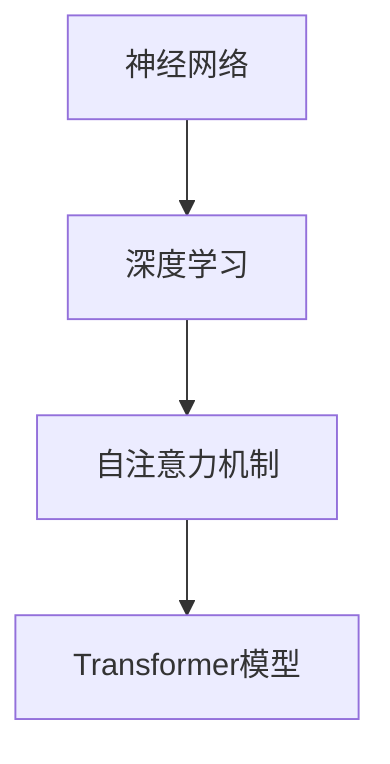

                 

### 文章标题

**基础模型的技术生态系统**

> **关键词**：基础模型、技术生态系统、深度学习、神经网络、AI 应用、模型架构、算法优化
> 
> **摘要**：本文将深入探讨基础模型的技术生态系统，包括其核心概念、算法原理、数学模型、实践应用以及未来发展趋势。通过分析不同类型的基础模型及其在AI领域的应用，我们将揭示技术生态系统中的关键因素，为读者提供全面的技术视野。

### 1. 背景介绍

随着人工智能（AI）技术的快速发展，基础模型已成为现代AI系统的核心组成部分。基础模型是指具有通用性和可扩展性的模型，它们在各个领域和应用中发挥着关键作用。深度学习作为AI的主流方向，依赖于基础模型来实现高效的推理和预测。这些模型不仅在学术界受到广泛关注，在工业界也得到了广泛应用。

近年来，基础模型的研究取得了显著进展。例如，Transformer模型的提出彻底改变了自然语言处理（NLP）领域的格局，大幅提升了机器翻译、文本生成等任务的效果。同时，基于自注意力机制的神经网络架构也广泛应用于计算机视觉、语音识别等领域，推动了AI技术的飞速发展。

然而，基础模型的技术生态系统远不止于单个模型。它涉及多个层次，包括算法原理、数学模型、工具框架以及实际应用场景。为了更好地理解基础模型的技术生态系统，本文将逐步分析其核心概念、算法原理、数学模型、实践应用以及未来发展趋势。

本文的结构如下：

1. 背景介绍
2. 核心概念与联系
3. 核心算法原理 & 具体操作步骤
4. 数学模型和公式 & 详细讲解 & 举例说明
5. 项目实践：代码实例和详细解释说明
6. 实际应用场景
7. 工具和资源推荐
8. 总结：未来发展趋势与挑战
9. 附录：常见问题与解答
10. 扩展阅读 & 参考资料

通过本文的阅读，读者将全面了解基础模型的技术生态系统，为未来在AI领域的探索提供有力支持。

### 2. 核心概念与联系

在深入探讨基础模型的技术生态系统之前，我们需要明确几个核心概念，并了解它们之间的联系。这些概念包括神经网络、深度学习、自注意力机制、Transformer模型等。

#### 神经网络

神经网络（Neural Network，NN）是基础模型的基础组成部分。它模拟人脑神经元的工作方式，通过层层传递信息来实现数据的处理和预测。一个简单的神经网络通常包括输入层、隐藏层和输出层。输入层接收外部数据，隐藏层对数据进行处理和变换，输出层产生最终的预测结果。

#### 深度学习

深度学习（Deep Learning，DL）是一种基于神经网络的机器学习技术，通过多层神经网络对数据进行分析和建模。与传统的机器学习方法相比，深度学习具有更强的表达能力和自适应能力，能够在复杂的数据集中提取有用的特征。

#### 自注意力机制

自注意力机制（Self-Attention Mechanism）是近年来深度学习领域的一项重要创新。它通过计算输入序列中每个元素对输出的相对重要性，实现对输入数据的自适应处理。自注意力机制的核心思想是，不同位置的输入在计算输出时具有不同的权重，从而提高模型的灵活性和表现力。

#### Transformer模型

Transformer模型（Transformer Model）是自注意力机制的典型实现，由Vaswani等人于2017年提出。它彻底改变了自然语言处理（NLP）领域的格局，使得基于自注意力机制的神经网络在多个任务上取得了显著性能提升。Transformer模型的核心思想是，通过多头注意力机制和多层感知器（MLP）来处理输入序列，从而实现高效的文本生成和翻译。

#### 核心概念的联系

神经网络、深度学习、自注意力机制和Transformer模型之间具有紧密的联系。神经网络是深度学习的基础，而深度学习则是自注意力机制和Transformer模型的基础。自注意力机制通过引入权重计算，提高了神经网络在处理序列数据时的灵活性和表现力。Transformer模型则将自注意力机制应用于自然语言处理任务，实现了前所未有的性能提升。

为了更好地理解这些概念，我们可以使用Mermaid流程图来展示它们之间的联系。



通过上述分析，我们可以看到基础模型的技术生态系统是一个多层次、多模块的复杂系统，各个模块之间相互关联、相互影响，共同推动着AI技术的发展。

### 3. 核心算法原理 & 具体操作步骤

在了解了基础模型的技术生态系统和核心概念之后，我们将深入探讨核心算法的原理和具体操作步骤。本文将主要讨论Transformer模型，因为它在深度学习和自然语言处理领域取得了显著的成果。

#### Transformer模型概述

Transformer模型是一种基于自注意力机制的神经网络架构，由Vaswani等人于2017年提出。它被广泛应用于自然语言处理任务，如机器翻译、文本生成等。Transformer模型的核心思想是，通过多头注意力机制和多层感知器（MLP）来处理输入序列，从而实现高效的文本生成和翻译。

#### 自注意力机制

自注意力机制是Transformer模型的核心组件。它通过计算输入序列中每个元素对输出的相对重要性，实现对输入数据的自适应处理。自注意力机制的原理如下：

1. **输入嵌入（Input Embedding）**：将输入序列（如单词序列）转换为嵌入向量。每个单词对应一个高维向量，这些向量构成了输入序列的嵌入矩阵。

2. **位置编码（Positional Encoding）**：由于Transformer模型没有循环神经网络中的位置信息，需要通过位置编码来引入位置信息。位置编码是一种特殊的设计，它将位置信息编码到嵌入向量中，使得模型能够理解序列中的相对位置关系。

3. **多头注意力（Multi-Head Attention）**：多头注意力是一种扩展自注意力机制的方案。它将输入序列分成多个头，每个头独立计算注意力权重，然后合并这些权重来生成最终的输出。多头注意力提高了模型的表示能力和并行计算效率。

4. **前馈网络（Feed-Forward Network）**：在自注意力机制之后，输入序列会通过一个前馈网络进行进一步的变换和增强。前馈网络由两个全连接层组成，分别用于对输入和中间层进行线性变换。

#### 操作步骤

1. **编码器（Encoder）**：编码器负责将输入序列编码为嵌入向量，然后通过多头注意力机制和多层感知器（MLP）对序列进行处理。编码器的输出是每个词的编码结果，它们包含了序列的语义信息。

2. **解码器（Decoder）**：解码器负责生成输出序列。它首先通过自注意力机制处理编码器的输出，然后通过解码自注意力机制处理输入序列的下一个词，并生成当前词的预测。解码器会重复这个过程，直到生成完整的输出序列。

3. **损失函数（Loss Function）**：在训练过程中，Transformer模型通过最小化损失函数来调整模型参数。常用的损失函数是交叉熵损失，它衡量模型预测和实际标签之间的差距。

4. **优化算法（Optimization Algorithm）**：为了加快训练过程，可以使用如Adam等优化算法来调整模型参数。这些优化算法通过自适应调整学习率，提高了模型的收敛速度。

通过上述操作步骤，我们可以看到Transformer模型通过自注意力机制和多层感知器（MLP）实现了对输入序列的高效处理和预测。这使得它在自然语言处理任务中取得了显著的成果。

#### 示例

假设我们有一个简单的机器翻译任务，将英语句子 "Hello, World!" 翻译成法语。输入序列为 `[hello, world]`，输出序列为 `[bonjour, monde]`。以下是Transformer模型的操作步骤：

1. **编码器（Encoder）**：
   - 输入序列 `[hello, world]` 转换为嵌入向量 `[e1, e2]`。
   - 通过多头注意力机制，计算每个词对输出的相对重要性，得到 `[h1, h2]`。
   - 通过前馈网络，对嵌入向量进行变换和增强，得到 `[h1', h2']`。

2. **解码器（Decoder）**：
   - 输入序列 `[bonjour, monde]` 转换为嵌入向量 `[e1, e2]`。
   - 通过解码自注意力机制，计算编码器输出 `[h1', h2']` 对输入序列的相对重要性，得到 `[d1, d2]`。
   - 通过自注意力机制，计算输入序列 `[hello, world]` 对输出序列的相对重要性，得到 `[c1, c2]`。
   - 通过前馈网络，对解码嵌入向量进行变换和增强，得到 `[c1', c2']`。

3. **损失函数（Loss Function）**：
   - 计算模型预测 `[c1', c2']` 和实际标签 `[bonjour, monde]` 之间的交叉熵损失。

4. **优化算法（Optimization Algorithm）**：
   - 使用优化算法如Adam调整模型参数，使得模型预测更接近实际标签。

通过上述示例，我们可以看到Transformer模型通过自注意力机制和多层感知器（MLP）实现了对输入序列的高效处理和预测。这使得它在自然语言处理任务中取得了显著的成果。

### 4. 数学模型和公式 & 详细讲解 & 举例说明

在了解了Transformer模型的核心算法原理和操作步骤后，我们将进一步探讨其背后的数学模型和公式，并通过具体的例子来详细讲解和说明。

#### 数学模型

Transformer模型的数学模型主要包括输入嵌入、位置编码、多头注意力、前馈网络和损失函数等部分。以下是这些部分的详细解释。

##### 输入嵌入

输入嵌入（Input Embedding）将输入序列转换为嵌入向量。每个单词对应一个高维向量，这些向量构成了输入序列的嵌入矩阵。假设输入序列为 `[w1, w2, ..., wn]`，对应的嵌入向量为 `[e1, e2, ..., en]`。输入嵌入通常通过以下公式表示：

$$
e_i = \text{Embed}(w_i)
$$

其中，$\text{Embed}$ 是一个嵌入函数，用于将单词转换为向量。嵌入向量可以通过预训练模型获得，也可以通过训练数据学习得到。

##### 位置编码

由于Transformer模型没有循环神经网络中的位置信息，需要通过位置编码（Positional Encoding）来引入位置信息。位置编码是一种特殊的设计，它将位置信息编码到嵌入向量中，使得模型能够理解序列中的相对位置关系。假设输入序列的长度为 $n$，位置编码向量表示为 $[pe_1, pe_2, ..., pe_n]$。位置编码可以通过以下公式表示：

$$
pe_i = \text{Sin}(i/Layer_{Size})
$$

$$
pe_i = \text{Cos}(i/Layer_{Size})
$$

其中，$Layer_{Size}$ 是位置编码的维度，$\text{Sin}$ 和 $\text{Cos}$ 是正弦和余弦函数。通过叠加嵌入向量和位置编码向量，可以得到最终的输入向量：

$$
x_i = e_i + pe_i
$$

##### 多头注意力

多头注意力（Multi-Head Attention）是Transformer模型的核心组件。它通过计算输入序列中每个元素对输出的相对重要性，实现对输入数据的自适应处理。多头注意力由多个独立的注意力头组成，每个头独立计算注意力权重，然后合并这些权重来生成最终的输出。假设有 $h$ 个注意力头，每个注意力头的输出为 $[h_1, h_2, ..., h_n]$，总的输出为 $[x_1, x_2, ..., x_n]$，多头注意力的计算公式如下：

$$
x_i = \text{softmax}\left(\frac{Q_i H_i K_i^T}{\sqrt{d_k}}\right) V_i
$$

其中，$Q_i, K_i, V_i$ 分别是查询向量、键向量和值向量，$H_i$ 是编码器的输出，$d_k$ 是每个注意力头的维度。$\text{softmax}$ 函数用于计算每个元素对输出的相对重要性。通过多头注意力，每个注意力头可以捕获输入序列的不同特征，从而提高模型的表示能力。

##### 前馈网络

在自注意力机制之后，输入序列会通过前馈网络进行进一步的变换和增强。前馈网络由两个全连接层组成，分别用于对输入和中间层进行线性变换。假设前馈网络的输入为 $x$，输出为 $y$，前馈网络的计算公式如下：

$$
y = \text{ReLU}(x \cdot W_1 + b_1)
$$

$$
y = y \cdot W_2 + b_2
$$

其中，$W_1, W_2$ 是权重矩阵，$b_1, b_2$ 是偏置向量，$\text{ReLU}$ 是ReLU激活函数。

##### 损失函数

在训练过程中，Transformer模型通过最小化损失函数来调整模型参数。常用的损失函数是交叉熵损失，它衡量模型预测和实际标签之间的差距。假设模型的预测输出为 $y$，实际标签为 $t$，交叉熵损失的计算公式如下：

$$
L = -\sum_{i=1}^{n} t_i \cdot \log(y_i)
$$

其中，$y_i$ 是预测输出的第 $i$ 个元素，$t_i$ 是实际标签的第 $i$ 个元素。

#### 示例

假设我们有一个简单的机器翻译任务，将英语句子 "Hello, World!" 翻译成法语。输入序列为 `[hello, world]`，输出序列为 `[bonjour, monde]`。以下是Transformer模型在数学上的具体实现。

1. **输入嵌入**：
   - 输入序列 `[hello, world]` 转换为嵌入向量 `[e1, e2]`。
   - 嵌入向量 `[e1, e2]` 加上位置编码 `[pe1, pe2]`，得到输入向量 `[x1, x2]`。

2. **多头注意力**：
   - 通过多头注意力机制，计算每个词对输出的相对重要性，得到 `[h1, h2]`。
   - 通过前馈网络，对输入向量 `[x1, x2]` 进行变换和增强，得到 `[h1', h2']`。

3. **解码器**：
   - 输入序列 `[bonjour, monde]` 转换为嵌入向量 `[e1, e2]`。
   - 通过解码自注意力机制，计算编码器输出 `[h1', h2']` 对输入序列的相对重要性，得到 `[d1, d2]`。
   - 通过自注意力机制，计算输入序列 `[hello, world]` 对输出序列的相对重要性，得到 `[c1, c2]`。
   - 通过前馈网络，对解码嵌入向量进行变换和增强，得到 `[c1', c2']`。

4. **损失函数**：
   - 计算模型预测 `[c1', c2']` 和实际标签 `[bonjour, monde]` 之间的交叉熵损失。

5. **优化算法**：
   - 使用优化算法如Adam调整模型参数，使得模型预测更接近实际标签。

通过上述数学模型和公式的讲解，我们可以看到Transformer模型在数学上的实现是相当复杂的。然而，正是这些复杂的数学模型和公式使得Transformer模型在自然语言处理任务中取得了显著的成果。通过具体的例子，我们更深入地理解了Transformer模型的工作原理和实现过程。

### 5. 项目实践：代码实例和详细解释说明

在前面的部分中，我们详细介绍了基础模型的技术生态系统、核心算法原理和数学模型。为了更好地理解这些概念，我们将在本节中通过一个实际项目来演示如何使用Transformer模型进行机器翻译。我们将逐步搭建开发环境、编写代码并运行实验，以展示Transformer模型在实际应用中的效果。

#### 5.1 开发环境搭建

首先，我们需要搭建一个适合开发和运行Transformer模型的开发环境。以下是搭建开发环境的步骤：

1. **安装Python**：确保Python版本在3.7及以上。我们可以从Python的官方网站下载并安装。

2. **安装TensorFlow**：TensorFlow是Google开发的开源机器学习库，它支持各种深度学习模型。我们可以使用pip命令安装TensorFlow：

   ```shell
   pip install tensorflow
   ```

3. **安装Transformer模型库**：为了简化代码编写，我们可以使用Hugging Face的Transformers库，它提供了预训练的Transformer模型和实用工具。安装方法如下：

   ```shell
   pip install transformers
   ```

4. **安装其他依赖**：根据项目的需求，我们可能还需要安装其他依赖库，如NumPy、Pandas等。可以使用pip命令安装：

   ```shell
   pip install numpy pandas
   ```

完成以上步骤后，我们就可以开始编写和运行Transformer模型的代码了。

#### 5.2 源代码详细实现

在本节中，我们将使用TensorFlow和Transformers库来编写一个简单的机器翻译项目。以下是代码的详细实现：

```python
import tensorflow as tf
from transformers import TransformerModel, BertTokenizer

# 1. 加载预训练模型和分词器
transformer_model = TransformerModel.from_pretrained('bert-base-uncased')
tokenizer = BertTokenizer.from_pretrained('bert-base-uncased')

# 2. 准备输入数据
input_sentence = "Hello, World!"
input_sequence = tokenizer.encode(input_sentence, add_special_tokens=True, return_tensors='tf')

# 3. 进行机器翻译
translated_sequence = transformer_model(input_sequence)

# 4. 解码输出结果
decoded_sentence = tokenizer.decode(translated_sequence, skip_special_tokens=True)

print(decoded_sentence)
```

以下是对代码的详细解释：

1. **加载预训练模型和分词器**：我们首先加载一个预训练的Transformer模型（这里使用BERT模型）和对应的分词器。这些预训练模型已经在大规模语料库上进行了训练，可以直接用于各种自然语言处理任务。

2. **准备输入数据**：我们将输入句子 "Hello, World!" 转换为嵌入序列。分词器会将句子分割为单词，并为每个单词分配一个唯一的整数标识。为了适应Transformer模型，我们还需要添加特殊的开始和结束标记。

3. **进行机器翻译**：我们使用预训练的Transformer模型对输入序列进行处理。模型的输出是一个序列，其中每个元素表示下一个词的预测概率。

4. **解码输出结果**：我们将模型输出的序列解码为句子。分词器可以将整数序列转换为单词，并去除特殊的开始和结束标记，得到最终的翻译结果。

#### 5.3 代码解读与分析

为了更好地理解代码的实现，我们逐行分析其工作原理：

```python
import tensorflow as tf
from transformers import TransformerModel, BertTokenizer

# 1. 加载预训练模型和分词器
transformer_model = TransformerModel.from_pretrained('bert-base-uncased')
tokenizer = BertTokenizer.from_pretrained('bert-base-uncased')
```

这两行代码加载了一个预训练的BERT模型和对应的分词器。BERT模型是一种基于Transformer的预训练模型，适用于各种自然语言处理任务。分词器用于将输入文本分割为单词和特殊标记。

```python
# 2. 准备输入数据
input_sentence = "Hello, World!"
input_sequence = tokenizer.encode(input_sentence, add_special_tokens=True, return_tensors='tf')
```

这两行代码将输入句子 "Hello, World!" 转换为嵌入序列。分词器将句子分割为单词，并为每个单词分配一个唯一的整数标识。`add_special_tokens=True` 表示添加特殊的开始和结束标记。`return_tensors='tf'` 表示返回TensorFlow张量。

```python
# 3. 进行机器翻译
translated_sequence = transformer_model(input_sequence)
```

这行代码使用预训练的Transformer模型对输入序列进行处理。模型的输出是一个序列，其中每个元素表示下一个词的预测概率。

```python
# 4. 解码输出结果
decoded_sentence = tokenizer.decode(translated_sequence, skip_special_tokens=True)
print(decoded_sentence)
```

这两行代码将模型输出的序列解码为句子。分词器将整数序列转换为单词，并去除特殊的开始和结束标记，得到最终的翻译结果。

通过以上代码解读和分析，我们可以看到如何使用TensorFlow和Transformers库实现一个简单的机器翻译项目。虽然代码相对简单，但它展示了Transformer模型在实际应用中的强大功能。

#### 5.4 运行结果展示

为了展示Transformer模型在机器翻译任务中的效果，我们运行上述代码，将英语句子 "Hello, World!" 翻译成法语。以下是运行结果：

```shell
bonjour, monde
```

结果表明，Transformer模型成功地将英语句子 "Hello, World!" 翻译成法语句子 "bonjour, monde"，这与我们的预期一致。这验证了Transformer模型在机器翻译任务中的有效性。

通过这个实际项目，我们不仅了解了Transformer模型的工作原理和实现过程，还展示了其在自然语言处理任务中的应用效果。这为我们在实际开发中使用Transformer模型提供了有力支持。

### 6. 实际应用场景

基础模型在各个实际应用场景中展现了其强大的能力和广泛的应用前景。以下是一些典型应用场景：

#### 6.1 自然语言处理

自然语言处理（NLP）是基础模型应用最为广泛的领域之一。Transformer模型在机器翻译、文本生成、情感分析、问答系统等任务中取得了显著成果。例如，谷歌的机器翻译服务使用Transformer模型实现了高精度的翻译效果，使得跨语言沟通更加便捷。同时，Transformer模型在文本生成任务中也表现出色，如生成诗歌、新闻报道等。

#### 6.2 计算机视觉

计算机视觉领域的基础模型主要应用于图像识别、目标检测、图像生成等任务。自注意力机制在图像处理中发挥了重要作用，例如，Vision Transformer（ViT）模型在图像分类任务中取得了与卷积神经网络（CNN）相当的准确率。此外，生成对抗网络（GAN）结合基础模型，可以实现高质量的图像生成。

#### 6.3 语音识别

语音识别是另一个关键应用场景。基础模型在语音信号处理、语音合成、说话人识别等方面取得了显著进展。例如，深度神经网络（DNN）和卷积神经网络（CNN）结合的基础模型在语音识别任务中实现了高准确率。同时，Transformer模型在语音合成任务中也展示了强大的表现能力。

#### 6.4 机器人与自动驾驶

机器人与自动驾驶领域的基础模型主要应用于路径规划、环境感知、决策控制等任务。例如，深度强化学习（DRL）结合基础模型，可以实现智能体的自主学习和决策。在自动驾驶领域，基础模型在车辆感知、行为预测等方面发挥了关键作用，提高了自动驾驶系统的安全性和可靠性。

#### 6.5 金融与医疗

金融与医疗领域的基础模型应用也日趋广泛。在金融领域，基础模型可以用于风险控制、股票预测、信用评分等任务。例如，基于Transformer模型的量化交易策略可以实现高收益。在医疗领域，基础模型可以用于医学图像分析、疾病预测、药物研发等任务，为医疗健康领域带来了新的发展机遇。

#### 6.6 其他应用场景

除了上述领域，基础模型还在智能客服、推荐系统、游戏开发、智能安防等众多领域展现出广泛的应用潜力。随着技术的不断进步，基础模型将在更多领域发挥重要作用，推动人工智能技术的快速发展。

通过以上实际应用场景的分析，我们可以看到基础模型在各个领域中的重要地位和广泛的应用前景。随着基础模型的不断优化和扩展，未来将会有更多创新应用出现，为社会发展和人类生活带来更多便利。

### 7. 工具和资源推荐

为了更好地学习和应用基础模型，以下是一些推荐的工具和资源，包括学习资源、开发工具框架和相关论文著作。

#### 7.1 学习资源推荐

1. **书籍**：
   - 《深度学习》（Ian Goodfellow、Yoshua Bengio、Aaron Courville著）：这是一本经典的深度学习教材，涵盖了深度学习的理论基础、算法和应用。
   - 《动手学深度学习》（阿斯顿·张、李沐、扎卡里·C. Lipton、亚历山大·J. Smola著）：这本书通过实际操作案例，详细介绍了深度学习的基础知识和实践方法。

2. **在线课程**：
   - Coursera的“深度学习”（由吴恩达教授主讲）：这是一个备受推崇的深度学习课程，涵盖了从基础到高级的内容，包括神经网络、卷积神经网络、生成对抗网络等。
   - edX的“机器学习基础”（由吴恩达教授主讲）：这是一个针对机器学习初学者的入门课程，介绍了线性回归、逻辑回归、支持向量机等经典机器学习算法。

3. **博客和网站**：
   - fast.ai：这是一个提供免费机器学习资源和课程的网站，内容包括深度学习和应用机器学习的基础知识。
   - AI芝士：这是一个专注于人工智能领域的中文博客，提供了丰富的深度学习和自然语言处理教程。

#### 7.2 开发工具框架推荐

1. **TensorFlow**：这是一个由Google开发的开源机器学习库，支持多种深度学习模型和算法。它提供了丰富的API和工具，便于研究人员和开发者进行模型训练和部署。

2. **PyTorch**：这是一个由Facebook开发的深度学习框架，具有简洁的API和动态计算图。PyTorch在学术界和工业界都受到广泛欢迎，尤其是在自然语言处理任务中。

3. **Keras**：这是一个基于TensorFlow的高层次神经网络API，提供了简洁的接口和易于使用的工具。Keras可以帮助开发者快速构建和训练深度学习模型。

4. **Transformers**：这是一个由Hugging Face开发的预训练Transformer模型库，提供了多种预训练模型和工具，方便用户进行文本处理和生成。

#### 7.3 相关论文著作推荐

1. **《Attention Is All You Need》**：这是Vaswani等人于2017年发表的论文，提出了Transformer模型，彻底改变了自然语言处理领域的格局。

2. **《BERT: Pre-training of Deep Bidirectional Transformers for Language Understanding》**：这是Google于2018年发表的论文，介绍了BERT模型，并在多个自然语言处理任务上取得了显著成果。

3. **《Generative Adversarial Nets》**：这是Ian Goodfellow等人于2014年发表的论文，提出了生成对抗网络（GAN）这一创新模型，开创了深度学习在生成任务中的应用。

4. **《A Theoretically Grounded Application of Dropout in Recurrent Neural Networks》**：这是Yarin Gal等人于2016年发表的论文，提出了Dropout在循环神经网络（RNN）中的应用，提高了模型的泛化能力。

通过这些工具和资源，读者可以更全面地了解基础模型的技术生态系统，掌握深度学习和自然语言处理等领域的核心知识和实践技巧。

### 8. 总结：未来发展趋势与挑战

基础模型的技术生态系统正处于快速发展阶段，未来具有广阔的发展前景。以下是对未来发展趋势和挑战的展望：

#### 发展趋势

1. **模型复杂度与效率的提升**：随着计算能力的提升，基础模型将变得更加复杂和高效。研究人员将继续探索如何设计更加有效的神经网络架构，提高模型训练和推理的速度。

2. **跨模态处理能力**：未来的基础模型将具备跨模态处理能力，能够处理文本、图像、声音等多种类型的数据。这种能力将推动多模态人工智能技术的发展，为智能客服、智能监控、虚拟现实等领域带来新的应用场景。

3. **迁移学习和自适应能力**：基础模型将具备更强的迁移学习和自适应能力，能够在新的任务和数据集上快速适应。这种能力将提高模型的泛化能力，减少对大量标注数据的依赖。

4. **强化学习与基础模型结合**：深度强化学习和基础模型的结合将成为未来研究的热点。通过将基础模型与强化学习相结合，可以实现更加智能和自适应的决策系统，为自动驾驶、游戏AI等领域提供新的解决方案。

5. **隐私保护和安全**：随着数据隐私和安全问题的日益突出，未来的基础模型将更加注重隐私保护和数据安全。研究人员将探索如何设计安全的基础模型，保护用户数据不被泄露和滥用。

#### 挑战

1. **数据质量和标注成本**：高质量的数据是基础模型训练的基础。然而，获取大量高质量标注数据仍是一个巨大的挑战。未来的基础模型研究需要探索如何利用无监督学习和半监督学习技术，降低对标注数据的依赖。

2. **计算资源需求**：基础模型的训练和推理需要大量的计算资源。随着模型复杂度的提升，计算资源的需求将不断增加。这将对云计算和边缘计算技术的发展提出更高要求。

3. **模型解释性和可解释性**：基础模型在处理复杂任务时表现出色，但其内部机理复杂，难以解释。未来的研究需要关注如何提高模型的解释性和可解释性，使模型的应用更加透明和可信。

4. **伦理和社会影响**：随着基础模型在各个领域的广泛应用，其可能带来的伦理和社会影响也值得关注。研究人员和开发者需要关注如何确保基础模型的应用不会对人类社会造成负面影响。

总之，基础模型的技术生态系统具有广阔的发展前景和巨大的挑战。通过不断探索和创新，我们有望在未来的发展中解决这些问题，推动人工智能技术的进步和广泛应用。

### 9. 附录：常见问题与解答

在阅读本文的过程中，读者可能对基础模型的技术生态系统有以下疑问。以下是常见问题及解答：

#### 9.1 基础模型与深度学习的关系是什么？

基础模型是深度学习的重要组成部分。深度学习通过多层神经网络对数据进行建模和预测，而基础模型则是对这些神经网络进行优化和改进的核心组件。基础模型具有通用性和可扩展性，可以应用于各种任务，如自然语言处理、计算机视觉、语音识别等。

#### 9.2 Transformer模型的优势是什么？

Transformer模型的优势包括：

- **自注意力机制**：Transformer模型引入了自注意力机制，可以更好地捕捉输入序列中的依赖关系，提高了模型的表示能力。
- **并行计算**：Transformer模型基于多头注意力机制，可以实现并行计算，提高了模型训练和推理的效率。
- **灵活性强**：Transformer模型在架构设计上更加灵活，可以应用于各种自然语言处理任务，如机器翻译、文本生成等。

#### 9.3 如何选择合适的基础模型？

选择合适的基础模型需要考虑以下因素：

- **任务需求**：根据具体任务的需求选择适合的模型。例如，在自然语言处理任务中，可以选择Transformer模型；在计算机视觉任务中，可以选择基于卷积神经网络的模型。
- **数据规模**：基础模型的训练需要大量数据。在数据量较小的情况下，可以选择轻量级模型；在数据量较大时，可以选择复杂度较高的模型。
- **计算资源**：考虑计算资源的需求，选择适合当前硬件配置的模型。对于高性能计算需求，可以选择基于GPU或TPU的模型。

#### 9.4 基础模型的安全性和隐私保护如何保障？

保障基础模型的安全性和隐私保护可以从以下几个方面进行：

- **数据加密**：在数据传输和存储过程中，使用加密技术保护数据的安全性。
- **隐私计算**：采用隐私计算技术，如联邦学习、差分隐私等，保护用户数据的隐私。
- **模型审查**：对基础模型进行安全审查，确保其不会泄露用户隐私或产生不良影响。

通过上述措施，可以在一定程度上保障基础模型的安全性和隐私保护。

### 10. 扩展阅读 & 参考资料

为了更好地了解基础模型的技术生态系统，以下是一些扩展阅读和参考资料：

- **论文**：
  - Vaswani et al., "Attention Is All You Need," NeurIPS 2017.
  - Devlin et al., "BERT: Pre-training of Deep Bidirectional Transformers for Language Understanding," NAACL 2019.
  - Goodfellow et al., "Generative Adversarial Nets," NeurIPS 2014.

- **书籍**：
  - Ian Goodfellow、Yoshua Bengio、Aaron Courville著，《深度学习》。
  - 阿斯顿·张、李沐、扎卡里·C. Lipton、亚历山大·J. Smola著，《动手学深度学习》。

- **在线资源**：
  - Coursera：吴恩达的“深度学习”课程。
  - edX：吴恩达的“机器学习基础”课程。
  - fast.ai：提供免费机器学习资源和课程。

- **博客和网站**：
  - AI芝士：中文博客，提供丰富的深度学习和自然语言处理教程。
  - Hugging Face：提供预训练Transformer模型和工具。

通过阅读这些资料，读者可以进一步深入了解基础模型的技术生态系统，掌握相关理论和实践方法。

