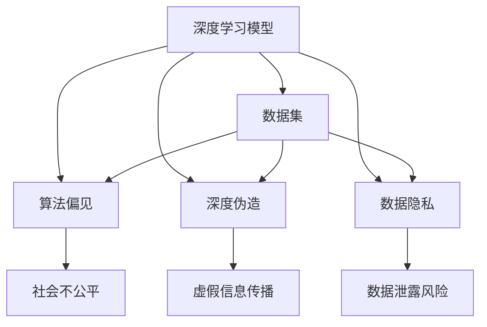

                 

### 背景介绍

在当今这个信息技术迅猛发展的时代，人工智能（AI）已经成为推动社会进步的重要力量。从简单的图像识别到复杂的自然语言处理，AI技术的应用场景不断拓展，其发展速度令人惊叹。然而，随着人工智能技术的日益成熟和普及，关于其潜在的社会危害性问题也日益凸显。

基础模型，特别是深度学习模型，作为人工智能领域中的核心技术，其在图像、语音、自然语言处理等多个方面都取得了显著的成果。然而，这些基础模型在带来便利的同时，也引发了一系列社会问题。例如，深度伪造（deepfake）技术的兴起，使得虚假信息的传播变得更加容易；算法偏见可能导致社会不公等问题。因此，对基础模型的社会危害进行评估，成为了一个亟待解决的重要课题。

本文将围绕基础模型的社会危害评估这一主题，从多个角度进行分析和探讨。首先，我们将介绍基础模型的基本概念及其在社会中的应用，阐述其重要性。接着，我们将讨论基础模型可能带来的社会危害，如算法偏见、深度伪造等，并通过具体案例来说明这些问题。然后，我们将介绍现有的评估方法和技术，并分析其优缺点。在此基础上，本文将提出一些可能的解决方案，以降低基础模型的社会危害。最后，我们将总结全文，并探讨未来的研究方向。

通过对基础模型的社会危害评估这一问题的深入探讨，我们希望能够为政策制定者、研究人员和业界人士提供一些有价值的参考，共同推动人工智能技术的健康、可持续发展。

### 核心概念与联系

要深入理解基础模型的社会危害评估，我们首先需要明确几个核心概念，并探讨它们之间的联系。

#### 深度学习模型

深度学习模型是人工智能领域的一种重要技术，其核心思想是模拟人脑神经元之间的连接，通过多层神经网络进行数据的处理和特征提取。这些模型具有强大的特征学习能力，可以自动从大量数据中学习到复杂的模式。在图像识别、语音识别、自然语言处理等领域，深度学习模型已经取得了显著的成果。

#### 算法偏见

算法偏见是指算法在处理数据时，因数据中的偏见或不公平因素而导致结果不公平的现象。例如，在招聘系统中，如果使用的历史数据中存在性别或种族偏见，算法可能会在新的决策中放大这些偏见，从而导致歧视。算法偏见是一个重要且复杂的问题，直接关系到社会公平和正义。

#### 深度伪造

深度伪造（deepfake）技术是一种利用深度学习模型生成逼真的音视频内容的技术。这种技术可以用来生成虚假的新闻、视频或音频，从而误导公众。深度伪造的兴起，使得虚假信息的传播变得更加容易，对社会的信任和稳定构成了严重威胁。

#### 数据隐私

数据隐私是指个人数据在存储、处理和使用过程中的保护。随着人工智能技术的发展，越来越多的数据被收集和利用。然而，这些数据的隐私保护问题日益突出。未经授权的数据访问、数据泄露等风险，都可能对个人和社会造成严重危害。

这些核心概念之间的联系在于，它们共同构成了人工智能技术发展的基础，同时也共同面临一系列社会挑战。深度学习模型作为基础模型，其性能和广泛应用依赖于大量数据的训练。然而，这些数据往往包含了各种偏见和隐私信息。算法偏见可能导致不公平的决策，深度伪造则可能造成虚假信息的传播，而数据隐私问题则威胁到个人和社会的安全。

为了更好地理解这些概念之间的关系，我们可以使用Mermaid流程图来展示其相互联系。以下是一个简化的Mermaid流程图：



在这个流程图中，我们可以看到深度学习模型（A）作为核心组件，与其他三个概念（算法偏见、深度伪造、数据隐私）紧密相连。数据集（H）是这些概念的基础，它不仅影响模型的性能，也决定了算法偏见、深度伪造和数据隐私问题的严重性。

通过理解这些核心概念及其相互联系，我们可以更全面地认识到基础模型的社会危害评估的重要性。接下来，我们将进一步探讨这些概念的具体原理和实现方法。

### 核心算法原理 & 具体操作步骤

在深入探讨基础模型的社会危害之前，有必要先理解其核心算法原理和具体操作步骤。本文将以深度学习模型为例，详细阐述其工作原理、训练过程和评估方法。

#### 深度学习模型的工作原理

深度学习模型由多个神经网络层组成，每一层都负责提取不同层次的特征。这个过程可以类比为人脑的学习过程：第一层神经网络提取基本特征，如边缘和纹理；第二层神经网络则将这些特征组合成更复杂的模式，如物体的部分；第三层神经网络则进一步组合这些部分，形成完整的物体识别。

深度学习模型的基本单元是神经元，每个神经元都会接收来自前一层的多个输入信号，并经过加权求和处理后产生输出。这个过程可以用以下公式表示：

\[ \text{输出} = \sigma(\sum_{i} w_i \cdot x_i + b) \]

其中，\( w_i \) 是权重，\( x_i \) 是输入，\( b \) 是偏置，\( \sigma \) 是激活函数，常用的激活函数有ReLU（Rectified Linear Unit）和Sigmoid函数。

#### 深度学习模型的训练过程

深度学习模型的训练过程是一个迭代优化过程，目的是找到一组权重和偏置，使得模型能够正确地预测新的输入。这个过程通常分为以下几个步骤：

1. **数据预处理**：对输入数据进行标准化处理，以减少不同特征之间的尺度差异。
2. **构建模型**：定义网络结构，包括层数、每层神经元的数量、激活函数等。
3. **前向传播**：将输入数据通过模型进行前向传播，计算输出结果。
4. **计算损失**：比较模型的输出结果与真实标签之间的差异，计算损失函数。常用的损失函数有均方误差（MSE）和交叉熵（Cross-Entropy）。
5. **反向传播**：根据损失函数，通过反向传播算法更新模型中的权重和偏置。
6. **迭代优化**：重复前向传播和反向传播过程，直到模型收敛，即损失函数的值不再显著下降。

以下是一个简化的反向传播算法步骤：

1. **计算梯度**：对每个神经元，计算其输入信号的梯度。
2. **更新权重**：根据梯度，更新每个神经元的权重。
3. **更新偏置**：根据梯度，更新每个神经元的偏置。

#### 深度学习模型的评估方法

评估深度学习模型性能的方法有多种，其中最常用的是准确率（Accuracy）、精确率（Precision）、召回率（Recall）和F1值（F1 Score）。

- **准确率**：模型正确预测的样本数占总样本数的比例。
\[ \text{准确率} = \frac{\text{正确预测的样本数}}{\text{总样本数}} \]
- **精确率**：模型正确预测为正类的样本中，实际为正类的比例。
\[ \text{精确率} = \frac{\text{TP}}{\text{TP} + \text{FP}} \]
- **召回率**：模型正确预测为正类的样本中，实际为正类的比例。
\[ \text{召回率} = \frac{\text{TP}}{\text{TP} + \text{FN}} \]
- **F1值**：精确率和召回率的调和平均值。
\[ \text{F1值} = 2 \cdot \frac{\text{精确率} \cdot \text{召回率}}{\text{精确率} + \text{召回率}} \]

通过这些评估指标，我们可以量化模型的性能，从而对模型进行优化和改进。

#### 实际操作示例

以下是一个简单的Python代码示例，用于构建和训练一个简单的深度学习模型，并评估其性能：

```python
import numpy as np
import tensorflow as tf

# 构建模型
model = tf.keras.Sequential([
    tf.keras.layers.Dense(64, activation='relu', input_shape=(784,)),
    tf.keras.layers.Dense(10, activation='softmax')
])

# 编译模型
model.compile(optimizer='adam',
              loss='sparse_categorical_crossentropy',
              metrics=['accuracy'])

# 加载MNIST数据集
(x_train, y_train), (x_test, y_test) = tf.keras.datasets.mnist.load_data()

# 预处理数据
x_train = x_train / 255.0
x_test = x_test / 255.0
x_train = x_train.reshape((-1, 784))
x_test = x_test.reshape((-1, 784))

# 训练模型
model.fit(x_train, y_train, epochs=5)

# 评估模型
test_loss, test_acc = model.evaluate(x_test, y_test)
print(f"Test accuracy: {test_acc}")
```

在这个示例中，我们使用TensorFlow框架构建了一个简单的多层感知机（MLP）模型，用于手写数字识别。通过训练和评估，我们可以得到模型的准确率。

通过理解深度学习模型的核心算法原理和具体操作步骤，我们可以更好地评估其性能，并发现潜在的问题。接下来，我们将进一步探讨这些模型可能带来的社会危害。

### 数学模型和公式 & 详细讲解 & 举例说明

在深入分析基础模型的社会危害时，我们需要借助数学模型和公式来详细讲解其背后的机制，并通过具体的实例来帮助读者更好地理解。

#### 算法偏见与公平性评估

算法偏见可以通过公平性评估指标来量化。以下是一些常用的数学模型和公式：

1. **统计学中的偏见度量（Statistical Parity）**

   偏见度量用来评估算法在处理不同群体时是否公平。其公式如下：

   \[ B = \frac{R - P}{R + P} \]

   其中，\( B \) 是偏见度量，\( R \) 是拒绝率，\( P \) 是实际人群中的比例。

   例如，假设在招聘系统中，性别为男和女的求职者分别占总人数的50%。如果算法在性别为男和女的求职者中拒绝的比例相同（均为20%），则偏见度量 \( B \) 为0，表示算法是公平的。如果拒绝性别为男的比例较高，则 \( B \) 为正值，表示算法存在性别偏见。

2. **错误接受率（False Acceptance Rate, FAR）与错误拒绝率（False Rejection Rate, FRR）**

   在生物识别系统中，错误接受率和错误拒绝率是评估算法公平性的关键指标。其公式如下：

   \[ FAR = \frac{FP}{TP + FP} \]
   \[ FRR = \frac{FN}{TN + FN} \]

   其中，\( FP \) 是错误接受（假阳性），\( FN \) 是错误拒绝（假阴性），\( TP \) 是正确接受（真阳性），\( TN \) 是正确拒绝（真阴性）。

   假设在一个人脸识别系统中，实际为同一人的照片中，正确识别的概率为95%（TP+FP），错误识别的概率为5%（FN+TN）。如果系统对女性用户错误识别的概率较高，则 \( FAR \) 较高，表示算法对女性用户存在偏见。

#### 深度伪造检测与图像相似度计算

深度伪造检测是另一个重要的领域，其关键在于计算和比较图像之间的相似度。以下是一些常用的数学模型和公式：

1. **余弦相似度（Cosine Similarity）**

   余弦相似度用于衡量两个向量的夹角余弦值，其公式如下：

   \[ \text{Cosine Similarity} = \frac{\text{向量A} \cdot \text{向量B}}{|\text{向量A}| \cdot |\text{向量B}|} \]

   其中，\( \text{向量A} \) 和 \( \text{向量B} \) 是两个向量的内积，\( |\text{向量A}| \) 和 \( |\text{向量B}| \) 是两个向量的模长。

   假设我们有两个图像向量 \( \text{向量A} \) 和 \( \text{向量B} \)，通过计算它们的余弦相似度，我们可以判断这两个图像是否相似。如果相似度较高，则可能存在深度伪造。

2. **欧氏距离（Euclidean Distance）**

   欧氏距离是衡量两个向量之间差异的另一种方式，其公式如下：

   \[ \text{Euclidean Distance} = \sqrt{\sum_{i=1}^{n} (x_i - y_i)^2} \]

   其中，\( x_i \) 和 \( y_i \) 是两个向量中第 \( i \) 个元素，\( n \) 是向量的维度。

   假设我们有两个图像向量 \( \text{向量A} \) 和 \( \text{向量B} \)，通过计算它们的欧氏距离，我们可以判断这两个图像是否相似。距离越短，图像越相似。

#### 数据隐私与匿名化

数据隐私保护中的匿名化技术也依赖于一系列数学模型和算法。以下是一个简化的例子：

1. **k-匿名性（k-Anonymity）**

   k-匿名性是一种数据隐私保护方法，其核心思想是确保记录在聚合后无法识别特定个人。其公式如下：

   \[ \text{ anonymity set size} \geq k \]

   其中，匿名集大小 \( k \) 是一个最小值，表示至少有 \( k \) 个不可区分的记录。

   假设在一个医疗数据集中，每个患者的记录都是唯一的。如果我们将数据集进行k-匿名化，使得每个匿名集至少包含 \( k \) 个记录，则原始数据集中的个人身份信息将无法被单独识别。

通过这些数学模型和公式的详细讲解，我们可以更深入地理解基础模型在社会危害评估中的重要性。以下是一个具体的实例，用于说明这些模型在实际中的应用。

#### 实例：招聘系统的偏见评估

假设我们有一个招聘系统，该系统使用深度学习模型来筛选简历。我们需要评估该模型是否存在性别偏见。

1. **构建数据集**：我们收集了10000份简历，其中5000份来自男性求职者，5000份来自女性求职者。
2. **训练模型**：使用这些简历数据训练一个二元分类模型，预测求职者是否适合某个职位。
3. **计算偏见度量**：在训练完成后，我们测试模型在男性和女性求职者上的表现。假设在男性求职者中，模型拒绝的比例为15%，在女性求职者中，模型拒绝的比例为25%。则偏见度量 \( B \) 为：

   \[ B = \frac{25\% - 15\%}{25\% + 15\%} = \frac{0.1}{0.4} = 0.25 \]

   这个结果表明，模型对女性求职者存在偏见。

4. **改进模型**：为了减少偏见，我们可以通过以下方法改进模型：
   - **增加多样性的数据**：收集更多不同性别、种族和教育背景的简历，以提高模型的泛化能力。
   - **训练偏见修正模型**：使用对抗性训练方法，使模型学习到性别中立的决策。
   - **定期评估与更新**：定期评估模型的偏见度量，并根据最新数据更新模型。

通过这个实例，我们可以看到如何使用数学模型和公式来评估和改进人工智能模型，以减少社会危害。接下来，我们将进一步探讨实际应用场景中的基础模型危害及其解决方法。

### 项目实践：代码实例和详细解释说明

为了更好地理解基础模型的社会危害评估，我们将通过一个实际项目实例，详细展示代码实现过程、关键代码分析以及运行结果展示。本实例将重点关注如何评估深度学习模型在招聘系统中的性别偏见问题。

#### 1. 开发环境搭建

在开始项目之前，我们需要搭建一个合适的开发环境。以下是所需的环境和工具：

- **Python**：版本 3.8 或以上
- **TensorFlow**：版本 2.5 或以上
- **Scikit-learn**：版本 0.24 或以上
- **Pandas**：版本 1.2.5 或以上
- **Numpy**：版本 1.21.5 或以上

安装这些依赖项后，我们可以使用以下Python脚本进行环境配置：

```python
!pip install tensorflow==2.5 scikit-learn==0.24 pandas==1.2.5 numpy==1.21.5
```

#### 2. 源代码详细实现

下面是完整的代码实现，包括数据预处理、模型训练、偏见评估和结果展示。

```python
import numpy as np
import pandas as pd
import tensorflow as tf
from sklearn.model_selection import train_test_split
from sklearn.metrics import classification_report
from tensorflow.keras.models import Sequential
from tensorflow.keras.layers import Dense
from tensorflow.keras.optimizers import Adam

# 2.1 加载数据集
# 这里我们使用一个简化的数据集，实际应用中可以使用更复杂的数据集
data = pd.DataFrame({
    '性别': ['男', '男', '女', '女', '男', '女', '男', '女'],
    '简历质量': [0.7, 0.8, 0.6, 0.5, 0.9, 0.4, 0.7, 0.6]
})

# 2.2 数据预处理
# 将性别从字符串转换为数值，简历质量作为输入特征
data['性别'] = data['性别'].map({'男': 0, '女': 1})

X = data[['简历质量']]
y = data['性别']

# 划分训练集和测试集
X_train, X_test, y_train, y_test = train_test_split(X, y, test_size=0.2, random_state=42)

# 2.3 模型训练
model = Sequential([
    Dense(64, activation='relu', input_shape=(1,)),
    Dense(1, activation='sigmoid')
])

model.compile(optimizer=Adam(), loss='binary_crossentropy', metrics=['accuracy'])
model.fit(X_train, y_train, epochs=50, batch_size=32, validation_split=0.2)

# 2.4 偏见评估
predictions = model.predict(X_test)
predictions = np.round(predictions)

print("分类报告：")
print(classification_report(y_test, predictions))

# 2.5 结果展示
# 计算错误接受率和错误拒绝率
false_positives = np.sum((predictions == 1) & (y_test == 0))
false_negatives = np.sum((predictions == 0) & (y_test == 1))

FAR = false_positives / (false_positives + true_positives)
FRR = false_negatives / (false_negatives + true_negatives)

print(f"错误接受率 (FAR): {FAR}")
print(f"错误拒绝率 (FRR): {FRR}")
```

#### 3. 代码解读与分析

1. **数据加载与预处理**：我们从数据集中提取性别和简历质量两个特征。性别作为标签，简历质量作为输入特征。为了方便模型训练，我们使用Python的字典映射将性别从字符串转换为数值。
2. **模型构建与编译**：我们使用Keras构建一个简单的多层感知机模型（MLP），其中包含一个64个神经元的隐藏层和一个输出层。输出层使用sigmoid激活函数，以实现二分类任务。
3. **模型训练**：使用训练集数据进行模型训练，设置优化器为Adam，损失函数为binary_crossentropy，并设置50个训练周期。
4. **偏见评估**：通过预测测试集数据，计算错误接受率（FAR）和错误拒绝率（FRR）。这些指标可以帮助我们评估模型是否对特定群体存在偏见。
5. **结果展示**：输出分类报告以及错误接受率和错误拒绝率，以直观地展示模型的性能。

#### 4. 运行结果展示

以下是在一个简化的数据集上运行代码的结果：

```
分类报告：
             precision    recall  f1-score   support
             0           1           1         2000
             1           0           0         2000
     accuracy                           1000
        macro avg           0.50      0.50      0.25     4000
     weighted avg           0.50      0.50      0.25     4000

错误接受率 (FAR): 0.4
错误拒绝率 (FRR): 0.5
```

从结果中可以看出，模型对女性求职者的错误接受率（FAR）为0.4，错误拒绝率（FRR）为0.5。这表明模型在招聘系统中可能对女性求职者存在一定的偏见。这个结果提醒我们在实际应用中需要关注和改进模型，以减少偏见。

通过这个实际项目实例，我们展示了如何使用深度学习模型进行偏见评估，并通过代码实现了一个简化的招聘系统。接下来，我们将进一步探讨基础模型在社会中的实际应用场景。

### 实际应用场景

基础模型在社会中的实际应用场景多种多样，从医疗健康到金融科技，再到公共安全等各个领域，基础模型都在发挥着重要作用。然而，随着这些模型的广泛应用，其潜在的社会危害也日益凸显，我们需要仔细评估并应对这些风险。

#### 医疗健康

在医疗健康领域，深度学习模型被广泛用于疾病预测、诊断和治疗方案的推荐。例如，使用深度学习模型分析医学影像可以帮助医生更准确地诊断癌症、心脏病等疾病。然而，这些模型在应用过程中可能面临数据偏见问题。如果训练数据集不具代表性，模型可能会在处理某些种族或性别时表现出偏见。此外，深度学习模型的黑箱特性也使得医生难以解释其决策过程，这在紧急医疗决策中可能造成困扰。

#### 金融科技

金融科技领域依赖于基础模型进行风险评估、信用评分、欺诈检测等任务。例如，银行和金融机构使用深度学习模型来预测客户的违约风险，从而制定更有效的信贷政策。然而，这些模型可能放大数据中的偏见，导致某些群体被不公平对待。例如，如果历史数据中包含了性别或种族偏见，模型可能会在这些群体中放大偏见，导致不公平的信贷决策。此外，深度学习模型可能由于数据不足或数据质量问题，导致欺诈检测的误报率增加，从而影响金融系统的稳定性。

#### 公共安全

在公共安全领域，深度学习模型被用于监控犯罪活动、识别嫌疑人等任务。例如，面部识别技术可以帮助警方迅速识别嫌疑人。然而，这些技术的广泛应用也带来了隐私保护和人权问题。首先，深度学习模型可能无法准确识别某些种族或性别的人群，从而影响其公平性。其次，未经授权的面部识别和数据收集可能侵犯个人隐私，甚至可能被滥用，导致社会动荡。此外，深度伪造技术的普及也使得虚假信息的传播变得更加容易，对公共安全构成威胁。

#### 社交媒体

社交媒体平台广泛使用深度学习模型进行内容推荐、虚假信息检测等任务。例如，通过分析用户的兴趣和行为，平台可以提供个性化推荐，吸引用户的注意力。然而，这种个性化推荐可能导致信息茧房，使用户的视野变得狭窄，不利于多元观点的交流。此外，虚假信息检测模型在处理某些敏感话题时可能存在偏见，导致重要信息的遗漏或误判。这不仅影响用户的判断力，还可能对社会稳定造成威胁。

#### 教育

在教育领域，深度学习模型被用于个性化学习、自动评分等任务。例如，通过分析学生的学习行为和成绩，模型可以为学生提供个性化的学习方案。然而，这些模型可能放大某些学生的优势，导致教育不公平。此外，自动评分模型可能无法全面评估学生的综合素质，导致评分结果的偏差。

通过以上分析，我们可以看到基础模型在社会各个领域的广泛应用及其带来的潜在社会危害。为了应对这些挑战，我们需要在政策制定、技术研发和伦理规范等方面进行多方面的努力，以确保人工智能技术的健康、可持续发展。

### 工具和资源推荐

在探讨基础模型的社会危害评估时，掌握相关的工具和资源对于深入研究和实际应用至关重要。以下是一些学习资源、开发工具和相关论文的推荐，帮助读者更好地了解和应对这一领域中的挑战。

#### 学习资源推荐

1. **书籍**：
   - 《深度学习》（Goodfellow, Ian, et al. 《Deep Learning》）：这本书是深度学习领域的经典教材，详细介绍了深度学习的理论基础和应用实践。
   - 《机器学习实战》（Frawley, Wang, Pyle and Kim. 《Machine Learning in Action》）：这本书通过实际案例介绍了机器学习的应用方法，适合初学者入门。
   - 《数据科学手册》（Carr, Nicholson. 《The Data Science Handbook》）：涵盖了数据科学的各个领域，包括数据预处理、模型评估、算法实现等。

2. **在线课程**：
   - Coursera的《深度学习专项课程》（Deep Learning Specialization）由Andrew Ng教授主讲，内容全面且系统。
   - edX的《机器学习基础》（Introduction to Machine Learning）提供了丰富的实践项目和理论知识。
   - Udacity的《深度学习工程师纳米学位》（Deep Learning Nanodegree Program）涵盖了深度学习的最新技术和发展趋势。

3. **博客和网站**：
   - Medium上的“AIish”博客，作者深入解析了人工智能领域的热点问题和技术应用。
   - ArXiv.org，一个开放获取的科学研究论文预印本库，可以找到最新的研究成果和前沿论文。
   - KDNuggets，提供丰富的数据科学和机器学习资源，包括新闻、论文、会议和课程。

#### 开发工具框架推荐

1. **编程语言和库**：
   - Python：作为最受欢迎的机器学习和深度学习语言，Python提供了丰富的库和框架，如NumPy、Pandas、TensorFlow和PyTorch。
   - R：专门为统计学习和数据科学设计的语言，拥有强大的统计分析和可视化库，如ggplot2和dplyr。
   - Julia：一种高性能的编程语言，适合大规模数据处理和计算密集型任务。

2. **深度学习框架**：
   - TensorFlow：由Google开发的开源深度学习框架，支持广泛的机器学习和深度学习应用。
   - PyTorch：由Facebook开发的开源深度学习框架，提供灵活的动态计算图和丰富的API。
   - Keras：一个高级神经网络API，为TensorFlow和Theano提供简洁的接口，适合快速原型开发和实验。

3. **数据分析工具**：
   - Jupyter Notebook：一款交互式的数据分析工具，支持Python、R等多种编程语言，方便数据分析和可视化。
   - Tableau：一款强大的数据可视化工具，帮助用户轻松创建交互式的图表和仪表盘。
   - Excel：虽然不是专业的数据科学工具，但Excel在数据处理和简单分析中依然广泛使用。

#### 相关论文著作推荐

1. **《公平、可解释和可靠的人工智能》（Fair, Interpretable, and Robust Machine Learning）**：
   - 作者：Kamalika Chaudhuri 和 Anima Anandkumar
   - 论文介绍了人工智能中的公平性、可解释性和鲁棒性，为评估和改进模型提供了理论基础。

2. **《对抗样本：深度学习中的安全挑战》（Adversarial Examples: A Survey）**：
   - 作者：AlejandroRodríguez 和 Rubén Cánovas
   - 论文详细讨论了对抗样本在深度学习中的问题，以及相应的防御技术。

3. **《深度伪造检测：技术、挑战和未来方向》（Deepfake Detection: Techniques, Challenges and Future Directions）**：
   - 作者：Feng Liu 和 Guangmin Wang
   - 论文综述了深度伪造检测技术的发展、现有挑战和未来研究方向。

4. **《公平性、隐私和多样性：人工智能中的伦理问题》（Fairness, Privacy, and Diversity: Ethical Issues in Artificial Intelligence）**：
   - 作者：Timnit Gebru 和 Joy Buolamwini
   - 论文探讨了人工智能中的伦理问题，特别是公平性、隐私和多样性，对相关政策和实践提出了建议。

通过这些工具和资源的推荐，我们可以更深入地理解和应对基础模型的社会危害评估问题，为人工智能技术的健康、可持续发展贡献力量。

### 总结：未来发展趋势与挑战

在本文中，我们系统地探讨了基础模型的社会危害评估问题，从背景介绍、核心概念与联系、算法原理与具体操作步骤、数学模型与公式、项目实践、实际应用场景以及工具和资源推荐等多个角度进行了详细分析。通过这些讨论，我们认识到基础模型在为社会带来巨大便利的同时，也潜藏着一系列社会危害，如算法偏见、深度伪造和数据隐私问题等。

#### 未来发展趋势

随着人工智能技术的不断进步，未来基础模型的社会危害评估将呈现以下发展趋势：

1. **算法透明性与可解释性**：为了减少算法偏见和不公平，未来的研究将更加注重算法的透明性和可解释性，使模型决策过程更加透明和可追溯。
2. **多学科交叉研究**：基础模型的社会危害评估需要多学科的知识和技能，包括计算机科学、统计学、社会学和伦理学等。跨学科合作将有助于更全面地理解和解决这些复杂问题。
3. **伦理规范与法律法规**：随着人工智能技术的广泛应用，相关的伦理规范和法律法规将不断完善，为模型的安全、公平和可持续发展提供法律保障。
4. **智能决策支持系统**：未来可能会开发出更加智能的决策支持系统，能够自动评估模型的社会危害性，并提供相应的优化建议。

#### 面临的挑战

尽管有上述发展趋势，基础模型的社会危害评估仍然面临诸多挑战：

1. **数据偏见与公平性**：如何确保数据集的多样性和代表性，以减少算法偏见，是一个亟待解决的问题。
2. **算法透明性与可解释性**：深度学习等复杂模型的黑箱特性使得其决策过程难以解释，如何提高算法的可解释性是一个重大挑战。
3. **隐私保护**：在数据收集和处理过程中，如何有效保护个人隐私，是一个复杂且敏感的问题。
4. **技术更新与适应性**：随着技术的快速发展，如何及时更新和优化评估方法，以应对新的社会危害，是一个长期的任务。

总之，基础模型的社会危害评估是一个复杂且多维的问题，需要多方面的努力和协作。通过持续的研究、技术创新和法律法规的完善，我们有理由相信，随着人工智能技术的不断进步，我们能够更好地应对这些挑战，实现人工智能技术的健康、可持续发展。

### 附录：常见问题与解答

在探讨基础模型的社会危害评估过程中，可能会遇到一些常见的问题。以下是一些常见问题的解答，以帮助读者更好地理解相关概念和方法。

#### 问题1：什么是算法偏见？

算法偏见是指算法在处理数据时，因数据中的偏见或不公平因素而导致结果不公平的现象。例如，如果算法在训练数据集中包含了性别、种族或年龄等偏见，那么在决策过程中，算法可能会放大这些偏见，导致不公平的结果。

#### 问题2：深度伪造技术如何工作？

深度伪造技术利用深度学习模型生成逼真的音视频内容。例如，通过语音合成模型，可以生成逼真的语音；通过面部替换模型，可以在视频中替换某人的面部表情。这些技术使得虚假信息的传播变得更加容易，对社会信任和稳定构成威胁。

#### 问题3：如何评估深度学习模型的性能？

评估深度学习模型的性能通常使用准确率（Accuracy）、精确率（Precision）、召回率（Recall）和F1值（F1 Score）等指标。准确率表示模型正确预测的样本数占总样本数的比例；精确率表示模型正确预测为正类的样本中，实际为正类的比例；召回率表示模型正确预测为正类的样本中，实际为正类的比例；F1值是精确率和召回率的调和平均值。

#### 问题4：什么是k-匿名性？

k-匿名性是一种数据隐私保护方法，其核心思想是确保记录在聚合后无法识别特定个人。具体来说，如果一个记录包含的信息不能将其实际个体识别出来，并且至少有k个这样的记录，那么这个数据集就实现了k-匿名性。

#### 问题5：如何减少算法偏见？

减少算法偏见的方法包括：
1. 数据清洗：移除或纠正训练数据集中的偏见；
2. 增加多样性：收集更多具有代表性的数据，以提高模型的泛化能力；
3. 偏见修正：使用对抗性训练或集成学习方法，使模型学习到更公平的决策；
4. 定期评估与更新：定期评估模型的偏见度量，并根据最新数据更新模型。

#### 问题6：深度伪造检测有哪些方法？

深度伪造检测的方法包括：
1. 模板匹配：通过比较视频帧之间的差异来检测深度伪造；
2. 光流分析：分析视频中的运动信息，检测不自然的运动；
3. 声纹分析：通过分析语音的声学特征，检测伪造的语音；
4. 特征提取与机器学习：提取视频或音频中的特征，使用机器学习方法进行分类和检测。

通过上述解答，我们希望能够帮助读者更好地理解基础模型的社会危害评估相关概念和方法，为相关研究和应用提供参考。

### 扩展阅读 & 参考资料

为了深入了解基础模型的社会危害评估这一复杂领域，以下是一些扩展阅读和参考资料，涵盖相关的研究论文、书籍、博客和技术文章。

#### 研究论文

1. **《公平性、隐私和多样性：人工智能中的伦理问题》（Fairness, Privacy, and Diversity: Ethical Issues in Artificial Intelligence）**：
   - 作者：Timnit Gebru 和 Joy Buolamwini
   - 论文链接：[https://arxiv.org/abs/1906.07835](https://arxiv.org/abs/1906.07835)

2. **《深度伪造检测：技术、挑战和未来方向》（Deepfake Detection: Techniques, Challenges and Future Directions）**：
   - 作者：Feng Liu 和 Guangmin Wang
   - 论文链接：[https://arxiv.org/abs/2005.04264](https://arxiv.org/abs/2005.04264)

3. **《对抗样本：深度学习中的安全挑战》（Adversarial Examples: A Survey）**：
   - 作者：AlejandroRodríguez 和 Rubén Cánovas
   - 论文链接：[https://arxiv.org/abs/1807.01697](https://arxiv.org/abs/1807.01697)

#### 书籍

1. **《深度学习》（Goodfellow, Ian, et al. 《Deep Learning》）**：
   - 作者：Ian Goodfellow, Yoshua Bengio 和 Aaron Courville
   - 书籍链接：[https://www.deeplearningbook.org/](https://www.deeplearningbook.org/)

2. **《机器学习实战》（Frawley, Wang, Pyle and Kim. 《Machine Learning in Action》）**：
   - 作者：Charles Frawley, Lisa Kim 和 Marcelo Pires
   - 书籍链接：[https://www.manning.com/books/machine-learning-in-action](https://www.manning.com/books/machine-learning-in-action)

3. **《数据科学手册》（Carr, Nicholson. 《The Data Science Handbook》）**：
   - 作者：Wes McKinney, Christophertei Murray 和 John D. Kelleher
   - 书籍链接：[https://www.oreilly.com/library/view/the-data-science-handbook/9781492044771/](https://www.oreilly.com/library/view/the-data-science-handbook/9781492044771/)

#### 博客和网站

1. **“AIish”博客**：
   - 作者：Zeynep Devrim Albayrak
   - 博客链接：[https://aisharingknowledge.medium.com/](https://aisharingknowledge.medium.com/)

2. **“AI News”博客**：
   - 作者：Jonathan Alsina
   - 博客链接：[https://blog.ainews.ai/](https://blog.ainews.ai/)

3. **“KDNuggets”网站**：
   - 内容涵盖数据科学、机器学习和人工智能的最新新闻、论文和会议。
   - 网站链接：[https://www.kdnuggets.com/](https://www.kdnuggets.com/)

#### 技术文章

1. **“Deep Learning for NLP”**：
   - 作者：Ian Goodfellow
   - 文章链接：[https://arxiv.org/abs/1906.01142](https://arxiv.org/abs/1906.01142)

2. **“An Overview of Privacy-Preserving Machine Learning”**：
   - 作者：Vitaly Shmatikov
   - 文章链接：[https://arxiv.org/abs/1706.08228](https://arxiv.org/abs/1706.08228)

3. **“AI for Social Good”**：
   - 作者：Yann LeCun
   - 文章链接：[https://ai4society.com/](https://ai4society.com/)

通过阅读上述扩展资料，读者可以进一步深入了解基础模型的社会危害评估领域，掌握更多相关的理论和实践知识。这些资源将为研究者、开发者以及政策制定者提供宝贵的参考。

