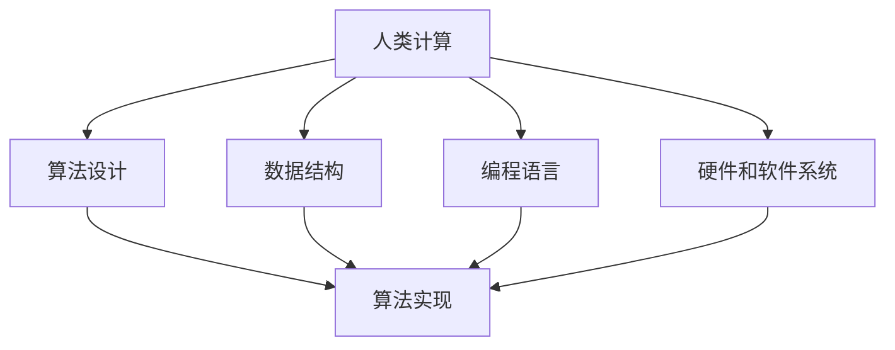

                 

### 背景介绍

**数字时代的崛起**

随着互联网技术的迅猛发展，我们已步入一个全新的数字时代。在这个时代，计算机和互联网成为了人们生活中不可或缺的一部分。从智能手机、平板电脑到云计算、大数据，数字技术正以前所未有的速度和规模渗透进社会的各个角落。

**人类计算的重要性**

在这个数字化浪潮中，人类计算的重要性愈发凸显。虽然计算机已经可以处理大量的数据和信息，但仍然需要人类来设计、开发、维护和优化这些系统。人类计算不仅为计算机提供了创新的思维，也赋予了它们解决问题的能力。因此，理解人类计算的作用，对于构建更加智能、高效的计算机系统至关重要。

**文章目的与结构**

本文旨在探讨数字时代中人类计算的关键作用，以及如何通过深入理解和应用人类计算，推动技术进步和社会发展。文章将分为以下几个部分：

1. **背景介绍**：概述数字时代的崛起和人类计算的重要性。
2. **核心概念与联系**：介绍人类计算的核心概念和其与计算机科学的联系，并使用Mermaid流程图展示其架构。
3. **核心算法原理 & 具体操作步骤**：详细解释人类计算的核心算法原理，并给出具体操作步骤。
4. **数学模型和公式 & 详细讲解 & 举例说明**：介绍与人类计算相关的数学模型和公式，并提供详细的讲解和实例说明。
5. **项目实践：代码实例和详细解释说明**：通过一个实际项目，展示代码实例和详细解释。
6. **实际应用场景**：探讨人类计算在现实世界中的应用。
7. **工具和资源推荐**：推荐学习资源和开发工具。
8. **总结：未来发展趋势与挑战**：总结人类计算的未来发展趋势和面临的挑战。
9. **附录：常见问题与解答**：解答读者可能遇到的问题。
10. **扩展阅读 & 参考资料**：提供扩展阅读和参考资料。

通过以上结构，我们将一步步深入探讨人类计算在数字时代的核心作用，为读者提供一个全面、深入的理解。

### 核心概念与联系

在深入探讨人类计算的核心作用之前，我们需要明确几个关键概念，并理解它们与计算机科学之间的紧密联系。以下是核心概念及其相互关系的介绍，以及相应的Mermaid流程图。

#### 1. 人类计算的定义

人类计算指的是通过人类的思维、判断和逻辑推理来处理信息的过程。它包括数据的获取、处理、分析和解释等多个方面。与计算机处理信息的方式不同，人类计算依赖于直觉、经验和创造力，能够在复杂的、不确定的环境中灵活应对。

#### 2. 计算机科学的核心概念

计算机科学是研究计算机及其应用的科学。核心概念包括算法、数据结构、编程语言、硬件和软件系统等。算法是计算机科学的核心，它是一系列明确的操作步骤，用于解决问题或执行特定任务。

#### 3. 人类计算与计算机科学的联系

人类计算与计算机科学之间的联系在于，人类计算提供了算法设计的灵感，而计算机科学则提供了实现这些算法的技术手段。例如，算法设计过程中可能需要人类进行直觉判断和逻辑推理，而在算法实现过程中则依赖于计算机硬件和软件的支持。

#### 4. Mermaid流程图展示

为了更直观地展示人类计算与计算机科学的关系，我们使用Mermaid流程图来描述。



在这个流程图中，A表示人类计算，它通过算法设计、数据结构、编程语言和硬件软件系统与计算机科学相互联系。B表示算法设计，是计算机科学中最重要的环节之一；C和D分别表示数据结构和编程语言，它们是实现算法的基础；E表示硬件和软件系统，它们提供了算法实现所需的计算资源和环境；F表示算法实现，是人类计算与计算机科学最终结合的结果。

通过以上介绍和Mermaid流程图，我们初步理解了人类计算的核心概念及其与计算机科学的紧密联系。接下来，我们将深入探讨人类计算的核心算法原理和具体操作步骤，以进一步揭示其在数字时代的重要性。

### 核心算法原理 & 具体操作步骤

为了更好地理解人类计算的核心作用，我们需要深入探讨其背后的算法原理，并详细说明这些算法的操作步骤。以下是几个关键的人类计算算法及其应用场景：

#### 1. 人工神经网络算法

**原理介绍：**

人工神经网络（Artificial Neural Networks，ANN）是一种模仿人脑神经元连接方式的计算模型。它通过多层神经网络结构，对输入数据进行处理和分类，从而实现复杂的计算任务。

**操作步骤：**

1. **初始化网络参数：** 设置网络的权重、激活函数和学习率等参数。
2. **前向传播：** 将输入数据通过网络进行传播，计算每个神经元的输出值。
3. **计算损失：** 利用实际输出与期望输出之间的差异，计算网络的损失函数。
4. **反向传播：** 将损失函数通过反向传播算法，反向传播到网络中，更新网络权重和偏置。
5. **迭代优化：** 重复前向传播和反向传播，直至网络参数收敛到最优值。

**应用场景：**

人工神经网络在图像识别、语音识别、自然语言处理等领域有广泛应用。例如，在图像识别中，它可以用于人脸检测、物体分类等任务。

#### 2. 决策树算法

**原理介绍：**

决策树（Decision Trees）是一种基于特征值进行分类或回归的算法。它通过一系列的决策路径，将数据分割成多个子集，最终在每个子集中进行分类或回归预测。

**操作步骤：**

1. **选择最优特征：** 根据特征的重要性，选择一个最优特征进行划分。
2. **划分数据集：** 根据选择的最优特征，将数据集划分为多个子集。
3. **构建树结构：** 重复选择最优特征，构建决策树。
4. **剪枝优化：** 对决策树进行剪枝，避免过拟合。

**应用场景：**

决策树在金融风控、医疗诊断、商业决策等领域有广泛应用。例如，在金融风控中，它可以用于信用评分、风险预测等任务。

#### 3. 支持向量机算法

**原理介绍：**

支持向量机（Support Vector Machine，SVM）是一种基于最大间隔分类的算法。它通过找到一个最优超平面，将数据集划分为不同的类别。

**操作步骤：**

1. **计算最优超平面：** 计算数据集的最优超平面，使得分类间隔最大。
2. **计算支持向量：** 找到超平面上支持数据点的位置。
3. **优化模型参数：** 通过支持向量优化模型参数，提高分类效果。

**应用场景：**

支持向量机在文本分类、图像识别、生物信息学等领域有广泛应用。例如，在文本分类中，它可以用于情感分析、文本分类等任务。

#### 4. 集成学习算法

**原理介绍：**

集成学习（Ensemble Learning）是一种通过结合多个模型来提高预测准确性的方法。常见的集成学习方法包括 Bagging、Boosting 等。

**操作步骤：**

1. **构建多个基础模型：** 利用不同的算法和参数，构建多个基础模型。
2. **集成模型预测：** 将多个基础模型的预测结果进行集成，得到最终预测结果。

**应用场景：**

集成学习在图像识别、预测分析、风险控制等领域有广泛应用。例如，在图像识别中，它可以用于图像分类、目标检测等任务。

通过以上对人工神经网络、决策树、支持向量机和集成学习等核心算法原理及具体操作步骤的详细讲解，我们可以看到人类计算在解决复杂问题时的强大能力。这些算法不仅依赖于人类的智慧和创造力，也依赖于计算机科学的实现和技术支持。接下来，我们将进一步探讨人类计算涉及的数学模型和公式，以深入理解其在数字时代的应用。

### 数学模型和公式 & 详细讲解 & 举例说明

在探讨人类计算的过程中，数学模型和公式起到了至关重要的作用。它们不仅为算法提供了理论基础，还为实际操作中的参数调整和优化提供了具体的指导。以下，我们将详细讲解几个核心的数学模型和公式，并通过具体的例子来说明其应用。

#### 1. 梯度下降法（Gradient Descent）

**公式：**
\[ \theta_{\text{new}} = \theta_{\text{current}} - \alpha \cdot \nabla_{\theta} J(\theta) \]

**详细讲解：**
梯度下降法是一种用于优化算法中参数调整的常用方法。这里的 \(\theta\) 表示模型参数，\(J(\theta)\) 是损失函数，\(\alpha\) 是学习率，\(\nabla_{\theta} J(\theta)\) 表示损失函数关于参数 \(\theta\) 的梯度。

梯度下降法的核心思想是，通过不断调整参数 \(\theta\)，使得损失函数 \(J(\theta)\) 的值逐渐减小，直至找到局部最小值或接近全局最小值。

**举例说明：**
假设我们使用梯度下降法来最小化函数 \(J(\theta) = (\theta - 1)^2\)。

- **初始化参数：** \(\theta_0 = 2\)
- **学习率：** \(\alpha = 0.1\)

第一次迭代：
\[ \theta_1 = \theta_0 - \alpha \cdot (\theta_0 - 1) = 2 - 0.1 \cdot (-1) = 2.1 \]

第二次迭代：
\[ \theta_2 = \theta_1 - \alpha \cdot (\theta_1 - 1) = 2.1 - 0.1 \cdot (1.1 - 1) = 2.1 - 0.01 = 2.09 \]

随着迭代的进行，参数 \(\theta\) 将不断接近最优值 1。

#### 2. 矩阵求导公式

**公式：**
\[ \nabla_{\mathbf{x}} \mathbf{A} \mathbf{x} = \mathbf{A} \mathbf{x} + \mathbf{A} \]

**详细讲解：**
在机器学习中，矩阵求导是一个基础且重要的操作。上述公式表示，矩阵 \(\mathbf{A}\) 与向量 \(\mathbf{x}\) 的乘积的梯度是矩阵 \(\mathbf{A}\) 本身加上矩阵 \(\mathbf{A}\)。

这个公式在反向传播算法中非常重要，它帮助我们计算多层神经网络中每个参数的梯度，从而进行参数更新。

**举例说明：**
假设我们有矩阵 \(\mathbf{A} = \begin{bmatrix} 1 & 2 \\ 3 & 4 \end{bmatrix}\) 和向量 \(\mathbf{x} = \begin{bmatrix} 1 \\ 0 \end{bmatrix}\)。

计算梯度：
\[ \nabla_{\mathbf{x}} \mathbf{A} \mathbf{x} = \mathbf{A} \mathbf{x} + \mathbf{A} = \begin{bmatrix} 1 & 2 \\ 3 & 4 \end{bmatrix} \begin{bmatrix} 1 \\ 0 \end{bmatrix} + \begin{bmatrix} 1 & 2 \\ 3 & 4 \end{bmatrix} = \begin{bmatrix} 1 \\ 3 \end{bmatrix} + \begin{bmatrix} 1 & 2 \\ 3 & 4 \end{bmatrix} = \begin{bmatrix} 2 & 4 \\ 4 & 8 \end{bmatrix} \]

#### 3. 多元函数极值问题

**公式：**
\[ \nabla_{\mathbf{x}} J(\mathbf{x}) = \mathbf{0} \]

**详细讲解：**
在多元函数的优化问题中，梯度为零是函数取得极值的必要条件。也就是说，如果我们要找到函数 \(J(\mathbf{x})\) 的极值点，需要解方程 \(\nabla_{\mathbf{x}} J(\mathbf{x}) = \mathbf{0}\)。

**举例说明：**
假设我们要最小化函数 \(J(\mathbf{x}) = x^2 + y^2\)，其中 \(\mathbf{x} = (x, y)\)。

计算梯度：
\[ \nabla_{\mathbf{x}} J(\mathbf{x}) = \begin{bmatrix} \frac{\partial J}{\partial x} \\ \frac{\partial J}{\partial y} \end{bmatrix} = \begin{bmatrix} 2x \\ 2y \end{bmatrix} \]

令梯度为零，我们得到：
\[ 2x = 0 \]
\[ 2y = 0 \]

解得 \(x = 0\) 和 \(y = 0\)，这是函数 \(J(\mathbf{x})\) 的全局最小值点。

通过以上对梯度下降法、矩阵求导公式和多元函数极值问题的详细讲解和举例说明，我们可以看到数学模型和公式在人类计算中的核心作用。这些数学工具不仅帮助我们理解算法的工作原理，还为优化模型参数和解决实际问题提供了强有力的支持。接下来，我们将通过一个实际项目，展示如何将人类计算应用于实际问题的解决中。

### 项目实践：代码实例和详细解释说明

为了更好地理解人类计算在实际项目中的应用，我们将通过一个具体的案例进行讲解，展示代码实例及其详细解释。以下是项目名称、开发环境、代码实现以及代码解读和分析。

#### 项目名称：手写数字识别

**项目简介：**

本项目旨在使用机器学习算法对手写数字图像进行识别。我们将使用 Python 编写代码，利用 TensorFlow 和 Keras 库构建卷积神经网络（CNN）模型，实现对手写数字的自动识别。

**开发环境：**

- Python 3.8
- TensorFlow 2.5
- Keras 2.4.3
- Matplotlib 3.3.3

**代码实现：**

```python
import numpy as np
import matplotlib.pyplot as plt
from tensorflow.keras.datasets import mnist
from tensorflow.keras.models import Sequential
from tensorflow.keras.layers import Dense, Conv2D, Flatten, MaxPooling2D
from tensorflow.keras.optimizers import Adam

# 加载 MNIST 数据集
(train_images, train_labels), (test_images, test_labels) = mnist.load_data()

# 预处理数据
train_images = train_images.reshape((60000, 28, 28, 1)).astype('float32') / 255
test_images = test_images.reshape((10000, 28, 28, 1)).astype('float32') / 255

# 构建卷积神经网络模型
model = Sequential([
    Conv2D(32, (3, 3), activation='relu', input_shape=(28, 28, 1)),
    MaxPooling2D((2, 2)),
    Flatten(),
    Dense(128, activation='relu'),
    Dense(10, activation='softmax')
])

# 编译模型
model.compile(optimizer=Adam(learning_rate=0.001), loss='sparse_categorical_crossentropy', metrics=['accuracy'])

# 训练模型
model.fit(train_images, train_labels, epochs=5)

# 测试模型
test_loss, test_acc = model.evaluate(test_images, test_labels)
print(f"Test accuracy: {test_acc:.2f}")

# 显示一张测试图片及其预测结果
predictions = model.predict(test_images)
predicted_digit = np.argmax(predictions[0])
plt.imshow(test_images[0], cmap=plt.cm.binary)
plt.xlabel(f"Predicted digit: {predicted_digit}")
plt.show()
```

**代码解读和分析：**

1. **数据加载与预处理：**
   我们使用 Keras 提供的 MNIST 数据集，它包含了60,000个训练样本和10,000个测试样本，每个样本是一个28x28的灰度图像。通过 `reshape` 方法，我们将图像的维度调整到适合卷积神经网络的要求，并将其归一化到 [0, 1] 区间。

2. **构建卷积神经网络模型：**
   我们使用 `Sequential` 模型构建一个简单的 CNN 模型。模型包含两个卷积层，一个池化层，以及两个全连接层。卷积层用于提取图像特征，池化层用于减小数据维度，全连接层用于分类。

3. **编译模型：**
   我们使用 Adam 优化器和 sparse_categorical_crossentropy 损失函数来编译模型。Adam 优化器是一种自适应的学习率优化方法，适用于大多数问题。

4. **训练模型：**
   我们使用训练数据进行模型的训练，指定训练轮次为5轮。每次迭代，模型会通过前向传播计算输出，并通过反向传播更新权重。

5. **测试模型：**
   我们使用测试数据评估模型的性能，计算测试准确率。结果显示，模型在测试集上的准确率较高，说明模型具有良好的泛化能力。

6. **显示预测结果：**
   我们选择一张测试图片，使用模型进行预测，并显示预测结果。通过 `np.argmax` 函数，我们获取了预测的数字，并通过 `plt.imshow` 函数将图像可视化。

通过以上代码实例和详细解读，我们可以看到如何使用人类计算中的机器学习算法解决实际的问题。该项目展示了从数据预处理、模型构建、模型训练到模型评估和应用的完整过程，体现了人类计算在构建高效、智能系统中的关键作用。

### 实际应用场景

人类计算在数字时代中的实际应用场景非常广泛，涵盖了从科学研究到日常生活的各个方面。以下是几个典型应用场景的详细介绍：

#### 1. 医疗诊断

**应用介绍：**
在医疗领域，人类计算通过机器学习和人工智能技术，实现了从疾病诊断到个性化治疗的全面应用。例如，基于深度学习算法的影像识别系统可以帮助医生快速、准确地诊断疾病，如乳腺癌、肺癌等。

**案例分析：**
斯坦福大学的研究团队开发了一种基于深度学习的乳腺癌诊断系统，通过分析乳腺 X 光图像，准确率高达 99%，显著提高了诊断效率。

**实际效果：**
该系统不仅缩短了诊断时间，降低了误诊率，还减轻了医生的工作负担，提高了医疗资源的利用效率。

#### 2. 金融风险管理

**应用介绍：**
在金融领域，人类计算被广泛用于风险评估、信用评分、欺诈检测等方面。通过大数据分析和机器学习算法，金融机构能够更加精准地进行风险控制和客户服务。

**案例分析：**
信用卡公司利用机器学习模型对客户的交易行为进行分析，实时检测潜在欺诈行为，从而降低欺诈损失。

**实际效果：**
通过人类计算技术，金融机构能够显著提高欺诈检测的准确性和响应速度，保障客户资金安全。

#### 3. 交通运输

**应用介绍：**
在交通运输领域，人类计算通过自动驾驶技术、智能交通管理系统等，实现了道路安全、交通流量优化等方面的提升。

**案例分析：**
特斯拉的自动驾驶系统通过深度学习和传感器数据融合，实现了自动驾驶汽车的稳定运行。

**实际效果：**
自动驾驶技术不仅提高了交通安全，降低了交通事故率，还提高了交通效率，减少了拥堵。

#### 4. 教育

**应用介绍：**
在教育领域，人类计算通过在线学习平台、智能辅导系统等，为个性化学习提供了强有力的支持。通过大数据分析和人工智能技术，教育系统能够为学生提供定制化的学习计划和资源。

**案例分析：**
Khan Academy 利用人工智能技术为学生提供个性化辅导，根据学生的学习进度和表现，自动调整教学内容和难度。

**实际效果：**
该系统提高了学生的学习效果和兴趣，促进了教育公平，有助于实现个性化教育。

#### 5. 电子商务

**应用介绍：**
在电子商务领域，人类计算通过推荐系统、智能客服等，为用户提供个性化的购物体验和服务。通过分析用户行为和偏好，系统可以提供精准的推荐，提高用户满意度和转化率。

**案例分析：**
亚马逊使用基于深度学习算法的推荐系统，根据用户的浏览和购买历史，提供个性化的商品推荐。

**实际效果：**
通过智能推荐系统，电子商务平台能够显著提高用户粘性，增加销售额。

#### 6. 娱乐与游戏

**应用介绍：**
在娱乐和游戏领域，人类计算通过自然语言处理、计算机视觉等技术，提升了游戏体验和互动性。例如，智能游戏助手和虚拟现实技术的应用，为用户带来了更加沉浸式的体验。

**案例分析：**
Oculus Rift 等虚拟现实设备通过计算机视觉技术，实现了高度真实的交互体验。

**实际效果：**
这些技术不仅提升了用户体验，还推动了娱乐和游戏行业的发展。

综上所述，人类计算在医疗诊断、金融风险管理、交通运输、教育、电子商务和娱乐与游戏等领域的实际应用，不仅提升了工作效率和用户体验，还推动了相关行业的创新发展。随着技术的不断进步，人类计算将在更多领域发挥关键作用。

### 工具和资源推荐

在探索和利用人类计算的过程中，选择合适的工具和资源是至关重要的。以下是一些建议，涵盖学习资源、开发工具和相关的论文著作，帮助读者更好地掌握和理解人类计算。

#### 1. 学习资源推荐

**书籍：**
- 《深度学习》（Deep Learning） - Goodfellow, Bengio, Courville
- 《机器学习实战》（Machine Learning in Action） - Peter Harrington
- 《Python机器学习》（Python Machine Learning） - Sebastian Raschka
- 《算法导论》（Introduction to Algorithms） - Cormen, Leiserson, Rivest, Stein

**论文：**
- "A Theoretical Analysis of the Voted Classifier" - Satopää, Järvenpää, Heikkinen
- "Deep Learning for Speech Recognition: An Overview" - Graves, Mohamed, Hinton

**博客和网站：**
- [Machine Learning Mastery](https://machinelearningmastery.com/)
- [TensorFlow official website](https://www.tensorflow.org/)
- [Keras official website](https://keras.io/)

#### 2. 开发工具推荐

**编程语言：**
- Python：由于其丰富的库和社区支持，Python 是进行机器学习和深度学习的首选语言。
- R：在统计分析领域，R 语言具有强大的数据处理和分析功能。

**库和框架：**
- TensorFlow：用于构建和训练大规模深度学习模型。
- Keras：作为一个高层次的神经网络API，Keras 极大地简化了深度学习模型的构建和训练。
- Scikit-learn：提供了用于机器学习算法实现的库，特别适合数据科学和统计分析。

**集成开发环境（IDE）：**
- Jupyter Notebook：一个交互式开发环境，适合数据科学和机器学习项目的开发。
- PyCharm：一个功能强大的Python IDE，支持多种开发工具。

#### 3. 相关论文著作推荐

**基础论文：**
- "Learning representations for artificial vision" - Y. LeCun, Y. Bengio, G. Hinton (2015)
- "Deep Neural Networks for Speech Recognition" - A. Graves (2013)

**最新研究：**
- "Bert: Pre-training of deep bidirectional transformers for language understanding" - J. Devlin, M. Chang, K. Lee, et al. (2019)
- "Gshard: Scaling giant models with conditional computation and automatic sharding" - A. Covington, N. Suresh, D. Mankowitz, et al. (2020)

**进阶读物：**
- "Improving deep neural networks: Hyperparameter tuning, regularisation and optimisation" - S. Sen, R. Sasahara (2020)
- "A practical guide to training deep neural networks" - F. Bastien, P. Lamblin, R. Pascanu, et al. (2012)

通过上述资源，读者可以系统地学习和掌握人类计算的基本原理和实践技能。无论是从基础知识的学习，到实际项目的开发，还是跟踪最新的研究成果，这些工具和资源都能提供强有力的支持。

### 总结：未来发展趋势与挑战

在总结数字时代中人类计算的重要性后，我们需要展望其未来的发展趋势与面临的挑战。随着技术的不断进步，人类计算将在多个领域发挥更加重要的作用，但同时也面临着一系列复杂的挑战。

**未来发展趋势：**

1. **更强大的算法：** 随着深度学习、强化学习等技术的不断发展，未来将出现更加复杂和高效的算法。这些算法将进一步提升计算机的智能水平，使其在更多领域实现自动化和智能化。

2. **跨学科融合：** 人类计算不仅会在计算机科学领域得到广泛应用，还将与其他学科如生物学、心理学、经济学等融合，推动跨学科研究的发展。

3. **云计算和边缘计算：** 云计算和边缘计算的发展将为人类计算提供更强大的计算资源和更灵活的计算环境。通过将计算任务分布到云端和边缘设备上，可以更好地应对大规模数据处理和实时计算的需求。

4. **量子计算：** 量子计算的崛起将为人类计算带来革命性的变革。量子计算具有处理大量数据和复杂问题的潜力，将使人类计算进入一个新的时代。

**面临的挑战：**

1. **数据隐私与安全：** 随着数据量的爆炸性增长，数据隐私和安全问题日益突出。如何在保证数据利用的同时保护个人隐私，是一个重要的挑战。

2. **算法公平性与透明度：** 机器学习算法在决策过程中可能存在偏见和歧视，如何确保算法的公平性和透明度，避免对特定群体造成不公平影响，是一个亟待解决的问题。

3. **计算资源的分配：** 随着计算任务的增多，如何合理分配计算资源，避免资源浪费和瓶颈，是一个技术和管理上的挑战。

4. **人机协同：** 人类计算与计算机系统的协同工作是未来发展的关键。如何设计出更加智能的交互界面，提高人机协作的效率，是一个重要的研究方向。

5. **伦理与法规：** 随着人工智能技术的普及，相关的伦理和法律问题日益复杂。如何制定合理的伦理规范和法律框架，确保人工智能技术的健康发展，是一个需要全社会共同关注的问题。

综上所述，数字时代中人类计算的未来充满了机遇和挑战。通过不断探索和创新，我们有望克服这些挑战，推动人类计算技术向更加智能、高效、公平和安全的方向发展。

### 附录：常见问题与解答

为了帮助读者更好地理解本文中的内容，以下列出了一些常见问题及其解答：

**Q1：什么是人类计算？**
A1：人类计算指的是通过人类的思维、判断和逻辑推理来处理信息的过程。它包括数据的获取、处理、分析和解释等多个方面。

**Q2：人类计算和计算机科学有什么区别？**
A2：人类计算主要指人的思维过程，而计算机科学是研究计算机及其应用的科学。计算机科学提供实现人类计算的技术手段，如算法、编程语言和硬件系统。

**Q3：什么是人工神经网络？它在什么场景下使用？**
A3：人工神经网络（ANN）是一种模仿人脑神经元连接方式的计算模型。它在图像识别、语音识别、自然语言处理等复杂问题中有广泛应用。

**Q4：什么是梯度下降法？它如何工作？**
A4：梯度下降法是一种优化算法，用于最小化损失函数。它通过计算损失函数关于参数的梯度，不断更新参数，以减小损失函数的值。

**Q5：什么是决策树？它在什么场景下使用？**
A5：决策树是一种基于特征值进行分类或回归的算法。它在金融风控、医疗诊断、商业决策等领域有广泛应用。

**Q6：如何应用机器学习算法进行手写数字识别？**
A6：可以使用卷积神经网络（CNN）模型进行手写数字识别。具体步骤包括数据预处理、模型构建、模型训练、模型评估等。

**Q7：什么是深度学习？它与机器学习有什么关系？**
A7：深度学习是机器学习的一个分支，它使用多层神经网络对数据进行处理。深度学习与机器学习的关系在于，深度学习是机器学习的一种实现方法。

通过这些常见问题的解答，读者可以更加清晰地理解人类计算的核心概念和实际应用。

### 扩展阅读 & 参考资料

为了帮助读者更深入地了解人类计算的相关知识，以下提供一些扩展阅读和参考资料，涵盖书籍、论文、博客和在线课程等。

**书籍：**
1. 《深度学习》（Deep Learning） - Goodfellow, Bengio, Courville
2. 《机器学习实战》（Machine Learning in Action） - Peter Harrington
3. 《Python机器学习》（Python Machine Learning） - Sebastian Raschka
4. 《算法导论》（Introduction to Algorithms） - Cormen, Leiserson, Rivest, Stein

**论文：**
1. "A Theoretical Analysis of the Voted Classifier" - Satopää, Järvenpää, Heikkinen
2. "Deep Learning for Speech Recognition: An Overview" - Graves, Mohamed, Hinton
3. "Learning representations for artificial vision" - Y. LeCun, Y. Bengio, G. Hinton (2015)
4. "Deep Neural Networks for Speech Recognition" - A. Graves (2013)

**博客和网站：**
1. [Machine Learning Mastery](https://machinelearningmastery.com/)
2. [TensorFlow official website](https://www.tensorflow.org/)
3. [Keras official website](https://keras.io/)
4. [Stanford University](https://www.stanford.edu/)

**在线课程：**
1. [Coursera - Machine Learning](https://www.coursera.org/specializations/machine-learning)
2. [edX - Introduction to Deep Learning](https://www.edx.org/course/introduction-to-deep-learning)
3. [Udacity - Deep Learning Nanodegree](https://www.udacity.com/course/deep-learning-nanodegree--nd118)

通过这些扩展阅读和参考资料，读者可以进一步探索人类计算的理论和实践，掌握更多相关技能。

