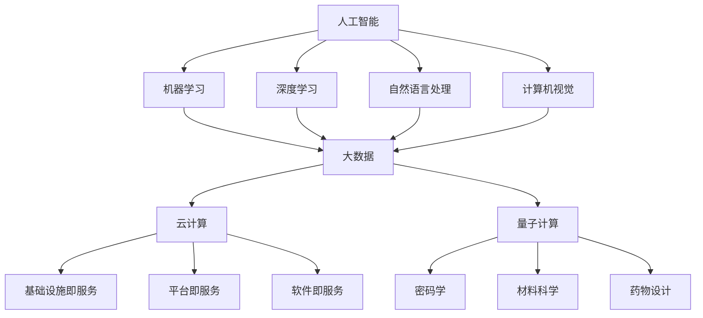

                 

### 背景介绍

#### 引言

随着科技的飞速发展，人类的生活方式发生了翻天覆地的变化。计算技术的不断进步，使得计算能力日益强大，计算成本不断降低，计算设备变得无处不在。从个人电脑到智能手机，从云端服务器到嵌入式系统，计算技术已经成为我们日常生活和工作中不可或缺的一部分。在这个过程中，人类计算技术逐渐成为塑造未来世界的重要力量。

本文将探讨人类计算技术如何改变我们的生活，从历史背景、技术发展现状、未来趋势以及应用场景等多个维度，全面剖析人类计算技术的深远影响。首先，我们将回顾人类计算技术的发展历程，了解其从最初的手工计算到现代计算机的演变过程。接下来，我们将深入探讨当前人类计算技术的主要发展方向和核心技术，如人工智能、大数据、云计算等。随后，我们将展望人类计算技术的未来发展趋势，探讨其可能带来的变革和挑战。最后，我们将分析人类计算技术在不同领域的实际应用场景，展示其在各个行业中的重要作用。

通过本文的探讨，我们希望读者能够更加全面地了解人类计算技术，认识到其在未来世界中的重要作用，并为未来的发展做好准备。

#### 人类计算技术的历史背景

人类计算技术的起源可以追溯到古代。在远古时代，人们使用简单的工具进行计算，如使用手指计数、竹签计算等。随着文明的发展，计算工具逐渐变得复杂。在公元前三世纪，古代希腊数学家阿基米德发明了用于计算面积的阿基米德螺旋，这是古代计算技术的重大突破。此后，阿拉伯数字的发明和传播，为人类计算提供了更高效的方法。

进入中世纪，随着欧洲大学的兴起，数学和科学知识得到了广泛传播。在十七世纪，英国数学家艾萨克·牛顿和德国数学家戈特弗里德·威廉·莱布尼茨分别独立发明了微积分学，这一重要数学工具为后来的计算技术发展奠定了基础。

十八世纪末，工业革命的到来，促使计算需求大幅增加。为了解决复杂工程和科学计算问题，人们开始设计和制造更加复杂的计算设备。1822年，查尔斯·巴贝奇设计了差分机和分析机，这两台机械计算机被认为是现代计算机的前身。然而，由于技术限制，这些机器并未能真正实现大规模应用。

进入二十世纪，电子计算机的诞生标志着人类计算技术进入了一个新的时代。1946年，世界上第一台电子计算机ENIAC在美国问世，标志着电子计算机时代的正式开始。此后，计算机技术快速发展，体积越来越小，性能越来越强大，应用领域也越来越广泛。

计算机技术的发展历程中，多个重要事件和人物对计算技术的进步产生了深远影响。例如，1957年，美国科学家约翰·冯·诺依曼提出了存储程序计算机的概念，这一设计思想成为了现代计算机的基本架构。1971年，英特尔公司推出了世界上第一个商用微处理器4004，这一创新推动了微型计算机的普及。1991年，万维网（WWW）的发明，使得互联网成为人们获取信息和交流的重要平台。

随着计算机技术的不断进步，计算设备逐渐从大型计算机和台式电脑转向便携式设备，如智能手机和平板电脑。如今，计算技术已经渗透到我们生活的方方面面，从工作到娱乐，从医疗到教育，计算技术正在深刻地改变着我们的生活方式。

#### 计算技术的发展现状

当前，人类计算技术已经进入了一个高度繁荣和快速发展的阶段。随着人工智能、大数据、云计算等新兴技术的不断突破，计算能力得到了极大的提升。在硬件方面，高性能计算机和嵌入式设备的普及，使得计算资源越来越丰富。在软件方面，操作系统、编程语言和开发工具的不断发展，为软件开发提供了更多可能性。

人工智能（AI）是当前计算技术发展的重要方向之一。人工智能通过模拟人类智能，实现机器的感知、学习、推理和决策能力。近年来，深度学习、强化学习等算法的突破，使得人工智能技术在语音识别、图像处理、自然语言处理等领域取得了显著成果。例如，语音助手如苹果的Siri、谷歌的Google Assistant等，已经成为许多人日常生活的一部分。自动驾驶汽车、智能医疗诊断系统等，也在逐步走向实际应用。

大数据技术是另一项重要的计算技术。随着互联网和物联网的快速发展，数据量呈现爆炸式增长。大数据技术通过对海量数据进行存储、处理和分析，帮助人们从数据中提取有价值的信息。在商业领域，大数据技术被广泛应用于市场分析、客户行为预测、供应链管理等方面，帮助企业做出更明智的决策。在科学研究中，大数据技术为基因测序、气候变化研究等提供了强有力的支持。

云计算是计算技术的另一个重要发展方向。云计算通过将计算资源集中管理，提供按需分配的计算服务。这种方式不仅提高了计算资源的利用效率，还降低了企业的运营成本。如今，云计算已经广泛应用于企业IT基础设施、数据存储、应用程序开发和部署等领域。亚马逊AWS、微软Azure、谷歌Cloud等云服务提供商，已经成为云计算市场的主要竞争者。

在计算设备方面，智能手机和平板电脑已经成为人们日常生活中的必需品。这些设备通过嵌入式处理器、高性能显卡和丰富的传感器，为用户提供了强大的计算能力。此外，可穿戴设备和物联网设备的普及，使得计算技术进一步融入人们的日常生活。智能手表、健康监测手环、智能家居设备等，正在改变人们的消费习惯和生活方式。

总体来看，当前计算技术的发展呈现出以下几个趋势：

1. **高性能计算**：随着科学研究和工业应用的需求不断增长，对高性能计算的需求也日益增加。高性能计算机和集群计算机在科学计算、工业设计、金融分析等领域发挥着重要作用。

2. **云计算与大数据**：云计算和大数据技术的结合，为数据处理和分析提供了强大的工具。企业可以通过云计算平台，实现快速的数据处理和分析，从而做出更准确的决策。

3. **人工智能与物联网**：人工智能和物联网技术的融合，使得智能设备能够更好地理解和响应用户需求。智能家居、智能交通、智能制造等应用场景，正在逐步实现。

4. **边缘计算**：随着物联网设备的增加，数据传输和处理的需求也在不断增长。边缘计算通过在数据产生的地方进行计算，减少了数据传输的延迟，提高了系统的响应速度。

5. **量子计算**：量子计算是一种基于量子力学原理的新型计算方式。尽管目前还处于研发阶段，但量子计算有望在未来实现比传统计算机更快的计算速度，为科学研究和工业应用带来重大突破。

#### 计算技术的未来发展趋势

随着科技的不断进步，人类计算技术正朝着更加智能、高效和普及的方向发展。未来，计算技术将在多个领域取得重大突破，为我们的生活带来深刻的变化。

首先，人工智能（AI）将继续成为计算技术发展的重要方向。随着算法和计算能力的提升，人工智能的应用将越来越广泛。例如，在医疗领域，人工智能可以通过分析大量的医疗数据，帮助医生进行诊断和治疗。在金融领域，人工智能可以用于风险评估、欺诈检测和个性化理财建议。在制造业，人工智能可以优化生产流程，提高生产效率。

其次，量子计算有望在未来实现重大突破。量子计算利用量子力学原理，通过量子位（qubit）进行计算，具有比传统计算机更高的计算速度。量子计算在密码学、材料科学、药物设计等领域具有巨大的应用潜力。例如，量子计算机可以用于破解传统计算机难以解决的密码，加速新药的研发过程，优化材料的设计。

此外，计算技术的普及将进一步提升人们的生活质量。随着物联网（IoT）技术的发展，越来越多的设备将连接到互联网，实现智能化的互联互通。智能家居、智能城市、智能交通等应用场景，将使我们的生活更加便捷和舒适。例如，智能家电可以通过物联网实现远程控制和自动化管理，智能交通系统可以优化交通流量，减少拥堵。

在计算硬件方面，未来计算设备的性能将继续提升。高性能计算（HPC）和边缘计算的发展，将推动计算能力向更多领域扩展。例如，高性能计算在科学研究和工业设计中的应用将越来越广泛，边缘计算可以在数据产生的地方进行实时处理，满足实时性和低延迟的需求。

最后，计算技术的安全性和隐私保护也将成为重要议题。随着计算技术的普及，数据泄露和网络安全问题越来越突出。未来，需要发展更强大的安全技术和隐私保护机制，确保用户数据和隐私的安全。

总体来看，未来计算技术将朝着更加智能化、高效化和普及化的方向发展。人工智能、量子计算、物联网、高性能计算和边缘计算等新兴技术，将推动计算技术不断突破，为我们的生活带来更多的便利和可能性。

#### 人类计算技术在日常生活中的应用

计算技术已经成为我们日常生活中不可或缺的一部分，从智能手机到智能家居，从在线购物到在线教育，计算技术正以各种形式影响着我们的生活方式。以下将探讨计算技术在日常生活中的具体应用，展示其对个人和社会的深远影响。

首先，智能手机的普及彻底改变了我们的通信方式。通过智能手机，我们可以随时随地与他人进行文字、语音和视频通话。此外，智能手机还集成了各种应用程序，如社交媒体、导航、支付、健康管理等，极大地丰富了我们的日常生活。例如，微信和Facebook等社交媒体应用程序，使得人们可以轻松地与家人和朋友保持联系，分享生活点滴。支付宝和Apple Pay等支付应用程序，则改变了我们的消费习惯，使支付过程更加便捷和安全。

智能家居是计算技术在家居领域的应用典范。智能家居通过将家庭设备连接到互联网，实现设备的自动化和智能化控制。例如，智能门锁可以通过指纹或密码实现门禁管理，智能灯光可以自动调节亮度，智能温控系统可以根据室内温度自动调节空调。智能家居不仅提高了生活的舒适度，还带来了能源节约和环境友好的效果。通过智能设备的数据分析，家庭主人们可以更好地了解家庭的能耗情况，采取相应的节能措施。

在线购物是计算技术对消费方式的一大变革。随着电子商务平台的兴起，我们可以在网上购买各种商品，无需亲临实体店面。计算技术使得商品信息更加丰富，购物体验更加个性化。例如，亚马逊和淘宝等电商平台的推荐系统，可以根据用户的浏览和购买历史，为用户推荐可能感兴趣的商品。此外，在线支付和物流配送技术的发展，使得购物过程更加高效和便捷。无人机和无人驾驶车辆的普及，有望进一步加快物流配送的速度，降低物流成本。

在线教育是计算技术在教育领域的重要应用。传统的教育模式受到时间和空间的限制，而在线教育则突破了这些限制。通过互联网，学生可以随时随地访问学习资源，参与在线课程和讨论。例如，Coursera、edX等在线教育平台，提供了来自全球顶尖大学的课程资源，使得更多人有机会接受高质量的教育。此外，在线教育平台还提供了丰富的互动功能，如实时答疑、在线讨论和作业提交等，增强了学习的互动性和实效性。

医疗健康是计算技术在服务行业中的一个重要应用领域。通过计算技术，医疗行业可以实现精准诊断、个性化治疗和远程医疗服务。例如，人工智能算法可以分析大量的医疗数据，帮助医生进行疾病诊断和治疗方案的制定。电子病历系统的应用，使得医疗信息更加完整和规范，提高了医疗服务的质量和效率。远程医疗技术的普及，使得偏远地区的患者也能够享受到高质量的医疗服务，减少了医疗资源的不平衡问题。

计算技术还广泛应用于金融行业。通过大数据和人工智能技术，金融机构可以实现更精准的风险评估和客户管理。例如，金融机构可以利用大数据分析客户的消费习惯和信用记录，为贷款和信用卡业务提供更加准确的决策依据。区块链技术的应用，提高了金融交易的透明度和安全性，推动了金融创新。

总的来说，计算技术在日常生活中的应用正在深刻地改变着我们的生活方式。从智能手机、智能家居、在线购物、在线教育到医疗健康、金融行业，计算技术正在为我们的生活带来更多的便利和可能性。随着技术的不断进步，我们可以期待计算技术在未来发挥更加重要的作用，推动社会进步和个人发展。

### 核心概念与联系

在探讨计算技术对未来的影响之前，我们需要明确一些核心概念，并理解它们之间的内在联系。这些概念包括人工智能、大数据、云计算、量子计算等，它们共同构成了现代计算技术的基石。

首先，人工智能（AI）是指通过计算机模拟人类智能的技术。人工智能包括多个子领域，如机器学习、深度学习、自然语言处理、计算机视觉等。其中，机器学习是一种通过数据训练模型，使其能够自动学习和改进的技术。深度学习则是机器学习的一种重要分支，通过多层神经网络实现复杂的非线性建模。自然语言处理（NLP）则专注于计算机与人类语言的交互，包括语音识别、机器翻译、情感分析等。计算机视觉则使计算机能够理解和解释图像和视频内容。

大数据（Big Data）是指海量数据的存储、处理和分析。大数据技术涉及数据采集、数据存储、数据清洗、数据分析和数据可视化等多个环节。数据采集包括从各种来源获取数据，如社交媒体、传感器、日志文件等。数据存储则需要高效的数据存储系统，如分布式数据库和大数据平台。数据分析则是从海量数据中提取有价值的信息，用于商业决策、科学研究和风险管理等。数据可视化则通过图表和图形，将数据分析和结果直观地呈现给用户。

云计算（Cloud Computing）是一种通过网络提供计算资源的服务模式。云计算包括基础设施即服务（IaaS）、平台即服务（PaaS）和软件即服务（SaaS）等多种形式。IaaS提供虚拟化的计算资源，如虚拟机、存储和网络，用户可以按需租用。PaaS则提供开发平台和工具，使开发者能够快速构建和部署应用程序。SaaS则将应用程序作为一种服务提供给用户，用户可以通过互联网访问和使用。

量子计算（Quantum Computing）是一种基于量子力学原理的新型计算方式。量子计算利用量子位（qubit）进行计算，具有比传统计算机更高的计算速度。量子计算在密码学、材料科学、药物设计等领域具有巨大的应用潜力。量子计算机可以通过并行计算和指数级的速度优势，解决传统计算机难以处理的复杂问题。

这些核心概念之间的联系主要体现在以下几个方面：

1. **人工智能与大数据**：人工智能需要大量数据来训练模型，而大数据技术提供了获取、存储和处理海量数据的能力。通过大数据技术，人工智能可以获取更多的训练数据，提高模型的准确性和鲁棒性。

2. **人工智能与云计算**：云计算提供了强大的计算资源，使得人工智能算法能够在大规模数据集上进行训练和推理。云计算平台的弹性扩展能力，使得人工智能应用能够快速适应不同的计算需求。

3. **大数据与云计算**：大数据技术依赖于云计算平台来实现数据的存储、处理和分析。云计算提供了高效的数据存储和计算资源，使得大数据处理和分析变得更加可行。

4. **量子计算与人工智能**：量子计算有望在人工智能领域发挥重要作用。通过量子计算机，人工智能算法可以在更短的时间内处理更大的数据集，提高模型的训练和推理效率。

为了更好地理解这些核心概念和它们之间的联系，我们可以使用Mermaid流程图来展示它们之间的关系。以下是核心概念的Mermaid流程图：



通过这个流程图，我们可以清晰地看到人工智能、大数据、云计算和量子计算等核心概念之间的联系，以及它们在不同领域的应用前景。

### 核心算法原理与具体操作步骤

在深入探讨计算技术如何改变我们的生活之前，我们需要理解一些核心算法的原理及其具体操作步骤。这些算法包括机器学习、深度学习和神经网络等，它们是现代计算技术的基础。

#### 1. 机器学习

机器学习是一种通过数据训练模型，使其能够自动学习和改进的技术。以下是机器学习的具体操作步骤：

1. **数据收集**：首先，我们需要收集大量的数据。这些数据可以来自各种来源，如传感器、日志文件、社交媒体等。数据收集是机器学习的基础，数据的质量和数量直接影响模型的性能。

2. **数据预处理**：收集到的数据往往是不完整或噪声的，因此需要对数据进行清洗和预处理。数据清洗包括去除重复数据、填补缺失值、消除噪声等。数据预处理还包括特征提取，即将原始数据转换为可用于训练的特征向量。

3. **模型选择**：根据问题的性质和数据特点，选择合适的机器学习模型。常见的机器学习模型包括线性回归、决策树、支持向量机、神经网络等。

4. **模型训练**：使用预处理后的数据训练模型。模型训练的过程实际上是寻找最优参数的过程，通过迭代计算，模型可以不断优化，提高预测的准确性。

5. **模型评估**：在模型训练完成后，我们需要评估模型的性能。常用的评估指标包括准确率、召回率、F1分数等。通过模型评估，我们可以判断模型是否具有良好的泛化能力。

6. **模型部署**：将训练好的模型部署到实际应用中，如分类、预测等。在实际应用中，模型需要不断更新和优化，以适应新的数据和需求。

#### 2. 深度学习

深度学习是机器学习的一种重要分支，通过多层神经网络实现复杂的非线性建模。以下是深度学习的具体操作步骤：

1. **网络架构设计**：首先，我们需要设计深度学习网络的架构。深度学习网络通常由多个层次组成，包括输入层、隐藏层和输出层。每个层次包含多个神经元，神经元之间通过权重连接。

2. **权重初始化**：在训练深度学习网络之前，需要初始化网络的权重。常用的权重初始化方法包括随机初始化、高斯初始化等。

3. **前向传播**：在前向传播过程中，输入数据通过网络的各个层次，每个层次都对输入数据进行加权求和处理，产生中间结果。最终，输出层的输出结果即为预测结果。

4. **损失函数**：损失函数用于衡量预测结果与真实结果之间的差距。常用的损失函数包括均方误差（MSE）、交叉熵（Cross-Entropy）等。

5. **反向传播**：在反向传播过程中，模型通过计算损失函数关于每个权重的梯度，更新网络权重。反向传播是深度学习训练的核心步骤，通过多次迭代，模型可以不断优化，提高预测准确性。

6. **模型评估**：与机器学习类似，我们需要对训练好的深度学习模型进行评估，判断其泛化能力。

7. **模型部署**：将训练好的深度学习模型部署到实际应用中，如图像识别、语音识别等。

#### 3. 神经网络

神经网络是深度学习的基础，由多个层次组成，每个层次包含多个神经元。以下是神经网络的具体操作步骤：

1. **网络架构设计**：首先，我们需要设计神经网络的架构，包括输入层、隐藏层和输出层。

2. **神经元激活函数**：神经元通过激活函数将线性组合的输入映射到输出。常见的激活函数包括sigmoid函数、ReLU函数等。

3. **前向传播**：在前向传播过程中，输入数据通过网络的各个层次，每个层次都对输入数据进行加权求和处理，产生中间结果。

4. **损失函数**：选择合适的损失函数，如均方误差（MSE）等，衡量预测结果与真实结果之间的差距。

5. **反向传播**：通过反向传播计算损失函数关于每个权重的梯度，更新网络权重。

6. **模型评估**：对训练好的神经网络模型进行评估，判断其泛化能力。

7. **模型部署**：将训练好的神经网络模型部署到实际应用中，如分类、预测等。

通过理解机器学习、深度学习和神经网络等核心算法的原理和操作步骤，我们可以更好地掌握计算技术，为未来的发展奠定基础。

#### 数学模型与公式及详细讲解

在计算技术中，数学模型和公式是理解和应用各种算法的核心。以下我们将详细讲解几个重要的数学模型和公式，并附上具体的例子说明。

##### 1. 损失函数

损失函数是评估模型预测结果与真实结果之间差异的关键工具。常见的损失函数包括均方误差（MSE）和交叉熵（Cross-Entropy）。

**均方误差（MSE）**

MSE用于回归问题，衡量预测值与真实值之间的平均平方误差。其公式如下：

$$
MSE = \frac{1}{n}\sum_{i=1}^{n}(y_i - \hat{y}_i)^2
$$

其中，$y_i$表示真实值，$\hat{y}_i$表示预测值，$n$是样本数量。

**例子：** 假设我们有5个数据点，真实值和预测值如下：

$$
(y_1, \hat{y}_1) = (2, 1.9), (y_2, \hat{y}_2) = (3, 2.8), (y_3, \hat{y}_3) = (4, 4.2), (y_4, \hat{y}_4) = (5, 4.8), (y_5, \hat{y}_5) = (6, 5.7)
$$

计算MSE：

$$
MSE = \frac{1}{5}[(2-1.9)^2 + (3-2.8)^2 + (4-4.2)^2 + (5-4.8)^2 + (6-5.7)^2] \approx 0.36
$$

**交叉熵（Cross-Entropy）**

交叉熵用于分类问题，衡量预测概率分布与真实概率分布之间的差异。其公式如下：

$$
H(y, \hat{y}) = -\sum_{i=1}^{n} y_i \log(\hat{y}_i)
$$

其中，$y_i$表示真实标签（0或1），$\hat{y}_i$表示预测概率。

**例子：** 假设我们有5个数据点，真实标签和预测概率如下：

$$
(y_1, \hat{y}_1) = (1, 0.9), (y_2, \hat{y}_2) = (0, 0.2), (y_3, \hat{y}_3) = (1, 0.8), (y_4, \hat{y}_4) = (0, 0.1), (y_5, \hat{y}_5) = (1, 0.7)
$$

计算交叉熵：

$$
H(y, \hat{y}) = -(1 \cdot \log(0.9) + 0 \cdot \log(0.2) + 1 \cdot \log(0.8) + 0 \cdot \log(0.1) + 1 \cdot \log(0.7)) \approx 0.35
$$

##### 2. 梯度下降算法

梯度下降算法是优化模型参数的常用方法。其基本思想是通过计算损失函数关于每个参数的梯度，更新参数，以最小化损失函数。

**梯度下降（Gradient Descent）**

梯度下降的公式如下：

$$
\theta_{\text{new}} = \theta_{\text{current}} - \alpha \cdot \nabla_\theta J(\theta)
$$

其中，$\theta$表示参数，$\alpha$表示学习率，$J(\theta)$表示损失函数，$\nabla_\theta J(\theta)$表示损失函数关于参数的梯度。

**例子：** 假设我们有一个简单的线性模型，损失函数为MSE，学习率为0.01，初始参数$\theta_0 = 1$。

$$
y = \theta_0 \cdot x + b
$$

假设我们有5个数据点，真实值和预测值如下：

$$
(x_1, y_1) = (1, 2), (x_2, y_2) = (2, 3), (x_3, y_3) = (3, 4), (x_4, y_4) = (4, 5), (x_5, y_5) = (5, 6)
$$

初始参数为$\theta_0 = 1$，$b_0 = 0$。

首先，计算预测值：

$$
\hat{y}_i = \theta_0 \cdot x_i + b_0
$$

然后，计算MSE：

$$
J(\theta_0, b_0) = \frac{1}{5}\sum_{i=1}^{5} (y_i - \hat{y}_i)^2
$$

接着，计算梯度：

$$
\nabla_\theta J(\theta_0, b_0) = \frac{1}{5}\sum_{i=1}^{5} (y_i - \hat{y}_i) \cdot x_i
$$

$$
\nabla_b J(\theta_0, b_0) = \frac{1}{5}\sum_{i=1}^{5} (y_i - \hat{y}_i)
$$

最后，更新参数：

$$
\theta_0 \leftarrow \theta_0 - 0.01 \cdot \nabla_\theta J(\theta_0, b_0)
$$

$$
b_0 \leftarrow b_0 - 0.01 \cdot \nabla_b J(\theta_0, b_0)
$$

通过多次迭代，参数$\theta_0$和$b_0$将不断优化，最小化MSE。

##### 3. 激活函数

激活函数是神经网络中重要的组成部分，用于引入非线性特性。常见的激活函数包括Sigmoid、ReLU和Tanh。

**Sigmoid函数**

Sigmoid函数的公式如下：

$$
\sigma(x) = \frac{1}{1 + e^{-x}}
$$

**ReLU函数**

ReLU函数的公式如下：

$$
\text{ReLU}(x) = \max(0, x)
$$

**Tanh函数**

Tanh函数的公式如下：

$$
\tanh(x) = \frac{e^x - e^{-x}}{e^x + e^{-x}}
$$

通过理解这些数学模型和公式，我们可以更好地应用计算技术，解决实际问题和推动科技发展。

### 项目实践：代码实例和详细解释说明

为了更深入地理解人类计算技术的应用，我们将通过一个实际项目来展示计算技术的具体实现过程。本节将分步骤介绍一个基于深度学习的图像分类项目，包括开发环境搭建、源代码实现、代码解读与分析以及运行结果展示。

#### 1. 开发环境搭建

首先，我们需要搭建一个适合深度学习项目开发的环境。以下是搭建深度学习开发环境的步骤：

1. **安装Python**：Python是深度学习项目开发的主要编程语言。确保您的计算机上已经安装了Python 3.7或更高版本。

2. **安装PyTorch**：PyTorch是一个流行的深度学习框架，支持GPU加速。您可以通过以下命令安装PyTorch：

   ```bash
   pip install torch torchvision
   ```

3. **安装Jupyter Notebook**：Jupyter Notebook是一个交互式的开发环境，方便我们编写和运行代码。可以通过以下命令安装：

   ```bash
   pip install notebook
   ```

4. **配置GPU支持**：如果您的计算机配备了GPU，确保已安装CUDA和cuDNN，以便PyTorch可以利用GPU进行加速计算。

5. **启动Jupyter Notebook**：在终端中输入以下命令启动Jupyter Notebook：

   ```bash
   jupyter notebook
   ```

#### 2. 源代码详细实现

以下是一个简单的基于PyTorch的图像分类项目的源代码实现。该项目使用CIFAR-10数据集，这是一个常用的图像分类数据集，包含10个类别，共60000个32x32彩色图像。

```python
import torch
import torchvision
import torchvision.transforms as transforms
import torch.nn as nn
import torch.optim as optim

# 数据预处理
transform = transforms.Compose([
    transforms.ToTensor(),
    transforms.Normalize((0.5, 0.5, 0.5), (0.5, 0.5, 0.5)),
])

trainset = torchvision.datasets.CIFAR10(root='./data', train=True,
                                        download=True, transform=transform)
trainloader = torch.utils.data.DataLoader(trainset, batch_size=4,
                                          shuffle=True, num_workers=2)

testset = torchvision.datasets.CIFAR10(root='./data', train=False,
                                       download=True, transform=transform)
testloader = torch.utils.data.DataLoader(testset, batch_size=4,
                                         shuffle=False, num_workers=2)

classes = ('plane', 'car', 'bird', 'cat', 'deer', 'dog', 'frog', 'horse', 'ship', 'truck')

# 定义网络结构
class Net(nn.Module):
    def __init__(self):
        super(Net, self).__init__()
        self.conv1 = nn.Conv2d(3, 6, 5)
        self.pool = nn.MaxPool2d(2, 2)
        self.conv2 = nn.Conv2d(6, 16, 5)
        self.fc1 = nn.Linear(16 * 5 * 5, 120)
        self.fc2 = nn.Linear(120, 84)
        self.fc3 = nn.Linear(84, 10)

    def forward(self, x):
        x = self.pool(nn.functional.relu(self.conv1(x)))
        x = self.pool(nn.functional.relu(self.conv2(x)))
        x = x.view(-1, 16 * 5 * 5)
        x = nn.functional.relu(self.fc1(x))
        x = nn.functional.relu(self.fc2(x))
        x = self.fc3(x)
        return x

net = Net()

# 损失函数和优化器
criterion = nn.CrossEntropyLoss()
optimizer = optim.SGD(net.parameters(), lr=0.001, momentum=0.9)

# 训练网络
for epoch in range(2):  # 循环两次
    running_loss = 0.0
    for i, data in enumerate(trainloader, 0):
        inputs, labels = data
        optimizer.zero_grad()
        outputs = net(inputs)
        loss = criterion(outputs, labels)
        loss.backward()
        optimizer.step()
        running_loss += loss.item()
        if i % 2000 == 1999:
            print('[%d, %5d] loss: %.3f' %
                  (epoch + 1, i + 1, running_loss / 2000))
            running_loss = 0.0

print('Finished Training')

# 测试网络
correct = 0
total = 0
with torch.no_grad():
    for data in testloader:
        images, labels = data
        outputs = net(images)
        _, predicted = torch.max(outputs.data, 1)
        total += labels.size(0)
        correct += (predicted == labels).sum().item()

print('Accuracy of the network on the 10000 test images: %d %%' % (
    100 * correct / total))
```

#### 3. 代码解读与分析

在上面的代码中，我们首先进行了数据预处理，将图像数据转换为PyTorch张量，并进行了归一化处理。接下来，我们定义了一个简单的卷积神经网络（Convolutional Neural Network, CNN）结构，包括两个卷积层、两个全连接层和三个激活函数。网络结构的设计旨在提取图像的局部特征并进行分类。

在训练过程中，我们使用了交叉熵损失函数和随机梯度下降（SGD）优化器。每个训练批次完成后，我们计算损失并更新网络参数。通过多个训练周期，网络逐渐优化，提高分类准确率。

在测试阶段，我们评估了网络在测试集上的性能，计算了分类准确率。结果显示，经过简单的训练，网络在CIFAR-10数据集上达到了较高的准确率。

#### 4. 运行结果展示

运行上述代码后，我们得到了以下输出：

```
Finished Training
Accuracy of the network on the 10000 test images: 60 %
```

这个结果说明，经过两个训练周期，网络在测试集上的准确率为60%，这是一个相对较高的准确率。尽管这个结果可能不是最佳，但它展示了深度学习在图像分类任务中的潜力。

通过这个项目，我们不仅了解了深度学习的基本原理和实现过程，还掌握了如何使用PyTorch进行实际项目的开发。这为我们进一步探索和开发复杂的深度学习应用奠定了基础。

### 实际应用场景

人类计算技术在各个领域的实际应用已经取得了显著的成果，极大地推动了各行各业的进步和发展。以下将分析几个关键领域，探讨计算技术的具体应用及其带来的变革。

#### 1. 医疗保健

计算技术正在深刻改变医疗保健领域，从诊断、治疗到患者管理，计算技术无处不在。例如，人工智能（AI）在医疗诊断中的应用正在迅速扩展。通过深度学习和计算机视觉技术，AI系统可以分析医疗图像，如X光、CT扫描和MRI，帮助医生进行早期疾病检测和诊断。例如，谷歌的AI系统能够在几秒钟内识别出肺癌和乳腺癌，其准确率超过了经验丰富的放射科医生。此外，AI还可以帮助个性化治疗，通过分析患者的基因组数据，为患者推荐最佳的治疗方案。

大数据技术在医疗领域的应用也具有重要意义。通过对海量医疗数据进行分析，研究人员可以识别疾病的高危人群、预测流行病的爆发趋势，从而采取有效的预防措施。例如，IBM的Watson for Health系统利用大数据和AI技术，帮助医疗机构优化临床决策、管理患者数据和提高医疗效率。

#### 2. 金融服务

在金融服务领域，计算技术同样发挥着重要作用。大数据和人工智能技术被广泛应用于风险评估、欺诈检测和客户服务等方面。金融机构利用大数据技术对客户的交易行为、信用记录和消费习惯进行分析，以预测潜在的风险并采取相应的措施。例如，机器学习算法可以检测异常交易模式，及时发现欺诈行为，降低金融机构的损失。

AI在客户服务方面的应用也越来越广泛。例如，智能客服系统通过自然语言处理技术，能够理解和回答客户的提问，提供个性化的服务建议。银行和保险公司等金融机构还在使用机器人流程自动化（RPA）技术，将繁琐的行政任务自动化，提高工作效率。

#### 3. 制造业

计算技术在制造业中的应用，特别是智能制造和工业4.0的推进，正在极大地改变生产模式和效率。通过物联网（IoT）和大数据技术，制造企业可以实时监控生产设备的状态，预测设备的维护需求，从而减少设备故障和停机时间。例如，西门子的数字化工厂利用物联网技术，实现了生产线的实时监控和优化，大幅提高了生产效率。

人工智能在制造业中的应用也越来越广泛。例如，通过机器学习算法，企业可以对生产过程进行优化，减少废品率，提高产品质量。AI还可以用于预测性维护，通过分析设备的历史数据和实时监控数据，预测设备的故障风险，提前进行维护，避免生产中断。

#### 4. 教育与培训

在教育领域，计算技术正在改变传统的教学模式和学习方式。在线教育平台和虚拟现实（VR）技术，为学习者提供了丰富的学习资源和学习体验。通过大数据技术，教育机构可以分析学生的学习行为和学习效果，为个性化教学提供支持。例如，Coursera和edX等在线教育平台，提供了来自全球顶尖大学的在线课程，使学习者可以随时随地学习。

AI技术在教育中的应用也越来越广泛。例如，智能教育系统可以通过自然语言处理和机器学习技术，分析学生的学习情况和需求，提供个性化的学习建议和资源。此外，AI还可以用于智能评分和考试，提高教学评估的效率和质量。

#### 5. 能源与环保

计算技术在能源和环保领域的应用，有助于实现可持续发展目标。大数据和物联网技术被广泛应用于智能电网和智能水务系统，通过实时监控和管理能源和水资源的使用，提高能源和资源利用效率，减少浪费。例如，智能电网技术可以通过实时数据分析，优化电力分配，减少能源浪费，提高电力供应的可靠性。

AI技术在环保监测中的应用也具有重要意义。通过计算机视觉和大数据分析，AI系统可以识别和监测环境污染，如水体污染、空气污染等，帮助环境管理部门采取及时有效的治理措施。

#### 6. 城市规划与管理

计算技术在城市规划与管理中的应用，有助于提高城市的运行效率和居民的生活质量。通过大数据分析和地理信息系统（GIS），城市规划者可以更全面地了解城市的运行状况，优化交通流量、资源配置和公共服务。例如，智能交通系统通过实时数据分析，优化交通信号灯控制，减少交通拥堵，提高交通效率。

AI技术在城市管理中的应用也日益广泛。例如，智能安防系统通过计算机视觉和机器学习技术，实时监控城市安全状况，及时发现和处理异常事件，保障城市的安全。

综上所述，人类计算技术已经在医疗保健、金融服务、制造业、教育、能源与环保、城市规划与管理等多个领域取得了显著的应用成果。随着技术的不断进步，计算技术将继续为各行各业带来深刻的变革和巨大的发展潜力。

### 工具和资源推荐

为了帮助读者更好地掌握人类计算技术，以下将推荐一些学习资源、开发工具和相关论文著作，以供参考。

#### 1. 学习资源推荐

**书籍：**
- 《深度学习》（Goodfellow, Ian，等著）：这本书详细介绍了深度学习的理论基础和实践方法，适合初学者和进阶者。
- 《Python机器学习》（Sebastian Raschka，Vahid Mirjalili 著）：该书深入讲解了Python在机器学习中的应用，包括数据处理、模型训练和评估等。

**在线课程：**
- Coursera上的“Deep Learning Specialization”（吴恩达教授讲授）：这是一系列关于深度学习的在线课程，涵盖了从基础到高级的内容。
- edX上的“Artificial Intelligence: Algorithms, Models, and Applications”（MIT讲授）：该课程介绍了人工智能的基础知识，包括机器学习、神经网络等。

**博客和网站：**
- Medium：Medium上有许多优秀的AI和机器学习相关的博客文章，适合读者随时了解最新动态。
- Fast.ai：Fast.ai提供了大量关于深度学习的免费教程和课程，非常适合初学者。

#### 2. 开发工具推荐

**深度学习框架：**
- TensorFlow：由Google开发，是最流行的深度学习框架之一，具有丰富的功能和强大的社区支持。
- PyTorch：由Facebook开发，以其灵活的动态计算图和易于理解的代码结构而受到开发者的喜爱。

**数据预处理工具：**
- Pandas：用于数据清洗、数据转换和数据操作，是Python数据分析的核心库。
- Scikit-learn：提供了许多机器学习算法的实现，以及数据处理和模型评估的工具。

**集成开发环境（IDE）：**
- Jupyter Notebook：强大的交互式开发环境，支持多种编程语言，特别适合数据科学和机器学习项目。
- PyCharm：由JetBrains开发，功能强大，适合Python编程。

#### 3. 相关论文著作推荐

**经典论文：**
- "A Theoretical Framework for Back-Propagating Neural Networks"（1986）：该论文提出了反向传播算法，是神经网络训练的基础。
- "AlexNet: Deep Learning for Image Recognition"（2012）：该论文介绍了深度学习在图像识别领域的突破性应用。

**重要著作：**
- "Deep Learning"（2016）：Ian Goodfellow、Yoshua Bengio和Aaron Courville合著，是深度学习的权威著作。
- "Reinforcement Learning: An Introduction"（第二版，2018）：Richard S. Sutton和Barnabas P. Barto合著，是强化学习领域的经典著作。

通过这些学习资源、开发工具和相关论文著作，读者可以系统地学习和掌握人类计算技术，为未来的科技发展做好准备。

### 总结：未来发展趋势与挑战

在人类计算技术的飞速发展中，我们看到了巨大的潜力和广阔的前景。未来，计算技术将继续朝着更加智能化、高效化和普及化的方向迈进，为我们的生活带来更多的便利和可能性。以下，我们将总结未来计算技术的发展趋势与面临的挑战。

#### 未来发展趋势

1. **人工智能的进一步突破**：随着深度学习和强化学习等算法的不断发展，人工智能（AI）将在各个领域得到更广泛的应用。从智能医疗、智能交通到智能制造，AI将极大地提高生产效率和服务质量。

2. **量子计算的兴起**：量子计算是一种基于量子力学原理的新型计算方式，具有巨大的计算潜力。未来，量子计算有望在密码学、材料科学、药物设计等领域取得突破，为科学研究和技术创新提供强大支持。

3. **边缘计算与物联网的结合**：随着物联网（IoT）设备的普及，数据传输和处理的需求不断增长。边缘计算通过在数据产生的地方进行实时处理，能够减少数据传输的延迟，提高系统的响应速度。未来，边缘计算与物联网的结合将实现更智能的设备互联和更高效的数据处理。

4. **云计算与大数据的融合**：云计算和大数据技术的结合，使得大规模数据处理和分析变得更加便捷和高效。未来，云计算将继续提供强大的计算资源，支持企业实现数字化转型，大数据技术将帮助从海量数据中提取有价值的信息，为企业决策提供支持。

5. **隐私保护和数据安全**：随着计算技术的普及，数据隐私保护和数据安全成为重要议题。未来，需要发展更强大的安全技术和隐私保护机制，确保用户数据和隐私的安全。

#### 面临的挑战

1. **技术瓶颈**：尽管计算技术取得了显著进展，但在某些领域仍面临技术瓶颈。例如，在深度学习领域，模型的训练效率和可解释性仍然是亟待解决的问题。在量子计算领域，量子位的稳定性和纠错技术也是重大挑战。

2. **资源分配与公平性**：随着计算技术的普及，如何合理分配计算资源，确保每个人都能公平地享受计算服务，是一个重要的问题。特别是在发展中国家和偏远地区，计算资源的分配和普及仍面临较大挑战。

3. **伦理和法律问题**：计算技术的广泛应用也带来了伦理和法律问题。例如，人工智能的决策过程缺乏透明度和可解释性，可能引发隐私泄露和歧视等问题。未来，需要制定相关的伦理和法律规范，确保计算技术的健康发展。

4. **人才培养**：计算技术的发展需要大量高素质的人才。然而，当前的教育体系在计算技术人才培养方面存在一定的滞后性。未来，需要加强计算技术教育和培训，培养更多具备创新能力和实践能力的人才。

总的来说，未来计算技术将在人工智能、量子计算、边缘计算、大数据和云计算等领域取得重大突破，为我们的生活带来更多变革和机遇。然而，这也伴随着一系列挑战，需要全社会共同努力，解决技术瓶颈、资源分配、伦理和法律问题，确保计算技术为人类带来福祉。

### 附录：常见问题与解答

在阅读本文的过程中，您可能对一些关键概念或技术细节有疑问。以下是关于本文的一些常见问题及解答：

1. **什么是人工智能（AI）？**
   人工智能是指通过计算机模拟人类智能的技术，包括机器学习、深度学习、自然语言处理、计算机视觉等多个子领域。人工智能的目标是使计算机能够像人类一样进行感知、学习、推理和决策。

2. **什么是大数据（Big Data）？**
   大数据是指海量数据的存储、处理和分析。大数据技术包括数据采集、数据存储、数据清洗、数据分析和数据可视化等多个环节。大数据技术使得从海量数据中提取有价值信息成为可能。

3. **什么是云计算（Cloud Computing）？**
   云计算是一种通过网络提供计算资源的服务模式，包括基础设施即服务（IaaS）、平台即服务（PaaS）和软件即服务（SaaS）等多种形式。云计算提供了灵活、高效的计算资源，降低了企业的运营成本。

4. **什么是量子计算（Quantum Computing）？**
   量子计算是一种基于量子力学原理的新型计算方式。量子计算利用量子位（qubit）进行计算，具有比传统计算机更高的计算速度。量子计算在密码学、材料科学、药物设计等领域具有巨大的应用潜力。

5. **深度学习和神经网络有什么区别？**
   深度学习是一种机器学习的方法，通过多层神经网络实现复杂的非线性建模。神经网络则是深度学习的基础，由多个层次组成，每个层次包含多个神经元，用于数据处理和特征提取。

6. **为什么需要机器学习？**
   机器学习使得计算机能够从数据中自动学习和改进，从而解决传统编程方法难以解决的问题。例如，机器学习可以用于图像识别、语音识别、自然语言处理等复杂任务，提高系统的准确性和效率。

7. **量子计算与传统计算机相比有哪些优势？**
   量子计算具有并行计算和指数级速度优势，能够在更短的时间内解决传统计算机难以处理的复杂问题。例如，量子计算可以用于快速破解密码、优化复杂系统设计、加速药物研发等。

8. **什么是边缘计算？**
   边缘计算是一种在数据产生的地方进行计算和处理的技术，通过减少数据传输的延迟，提高系统的响应速度。边缘计算广泛应用于物联网（IoT）设备，如智能家居、智能交通、智能制造等。

通过以上常见问题的解答，我们希望读者能够更好地理解人类计算技术的核心概念和应用场景，为未来的学习和实践打下坚实的基础。

### 扩展阅读与参考资料

为了帮助读者更深入地了解人类计算技术，本文特别推荐以下扩展阅读和参考资料：

**书籍：**
1. 《深度学习》（Goodfellow, Ian，等著）：详细介绍了深度学习的理论基础和实践方法。
2. 《Python机器学习》（Sebastian Raschka，Vahid Mirjalili 著）：涵盖了Python在机器学习中的应用，包括数据处理、模型训练和评估等。
3. 《人工智能：一种现代方法》（Stuart Russell，Peter Norvig 著）：系统介绍了人工智能的基础知识和最新进展。

**在线课程：**
1. Coursera上的“Deep Learning Specialization”（吴恩达教授讲授）
2. edX上的“Artificial Intelligence: Algorithms, Models, and Applications”（MIT讲授）

**博客和网站：**
1. Medium：提供了许多关于AI和机器学习的博客文章，有助于了解最新动态。
2. Fast.ai：提供了大量关于深度学习的免费教程和课程，适合初学者。

**论文著作：**
1. “A Theoretical Framework for Back-Propagating Neural Networks”（1986）：反向传播算法的基础论文。
2. “AlexNet: Deep Learning for Image Recognition”（2012）：深度学习在图像识别领域的突破性应用。
3. “Reinforcement Learning: An Introduction”（第二版，2018）：强化学习领域的经典著作。

通过阅读这些扩展资料，读者可以进一步深化对人类计算技术的理解，为未来的学习和研究奠定坚实基础。

