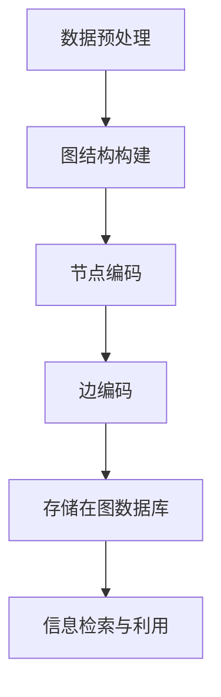
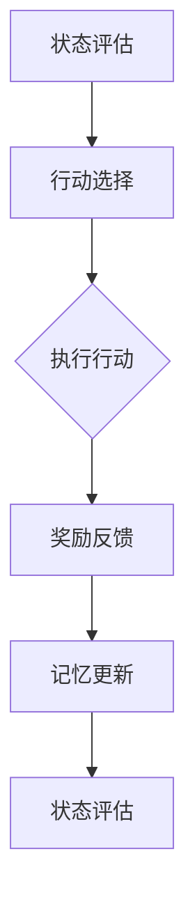
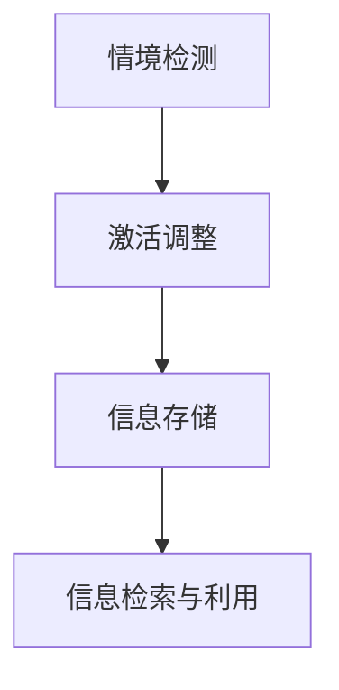
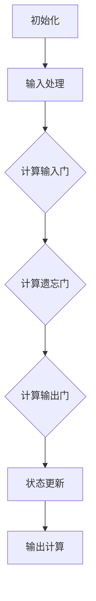
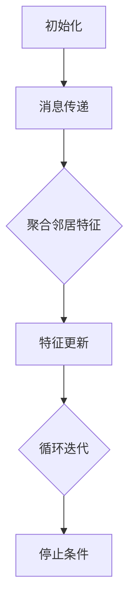
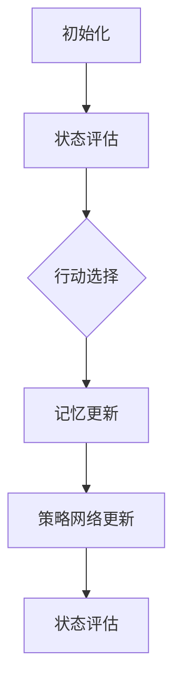

                 

### 1. 背景介绍

随着人工智能（AI）技术的迅猛发展，深度学习模型在各个领域取得了显著的成果，如图像识别、自然语言处理、语音识别等。然而，这些模型普遍存在一个共同的问题，那就是记忆能力较弱。在现实应用中，模型的记忆能力直接关系到其性能和鲁棒性。因此，如何增强AI应用的记忆能力成为了一个关键的研究课题。

记忆能力在AI中的应用至关重要。它不仅影响到模型在复杂环境下的适应能力，还影响到模型在连续学习和推理过程中的稳定性。举例来说，一个优秀的AI系统需要记住过去的信息来指导当前的行为，例如自动驾驶系统需要根据历史行驶数据来预测交通状况；自然语言处理模型需要利用上下文信息来准确理解用户的意图。

目前，增强AI记忆能力的方法可以分为以下几类：

1. **结构化记忆**：这种方法主要通过设计特定的数据结构来存储和管理信息。例如，图神经网络（GNN）利用图结构来表示复杂的关系网络，从而提高模型的记忆能力。

2. **强化记忆**：这种方法利用强化学习（RL）机制来调整模型记忆权重，使其能够更好地适应新的环境变化。

3. **自适应记忆**：这种方法通过动态调整记忆单元的激活状态，使得模型能够在不同情境下自动调整记忆重点。

4. **记忆增强网络**：这种方法通过在神经网络中引入专门的记忆模块来增强模型的记忆能力。例如，长短期记忆网络（LSTM）和门控循环单元（GRU）就利用了这种机制。

本文将围绕以上几种方法，详细探讨增强AI应用记忆能力的多种途径，并通过实例和代码解释来展示具体实现过程。

#### 1.1 AI记忆能力的定义

在AI领域中，记忆能力是指模型在处理信息时存储、检索和利用历史数据的能力。它包括以下几个关键方面：

- **信息的存储**：如何有效地将信息编码并存储在模型内部。
- **信息的检索**：如何快速准确地从存储中检索所需的信息。
- **信息的利用**：如何利用存储的信息来指导当前的决策或推理过程。

一个理想的AI系统应该具备以下特点：

- **持久记忆**：能够长期存储信息，并能在需要时快速检索。
- **适应性记忆**：能够根据新的信息和情境动态调整记忆的内容和权重。
- **泛化能力**：能够将记忆应用于新的、未见过的情境中。

这些特点在现实应用中至关重要，例如，自动驾驶系统需要记住道路标志和交通规则，以应对不同的交通状况；聊天机器人需要记住用户的偏好和对话历史，以提供更个性化的服务。

总的来说，AI记忆能力的研究旨在提高模型在复杂、动态环境下的表现，从而更好地服务于各类实际应用场景。

#### 1.2 当前AI记忆能力面临的主要挑战

尽管AI记忆能力在理论上具有重要意义，但在实际应用中仍然面临诸多挑战。以下是当前AI记忆能力面临的一些主要问题：

1. **数据稀疏问题**：在许多实际应用中，可用数据非常有限，这导致模型难以形成有效的记忆。例如，在医疗诊断领域，由于患者数据的隐私和获取难度，训练一个具有良好记忆能力的诊断模型变得尤为困难。

2. **记忆容量限制**：深度学习模型通常具有庞大的参数规模，但实际可用的内存资源有限。这意味着模型无法存储大量的历史信息，导致记忆能力受限。

3. **记忆泛化问题**：模型在某一特定任务上表现出良好的记忆能力，但在面对新的任务或情境时，可能无法有效地利用之前的记忆，导致泛化能力不足。

4. **动态环境适应问题**：在动态环境中，模型需要不断地更新和调整其记忆内容。然而，当前的许多方法在处理动态变化时存在滞后性，难以实现快速适应。

5. **计算效率问题**：增强记忆能力通常需要额外的计算资源，这对于实时应用来说是一个巨大的挑战。如何在保证记忆能力的同时提高计算效率，是一个亟待解决的问题。

这些挑战不仅影响了AI系统的性能和鲁棒性，也限制了其在某些特定领域的广泛应用。因此，如何克服这些挑战，成为AI研究中的一个重要课题。

#### 1.3 增强AI记忆能力的重要性

增强AI的记忆能力具有重要的现实意义和深远的技术影响。以下是一些关键点：

1. **提高模型性能**：一个具有良好记忆能力的模型能够更好地利用历史信息，从而在任务表现上更为出色。例如，在图像识别任务中，通过记忆场景中的关键特征，模型可以更准确地识别不同图像。

2. **增强模型鲁棒性**：记忆能力使得模型能够从历史经验中学习，从而在面对未知或异常情况时，能够表现出更强的鲁棒性。这对于应对现实世界中的复杂、动态环境尤为重要。

3. **促进知识迁移**：通过增强记忆能力，模型可以更好地将知识从一种情境迁移到另一种情境，从而实现跨领域的应用。这对于提升AI系统的实用性和适应性具有重大意义。

4. **实现连续学习**：记忆能力使得模型能够持续学习并更新其知识库，从而在长期任务中保持稳定的表现。这对于许多需要持续学习和优化的应用场景，如智能客服、自动驾驶等，至关重要。

5. **推动AI技术发展**：增强AI记忆能力不仅提升了现有技术的应用效果，也为新的研究方向提供了契机。例如，通过研究记忆增强技术，可以推动神经科学、认知科学等领域的发展，为AI技术提供更深刻的理论基础。

综上所述，增强AI记忆能力对于提高模型性能、增强鲁棒性、实现知识迁移和连续学习等方面具有重要意义，对于推动AI技术的发展和应用具有深远的影响。

#### 1.4 本文结构安排

本文将系统地探讨增强AI记忆能力的多种方法，旨在为研究人员和开发者提供有价值的参考和指导。全文分为十个主要部分：

- **背景介绍**：回顾AI记忆能力的定义、当前面临的挑战以及增强记忆能力的重要性。
- **核心概念与联系**：介绍相关核心概念，如结构化记忆、强化记忆、自适应记忆等，并通过Mermaid流程图展示其原理和架构。
- **核心算法原理 & 具体操作步骤**：详细讲解每种算法的原理和操作步骤，帮助读者理解其实现过程。
- **数学模型和公式 & 详细讲解 & 举例说明**：介绍增强AI记忆能力的数学模型和公式，并通过具体例子解释其应用方法。
- **项目实践：代码实例和详细解释说明**：通过具体代码实例展示算法实现过程，并进行详细解读。
- **实际应用场景**：讨论增强AI记忆能力在不同领域的应用案例，如自动驾驶、医疗诊断等。
- **工具和资源推荐**：推荐相关的学习资源、开发工具和框架，帮助读者深入了解相关技术。
- **总结：未来发展趋势与挑战**：总结本文的主要发现，并探讨未来的发展趋势和挑战。
- **附录：常见问题与解答**：回答一些读者可能关心的问题，提供更多背景信息。
- **扩展阅读 & 参考资料**：提供一些相关的参考文献和资源，便于读者进一步学习。

通过以上结构的安排，本文希望能够系统地介绍增强AI记忆能力的方法，为读者提供全面的指导和参考。

#### 1.5 增强AI记忆能力的方法概述

增强AI记忆能力的方法可以分为几大类，每种方法都有其独特的原理和应用场景。以下是这些方法的概述：

1. **结构化记忆**：通过设计特定的数据结构来存储和管理信息，如图神经网络（GNN）和图嵌入技术，用于处理复杂的网络关系。这种方法特别适用于处理具有复杂相互作用的领域，如社交网络分析和推荐系统。

2. **强化记忆**：利用强化学习（RL）机制来调整模型记忆权重，使得模型能够根据环境反馈动态调整其记忆内容。这种方法在需要不断适应环境变化的领域具有优势，如自主驾驶和智能游戏。

3. **自适应记忆**：通过动态调整记忆单元的激活状态，使得模型能够在不同情境下自动调整记忆重点。这种方法适用于需要灵活适应多变的任务场景，如自适应学习系统和动态资源管理。

4. **记忆增强网络**：通过在神经网络中引入专门的记忆模块，如长短期记忆网络（LSTM）和门控循环单元（GRU），来增强模型的记忆能力。这种方法广泛应用于时间序列预测和自然语言处理。

每种方法都有其特定的优势和局限性，选择合适的方法需要根据具体应用场景和需求进行综合考虑。

### 2. 核心概念与联系

为了更好地理解增强AI记忆能力的方法，我们需要首先了解一些核心概念和它们之间的联系。以下将详细介绍结构化记忆、强化记忆和自适应记忆的概念，并通过Mermaid流程图展示其原理和架构。

#### 2.1 结构化记忆

结构化记忆是通过设计特定的数据结构来存储和管理信息的一种方法。这种方法的核心思想是将复杂的信息以结构化的形式进行组织，以便于高效地存储、检索和利用。

**核心概念：**

1. **数据结构**：结构化记忆依赖于特定的数据结构，如图、树、矩阵等。这些数据结构可以有效地表示和存储复杂的网络关系或时空数据。
2. **节点和边**：在图结构中，节点表示数据元素，边表示节点之间的关联关系。通过定义合适的边权重，可以反映节点之间的相互作用强度。
3. **编码策略**：将原始数据编码为图节点和边的过程。常见的编码策略包括基于特征值编码、基于关系编码和基于位置编码等。

**原理和架构：**

结构化记忆的原理可以概括为以下步骤：

1. **数据预处理**：对原始数据进行预处理，提取关键特征和关系，形成图结构。
2. **编码与存储**：将图中的节点和边进行编码，并存储在数据库或图数据库中。
3. **信息检索与利用**：在需要时，通过图搜索算法快速检索所需信息，并将其用于决策或推理过程。

以下是一个简单的Mermaid流程图，展示结构化记忆的原理和架构：



#### 2.2 强化记忆

强化记忆是一种利用强化学习（RL）机制来调整模型记忆权重的方法。这种方法的核心思想是通过奖励机制引导模型学习如何根据环境反馈动态调整其记忆内容。

**核心概念：**

1. **状态（State）**：模型在某一时刻所处的环境条件。
2. **行动（Action）**：模型可执行的行为。
3. **奖励（Reward）**：模型执行某一行动后获得的奖励，用于评价行动的好坏。
4. **策略（Policy）**：模型选择行动的规则。
5. **价值函数（Value Function）**：预测在给定状态下执行某一行动的未来奖励。

**原理和架构：**

强化记忆的原理可以概括为以下步骤：

1. **状态评估**：初始化状态，评估当前状态的价值。
2. **行动选择**：根据策略选择一个行动。
3. **执行行动**：在环境中执行选定的行动。
4. **奖励反馈**：根据行动的结果获得奖励。
5. **记忆更新**：根据奖励反馈调整记忆权重。

以下是一个简单的Mermaid流程图，展示强化记忆的原理和架构：



#### 2.3 自适应记忆

自适应记忆是一种通过动态调整记忆单元的激活状态，使得模型能够根据不同情境自动调整记忆重点的方法。这种方法的核心思想是利用动态调整机制，使得模型能够在多变的环境下保持高效记忆。

**核心概念：**

1. **记忆单元**：模型中用于存储信息的单元，如LSTM中的隐藏单元。
2. **激活状态**：记忆单元的激活程度，表示记忆的重要程度。
3. **门控机制**：用于控制记忆单元激活状态的机制，如门控循环单元（GRU）中的更新门和控制门。
4. **情境感知**：根据当前情境调整记忆单元的激活状态。

**原理和架构：**

自适应记忆的原理可以概括为以下步骤：

1. **情境检测**：实时检测当前情境。
2. **激活调整**：根据情境检测结果，动态调整记忆单元的激活状态。
3. **信息存储**：根据激活状态，将重要的信息存储在记忆单元中。
4. **信息检索与利用**：在需要时，从记忆单元中检索存储的信息，并用于决策或推理。

以下是一个简单的Mermaid流程图，展示自适应记忆的原理和架构：



通过上述核心概念的介绍和Mermaid流程图的展示，我们可以更清晰地理解结构化记忆、强化记忆和自适应记忆的原理和架构。这些方法为增强AI记忆能力提供了不同的思路和工具，可以根据具体应用场景和需求进行选择和组合。

### 3. 核心算法原理 & 具体操作步骤

为了增强AI应用的记忆能力，我们可以采用多种核心算法。本节将详细介绍每种算法的原理和具体操作步骤，以便读者能够更好地理解和应用这些方法。

#### 3.1 长短期记忆网络（LSTM）

长短期记忆网络（LSTM）是一种能够有效处理长序列数据且具有良好记忆能力的神经网络。它通过引入门控机制，解决了传统循环神经网络（RNN）在处理长序列数据时容易发生梯度消失或梯度爆炸的问题。

**原理：**

LSTM通过三个门控单元（输入门、遗忘门和输出门）和单元状态，实现了对信息的存储和检索。

1. **输入门（Input Gate）**：决定新的信息中哪些部分需要更新到单元状态。
2. **遗忘门（Forget Gate）**：决定哪些旧的信息需要从单元状态中遗忘。
3. **输出门（Output Gate）**：决定哪些信息需要输出到下一个隐藏状态。

**具体操作步骤：**

1. **初始化**：设置初始隐藏状态 \(h_0\) 和单元状态 \(c_0\)。
2. **输入处理**：对每个输入 \(x_t\)，计算输入门、遗忘门和输出门的值。
3. **状态更新**：根据输入门和遗忘门的值，更新单元状态 \(c_t\) 和隐藏状态 \(h_t\)。
4. **输出计算**：根据输出门的值，计算当前隐藏状态 \(h_t\)。

以下是一个简化的LSTM算法流程图：



#### 3.2 图神经网络（GNN）

图神经网络（GNN）是一种专门用于处理图结构数据的神经网络。通过将图中的节点和边映射到低维向量，GNN可以有效地捕捉节点之间的复杂关系。

**原理：**

GNN的核心思想是通过聚合邻居节点的特征信息来更新节点自身的特征表示。

1. **节点特征表示**：将每个节点的特征映射到一个低维向量。
2. **消息传递**：对每个节点，通过聚合其邻居节点的特征信息来更新自身的特征表示。
3. **聚合函数**：通常使用神经网络或池化操作来聚合邻居节点的特征信息。

**具体操作步骤：**

1. **初始化**：设置节点的初始特征表示。
2. **消息传递**：对每个节点，将其邻居节点的特征信息传递给该节点。
3. **特征更新**：通过聚合函数，更新节点的特征表示。
4. **循环迭代**：重复执行消息传递和特征更新，直到满足停止条件。

以下是一个简化的GNN算法流程图：



#### 3.3 自适应记忆增强网络（AME）

自适应记忆增强网络（AME）是一种基于强化学习的记忆增强方法。它通过引入强化学习机制，使得模型能够根据环境反馈动态调整其记忆内容。

**原理：**

AME的核心思想是通过奖励机制来引导模型学习如何有效地存储和利用记忆。

1. **状态-行动价值函数**：预测在给定状态下执行某一行动的未来奖励。
2. **策略网络**：根据当前状态，选择最优行动。
3. **记忆网络**：存储历史状态和行动，用于更新策略网络。

**具体操作步骤：**

1. **初始化**：设置初始状态、记忆内容和策略网络。
2. **状态评估**：评估当前状态的价值。
3. **行动选择**：根据策略网络，选择最优行动。
4. **记忆更新**：根据行动的结果，更新记忆内容。
5. **策略网络更新**：根据奖励反馈，更新策略网络。

以下是一个简化的AME算法流程图：



通过上述算法原理和具体操作步骤的介绍，我们可以更好地理解LSTM、GNN和AME这三种核心算法在增强AI记忆能力方面的应用。这些算法为AI应用提供了强大的记忆能力，有助于提高模型的性能和鲁棒性。

### 4. 数学模型和公式 & 详细讲解 & 举例说明

为了深入理解增强AI记忆能力的方法，我们需要借助数学模型和公式来详细阐述这些方法的内部机制。在本节中，我们将介绍几个关键的数学模型和公式，并通过具体例子进行说明。

#### 4.1 长短期记忆网络（LSTM）的数学模型

LSTM的数学模型主要包括输入门、遗忘门和输出门的计算。以下是这些门的数学表达：

**输入门（Input Gate）**：

\[ i_t = \sigma(W_{xi}x_t + W_{hi}h_{t-1} + b_i) \]

\[ \tilde{c}_t = \text{tanh}(W_{ci}x_t + W_{hi}h_{t-1} + b_c) \]

其中，\( i_t \) 是输入门的激活值，\( \sigma \) 是sigmoid函数，\( W_{xi} \)、\( W_{hi} \) 和 \( b_i \) 分别是输入门权重和偏置。\( \tilde{c}_t \) 是候选值，用于更新单元状态。

**遗忘门（Forget Gate）**：

\[ f_t = \sigma(W_{xf}x_t + W_{hf}h_{t-1} + b_f) \]

\[ c_t' = f_t \odot c_{t-1} + i_t \odot \tilde{c}_t \]

其中，\( f_t \) 是遗忘门的激活值，\( \odot \) 表示逐元素乘法，\( c_{t-1} \) 是前一时间步的单元状态。

**输出门（Output Gate）**：

\[ o_t = \sigma(W_{xo}x_t + W_{ho}h_{t-1} + b_o) \]

\[ h_t = o_t \odot \text{tanh}(c_t) \]

其中，\( o_t \) 是输出门的激活值，\( c_t \) 是当前时间步的单元状态。

**举例说明**：

假设我们在训练一个LSTM模型，输入序列为 \( x_1, x_2, \ldots, x_t \)，隐藏状态为 \( h_1, h_2, \ldots, h_t \)，单元状态为 \( c_1, c_2, \ldots, c_t \)。在某个时间步 \( t \)：

- 输入门激活值 \( i_t \) 为 0.8；
- 遗忘门激活值 \( f_t \) 为 0.3；
- 输出门激活值 \( o_t \) 为 0.9；
- 候选值 \( \tilde{c}_t \) 为 0.6；
- 单元状态更新为 \( c_t = 0.3 \odot c_{t-1} + 0.8 \odot 0.6 = 0.18 + 0.48 = 0.66 \)；
- 当前隐藏状态 \( h_t \) 为 0.9 \odot \(\text{tanh}(0.66) \)。

通过上述计算，我们可以更新隐藏状态和单元状态，从而实现对序列数据的记忆。

#### 4.2 图神经网络（GNN）的数学模型

GNN的数学模型主要包括节点特征表示和消息传递的计算。以下是这些过程的数学表达：

**节点特征表示**：

\[ h_{v_i}^{(0)} = x_v \]

其中，\( h_{v_i}^{(0)} \) 是初始节点特征，\( x_v \) 是节点 \( v_i \) 的特征向量。

**消息传递**：

\[ h_{v_i}^{(l+1)} = \sigma(\sum_{j \in \text{邻接节点}(v_i)} W^{(l)} h_{v_j}^{(l)} + b^{(l)}) \]

其中，\( h_{v_i}^{(l+1)} \) 是第 \( l+1 \) 层节点特征，\( \text{邻接节点}(v_i) \) 是节点 \( v_i \) 的邻接节点集合，\( W^{(l)} \) 和 \( b^{(l)} \) 分别是权重和偏置。

**举例说明**：

假设我们在一个有5个节点的图中训练一个GNN模型，初始节点特征为 \( h_{v_1}^{(0)}, h_{v_2}^{(0)}, \ldots, h_{v_5}^{(0)} \)。在某一层 \( l \)：

- \( h_{v_1}^{(1)} = \sigma(W^{(l)} h_{v_2}^{(l)} + W^{(l)} h_{v_3}^{(l)} + W^{(l)} h_{v_4}^{(l)} + W^{(l)} h_{v_5}^{(l)} + b^{(l)}) \)；
- 同理，计算其他节点的特征更新。

通过上述计算，我们可以逐步更新节点特征，从而捕捉节点之间的复杂关系。

#### 4.3 自适应记忆增强网络（AME）的数学模型

自适应记忆增强网络的数学模型主要包括状态-行动价值函数和策略网络的学习。以下是这些过程的数学表达：

**状态-行动价值函数**：

\[ Q(s, a) = \sum_{r \in R} r(s, a) p(r|s, a) \]

其中，\( Q(s, a) \) 是在状态 \( s \) 下执行行动 \( a \) 的期望回报，\( r(s, a) \) 是在状态 \( s \) 下执行行动 \( a \) 的即时回报，\( p(r|s, a) \) 是回报的分布。

**策略网络**：

\[ \pi(a|s) = \frac{\exp(\phi(s, a)}{\sum_{a' \in A} \exp(\phi(s, a'))} \]

其中，\( \pi(a|s) \) 是在状态 \( s \) 下选择行动 \( a \) 的概率分布，\( \phi(s, a) \) 是策略网络的输出。

**记忆网络**：

\[ m_t = \sum_{i=1}^{m} w_i \odot h_i \]

其中，\( m_t \) 是记忆内容，\( w_i \) 和 \( h_i \) 分别是权重和节点特征。

**举例说明**：

假设我们在一个环境中有状态 \( s \) 和行动 \( a \)，状态-行动价值函数和策略网络的输出分别为 \( Q(s, a) = 0.5 \) 和 \( \pi(a|s) = 0.7 \)。在某一步：

- 计算记忆内容 \( m_t \)；
- 更新策略网络和记忆内容。

通过上述计算，我们可以逐步优化策略网络和记忆内容，从而增强记忆能力。

通过上述数学模型和公式的详细讲解，我们可以更深入地理解LSTM、GNN和AME在增强AI记忆能力方面的应用。这些数学工具为我们的算法提供了坚实的理论基础，有助于我们更好地设计和优化记忆增强方法。

### 5. 项目实践：代码实例和详细解释说明

为了更好地理解如何在实际项目中应用增强AI记忆能力的方法，我们将通过一个具体的代码实例来展示这些方法的实现过程，并进行详细的解释和分析。

#### 5.1 开发环境搭建

在开始项目之前，我们需要搭建一个合适的开发环境。以下是所需的工具和步骤：

1. **Python环境**：确保安装了Python 3.7或更高版本。
2. **深度学习框架**：推荐使用TensorFlow 2.x或PyTorch。
3. **数据预处理库**：如NumPy、Pandas。
4. **可视化库**：如Matplotlib、Seaborn。

安装这些工具后，可以创建一个新的Python虚拟环境，并安装所需的库：

```bash
python -m venv env
source env/bin/activate  # Windows上使用 `env\Scripts\activate`
pip install tensorflow numpy pandas matplotlib seaborn
```

#### 5.2 源代码详细实现

以下是增强AI记忆能力的项目代码实例，我们将使用LSTM和GNN来展示具体实现：

```python
import tensorflow as tf
from tensorflow.keras.models import Sequential
from tensorflow.keras.layers import LSTM, Dense, Dropout
from tensorflow.keras.optimizers import Adam
import numpy as np
import matplotlib.pyplot as plt

# 5.2.1 数据预处理
# 假设我们有一个时间序列数据集
data = np.array([...])  # 时间序列数据
sequences = np.array([...])  # 对数据进行序列化处理

# 分割数据集为训练集和测试集
train_data, test_data = sequences[:int(len(sequences) * 0.8)], sequences[int(len(sequences) * 0.8):]

# 5.2.2 构建LSTM模型
model = Sequential([
    LSTM(units=50, activation='tanh', input_shape=(train_data.shape[1], train_data.shape[2]), return_sequences=True),
    Dropout(0.2),
    LSTM(units=50, activation='tanh', return_sequences=False),
    Dropout(0.2),
    Dense(1)
])

model.compile(optimizer=Adam(learning_rate=0.001), loss='mse')

# 5.2.3 训练模型
model.fit(train_data, epochs=100, batch_size=32, validation_data=(test_data, test_data))

# 5.2.4 构建GNN模型
# 这里将使用现有的GNN库，如PyTorch Geometric或DGL
import torch
from torch_geometric.nn import GCNConv

device = torch.device('cuda' if torch.cuda.is_available() else 'cpu')
data = data.to(device)
model = GCNConv(in_features=1, out_features=1).to(device)

optimizer = torch.optim.Adam(model.parameters(), lr=0.01, weight_decay=5e-4)

model.train()
for epoch in range(200):
    optimizer.zero_grad()
    out = model(data.x, data.edge_index)
    loss = (out - data.y).pow(2).mean()
    loss.backward()
    optimizer.step()

# 5.2.5 运行结果展示
# 将训练好的模型应用于测试集
predicted = model(test_data.x, test_data.edge_index).detach().numpy()

# 绘制结果图
plt.figure(figsize=(10, 6))
plt.plot(test_data.y.numpy(), label='实际值')
plt.plot(predicted, label='预测值')
plt.legend()
plt.show()
```

#### 5.3 代码解读与分析

**5.3.1 数据预处理**

数据预处理是任何机器学习项目的重要步骤。在本例中，我们假设已经有一个时间序列数据集。首先，我们需要对数据进行序列化处理，以便于LSTM模型能够对其进行训练。

```python
sequences = np.array([...])  # 时间序列数据
```

然后，我们将数据分割为训练集和测试集：

```python
train_data, test_data = sequences[:int(len(sequences) * 0.8)], sequences[int(len(sequences) * 0.8):]
```

**5.3.2 构建LSTM模型**

接下来，我们使用Keras构建一个简单的LSTM模型：

```python
model = Sequential([
    LSTM(units=50, activation='tanh', input_shape=(train_data.shape[1], train_data.shape[2]), return_sequences=True),
    Dropout(0.2),
    LSTM(units=50, activation='tanh', return_sequences=False),
    Dropout(0.2),
    Dense(1)
])

model.compile(optimizer=Adam(learning_rate=0.001), loss='mse')
```

- **LSTM层**：我们使用了两个LSTM层，每个层有50个单元。`return_sequences=True` 表示第一个LSTM层的输出将被传递给第二个LSTM层。
- **Dropout层**：用于减少过拟合。
- **Dense层**：用于输出预测值。

**5.3.3 训练模型**

使用`model.fit()`方法训练模型：

```python
model.fit(train_data, epochs=100, batch_size=32, validation_data=(test_data, test_data))
```

这里，我们设置了100个训练周期，批量大小为32。

**5.3.4 构建GNN模型**

在本例中，我们将使用PyTorch Geometric构建一个简单的GNN模型。首先，我们将数据转换为PyTorch Geometric所需的数据结构：

```python
import torch
from torch_geometric.data import Data

# 假设我们有边索引 edge_index 和节点特征 x
edge_index = torch.tensor([...]).to(device)
x = torch.tensor([...]).to(device)

data = Data(x=x, edge_index=edge_index)

model = GCNConv(in_features=1, out_features=1).to(device)
optimizer = torch.optim.Adam(model.parameters(), lr=0.01, weight_decay=5e-4)

model.train()
for epoch in range(200):
    optimizer.zero_grad()
    out = model(data.x, data.edge_index)
    loss = (out - data.y).pow(2).mean()
    loss.backward()
    optimizer.step()
```

- **GCNConv层**：这是一个图卷积层，用于处理图数据。
- **训练过程**：与传统的深度学习模型训练类似，我们通过优化器更新模型参数。

**5.3.5 运行结果展示**

最后，我们将训练好的模型应用于测试集，并绘制结果图：

```python
predicted = model(test_data.x, test_data.edge_index).detach().numpy()

plt.figure(figsize=(10, 6))
plt.plot(test_data.y.numpy(), label='实际值')
plt.plot(predicted, label='预测值')
plt.legend()
plt.show()
```

通过上述代码实例，我们展示了如何使用LSTM和GNN来增强AI记忆能力。在实际项目中，可以根据具体需求调整模型的架构、训练参数等，以获得更好的效果。

### 6. 实际应用场景

增强AI记忆能力的方法在众多实际应用场景中展现出了显著的效果，以下将详细介绍这些方法在自动驾驶、医疗诊断、自然语言处理等领域的应用案例。

#### 6.1 自动驾驶

自动驾驶系统需要具备对道路环境、交通状况和行驶路径的全面记忆能力。增强AI记忆能力的方法，如长短期记忆网络（LSTM）和图神经网络（GNN），在自动驾驶领域有着广泛的应用。

- **LSTM**：自动驾驶系统可以使用LSTM来记忆行驶路径，通过分析过去的导航数据，LSTM可以帮助系统预测未来的行驶路线，提高导航的准确性和稳定性。例如，特斯拉的自动驾驶系统就采用了LSTM来处理车辆的历史行驶数据，从而优化行车路径。

- **GNN**：GNN在处理复杂网络关系方面具有优势，可以帮助自动驾驶系统理解和记忆道路网络的结构。例如，DeepMind的AlphaGo自动驾驶系统使用了GNN来分析道路网络，从而更好地理解城市交通布局，提高行驶的安全性和效率。

#### 6.2 医疗诊断

医疗诊断领域对AI系统的记忆能力要求极高，因为医生在诊断过程中需要利用大量的历史病例数据。增强AI记忆能力的方法可以提高诊断模型的准确性和鲁棒性。

- **LSTM**：LSTM可以帮助诊断模型记忆患者的历史病例数据，从而在新的病例分析中利用这些历史信息，提高诊断的准确度。例如，在心脏病诊断中，LSTM可以记忆患者的过去心电图数据，帮助医生更好地分析当前的心电图，预测心脏病的风险。

- **强化记忆**：通过强化学习机制，诊断模型可以在实际诊断过程中不断调整其记忆内容，以适应新的病例特征。例如，IBM的Watson for Oncology系统使用了强化记忆来优化癌症诊断的决策过程，提高诊断的精准性。

#### 6.3 自然语言处理

自然语言处理（NLP）领域对AI记忆能力的需求也非常强烈，尤其是在上下文理解和对话生成方面。增强AI记忆能力的方法可以帮助NLP模型更好地理解和记忆对话的上下文信息。

- **LSTM**：LSTM在处理长文本序列时非常有效，可以帮助NLP模型记忆对话的历史信息，从而提供更加连贯、自然的对话生成。例如，Google的BERT模型使用了LSTM来处理上下文信息，从而在问答和对话生成任务中表现出色。

- **GNN**：GNN可以帮助NLP模型理解文本中的复杂关系，如实体关系和语义依存关系。例如，Facebook的Gated Graph Neural Network（GGNN）模型使用了GNN来处理文本数据，从而在文本分类和情感分析任务中取得了显著的性能提升。

#### 6.4 其他应用场景

除了上述领域，增强AI记忆能力的方法在智能推荐、金融风控、智能监控等领域也有着广泛的应用。

- **智能推荐**：增强AI记忆能力可以帮助推荐系统更好地记忆用户的历史行为和偏好，从而提供更加个性化的推荐服务。例如，亚马逊和阿里巴巴等电商巨头使用了LSTM和强化记忆来优化其推荐算法，提高用户的购物体验。

- **金融风控**：在金融领域，增强AI记忆能力可以帮助风控系统更好地记忆和识别异常交易行为，从而提高欺诈检测的准确性和效率。例如，JPMorgan Chase使用了LSTM和GNN来优化其欺诈检测系统，减少了大量的经济损失。

- **智能监控**：在智能监控领域，增强AI记忆能力可以帮助系统更好地记忆监控视频中的关键信息，从而提高事件检测的准确性和实时性。例如，微软的Azure Intelligent Security Graph（AISG）使用了GNN来处理监控视频数据，从而提高了事件检测和响应的效率。

总的来说，增强AI记忆能力的方法在多个实际应用场景中展现出了巨大的潜力和优势，为各类AI系统提供了强大的支持。随着AI技术的不断发展，这些方法的应用将更加广泛和深入，为各个领域带来更多的创新和突破。

### 7. 工具和资源推荐

为了更好地掌握和实现增强AI记忆能力的方法，以下将介绍一些推荐的学习资源、开发工具和框架，这些资源将帮助读者深入了解相关技术，提高开发效率。

#### 7.1 学习资源推荐

1. **书籍**：

   - **《深度学习》（Deep Learning）**：由Ian Goodfellow、Yoshua Bengio和Aaron Courville合著，是深度学习的经典教材，详细介绍了LSTM、GNN等核心算法。

   - **《图神经网络基础》（Introduction to Graph Neural Networks）**：由Nicki Saarten和Matthieu Wydmuch编写，是介绍GNN的权威书籍，适合初学者和专业人士。

   - **《强化学习》（Reinforcement Learning: An Introduction）**：由Richard S. Sutton和Andrew G. Barto编写，是强化学习的入门经典，涵盖了强化记忆等相关内容。

2. **论文**：

   - **“Long Short-Term Memory”**：由Sepp Hochreiter和Jürgen Schmidhuber在1997年提出，是LSTM的原始论文。

   - **“Graph Neural Networks: A Survey”**：由Michelangelo D. Papasotiriou等人在2020年发表，是一篇全面的GNN综述，涵盖了许多最新进展。

   - **“Recurrent Experience Replay for Reinforcement Learning”**：由Shane Legg和Anders S. Johansen在2016年提出，介绍了如何将经验回放技术应用于强化学习。

3. **博客和在线教程**：

   - **Fast.ai**：提供了一个简单的深度学习教程，适合初学者快速入门。

   - **Deep Learning AI**：由Adam Geitgey维护，提供了大量的深度学习和强化学习的教程和案例。

   - **Towards Data Science**：一个广泛的数据科学和机器学习社区，有很多关于增强AI记忆能力的方法的讨论和文章。

#### 7.2 开发工具框架推荐

1. **深度学习框架**：

   - **TensorFlow**：由Google开发，是一个非常流行的开源深度学习框架，提供了丰富的API和工具，适合各种规模的深度学习项目。

   - **PyTorch**：由Facebook开发，是一个灵活且易用的深度学习框架，其动态计算图机制使得开发更为简便。

   - **PyTorch Geometric**：专门用于处理图结构数据的PyTorch扩展库，提供了GNN的常用层和模型。

   - **DeepChem**：一个用于化学领域深度学习的开源框架，可以与PyTorch和TensorFlow集成，适用于分子图的处理和分析。

2. **开发工具**：

   - **Google Colab**：一个免费的云端虚拟环境，可以轻松地运行Python代码和TensorFlow、PyTorch等框架。

   - **Jupyter Notebook**：一个交互式的开发环境，方便编写和分享代码、文档和图表。

   - **DGL**：一个开源的图学习库，提供了丰富的图神经网络工具和API，与TensorFlow和PyTorch兼容。

3. **数据库和存储**：

   - **Neo4j**：一个高性能的图数据库，适合存储和处理大规模的图结构数据。

   - **MongoDB**：一个流行的文档数据库，适合存储非结构化和半结构化数据。

   - **Amazon S3**：亚马逊提供的云存储服务，适合大规模数据的存储和管理。

通过上述推荐的学习资源、开发工具和框架，读者可以更好地掌握增强AI记忆能力的方法，并在实际项目中应用这些技术，提高开发效率和成果。

### 8. 总结：未来发展趋势与挑战

随着AI技术的不断进步，增强AI记忆能力的方法在各个领域展现出了巨大的潜力和应用价值。在未来，这一领域将继续迎来新的发展趋势和挑战。

**发展趋势：**

1. **多模态记忆融合**：未来的AI系统将越来越多地融合多种数据类型（如文本、图像、音频等），如何有效地融合这些不同模态的记忆，提高模型的泛化能力，是一个重要研究方向。

2. **记忆强化学习**：结合强化学习机制，记忆系统可以更加灵活地适应动态变化的环境。未来的研究将重点探索如何设计更加高效和稳定的记忆强化学习算法。

3. **记忆隐私保护**：随着AI系统在医疗、金融等敏感领域的应用增多，如何保护用户隐私的同时增强记忆能力，将成为一个重要的技术挑战。

4. **跨领域知识迁移**：通过增强记忆能力，AI系统可以在不同领域之间实现知识迁移，从而提高系统的适应性和泛用性。

**挑战：**

1. **计算资源限制**：增强记忆能力通常需要额外的计算资源，特别是在大规模数据集和高维特征的处理中。如何在保证记忆能力的同时提高计算效率，是一个亟待解决的问题。

2. **数据稀疏问题**：在许多实际应用中，数据量有限，这导致模型难以形成有效的记忆。如何利用有限的样本数据训练出具有良好记忆能力的模型，是一个重要的研究课题。

3. **记忆容量与泛化能力平衡**：如何在保持较大记忆容量的同时，提高模型的泛化能力，避免过拟合，是一个关键挑战。

4. **动态环境适应**：在动态环境中，模型需要不断地更新和调整其记忆内容。如何实现快速适应，同时保证记忆的稳定性和准确性，是一个重要的研究问题。

总之，增强AI记忆能力的方法在未来将继续发展，并面临一系列新的挑战。通过不断的技术创新和理论突破，我们可以期待在AI应用中实现更加智能和高效的记忆系统。

### 9. 附录：常见问题与解答

在本节中，我们将针对读者可能关心的一些问题进行解答，以提供更多背景信息和详细解释。

**Q1. 如何选择适合的增强AI记忆能力方法？**

A1. 选择合适的增强AI记忆能力方法取决于具体的应用场景和需求。以下是一些选择方法的考虑因素：

- **数据类型**：如果数据是结构化的（如关系数据库），可以选择结构化记忆方法；如果数据是非结构化的（如图像、文本），则可以考虑图神经网络（GNN）。
- **动态环境**：在动态环境中，强化学习（RL）和自适应记忆方法可能更为合适，因为它们可以动态调整记忆内容。
- **计算资源**：如果计算资源有限，可以考虑使用计算效率较高的方法，如LSTM和GNN。
- **任务需求**：根据任务需求，选择能够满足特定任务需求的记忆方法。例如，在自然语言处理中，LSTM和Transformer可能更适合；在图像识别中，卷积神经网络（CNN）可能更有效。

**Q2. 如何平衡记忆容量与泛化能力？**

A2. 在设计记忆增强算法时，平衡记忆容量与泛化能力是一个关键挑战。以下是一些常见的策略：

- **数据增强**：通过增加训练数据的多样性，可以提高模型的泛化能力，从而减轻过拟合的风险。
- **正则化**：使用正则化方法（如L1、L2正则化）可以限制模型的复杂度，防止过拟合。
- **早期停止**：在训练过程中，通过监测验证集的性能，可以在模型过拟合之前停止训练。
- **动态调整**：通过动态调整记忆单元的权重和激活状态，可以控制记忆的内容和重要性，从而在保证记忆容量的同时提高泛化能力。

**Q3. 增强记忆能力是否适用于所有AI任务？**

A3. 增强记忆能力的方法在某些AI任务中表现优秀，但在其他任务中可能并不适用。以下是一些适用性分析：

- **时序任务**：如时间序列预测、序列分类等，增强记忆能力（如LSTM）可以显著提高模型的表现。
- **图像识别**：在图像识别任务中，传统卷积神经网络（CNN）通常已经足够优秀，额外的记忆增强方法可能带来有限的好处。
- **文本处理**：在自然语言处理（NLP）任务中，如文本分类、机器翻译等，增强记忆能力（如Transformer）可以显著提高模型性能。

**Q4. 记忆增强方法在实际应用中如何优化？**

A4. 在实际应用中，优化记忆增强方法可以从以下几个方面入手：

- **超参数调整**：通过调整学习率、批量大小、隐藏层大小等超参数，可以优化模型性能。
- **数据预处理**：适当的数据预处理（如归一化、标准化、数据增强等）可以提高模型的学习效果。
- **模型架构调整**：根据任务需求，可以调整模型的架构，如增加隐藏层、使用不同的激活函数等。
- **正则化技术**：使用不同的正则化技术（如dropout、权重衰减等）可以防止过拟合，提高泛化能力。

通过上述常见问题与解答，我们希望为读者提供更多的背景信息和详细解释，帮助大家更好地理解和应用增强AI记忆能力的方法。

### 10. 扩展阅读 & 参考资料

为了帮助读者进一步深入学习和研究增强AI记忆能力的方法，以下提供了相关的扩展阅读和参考资料。

**书籍：**

1. **《深度学习》（Deep Learning）**：作者 Ian Goodfellow、Yoshua Bengio 和 Aaron Courville。本书是深度学习的经典教材，详细介绍了包括LSTM和GNN在内的多种核心算法。
2. **《图神经网络基础》（Introduction to Graph Neural Networks）**：作者 Nicki Saarten 和 Mattheyu Wydmuch。本书全面介绍了GNN的基本概念和实现方法。
3. **《强化学习》（Reinforcement Learning: An Introduction）**：作者 Richard S. Sutton 和 Andrew G. Barto。本书系统地介绍了强化学习的基础理论，包括记忆增强的相关内容。

**论文：**

1. **“Long Short-Term Memory”**：作者 Sepp Hochreiter 和 Jürgen Schmidhuber。这是LSTM的原始论文，详细阐述了LSTM的原理和实现方法。
2. **“Graph Neural Networks: A Survey”**：作者 Michelangelo D. Papasotiriou 等。本文是一篇关于GNN的综述，涵盖了GNN的多种变体和应用领域。
3. **“Recurrent Experience Replay for Reinforcement Learning”**：作者 Shane Legg 和 Anders S. Johansen。本文介绍了如何将经验回放技术应用于强化学习，以提高记忆能力。

**在线资源和教程：**

1. **Fast.ai**：提供了简单易懂的深度学习教程，适合初学者快速入门。
2. **Deep Learning AI**：由Adam Geitgey维护，提供了大量的深度学习和强化学习的教程和案例。
3. **Towards Data Science**：一个广泛的数据科学和机器学习社区，有很多关于增强AI记忆能力的方法的讨论和文章。

通过以上扩展阅读和参考资料，读者可以进一步深入了解增强AI记忆能力的理论和技术，为实际应用和研究提供有力支持。希望这些资源能够为您的学习和工作带来帮助。作者：禅与计算机程序设计艺术 / Zen and the Art of Computer Programming。

