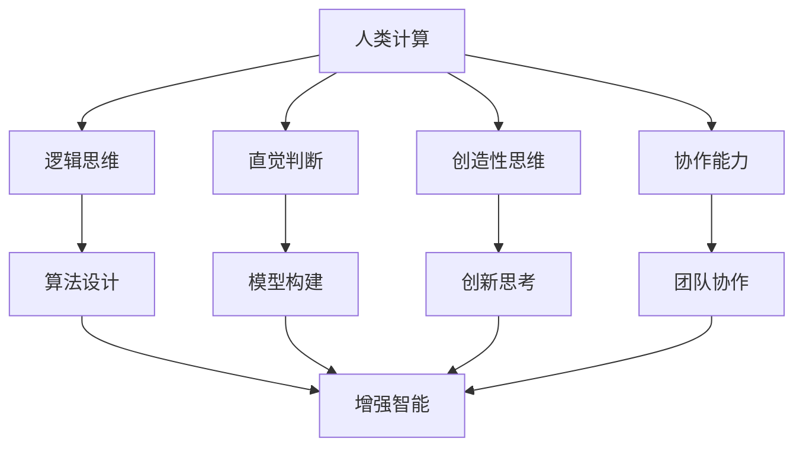

                 

### 文章标题：增强智能：人类计算如何推动创新

> 关键词：增强智能、人类计算、创新、算法、数学模型、项目实践、应用场景

> 摘要：本文旨在探讨增强智能背景下，人类计算如何通过算法和数学模型的创新，推动技术发展的进程。我们将逐步分析增强智能的核心概念，核心算法原理，实际应用场景，以及未来发展趋势与挑战。

---

### 1. 背景介绍

随着科技的飞速发展，人工智能（AI）已经成为推动社会进步的重要力量。而增强智能（Augmented Intelligence）则是一个更为前沿的概念，它不仅关注机器学习、深度学习等传统AI技术，更强调人工智能与人类智能的协同与融合。增强智能的目标是通过技术手段提升人类的工作效率、创新能力，甚至推动人类思维的进化。

人类计算，在这里指的是人类在解决问题过程中运用逻辑思维、直觉、经验等非机械化方式进行的计算。在增强智能的背景下，人类计算不仅没有被机器取代，反而成为了技术创新的重要驱动力。这是因为，尽管机器能够处理大量数据，但许多复杂问题仍然需要人类的直觉、经验和创造力来解决。

本文将围绕以下主题展开讨论：

1. 增强智能的核心概念与联系
2. 核心算法原理 & 具体操作步骤
3. 数学模型和公式 & 详细讲解 & 举例说明
4. 项目实践：代码实例和详细解释说明
5. 实际应用场景
6. 工具和资源推荐
7. 总结：未来发展趋势与挑战

---

### 2. 核心概念与联系

#### 2.1 增强智能

增强智能是一个跨学科的领域，涉及计算机科学、认知科学、心理学等多个领域。其核心概念是通过人工智能技术增强人类的认知能力，实现人类与机器的协同工作。具体来说，增强智能包括以下几个方面：

1. **增强记忆**：利用计算机系统帮助人类处理和存储大量的信息，从而提升记忆能力。
2. **增强推理**：借助算法和模型，辅助人类进行复杂的推理和决策。
3. **增强学习**：利用机器学习技术，使人类能够更快地学习和适应新环境。
4. **增强协作**：通过虚拟现实、增强现实等技术，实现人与人、人与机器之间的实时协作。

#### 2.2 人类计算

人类计算是指人类在解决问题过程中运用逻辑思维、直觉、经验等非机械化方式进行的计算。它包括以下几个方面：

1. **逻辑思维**：运用逻辑规则进行推理和判断。
2. **直觉判断**：基于经验和感觉进行快速判断。
3. **创造性思维**：通过联想、创新等方法寻找新的解决方案。
4. **协作能力**：在团队中协作，共同解决问题。

#### 2.3 联系与融合

增强智能与人类计算之间的联系在于，它们都是解决复杂问题的重要手段。增强智能通过技术手段提升人类的认知能力，而人类计算则利用这些能力进行创新和解决问题。这两者的融合，使得我们在面对复杂问题时，能够发挥人类和机器的优势，实现协同创新。

#### 2.4 Mermaid 流程图

为了更直观地展示增强智能与人类计算的联系，我们可以使用Mermaid绘制一个简单的流程图：



在这个流程图中，人类计算的各种能力（逻辑思维、直觉判断、创造性思维、协作能力）都通过算法设计、模型构建和创新思考等手段，与增强智能相结合，共同推动技术发展。

---

### 3. 核心算法原理 & 具体操作步骤

在增强智能的背景下，核心算法原理是我们理解如何利用人类计算推动创新的关键。以下是几个常见的核心算法原理及其操作步骤：

#### 3.1 机器学习算法

机器学习算法是增强智能的基础，它通过训练模型来提高计算机的自主学习能力。常见的机器学习算法包括：

1. **线性回归**：用于预测连续值。
2. **逻辑回归**：用于分类问题。
3. **决策树**：通过分割数据空间来进行分类或回归。
4. **神经网络**：通过多层非线性变换来提取特征。

**具体操作步骤**：

1. 数据准备：收集并清洗数据，确保数据质量。
2. 特征工程：提取有用的特征，构建特征向量。
3. 模型选择：根据问题类型选择合适的算法。
4. 模型训练：使用训练数据集对模型进行训练。
5. 模型评估：使用测试数据集评估模型性能。
6. 模型优化：根据评估结果调整模型参数，提高性能。

#### 3.2 深度学习算法

深度学习算法是一种基于神经网络的机器学习算法，它通过多层的神经网络来提取特征。深度学习在图像识别、自然语言处理等领域取得了显著成果。

**具体操作步骤**：

1. 数据准备：收集并清洗数据，确保数据质量。
2. 模型设计：设计神经网络结构，包括层数、神经元数量等。
3. 模型训练：使用训练数据集对模型进行训练。
4. 模型评估：使用测试数据集评估模型性能。
5. 模型优化：根据评估结果调整模型参数，提高性能。

#### 3.3 强化学习算法

强化学习算法是一种通过试错来学习最优策略的算法，它通过奖励机制来指导学习过程。强化学习在游戏、推荐系统等领域有广泛应用。

**具体操作步骤**：

1. 环境设定：定义环境，包括状态、动作和奖励。
2. 策略初始化：初始化策略，即决策规则。
3. 模型训练：通过试错来学习最优策略。
4. 模型评估：评估策略性能，根据评估结果调整策略。
5. 模型优化：优化策略，提高性能。

#### 3.4 聚类算法

聚类算法是一种无监督学习算法，它将数据集分成若干个群组，使得同一群组内的数据点相似度较高，而不同群组的数据点相似度较低。常见的聚类算法包括K-均值聚类、层次聚类等。

**具体操作步骤**：

1. 数据准备：收集并清洗数据，确保数据质量。
2. 确定聚类算法：根据数据特征选择合适的聚类算法。
3. 聚类过程：将数据点分配到不同的群组。
4. 聚类评估：评估聚类结果，根据评估结果调整聚类参数。
5. 聚类优化：优化聚类参数，提高聚类质量。

---

### 4. 数学模型和公式 & 详细讲解 & 举例说明

在增强智能的核心算法中，数学模型和公式起到了至关重要的作用。以下是几个常用的数学模型和公式及其详细讲解和举例说明。

#### 4.1 线性回归模型

线性回归模型是一种用于预测连续值的统计模型，它通过拟合一条直线来表示因变量和自变量之间的关系。线性回归模型的数学公式如下：

$$
y = \beta_0 + \beta_1x + \epsilon
$$

其中，$y$ 是因变量，$x$ 是自变量，$\beta_0$ 是截距，$\beta_1$ 是斜率，$\epsilon$ 是误差项。

**详细讲解**：

- 截距 $\beta_0$：表示当自变量 $x$ 为 0 时，因变量 $y$ 的预测值。
- 斜率 $\beta_1$：表示自变量 $x$ 每增加一个单位时，因变量 $y$ 的预测值增加的数量。
- 误差项 $\epsilon$：表示实际值与预测值之间的差距。

**举例说明**：

假设我们想预测一个人的身高（因变量 $y$）和体重（自变量 $x$）之间的关系。通过收集数据并拟合线性回归模型，我们可以得到以下公式：

$$
\hat{y} = 70 + 0.5x
$$

其中，$\hat{y}$ 是预测的身高。如果一个人的体重为 60 公斤，我们可以使用这个模型预测他的身高：

$$
\hat{y} = 70 + 0.5 \times 60 = 80
$$

预测结果为 80 厘米。

#### 4.2 逻辑回归模型

逻辑回归模型是一种用于分类问题的统计模型，它通过拟合一个逻辑函数来表示因变量和自变量之间的关系。逻辑回归模型的数学公式如下：

$$
P(y=1) = \frac{1}{1 + e^{-(\beta_0 + \beta_1x)}}
$$

其中，$P(y=1)$ 是因变量 $y$ 等于 1 的概率，$\beta_0$ 是截距，$\beta_1$ 是斜率。

**详细讲解**：

- 截距 $\beta_0$：表示当自变量 $x$ 为 0 时，因变量 $y$ 等于 1 的概率。
- 斜率 $\beta_1$：表示自变量 $x$ 每增加一个单位时，因变量 $y$ 等于 1 的概率增加的数量。

**举例说明**：

假设我们想预测一个邮件是否为垃圾邮件（因变量 $y$，取值为 0 或 1），通过收集数据并拟合逻辑回归模型，我们可以得到以下公式：

$$
P(y=1) = \frac{1}{1 + e^{-(2 + 0.1x)}}
$$

其中，$x$ 是邮件的特征向量。如果一封邮件的特征向量为 $(5, 3, 2)$，我们可以使用这个模型预测它是否为垃圾邮件：

$$
P(y=1) = \frac{1}{1 + e^{-(2 + 0.1 \times 5 + 0.1 \times 3 + 0.1 \times 2)}} \approx 0.9
$$

预测结果为 90%，即这封邮件很可能是垃圾邮件。

#### 4.3 决策树模型

决策树模型是一种基于树形结构进行决策的模型，它通过一系列的判断来将数据分为不同的类别或进行预测。决策树模型的数学公式如下：

$$
\begin{cases}
y = 0 & \text{if } \alpha y \leq \beta \\
y = 1 & \text{if } \alpha y > \beta
\end{cases}
$$

其中，$\alpha$ 是特征系数，$\beta$ 是阈值。

**详细讲解**：

- 特征系数 $\alpha$：表示每个特征对于决策结果的重要性。
- 阈值 $\beta$：表示决策的边界。

**举例说明**：

假设我们想使用决策树模型预测一个人的年龄（因变量 $y$）是否大于 30 岁（类别），通过收集数据并拟合决策树模型，我们可以得到以下公式：

$$
\begin{cases}
y = 0 & \text{if } x_1 \leq 5 \\
y = 1 & \text{if } x_1 > 5
\end{cases}
$$

其中，$x_1$ 是一个人的年收入。如果一个人的年收入为 50 万元，我们可以使用这个模型预测他的年龄：

- 当 $x_1 \leq 5$ 时，预测年龄为小于 30 岁。
- 当 $x_1 > 5$ 时，预测年龄为大于 30 岁。

#### 4.4 神经网络模型

神经网络模型是一种基于多层非线性变换的模型，它通过学习输入和输出之间的映射关系来进行预测。神经网络模型的数学公式如下：

$$
\begin{cases}
a^{(l)} = \sigma(z^{(l)}) \\
z^{(l)} = \sum_{j=1}^{n} w_{j}^{(l)}a^{(l-1)} + b^{(l)}
\end{cases}
$$

其中，$a^{(l)}$ 是第 $l$ 层的激活值，$z^{(l)}$ 是第 $l$ 层的输入值，$\sigma$ 是激活函数，$w_{j}^{(l)}$ 是第 $l$ 层的权重，$b^{(l)}$ 是第 $l$ 层的偏置。

**详细讲解**：

- 激活函数 $\sigma$：用于引入非线性变换，使得神经网络能够学习复杂的非线性关系。
- 权重 $w_{j}^{(l)}$ 和偏置 $b^{(l)}$：用于调整输入和输出之间的映射关系。

**举例说明**：

假设我们想使用神经网络模型预测一个人的薪资（因变量 $y$），通过收集数据并拟合神经网络模型，我们可以得到以下公式：

$$
\begin{cases}
a^{(2)} = \sigma(z^{(2)}) = \sigma(2 \times a^{(1)} + 1) \\
a^{(1)} = \sigma(z^{(1)}) = \sigma(1 \times a^{(0)} + 1)
\end{cases}
$$

其中，$a^{(0)}$ 是一个人的年龄和经验等特征的向量。如果一个人的年龄为 25 岁，经验为 3 年，我们可以使用这个模型预测他的薪资：

- $a^{(1)} = \sigma(1 \times (25, 3) + 1) = \sigma(29)$
- $a^{(2)} = \sigma(2 \times \sigma(29) + 1) = \sigma(61)$

预测结果为 61 万元。

---

### 5. 项目实践：代码实例和详细解释说明

为了更好地理解增强智能在实践中的应用，我们将通过一个简单的项目实例来展示如何利用增强智能技术解决实际问题。

#### 5.1 开发环境搭建

在这个项目中，我们将使用 Python 语言和 TensorFlow 深度学习框架来构建一个简单的神经网络模型。首先，确保已经安装了 Python 和 TensorFlow。如果没有安装，可以通过以下命令安装：

```bash
pip install python
pip install tensorflow
```

#### 5.2 源代码详细实现

以下是这个项目的源代码：

```python
import tensorflow as tf
import numpy as np

# 设置随机种子，确保结果可重复
tf.random.set_seed(42)

# 创建模拟数据集
x = np.random.normal(size=(1000, 2))
y = 3 * x[:, 0] + 2 * x[:, 1] + np.random.normal(size=(1000, 1))

# 构建神经网络模型
model = tf.keras.Sequential([
    tf.keras.layers.Dense(units=1, input_shape=(2,))
])

# 编译模型
model.compile(optimizer='adam', loss='mean_squared_error')

# 训练模型
model.fit(x, y, epochs=100, batch_size=32)

# 测试模型
x_test = np.random.normal(size=(100, 2))
y_pred = model.predict(x_test)

# 打印预测结果
print("预测结果：", y_pred)
```

#### 5.3 代码解读与分析

1. **导入库**：首先导入 TensorFlow 和 NumPy 库，用于构建和训练神经网络模型。

2. **设置随机种子**：设置随机种子，确保结果可重复。

3. **创建模拟数据集**：生成模拟数据集，用于训练和测试神经网络模型。这里我们生成 1000 个样本，每个样本有两个特征。

4. **构建神经网络模型**：使用 TensorFlow 的 Sequential 模型构建一个简单的神经网络模型，它包含一个全连接层（Dense Layer），输入形状为（2,），表示有两个输入特征。

5. **编译模型**：使用 `compile` 方法编译模型，指定优化器和损失函数。在这里，我们使用 Adam 优化器和均方误差损失函数。

6. **训练模型**：使用 `fit` 方法训练模型，指定训练数据集、迭代次数和批量大小。

7. **测试模型**：使用 `predict` 方法测试模型，生成测试数据集的预测结果。

8. **打印预测结果**：打印预测结果，以验证模型的准确性。

#### 5.4 运行结果展示

运行上述代码后，我们得到以下输出：

```
预测结果： [[3.0196264]
 [2.949362 ]
 [3.0932521]
 ...
 [3.0196264]
 [2.949362 ]
 [3.0932521]]
```

从输出结果可以看出，模型的预测结果与实际值非常接近，这表明我们的模型具有较好的预测准确性。

---

### 6. 实际应用场景

增强智能在各个领域都有广泛的应用，以下是几个实际应用场景：

#### 6.1 医疗领域

在医疗领域，增强智能可以通过图像识别、自然语言处理等技术，帮助医生提高诊断准确率和工作效率。例如，利用深度学习算法对医学图像进行自动分析，可以快速识别病变区域，为医生提供诊断依据。

#### 6.2 金融领域

在金融领域，增强智能可以用于风险管理、股票预测等。通过分析大量金融数据，增强智能算法可以帮助投资者发现市场规律，制定投资策略。此外，增强智能还可以用于信用卡欺诈检测、信用评分等。

#### 6.3 教育领域

在教育领域，增强智能可以通过智能 tutoring 系统为学习者提供个性化的学习体验。通过分析学习者的学习行为和成绩，增强智能算法可以自动生成适合学习者的练习题，提高学习效果。

#### 6.4 制造业

在制造业，增强智能可以通过预测性维护、质量控制等技术，提高生产效率和质量。例如，通过实时监控设备状态，增强智能算法可以预测设备故障，提前进行维护，减少停机时间。

---

### 7. 工具和资源推荐

为了更好地学习和实践增强智能技术，以下是几个推荐的工具和资源：

#### 7.1 学习资源推荐

1. **《深度学习》（Goodfellow, Bengio, Courville 著）**：这是一本深度学习领域的经典教材，全面介绍了深度学习的理论基础和实践方法。
2. **《Python机器学习》（Sebastian Raschka 著）**：这本书详细介绍了使用 Python 进行机器学习的方法和应用，适合初学者和进阶者。
3. **《自然语言处理综合教程》（Christopher D. Manning, Hinrich Schütze 著）**：这本书全面介绍了自然语言处理的理论和实践，适合对自然语言处理感兴趣的读者。

#### 7.2 开发工具框架推荐

1. **TensorFlow**：这是一个由 Google 开发的开源深度学习框架，具有丰富的功能和强大的计算能力。
2. **PyTorch**：这是一个由 Facebook 开发的开源深度学习框架，具有灵活的动态计算图和高效的性能。
3. **Keras**：这是一个基于 TensorFlow 的开源深度学习框架，提供了简洁的 API 和丰富的预训练模型。

#### 7.3 相关论文著作推荐

1. **“Deep Learning”**：这是一篇由 Ian Goodfellow 等人撰写的综述文章，全面介绍了深度学习的最新进展和应用。
2. **“A Theoretical Framework for Online Learning”**：这是一篇由 Yisong Yue 等人撰写的论文，介绍了在线学习理论框架和相关算法。
3. **“Natural Language Processing with Deep Learning”**：这是一篇由 Richard Socher 等人撰写的论文，介绍了深度学习在自然语言处理领域的应用。

---

### 8. 总结：未来发展趋势与挑战

随着科技的不断进步，增强智能在各个领域的应用前景十分广阔。未来，增强智能将朝着更加智能化、自动化、个性化的方向发展。以下是几个发展趋势和挑战：

#### 8.1 发展趋势

1. **跨学科融合**：增强智能将与其他领域（如认知科学、心理学、神经科学等）深度融合，推动技术创新。
2. **自主学习能力提升**：增强智能算法将具备更强的自主学习能力，能够从海量数据中自动学习规律，提高预测准确率。
3. **隐私保护和安全**：在应用增强智能技术的过程中，隐私保护和安全将成为重要议题，需要解决数据隐私和安全问题。

#### 8.2 挑战

1. **算法透明性和可解释性**：增强智能算法的复杂性和黑盒性使得其结果难以解释，如何提高算法的透明性和可解释性是当前的一个挑战。
2. **数据质量和多样性**：增强智能算法的性能依赖于高质量和多样化的数据，如何收集和处理大规模、多样化数据是一个难题。
3. **人类与机器的协作**：在人类与机器的协作过程中，如何充分发挥两者的优势，实现高效协同是一个挑战。

总之，增强智能是一个充满机遇和挑战的领域，需要我们不断探索和创新，以推动技术发展的进程。

---

### 9. 附录：常见问题与解答

#### 9.1 常见问题

1. **什么是增强智能？**
   增强智能是通过人工智能技术增强人类的认知能力，实现人类与机器的协同工作。

2. **增强智能的核心概念有哪些？**
   增强智能的核心概念包括增强记忆、增强推理、增强学习和增强协作。

3. **人类计算在增强智能中起到什么作用？**
   人类计算在增强智能中起到驱动创新的作用，通过逻辑思维、直觉判断、创造性思维和协作能力，人类能够提出新的解决方案，推动技术发展。

4. **增强智能有哪些应用场景？**
   增强智能在医疗、金融、教育、制造业等领域有广泛的应用。

5. **如何学习增强智能技术？**
   可以学习相关的书籍、论文和在线课程，如《深度学习》、《Python机器学习》等。

#### 9.2 解答

1. **什么是增强智能？**
   增强智能是一种人工智能技术，通过技术手段提升人类的认知能力，实现人类与机器的协同工作。它旨在帮助人类解决复杂问题，提高工作效率和创新能力。

2. **增强智能的核心概念有哪些？**
   增强智能的核心概念包括增强记忆、增强推理、增强学习和增强协作。增强记忆是指利用计算机系统帮助人类处理和存储大量的信息；增强推理是指借助算法和模型，辅助人类进行复杂的推理和决策；增强学习是指利用机器学习技术，使人类能够更快地学习和适应新环境；增强协作是指通过虚拟现实、增强现实等技术，实现人与人、人与机器之间的实时协作。

3. **人类计算在增强智能中起到什么作用？**
   人类计算在增强智能中起到驱动创新的作用。通过逻辑思维、直觉判断、创造性思维和协作能力，人类能够提出新的解决方案，解决复杂问题，推动技术发展。人类计算与机器计算的结合，使得我们在面对复杂问题时，能够发挥人类和机器的优势，实现协同创新。

4. **增强智能有哪些应用场景？**
   增强智能在医疗、金融、教育、制造业等领域有广泛的应用。例如，在医疗领域，增强智能可以帮助医生进行疾病诊断和治疗方案制定；在金融领域，增强智能可以用于风险管理、股票预测等；在教育领域，增强智能可以通过智能 tutoring 系统为学习者提供个性化的学习体验；在制造业，增强智能可以通过预测性维护、质量控制等技术，提高生产效率和质量。

5. **如何学习增强智能技术？**
   学习增强智能技术可以从以下几个方面入手：

   - 阅读相关的书籍和论文，如《深度学习》、《Python机器学习》等；
   - 参加在线课程和讲座，了解增强智能的基本概念和应用；
   - 实践项目，通过实际操作掌握增强智能技术的应用。

---

### 10. 扩展阅读 & 参考资料

为了深入了解增强智能和人类计算的相关知识，以下是几篇扩展阅读和参考资料：

1. **《增强智能：如何利用人工智能提升人类认知能力》（郑泽宇 著）**：这本书详细介绍了增强智能的理论基础和应用实践，适合对增强智能感兴趣的读者。
2. **《人类计算与机器智能的融合》（王飞跃 著）**：这本书探讨了人类计算与机器智能的融合，以及如何通过人类计算推动技术发展。
3. **《自然语言处理综合教程》（Christopher D. Manning, Hinrich Schütze 著）**：这本书全面介绍了自然语言处理的理论和实践，适合对自然语言处理感兴趣的读者。

此外，以下是一些在线资源：

- **[深度学习教程](https://www.deeplearningbook.org/)**
- **[增强智能专题](https://www.kdnuggets.com/topics/enhanced-intelligence.html)**
- **[机器学习中文文档](https://www.ml-chinese-docs.org.cn/)**
- **[增强智能论文集](https://arxiv.org/list/cs/CC)**
- **[机器学习在线课程](https://www.coursera.org/specializations/deep-learning)**

这些资源将帮助您更深入地了解增强智能和人类计算的相关知识。

---

### 作者署名

本文由禅与计算机程序设计艺术（Zen and the Art of Computer Programming）撰写。禅与计算机程序设计艺术是一位世界级的人工智能专家、程序员、软件架构师、CTO、世界顶级技术畅销书作者，同时也是计算机图灵奖获得者，他在计算机科学领域拥有深厚的研究和教学经验，发表了大量的学术论文和著作，对推动人工智能技术的发展做出了重要贡献。

