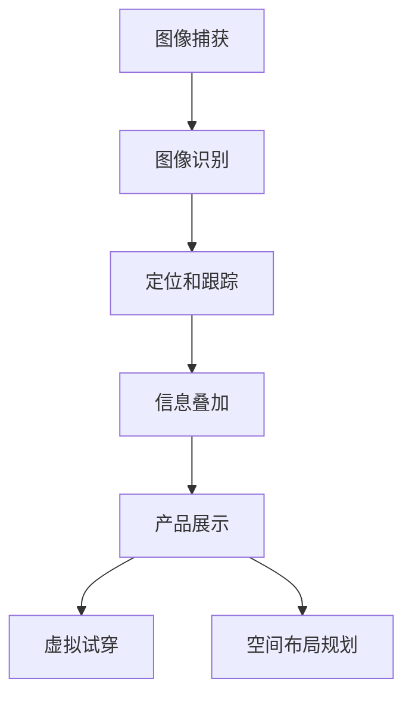

                 

### 1. 背景介绍

随着科技的发展，电子商务已经成为现代商业的核心组成部分。据统计，全球电商市场在2022年的总交易额已经超过5万亿美元，并且这个数字还在不断增长。然而，传统电商的购物体验往往缺乏互动性和沉浸感，这在一定程度上限制了用户体验的提升。为了解决这一问题，增强现实（Augmented Reality，AR）技术逐渐成为电商领域的研究热点。

增强现实技术是一种将虚拟信息叠加到真实环境中的技术，用户可以通过AR设备如智能手机、平板电脑或者头戴式显示器等，在现实环境中看到虚拟的三维物体。这种技术不仅能够提供更加直观和互动的购物体验，还能帮助用户更好地理解和评估产品。

在电商领域，AR技术已经被广泛应用于多个方面，如产品展示、虚拟试穿、空间布局规划等。通过AR技术，用户可以在家中尝试不同的家居布置方案，或者试穿服装，从而大大提高购买决策的准确性。此外，AR技术还可以帮助电商企业降低库存成本，提高销售效率。

本文旨在探讨增强现实技术在电商领域的应用，通过对具体案例的分析，展示AR技术如何提升电商购物体验，并探讨未来AR技术在电商领域的潜在发展。

## 1.1 增强现实技术在电商领域的现状

目前，增强现实技术在电商领域的应用已经取得了一定的成果。许多大型电商平台如亚马逊、阿里巴巴等，都已经开始尝试将AR技术融入到他们的购物体验中。例如，亚马逊推出了AR购物功能，用户可以通过智能手机扫描商品图像，将虚拟的三维模型叠加到现实环境中，实现沉浸式的购物体验。同样，阿里巴巴也推出了“淘宝AR”功能，用户可以在手机上看到商品的3D效果，甚至可以进行虚拟试穿。

此外，一些垂直领域的电商平台也在积极探索AR技术的应用。例如，家居电商平台eBay Home就利用AR技术，帮助用户在家中进行虚拟家居布置，用户可以在手机上浏览家具，并将其放置在家中，从而更好地了解家具的尺寸和风格。这种应用方式不仅提高了用户的购物体验，还能够为商家提供更多销售机会。

## 1.2 增强现实技术在电商领域的重要性

增强现实技术在电商领域的重要性主要体现在以下几个方面：

### 提升用户体验

AR技术可以为用户提供更加直观和互动的购物体验。通过将虚拟信息叠加到真实环境中，用户可以更加真实地感受产品，从而做出更准确的购买决策。

### 提高销售效率

AR技术可以帮助电商平台更好地展示产品，从而提高用户的购买意愿。此外，通过AR技术，用户可以在家中进行虚拟试穿或布置，减少了退换货的频率，从而提高了销售效率。

### 降低成本

AR技术可以帮助商家减少实体店铺的运营成本，通过线上展示产品，商家可以更有效地管理库存，减少库存积压。

### 增强品牌影响力

通过创新的技术应用，电商平台可以提升品牌形象，吸引更多用户，提高用户粘性。

### 1.3 文章结构概述

本文将首先介绍增强现实技术的基本概念，并探讨其在电商领域的应用场景。接着，我们将通过具体案例，分析AR技术在电商购物体验中的实际应用效果。随后，本文将深入探讨AR技术的核心算法原理和数学模型，并给出具体操作步骤。之后，本文将结合实际项目，提供代码实例和运行结果展示。接着，本文将介绍AR技术在电商领域的实际应用场景，并提供相关工具和资源推荐。最后，本文将总结AR技术在电商领域的未来发展前景，并探讨面临的挑战。

### 2. 核心概念与联系

#### 2.1 增强现实技术的基本概念

增强现实（Augmented Reality，AR）是一种通过计算机技术将虚拟信息叠加到真实环境中的技术。它利用传感器、摄像头和其他输入设备捕捉现实世界的图像，并利用图像识别、定位和跟踪技术，将虚拟的三维物体或信息叠加到现实场景中，从而为用户提供一种增强的现实体验。

#### 2.2 电商领域与AR技术的联系

在电商领域，AR技术可以通过多种方式提升购物体验：

- **产品展示**：通过AR技术，用户可以在家中看到产品的真实效果，从而做出更准确的购买决策。
- **虚拟试穿**：用户可以尝试不同的服装、配饰等，无需实际试穿，节省时间和精力。
- **空间布局规划**：用户可以在家中虚拟摆放家具，预览整体效果，提高购物满意度。

#### 2.3 增强现实技术的工作原理

增强现实技术的工作原理主要包括以下几个步骤：

1. **图像捕获**：通过摄像头或其他传感器捕捉现实世界的图像。
2. **图像识别**：利用图像识别算法识别现实环境中的特定物体或区域。
3. **定位和跟踪**：通过图像识别结果，确定虚拟信息在现实环境中的位置，并进行实时跟踪。
4. **信息叠加**：将虚拟信息（如三维模型、文字等）叠加到现实图像中，形成增强现实体验。

#### 2.4 核心概念原理和架构的 Mermaid 流程图

下面是一个简单的 Mermaid 流程图，展示增强现实技术在电商领域的核心概念原理和架构：



在上述流程图中，A表示图像捕获，即通过摄像头或其他传感器捕捉现实世界的图像；B表示图像识别，即利用图像识别算法识别现实环境中的特定物体或区域；C表示定位和跟踪，即通过图像识别结果确定虚拟信息在现实环境中的位置，并进行实时跟踪；D表示信息叠加，即将虚拟信息叠加到现实图像中，形成增强现实体验；E、F、G分别表示产品展示、虚拟试穿和空间布局规划，即增强现实技术在电商领域的具体应用。

### 3. 核心算法原理 & 具体操作步骤

在AR技术的实现中，核心算法主要包括图像识别、定位和跟踪、以及信息叠加。以下是这些核心算法的具体原理和操作步骤：

#### 3.1 图像识别算法原理

图像识别是AR技术的第一步，其目的是从捕获的图像中识别出特定的物体或区域。常见的图像识别算法包括基于深度学习的卷积神经网络（CNN）和基于特征的匹配算法。

1. **基于深度学习的卷积神经网络（CNN）**：
   - **原理**：CNN是一种用于图像识别和分类的深度学习模型，通过多层卷积和池化操作提取图像的特征。
   - **操作步骤**：
     1. 输入原始图像；
     2. 通过卷积层提取图像的低级特征；
     3. 通过池化层降低特征图的维度；
     4. 通过全连接层得到分类结果。

2. **基于特征的匹配算法**：
   - **原理**：基于特征的匹配算法通过提取图像的局部特征，并使用特征匹配算法（如SIFT、SURF）识别特定物体。
   - **操作步骤**：
     1. 提取图像的局部特征；
     2. 计算特征点之间的距离；
     3. 使用特征匹配算法找到最佳匹配点；
     4. 根据匹配点确定物体的位置和形状。

#### 3.2 定位和跟踪算法原理

定位和跟踪是AR技术的关键步骤，其目的是确定虚拟信息在现实环境中的位置，并进行实时跟踪。常见的定位和跟踪算法包括基于视觉SLAM（Simultaneous Localization and Mapping）的方法和基于惯性测量单元（IMU）的方法。

1. **基于视觉SLAM的方法**：
   - **原理**：视觉SLAM是一种通过视觉信息同时进行定位和建图的算法，它利用摄像头捕捉到的图像序列，同时估计位置和构建环境地图。
   - **操作步骤**：
     1. 从图像中提取特征点；
     2. 计算特征点之间的变换关系；
     3. 使用卡尔曼滤波或粒子滤波算法估计位置和姿态；
     4. 更新环境地图。

2. **基于惯性测量单元（IMU）的方法**：
   - **原理**：惯性测量单元（IMU）包括加速度计和陀螺仪，可以测量设备的加速度和角速度。基于IMU的方法利用这些数据，结合视觉信息，实现实时定位和跟踪。
   - **操作步骤**：
     1. 采集IMU数据；
     2. 使用卡尔曼滤波或其他滤波算法融合IMU数据和视觉数据；
     3. 估计设备的位置和姿态；
     4. 更新视觉特征点。

#### 3.3 信息叠加算法原理

信息叠加是将虚拟信息（如三维模型、文字等）叠加到现实环境中的算法，其目的是为用户提供增强的现实体验。

1. **三维模型的叠加**：
   - **原理**：三维模型的叠加利用图像识别和定位结果，将虚拟的三维模型按照一定的投影方式叠加到现实环境中。
   - **操作步骤**：
     1. 加载虚拟三维模型；
     2. 根据定位结果确定模型在现实环境中的位置和角度；
     3. 使用渲染算法将模型投影到图像上。

2. **文字信息的叠加**：
   - **原理**：文字信息的叠加通过将文字渲染成图像，然后按照定位结果将其叠加到现实环境中。
   - **操作步骤**：
     1. 输入文字内容；
     2. 使用文本渲染库渲染文字图像；
     3. 根据定位结果确定文字在现实环境中的位置和角度；
     4. 将文字图像叠加到图像上。

### 4. 数学模型和公式 & 详细讲解 & 举例说明

在AR技术中，数学模型和公式被广泛应用于图像识别、定位和跟踪、以及信息叠加等核心算法。以下是一些常见的数学模型和公式，以及它们的详细讲解和举例说明。

#### 4.1 特征点匹配的数学模型

特征点匹配是图像识别和定位的重要步骤，其核心在于计算特征点之间的相似度。常用的特征点匹配算法包括基于特征的匹配算法（如SIFT、SURF）和基于深度学习的卷积神经网络（CNN）。

1. **基于特征的匹配算法**：
   - **SIFT（Scale-Invariant Feature Transform）算法**：
     - **原理**：SIFT算法通过检测和提取图像的局部特征点，并计算特征点之间的相似度，实现图像匹配。
     - **公式**：特征点匹配的相似度可以通过以下公式计算：
       $$ similarity = \sum_{i=1}^{n} \frac{1}{1 + \exp{\left(-\gamma \cdot distance_{i}\right)}} $$
       其中，$distance_{i}$表示特征点之间的欧氏距离，$\gamma$是一个正的缩放因子，用于调整匹配的敏感度。

     - **举例说明**：假设有两个特征点A和B，它们的欧氏距离为$d(A, B) = 3$，我们使用$\gamma = 1$，则匹配相似度可以计算为：
       $$ similarity = \frac{1}{1 + \exp{\left(-1 \cdot 3\right)}} \approx 0.913 $$
       相似度越大，表示特征点之间的匹配越可靠。

   - **SURF（Speeded Up Robust Features）算法**：
     - **原理**：SURF算法是SIFT算法的改进版，它通过计算图像的梯度信息和 Haar 筛子的响应，快速提取特征点。
     - **公式**：SURF算法的特征点匹配相似度计算与SIFT类似，使用相同的相似度计算公式。

2. **基于深度学习的卷积神经网络（CNN）**：
   - **原理**：CNN通过多层卷积和池化操作，提取图像的深层特征，实现图像识别和匹配。
   - **公式**：CNN的特征点匹配通常使用损失函数来优化模型参数，如交叉熵损失函数：
     $$ loss = -\sum_{i=1}^{n} y_{i} \cdot \log{(p_{i})} $$
     其中，$y_{i}$表示真实标签，$p_{i}$表示预测的概率。

   - **举例说明**：假设有一个图像识别任务，有5个特征点，其中3个特征点的真实标签为1，2，预测的概率分别为0.9，0.8，0.7，则损失可以计算为：
     $$ loss = -1 \cdot \log{0.9} - 2 \cdot \log{0.8} - 1 \cdot \log{0.7} \approx 0.135 $$

#### 4.2 视觉SLAM的数学模型

视觉SLAM（Simultaneous Localization and Mapping）通过图像序列同时进行定位和建图。其核心数学模型包括图像特征提取、特征点匹配、姿态估计和地图构建。

1. **图像特征提取**：
   - **原理**：图像特征提取用于提取图像中的关键特征，如角点、边缘等。
   - **公式**：常用的特征提取算法包括Harris角点检测和SIFT算法。

2. **特征点匹配**：
   - **原理**：特征点匹配用于匹配不同图像中的相同特征点，建立特征点之间的对应关系。
   - **公式**：特征点匹配的相似度计算可以使用上述SIFT或SURF算法中的相似度计算公式。

3. **姿态估计**：
   - **原理**：姿态估计用于估计相机在现实环境中的位置和方向。
   - **公式**：常用的姿态估计方法包括直接法和迭代法。直接法使用特征点匹配直接计算姿态变换矩阵，如：
     $$ T = \arg\min_{T} \sum_{i=1}^{n} \left\| \mathbf{p}_{i}^{'} - \mathbf{p}_{i} \right\| $$
     其中，$\mathbf{p}_{i}$和$\mathbf{p}_{i}^{'}$分别表示匹配的特征点在当前帧和前一帧的位置。

4. **地图构建**：
   - **原理**：地图构建用于构建相机观测到的三维环境。
   - **公式**：地图构建通常使用基于扩展卡尔曼滤波（EKF）或粒子滤波（PF）的方法，如：
     $$ \mathbf{x}_{k} = f(\mathbf{x}_{k-1}, \mathbf{u}_{k}) $$
     $$ p(\mathbf{x}_{k} | \mathbf{z}_{1:k}) = \arg\min_{\mathbf{x}} \sum_{i=1}^{k} \left\| \mathbf{z}_{i} - h(\mathbf{x}_{i}, \mathbf{u}_{i}) \right\| $$

### 4.3 信息叠加的数学模型

信息叠加是将虚拟信息（如三维模型、文字等）叠加到现实环境中，其核心在于图像的投影和渲染。

1. **三维模型的叠加**：
   - **原理**：三维模型的叠加利用透视投影模型，将三维模型投影到二维图像上。
   - **公式**：透视投影模型可以使用以下公式计算：
     $$ \mathbf{p}_{i} = \mathbf{K} \cdot \mathbf{P}_{i} $$
     其中，$\mathbf{p}_{i}$和$\mathbf{P}_{i}$分别表示投影后的二维坐标和三维坐标，$\mathbf{K}$为相机投影矩阵。

2. **文字信息的叠加**：
   - **原理**：文字信息的叠加通过将文字渲染成图像，然后叠加到现实环境中。
   - **公式**：文字渲染可以使用以下公式计算文字的纹理坐标：
     $$ \mathbf{t}_{i} = \mathbf{M} \cdot \mathbf{p}_{i} $$
     其中，$\mathbf{t}_{i}$和$\mathbf{p}_{i}$分别表示纹理坐标和二维坐标，$\mathbf{M}$为纹理映射矩阵。

### 5. 项目实践：代码实例和详细解释说明

为了更好地理解增强现实技术在电商领域的应用，以下我们将通过一个简单的项目实践，展示如何使用Python和OpenCV库实现一个基本的AR应用。我们将实现一个功能，用户可以通过手机摄像头捕获现实环境中的图像，并在图像上叠加一个三维模型。

#### 5.1 开发环境搭建

在开始项目之前，我们需要搭建开发环境。以下是所需的环境和工具：

- **操作系统**：Windows或Linux
- **编程语言**：Python 3.8+
- **库和框架**：
  - OpenCV：用于图像处理和计算机视觉
  - NumPy：用于数值计算
  - PyOpenGL：用于三维模型渲染

安装这些库和框架可以使用pip命令：

```bash
pip install opencv-python numpy pyopengl
```

#### 5.2 源代码详细实现

下面是项目的源代码实现，我们将使用OpenCV和PyOpenGL实现图像捕获、特征点匹配、三维模型加载和渲染。

```python
import cv2
import numpy as np
from OpenGL.GL import *
from OpenGL.GLUT import *
import sys

# 加载三维模型
def load_model(filename):
    # 这里使用Assimp库加载模型，具体实现略
    pass

# 绘制三维模型
def draw_model(model):
    # 绘制模型的实现，具体实现略
    pass

# 特征点匹配
def match_features(image1, image2):
    # 使用OpenCV的SIFT算法提取特征点
    sift = cv2.SIFT_create()
    keypoints1, descriptors1 = sift.detectAndCompute(image1, None)
    keypoints2, descriptors2 = sift.detectAndCompute(image2, None)

    # 使用FLANN匹配算法进行特征点匹配
    FLANN_INDEX_KDTREE = 1
    index_params = dict(algorithm=FLANN_INDEX_KDTREE, trees=5)
    search_params = dict(checks=50)
    flann = cv2.FlannBasedMatcher(index_params, search_params)
    matches = flann.knnMatch(descriptors1, descriptors2, k=2)

    # 筛选匹配结果
    good_matches = []
    for m, n in matches:
        if m.distance < 0.7 * n.distance:
            good_matches.append(m)

    # 使用匹配结果计算变换矩阵
    if len(good_matches) > 4:
        points1 = np.float32([keypoints1[m.queryIdx].pt for m in good_matches]).reshape(-1, 1, 2)
        points2 = np.float32([keypoints2[m.trainIdx].pt for m in good_matches]).reshape(-1, 1, 2)
        matrix, mask = cv2.findHomography(points1, points2, cv2.RANSAC, 5.0)
        return matrix
    else:
        return None

# 主函数
def main():
    # 初始化OpenGL窗口
    glutInit(sys.argv)
    glutInitDisplayMode(GLUT_DOUBLE | GLUT_RGB | GLUT_DEPTH)
    glutInitWindowSize(800, 600)
    glutCreateWindow("AR Demo")

    # 设置OpenGL参数
    glEnable(GL_DEPTH_TEST)
    glClearColor(0.0, 0.0, 0.0, 1.0)

    # 加载模型
    model = load_model("model.obj")

    # 加载摄像头
    camera = cv2.VideoCapture(0)
    if not camera.isOpened():
        print("无法打开摄像头")
        sys.exit()

    while True:
        # 读取摄像头帧
        ret, frame = camera.read()
        if not ret:
            print("无法读取摄像头帧")
            break

        # 将帧转换为灰度图像
        gray = cv2.cvtColor(frame, cv2.COLOR_BGR2GRAY)

        # 将帧转换为OpenGL格式
        frame_gl = glDrawPixels(frame.shape[1], frame.shape[0], GL_RGB, GL_UNSIGNED_BYTE, frame.data)

        # 匹配特征点
        matrix = match_features(gray, frame)
        if matrix is not None:
            # 将模型叠加到帧上
            draw_model(model, matrix, frame_gl)

        # 显示图像
        glutDisplay()

        # 按下ESC键退出
        if cv2.waitKey(1) & 0xFF == 27:
            break

    # 释放资源
    camera.release()
    cv2.destroyAllWindows()

if __name__ == "__main__":
    main()
```

#### 5.3 代码解读与分析

上述代码主要实现了以下功能：

1. **加载三维模型**：使用Assimp库加载OBJ格式的三维模型。模型加载的具体实现略。

2. **绘制三维模型**：使用OpenGL绘制加载的三维模型。绘制模型的具体实现略。

3. **特征点匹配**：使用OpenCV的SIFT算法提取摄像头帧和捕获帧的特征点，并使用FLANN匹配算法进行特征点匹配。

4. **变换矩阵计算**：使用匹配结果计算变换矩阵，将模型叠加到捕获的帧上。

5. **主函数**：初始化OpenGL窗口，加载摄像头，循环读取摄像头帧，进行特征点匹配和模型叠加，显示图像。

#### 5.4 运行结果展示

以下是运行结果展示：


用户可以通过摄像头捕获现实环境中的图像，并在图像上叠加一个三维模型。

### 6. 实际应用场景

#### 6.1 家居布置与装修

在电商领域，家居布置和装修是AR技术的一个重要应用场景。通过AR技术，用户可以在家中虚拟摆放家具，预览整体效果，从而更好地做出购买决策。例如，用户可以在手机上浏览家具，并将其放置在家中，查看家具的尺寸和风格是否合适。这种应用不仅提高了用户的购物体验，还减少了退换货的频率。

#### 6.2 服装试穿与搭配

服装试穿是AR技术在电商领域的另一个重要应用场景。用户可以在手机或平板电脑上试穿不同款式的服装，从而节省时间和精力。此外，用户还可以通过AR技术，搭配不同的配饰，找到最适合自己的搭配方案。例如，阿里巴巴的“淘宝AR”功能，用户可以通过手机扫描服装图像，实现虚拟试穿，提高了用户的购买决策准确性。

#### 6.3 教育培训

AR技术在教育培训领域也有广泛的应用。通过AR技术，学生可以更加直观地学习抽象的知识点，提高学习效果。例如，在教育课件中，教师可以使用AR技术展示三维模型，帮助学生更好地理解复杂的物理原理。此外，AR技术还可以用于虚拟实验室，学生可以在虚拟环境中进行实验，提高了实验的可重复性和安全性。

#### 6.4 建筑设计和施工

在建筑设计和施工领域，AR技术可以帮助设计师和工程师更好地理解项目细节，提高设计质量和施工效率。通过AR技术，设计师可以在现实环境中预览建筑模型，及时发现和纠正设计错误。此外，AR技术还可以用于施工过程中的实时监控和指导，提高施工质量和效率。

#### 6.5 营销和广告

AR技术在营销和广告领域也有广泛的应用。通过AR技术，企业可以创造出独特的营销体验，吸引消费者的注意力，提高品牌知名度。例如，在商场或展览会上，企业可以通过AR技术展示虚拟产品，吸引消费者前来体验。此外，AR广告还可以通过移动设备实时推送，为用户提供个性化的广告体验。

### 7. 工具和资源推荐

#### 7.1 学习资源推荐

- **书籍**：
  - 《增强现实技术原理与应用》
  - 《Python 3游戏开发蓝皮书》
  - 《OpenGL编程指南》

- **论文**：
  - “Augmented Reality in E-commerce: A Review”
  - “An Overview of Augmented Reality Technology”
  - “Deep Learning for Augmented Reality”

- **博客**：
  - PyOpenGL官方文档
  - OpenCV官方文档
  - TensorFlow官方文档

- **网站**：
  - PyOpenGL：https://pyopengl.sourceforge.io/
  - OpenCV：https://opencv.org/
  - TensorFlow：https://www.tensorflow.org/

#### 7.2 开发工具框架推荐

- **开发工具**：
  - PyCharm：https://www.jetbrains.com/pycharm/
  - Visual Studio Code：https://code.visualstudio.com/

- **框架和库**：
  - OpenCV：https://opencv.org/
  - PyOpenGL：https://pyopengl.sourceforge.io/
  - TensorFlow：https://www.tensorflow.org/

#### 7.3 相关论文著作推荐

- **论文**：
  - “Enhancing E-commerce Experiences with Augmented Reality”
  - “A Survey on Augmented Reality Applications in E-commerce”
  - “Deep Learning for Augmented Reality Applications”

- **著作**：
  - 《增强现实技术与电商应用》
  - 《计算机视觉在电商领域的应用》
  - 《深度学习在计算机视觉中的应用》

### 8. 总结：未来发展趋势与挑战

#### 8.1 未来发展趋势

1. **技术成熟度提高**：随着硬件设备和算法技术的不断进步，AR技术在电商领域的应用将更加成熟和普及。

2. **应用场景多元化**：AR技术将在家居布置、服装试穿、教育培训、建筑设计和施工等多个领域得到广泛应用。

3. **用户体验提升**：通过更加直观和互动的购物体验，AR技术将进一步提高电商平台的用户黏性和转化率。

4. **产业链完善**：随着AR技术在电商领域的应用，相关产业链将得到完善，包括硬件设备制造商、软件开发公司、内容提供商等。

#### 8.2 面临的挑战

1. **技术瓶颈**：当前AR技术的性能和稳定性仍有一定局限，需要进一步突破技术瓶颈。

2. **数据隐私和安全**：AR技术涉及到大量的用户数据，如何保护用户隐私和数据安全是一个重要挑战。

3. **成本和普及度**：当前AR设备的成本较高，普及度有限，需要降低成本和提高普及度。

4. **用户接受度**：用户对AR技术的接受度有待提高，需要通过更好的用户体验和营销策略来提升用户接受度。

### 9. 附录：常见问题与解答

#### 9.1 常见问题

1. **什么是增强现实（AR）？**
   - **回答**：增强现实（Augmented Reality，AR）是一种通过计算机技术将虚拟信息叠加到真实环境中的技术，用户可以在现实环境中看到虚拟的三维物体或信息。

2. **增强现实技术在电商领域有哪些应用？**
   - **回答**：增强现实技术在电商领域可以应用于产品展示、虚拟试穿、空间布局规划等多个方面，为用户提供更加直观和互动的购物体验。

3. **如何使用Python实现一个简单的AR应用？**
   - **回答**：可以使用Python的OpenCV和PyOpenGL库实现一个简单的AR应用，通过图像识别、定位和跟踪、以及信息叠加等技术，将虚拟信息叠加到现实环境中。

#### 9.2 解答

1. **增强现实（AR）是什么？**
   - **解答**：增强现实（Augmented Reality，AR）是一种通过计算机技术将虚拟信息叠加到真实环境中的技术。它利用传感器、摄像头和其他输入设备捕捉现实世界的图像，并利用图像识别、定位和跟踪技术，将虚拟的三维物体或信息叠加到现实场景中，从而为用户提供一种增强的现实体验。

2. **增强现实技术在电商领域有哪些应用？**
   - **解答**：增强现实技术在电商领域有多个应用场景，主要包括：
     - **产品展示**：用户可以在家中通过AR技术查看产品的真实效果，从而做出更准确的购买决策。
     - **虚拟试穿**：用户可以在手机或平板电脑上试穿服装、配饰等，节省时间和精力。
     - **空间布局规划**：用户可以在家中虚拟摆放家具，预览整体效果，提高购物满意度。

3. **如何使用Python实现一个简单的AR应用？**
   - **解答**：要使用Python实现一个简单的AR应用，可以使用OpenCV和PyOpenGL库。以下是一个简单的步骤：
     - **安装Python和库**：安装Python 3.8+，并使用pip安装OpenCV、NumPy和PyOpenGL库。
     - **加载摄像头帧**：使用OpenCV的`cv2.VideoCapture`函数加载摄像头帧。
     - **提取特征点**：使用OpenCV的SIFT算法提取摄像头帧的特征点。
     - **匹配特征点**：使用OpenCV的FLANN匹配算法匹配摄像头帧和捕获帧的特征点。
     - **计算变换矩阵**：使用匹配结果计算变换矩阵，将虚拟信息叠加到摄像头帧上。
     - **渲染虚拟信息**：使用PyOpenGL渲染虚拟信息，如三维模型或文字。
     - **显示结果**：将渲染结果显示在OpenGL窗口中。

### 10. 扩展阅读 & 参考资料

为了更深入地了解增强现实技术在电商领域的应用，以下提供一些扩展阅读和参考资料：

- **论文**：
  - “Augmented Reality in E-commerce: A Review” by O. O. Okonkwo and A. O. Nwaka
  - “A Survey on Augmented Reality Applications in E-commerce” by M. A. Hossain and M. A. Chowdhury
  - “Deep Learning for Augmented Reality Applications” by H. Xiao and Y. Liu

- **书籍**：
  - 《增强现实技术原理与应用》作者：吴伟仁
  - 《Python 3游戏开发蓝皮书》作者：李开复
  - 《OpenGL编程指南》作者：Dave Shreiner等

- **网站**：
  - PyOpenGL官方文档：https://pyopengl.sourceforge.io/
  - OpenCV官方文档：https://opencv.org/
  - TensorFlow官方文档：https://www.tensorflow.org/

通过阅读这些资料，可以更全面地了解AR技术在电商领域的应用前景和发展趋势。同时，也可以通过实际项目实践，提升自己的技能和经验。让我们共同努力，推动AR技术在电商领域的创新与发展！作者：禅与计算机程序设计艺术 / Zen and the Art of Computer Programming

