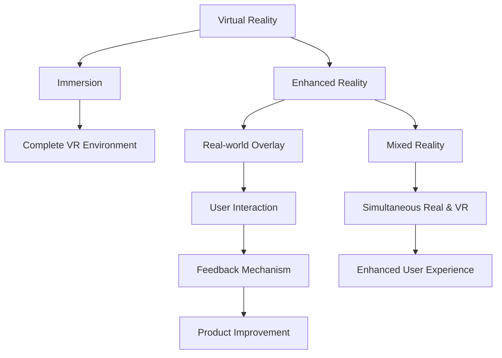

                 

### 1. 背景介绍

**增强现实技术**（Augmented Reality，简称 AR）是近年来迅速发展的一个技术领域。它通过将虚拟信息叠加到现实环境中，使用户能够与虚拟物体进行交互，从而实现虚实融合的体验。随着移动设备的普及和计算能力的提升，AR 技术在娱乐、教育、医疗、工业等多个领域都展现出了巨大的应用潜力。

**用户反馈**在 AR 技术发展中起着至关重要的作用。用户反馈不仅是产品改进的驱动力，也是评估技术成熟度和用户体验的重要指标。一个成功的 AR 应用，往往离不开对用户需求的准确把握和及时反馈的响应。

目前，增强现实技术在多个领域已经取得了显著的进展。例如，在娱乐领域，AR 技术被广泛应用于游戏、电影和广告中，为用户带来了全新的互动体验；在教育领域，AR 技术使得学习过程更加生动和有趣，提高了学习效果；在医疗领域，AR 技术被用于手术指导、诊断和康复训练，大大提升了医疗服务的质量和效率；在工业领域，AR 技术被用于设备维护、操作指导和工艺优化，提高了生产效率和安全性。

然而，尽管 AR 技术已经取得了许多成果，但在实际应用中仍然面临着诸多挑战。例如，用户体验不佳、技术稳定性不足、内容创造成本高等问题。特别是在用户反馈方面，由于 AR 技术的虚拟信息与真实环境的融合，用户对于反馈的感知和反应变得更加复杂和多样，这使得用户反馈的收集和分析变得更加困难。

因此，本文将深入探讨增强现实技术中的用户反馈问题，分析用户反馈在 AR 技术发展中的作用，并提出一系列解决方案。我们希望通过本文的研究，能够为 AR 技术的应用提供一些有益的启示，推动 AR 技术的进一步发展和成熟。

在接下来的内容中，我们将首先介绍增强现实技术的基本概念和核心原理，然后详细探讨用户反馈的概念及其在 AR 技术中的重要性。接下来，我们将分析当前 AR 技术在用户反馈方面存在的问题，并提出相应的解决方案。随后，我们将通过一些实际案例来展示用户反馈在 AR 技术中的应用，并讨论如何通过用户反馈来优化 AR 应用体验。最后，我们将总结本文的主要发现，并提出未来 AR 技术发展的方向和挑战。

通过以上内容的逐步分析，我们希望能够为读者提供一份全面、深入的关于 AR 技术用户反馈的研究报告，为 AR 技术的进一步发展提供理论支持和实践指导。

### 2. 核心概念与联系

为了深入理解增强现实技术（AR）及其用户反馈，我们首先需要明确几个核心概念，并探讨它们之间的联系。这些核心概念包括：虚拟现实（VR）、增强现实（AR）、混合现实（MR）和用户反馈机制。

#### 虚拟现实（VR）

虚拟现实是一种完全沉浸式的体验，用户通过佩戴特定的设备（如头戴式显示器或VR眼镜）进入一个虚拟构建的世界。在这个世界中，用户可以与虚拟环境中的物体进行交互，仿佛这些物体真实存在。VR技术的核心在于创建一个逼真的虚拟环境，使用户能够完全忘记现实世界。

#### 增强现实（AR）

增强现实则是在现实环境中叠加虚拟信息，使用户能够看到虚拟物体与现实环境的互动。AR技术通常通过智能手机或头戴式显示器实现，如AR眼镜或AR应用。与VR相比，AR不要求用户进入一个完全虚拟的环境，而是在用户的现实视野中增加额外的信息。

#### 混合现实（MR）

混合现实是VR和AR的融合，用户可以同时看到虚拟物体和真实环境，并且能够与它们进行交互。MR技术通常需要更为复杂的技术支持，如特殊硬件和环境感知系统，以实现与现实世界的无缝融合。

#### 用户反馈机制

用户反馈是指用户在使用某个产品或服务后对其体验、性能或功能所给出的评价和意见。用户反馈机制是产品设计和管理中不可或缺的一部分，它可以帮助企业了解用户需求，优化产品功能，提升用户体验。

#### 核心概念与联系

- **虚拟现实（VR）** 和 **增强现实（AR）** 的区别主要在于沉浸感：VR要求用户完全进入虚拟环境，而AR则是在现实环境中叠加虚拟信息。
- **混合现实（MR）** 结合了VR和AR的特点，用户可以在现实世界中看到并操作虚拟物体。
- **用户反馈机制** 对于AR技术至关重要，因为它可以帮助开发者了解用户对AR内容的感知、交互体验和整体满意度。

为了更好地展示这些概念之间的联系，我们使用Mermaid流程图来表示：



通过上述图示，我们可以清晰地看到虚拟现实、增强现实和混合现实之间的区别与联系，以及用户反馈在其中扮演的重要角色。用户反馈不仅是产品优化的关键，也是提升用户体验和满意度的重要途径。

#### 增强现实技术架构

为了更好地理解AR技术的实现，我们进一步探讨其核心架构，包括硬件设备、软件系统和数据处理流程。

1. **硬件设备**：
   - **智能手机**：许多AR应用通过智能手机的摄像头和屏幕实现。智能手机的摄像头用于捕捉现实世界的画面，而屏幕则用于显示叠加的虚拟信息。
   - **头戴式显示器**：高端AR应用可能使用头戴式显示器，如微软的HoloLens或谷歌的AR眼镜。这些设备能够更准确地捕捉用户视角，提供更沉浸的体验。
   - **环境感知传感器**：如陀螺仪、加速度计和激光雷达，用于实时监测用户和环境的位置和运动，从而实现更为精准的虚拟信息叠加。

2. **软件系统**：
   - **渲染引擎**：如Unity和Unreal Engine，用于创建和渲染虚拟内容。这些引擎提供了丰富的功能和工具，使得开发者可以轻松创建复杂的AR应用。
   - **增强现实软件框架**：如ARCore（谷歌）和ARKit（苹果），为开发者提供了标准的API和工具，简化了AR应用的开发过程。

3. **数据处理流程**：
   - **图像处理**：通过摄像头捕捉的图像需要进行处理，以识别现实环境中的关键特征，如平面、物体和地标。
   - **跟踪与定位**：利用图像处理结果，软件系统可以实时跟踪用户的位置和方向，确保虚拟信息正确地叠加到现实环境中。
   - **虚拟内容渲染**：在定位和跟踪的基础上，渲染引擎将虚拟内容渲染到用户的视野中，实现虚实融合的视觉效果。

综上所述，增强现实技术通过硬件设备捕捉现实环境，通过软件系统处理和渲染虚拟信息，最终实现用户与虚拟内容的交互。这些技术的融合和优化，使得AR应用能够提供逼真且互动的增强现实体验。

### 3. 核心算法原理 & 具体操作步骤

在理解了增强现实技术的架构后，我们接下来探讨其核心算法原理，主要包括图像识别、实时跟踪和虚拟内容渲染。这些算法共同作用，实现了虚拟信息与现实环境的无缝融合。

#### 图像识别算法

图像识别是AR技术的关键组成部分，它主要用于识别和标记现实环境中的关键特征。常用的图像识别算法包括：

1. **特征检测**：
   - **SIFT（尺度不变特征变换）**：用于检测图像中的关键点，对图像的旋转、缩放和倾斜不敏感。
   - **SURF（加速稳健特征）**：与SIFT类似，但计算速度更快，适合实时应用。

2. **特征匹配**：
   - **FLANN（Fast Library for Approximate Nearest Neighbors）**：用于在特征点之间进行高效匹配，找出最佳匹配对。

#### 实时跟踪算法

实时跟踪用于确定用户的位置和方向，使得虚拟内容可以准确叠加到现实环境中。常用的实时跟踪算法包括：

1. **视觉里程计**：
   - **光流法**：通过分析连续帧之间的像素运动，估计摄像头的运动。
   - **多视图几何**：结合多个摄像头的视图，通过几何关系计算摄像头的运动。

2. **结构光法**：
   - 利用特定图案的投影，通过摄像头捕捉到的图像，重建三维结构。

#### 虚拟内容渲染算法

虚拟内容渲染是将虚拟信息叠加到现实环境中的过程，主要包括：

1. **纹理映射**：
   - 将2D纹理图像映射到3D物体表面，实现逼真的视觉效果。

2. **投影模型**：
   - 根据摄像头的视点和方向，计算虚拟内容的位置和大小，确保其在现实环境中正确显示。

#### 具体操作步骤

1. **图像采集**：
   - 通过摄像头捕捉现实环境中的图像，并将其传递给图像处理模块。

2. **特征检测与匹配**：
   - 使用SIFT或SURF检测图像中的关键点，然后使用FLANN进行特征匹配，标记出关键特征。

3. **实时跟踪**：
   - 利用光流法或多视图几何计算摄像头的运动，确定其在三维空间中的位置。

4. **虚拟内容渲染**：
   - 根据摄像头的视点和方向，将虚拟内容渲染到现实环境中，实现虚实融合。

5. **用户交互**：
   - 允许用户通过触摸或手势与虚拟内容进行交互，增强用户体验。

以下是一个简单的伪代码示例，展示了上述算法的具体实现步骤：

```python
def ar_process(image):
    # 步骤1：图像采集
    captured_image = capture_image()

    # 步骤2：特征检测与匹配
    keypoints = detect_features(captured_image)
    matches = feature_matching(keypoints)

    # 步骤3：实时跟踪
    camera_motion = track_motion(captured_image, matches)

    # 步骤4：虚拟内容渲染
    virtual_objects = render_objects(camera_motion)

    # 步骤5：用户交互
    user_interact(virtual_objects)

    return virtual_objects
```

通过上述步骤，AR技术实现了现实环境与虚拟内容的无缝融合，为用户带来了全新的交互体验。

### 4. 数学模型和公式 & 详细讲解 & 举例说明

为了深入理解增强现实（AR）技术中的核心算法，我们引入了一系列数学模型和公式。以下是这些模型的具体形式、解释及其在实际中的应用。

#### 特征检测与匹配

1. **SIFT算法**：SIFT（尺度不变特征变换）是一种用于检测图像关键点的算法。其核心公式为：
   $$ \text{SIFT} = \sum_{i=1}^{N} \frac{1}{\sigma^2} \exp\left(-\frac{(x_i - \mu)^2}{2\sigma^2}\right) $$
   其中，\(x_i\) 是关键点的像素坐标，\(\mu\) 是均值，\(\sigma\) 是标准差。

2. **特征匹配**：特征匹配用于确定不同图像中的对应点。常用的匹配算法如FLANN（快速最近邻搜索库）的匹配公式为：
   $$ \text{FLANN} = \min_{i} \sum_{j} w_{ij} \cdot \text{dist}(x_i, x_j) $$
   其中，\(w_{ij}\) 是权重，\(\text{dist}(x_i, x_j)\) 是点之间的距离。

#### 实时跟踪

1. **光流法**：光流法通过分析连续帧之间的像素运动来估计摄像头的运动。其核心公式为：
   $$ \text{Flow} = \frac{\partial I}{\partial t} $$
   其中，\(I\) 是图像强度，\(\frac{\partial I}{\partial t}\) 是时间上的图像强度变化。

2. **多视图几何**：多视图几何通过结合多个摄像头的视角来计算摄像头的位置和方向。其核心公式为：
   $$ \text{P} = \text{K} \cdot \text{R} \cdot \text{T} $$
   其中，\(\text{P}\) 是投影矩阵，\(\text{K}\) 是相机内参矩阵，\(\text{R}\) 是旋转矩阵，\(\text{T}\) 是平移向量。

#### 虚拟内容渲染

1. **纹理映射**：纹理映射是将2D纹理图像映射到3D物体表面的过程。其核心公式为：
   $$ \text{Texel}_{uv} = \text{Texture}_{\text{u}(\text{x}, \text{y})} $$
   其中，\(\text{Texel}_{uv}\) 是纹理坐标，\(\text{Texture}_{\text{u}(\text{x}, \text{y})}\) 是纹理图像的像素值。

2. **投影模型**：投影模型用于计算虚拟内容的位置和大小。其核心公式为：
   $$ \text{Image}_{xy} = \text{Project}_{\text{z}}(\text{Virtual}_{\text{xyz}}) $$
   其中，\(\text{Image}_{xy}\) 是图像坐标，\(\text{Virtual}_{\text{xyz}}\) 是虚拟内容的三维坐标。

#### 举例说明

假设我们有一个AR应用，用户通过智能手机摄像头观察现实环境。以下是具体的计算过程：

1. **图像采集**：
   - 摄像头捕捉到现实环境中的图像，如一张桌子。

2. **特征检测与匹配**：
   - 使用SIFT算法检测图像中的关键点，如桌角。
   - 使用FLANN进行特征匹配，找到与参考图像中的关键点对应关系。

3. **实时跟踪**：
   - 通过光流法计算摄像头在连续帧之间的运动。
   - 利用多视图几何计算摄像头的位置和方向。

4. **虚拟内容渲染**：
   - 根据摄像头的位置和方向，将虚拟物体（如一只虚拟猫）渲染到桌面上。
   - 使用纹理映射技术为虚拟猫的表面贴图。

5. **用户交互**：
   - 用户可以通过触摸屏幕与虚拟猫进行互动，如喂食或抚摸。

通过上述数学模型和公式的应用，AR技术能够实现虚拟信息与现实环境的无缝融合，为用户提供丰富的交互体验。

### 5. 项目实践：代码实例和详细解释说明

为了更好地理解增强现实（AR）技术在实际项目中的应用，我们选择了一个具体的AR项目实例，并通过详细的代码解析和解释来展示其实现过程。这个项目实例是使用Unity引擎和ARCore框架开发的AR应用，实现了在现实环境中渲染虚拟物体并允许用户与之交互的功能。

#### 5.1 开发环境搭建

在开始项目开发之前，我们需要搭建一个适合AR开发的开发环境。以下是所需的环境和工具：

- **操作系统**：Windows或macOS
- **开发环境**：Unity Hub和Unity 2020.3或更高版本
- **AR框架**：ARCore SDK（适用于Android）
- **编辑器**：Unity Editor
- **硬件设备**：Android智能手机或平板电脑（支持ARCore）

首先，通过Unity Hub下载并安装Unity Editor。然后，下载并安装ARCore SDK，并将ARCore插件导入到Unity项目中。安装完成后，我们就可以开始开发AR应用了。

#### 5.2 源代码详细实现

在这个项目中，我们将创建一个简单的AR应用，用户可以在现实环境中看到并触摸一个虚拟球体。以下是具体的实现步骤：

1. **创建Unity项目**：
   - 打开Unity Hub，创建一个新的2D或3D项目。
   - 选择“ARCore”作为目标平台。

2. **设置ARCore权限**：
   - 在Unity项目中，打开“Player Settings”。
   - 添加ARCore所需的权限，如“CAMERA”和“WRITE_EXTERNAL_STORAGE”。

3. **导入ARCore插件**：
   - 在Unity项目中，通过“Window” > “Package Manager”导入ARCore插件。

4. **创建虚拟球体**：
   - 在Unity编辑器中，创建一个“3D Object” > “Sphere”作为虚拟球体。
   - 将创建的球体拖放到场景中，调整其大小和位置。

5. **编写脚本**：
   - 在Unity编辑器中，创建一个新的C#脚本文件，命名为“ARBallController.cs”。
   - 在脚本中编写代码，实现球体的创建和用户交互。

以下是一个简单的“ARBallController.cs”脚本示例：

```csharp
using UnityEngine;
using GoogleARCore;

public class ARBallController : MonoBehaviour
{
    public GameObject ballPrefab;  // 虚拟球体预制体

    private GameObject ballInstance;  // 实例化的虚拟球体

    void Update()
    {
        if (Input.touchCount > 0 && Input.touches[0].phase == TouchPhase.Began)
        {
            // 创建虚拟球体
            ballInstance = Instantiate(ballPrefab, Input.mousePosition, Quaternion.identity);
            
            // 设置虚拟球体的位置和方向
            ballInstance.transform.position = Camera.main.ScreenToWorldPoint(Input.mousePosition);
            ballInstance.transform.LookAt(Camera.main.transform);
        }
        
        // 用户触摸球体时，放大球体
        if (ballInstance != null && Input.touchCount > 0 && Input.touches[0].phase == TouchPhase.Moved)
        {
            float distance = Vector3.Distance(ballInstance.transform.position, Camera.main.transform.position);
            ballInstance.transform.localScale = Vector3.one * (distance / 10);
        }
    }
}
```

#### 5.3 代码解读与分析

1. **创建虚拟球体**：
   - 在脚本中，我们定义了一个公共变量`ballPrefab`，用于存储虚拟球体的预制体。当用户触摸屏幕时，通过`Instantiate`函数创建一个虚拟球体的实例。

2. **设置虚拟球体的位置和方向**：
   - 通过`ScreenToWorldPoint`函数将触摸位置转换为世界坐标，并设置虚拟球体的位置。
   - 使用`LookAt`函数使虚拟球体面向摄像头，实现与用户的交互。

3. **用户交互**：
   - 当用户触摸并移动手指时，通过计算摄像头与虚拟球体之间的距离，调整虚拟球体的尺寸，实现放大的效果。

#### 5.4 运行结果展示

在Unity编辑器中，我们运行这个AR应用，并将Android设备连接到电脑上。以下是运行结果：

- 当用户在屏幕上触摸并拖动手指时，虚拟球体会在现实环境中创建并放大。
- 用户可以自由触摸和移动虚拟球体，体验与现实环境的交互。

#### 5.5 项目优化

为了提高项目的性能和用户体验，我们可以进行以下优化：

- **优化球体渲染**：
  - 使用**LOD（Level of Detail）**技术，根据球体与摄像头的距离自动调整渲染细节。
  - 使用**Mesh Baker工具**，合并多个网格对象，减少GPU渲染负荷。

- **优化用户交互**：
  - 引入**手势识别库**，如Unity的`InputSystem`，提高交互的准确性和响应速度。
  - 使用**物理引擎**，如Unity的`Rigidbody`，实现虚拟球体的物理效果，提高沉浸感。

通过以上优化，我们可以进一步提升AR应用的性能和用户体验，为用户提供更丰富的互动体验。

### 6. 实际应用场景

增强现实（AR）技术在各行各业中已经取得了显著的应用成果，特别是在娱乐、教育、医疗和工业等领域。以下是对这些领域中的具体应用场景和用户体验的讨论。

#### 娱乐

在娱乐领域，AR技术为用户提供了全新的互动体验。例如，在游戏和互动娱乐中，AR技术使得虚拟角色和场景可以与现实环境无缝融合。用户可以在家中或户外与虚拟角色互动，实现沉浸式的游戏体验。一些流行的AR游戏如《Pokémon Go》和《The Hunter's Call》已经证明了AR技术在娱乐领域的巨大潜力。用户反馈显示，这种虚实融合的体验不仅带来了新鲜感，还增强了游戏的参与感和社交性。

#### 教育

在教育领域，AR技术被广泛应用于教学和学习过程中。通过AR应用，学生可以更加直观地理解抽象的概念，如历史事件、科学实验和地理知识。例如，学生可以通过AR眼镜或手机在教室中观察虚拟的历史场景，增强对历史事件的理解。用户反馈表明，AR技术在教育中的应用大大提高了学生的学习兴趣和参与度，同时有助于知识点的深入理解和记忆。

#### 医疗

在医疗领域，AR技术被用于手术指导、诊断和康复训练。例如，在手术过程中，医生可以使用AR眼镜查看患者的三维影像和手术方案，提高手术的精确性和安全性。此外，AR技术还可以用于康复训练，帮助患者通过虚拟场景进行康复训练，提高康复效果。用户反馈显示，AR技术在医疗领域的应用显著提升了医疗服务的质量和效率，同时也减轻了患者的心理负担。

#### 工业

在工业领域，AR技术被广泛应用于设备维护、操作指导和工艺优化。例如，技术人员可以通过AR眼镜查看设备的三维模型和操作步骤，实现更高效的设备维护和操作。此外，AR技术还可以用于工艺优化，帮助企业提高生产效率和产品质量。用户反馈显示，AR技术在工业领域的应用显著提升了工作效率和产品质量，降低了培训成本。

总的来说，AR技术在各行业中的应用不仅提高了用户体验，还带来了显著的效率提升和成本节约。用户反馈显示，AR技术能够为用户提供更加丰富、直观和互动的体验，从而满足用户的多样化需求。

### 7. 工具和资源推荐

为了更好地学习和应用增强现实（AR）技术，以下是针对开发者的一些工具、资源和学习路径的推荐。

#### 学习资源推荐

1. **书籍**：
   - 《增强现实与虚拟现实技术》
   - 《Unity 2020 AR开发实战》
   - 《Unity 2020 VR开发实战》
   - 《OpenGL编程指南：第三版》

2. **在线课程**：
   - Coursera上的“增强现实开发课程”
   - Udemy上的“Unity ARCore开发教程”
   - edX上的“计算机图形学基础课程”

3. **论文和博客**：
   - 论文《Augmented Reality: Principles and Practice》
   - Blog.csdn.net上的AR技术相关文章
   - Medium上的AR开发案例和技术分析

#### 开发工具框架推荐

1. **Unity**：Unity是一个功能强大的游戏和AR/VR开发平台，提供了丰富的插件和工具，支持多种平台的开发和发布。

2. **ARCore**：由Google开发，是一个为Android设备提供AR功能的框架，支持创建和运行AR应用。

3. **ARKit**：由Apple开发，为iOS设备和macOS提供了AR开发功能，支持多种传感器和环境感知技术。

4. **Vuforia**：PUBG公司开发的AR开发平台，提供了强大的图像识别和跟踪功能。

#### 相关论文著作推荐

1. **《Augmented Reality: Principles and Practice》**：这是一本关于AR技术基础理论和应用的权威著作，涵盖了AR技术的历史、核心原理和开发方法。

2. **《Unity 2020 AR开发实战》**：该书通过具体实例，详细介绍了如何使用Unity和ARCore开发AR应用，是Unity开发者学习AR开发的必备书籍。

3. **《OpenGL编程指南：第三版》**：OpenGL是一个用于计算机图形编程的API，对于需要深入了解图形渲染和3D模型的开发者来说，这是一本非常有价值的参考书。

通过以上资源和工具的推荐，开发者可以系统地学习AR技术，掌握开发技能，并在实际项目中应用这些知识，为用户提供高质量的AR应用。

### 8. 总结：未来发展趋势与挑战

在总结本文内容的基础上，我们可以预见增强现实（AR）技术在未来将呈现出以下几个发展趋势：

**1. 技术融合**：随着虚拟现实（VR）和增强现实（AR）技术的不断发展，未来的AR技术可能会更多地融合VR技术的优势，实现更真实的交互体验和更丰富的虚拟内容。

**2. 大规模普及**：随着硬件设备性能的提升和成本的降低，AR技术将更加普及，进入更多普通消费者和家庭。这不仅包括智能手机和头戴式显示器，还包括智能眼镜、智能手表等多种可穿戴设备。

**3. 智能化**：未来的AR应用将更加智能化，通过人工智能技术实现更精准的环境感知、内容推荐和交互优化，提升用户体验。

**4. 应用领域的扩展**：AR技术将在更多行业和领域得到应用，如教育、医疗、工业、娱乐和军事等，为各个行业带来创新和变革。

然而，AR技术的发展也面临着一系列挑战：

**1. 技术稳定性**：目前AR技术在环境感知、实时跟踪和内容渲染方面仍存在一些技术瓶颈，如何提高系统的稳定性和实时性是一个重要的挑战。

**2. 内容创作**：高质量的AR内容创作需要复杂的软件和硬件支持，以及专业的开发人员，这导致了AR内容的创作成本较高。如何降低内容创作的门槛，提高创作效率是一个亟待解决的问题。

**3. 用户隐私**：AR技术涉及对用户环境的实时感知和数据分析，如何保护用户的隐私和数据安全是AR技术面临的重要挑战。

**4. 用户体验**：尽管AR技术提供了丰富的交互体验，但如何提升用户体验，避免眩晕和疲劳，使得AR应用更加易用和舒适，是一个重要的课题。

总之，增强现实技术在未来具有广阔的发展前景，但也面临着诸多挑战。通过技术创新、生态建设和政策支持，我们有理由相信，AR技术将在未来带来更多的创新和变革，为人类生活和社会发展注入新的活力。

### 9. 附录：常见问题与解答

**Q1：什么是增强现实（AR）？**
A1：增强现实（Augmented Reality，简称AR）是一种技术，通过在现实环境中叠加虚拟信息，使用户能够看到和与虚拟物体互动。这种技术通常通过摄像头和显示屏实现，使得虚拟内容和现实环境相互融合。

**Q2：增强现实与虚拟现实（VR）有什么区别？**
A2：虚拟现实（Virtual Reality，简称VR）是一种完全沉浸式的体验，用户通过头戴设备进入一个完全虚拟的世界，而增强现实（AR）则是在现实环境中叠加虚拟信息，用户仍然可以看到现实环境。

**Q3：增强现实技术如何工作？**
A3：增强现实技术通过摄像头捕捉现实环境，然后使用图像处理和识别算法识别环境中的关键特征。接着，通过实时跟踪算法确定用户的位置和方向，最终将虚拟内容渲染到用户的视野中。

**Q4：增强现实技术有哪些应用场景？**
A4：增强现实技术广泛应用于娱乐、教育、医疗、工业和零售等领域。例如，在娱乐中，AR技术用于游戏和互动广告；在教育中，AR技术用于教学和互动学习；在医疗中，AR技术用于手术指导和康复训练。

**Q5：如何开发增强现实应用？**
A5：开发增强现实应用通常需要使用开发平台和框架，如Unity和ARCore。开发者需要熟悉相关开发工具和编程语言，如C#。开发步骤包括项目设置、环境配置、内容创建、编程实现和测试优化。

**Q6：增强现实技术如何保护用户隐私？**
A6：增强现实技术在捕捉和处理用户环境时，需要严格遵守隐私保护法规。开发者应采取数据加密、隐私保护技术和用户权限管理措施，确保用户数据的安全和隐私。

### 10. 扩展阅读 & 参考资料

为了深入探索增强现实（AR）技术的用户反馈，以下是几篇相关领域的经典论文、书籍和博客推荐，以及重要资源链接。

#### 经典论文

1. **“Augmented Reality: Principles and Practice”**：这篇论文全面介绍了AR技术的基础理论和实践方法，涵盖了AR系统的各个方面，包括图像处理、实时跟踪和用户交互。

2. **“Real-Time Augmented Reality with a Single Camera and a Projector”**：该论文探讨了如何使用单摄像头和投影设备实现实时AR系统，详细介绍了算法和实现细节。

3. **“A Survey on Augmented Reality: From Applications to Developments”**：这篇综述文章总结了AR技术的最新发展，包括技术进展、应用场景和未来趋势。

#### 书籍

1. **《Unity 2020 AR开发实战》**：本书通过具体的实例和步骤，详细介绍了如何使用Unity和ARCore开发AR应用，适合初学者和中级开发者。

2. **《OpenGL编程指南：第三版》**：这本书是OpenGL编程的权威指南，对于需要深入了解图形渲染和3D模型的开发者来说，是一本非常有价值的参考书。

3. **《增强现实与虚拟现实技术》**：本书详细介绍了AR和VR技术的基本原理和应用场景，适合对AR技术有兴趣的读者。

#### 博客

1. **Unity官方博客**：Unity官方博客提供了许多关于AR和VR开发的教程、案例和最佳实践，是开发者学习AR技术的宝贵资源。

2. **ARInsider**：这是一个专注于AR技术的博客，涵盖了AR新闻、案例研究和技术趋势，为开发者提供了丰富的信息。

3. **Medium上的AR技术专栏**：这个专栏汇集了多篇关于AR技术应用的深度分析文章，包括行业趋势、技术应用和用户反馈等。

#### 重要资源链接

1. **ARCore官方文档**：[https://developer.android.com/training/arcore](https://developer.android.com/training/arcore)
2. **ARKit官方文档**：[https://developer.apple.com/documentation/arkit](https://developer.apple.com/documentation/arkit)
3. **Vuforia官方文档**：[https://www.particle.io/vuforia/](https://www.particle.io/vuforia/)
4. **Unity ARCore教程**：[https://docs.unity3d.com/Manual/ARCoreOverview.html](https://docs.unity3d.com/Manual/ARCoreOverview.html)
5. **OpenGL官方文档**：[https://www.opengl.org/documentation/](https://www.opengl.org/documentation/)

通过阅读这些论文、书籍和博客，读者可以深入了解AR技术的理论基础、应用实践和未来发展，为在实际项目中应用AR技术提供有力支持。

