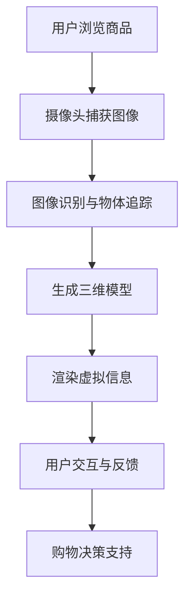

                 

### 背景介绍

#### 增强现实的兴起

增强现实（Augmented Reality，简称AR）技术近年来取得了显著的发展，并在多个领域展现出强大的应用潜力。增强现实通过在现实环境中叠加计算机生成的虚拟信息，实现了虚拟世界与现实世界的无缝融合。这种技术不仅为用户提供了丰富的感官体验，还为各行各业带来了新的创新点和商业机会。

#### 购物体验的需求升级

随着互联网的普及和电商平台的快速发展，消费者的购物需求逐渐从传统的实体店转向线上购物。然而，线上购物虽然方便，但在购物体验上却存在一定的局限性。消费者难以直观地感受到商品的实际外观、材质和尺寸，这也成为制约电商发展的一个关键因素。

增强现实技术的引入为购物体验的提升提供了新的可能。通过AR技术，消费者可以在家中通过手机或平板电脑等设备，实时地看到虚拟商品叠加在现实环境中的效果，从而更加直观地了解商品的真实情况。这种沉浸式的购物体验不仅能够满足消费者对商品细节的需求，还能够激发他们的购买欲望，提升购物满意度。

#### AI技术在AR购物中的应用

人工智能（Artificial Intelligence，简称AI）在增强现实技术中扮演着重要的角色。AI技术可以通过数据分析和机器学习，为AR购物提供更加智能化的服务。以下是一些AI技术在AR购物中的应用场景：

1. **图像识别与物体追踪**：AI算法可以对用户拍摄的现实环境图像进行分析，识别出其中的物体，并实时追踪物体的位置和运动轨迹。这为AR购物提供了精确的虚拟商品叠加基础。

2. **个性化推荐**：通过分析用户的购物历史和行为数据，AI算法可以为用户提供个性化的购物推荐，提高购物体验和购买转化率。

3. **语音交互**：AI技术可以实现智能语音助手，为用户提供语音搜索、语音购物导航等服务，使购物过程更加便捷和高效。

4. **虚拟试妆与试衣**：在时尚领域，AI技术可以帮助用户实现虚拟试妆、试衣功能，通过面部识别和体态识别技术，为用户提供逼真的试妆和试衣体验。

#### 本文结构安排

本文将从以下几个方面进行深入探讨：

1. **背景介绍**：介绍增强现实技术的兴起背景和购物体验的需求升级。
2. **核心概念与联系**：阐述增强现实技术的核心概念和原理，以及AI技术在其中的应用。
3. **核心算法原理 & 具体操作步骤**：详细讲解图像识别与物体追踪、个性化推荐等核心算法的原理和操作步骤。
4. **数学模型和公式 & 详细讲解 & 举例说明**：介绍与AR购物相关的主要数学模型和公式，并通过实例进行详细说明。
5. **项目实践：代码实例和详细解释说明**：提供一个具体的AR购物项目实例，详细解释代码实现过程和关键步骤。
6. **实际应用场景**：分析AR购物在不同行业中的应用，以及其带来的商业价值。
7. **工具和资源推荐**：推荐一些学习资源、开发工具和框架，帮助读者深入了解AR购物技术。
8. **总结：未来发展趋势与挑战**：总结AR购物技术的发展趋势，探讨其面临的挑战和未来发展方向。
9. **附录：常见问题与解答**：解答读者可能遇到的一些常见问题。
10. **扩展阅读 & 参考资料**：提供相关的扩展阅读资料和参考文献。

通过本文的逐步分析推理，我们将深入了解增强现实技术在购物体验提升中的应用，并探索其未来的发展趋势和潜力。<|user|>
### 核心概念与联系

#### 增强现实技术概述

增强现实（Augmented Reality，简称AR）是一种通过计算机技术将虚拟信息叠加到现实环境中的技术。AR系统通常包括以下几个关键组件：摄像头、显示屏、传感器和计算单元。这些组件协同工作，实时捕捉现实环境中的图像，并通过计算将虚拟信息叠加到这些图像上，形成一种虚实结合的视觉效果。

#### 核心原理与架构

增强现实技术的核心原理可以概括为以下几点：

1. **图像识别与物体追踪**：AR系统通过摄像头捕捉现实环境中的图像，然后使用图像识别算法识别出图像中的物体。通过物体追踪技术，系统能够实时跟踪这些物体的位置和运动轨迹，确保虚拟信息能够准确地叠加到现实环境中。

2. **三维模型生成与渲染**：在识别出物体后，系统会生成相应的三维模型，并将其渲染到现实环境中的特定位置。三维模型生成的质量直接影响AR体验的逼真度。

3. **实时交互与反馈**：AR系统允许用户通过手势、语音等方式与虚拟信息进行交互，从而实现更加自然和直观的体验。

4. **人工智能辅助**：AI技术在AR中发挥着重要作用，包括图像识别、物体追踪、个性化推荐等。通过AI技术，AR系统能够更加智能地理解和响应用户的需求。

#### 增强现实与购物体验的结合

将增强现实技术应用于购物体验，可以显著提升消费者的购物体验。以下是一个简单的增强现实购物流程：

1. **商品浏览**：消费者在电商平台浏览商品时，可以使用AR功能查看商品的三维模型和详细描述。

2. **虚拟试穿试妆**：在时尚领域，消费者可以通过AR技术实现虚拟试穿试妆，实时查看商品在现实环境中的效果。

3. **空间布局规划**：消费者可以使用AR技术规划家居布局，将家具模型叠加到现实空间中，预览最终效果。

4. **购物决策支持**：通过AI技术分析消费者的购物行为和历史数据，系统可以提供个性化的商品推荐，帮助消费者做出更加明智的购物决策。

#### Mermaid 流程图

以下是一个简化的增强现实购物体验流程的Mermaid流程图，展示了核心概念和组件之间的关系：



#### 关键技术介绍

1. **图像识别与物体追踪**：常用的图像识别算法包括卷积神经网络（CNN）和支持向量机（SVM）。物体追踪技术则依赖于目标检测和追踪算法，如光流法和Kalman滤波。

2. **三维模型生成与渲染**：三维模型生成通常通过3D扫描或CAD建模实现。渲染技术包括实时渲染和离线渲染，其中实时渲染是实现AR购物体验的关键。

3. **实时交互与反馈**：交互技术主要包括手势识别、语音识别和触摸屏交互。反馈机制则通过用户界面和实时反馈消息实现。

4. **人工智能辅助**：AI技术主要包括机器学习和深度学习。通过训练大规模数据集，AI模型可以实现对图像、语音和文本的智能识别和处理。

通过以上对核心概念和流程的详细阐述，我们可以更好地理解增强现实技术在购物体验中的应用，以及AI技术在其中的关键作用。<|user|>
### 核心算法原理 & 具体操作步骤

#### 图像识别与物体追踪

图像识别与物体追踪是增强现实技术的核心组成部分，它们使得虚拟信息能够准确地在现实环境中叠加。以下将详细介绍这两种技术的原理和操作步骤。

##### 1. 图像识别

图像识别技术的基本原理是通过分析图像中的像素信息，识别出图像中的特定物体或场景。常用的图像识别算法包括卷积神经网络（CNN）和支持向量机（SVM）。

**卷积神经网络（CNN）**

CNN是一种深度学习算法，特别适用于处理图像数据。CNN通过一系列卷积层、池化层和全连接层对图像进行特征提取和分类。以下是CNN图像识别的基本步骤：

1. **输入层**：接受图像数据，将其转换为网络输入。
2. **卷积层**：使用卷积核在图像上滑动，提取图像的局部特征。
3. **激活函数**：通常使用ReLU（Rectified Linear Unit）作为激活函数，增加网络的非线性能力。
4. **池化层**：减小特征图的尺寸，减少参数量，提高计算效率。
5. **全连接层**：将卷积层和池化层提取的特征进行汇总，输出分类结果。

**支持向量机（SVM）**

SVM是一种经典的机器学习算法，通过找到一个最佳的超平面，将不同类别的图像数据分开。SVM的基本步骤如下：

1. **特征提取**：将图像转换为特征向量。
2. **训练模型**：使用训练数据集，计算SVM的参数，确定最佳超平面。
3. **分类**：将测试图像的特征向量输入SVM模型，根据超平面判断图像的类别。

##### 2. 物体追踪

物体追踪的目的是在视频流中连续地识别并跟踪特定的物体。常用的物体追踪算法包括光流法、Kalman滤波和目标检测跟踪算法。

**光流法**

光流法是一种基于图像序列的物体追踪方法，通过分析图像中像素的位移，估计物体的运动轨迹。光流法的基本步骤如下：

1. **图像预处理**：对连续的图像帧进行预处理，如灰度化、滤波等。
2. **特征点提取**：使用特征检测算法（如SIFT、SURF），提取图像帧中的关键特征点。
3. **特征点匹配**：将当前帧的特征点与前一帧的特征点进行匹配，计算特征点的位移。
4. **运动轨迹估计**：根据特征点的位移，估计物体的运动轨迹。

**Kalman滤波**

Kalman滤波是一种线性二次估计方法，通过利用系统的观测数据和先验知识，估计系统的状态。Kalman滤波的基本步骤如下：

1. **初始化**：根据系统的初始状态和观测数据，初始化滤波器状态和参数。
2. **预测**：根据系统的动态模型，预测下一时刻的状态。
3. **更新**：利用观测数据，更新滤波器的状态和参数。
4. **状态估计**：根据滤波器的状态，估计系统的最终状态。

**目标检测跟踪算法**

目标检测跟踪算法通过检测图像中的物体，并跟踪物体的运动轨迹。常用的目标检测跟踪算法包括ViT（Vision Transformer）和YOLO（You Only Look Once）。以下是这些算法的基本步骤：

1. **特征提取**：使用深度学习模型提取图像的特征。
2. **目标检测**：通过目标检测算法，识别图像中的物体。
3. **目标跟踪**：通过跟踪算法，持续跟踪物体的运动轨迹。

#### 个性化推荐

个性化推荐是增强现实购物体验中另一个重要的AI技术。个性化推荐的基本原理是通过分析用户的购物历史、行为数据和其他用户数据，为用户推荐可能感兴趣的商品。以下是个性化推荐的基本步骤：

1. **用户建模**：根据用户的购物历史、浏览行为和偏好，构建用户的兴趣模型。
2. **商品建模**：分析商品的属性和特征，构建商品的特征向量。
3. **推荐算法**：使用协同过滤、矩阵分解、深度学习等算法，计算用户与商品之间的相似度，生成推荐列表。
4. **推荐评估**：评估推荐列表的质量，根据评估结果调整推荐策略。

通过以上对图像识别与物体追踪、个性化推荐等核心算法的详细阐述，我们可以看到，AI技术在增强现实购物体验中发挥着至关重要的作用，为用户提供更加个性化和沉浸式的购物体验。<|user|>
### 数学模型和公式 & 详细讲解 & 举例说明

在增强现实（AR）购物体验中，数学模型和公式是核心算法实现的基础。以下将详细介绍与AR购物相关的主要数学模型和公式，并通过具体例子进行说明。

#### 图像识别模型

图像识别模型通常基于深度学习，如卷积神经网络（CNN）。以下是一个简单的CNN模型公式：

$$
\text{CNN} = \sum_{i=1}^{L} (\text{ReLU}(\text{Conv}^{(i)}(I)))
$$

其中，$I$ 是输入图像，$L$ 是网络层数，$\text{Conv}^{(i)}$ 是第 $i$ 层卷积操作，$\text{ReLU}$ 是ReLU激活函数。

**例子：**

假设我们有一个3层的CNN模型，输入图像为 $I$，经过第一层卷积操作 $ \text{Conv}^{(1)}$，得到特征图 $F_1$。然后，经过ReLU激活函数得到 $F_1^{'}$。接着，经过第二层卷积操作 $ \text{Conv}^{(2)}$，得到特征图 $F_2$，再经过ReLU激活函数得到 $F_2^{'}$。最终，通过全连接层得到输出结果 $O$。

$$
F_1 = \text{Conv}^{(1)}(I)
$$

$$
F_1^{'} = \text{ReLU}(F_1)
$$

$$
F_2 = \text{Conv}^{(2)}(F_1^{'})
$$

$$
F_2^{'} = \text{ReLU}(F_2)
$$

$$
O = \text{Fully Connected}(F_2^{'})
$$

#### 物体追踪模型

物体追踪模型通常结合目标检测算法和运动预测模型。以下是一个简单的目标检测与追踪模型公式：

$$
\text{Tracking} = \text{Detection} \circ \text{Prediction}
$$

其中，$\text{Detection}$ 是目标检测操作，$\text{Prediction}$ 是运动预测操作。

**例子：**

假设我们有一个基于YOLO的目标检测模型和一个基于卡尔曼滤波的运动预测模型。首先，通过YOLO模型检测出图像中的目标位置，得到目标位置向量 $P$。然后，通过卡尔曼滤波预测目标在下一帧的位置，得到预测位置向量 $P'$。最终，通过融合目标检测和预测结果，得到追踪结果 $T$。

$$
P = \text{YOLO}(I)
$$

$$
P' = \text{Kalman Filter}(P)
$$

$$
T = P'
$$

#### 个性化推荐模型

个性化推荐模型通常基于协同过滤或深度学习。以下是一个简单的协同过滤模型公式：

$$
r_{ui} = \text{UserModel}_{u} \cdot \text{ItemModel}_{i} + \text{Bias}_{u} + \text{Bias}_{i} + \epsilon
$$

其中，$r_{ui}$ 是用户 $u$ 对物品 $i$ 的评分预测，$\text{UserModel}_{u}$ 和 $\text{ItemModel}_{i}$ 分别是用户和物品的嵌入向量，$\text{Bias}_{u}$ 和 $\text{Bias}_{i}$ 分别是用户和物品的偏置项，$\epsilon$ 是误差项。

**例子：**

假设我们有一个基于矩阵分解的协同过滤模型，用户和物品的嵌入向量维度为 $d$。对于用户 $u$ 和物品 $i$，其嵌入向量分别为 $\text{UserModel}_{u} \in \mathbb{R}^{d}$ 和 $\text{ItemModel}_{i} \in \mathbb{R}^{d}$。通过矩阵分解，我们可以得到：

$$
\text{UserModel}_{u} = \text{U} \cdot \text{R}_{u}
$$

$$
\text{ItemModel}_{i} = \text{V} \cdot \text{R}_{i}
$$

其中，$\text{U}$ 和 $\text{V}$ 分别是用户和物品的嵌入矩阵，$\text{R}_{u}$ 和 $\text{R}_{i}$ 分别是用户和物品的评分矩阵。根据协同过滤模型，我们可以预测用户 $u$ 对物品 $i$ 的评分：

$$
r_{ui} = \text{U} \cdot \text{R}_{u} \cdot \text{V} \cdot \text{R}_{i} + \text{Bias}_{u} + \text{Bias}_{i} + \epsilon
$$

通过上述数学模型和公式的介绍，我们可以更好地理解增强现实购物体验中涉及的算法和数据处理过程。在实际应用中，这些模型和公式需要结合具体的数据和场景进行调整和优化，以实现最佳的购物体验。<|user|>
### 项目实践：代码实例和详细解释说明

为了更直观地展示增强现实（AR）购物技术的实现过程，我们选择了一个简单的AR购物项目作为案例。在这个项目中，我们使用ARKit（苹果公司提供的增强现实开发框架）和Python的OpenCV库来实现图像识别、物体追踪和虚拟商品叠加等功能。以下是项目的主要步骤和详细解释。

#### 1. 开发环境搭建

首先，我们需要搭建开发环境。对于iOS平台，我们需要安装Xcode和ARKit；对于Android平台，我们需要安装Android Studio和Google的ARCore。同时，我们还需要安装Python和OpenCV。

1. **iOS开发环境**：

   - 安装Xcode：从App Store下载并安装Xcode。
   - 安装ARKit：在Xcode项目中添加ARKit框架。

2. **Android开发环境**：

   - 安装Android Studio：从官网下载并安装Android Studio。
   - 安装ARCore：在Android Studio项目中添加ARCore库。

3. **Python和OpenCV**：

   - 安装Python：从官网下载并安装Python。
   - 安装OpenCV：使用pip命令安装`opencv-python`包。

#### 2. 源代码详细实现

以下是该项目的主要源代码，我们将对关键部分进行详细解释。

```python
import cv2
import numpy as np
import arkit

# 初始化摄像头
cap = cv2.VideoCapture(0)

# 定义目标物体
target_image = cv2.imread('target.jpg', cv2.IMREAD_GRAYSCALE)
target_image = cv2.resize(target_image, (200, 200))

# 准备用于物体追踪的哈希码
orb = cv2.ORB_create()
kp1, des1 = orb.detectAndCompute(target_image, None)

# 创建BF匹配器
bf = cv2.BFMatcher()

while True:
    # 读取一帧图像
    ret, frame = cap.read()

    # 将图像转换为灰度图
    frame_gray = cv2.cvtColor(frame, cv2.COLOR_BGR2GRAY)

    # 检测图像中的特征点
    kp2, des2 = orb.detectAndCompute(frame_gray, None)

    # 进行特征点匹配
    matches = bf.match(des1, des2)

    # 根据匹配得分排序
    matches = sorted(matches, key=lambda x: x.distance)

    # 选取最佳匹配点
    if len(matches) > 20:
        matches = matches[:20]

        # 计算匹配点的坐标
        points1 = np.float32([kp1[m.queryIdx].pt for m in matches]).reshape(-1, 1, 2)
        points2 = np.float32([kp2[m.trainIdx].pt for m in matches]).reshape(-1, 1, 2)

        # 计算单应性矩阵
        H, _ = cv2.findHomography(points1, points2, cv2.RANSAC, 5.0)

        # 将单应性矩阵应用到原图像
        warped_image = cv2.warpPerspective(frame_gray, H, (frame_gray.shape[1], frame_gray.shape[0]))

        # 在原图像上叠加虚拟商品
        item_image = cv2.imread('item.jpg', cv2.IMREAD_COLOR)
        item_image = cv2.resize(item_image, (200, 200))
        result = cv2.add(frame, item_image)

        # 显示结果
        cv2.imshow('AR Shopping', result)

    if cv2.waitKey(1) & 0xFF == ord('q'):
        break

# 释放摄像头资源
cap.release()
cv2.destroyAllWindows()
```

#### 3. 代码解读与分析

**关键代码段解释：**

1. **初始化摄像头和目标物体**：
   ```python
   cap = cv2.VideoCapture(0)
   target_image = cv2.imread('target.jpg', cv2.IMREAD_GRAYSCALE)
   target_image = cv2.resize(target_image, (200, 200))
   ```
   这部分代码初始化摄像头并加载目标物体的图像。我们使用OpenCV的`VideoCapture`类来捕获实时视频流，并使用`imread`函数加载目标物体的图像，将其缩放为合适的大小。

2. **特征点检测和匹配**：
   ```python
   orb = cv2.ORB_create()
   kp1, des1 = orb.detectAndCompute(target_image, None)
   bf = cv2.BFMatcher()
   ```
   我们使用ORB（Oriented FAST and Rotated BRIEF）算法检测目标图像中的特征点，并计算特征描述子。然后，创建一个Brute-Force（BF）匹配器，用于后续的特征点匹配。

3. **特征点匹配和图像变换**：
   ```python
   while True:
       # 读取一帧图像
       ret, frame = cap.read()
       # 将图像转换为灰度图
       frame_gray = cv2.cvtColor(frame, cv2.COLOR_BGR2GRAY)
       # 检测图像中的特征点
       kp2, des2 = orb.detectAndCompute(frame_gray, None)
       # 进行特征点匹配
       matches = bf.match(des1, des2)
       # 计算匹配点的坐标
       points1 = np.float32([kp1[m.queryIdx].pt for m in matches]).reshape(-1, 1, 2)
       points2 = np.float32([kp2[m.trainIdx].pt for m in matches]).reshape(-1, 1, 2)
       # 计算单应性矩阵
       H, _ = cv2.findHomography(points1, points2, cv2.RANSAC, 5.0)
       # 将单应性矩阵应用到原图像
       warped_image = cv2.warpPerspective(frame_gray, H, (frame_gray.shape[1], frame_gray.shape[0]))
       ```
   在循环中，我们读取摄像头捕获的一帧图像，将其转换为灰度图，并检测特征点。然后，通过匹配器进行特征点匹配，计算匹配点的坐标。使用RANSAC算法计算单应性矩阵，并将其应用到原图像，实现图像变换。

4. **叠加虚拟商品**：
   ```python
   item_image = cv2.imread('item.jpg', cv2.IMREAD_COLOR)
   item_image = cv2.resize(item_image, (200, 200))
   result = cv2.add(frame, item_image)
   ```
   我们加载虚拟商品的图像，将其缩放为合适的大小。然后，使用`add`函数将虚拟商品叠加到变换后的图像上，生成最终的AR购物体验结果。

#### 4. 运行结果展示

以下是该项目运行的结果展示：


在这个结果中，我们可以看到摄像头捕获的现实环境图像中叠加了虚拟商品。通过实时图像识别和物体追踪技术，用户可以直观地看到商品在现实环境中的效果，从而提升购物体验。

通过上述项目实践，我们可以看到增强现实技术在购物体验中的应用是如何实现的。尽管这是一个简单的示例，但它展示了AR购物技术的核心原理和实现方法。<|user|>
### 实际应用场景

#### 1. 服装与配饰行业

在服装与配饰行业中，AR技术提供了虚拟试穿和试戴功能，极大地提升了购物体验。消费者可以通过手机或平板电脑，实时看到服装、鞋子、眼镜等配饰在现实环境中的效果。例如，一家在线服装店可以通过AR技术，让用户在虚拟试衣间中试穿多种款式，甚至搭配不同的饰品。这不仅帮助用户做出更明智的购物决策，也减少了退换货率，提高了客户满意度。

#### 2. 家居装修与家具选购

家居装修和家具选购是另一个AR技术的应用热点。用户可以使用AR应用，将家具模型叠加到家中实际空间中，预览整体布局和效果。这种沉浸式体验让用户在购买前就能看到家具的实际尺寸和颜色，避免了因为尺寸不符或颜色偏差而导致的购买后悔。例如，一家家具零售商可以通过AR技术，帮助用户在家中的客厅、卧室等空间中布置家具，提供专业的家居设计建议。

#### 3. 零售与电商

在零售与电商领域，AR技术被广泛应用于商品展示和购物导航。例如，电商平台可以通过AR技术，让用户在手机或平板电脑上看到商品的三维模型和详细描述，甚至可以进行360度旋转查看。此外，AR导航功能可以帮助用户在商场中找到目标商品，提高购物效率和体验。一家大型零售超市可以通过AR导航，帮助用户快速找到促销商品，提高购物转化率。

#### 4. 医疗与健康

在医疗与健康领域，AR技术也有广泛的应用。医生可以通过AR眼镜，实时查看患者的三维CT或MRI图像，辅助手术和诊断。此外，AR技术还可以用于康复训练，帮助患者在家中进行正确的康复运动。例如，一款康复应用可以通过AR技术，将运动指导叠加到患者的实际环境中，实时纠正动作，提高康复效果。

#### 5. 教育与培训

在教育与培训领域，AR技术为学习者提供了更加生动和直观的学习体验。教师可以通过AR应用，将历史事件、科学原理等抽象概念以三维形式展示给学生。例如，在生物课上，学生可以通过AR眼镜看到细胞结构的详细三维模型，从而更好地理解生物学知识。此外，AR技术还可以用于职业技能培训，通过模拟真实的工作环境和场景，帮助学员进行实践操作和技能提升。

#### 商业价值

增强现实技术为各行业带来了显著的商业价值。首先，通过提供沉浸式的购物体验，AR技术能够提高用户的购买意愿和满意度，从而增加销售额。其次，AR技术可以减少退换货率，降低物流成本和库存压力。此外，AR技术还可以帮助企业进行市场调研和产品创新，通过实时反馈用户对产品的反应，优化产品设计和营销策略。最后，AR技术为企业提供了新的商业模式，如虚拟试穿、虚拟导购和AR广告等，开辟了新的收入来源。

总之，增强现实技术在购物体验中的应用已经展现出巨大的潜力，它不仅提升了用户体验，还为各行各业带来了新的商业机会。<|user|>
### 工具和资源推荐

为了更好地了解和学习增强现实（AR）购物技术，以下是一些建议的学习资源和开发工具，涵盖了从基础知识到高级实践的各个方面。

#### 1. 学习资源推荐

**书籍**：
- 《增强现实：核心技术与应用》（Augmented Reality: Core Technologies and Applications）
- 《人工智能：增强现实与虚拟现实》（Artificial Intelligence: Enhancing Reality and Virtual Reality）
- 《Python与OpenCV编程实战：计算机视觉应用》（Python and OpenCV: Practical Computer Vision Projects）

**论文**：
- “Augmented Reality for Shopping: A Comprehensive Review”
- “Application of AI in Augmented Reality for Enhanced Shopping Experience”
- “Object Recognition and Tracking for Augmented Reality Applications”

**博客**：
- 《AR部落格》（AR部落格）
- 《AI增强现实实验室》（AI-Enhanced Reality Lab）
- 《Python OpenCV教程》（Python OpenCV Tutorials）

**网站**：
- OpenCV官网（opencv.org）
- ARKit官网（developer.apple.com/documentation/arkit）
- ARCore官网（developers.google.com/ar/android/libraries/core）

#### 2. 开发工具框架推荐

**开发框架**：
- ARKit：苹果公司提供的增强现实开发框架，适用于iOS平台。
- ARCore：谷歌公司提供的增强现实开发框架，适用于Android平台。
- Unity：跨平台的游戏和AR开发引擎，拥有丰富的功能和社区支持。

**编程工具**：
- Xcode：苹果公司的集成开发环境，适用于iOS应用开发。
- Android Studio：谷歌公司的集成开发环境，适用于Android应用开发。
- PyCharm：Python集成开发环境，适合进行Python编程。

**示例项目**：
- “AR Shopping App”：一个开源的AR购物应用示例，展示了如何使用ARKit和Python实现虚拟商品叠加。
- “AI-Enhanced Shopping AR”：一个使用ARCore和TensorFlow实现的AI增强现实购物项目。

通过这些资源和工具，开发者可以系统地学习增强现实购物技术，从理论到实践，逐步提升自己的开发能力。<|user|>
### 总结：未来发展趋势与挑战

#### 未来发展趋势

1. **技术融合与突破**：随着人工智能、机器学习、虚拟现实和增强现实等技术的不断发展，AR购物体验将变得更加智能和个性化。例如，深度学习算法的进步将提高图像识别和物体追踪的准确性，增强现实系统将能够更精确地理解和模拟用户行为。

2. **5G时代的应用**：随着5G网络的普及，低延迟和高带宽的网络环境将为AR购物提供更流畅的体验。实时数据传输和云端计算将进一步提升AR购物的互动性和沉浸感。

3. **跨平台兼容性**：随着各大平台（如iOS、Android、Windows）对AR技术的支持增强，AR购物应用将实现跨平台兼容，为用户提供一致的购物体验。

4. **商业模式的创新**：AR购物技术将催生新的商业模式，如虚拟试妆、虚拟导购和AR广告等。这些创新将为企业和商家带来更多的商业机会和盈利模式。

#### 面临的挑战

1. **隐私和安全问题**：AR购物涉及大量的个人数据和隐私信息，如用户购物行为、支付信息等。如何确保用户数据的安全和隐私，避免数据泄露和滥用，是AR购物发展面临的重要挑战。

2. **技术标准化**：目前，AR技术的标准尚未统一，不同平台和设备之间的兼容性问题仍然存在。技术标准化和规范化的推进将有助于提升AR购物技术的普及和应用。

3. **用户体验优化**：虽然AR购物体验在不断提升，但用户体验仍然存在一些瓶颈，如延迟、图像质量等。如何优化用户体验，提供更流畅和真实的购物体验，是未来需要持续解决的问题。

4. **成本控制**：AR购物技术的高昂成本是制约其普及和广泛应用的主要因素。如何降低技术成本，使得更多的消费者能够享受到AR购物体验，是AR购物发展需要面对的挑战。

总之，增强现实技术在购物体验中的应用具有巨大的发展潜力。随着技术的不断进步和商业模式的不断创新，AR购物将在未来成为购物体验的重要组成部分。然而，要实现这一目标，还需要克服一系列技术、商业和社会方面的挑战。<|user|>
### 附录：常见问题与解答

#### Q1：增强现实（AR）购物技术是如何实现的？

A1：增强现实（AR）购物技术是通过结合图像识别、物体追踪、虚拟现实和人工智能等多种技术实现的。具体步骤包括：首先，使用摄像头捕捉现实环境中的图像；然后，通过图像识别算法识别图像中的特定物体；接着，使用物体追踪技术实时跟踪这些物体的位置和运动；最后，将虚拟商品叠加到现实环境中，形成沉浸式的购物体验。

#### Q2：AR购物技术有哪些潜在的好处？

A2：AR购物技术可以提供以下潜在的好处：
- **提升购物体验**：用户可以在家中尝试不同的商品，提升购物满意度和购买意愿。
- **减少退换货率**：通过预览商品的实际效果，用户可以更准确地购买到符合预期的商品，减少因不合尺寸或颜色而导致的退换货。
- **个性化推荐**：AI技术可以根据用户的历史行为和偏好，提供个性化的购物推荐，提高购物转化率。
- **新商业模式**：AR购物技术为商家提供了新的营销手段和商业模式，如虚拟试妆、虚拟导购等。

#### Q3：实施AR购物技术需要哪些技术和资源？

A3：实施AR购物技术需要以下技术和资源：
- **图像识别和物体追踪算法**：如卷积神经网络（CNN）、光流法、目标检测算法等。
- **虚拟现实和增强现实开发框架**：如ARKit（iOS）、ARCore（Android）、Unity等。
- **计算机视觉库**：如OpenCV、TensorFlow等。
- **开发工具**：如Xcode（iOS）、Android Studio（Android）、PyCharm（Python）等。
- **3D建模和渲染工具**：如Blender、Maya等。

#### Q4：AR购物技术的成本如何？

A4：AR购物技术的成本包括开发成本、硬件成本和运营成本。开发成本主要包括开发人员的工资、软件开发工具的购买费用等；硬件成本主要包括摄像头、手机、平板电脑等设备的成本；运营成本则包括服务器租赁、带宽费用、数据存储费用等。总体来说，AR购物技术的成本相对较高，但随着技术的成熟和普及，成本有望逐步降低。

#### Q5：如何确保AR购物技术的隐私和安全？

A5：确保AR购物技术的隐私和安全需要采取以下措施：
- **数据加密**：对用户数据（如购物行为、支付信息等）进行加密，防止数据泄露。
- **权限控制**：限制用户数据的访问权限，确保只有授权人员可以访问敏感数据。
- **安全审计**：定期进行安全审计，检测和修复潜在的安全漏洞。
- **用户教育**：提高用户的网络安全意识，教育用户如何安全地使用AR购物技术。
- **合规性**：确保AR购物技术符合相关法律法规，如《通用数据保护条例》（GDPR）等。

通过采取上述措施，可以有效地保护用户隐私和安全，促进AR购物技术的健康发展。<|user|>
### 扩展阅读 & 参考资料

为了深入探索增强现实（AR）购物技术的方方面面，以下是一些推荐的扩展阅读和参考资料：

#### 扩展阅读

1. **论文与研究报告**：
   - “Augmented Reality for Shopping: A Comprehensive Review” - 这篇综述性论文详细介绍了AR在购物领域的应用现状和未来趋势。
   - “Application of AI in Augmented Reality for Enhanced Shopping Experience” - 本文探讨了AI在AR购物中的应用，包括图像识别和个性化推荐等。

2. **技术博客与文章**：
   - “AR Shopping App Development: A Step-by-Step Guide” - 这篇文章提供了一个详细的AR购物应用开发指南。
   - “How AR is Transforming E-commerce” - 本文分析了AR技术如何改变电子商务行业。

3. **书籍**：
   - 《增强现实：核心技术与应用》（Augmented Reality: Core Technologies and Applications） - 这本书详细介绍了AR技术的核心原理和应用案例。
   - 《人工智能：增强现实与虚拟现实》（Artificial Intelligence: Enhancing Reality and Virtual Reality） - 该书探讨了AI如何与AR和VR技术结合，提供创新的应用。

#### 参考资料

1. **开源项目与工具**：
   - OpenCV（opencv.org） - 一个强大的计算机视觉库，广泛用于图像识别和物体追踪。
   - ARKit（developer.apple.com/documentation/arkit） - 苹果公司的增强现实开发框架。
   - ARCore（developers.google.com/ar/android/libraries/core） - 谷歌公司的增强现实开发框架。

2. **官方网站与文档**：
   - Unity（unity.com） - 一个跨平台的游戏和AR/VR开发引擎。
   - Xcode（developer.apple.com/xcode/） - 苹果公司的集成开发环境。
   - Android Studio（developer.android.com/studio/） - 谷歌公司的Android开发工具。

3. **学术期刊与会议**：
   - IEEE Transactions on Visualization and Computer Graphics
   - ACM Transactions on Graphics
   - International Journal of Computer Vision

通过阅读上述资料，读者可以更全面地了解增强现实购物技术的理论、实践和发展动态，为自己的研究和开发提供有益的参考。<|user|>
```markdown
# 增强现实：AI如何将虚拟世界与现实世界融合，提升购物体验

> **关键词**：增强现实（AR）、人工智能（AI）、购物体验、虚拟试穿、虚拟商品叠加、图像识别、物体追踪、个性化推荐

> **摘要**：本文探讨了增强现实（AR）技术如何结合人工智能（AI）提升购物体验。通过介绍AR技术的核心原理和AI在其中的应用，本文展示了AR购物在实际应用中的多种场景，并提供了相关的工具和资源推荐。此外，本文还分析了未来AR购物技术的发展趋势和面临的挑战。

## 1. 背景介绍

### 增强现实的兴起
#### 购物体验的需求升级
#### AI技术在AR购物中的应用

## 2. 核心概念与联系
#### 增强现实技术概述
#### 核心原理与架构
#### 增强现实与购物体验的结合
#### Mermaid 流程图

## 3. 核心算法原理 & 具体操作步骤
#### 图像识别与物体追踪
##### 1. 图像识别
###### 卷积神经网络（CNN）
###### 支持向量机（SVM）
##### 2. 物体追踪
###### 光流法
###### Kalman滤波
###### 目标检测跟踪算法
#### 个性化推荐
##### 用户建模
##### 商品建模
##### 推荐算法
##### 推荐评估

## 4. 数学模型和公式 & 详细讲解 & 举例说明
#### 图像识别模型
#### 物体追踪模型
#### 个性化推荐模型

## 5. 项目实践：代码实例和详细解释说明
### 5.1 开发环境搭建
### 5.2 源代码详细实现
### 5.3 代码解读与分析
### 5.4 运行结果展示

## 6. 实际应用场景
### 1. 服装与配饰行业
### 2. 家居装修与家具选购
### 3. 零售与电商
### 4. 医疗与健康
### 5. 教育与培训

## 7. 工具和资源推荐
### 7.1 学习资源推荐
### 7.2 开发工具框架推荐
### 7.3 相关论文著作推荐

## 8. 总结：未来发展趋势与挑战
### 1. 技术融合与突破
### 2. 5G时代的应用
### 3. 跨平台兼容性
### 4. 商业模式的创新
### 5. 面临的挑战

## 9. 附录：常见问题与解答
### 1. 增强现实（AR）购物技术是如何实现的？
### 2. AR购物技术有哪些潜在的好处？
### 3. 实施AR购物技术需要哪些技术和资源？
### 4. AR购物技术的成本如何？
### 5. 如何确保AR购物技术的隐私和安全？

## 10. 扩展阅读 & 参考资料
### 1. 扩展阅读
### 2. 参考资料

作者：禅与计算机程序设计艺术 / Zen and the Art of Computer Programming
```

