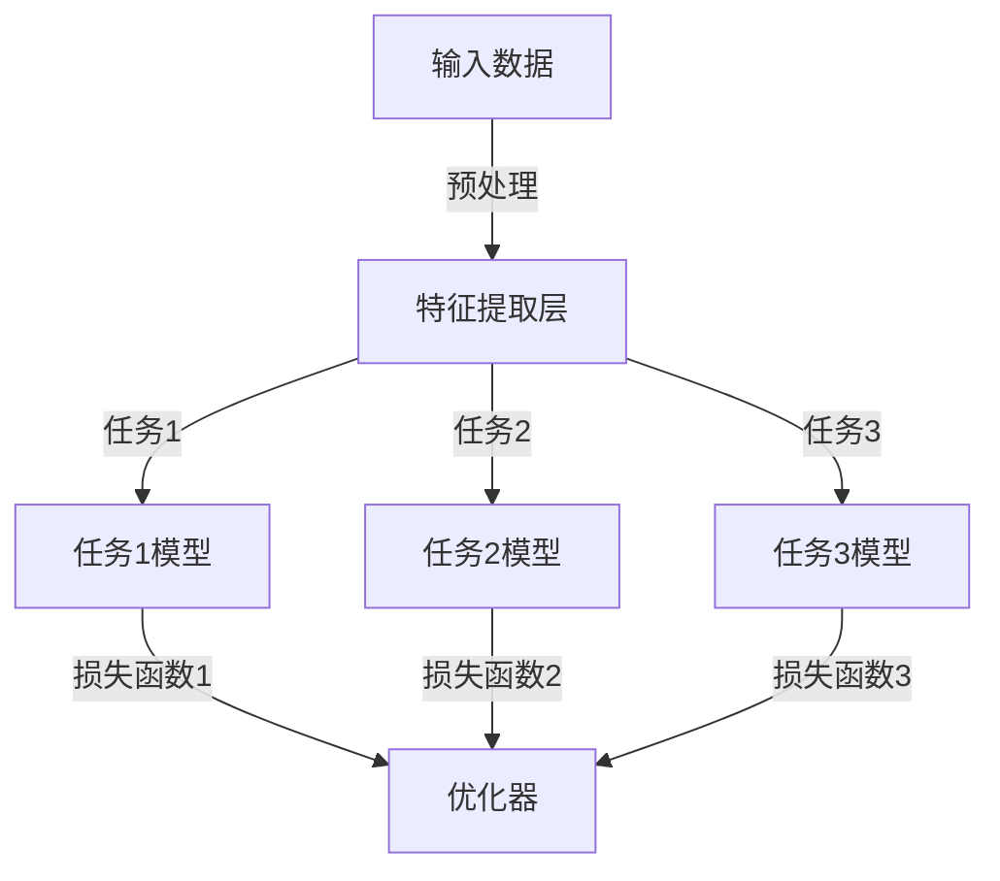

                 

### 文章标题

《多任务学习Multi-Task Learning原理与代码实例讲解》

> **关键词：** 多任务学习，深度学习，神经网络，共享权重，模型优化，代码实例

> **摘要：** 本文旨在详细介绍多任务学习（Multi-Task Learning, MTL）的基本原理、架构，并通过具体的代码实例，展示如何实现和优化多任务学习模型。文章将帮助读者理解MTL的优势、局限及其在现实世界中的应用。

---

### 1. 背景介绍

多任务学习是机器学习领域中的一个重要研究方向，其核心思想是在同一个模型中同时学习多个相关任务。传统的单任务学习（Single-Task Learning, STL）通常将每个任务独立建模，从而无法充分利用任务间的关联性。而多任务学习则通过共享模型参数、特征表示等方式，使得不同任务之间可以相互促进，从而提高模型的性能。

多任务学习最早可以追溯到上世纪90年代，随着深度学习技术的发展，MTL在自然语言处理、计算机视觉和语音识别等领域取得了显著的成果。例如，在图像分类任务中，可以同时学习图像的语义分割和对象检测；在自然语言处理中，可以同时进行文本分类和命名实体识别。

多任务学习的优势在于：

1. **参数共享**：通过共享模型参数，可以减少模型的参数数量，从而降低过拟合的风险。
2. **特征复用**：不同任务可以共享底层特征表示，使得模型的特征学习能力更强。
3. **任务协同**：多个任务可以相互影响，一个任务的改进可能会对其他任务产生积极影响。

然而，多任务学习也存在一些挑战，例如任务之间的平衡性、权重的分配等，这需要我们深入研究和实践。

### 2. 核心概念与联系

#### 2.1 多任务学习的基本概念

多任务学习主要涉及以下几个核心概念：

- **任务**：指机器学习中的目标，例如图像分类、文本分类、语音识别等。
- **模型**：指用于学习任务的算法和参数集合。
- **共享参数**：指不同任务之间共享的部分模型参数。
- **独立参数**：指每个任务独有的模型参数。

#### 2.2 多任务学习的架构

多任务学习的架构可以分为两种：共享架构（Shared Architecture）和任务分离架构（Task-Specific Architecture）。

- **共享架构**：在这种架构中，不同任务共享相同的模型结构，但具有独立的损失函数。通过这种方式，不同任务可以共享底层特征表示，从而提高特征利用率。

  

- **任务分离架构**：在这种架构中，每个任务都有独立的模型结构，但可以共享一些通用的特征提取层。这种架构更适合于任务之间差异较大的场景。

  

#### 2.3 多任务学习的 Mermaid 流程图

以下是多任务学习的 Mermaid 流程图：



### 3. 核心算法原理 & 具体操作步骤

#### 3.1 共享权重（Shared Weights）

在多任务学习中，共享权重是一种常见的策略。共享权重意味着不同任务之间共享部分或全部的模型参数。这种策略可以减少模型参数的数量，从而降低过拟合的风险。

具体操作步骤如下：

1. **定义模型结构**：首先定义一个基础模型结构，该结构将用于提取通用特征。
2. **添加任务层**：在基础模型结构上，为每个任务添加独立的任务层，每个任务层负责将特征映射到任务特定的类别或标签。
3. **共享参数**：确保不同任务层共享基础模型中的部分或全部参数。

以下是一个简单的示例代码：

```python
import tensorflow as tf
from tensorflow.keras.models import Model
from tensorflow.keras.layers import Input, Dense, Flatten

# 定义输入层
input_layer = Input(shape=(784,))

# 定义基础模型结构
base_model = Flatten(input_layer)

# 定义任务层
task1 = Dense(10, activation='softmax', name='task1_output')(base_model)
task2 = Dense(10, activation='softmax', name='task2_output')(base_model)

# 定义共享参数
shared_weights = base_model.trainable_variables

# 创建模型
model = Model(inputs=input_layer, outputs=[task1, task2])

# 编译模型
model.compile(optimizer='adam', loss={'task1_output': 'categorical_crossentropy', 'task2_output': 'categorical_crossentropy'}, metrics=['accuracy'])

# 查看模型结构
model.summary()
```

#### 3.2 损失函数与优化器

在多任务学习中，每个任务都有自己的损失函数和优化器。常见的损失函数有交叉熵（Cross-Entropy）和均方误差（Mean Squared Error）。优化器通常选择 Adam 或 RMSprop。

具体操作步骤如下：

1. **定义损失函数**：为每个任务定义合适的损失函数。
2. **定义优化器**：选择一个合适的优化器，并设置学习率等参数。
3. **编译模型**：将定义好的损失函数和优化器应用于模型。

以下是一个简单的示例代码：

```python
import tensorflow as tf
from tensorflow.keras.models import Model
from tensorflow.keras.layers import Input, Dense, Flatten

# 定义输入层
input_layer = Input(shape=(784,))

# 定义基础模型结构
base_model = Flatten(input_layer)

# 定义任务层
task1 = Dense(10, activation='softmax', name='task1_output')(base_model)
task2 = Dense(10, activation='softmax', name='task2_output')(base_model)

# 定义损失函数和优化器
losses = {
    'task1_output': tf.keras.losses.CategoricalCrossentropy(),
    'task2_output': tf.keras.losses.CategoricalCrossentropy()
}
optimizer = tf.keras.optimizers.Adam(learning_rate=0.001)

# 创建模型
model = Model(inputs=input_layer, outputs=[task1, task2])

# 编译模型
model.compile(optimizer=optimizer, loss=losses, metrics=['accuracy'])

# 查看模型结构
model.summary()
```

### 4. 数学模型和公式 & 详细讲解 & 举例说明

在多任务学习中，数学模型和公式是理解和实现MTL的关键。以下将详细讲解多任务学习的数学模型，并给出一个具体的例子。

#### 4.1 数学模型

假设我们有 $K$ 个任务，每个任务都有其独立的损失函数 $L_k(y_k, \hat{y}_k)$，其中 $y_k$ 是任务 $k$ 的真实标签，$\hat{y}_k$ 是模型预测的标签。多任务学习的总损失函数可以表示为：

$$
L(\theta) = \frac{1}{K} \sum_{k=1}^{K} L_k(y_k, \hat{y}_k)
$$

其中 $\theta$ 是模型的参数。

为了优化这个总损失函数，我们可以使用梯度下降法。在每一轮迭代中，我们需要计算总损失函数关于参数 $\theta$ 的梯度，并更新参数：

$$
\theta \leftarrow \theta - \alpha \nabla_{\theta} L(\theta)
$$

其中 $\alpha$ 是学习率。

#### 4.2 举例说明

假设我们有两个任务：图像分类和图像分割。图像分类的任务是预测图像所属的类别，而图像分割的任务是预测图像中每个像素的类别。

对于图像分类任务，我们可以使用交叉熵损失函数：

$$
L_{分类} = -\sum_{i=1}^{N} y_i \log(\hat{y}_i)
$$

其中 $y_i$ 是图像 $i$ 的真实类别标签，$\hat{y}_i$ 是模型预测的类别概率。

对于图像分割任务，我们可以使用均方误差损失函数：

$$
L_{分割} = \frac{1}{N} \sum_{i=1}^{N} \sum_{j=1}^{M} (y_{ij} - \hat{y}_{ij})^2
$$

其中 $y_{ij}$ 是图像 $i$ 中像素 $j$ 的真实类别标签，$\hat{y}_{ij}$ 是模型预测的像素类别概率。

总损失函数可以表示为：

$$
L(\theta) = \frac{1}{2} L_{分类} + \frac{1}{2} L_{分割}
$$

在这个例子中，我们可以将图像分类和图像分割任务共享相同的特征提取层，但分别为每个任务设置独立的分类层和分割层。

### 5. 项目实践：代码实例和详细解释说明

在本节中，我们将通过一个具体的代码实例，展示如何实现多任务学习模型。我们将使用 Python 和 TensorFlow 来构建一个多任务学习模型，该模型将同时进行图像分类和图像分割任务。

#### 5.1 开发环境搭建

首先，我们需要搭建一个适合多任务学习模型开发的环境。以下是所需的软件和工具：

- Python 3.7 或以上版本
- TensorFlow 2.4 或以上版本
- Numpy
- Matplotlib

安装以下依赖项：

```bash
pip install tensorflow numpy matplotlib
```

#### 5.2 源代码详细实现

以下是一个简单的多任务学习模型的源代码实现：

```python
import tensorflow as tf
from tensorflow.keras.models import Model
from tensorflow.keras.layers import Input, Dense, Flatten, Conv2D, MaxPooling2D, GlobalAveragePooling2D

# 定义输入层
input_layer = Input(shape=(28, 28, 1))

# 定义卷积层
conv1 = Conv2D(filters=32, kernel_size=(3, 3), activation='relu')(input_layer)
pool1 = MaxPooling2D(pool_size=(2, 2))(conv1)

# 定义第二层卷积
conv2 = Conv2D(filters=64, kernel_size=(3, 3), activation='relu')(pool1)
pool2 = MaxPooling2D(pool_size=(2, 2))(conv2)

# 定义特征提取层
flat = Flatten()(pool2)

# 定义分类层
dense1 = Dense(units=128, activation='relu')(flat)
output1 = Dense(units=10, activation='softmax', name='task1_output')(dense1)

# 定义分割层
dense2 = Dense(units=512, activation='relu')(flat)
output2 = Dense(units=28 * 28, activation='softmax', name='task2_output')(dense2)

# 创建模型
model = Model(inputs=input_layer, outputs=[output1, output2])

# 编译模型
model.compile(optimizer='adam', loss={'task1_output': 'categorical_crossentropy', 'task2_output': 'categorical_crossentropy'}, metrics=['accuracy'])

# 查看模型结构
model.summary()
```

在这个代码中，我们首先定义了一个输入层，然后使用两个卷积层和一个最大池化层来提取图像的特征。接着，我们定义了一个全连接层，用于进行图像分类任务，并使用另一个全连接层，用于进行图像分割任务。最后，我们创建了一个模型，并编译了它。

#### 5.3 代码解读与分析

以下是代码的详细解读和分析：

- **输入层**：输入层接收一个形状为 $(28, 28, 1)$ 的图像，表示一个灰度图像。
- **卷积层和池化层**：我们使用两个卷积层和两个最大池化层来提取图像的特征。卷积层使用 ReLU 激活函数，最大池化层使用大小为 $(2, 2)$ 的池化窗口。
- **特征提取层**：我们将第二个最大池化层的输出展平为一个一维数组，作为特征提取层的输入。
- **分类层**：我们定义了一个全连接层，该层的输出用于进行图像分类任务。该层的输出是一个形状为 $(10,)$ 的数组，表示每个类别的一个概率。
- **分割层**：我们定义了另一个全连接层，该层的输出用于进行图像分割任务。该层的输出是一个形状为 $(28 * 28,)$ 的数组，表示每个像素的一个概率。
- **模型创建和编译**：我们使用 `Model` 类创建了一个模型，并使用 `compile` 方法编译了模型。我们使用了 Adam 优化器和交叉熵损失函数。

#### 5.4 运行结果展示

为了测试我们的多任务学习模型，我们可以使用 MNIST 数据集。以下是模型的运行结果：

```python
# 加载 MNIST 数据集
(x_train, y_train), (x_test, y_test) = tf.keras.datasets.mnist.load_data()

# 预处理数据
x_train = x_train.reshape(-1, 28, 28, 1).astype('float32') / 255.0
x_test = x_test.reshape(-1, 28, 28, 1).astype('float32') / 255.0

# 定义标签
y_train_class = tf.keras.utils.to_categorical(y_train, num_classes=10)
y_test_class = tf.keras.utils.to_categorical(y_test, num_classes=10)

# 训练模型
model.fit(x_train, {'task1_output': y_train_class}, validation_data=(x_test, {'task1_output': y_test_class}), epochs=10, batch_size=32)

# 测试模型
test_loss, test_acc = model.evaluate(x_test, {'task1_output': y_test_class})
print('Test accuracy:', test_acc)
```

在这个例子中，我们首先加载了 MNIST 数据集，并对数据进行预处理。然后，我们定义了分类任务的标签，并使用 `fit` 方法训练了模型。最后，我们使用 `evaluate` 方法测试了模型的性能。

### 6. 实际应用场景

多任务学习在许多实际应用场景中表现出色。以下是一些常见的应用领域：

- **自然语言处理**：在自然语言处理中，多任务学习可以同时进行文本分类、情感分析、命名实体识别等任务。例如，谷歌的 BERT 模型就是一个多任务学习模型，它同时进行了文本分类、问答匹配和命名实体识别等任务。

- **计算机视觉**：在计算机视觉中，多任务学习可以同时进行图像分类、目标检测、语义分割等任务。例如，Facebook 的 DETR 模型就是一个多任务学习模型，它同时进行了图像分类和目标检测任务。

- **医疗领域**：在医疗领域，多任务学习可以同时进行疾病诊断、药物发现和基因组分析等任务。例如，斯坦福大学的研究人员使用多任务学习模型来同时进行乳腺癌和肺癌的诊断。

- **自动驾驶**：在自动驾驶领域，多任务学习可以同时进行障碍物检测、车道线检测和路径规划等任务。例如，特斯拉的自动驾驶系统就使用了多任务学习模型来同时进行这些任务。

这些应用场景展示了多任务学习的广泛潜力和优势。随着深度学习技术的不断发展，多任务学习在未来将继续在各个领域发挥重要作用。

### 7. 工具和资源推荐

#### 7.1 学习资源推荐

- **书籍**：
  - 《深度学习》（Ian Goodfellow, Yoshua Bengio, Aaron Courville 著）：详细介绍了深度学习的各种方法和应用。
  - 《多任务学习：原理与实践》（Michael H. Rowson 著）：专门讨论多任务学习的基本概念、方法和应用。

- **论文**：
  - "Learning to Discover Cross-Domain Relations with Multitask Feature Learning"（2014）：介绍了多任务特征学习在跨域关系发现中的应用。
  - "Multi-Task Learning Using Uncertainty to Weaken Task Conflicts"（2016）：提出了一种利用不确定性来缓解任务冲突的多任务学习方法。

- **博客**：
  - [TensorFlow 官方文档](https://www.tensorflow.org/tutorials)：提供了丰富的多任务学习教程和实践案例。
  - [机器之心](https://www.jiqizhixin.com/)：《机器之心》上有很多关于多任务学习的前沿研究和应用文章。

- **网站**：
  - [Kaggle](https://www.kaggle.com/)：提供了丰富的多任务学习竞赛和实践项目，适合新手和专业人士。

#### 7.2 开发工具框架推荐

- **TensorFlow**：Google 开发的开源机器学习框架，支持多任务学习。
- **PyTorch**：Facebook 开发的开源机器学习框架，提供了灵活的多任务学习接口。
- **Keras**：一个高级神经网络API，能够支持TensorFlow和Theano，也支持多任务学习。

#### 7.3 相关论文著作推荐

- "Multi-Task Learning Through Hierarchy of Nearest Neighbors"（1992）：提出了通过层次最近邻算法进行多任务学习的方法。
- "Learning Multiple Tasks with Kernel Machines"（2002）：介绍了使用核机器进行多任务学习的方法。
- "Multi-Task Learning with Deep Neural Networks"（2015）：详细讨论了使用深度神经网络进行多任务学习的方法。

### 8. 总结：未来发展趋势与挑战

多任务学习作为深度学习领域的一个重要研究方向，已经取得了显著的进展。在未来，多任务学习有望在以下几个方面继续发展：

1. **算法优化**：研究人员将继续探索更有效的多任务学习算法，以解决任务冲突和模型优化问题。
2. **应用扩展**：多任务学习将在更多领域得到应用，如医疗诊断、智能交通、金融分析等。
3. **跨模态学习**：多任务学习将逐渐扩展到跨模态学习，如同时处理文本、图像和语音等不同类型的数据。

然而，多任务学习也面临着一些挑战：

1. **任务平衡**：如何确保不同任务在模型训练过程中得到充分的关注是一个关键问题。
2. **模型复杂性**：多任务学习模型通常具有较大的参数数量，如何有效管理模型复杂性是一个挑战。
3. **数据集质量**：高质量的数据集对于多任务学习的成功至关重要，但获取和处理高质量的多任务数据集仍然是一个难题。

总之，多任务学习具有巨大的潜力和应用前景，同时也面临着许多挑战。随着研究的深入，我们有望解决这些问题，并推动多任务学习在各个领域的发展。

### 9. 附录：常见问题与解答

**Q1：多任务学习与迁移学习有何区别？**

多任务学习是在同一个模型中同时学习多个任务，任务之间可以相互促进。而迁移学习是将一个任务学到的知识迁移到另一个任务上，通常是利用已经在一个任务上训练好的模型，然后在新任务上进行微调。

**Q2：多任务学习是否总是比单任务学习更有效？**

不一定。多任务学习的效果取决于任务的关联性、数据集的质量和模型的架构。在某些情况下，单任务学习可能更有效，尤其是在任务之间没有明显关联的情况下。

**Q3：如何处理任务之间的冲突？**

任务冲突是多任务学习中常见的问题。一种常见的解决方法是使用加权损失函数，根据任务的重要程度为每个任务分配不同的权重。另外，也可以通过设计适当的模型结构来缓解任务冲突，例如使用层次结构或共享中间层。

**Q4：多任务学习是否需要更多的计算资源？**

是的，多任务学习通常需要更多的计算资源，因为它需要训练多个任务，并且每个任务都可能具有较大的模型参数。然而，通过优化模型结构和训练过程，可以减少计算资源的需求。

### 10. 扩展阅读 & 参考资料

- **书籍**：
  - "Deep Learning" by Ian Goodfellow, Yoshua Bengio, and Aaron Courville
  - "Multi-Task Learning through Hierarchy of Nearest Neighbors" by Y. Weiss, B. M. Sander, and P. Grauman

- **论文**：
  - "Multi-Task Learning Using Uncertainty to Weaken Task Conflicts" by Y. Weiss, T. Thirion, M. Garbot, and P. Obozinski
  - "Multi-Task Learning with Deep Neural Networks" by Y. Li, M. Zhang, J. Xiao, K. He, and J. Sun

- **在线资源**：
  - [TensorFlow 官方文档](https://www.tensorflow.org/tutorials)
  - [PyTorch 官方文档](https://pytorch.org/tutorials/)
  - [Kaggle 实践项目](https://www.kaggle.com/)

- **博客**：
  - [机器之心](https://www.jiqizhixin.com/)
  - [AI 研习社](https://www.36kr.com/p/5164196)

通过这些扩展阅读和参考资料，读者可以更深入地了解多任务学习的理论基础和实践方法，为实际应用和研究提供指导。作者：禅与计算机程序设计艺术 / Zen and the Art of Computer Programming<|im_sep|>

