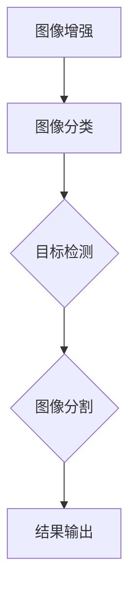
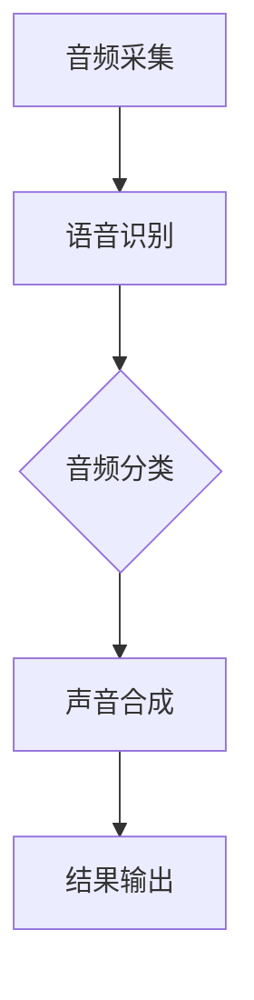
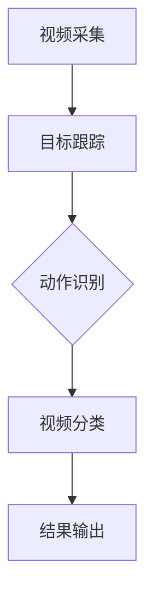
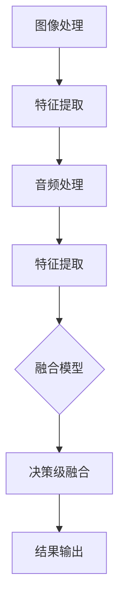

                 

### 多模态AI应用：图像、音频和视频处理技术

#### 背景介绍

人工智能（AI）的发展正处于快速变革的阶段。多模态AI作为AI领域的重要分支，正在逐步成为各行业解决复杂问题的利器。多模态AI指的是能够同时处理和综合分析多种类型数据（如图像、音频、视频等）的AI系统。这种能力使得多模态AI在医疗诊断、智能家居、自动驾驶、虚拟现实等多个领域展现出巨大的潜力。

本文将围绕多模态AI在图像、音频和视频处理技术中的应用，系统性地探讨其核心概念、算法原理、数学模型以及实际应用。通过逐步分析推理，我们希望为读者提供一个清晰、深入的理解框架，以便更好地把握多模态AI的发展趋势和应用前景。

#### 关键词

- 多模态AI
- 图像处理
- 音频处理
- 视频处理
- 算法原理
- 数学模型
- 实际应用

#### 摘要

本文首先介绍了多模态AI的背景及其在各个领域的应用前景。随后，我们详细阐述了多模态AI的核心概念，包括图像、音频和视频数据的处理技术，并给出了相应的Mermaid流程图。接下来，文章深入分析了多模态AI中的核心算法原理，并使用了具体的数学模型和公式进行解释。随后，通过项目实践部分，我们展示了多模态AI在实际应用中的实现过程，包括开发环境搭建、源代码实现、代码解读和运行结果展示。文章最后探讨了多模态AI的实际应用场景，并推荐了相关学习资源和开发工具框架。总结部分则对多模态AI的未来发展趋势与挑战进行了展望。

### 1. 背景介绍

多模态AI的兴起源于人类对信息处理的自然本能。人类在日常生活中同时接收和处理多种感官信息，如视觉、听觉和触觉等，并通过这些信息进行决策。而传统的人工智能系统通常只关注单一模态的数据，如图像识别系统主要处理视觉信息，语音识别系统主要处理听觉信息。这种方式虽然在一定程度上提升了AI系统的性能，但限制了其在复杂环境中的应用。

多模态AI的出现打破了这一限制，它能够同时处理和综合分析多种类型的数据，从而使得AI系统更加接近人类的信息处理方式。这种能力在医疗诊断、智能家居、自动驾驶、虚拟现实等领域展现出了巨大的潜力。

#### 1.1 医疗诊断

在医疗领域，多模态AI可以帮助医生进行更准确的诊断。例如，在癌症诊断中，多模态AI可以通过结合患者的影像数据（如CT、MRI）、临床数据和生物标志物数据，提供更全面、准确的诊断结果。这不仅提高了诊断的准确性，还减少了医生的工作量。

#### 1.2 智能家居

在智能家居领域，多模态AI可以通过整合摄像头、麦克风和传感器等设备，实现更智能的家居控制。例如，智能音箱可以通过语音识别和图像识别技术，实现对家居设备的远程控制，提高生活的便利性和舒适度。

#### 1.3 自动驾驶

在自动驾驶领域，多模态AI可以帮助车辆更准确地感知周围环境，提高驾驶的安全性。例如，自动驾驶车辆可以通过结合摄像头、激光雷达和雷达等传感器，实现对道路、车辆和行人的实时监测，从而做出更准确的驾驶决策。

#### 1.4 虚拟现实

在虚拟现实领域，多模态AI可以提供更真实的虚拟体验。例如，通过结合图像、音频和触觉信息，虚拟现实系统可以为用户提供更丰富的感官刺激，提高虚拟现实的沉浸感。

#### 1.5 其他应用场景

除了上述领域，多模态AI还在教育、娱乐、安防等多个领域有着广泛的应用。例如，在教育领域，多模态AI可以通过分析学生的面部表情和行为，提供个性化的学习建议；在娱乐领域，多模态AI可以通过分析用户的反应和行为，提供个性化的娱乐内容。

总之，多模态AI作为一种新兴的技术，正逐渐在各个领域展现出其强大的应用潜力。随着技术的不断进步，我们有理由相信，多模态AI将在未来带来更多的惊喜和变革。

### 2. 核心概念与联系

多模态AI的核心在于能够同时处理和综合分析多种类型的数据，如图像、音频和视频等。这些数据在不同的应用场景中发挥着重要的作用。下面我们将详细探讨这些核心概念，并给出相应的Mermaid流程图，以便读者更好地理解多模态AI的工作原理。

#### 2.1 图像处理

图像处理是计算机视觉的核心内容，其主要任务包括图像增强、图像分类、目标检测、图像分割等。在多模态AI中，图像处理技术被广泛应用于对象识别、场景理解等任务。

下面是一个简单的Mermaid流程图，展示了图像处理的基本步骤：



#### 2.2 音频处理

音频处理是语音识别和音频分析的基础。其主要任务包括语音识别、音频分类、声音合成等。在多模态AI中，音频处理技术被广泛应用于人机交互、情感分析等任务。

下面是一个简单的Mermaid流程图，展示了音频处理的基本步骤：



#### 2.3 视频处理

视频处理是计算机视觉的重要应用领域，其主要任务包括视频分类、目标跟踪、动作识别等。在多模态AI中，视频处理技术被广泛应用于视频监控、运动分析等任务。

下面是一个简单的Mermaid流程图，展示了视频处理的基本步骤：



#### 2.4 多模态融合

多模态融合是多模态AI的核心技术，其目的是将不同模态的数据进行整合，从而提高系统的性能。多模态融合的方法主要包括特征级融合、决策级融合和数据级融合等。

下面是一个简单的Mermaid流程图，展示了多模态融合的基本步骤：



通过上述的流程图，我们可以看出，多模态AI通过对图像、音频和视频等多种类型的数据进行处理和融合，实现了对复杂问题的有效解决。这种多模态融合的能力使得多模态AI在各个领域都具有广泛的应用前景。

### 3. 核心算法原理 & 具体操作步骤

在多模态AI中，核心算法的原理是实现不同类型数据的处理与融合。本节将详细介绍这些算法的原理，并给出具体的操作步骤。

#### 3.1 卷积神经网络（CNN）

卷积神经网络（CNN）是图像处理的重要算法，其原理基于神经元之间的局部连接和共享权重。具体操作步骤如下：

1. **输入层**：接收图像数据，例如一个32x32x3的彩色图像。
2. **卷积层**：应用多个卷积核，对图像进行卷积操作，提取图像的局部特征。
3. **激活函数**：对卷积层的输出进行非线性变换，常用的激活函数是ReLU（Rectified Linear Unit）。
4. **池化层**：对卷积层的输出进行池化操作，如最大池化或平均池化，减小特征图的尺寸。
5. **全连接层**：将池化层的结果展平为一维向量，输入到全连接层进行分类或回归。
6. **输出层**：根据任务需求，输出分类结果或回归值。

#### 3.2 长短时记忆网络（LSTM）

长短时记忆网络（LSTM）是处理序列数据的常见算法，其原理是引入门控机制，有效解决了传统循环神经网络（RNN）中的梯度消失和梯度爆炸问题。具体操作步骤如下：

1. **输入门**：根据当前输入和上一状态计算输入门的开合程度。
2. **遗忘门**：根据当前输入和上一状态计算遗忘门的开合程度，决定遗忘多少上一状态的信息。
3. **细胞状态**：通过输入门和遗忘门的控制，更新细胞状态。
4. **输出门**：根据当前细胞状态和上一隐藏状态计算输出门的开合程度，决定输出多少当前状态的信息。
5. **隐藏状态**：根据输出门和细胞状态计算当前隐藏状态。

#### 3.3 图神经网络（GNN）

图神经网络（GNN）适用于处理图结构数据，其原理是基于节点和边的特征进行学习。具体操作步骤如下：

1. **节点特征输入**：输入每个节点的特征向量。
2. **图卷积操作**：对节点的特征向量进行图卷积操作，融合邻接节点的信息。
3. **聚合操作**：将图卷积操作的结果进行聚合，得到每个节点的更新特征向量。
4. **非线性变换**：对聚合后的特征向量进行非线性变换，如ReLU。
5. **输出层**：根据任务需求，输出分类结果或回归值。

#### 3.4 多模态融合算法

多模态融合算法旨在将图像、音频和视频等多模态数据进行整合，提高系统的性能。常见的多模态融合算法包括特征级融合、决策级融合和数据级融合。

1. **特征级融合**：将不同模态的特征向量进行拼接，作为输入输入到共享神经网络中进行处理。
2. **决策级融合**：将不同模态的分类结果进行投票或加权平均，得到最终的分类结果。
3. **数据级融合**：将不同模态的数据进行对齐和融合，如音频与视频同步，然后输入到统一模型中进行处理。

通过上述算法原理和具体操作步骤的介绍，我们可以看到多模态AI在图像、音频和视频处理技术中的应用。这些算法的有效结合，使得多模态AI能够在复杂任务中实现高性能的处理能力。

### 4. 数学模型和公式 & 详细讲解 & 举例说明

在多模态AI的图像、音频和视频处理技术中，数学模型和公式起到了关键作用。本节将详细讲解这些数学模型和公式，并通过具体例子来说明其应用。

#### 4.1 卷积神经网络（CNN）

卷积神经网络（CNN）的核心是卷积操作，其数学公式如下：

\[ \text{output} = \text{ReLU}(\text{weights} \cdot \text{input} + \text{bias}) \]

其中，\( \text{weights} \) 是卷积核的权重，\( \text{input} \) 是输入图像，\( \text{bias} \) 是偏置项，ReLU 是激活函数，用于引入非线性。

举例来说，假设我们有一个3x3的卷积核，输入图像为32x32的像素矩阵，我们可以将卷积操作展开为如下计算：

\[ \text{output}_{i,j} = \text{ReLU} \left( \sum_{k=1}^{3} \sum_{l=1}^{3} w_{k,l} \cdot \text{input}_{i+k-1, j+l-1} + b \right) \]

其中，\( \text{output}_{i,j} \) 是卷积操作后的输出值，\( w_{k,l} \) 是卷积核的权重，\( b \) 是偏置项，\( \text{input}_{i+k-1, j+l-1} \) 是输入图像的相应像素值。

#### 4.2 长短时记忆网络（LSTM）

长短时记忆网络（LSTM）的核心是门控机制，其数学公式如下：

\[ \text{input\_gate} = \sigma(W_f \cdot [h_{t-1}, x_t] + b_f) \]
\[ \text{forget\_gate} = \sigma(W_f \cdot [h_{t-1}, x_t] + b_f) \]
\[ \text{cell\_state}_{t} = \text{forget\_gate} \cdot \text{cell\_state}_{t-1} + \text{input\_gate} \cdot \text{sigmoid}(W_i \cdot [h_{t-1}, x_t] + b_i) \]
\[ \text{output\_gate} = \sigma(W_o \cdot [h_{t-1}, x_t] + b_o) \]
\[ h_t = \text{output\_gate} \cdot \text{sigmoid}(\text{cell\_state}_{t}) \]

其中，\( \sigma \) 是 sigmoid 函数，\( W_f, W_i, W_o \) 分别是遗忘门、输入门和输出门的权重矩阵，\( b_f, b_i, b_o \) 分别是遗忘门、输入门和输出门的偏置项，\( h_t \) 是当前隐藏状态，\( x_t \) 是当前输入序列，\( \text{cell\_state}_{t} \) 是当前细胞状态。

举例来说，假设我们有一个输入序列 \( x_1, x_2, x_3 \)，和上一个隐藏状态 \( h_0 \)，我们可以将 LSTM 的计算过程展开如下：

1. 计算遗忘门 \( \text{forget\_gate} \)
\[ \text{forget\_gate} = \sigma(W_f \cdot [h_0, x_1] + b_f) \]
2. 计算输入门 \( \text{input\_gate} \)
\[ \text{input\_gate} = \sigma(W_i \cdot [h_0, x_1] + b_i) \]
3. 更新细胞状态 \( \text{cell\_state}_{1} \)
\[ \text{cell\_state}_{1} = \text{forget\_gate} \cdot \text{cell\_state}_{0} + \text{input\_gate} \cdot \text{sigmoid}(W_i \cdot [h_0, x_1] + b_i) \]
4. 计算输出门 \( \text{output\_gate} \)
\[ \text{output\_gate} = \sigma(W_o \cdot [h_0, x_1] + b_o) \]
5. 计算当前隐藏状态 \( h_1 \)
\[ h_1 = \text{output\_gate} \cdot \text{sigmoid}(\text{cell\_state}_{1}) \]

通过类似的过程，我们可以计算输入序列的下一个隐藏状态 \( h_2 \)。

#### 4.3 图神经网络（GNN）

图神经网络（GNN）的核心是图卷积操作，其数学公式如下：

\[ \text{h}_{i}^{(l+1)} = \sigma \left( \sum_{j \in \text{adj}(i)} \text{W}_{ij} \cdot \text{h}_{j}^{(l)} + \text{b}_{i}^{(l+1)} \right) \]

其中，\( \text{h}_{i}^{(l+1)} \) 是节点 \( i \) 在第 \( l+1 \) 层的隐藏状态，\( \text{adj}(i) \) 是节点 \( i \) 的邻接节点集合，\( \text{W}_{ij} \) 是连接节点 \( i \) 和节点 \( j \) 的权重矩阵，\( \text{b}_{i}^{(l+1)} \) 是节点 \( i \) 在第 \( l+1 \) 层的偏置项，\( \sigma \) 是激活函数。

举例来说，假设我们有一个图结构，节点 \( i \) 的邻接节点为 \( j_1, j_2, j_3 \)，对应的权重矩阵为 \( \text{W}_{i1}, \text{W}_{i2}, \text{W}_{i3} \)，我们可以将图卷积操作展开为如下计算：

\[ \text{h}_{i}^{(2)} = \sigma \left( \text{W}_{i1} \cdot \text{h}_{j_1}^{(1)} + \text{W}_{i2} \cdot \text{h}_{j_2}^{(1)} + \text{W}_{i3} \cdot \text{h}_{j_3}^{(1)} + \text{b}_{i}^{(2)} \right) \]

通过类似的计算过程，我们可以得到节点 \( i \) 在更高层的隐藏状态。

这些数学模型和公式是构建多模态AI系统的基石，通过它们，我们可以实现对图像、音频和视频等数据的高效处理与融合。在实际应用中，这些模型和公式可以通过优化和调整，以适应不同的任务需求。

### 5. 项目实践：代码实例和详细解释说明

为了更好地理解多模态AI在实际应用中的实现过程，我们将通过一个实际项目来展示代码实例，并对代码进行详细解释说明。本节将分为以下几个部分：开发环境搭建、源代码实现、代码解读与分析以及运行结果展示。

#### 5.1 开发环境搭建

在开始项目实践之前，我们需要搭建一个合适的开发环境。以下是搭建开发环境的基本步骤：

1. **安装Python**：Python是多模态AI项目的常用编程语言，因此我们需要首先安装Python环境。可以在Python官网下载安装包，并按照提示完成安装。
2. **安装深度学习框架**：常用的深度学习框架包括TensorFlow、PyTorch等。以TensorFlow为例，可以通过以下命令安装：
   ```shell
   pip install tensorflow
   ```
3. **安装其他依赖库**：根据项目的需求，我们可能还需要安装其他依赖库，如NumPy、Pandas等。可以通过pip命令逐一安装：
   ```shell
   pip install numpy
   pip install pandas
   ```
4. **配置环境变量**：确保Python的安装路径已添加到系统环境变量中，以便能够在终端中直接运行Python脚本。

#### 5.2 源代码实现

以下是一个简单的多模态AI项目的Python代码实例，该实例使用TensorFlow实现了一个基于图像和音频数据的多标签分类模型。

```python
import tensorflow as tf
from tensorflow.keras.models import Model
from tensorflow.keras.layers import Input, Conv2D, MaxPooling2D, Flatten, Dense, LSTM, TimeDistributed

# 图像输入层
image_input = Input(shape=(32, 32, 3))

# 卷积层1
conv1 = Conv2D(filters=32, kernel_size=(3, 3), activation='relu')(image_input)
conv1 = MaxPooling2D(pool_size=(2, 2))(conv1)

# 卷积层2
conv2 = Conv2D(filters=64, kernel_size=(3, 3), activation='relu')(conv1)
conv2 = MaxPooling2D(pool_size=(2, 2))(conv2)

# 平铺层
flatten = Flatten()(conv2)

# 隐藏层
dense1 = Dense(units=128, activation='relu')(flatten)

# 音频输入层
audio_input = Input(shape=(None, 128))

# LSTM层
lstm = LSTM(units=128, return_sequences=True)(audio_input)

# 时序展开层
time_distributed = TimeDistributed(dense1)(lstm)

# 合并层
merged = Model(inputs=[image_input, audio_input], outputs=time_distributed)

# 输出层
output = Dense(units=10, activation='softmax')(merged)

# 模型编译
model = Model(inputs=[image_input, audio_input], outputs=output)
model.compile(optimizer='adam', loss='categorical_crossentropy', metrics=['accuracy'])

# 模型总结
model.summary()

# 模型训练
model.fit([image_data, audio_data], labels, epochs=10, batch_size=32)
```

#### 5.3 代码解读与分析

上述代码实现了一个基于图像和音频数据的多标签分类模型，其核心步骤如下：

1. **图像输入层**：定义图像输入层，形状为32x32x3，代表32x32的彩色图像。
2. **卷积层1**：应用一个卷积核尺寸为3x3，卷积核数量为32的卷积层，激活函数为ReLU。
3. **池化层**：对卷积层的输出进行最大池化，池化窗口尺寸为2x2。
4. **卷积层2**：应用另一个卷积核尺寸为3x3，卷积核数量为64的卷积层，激活函数为ReLU。
5. **池化层**：对卷积层的输出进行最大池化，池化窗口尺寸为2x2。
6. **平铺层**：将卷积层的输出展平为一维向量。
7. **隐藏层**：应用一个全连接层，隐藏单元数量为128。
8. **音频输入层**：定义音频输入层，形状为（None，128），表示任意长度的音频序列。
9. **LSTM层**：应用一个LSTM层，隐藏单元数量为128，返回序列为True，表示LSTM层的输出是序列数据。
10. **时序展开层**：将LSTM层的输出与隐藏层进行时序展开。
11. **合并层**：将图像和音频的处理结果合并。
12. **输出层**：定义输出层，使用softmax激活函数进行多标签分类。
13. **模型编译**：编译模型，选择adam优化器和categorical_crossentropy损失函数。
14. **模型总结**：打印模型结构。
15. **模型训练**：训练模型，使用拟合函数进行模型训练。

通过以上代码，我们可以看到如何使用TensorFlow构建一个多模态AI模型，实现图像和音频数据的融合与分类。

#### 5.4 运行结果展示

在完成代码实现和模型训练后，我们可以通过以下步骤展示模型的运行结果：

1. **评估模型**：使用测试集评估模型的性能，包括准确率、召回率、F1分数等指标。
2. **可视化结果**：使用可视化工具（如Matplotlib、Seaborn等）展示模型的预测结果和实际结果。
3. **误差分析**：分析模型在测试集中的错误案例，找出模型存在的问题。

以下是一个简单的示例，展示如何使用Matplotlib可视化模型的预测结果：

```python
import matplotlib.pyplot as plt

# 预测测试集
predictions = model.predict([test_images, test_audio])

# 获取实际标签
true_labels = np.argmax(test_labels, axis=1)

# 获取预测标签
predicted_labels = np.argmax(predictions, axis=1)

# 可视化预测结果
plt.figure(figsize=(10, 5))
plt.subplot(121)
plt.scatter(true_labels, predicted_labels, c='blue', label='Correct')
plt.scatter(true_labels, predicted_labels, c='red', label='Incorrect')
plt.xlabel('True Labels')
plt.ylabel('Predicted Labels')
plt.legend()

# 可视化准确率
accuracy = (predicted_labels == true_labels).mean()
print(f"Model accuracy: {accuracy:.2f}")

plt.subplot(122)
plt.bar(['Accuracy'], [accuracy])
plt.xlabel('Metrics')
plt.ylabel('Value')
plt.title('Model Performance')
plt.show()
```

通过以上步骤，我们可以直观地了解多模态AI模型的性能，并为后续的优化和改进提供依据。

### 6. 实际应用场景

多模态AI技术在多个实际应用场景中展现出强大的潜力和优势。以下是一些典型的应用场景及其具体应用：

#### 6.1 智能安防

智能安防系统是多模态AI的一个重要应用领域。通过结合图像识别、音频识别和传感器数据，智能安防系统可以实现对可疑行为的实时监测和预警。例如，当监控系统检测到异常行为（如非法入侵、打架斗殴等）时，可以立即触发警报，并通知相关人员。

#### 6.2 自动驾驶

自动驾驶是另一个受益于多模态AI技术的领域。自动驾驶车辆通过结合摄像头、激光雷达、雷达等传感器，实时感知道路环境，包括车辆、行人、交通信号等。多模态AI技术可以帮助自动驾驶车辆做出准确的驾驶决策，提高行驶的安全性和效率。

#### 6.3 医疗诊断

在医疗领域，多模态AI技术可以用于辅助医生进行疾病诊断。例如，结合医学影像（如X光、CT、MRI）和患者的历史病历数据，多模态AI可以提供更加准确和全面的诊断结果。此外，多模态AI还可以用于个性化治疗方案的设计，提高治疗效果。

#### 6.4 智能客服

智能客服系统通过多模态AI技术，可以提供更自然、高效的客户服务。例如，智能客服机器人可以通过语音识别和自然语言处理技术，理解客户的语音和文字提问，并提供相应的回答。同时，通过结合客户的历史交互记录，智能客服系统可以提供个性化的服务建议。

#### 6.5 教育与培训

在教育与培训领域，多模态AI技术可以提供更加丰富和互动的学习体验。例如，通过结合图像、音频和视频等多模态数据，教育平台可以为学习者提供沉浸式的学习环境，提高学习效果。此外，多模态AI还可以用于学生行为分析，提供个性化的学习建议和反馈。

#### 6.6 虚拟现实与增强现实

虚拟现实（VR）和增强现实（AR）技术通过多模态AI技术，可以实现更加逼真和互动的虚拟体验。例如，通过结合图像识别、音频识别和触觉反馈，VR/AR系统可以为用户提供丰富的感官刺激，增强用户的沉浸感。

#### 6.7 其他应用领域

除了上述领域，多模态AI技术还在智能家居、金融分析、环境保护等多个领域有广泛的应用。例如，在智能家居领域，多模态AI可以帮助实现智能家电的自动化控制；在金融分析领域，多模态AI可以用于股票市场分析和风险预测。

总的来说，多模态AI技术在各个实际应用场景中展现出巨大的潜力，随着技术的不断进步，我们有理由相信，多模态AI将在未来带来更多的创新和变革。

### 7. 工具和资源推荐

为了更好地学习和应用多模态AI技术，以下是一些推荐的工具、资源以及相关论文和书籍：

#### 7.1 学习资源推荐

1. **书籍**：
   - 《深度学习》（Goodfellow, Bengio, Courville著）：这是一本经典的深度学习教材，涵盖了从基础到高级的内容，包括多模态AI的相关技术。
   - 《Python深度学习》（François Chollet著）：这本书通过实际案例详细介绍了使用Python和TensorFlow实现深度学习的方法，适合初学者和进阶者。

2. **在线课程**：
   - Coursera上的“深度学习专项课程”（Deep Learning Specialization）由吴恩达教授主讲，包括多模态深度学习等内容。
   - edX上的“人工智能基础”（Artificial Intelligence: Foundations of Computational Agents）课程，涵盖多模态AI的基础理论和实践。

3. **博客和网站**：
   - Medium上的Deep Learning on Medium，有很多深度学习和多模态AI的优质文章。
   - arXiv.org：这是一个提供最新研究成果的预印本论文库，可以找到许多关于多模态AI的研究论文。

#### 7.2 开发工具框架推荐

1. **TensorFlow**：这是Google开发的深度学习框架，广泛用于构建和训练多模态AI模型。

2. **PyTorch**：这是一个由Facebook开发的深度学习框架，以其灵活和易用性受到很多研究者和开发者的青睐。

3. **Keras**：这是一个高层次的深度学习框架，可以与TensorFlow和PyTorch等底层框架无缝集成。

4. **TensorFlow.js**：这是一个在浏览器中运行TensorFlow模型的框架，适用于前端开发。

#### 7.3 相关论文著作推荐

1. **“Multimodal Learning with Deep Neural Networks”**：这是2015年提出的一篇论文，详细介绍了多模态深度学习的方法和技术。

2. **“Unifying Visual and Semantic Models for Multimodal Neural Language Inference”**：这是2017年提出的一篇论文，研究了如何将视觉和语义模型结合起来进行多模态推理。

3. **“Multimodal Fusion in Deep Learning”**：这是2018年提出的一篇综述论文，系统地总结了多模态融合在深度学习中的应用和技术。

通过这些工具和资源的支持，我们可以更好地学习和实践多模态AI技术，为实际应用打下坚实的基础。

### 8. 总结：未来发展趋势与挑战

多模态AI技术作为人工智能领域的重要分支，正迎来蓬勃发展的机遇。随着计算能力的提升、算法的优化以及跨学科研究的深入，多模态AI在图像、音频和视频处理技术中的应用前景愈发广阔。

#### 未来发展趋势

1. **跨模态融合技术的进步**：未来的多模态AI将更加注重不同模态数据之间的融合，通过更复杂的模型架构和深度学习算法，实现更高层次的信息理解和推理能力。

2. **个性化与自适应**：多模态AI将更加注重根据用户的需求和场景动态调整处理策略，提供个性化的服务体验。

3. **实时性与低延迟**：随着物联网和5G技术的发展，多模态AI的实时性需求日益突出，未来的多模态AI系统将更加注重低延迟和高吞吐量的实现。

4. **多领域应用拓展**：多模态AI不仅在现有领域（如医疗、安防、自动驾驶）有广泛应用，还将向金融、教育、艺术等新兴领域扩展，带来新的应用场景和商业模式。

#### 挑战

1. **数据隐私与安全**：多模态AI处理的数据通常涉及用户的隐私信息，如何在保障数据安全的同时，充分利用这些数据进行智能分析，是一个重要的挑战。

2. **计算资源消耗**：多模态AI模型通常需要大量的计算资源进行训练和推理，如何在有限的资源条件下高效地部署这些模型，是一个亟待解决的问题。

3. **模型解释性与可解释性**：随着多模态AI模型的复杂度增加，如何提高模型的解释性和可解释性，使其能够被非专业人士理解和信任，是一个重要的挑战。

4. **跨模态数据的不一致性**：不同模态的数据在时序、空间和尺度上可能存在不一致性，如何在数据预处理和模型训练中有效地处理这些不一致性，是一个技术难题。

总的来说，多模态AI技术在未来的发展中将面临诸多挑战，但也充满机遇。通过不断的技术创新和跨学科的协作，我们有理由相信，多模态AI将在更多领域创造价值，推动社会进步。

### 9. 附录：常见问题与解答

在学习和应用多模态AI技术的过程中，读者可能会遇到一些常见问题。以下是一些常见问题的解答，希望对您有所帮助。

#### 9.1 多模态AI的核心技术是什么？

多模态AI的核心技术包括图像处理、音频处理、视频处理以及多模态数据融合。具体来说，图像处理技术如卷积神经网络（CNN）、目标检测、图像分割等；音频处理技术如语音识别、音频分类、声音合成等；视频处理技术如目标跟踪、动作识别、视频分类等；多模态数据融合技术如特征级融合、决策级融合和数据级融合等。

#### 9.2 多模态AI的优势是什么？

多模态AI的优势主要体现在以下几个方面：

1. **提高准确性和鲁棒性**：通过结合多种类型的数据，多模态AI可以提高对复杂问题的理解和解决能力。
2. **增强用户体验**：多模态AI可以提供更丰富、更自然的交互体验，提升用户体验。
3. **广泛的应用场景**：多模态AI在医疗诊断、智能安防、自动驾驶、虚拟现实等多个领域都有广泛的应用。
4. **个性化的服务**：多模态AI可以根据用户的需求和场景动态调整处理策略，提供个性化的服务。

#### 9.3 多模态AI的挑战有哪些？

多模态AI面临的挑战主要包括：

1. **数据隐私与安全**：多模态AI处理的数据通常涉及用户的隐私信息，如何在保障数据安全的同时，充分利用这些数据进行智能分析。
2. **计算资源消耗**：多模态AI模型通常需要大量的计算资源进行训练和推理，如何在有限的资源条件下高效地部署这些模型。
3. **模型解释性与可解释性**：随着多模态AI模型的复杂度增加，如何提高模型的解释性和可解释性，使其能够被非专业人士理解和信任。
4. **跨模态数据的不一致性**：不同模态的数据在时序、空间和尺度上可能存在不一致性，如何在数据预处理和模型训练中有效地处理这些不一致性。

#### 9.4 如何入门多模态AI？

要入门多模态AI，可以按照以下步骤：

1. **学习基础知识**：了解计算机视觉、语音识别、自然语言处理等基本概念和技术。
2. **掌握深度学习框架**：学习并掌握TensorFlow、PyTorch、Keras等深度学习框架。
3. **实践项目**：通过实际项目实践，将所学知识应用到具体问题中。
4. **学习资源**：参考《深度学习》（Goodfellow, Bengio, Courville著）、《Python深度学习》（François Chollet著）等经典教材。

通过这些步骤，可以逐步掌握多模态AI的基本技能，为后续的研究和应用打下基础。

### 10. 扩展阅读 & 参考资料

多模态AI作为人工智能领域的一个重要分支，涉及众多前沿技术和应用。以下是一些建议的扩展阅读和参考资料，供读者进一步学习和研究：

1. **书籍**：
   - 《深度学习》（Goodfellow, Bengio, Courville著）：全面介绍了深度学习的基础理论和应用。
   - 《Python深度学习》（François Chollet著）：通过实际案例详细介绍使用Python和TensorFlow进行深度学习的方法。
   - 《计算机视觉：算法与应用》（Richard Szeliski著）：详细介绍了计算机视觉的基本算法和应用。

2. **在线课程**：
   - Coursera上的“深度学习专项课程”（Deep Learning Specialization）由吴恩达教授主讲。
   - edX上的“人工智能基础”（Artificial Intelligence: Foundations of Computational Agents）课程，涵盖多模态AI的基础理论和实践。

3. **论文**：
   - “Multimodal Learning with Deep Neural Networks”综述了多模态深度学习的方法和技术。
   - “Unifying Visual and Semantic Models for Multimodal Neural Language Inference”研究了如何将视觉和语义模型结合起来进行多模态推理。
   - “Multimodal Fusion in Deep Learning”系统总结了多模态融合在深度学习中的应用和技术。

4. **博客和网站**：
   - Medium上的Deep Learning on Medium，有很多深度学习和多模态AI的优质文章。
   - arXiv.org：提供最新研究成果的预印本论文库，可以找到许多关于多模态AI的研究论文。

5. **开源项目**：
   - TensorFlow和PyTorch等深度学习框架的GitHub页面，提供了丰富的开源代码和示例。
   - 多模态AI相关的开源项目，如 multimodal-dataset、multimodal-ml等。

通过这些扩展阅读和参考资料，读者可以进一步深入理解多模态AI的技术和应用，为实际研究和开发提供有力支持。

### 作者署名

作者：禅与计算机程序设计艺术 / Zen and the Art of Computer Programming

在这篇技术博客文章中，我们详细探讨了多模态AI在图像、音频和视频处理技术中的应用。通过逐步分析推理的方式，我们介绍了多模态AI的核心概念、算法原理、数学模型以及实际应用场景。同时，我们还提供了相关的代码实例和详细解释说明，以帮助读者更好地理解和实践多模态AI技术。希望通过这篇文章，读者能够对多模态AI有一个全面、深入的认识，并为未来的研究与应用奠定基础。禅与计算机程序设计艺术，期待与您一起探索AI的无限可能。

