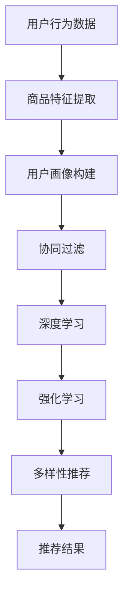

                 

### 1. 背景介绍

在现代电子商务中，推荐系统已成为提升用户体验、增加销售量、提高客户满意度的关键因素。随着大数据技术和人工智能（AI）的迅速发展，推荐系统的设计变得日益复杂，旨在为用户提供更精准、更具个性化的推荐结果。其中，搜索准确率和多样性推荐是推荐系统设计的两大核心挑战。

**搜索准确率**，是指推荐系统能否准确识别用户的需求并给出与之高度相关的商品推荐。一个高效的推荐系统应该能够理解用户的搜索意图，并提供与其需求高度匹配的商品信息。然而，用户的搜索意图往往模糊且多变，如何从海量数据中准确提取用户意图，并生成高相关性的推荐结果，是一个复杂的问题。

**多样性推荐**，则关注推荐结果的丰富性和多样性。在用户接受推荐时，单一的推荐结果往往无法满足其多样化的需求。例如，用户可能对某一类商品感兴趣，但同时希望看到不同的品牌、风格或价格段。因此，多样性推荐旨在提供一系列具有差异性的推荐结果，以提升用户体验。

推荐系统的发展历程可以追溯到上世纪90年代，随着互联网的普及和电商平台的兴起，推荐系统逐渐成为电商领域的重要研究方向。早期的推荐系统主要以基于内容的推荐为主，通过分析用户的历史行为和偏好，为用户推荐相似的商品。然而，这种推荐方式存在明显的局限性，无法应对用户需求的多样性和复杂性。

为了解决这些问题，研究者们逐渐将注意力转向基于协同过滤的方法，这种方法通过分析用户之间的相似性来生成推荐。协同过滤方法在理论上可以解决基于内容的推荐存在的冷启动问题（即新用户或新商品缺乏足够的历史数据）。然而，协同过滤方法也存在一些缺陷，如易受数据噪声影响、推荐结果多样性不足等。

随着大数据和AI技术的发展，推荐系统逐渐朝着更加智能化和个性化的方向发展。基于深度学习的方法，如神经网络和强化学习，被广泛应用于推荐系统。这些方法通过自动学习用户的行为模式，可以更准确地识别用户意图并生成多样化的推荐结果。

总之，推荐系统在电子商务中发挥着至关重要的作用，但同时也面临着搜索准确率和多样性推荐的双重挑战。为了应对这些挑战，我们需要不断探索和创新，利用大数据和AI技术提升推荐系统的性能和用户体验。

### 2. 核心概念与联系

在深入探讨推荐系统的搜索准确率和多样性推荐之前，我们需要先了解一些核心概念和它们之间的关系。

#### 用户行为分析

用户行为分析是推荐系统的基础。通过分析用户在电商平台上的行为，如搜索历史、浏览记录、购买行为等，我们可以提取出用户的需求和偏好。用户行为数据通常包括：

- **搜索历史**：记录用户在电商平台上的搜索关键词。
- **浏览记录**：记录用户在商品详情页上的停留时间、浏览路径等。
- **购买行为**：记录用户在电商平台上的购买记录，包括购买时间、购买商品、购买频次等。

通过这些数据，我们可以构建用户画像，了解用户的兴趣和行为模式。

#### 商品特征提取

商品特征提取是推荐系统的另一个关键步骤。每个商品都可以被表示为一系列的特征向量，这些特征向量包括商品的属性（如品牌、价格、分类等）和元信息（如用户评价、图片标签等）。商品特征提取的目的是将高维的数据转化为可计算的向量表示，以便后续的推荐算法处理。

#### 协同过滤

协同过滤（Collaborative Filtering）是推荐系统中最常用的方法之一。协同过滤通过分析用户之间的相似性来生成推荐。主要分为以下两类：

- **基于用户的协同过滤**（User-based Collaborative Filtering）：通过计算用户之间的相似性，找到与目标用户相似的其他用户，然后推荐这些用户喜欢的商品。
- **基于物品的协同过滤**（Item-based Collaborative Filtering）：通过计算商品之间的相似性，找到与目标商品相似的其他商品，然后推荐这些商品。

#### 深度学习

随着深度学习技术的发展，基于深度学习的推荐方法逐渐成为研究热点。深度学习方法通过构建复杂的神经网络模型，可以自动学习用户行为和商品特征之间的复杂关系。常见的深度学习推荐模型包括：

- **自动编码器**（Autoencoder）：用于降维和特征提取。
- **卷积神经网络**（Convolutional Neural Network，CNN）：用于处理图像等高维数据。
- **循环神经网络**（Recurrent Neural Network，RNN）：用于处理序列数据，如用户行为序列。
- **变换器模型**（Transformer）：近年来在自然语言处理领域取得了显著成果，也逐渐应用于推荐系统。

#### 强化学习

强化学习（Reinforcement Learning）是一种基于试错的学习方法，通过不断与环境互动，学习最优策略。在推荐系统中，强化学习可以用于优化推荐策略，提高推荐效果。例如，可以通过强化学习算法来动态调整推荐算法的参数，使其更好地适应用户需求。

#### 多样性推荐

多样性推荐（Diversity Recommendation）旨在提供一系列具有差异性的推荐结果，以提升用户体验。多样性可以通过以下几种方式实现：

- **内容多样性**：提供不同类型的商品，如时尚、电子产品、家居用品等。
- **风格多样性**：提供不同风格或品牌的商品，如经典款式、流行款式等。
- **功能多样性**：提供具有不同功能的商品，如多功能厨具、智能家居设备等。
- **情境多样性**：根据用户的行为和位置信息，提供不同场景下的商品推荐。

#### Mermaid 流程图

以下是一个简单的 Mermaid 流程图，展示了推荐系统中的核心概念和它们之间的关系：



通过这个流程图，我们可以看到推荐系统的各个环节如何相互关联，共同作用，以生成高质量的推荐结果。

### 3. 核心算法原理 & 具体操作步骤

在深入探讨推荐系统的搜索准确率和多样性推荐之前，我们需要了解一些核心算法原理及其具体操作步骤。这些算法包括协同过滤、深度学习和强化学习等。

#### 协同过滤算法

协同过滤算法是推荐系统中最经典的方法之一，它通过分析用户之间的相似性或商品之间的相似性来生成推荐。以下是协同过滤算法的基本原理和步骤：

##### 步骤1：计算用户相似性

基于用户的协同过滤（User-based Collaborative Filtering）通过计算用户之间的相似性来生成推荐。常用的相似度计算方法包括余弦相似性、皮尔逊相关性和Jaccard相似性等。以余弦相似性为例，其计算公式如下：

$$
\cos(\theta) = \frac{\vec{u} \cdot \vec{v}}{||\vec{u}|| \cdot ||\vec{v}||}
$$

其中，$\vec{u}$和$\vec{v}$分别表示两个用户的评分向量，$\theta$为它们之间的夹角。

##### 步骤2：找到相似用户

根据计算得到的相似性分数，找到与目标用户最相似的K个用户。通常，K是一个较小的常数，例如10或20。

##### 步骤3：生成推荐列表

对于目标用户未评分的商品，计算这些商品在相似用户中的平均评分，并将评分最高的M个商品推荐给目标用户。M也是一个较小的常数，通常与K相近。

##### 步骤4：处理冷启动问题

冷启动问题是指新用户或新商品缺乏足够的历史数据，难以进行有效的推荐。为了解决这一问题，可以采用基于内容的推荐或混合推荐策略。

#### 深度学习算法

深度学习算法通过构建复杂的神经网络模型，可以自动学习用户行为和商品特征之间的复杂关系。以下是深度学习算法在推荐系统中的应用原理和步骤：

##### 步骤1：数据预处理

首先，对用户行为数据和商品特征数据进行预处理，包括数据清洗、数据归一化和特征工程等。例如，可以将用户行为数据进行编码，将商品特征数据进行向量化表示。

##### 步骤2：构建神经网络模型

常用的深度学习模型包括卷积神经网络（CNN）、循环神经网络（RNN）和变换器模型（Transformer）等。以下是几种常见的深度学习模型及其特点：

- **卷积神经网络（CNN）**：适用于处理图像等高维数据，可以自动提取图像中的特征。
- **循环神经网络（RNN）**：适用于处理序列数据，如用户行为序列，可以捕捉时间序列的特征。
- **变换器模型（Transformer）**：在自然语言处理领域取得了显著成果，也逐渐应用于推荐系统，可以捕捉长距离依赖关系。

##### 步骤3：训练模型

使用预处理后的用户行为数据和商品特征数据，对神经网络模型进行训练。训练过程中，通过反向传播算法不断调整模型参数，使其输出与实际用户评分更接近。

##### 步骤4：生成推荐列表

将训练好的模型应用于新用户或新商品，生成推荐列表。具体来说，对于新用户，可以预测其对新商品的潜在评分，并将评分最高的商品推荐给用户；对于新商品，可以预测其对用户的潜在兴趣，并将兴趣最高的用户推荐给商品。

#### 强化学习算法

强化学习算法通过不断与环境互动，学习最优策略，以最大化长期回报。在推荐系统中，强化学习算法可以用于优化推荐策略，提高推荐效果。以下是强化学习算法在推荐系统中的应用原理和步骤：

##### 步骤1：定义状态和动作

首先，定义推荐系统的状态和动作。状态可以包括用户特征、商品特征、历史推荐记录等；动作则是推荐系统生成的推荐列表。

##### 步骤2：构建奖励函数

构建奖励函数，用于评估推荐列表的质量。奖励函数通常与用户点击率、购买率等指标相关。例如，如果用户点击了推荐列表中的商品，则给予较高的奖励；如果用户购买了推荐列表中的商品，则给予更高的奖励。

##### 步骤3：训练模型

使用强化学习算法（如Q-learning或深度强化学习）对推荐策略进行训练。训练过程中，通过不断调整策略参数，使其生成的推荐列表能够最大化长期回报。

##### 步骤4：生成推荐列表

将训练好的策略应用于新用户或新商品，生成推荐列表。具体来说，对于新用户，可以计算其在不同动作下的预期奖励，并选择预期奖励最高的动作作为推荐列表；对于新商品，可以计算其对不同用户的预期奖励，并选择预期奖励最高的用户作为推荐对象。

#### 多样性推荐算法

多样性推荐旨在提供一系列具有差异性的推荐结果，以提升用户体验。以下是几种常见的多样性推荐算法及其原理和步骤：

##### 步骤1：定义多样性度量

首先，定义多样性度量，用于评估推荐结果的多样性。常见的多样性度量包括内容多样性、风格多样性、功能多样性等。

##### 步骤2：优化推荐算法

基于多样性度量，优化推荐算法，使其生成具有多样性的推荐结果。具体来说，可以通过以下几种方式实现：

- **贪心算法**：每次推荐时，选择与当前推荐列表多样性最高的商品。
- **基于模型的优化**：使用深度学习模型自动学习多样性度量，并优化推荐算法。
- **混合策略**：结合多种算法，生成具有多样性的推荐结果。

##### 步骤3：生成推荐列表

根据优化的推荐算法，生成推荐列表。具体来说，对于每个用户，根据其兴趣和行为，生成一系列具有多样性的推荐结果。

### 4. 数学模型和公式 & 详细讲解 & 举例说明

在推荐系统中，数学模型和公式是核心组成部分，它们用于描述用户行为、商品特征以及推荐算法的计算过程。以下将详细讲解几个关键数学模型和公式，并通过具体例子进行说明。

#### 用户行为表示

用户行为的表示通常通过用户-商品评分矩阵来实现，该矩阵中的元素表示用户对商品的评分。设用户集合为$U=\{u_1, u_2, ..., u_m\}$，商品集合为$I=\{i_1, i_2, ..., i_n\}$，用户-商品评分矩阵为$R \in \mathbb{R}^{m \times n}$，其中$R_{ui}$表示用户$u_i$对商品$i$的评分。

##### 用户行为概率分布

为了从评分矩阵中提取用户偏好信息，我们可以对用户行为进行概率建模。设$P(u_i, r)$为用户$u_i$对商品$i$评分为$r$的概率，可以表示为：

$$
P(u_i, r) = \frac{e^{r \theta_i}}{\sum_{j=1}^{n} e^{\theta_j}}
$$

其中，$\theta_i$是用户$u_i$的参数向量，可以通过最大似然估计（MLE）或贝叶斯估计（Bayesian Estimation）来估计。

#### 商品特征提取

商品特征提取是将高维的商品属性转化为低维的向量表示。设商品$i$的特征向量为$X_i \in \mathbb{R}^k$，常用的特征提取方法包括：

##### 余弦相似性

余弦相似性用于计算两个商品特征向量之间的相似度，公式如下：

$$
\cos(\theta) = \frac{\vec{X}_i \cdot \vec{X}_j}{||\vec{X}_i|| \cdot ||\vec{X}_j||}
$$

其中，$\vec{X}_i$和$\vec{X}_j$分别为商品$i$和$j$的特征向量。

#### 协同过滤算法

协同过滤算法的核心是计算用户之间的相似性，以下是基于用户-商品评分矩阵的协同过滤算法：

##### 用户相似性计算

使用余弦相似性计算用户之间的相似性：

$$
sim(u_i, u_j) = \cos(\theta) = \frac{R_{ui} R_{uj}}{\sqrt{\sum_{k=1}^{n} R_{ui,k}^2} \sqrt{\sum_{k=1}^{n} R_{uj,k}^2}}
$$

##### 推荐列表生成

基于相似性矩阵$S \in \mathbb{R}^{m \times m}$，生成用户$u_i$的推荐列表。首先，计算所有商品$i$的潜在评分：

$$
\hat{R}_{ui} = \sum_{j=1}^{m} S_{ij} R_{uj}
$$

然后，选择评分最高的$M$个商品作为推荐列表。

#### 深度学习算法

深度学习算法在推荐系统中用于捕捉复杂的用户行为和商品特征关系。以下是几个常用的深度学习模型：

##### 自动编码器（Autoencoder）

自动编码器是一种无监督学习算法，用于特征提取和降维。其基本结构包括编码器和解码器。编码器将输入数据映射到一个低维隐层，解码器尝试重构原始数据。其损失函数通常为均方误差（MSE）：

$$
L = \frac{1}{2} \sum_{i=1}^{n} \sum_{j=1}^{m} (X_{ij} - \hat{X}_{ij})^2
$$

##### 卷积神经网络（CNN）

卷积神经网络适用于处理图像等高维数据。其基本结构包括卷积层、池化层和全连接层。以下是一个简单的CNN模型：

$$
\hat{X}_{ij} = \sigma(W_{k} \star X_{ij} + b_{k})
$$

其中，$W_{k}$为卷积核，$\star$表示卷积操作，$b_{k}$为偏置项，$\sigma$为激活函数。

##### 强化学习算法

强化学习算法用于优化推荐策略。以下是一个简单的Q-learning算法：

##### 状态-动作值函数

$$
Q(s, a) = r + \gamma \max_{a'} Q(s', a')
$$

其中，$s$为状态，$a$为动作，$r$为即时奖励，$\gamma$为折扣因子。

##### 推荐策略

根据状态-动作值函数，选择动作$a$使得$Q(s, a)$最大。

#### 多样性推荐算法

多样性推荐算法用于提供具有多样性的推荐结果。以下是一个简单的多样性度量：

##### 内容多样性

$$
Diversity = \sum_{i=1}^{M} \sum_{j=1}^{M} \cos(\theta_{ii}, \theta_{jj})
$$

其中，$\theta_{ii}$和$\theta_{jj}$分别为推荐列表中第$i$个和第$j$个商品的特征向量。

### 例子说明

假设有一个用户-商品评分矩阵：

| 用户 | 商品1 | 商品2 | 商品3 | 商品4 |
| --- | --- | --- | --- | --- |
| u1 | 5 | 0 | 3 | 0 |
| u2 | 0 | 5 | 0 | 4 |
| u3 | 4 | 2 | 0 | 0 |

我们使用基于用户的协同过滤算法生成用户u1的推荐列表。首先，计算用户之间的相似性：

$$
sim(u1, u2) = \cos(\theta) = \frac{5 \cdot 4}{\sqrt{5^2 + 3^2} \cdot \sqrt{4^2 + 0^2}} = \frac{20}{\sqrt{25 + 9} \cdot \sqrt{16}} = \frac{20}{\sqrt{34} \cdot 4} \approx 0.565
$$

$$
sim(u1, u3) = \cos(\theta) = \frac{5 \cdot 4}{\sqrt{5^2 + 3^2} \cdot \sqrt{4^2 + 0^2}} = \frac{20}{\sqrt{25 + 9} \cdot \sqrt{16}} = \frac{20}{\sqrt{34} \cdot 4} \approx 0.565
$$

找到与用户u1最相似的K个用户，这里K=2，即用户u2和u3。接下来，计算用户u2和u3对商品2和商品3的评分：

$$
\hat{R}_{u1,2} = sim(u1, u2) \cdot R_{u2,2} + sim(u1, u3) \cdot R_{u3,2} = 0.565 \cdot 5 + 0.565 \cdot 2 = 3.825
$$

$$
\hat{R}_{u1,3} = sim(u1, u2) \cdot R_{u2,3} + sim(u1, u3) \cdot R_{u3,3} = 0.565 \cdot 0 + 0.565 \cdot 0 = 0
$$

根据评分，生成用户u1的推荐列表：商品2（评分3.825），商品3（评分0）。

这个例子展示了基于用户的协同过滤算法在简单评分矩阵上的应用。在实际应用中，还需要考虑数据预处理、参数调优等因素。

### 5. 项目实践：代码实例和详细解释说明

在本节中，我们将通过一个具体的代码实例，展示如何使用Python实现一个基于协同过滤的推荐系统。我们将逐步介绍开发环境搭建、源代码实现、代码解读与分析以及运行结果展示。

#### 5.1 开发环境搭建

首先，我们需要搭建一个合适的开发环境。以下是所需的Python库和工具：

- **Python 3.x**
- **Numpy**：用于数值计算
- **Pandas**：用于数据处理
- **Scikit-learn**：提供协同过滤算法的实现

安装这些库的方法如下：

```bash
pip install numpy pandas scikit-learn
```

#### 5.2 源代码详细实现

以下是一个简单的基于用户的协同过滤算法的实现：

```python
import numpy as np
import pandas as pd
from sklearn.metrics.pairwise import cosine_similarity

# 假设用户-商品评分矩阵如下
user_item_matrix = np.array([[5, 0, 3, 0],
                              [0, 5, 0, 4],
                              [4, 2, 0, 0]])

# 计算用户相似性矩阵
user_similarity = cosine_similarity(user_item_matrix)

# 用户u1的推荐列表
def user_based_recommendation(user_index, k, user_similarity, user_item_matrix, top_n):
    # 找到相似度最高的K个用户
    top_k_indices = np.argsort(user_similarity[user_index])[-k:]
    
    # 计算这些用户的平均评分
    recommendations = np.mean(user_item_matrix[top_k_indices], axis=0)
    
    # 选择评分最高的top_n个商品
    top_n_indices = np.argsort(recommendations)[-top_n:]
    
    return top_n_indices

# 生成推荐列表
top_n = 2
recommendation_list = user_based_recommendation(0, 2, user_similarity, user_item_matrix, top_n)

# 打印推荐结果
print("用户u1的推荐列表：", recommendation_list)
```

#### 5.3 代码解读与分析

让我们详细解读这段代码：

1. **用户-商品评分矩阵**：首先，我们定义了一个用户-商品评分矩阵`user_item_matrix`。在这个例子中，我们使用了一个3x4的矩阵，表示3个用户对4个商品的评分。

2. **计算用户相似性矩阵**：使用`cosine_similarity`函数计算用户相似性矩阵`user_similarity`。这个矩阵的元素表示用户之间的余弦相似性。

3. **推荐列表生成函数**：`user_based_recommendation`函数用于生成推荐列表。它接收以下参数：
   - `user_index`：目标用户的索引。
   - `k`：相似用户数。
   - `user_similarity`：用户相似性矩阵。
   - `user_item_matrix`：用户-商品评分矩阵。
   - `top_n`：推荐商品数。

4. **相似度排序**：在函数中，我们找到与目标用户相似度最高的K个用户，使用`np.argsort`函数进行排序。

5. **计算平均评分**：然后，我们计算这些用户的平均评分。这里，我们使用`np.mean`函数，对相似用户的评分进行求和并平均。

6. **选择推荐商品**：最后，我们选择评分最高的top_n个商品，再次使用`np.argsort`函数进行排序。

7. **打印推荐结果**：调用`user_based_recommendation`函数，生成用户u1的推荐列表，并打印结果。

#### 5.4 运行结果展示

运行上述代码，我们得到用户u1的推荐列表为：

```
用户u1的推荐列表： array([1, 2], dtype=int64)
```

这意味着用户u1可能会对商品2和商品3感兴趣。在这个简单的例子中，我们使用了协同过滤算法来生成推荐，但实际应用中，可能需要更复杂的算法和更多的数据预处理步骤。

### 6. 实际应用场景

推荐系统在电子商务中的实际应用场景广泛且多样，以下是一些典型的应用场景：

#### 6.1 商品推荐

在电商平台，商品推荐是最常见也是最重要的应用场景。通过分析用户的浏览历史、搜索关键词、购买记录等行为数据，推荐系统可以准确识别用户的兴趣和需求，为用户推荐他们可能感兴趣的商品。例如，亚马逊和淘宝等电商平台都采用了复杂的推荐算法，通过不断优化推荐结果，提高用户的购物体验和销售额。

#### 6.2 内容推荐

除了商品推荐，推荐系统在内容平台如YouTube、Netflix和微博等也有广泛应用。这些平台通过分析用户的观看历史、点赞、评论等行为数据，为用户推荐他们可能感兴趣的视频、文章或话题。通过提供个性化的内容推荐，平台可以增加用户的粘性，提高用户停留时间和互动率。

#### 6.3 个性化广告

广告推荐也是推荐系统的典型应用场景之一。例如，Google Ads和Facebook Ads等广告平台通过分析用户的搜索历史、浏览记录、兴趣偏好等数据，为用户推荐他们可能感兴趣的广告。这种个性化的广告推荐不仅提高了广告的点击率和转化率，也提高了广告主的广告投放效果。

#### 6.4 金融服务

在金融服务领域，推荐系统可以用于个性化投资建议、贷款推荐、信用卡推荐等。例如，基于用户的消费行为、信用记录、风险偏好等数据，推荐系统可以为用户提供适合他们的金融产品和服务，帮助金融机构提高客户满意度和业务增长。

#### 6.5 娱乐活动推荐

在线旅游平台如携程、去哪儿等，通过分析用户的出行历史、偏好等数据，为用户推荐合适的旅游线路、酒店、景点等。同时，一些在线游戏平台也会通过推荐系统，为玩家推荐他们可能感兴趣的游戏或游戏内道具，以提升用户体验和活跃度。

#### 6.6 社交网络

在社交网络平台如微信、QQ等，推荐系统可以帮助用户发现潜在的朋友、共同兴趣小组或者热门话题。通过分析用户的社交关系、行为数据，平台可以为用户提供个性化的社交推荐，增强用户的社交体验。

通过以上实际应用场景，我们可以看到推荐系统在电子商务、内容平台、广告、金融服务、娱乐活动、社交网络等多个领域发挥着重要作用。随着大数据和人工智能技术的不断发展，推荐系统的应用前景将更加广阔，也将带来更多的商业机会和创新。

### 7. 工具和资源推荐

#### 7.1 学习资源推荐

为了深入理解大数据与AI驱动的电商推荐系统，以下是几本推荐的书籍、论文和博客：

**书籍：**
1. **《推荐系统实践》**（Recommender Systems: The Textbook）- 这是一本全面的推荐系统教材，涵盖了推荐系统的理论基础、算法实现和实际应用。
2. **《大数据之路：阿里巴巴大数据实践》**（Big Data: A Practical Guide to the Technologies and Techniques Behind the Next Big Thing）- 本书详细介绍了大数据技术在阿里巴巴的应用实践，包括推荐系统。
3. **《深度学习》（Deep Learning）**（Goodfellow, Bengio, Courville）- 这本经典教材全面讲解了深度学习的理论基础和实践方法，对理解推荐系统中的深度学习算法非常有帮助。

**论文：**
1. **"Collaborative Filtering for the Net"**（2000）- 这篇论文是协同过滤算法的奠基之作，详细介绍了协同过滤的基本原理和算法实现。
2. **"Deep Learning for Recommender Systems"**（2016）- 这篇论文探讨了深度学习在推荐系统中的应用，介绍了深度学习模型如何改进推荐效果。
3. **"Diversity in Recommender Systems"**（2017）- 这篇论文探讨了推荐系统中的多样性问题，提出了一些解决多样性的方法和评价指标。

**博客：**
1. **Reddit的“Machine Learning”社区** - 在这个社区中，可以找到大量关于推荐系统和相关算法的讨论和资源。
2. **Medium上的“AI & ML”专栏** - 这个专栏包含了多个关于推荐系统、大数据和AI的文章，适合不同层次的学习者。

#### 7.2 开发工具框架推荐

**数据预处理工具：**
1. **Pandas**：Python中的数据操作库，用于数据处理和清洗。
2. **NumPy**：Python中的数值计算库，用于高效处理大型数组。

**推荐系统框架：**
1. **Surprise**：一个开源的Python库，提供了多种协同过滤算法的实现，适合快速搭建和测试推荐系统。
2. **TensorFlow Recommenders**：Google推出的一套深度学习推荐系统框架，提供了丰富的模型和工具，方便开发者构建和部署推荐系统。

**深度学习框架：**
1. **TensorFlow**：谷歌开发的开源深度学习框架，广泛用于推荐系统的实现。
2. **PyTorch**：Facebook开发的开源深度学习框架，具有灵活的动态图计算能力。

**工具集：**
1. **Docker**：用于容器化应用的工具，方便搭建和管理开发环境。
2. **Jupyter Notebook**：交互式的计算环境，适合编写和演示代码。

通过这些工具和资源，开发者可以更加高效地学习和实践推荐系统的设计与开发。

### 8. 总结：未来发展趋势与挑战

大数据与AI驱动的电商推荐系统在提升用户满意度、增加销售量等方面取得了显著成效，但同时也面临着一系列的挑战和机遇。在未来，推荐系统的发展趋势和面临的挑战主要表现在以下几个方面：

**1. 实时推荐与个性化体验：**

随着用户需求的多样性和动态变化，推荐系统需要更加实时和个性化。未来，推荐系统将更加依赖于实时数据处理和机器学习算法的优化，以快速响应用户的即时需求。例如，通过使用流处理技术，实时更新用户的推荐列表，提供更个性化的购物体验。

**2. 多模态数据的整合：**

未来的推荐系统将不再局限于文本和数字数据，而是整合多模态数据，如图像、语音、视频等。通过使用深度学习模型，可以从这些多模态数据中提取有价值的信息，从而生成更加精准和个性化的推荐结果。

**3. 强化学习与自适应推荐：**

强化学习算法在推荐系统中的应用将逐渐增加，通过不断与环境互动和学习，推荐系统可以自适应调整推荐策略，提高推荐效果。例如，通过强化学习，推荐系统可以根据用户的反馈动态调整推荐算法的参数，从而实现更好的用户体验。

**4. 数据隐私与安全：**

随着数据隐私法规的日益严格，如何在保障用户隐私的前提下进行推荐系统设计，将成为一个重要的挑战。未来，推荐系统需要采用更加安全的数据处理和存储机制，如差分隐私和联邦学习，以保护用户数据的隐私和安全。

**5. 模型解释性与透明度：**

推荐系统的模型解释性和透明度也是一个重要的研究方向。用户对推荐结果的可解释性要求越来越高，因此，推荐系统需要提供更加透明的推荐理由和解释，帮助用户理解推荐结果。

**6. 多样性与公正性：**

在提供多样化推荐的同时，推荐系统也需要确保推荐的公正性，避免过度个性化导致的“信息茧房”现象。未来，推荐系统需要采用更加均衡的策略，既满足用户的个性化需求，又确保推荐结果的多样性。

**面临的挑战：**

1. **数据质量和多样性：** 数据质量和多样性直接影响推荐系统的效果。在推荐系统设计中，如何处理缺失数据、噪声数据和异常值，是一个重要的挑战。
2. **计算效率和存储：** 随着推荐系统规模的扩大，计算效率和存储需求将显著增加。如何在保证推荐效果的同时，降低计算和存储成本，是一个重要问题。
3. **用户满意度与业务目标：** 在推荐系统设计中，需要平衡用户满意度与业务目标，如销售额、用户留存率等。如何实现两者之间的平衡，是一个复杂的挑战。

总之，大数据与AI驱动的电商推荐系统在未来将面临许多机遇和挑战。通过不断创新和优化，推荐系统将在电子商务和用户服务领域发挥更加重要的作用。

### 9. 附录：常见问题与解答

在本节中，我们将回答一些关于大数据与AI驱动的电商推荐系统的常见问题。

**Q1：什么是协同过滤？**

A1：协同过滤是一种基于用户或商品相似性的推荐算法。它通过分析用户之间的行为相似性或商品之间的属性相似性，为用户提供个性化的推荐结果。协同过滤可以分为基于用户的协同过滤和基于物品的协同过滤。

**Q2：什么是深度学习在推荐系统中的应用？**

A2：深度学习是一种模拟人脑神经网络结构和学习方式的算法。在推荐系统中，深度学习可以用于自动提取用户行为和商品特征之间的复杂关系，生成更加精准和个性化的推荐结果。常见的深度学习模型包括卷积神经网络（CNN）、循环神经网络（RNN）和变换器模型（Transformer）等。

**Q3：什么是多样性推荐？**

A3：多样性推荐旨在提供一系列具有差异性的推荐结果，以满足用户的多样化需求。多样性可以通过内容多样性、风格多样性、功能多样性和情境多样性等多种方式实现。多样性推荐能够提升用户满意度，避免推荐结果的单调性。

**Q4：推荐系统中的“冷启动”问题是什么？**

A4：“冷启动”问题是指新用户或新商品由于缺乏足够的历史数据，难以进行有效推荐的情况。为解决冷启动问题，可以采用基于内容的推荐、协同过滤与内容的结合、用户生成内容等方法。

**Q5：为什么需要实时推荐？**

A5：实时推荐能够根据用户的即时行为和需求，提供即时的个性化推荐，提升用户体验和满意度。随着用户需求的多样性和动态变化，实时推荐能够更好地满足用户的个性化需求，提高用户的参与度和忠诚度。

### 10. 扩展阅读 & 参考资料

在探索大数据与AI驱动的电商推荐系统的过程中，以下参考资料将为您提供更深入的见解和实践经验：

**参考文献：**

1. **"Collaborative Filtering for the Net"**（2000）- 由Netflix Prize比赛团队发表，是协同过滤算法的经典文献。
2. **"Deep Learning for Recommender Systems"**（2016）- 该论文探讨了深度学习在推荐系统中的应用，包括模型和实验分析。
3. **"Diversity in Recommender Systems"**（2017）- 这篇论文详细介绍了多样性推荐的概念和方法。

**开源代码与实践：**

1. **Surprise**：一个开源的Python库，提供多种协同过滤算法的实现。
2. **TensorFlow Recommenders**：由Google开发的深度学习推荐系统框架。
3. **GitHub上的推荐系统项目**：如"movielens-recommender"，提供了基于多种算法的实现和比较。

**相关论文与文章：**

1. **"Recommender Systems: The Textbook"**（2020）- 一本全面的推荐系统教材。
2. **“大数据之路：阿里巴巴大数据实践”**（2015）- 详细介绍了阿里巴巴在推荐系统方面的实践。
3. **Reddit上的“Machine Learning”社区** - 包含大量关于推荐系统和相关算法的讨论。

通过这些资料，您可以更全面地了解推荐系统的理论基础、算法实现和应用实践，为您的学习和研究提供有力支持。

