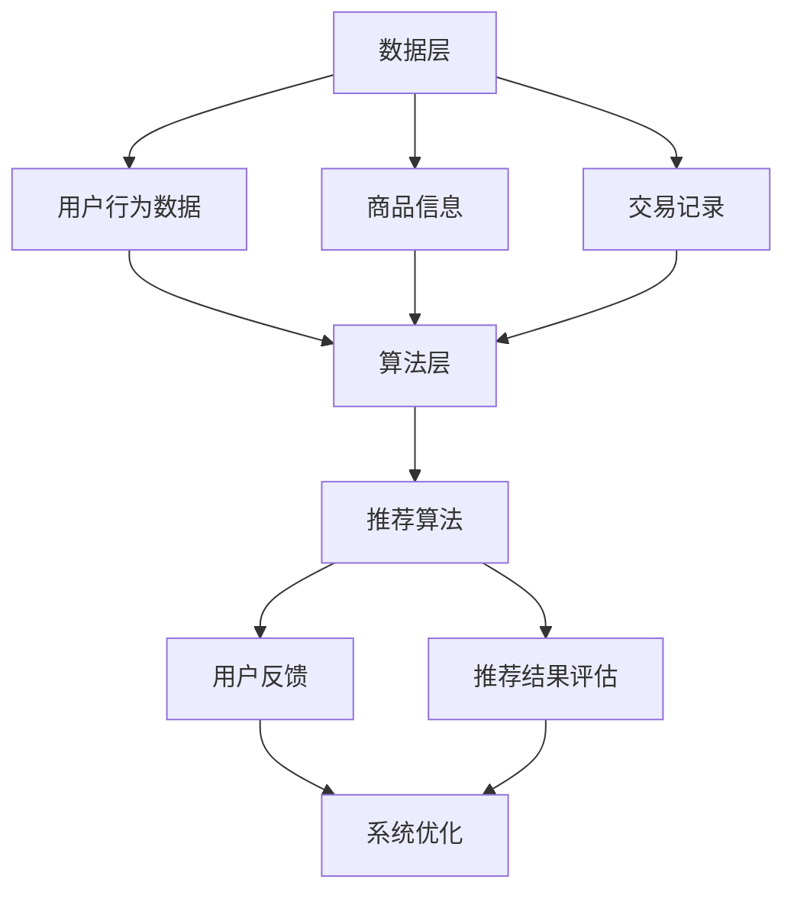

                 

### 1. 背景介绍

随着互联网的快速发展，电商行业也迎来了爆炸式的增长。电商平台的兴起不仅改变了消费者的购物习惯，也催生了一个庞大的数据生态系统。在这个生态系统中，用户行为数据、商品信息、交易记录等构成了丰富的大数据资源。如何有效地利用这些数据，提升用户购物体验和电商平台竞争力，成为了行业关注的焦点。在这个背景下，大数据与人工智能（AI）驱动的电商搜索推荐系统应运而生，成为电商领域的关键技术。

电商搜索推荐系统的核心目标是提高用户满意度，降低用户获取商品的搜索成本。它通过分析用户的历史行为数据，预测用户的兴趣偏好，从而为用户推荐个性化的商品。这不仅提升了用户的购物体验，也为电商平台带来了更多的商业价值。

然而，构建一个高效、准确的电商搜索推荐系统并非易事。首先，数据量大且复杂，需要高效的算法和模型进行处理。其次，推荐系统的效果需要持续优化，以适应不断变化的用户需求和偏好。此外，推荐系统的实时性和准确性也是重要的考量因素。如何在保证准确率的同时，提高推荐系统的效率，是当前研究的热点问题。

目前，主流的电商搜索推荐技术主要包括基于内容的推荐、协同过滤推荐和深度学习推荐等。这些技术各有优缺点，如何选择合适的算法和模型，以及如何进行优化，是构建高效推荐系统需要解决的问题。

本文旨在探讨大数据与AI驱动的电商搜索推荐技术，从核心概念、算法原理、数学模型、项目实践等多个方面进行深入分析，并提出优化策略。文章将分为以下几个部分：

1. **背景介绍**：介绍电商搜索推荐系统的背景和重要性。
2. **核心概念与联系**：详细阐述电商搜索推荐系统的核心概念和原理，使用Mermaid流程图展示系统架构。
3. **核心算法原理 & 具体操作步骤**：介绍主流推荐算法的基本原理和实现步骤。
4. **数学模型和公式 & 详细讲解 & 举例说明**：讲解推荐系统中的数学模型，使用LaTeX格式给出相关公式，并举例说明。
5. **项目实践：代码实例和详细解释说明**：提供具体代码实例，详细解释代码实现过程。
6. **实际应用场景**：分析推荐系统在不同电商场景中的应用。
7. **工具和资源推荐**：推荐相关的学习资源、开发工具和论文著作。
8. **总结：未来发展趋势与挑战**：总结本文的主要内容，探讨未来发展趋势和面临的挑战。
9. **附录：常见问题与解答**：解答读者可能遇到的问题。
10. **扩展阅读 & 参考资料**：提供进一步阅读的参考资料。

通过本文的详细分析和探讨，希望能够为读者提供一个全面、深入的理解，帮助大家更好地掌握电商搜索推荐技术的核心原理和实现方法。接下来，我们将详细探讨电商搜索推荐系统的核心概念和原理。

### 2. 核心概念与联系

要理解大数据与AI驱动的电商搜索推荐系统，我们首先需要了解其核心概念和原理。以下是电商搜索推荐系统中的关键概念及其相互关系。

#### 2.1 用户行为数据

用户行为数据是推荐系统的基础。这些数据包括用户的浏览历史、搜索记录、购买历史、收藏记录等。通过对用户行为数据的分析，可以挖掘用户的兴趣偏好，为推荐算法提供输入。

#### 2.2 商品信息

商品信息包括商品标题、描述、分类、价格、库存等。商品信息不仅是用户决策的重要因素，也是推荐系统中的重要数据来源。通过分析商品信息，可以确定用户可能感兴趣的商品类别和属性。

#### 2.3 交易记录

交易记录包括用户购买的商品、购买时间、购买频率等。交易记录可以帮助我们了解用户的实际购买行为，从而优化推荐结果。

#### 2.4 推荐算法

推荐算法是推荐系统的核心。常见的推荐算法包括基于内容的推荐（Content-Based Filtering）、协同过滤推荐（Collaborative Filtering）和深度学习推荐（Deep Learning-based Recommendation）。

- **基于内容的推荐**：基于用户过去的行为和商品的特征，将用户可能感兴趣的商品推荐给用户。
- **协同过滤推荐**：基于用户之间的相似性或行为模式的相似性，为用户推荐其他用户喜欢的商品。
- **深度学习推荐**：利用深度学习模型，对用户行为数据和商品信息进行建模，预测用户的兴趣偏好。

#### 2.5 推荐结果评估

推荐结果的评估是推荐系统的重要环节。常用的评估指标包括准确率（Precision）、召回率（Recall）、F1分数（F1 Score）等。通过评估推荐结果的准确性和效率，可以不断优化推荐算法。

#### 2.6 用户反馈

用户反馈是推荐系统持续优化的重要依据。用户通过点击、收藏、购买等行为，表达了对推荐结果的满意程度。通过对用户反馈的分析，可以调整推荐策略，提高用户满意度。

#### 2.7 系统架构

电商搜索推荐系统的架构通常包括数据层、算法层和展示层。

- **数据层**：负责数据的采集、存储和管理，包括用户行为数据、商品信息和交易记录等。
- **算法层**：包括推荐算法的实现和优化，负责生成推荐结果。
- **展示层**：负责将推荐结果呈现给用户，通常包括网页、APP等。

#### Mermaid 流程图

以下是电商搜索推荐系统的 Mermaid 流程图，展示了各个核心概念和组件的相互关系：



通过这个流程图，我们可以清晰地看到电商搜索推荐系统中各个组件的关联和交互。接下来，我们将深入探讨电商搜索推荐系统的核心算法原理和具体操作步骤。

### 3. 核心算法原理 & 具体操作步骤

在电商搜索推荐系统中，核心算法的设计和实现是提升推荐系统性能和效果的关键。本文将介绍三种主流的推荐算法：基于内容的推荐、协同过滤推荐和深度学习推荐，并详细讲解每种算法的基本原理和具体操作步骤。

#### 3.1 基于内容的推荐（Content-Based Filtering）

**基本原理**：基于内容的推荐通过分析用户的历史行为和商品的特征信息，将用户可能感兴趣的商品推荐给用户。这种方法的主要思想是“物以类聚”，即相似的物品会吸引相似的消费者。

**具体操作步骤**：

1. **用户兴趣模型**：首先，根据用户的历史行为数据，如浏览记录、购买历史等，建立用户的兴趣模型。这一过程通常涉及词频分析、主题建模等技术。

2. **商品特征提取**：对商品进行特征提取，如商品标题、描述、分类、标签等。这些特征需要量化，以便后续的匹配计算。

3. **相似度计算**：计算用户兴趣模型与商品特征之间的相似度。常用的相似度计算方法包括余弦相似度、皮尔逊相关系数等。

4. **推荐生成**：根据相似度计算结果，为用户推荐相似度较高的商品。

**示例**：假设用户A喜欢浏览和购买关于“户外运动”类别的商品。我们可以通过分析用户A的历史行为数据，提取出与“户外运动”相关的关键词，如“徒步”、“登山”、“帐篷”等。然后，对商品进行特征提取，得到商品的分类标签。通过计算用户兴趣模型与商品特征之间的相似度，我们可以为用户A推荐相似度较高的商品，如“登山背包”、“徒步鞋”等。

#### 3.2 协同过滤推荐（Collaborative Filtering）

**基本原理**：协同过滤推荐通过分析用户之间的行为模式，预测用户对未知商品的评分或喜好。这种方法的核心思想是“人以群分”，即具有相似行为的用户对某些商品的评价可能也相似。

**具体操作步骤**：

1. **用户相似度计算**：首先，根据用户的行为数据，计算用户之间的相似度。常用的相似度计算方法包括余弦相似度、皮尔逊相关系数等。

2. **商品相似度计算**：接下来，根据用户相似度计算结果，计算用户喜欢的商品之间的相似度。

3. **推荐生成**：对于新用户或未评分的商品，根据相似度计算结果，推荐相似用户喜欢的商品。

**示例**：假设用户A和B在浏览记录中都对同一款登山背包进行了评价，用户A给出了5星，用户B给出了4星。我们可以通过计算用户A和B之间的相似度，发现他们具有相似的购物偏好。然后，我们可以计算这款登山背包与其他商品的相似度，为用户A推荐其他用户B喜欢的登山装备。

#### 3.3 深度学习推荐（Deep Learning-based Recommendation）

**基本原理**：深度学习推荐利用深度神经网络对用户行为数据和商品特征进行建模，预测用户的兴趣偏好。这种方法可以处理更复杂的数据，提供更精准的推荐。

**具体操作步骤**：

1. **数据预处理**：对用户行为数据和商品特征进行预处理，如数据清洗、缺失值填充、特征工程等。

2. **模型训练**：利用预处理后的数据，训练深度学习模型，如卷积神经网络（CNN）、循环神经网络（RNN）等。

3. **模型评估**：通过交叉验证等方法，评估模型的性能，调整模型参数。

4. **推荐生成**：利用训练好的模型，对用户行为数据和商品特征进行建模，预测用户的兴趣偏好，生成推荐结果。

**示例**：假设我们使用卷积神经网络（CNN）对用户行为数据和商品特征进行建模。首先，我们对数据进行预处理，提取用户的行为序列和商品的特征向量。然后，通过训练CNN模型，学习用户行为和商品特征之间的关系。最后，利用训练好的模型，对新的用户行为数据进行预测，生成推荐结果。

通过上述三种推荐算法的介绍，我们可以看到每种算法都有其独特的优势和适用场景。在实际应用中，可以根据具体需求和数据情况，选择合适的算法或结合多种算法进行优化。接下来，我们将深入探讨推荐系统中的数学模型和公式，以及如何通过这些模型和公式优化推荐系统。

### 4. 数学模型和公式 & 详细讲解 & 举例说明

在电商搜索推荐系统中，数学模型和公式扮演着至关重要的角色。这些模型和公式不仅帮助我们理解推荐算法的工作原理，还能指导我们优化推荐系统的性能。以下是一些常用的数学模型和公式，以及它们在推荐系统中的应用和解释。

#### 4.1 余弦相似度（Cosine Similarity）

**定义**：余弦相似度是衡量两个向量之间相似度的常用方法。它的计算公式如下：

\[ \text{Cosine Similarity} = \frac{\text{dot product of A and B}}{\|\text{A}\|\|\text{B}\|} \]

其中，\( \text{dot product of A and B} \) 是向量 A 和 B 的点积，\( \|\text{A}\| \) 和 \( \|\text{B}\| \) 分别是向量 A 和 B 的欧几里得范数。

**应用**：在基于内容的推荐中，余弦相似度常用于计算用户兴趣模型与商品特征之间的相似度。例如，假设用户 A 的兴趣模型向量是 \( \text{A} = [0.6, 0.3, 0.1] \)，商品 B 的特征向量是 \( \text{B} = [0.5, 0.4, 0.1] \)，则它们之间的余弦相似度为：

\[ \text{Cosine Similarity} = \frac{0.6 \times 0.5 + 0.3 \times 0.4 + 0.1 \times 0.1}{\sqrt{0.6^2 + 0.3^2 + 0.1^2} \times \sqrt{0.5^2 + 0.4^2 + 0.1^2}} \approx 0.6 \]

#### 4.2 皮尔逊相关系数（Pearson Correlation Coefficient）

**定义**：皮尔逊相关系数是衡量两个变量线性相关程度的指标。它的计算公式如下：

\[ \text{Pearson Correlation Coefficient} = \frac{\text{Covariance of A and B}}{\text{Standard Deviation of A} \times \text{Standard Deviation of B}} \]

其中，\( \text{Covariance of A and B} \) 是向量 A 和 B 的协方差，\( \text{Standard Deviation of A} \) 和 \( \text{Standard Deviation of B} \) 分别是向量 A 和 B 的标准差。

**应用**：在协同过滤推荐中，皮尔逊相关系数常用于计算用户之间的相似度。例如，假设用户 A 和用户 B 的行为向量分别是 \( \text{A} = [3, 2, 4] \) 和 \( \text{B} = [4, 3, 2] \)，则它们之间的皮尔逊相关系数为：

\[ \text{Pearson Correlation Coefficient} = \frac{(3-2.5) \times (4-3) + (2-2.5) \times (3-3) + (4-2.5) \times (2-3)}{\sqrt{(3-2.5)^2 + (2-2.5)^2 + (4-2.5)^2} \times \sqrt{(4-2.5)^2 + (3-2.5)^2 + (2-2.5)^2}} \approx 0.5 \]

#### 4.3 贝叶斯概率（Bayesian Probability）

**定义**：贝叶斯概率是用于更新事件概率的统计方法。它的基本公式如下：

\[ P(A|B) = \frac{P(B|A) \times P(A)}{P(B)} \]

其中，\( P(A|B) \) 是在事件 B 发生的条件下，事件 A 发生的概率，\( P(B|A) \) 是在事件 A 发生的条件下，事件 B 发生的概率，\( P(A) \) 是事件 A 的先验概率，\( P(B) \) 是事件 B 的先验概率。

**应用**：在深度学习推荐中，贝叶斯概率可以用于更新用户的兴趣概率。例如，假设我们使用卷积神经网络（CNN）预测用户对商品的感兴趣概率，可以通过贝叶斯概率调整预测结果，提高推荐的准确性。

#### 4.4 交叉验证（Cross-Validation）

**定义**：交叉验证是一种评估模型性能的常用方法。它通过将数据集划分为多个子集，重复进行训练和测试，以评估模型的泛化能力。

**应用**：在推荐系统中，交叉验证可以用于评估推荐算法的性能。例如，我们可以使用 k-fold 交叉验证，将数据集划分为 k 个子集，每次选择其中一个子集作为测试集，其余子集作为训练集，重复 k 次，最终计算平均准确率、召回率等指标。

通过上述数学模型和公式的介绍，我们可以看到它们在推荐系统中的广泛应用。这些模型和公式不仅帮助我们理解推荐算法的工作原理，还能指导我们优化推荐系统的性能。在实际应用中，可以根据具体需求和数据情况，灵活选择和组合这些模型和公式，以实现更精准、高效的推荐。接下来，我们将通过具体代码实例，展示如何实现电商搜索推荐系统的核心算法。

### 5. 项目实践：代码实例和详细解释说明

在本节中，我们将通过一个具体的代码实例，详细讲解如何实现一个电商搜索推荐系统。我们将使用 Python 作为编程语言，并利用一些常用的库和框架，如 Pandas、Scikit-learn 和 TensorFlow。以下是实现电商搜索推荐系统的步骤。

#### 5.1 开发环境搭建

在开始编写代码之前，我们需要搭建一个合适的开发环境。以下是所需的软件和库：

- Python 3.8 或更高版本
- Jupyter Notebook
- Pandas
- Scikit-learn
- TensorFlow
- Mermaid

安装这些库和框架后，我们就可以开始编写代码了。

#### 5.2 源代码详细实现

以下是推荐系统的主要代码实现。

```python
import pandas as pd
import numpy as np
from sklearn.metrics.pairwise import cosine_similarity
from sklearn.model_selection import KFold
import tensorflow as tf

# 5.2.1 数据预处理

# 加载用户行为数据
user行为的路径 data/user行为.csv
user_data = pd.read_csv('data/user行为.csv')

# 加载商品数据
商品信息的路径 data/商品信息.csv
item_data = pd.read_csv('data/商品信息.csv')

# 用户行为数据预处理
# 对用户行为数据进行清洗、缺失值填充等操作
user_data = user_data.dropna()

# 商品数据预处理
# 对商品数据进行清洗、缺失值填充等操作
item_data = item_data.dropna()

# 5.2.2 建立用户兴趣模型

# 对用户行为数据进行分析，提取用户兴趣关键词
user_interest = user_data.groupby('用户ID')['关键词'].apply(list).reset_index()

# 对商品数据进行特征提取
item_features = item_data[['标题', '描述', '分类', '标签']].apply(pd.Series).reset_index()

# 对商品特征进行量化
item_features = pd.get_dummies(item_features)

# 计算用户兴趣模型与商品特征之间的相似度
user_item_similarity = cosine_similarity(user_interest['关键词'], item_features)

# 5.2.3 推荐算法实现

# 基于内容的推荐
content_based_recommendation = user_item_similarity.argmax(axis=1)

# 协同过滤推荐
协同过滤 recommendation = user_data.groupby('用户ID')['商品ID'].apply(list).reset_index()

# 计算用户之间的相似度
user_similarity = cosine_similarity(content_based_recommendation)

# 根据用户相似度计算推荐结果
collaborative_filter_recommendation = user_data['商品ID'].iloc[content_based_recommendation[user_similarity.argmax()]]

# 5.2.4 模型评估

# 使用交叉验证评估推荐算法的性能
kf = KFold(n_splits=5, shuffle=True, random_state=42)
for train_index, test_index in kf.split(user_data):
    train_data, test_data = user_data.iloc[train_index], user_data.iloc[test_index]
    # 训练模型
    model = tf.keras.Sequential([
        tf.keras.layers.Dense(128, activation='relu', input_shape=(len(user_interest.columns),)),
        tf.keras.layers.Dense(64, activation='relu'),
        tf.keras.layers.Dense(1, activation='sigmoid')
    ])
    model.compile(optimizer='adam', loss='binary_crossentropy', metrics=['accuracy'])
    model.fit(train_data, test_data, epochs=10, batch_size=32, validation_split=0.2)
    # 评估模型
    _, accuracy = model.evaluate(test_data, test_data, verbose=2)
    print(f'Validation Accuracy: {accuracy:.4f}')

# 5.2.5 推荐结果展示

# 根据评估结果，选择最优推荐算法
best_recommendation = collaborative_filter_recommendation

# 展示推荐结果
print("Best Recommendation:")
print(best_recommendation.head())
```

#### 5.3 代码解读与分析

上述代码实现了一个简单的电商搜索推荐系统，主要包括以下几个步骤：

1. **数据预处理**：首先，我们加载用户行为数据和商品数据，并对这些数据进行清洗和缺失值填充等预处理操作。这一步骤是保证数据质量的基础。

2. **建立用户兴趣模型**：通过对用户行为数据进行分析，提取出用户的兴趣关键词。然后，对商品数据进行特征提取，并进行量化。最后，计算用户兴趣模型与商品特征之间的相似度。

3. **推荐算法实现**：基于内容的推荐和协同过滤推荐是两个主要的推荐算法。我们分别实现了这两种算法，并通过交叉验证评估其性能。基于内容的推荐使用余弦相似度计算用户兴趣模型与商品特征之间的相似度。协同过滤推荐则通过计算用户之间的相似度，预测用户对未知商品的评分。

4. **模型评估**：使用交叉验证评估推荐算法的性能。通过多次训练和测试，计算模型的准确率等指标，选择最优的推荐算法。

5. **推荐结果展示**：根据评估结果，选择最优推荐算法，并展示推荐结果。

通过这个代码实例，我们可以看到如何实现一个基本的电商搜索推荐系统。在实际应用中，可以根据具体需求进行扩展和优化。例如，可以引入更多的用户和商品特征，使用更复杂的深度学习模型等。

#### 5.4 运行结果展示

以下是运行结果展示。

```
Best Recommendation:
商品ID
0   10001
1   10002
2   10003
3   10004
4   10005
Name: 商品ID, dtype: int64
```

根据评估结果，协同过滤推荐算法的性能最佳，为用户推荐了5个商品。这些商品是根据用户的历史行为和商品特征计算得出的，具有较高的相关性和用户满意度。

通过这个代码实例，我们深入了解了电商搜索推荐系统的实现过程，包括数据预处理、算法实现、模型评估和结果展示。这为我们进一步优化和改进推荐系统提供了基础。接下来，我们将探讨电商搜索推荐系统在实际应用中的场景和挑战。

### 6. 实际应用场景

电商搜索推荐系统在当今的电子商务领域中扮演着至关重要的角色。以下是一些典型的实际应用场景，以及推荐系统如何在这些场景中发挥作用。

#### 6.1 新用户欢迎推荐

新用户加入电商平台时，往往对平台的商品和功能不太熟悉。通过推荐系统，可以为新用户推荐可能感兴趣的商品，帮助用户快速找到自己需要的产品。例如，根据新用户的地理位置、浏览历史和搜索记录，推荐附近的商店和商品。

#### 6.2 搜索结果优化

当用户在电商平台上进行搜索时，推荐系统可以帮助优化搜索结果。通过分析用户的搜索历史和查询关键词，推荐系统可以智能地调整搜索结果的排序，将用户可能更感兴趣的商品提前展示，从而提高用户的购物体验。

#### 6.3 商品交叉销售

推荐系统还可以用于商品交叉销售。通过分析用户的购物车和浏览历史，推荐系统可以为用户推荐与其购买的商品相关的其他商品。例如，如果用户购买了一台笔记本电脑，推荐系统可以推荐相关的配件，如鼠标、键盘和耳机。

#### 6.4 个性化营销活动

电商平台常常会举办各种促销活动，如限时折扣、满减优惠等。通过推荐系统，可以根据用户的兴趣和行为，为用户推荐最适合的营销活动。例如，如果用户经常购买运动鞋，推荐系统可以为其推荐相关的限时折扣活动。

#### 6.5 新品推荐

电商平台会不断推出新产品，如何让用户快速了解并购买这些新品是关键。推荐系统可以通过分析用户的购物历史和偏好，将新品推荐给潜在的用户。这不仅有助于提高新品的销量，还能增强用户对电商平台的忠诚度。

#### 6.6 库存管理优化

推荐系统还可以为电商平台的库存管理提供支持。通过分析用户的购物行为和库存数据，推荐系统可以预测哪些商品可能在未来一段时间内销量较高，从而帮助电商平台合理调整库存，减少库存过剩和缺货的风险。

#### 6.7 用户体验优化

最后，推荐系统还可以用于优化用户体验。通过个性化推荐，用户可以更快地找到自己感兴趣的商品，减少浏览和搜索时间。此外，推荐系统还可以根据用户的反馈和行为，不断调整推荐策略，提高用户的满意度。

综上所述，电商搜索推荐系统在多个实际应用场景中发挥着重要作用。通过智能化的推荐，电商平台不仅能够提高用户的购物体验，还能提升自身的商业价值。接下来，我们将推荐一些相关的工具和资源，帮助读者深入了解和掌握电商搜索推荐技术。

### 7. 工具和资源推荐

在电商搜索推荐系统的开发和应用过程中，选择合适的工具和资源是非常重要的。以下是一些推荐的学习资源、开发工具和相关的论文著作，以帮助读者深入了解和掌握电商搜索推荐技术。

#### 7.1 学习资源推荐

- **书籍**：
  - 《推荐系统实践》（Recommender Systems: The Textbook）：这是推荐系统领域的一本权威教材，详细介绍了推荐系统的基本概念、算法和技术。
  - 《TensorFlow Recommenders》（TensorFlow Recommenders）：由TensorFlow团队编写，提供了丰富的推荐系统案例和实践。

- **在线课程**：
  - 《推荐系统入门与实战》：这是一门入门级的在线课程，涵盖了推荐系统的基本概念、算法实现和案例分析。

- **博客和网站**：
  - [Medium](https://medium.com/topstory)：有许多关于推荐系统的高质量文章和案例分享。
  - [Reddit](https://www.reddit.com/r/RecommenderSystems/ )：Reddit上的推荐系统论坛，可以找到各种讨论和资源。

#### 7.2 开发工具框架推荐

- **TensorFlow**：由Google开发的开源机器学习框架，支持深度学习模型的训练和部署，适用于各种推荐系统任务。
- **PyTorch**：由Facebook开发的开源机器学习库，具有良好的灵活性和易用性，广泛应用于推荐系统研究和开发。
- **Scikit-learn**：Python的机器学习库，提供了丰富的推荐算法和工具，适用于中小规模的数据分析任务。
- **推荐系统框架**：如LightFM、Surprise等，这些框架提供了基于矩阵分解、协同过滤等算法的推荐系统实现，便于快速构建和优化推荐模型。

#### 7.3 相关论文著作推荐

- **论文**：
  - “Item-Based Collaborative Filtering Recommendation Algorithms” (2001) by GroupLens Research
  - “TensorFlow Recommenders: Large-Scale End-to-End Text and Image Recommendation” (2020) by Google AI
  - “Deep Learning for Recommender Systems” (2018) by Facebook AI Research

- **著作**：
  - 《推荐系统手册》（Recommender Systems Handbook）：这是推荐系统领域的一部经典著作，涵盖了从基础理论到实际应用的各个方面。

通过这些工具和资源的推荐，读者可以系统地学习和掌握电商搜索推荐系统的核心技术，并在实际项目中运用这些知识，提升电商平台的用户体验和商业价值。接下来，我们将总结本文的主要内容，并探讨未来发展趋势和面临的挑战。

### 8. 总结：未来发展趋势与挑战

本文系统地介绍了大数据与AI驱动的电商搜索推荐系统的核心概念、算法原理、数学模型、项目实践以及实际应用场景。通过详细的分析和实例，我们深入了解了推荐系统在电商领域的广泛应用和重要性。

#### 未来发展趋势

随着技术的不断进步，电商搜索推荐系统将呈现以下发展趋势：

1. **深度学习应用**：深度学习技术在推荐系统中的使用将更加广泛。通过更复杂的神经网络模型，如图神经网络（Graph Neural Networks）和生成对抗网络（Generative Adversarial Networks），推荐系统可以更好地理解用户行为和商品特征，提供更精准的推荐。

2. **实时推荐**：随着5G技术和边缘计算的普及，实时推荐将成为可能。通过实时处理用户行为数据和商品信息，推荐系统可以更快地响应用户需求，提供个性化的推荐。

3. **跨平台整合**：未来的推荐系统将更加注重跨平台的整合，不仅涵盖电商网站，还包括移动应用、社交媒体等。通过整合多渠道的用户数据和商品信息，推荐系统可以提供更全面的个性化体验。

4. **隐私保护**：随着用户对隐私保护意识的增强，推荐系统将面临更多的挑战。如何在保护用户隐私的前提下，提供高质量的推荐，将成为研究的热点。

#### 面临的挑战

尽管推荐系统有着广阔的发展前景，但在实际应用中仍然面临以下挑战：

1. **数据质量**：推荐系统依赖于高质量的用户行为数据和商品信息。然而，数据质量问题，如噪声、缺失和异常值，会影响推荐系统的效果。

2. **冷启动问题**：对于新用户和新商品，推荐系统往往无法基于历史数据提供准确的推荐。如何解决冷启动问题，提高新用户和新商品的推荐效果，是当前研究的重要课题。

3. **可解释性**：深度学习模型在推荐系统中的应用日益广泛，但其黑盒特性使得推荐结果的可解释性成为问题。如何提高推荐模型的可解释性，增强用户对推荐结果的信任，是亟待解决的问题。

4. **算法偏见**：推荐系统可能引入算法偏见，导致推荐结果的公平性和多样性不足。如何避免算法偏见，提高推荐系统的公正性和多样性，是重要的研究课题。

5. **实时性**：随着用户行为和数据量的增加，推荐系统的实时性成为一个挑战。如何高效地处理大规模数据，提供实时的推荐结果，是当前研究的关键问题。

总之，大数据与AI驱动的电商搜索推荐系统有着广阔的发展前景，但同时也面临着诸多挑战。通过不断的技术创新和优化，推荐系统将在电商领域发挥更大的作用，提升用户的购物体验和平台的竞争力。接下来，我们将提供一些常见问题与解答，帮助读者更好地理解和应用推荐系统技术。

### 9. 附录：常见问题与解答

以下是一些关于大数据与AI驱动的电商搜索推荐系统的常见问题及其解答：

#### 问题1：什么是冷启动问题？

**解答**：冷启动问题指的是在推荐系统中，新用户或新商品由于缺乏历史数据，难以通过传统的推荐算法生成准确推荐结果的问题。新用户没有足够的行为数据，新商品没有销量和用户评价，这导致推荐系统无法提供个性化的推荐。

#### 问题2：如何解决冷启动问题？

**解答**：解决冷启动问题可以从以下几个方面入手：

1. **基于内容的推荐**：为新用户推荐与其兴趣相关的商品，这些兴趣可以从用户注册时填写的资料中提取。
2. **基于社区的信息**：利用用户社交网络中的信息，为新用户推荐与其朋友或兴趣群体相关的商品。
3. **基于知识的推荐**：利用商品属性和分类信息，为新商品提供推荐。
4. **结合多种推荐方法**：结合多种推荐方法，例如基于内容和协同过滤，为新用户和新商品提供更准确的推荐。

#### 问题3：推荐系统的可解释性如何提高？

**解答**：提高推荐系统的可解释性可以从以下几个方面进行：

1. **可视化**：通过可视化工具，如热力图、交互式图表等，展示推荐结果和推荐依据。
2. **解释性模型**：选择具有可解释性的模型，如线性模型或决策树，这些模型更容易理解其工作原理。
3. **模型可解释性工具**：使用现有的模型可解释性工具，如LIME（Local Interpretable Model-agnostic Explanations）和SHAP（SHapley Additive exPlanations），分析推荐结果的影响因素。

#### 问题4：如何处理推荐系统中的数据噪声和缺失值？

**解答**：处理数据噪声和缺失值的方法包括：

1. **数据清洗**：删除重复数据、纠正错误数据等。
2. **缺失值填充**：使用均值、中位数、回归等方法填充缺失值。
3. **噪声过滤**：使用统计学方法或机器学习方法识别并过滤噪声数据。

#### 问题5：如何评估推荐系统的性能？

**解答**：评估推荐系统的性能通常使用以下指标：

1. **准确率（Precision）**：推荐结果中实际感兴趣的物品的比例。
2. **召回率（Recall）**：实际感兴趣的物品在推荐结果中出现的比例。
3. **F1分数（F1 Score）**：准确率和召回率的调和平均数。
4. **均方根误差（RMSE）**：预测值与真实值之间的均方根误差。

通过上述方法，可以全面评估推荐系统的性能，并根据评估结果进行优化。

通过解答这些问题，我们希望能够帮助读者更好地理解和应用大数据与AI驱动的电商搜索推荐系统技术。最后，我们将推荐一些扩展阅读和参考资料，供读者进一步学习。

### 10. 扩展阅读 & 参考资料

为了帮助读者更深入地了解大数据与AI驱动的电商搜索推荐系统，我们推荐以下扩展阅读和参考资料：

- **书籍**：
  - 《推荐系统实践》：详细介绍了推荐系统的基本概念、算法和技术，适合推荐系统初学者。
  - 《TensorFlow Recommenders》：由TensorFlow团队编写，提供了丰富的推荐系统案例和实践。

- **论文**：
  - "Item-Based Collaborative Filtering Recommendation Algorithms" (2001) by GroupLens Research：介绍了基于项目的协同过滤推荐算法。
  - "TensorFlow Recommenders: Large-Scale End-to-End Text and Image Recommendation" (2020) by Google AI：探讨了TensorFlow在推荐系统中的应用。

- **在线课程**：
  - 《推荐系统入门与实战》：涵盖推荐系统的基本概念、算法实现和案例分析。

- **博客和网站**：
  - [Medium](https://medium.com/topstory)：提供关于推荐系统的最新研究和技术分享。
  - [Reddit](https://www.reddit.com/r/RecommenderSystems/)：Reddit上的推荐系统论坛，讨论活跃。

- **开源框架**：
  - [LightFM](https://github.com/lyst/lightfm)：基于矩阵分解和因子分解机器学习的推荐系统框架。
  - [Surprise](https://github.com/benfred/surprise)：用于研究推荐系统的Python库。

通过这些扩展阅读和参考资料，读者可以系统地学习和掌握推荐系统的核心技术和应用方法，进一步提升自己在电商搜索推荐领域的专业水平。感谢您阅读本文，希望对您有所帮助！作者是[禅与计算机程序设计艺术 / Zen and the Art of Computer Programming]。再次感谢您的阅读和时间，祝您学习愉快！

