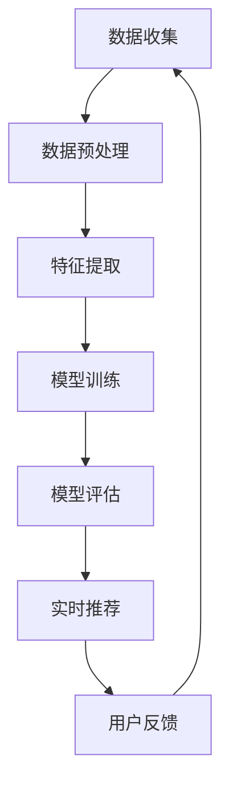

                 

### 1. 背景介绍

在当今数字化时代，电商行业已经成为全球经济的重要组成部分。随着互联网技术的不断发展和消费者需求的日益多样化，电商平台的竞争也日趋激烈。为了在激烈的市场竞争中脱颖而出，电商平台需要不断提升用户体验，实现精准的搜索推荐功能。

搜索推荐作为电商平台的核心功能之一，旨在为用户提供与其兴趣和需求高度相关的商品信息，从而提升用户满意度和平台销售额。然而，实现这一目标并非易事，因为电商搜索推荐面临着数据量大、信息冗余、实时性要求高等挑战。

大数据和人工智能技术的引入为电商搜索推荐带来了新的契机。大数据技术能够处理海量用户行为数据，从中挖掘出有价值的信息，为推荐算法提供支持。而人工智能技术，尤其是机器学习和深度学习算法，则能够通过分析用户行为和商品特征，实现高效的搜索推荐。

本篇文章将围绕大数据与AI驱动的电商搜索推荐展开，重点探讨其优化策略，以准确率和效率为核心，深入分析相关技术原理、算法模型、项目实践以及未来发展趋势。

### 2. 核心概念与联系

#### 2.1 大数据技术

大数据（Big Data）是指数据规模、数据类型和数据速度呈现爆炸式增长的一种现象。在电商领域，大数据技术的核心作用在于处理和分析海量用户数据，包括用户行为、浏览历史、购买记录等。通过数据挖掘技术，可以从这些数据中提取出有价值的信息，用于个性化推荐、风险控制、市场预测等业务场景。

#### 2.2 人工智能技术

人工智能（Artificial Intelligence，AI）是指通过计算机模拟人类智能，实现感知、学习、推理和决策等功能的技术。在电商搜索推荐领域，人工智能技术主要用于构建推荐算法，通过分析用户行为和商品特征，为用户提供个性化推荐。

#### 2.3 搜索推荐算法

搜索推荐算法是电商搜索推荐的核心技术。常见的搜索推荐算法包括基于内容的推荐、协同过滤推荐和基于模型的推荐等。这些算法各有优缺点，适用于不同的应用场景。

- **基于内容的推荐**：根据用户的历史行为和商品的特征，计算用户与商品之间的相似度，推荐与之相似的物品。
- **协同过滤推荐**：通过分析用户之间的相似性，发现用户共同喜欢的商品，从而为用户提供个性化推荐。
- **基于模型的推荐**：使用机器学习算法，从用户行为数据和商品特征中学习用户偏好和商品属性，生成推荐列表。

#### 2.4 大数据与AI在搜索推荐中的应用

大数据和人工智能技术在电商搜索推荐中的应用主要体现在以下几个方面：

1. **数据预处理**：通过大数据技术清洗、转换和集成原始数据，为推荐算法提供高质量的数据输入。
2. **特征工程**：利用人工智能技术提取用户和商品的特征，构建推荐模型所需的特征向量。
3. **模型训练与优化**：使用机器学习算法训练推荐模型，并通过交叉验证和超参数调整优化模型性能。
4. **实时推荐**：利用分布式计算和实时数据处理技术，实现快速、高效的搜索推荐。

#### 2.5 Mermaid 流程图

为了更直观地展示大数据与AI在电商搜索推荐中的应用流程，我们可以使用Mermaid绘制以下流程图：



在上面的流程图中，数据收集是整个过程的起点，通过不断收集用户行为数据和商品信息，构建起一个动态的推荐系统。数据预处理、特征提取、模型训练、模型评估和实时推荐构成了推荐系统的核心环节，用户反馈则作为系统持续优化的依据。

通过上述核心概念的介绍，我们可以看到大数据与AI技术在电商搜索推荐中发挥着至关重要的作用。接下来，我们将深入探讨这些技术的具体原理和应用。

---

### 2.1 大数据技术

大数据技术的核心在于处理海量数据，从数据中提取有价值的信息。在电商搜索推荐中，大数据技术主要用于以下几个方面：

#### 2.1.1 数据收集

数据收集是大数据应用的第一步，也是最为关键的一步。在电商领域，数据收集主要包括用户行为数据、商品信息数据和交易数据等。用户行为数据包括用户的浏览历史、点击记录、搜索记录和购买记录等；商品信息数据包括商品名称、价格、描述、分类和标签等；交易数据则记录了用户的购买行为，如购买时间、购买金额、购买频率等。

#### 2.1.2 数据预处理

收集到的数据往往是不完整的、不一致的或噪声数据。因此，数据预处理是大数据技术中不可或缺的一环。数据预处理的主要任务包括数据清洗、数据转换和数据集成。

- **数据清洗**：数据清洗是指识别和纠正数据中的错误、缺失值和重复值等。通过数据清洗，可以确保数据的质量和一致性。
- **数据转换**：数据转换是指将数据从一种格式转换为另一种格式，以满足后续处理和分析的需求。常见的转换方式包括数据类型转换、数据规范化、数据编码等。
- **数据集成**：数据集成是指将来自不同来源的数据整合到一个统一的数据集中。数据集成的主要目的是消除数据冗余，提高数据利用效率。

#### 2.1.3 数据存储与管理

随着数据量的不断增大，如何高效地存储和管理数据成为大数据技术面临的重要挑战。常见的数据存储与管理技术包括关系数据库、NoSQL数据库、分布式文件系统等。

- **关系数据库**：关系数据库具有结构化、易于查询和管理等优点，适用于存储和查询结构化数据。常见的数据库管理系统（DBMS）包括MySQL、PostgreSQL等。
- **NoSQL数据库**：NoSQL数据库具有高扩展性、高性能和灵活的数据模型等优点，适用于存储和处理非结构化或半结构化数据。常见的NoSQL数据库包括MongoDB、Cassandra、HBase等。
- **分布式文件系统**：分布式文件系统具有高可用性、高扩展性和高性能等优点，适用于存储海量数据。常见的分布式文件系统包括Hadoop HDFS、Ceph等。

#### 2.1.4 数据挖掘与分析

数据挖掘是大数据技术的核心应用之一，旨在从海量数据中发现有价值的信息和知识。在电商搜索推荐中，数据挖掘主要用于以下两个方面：

- **用户行为分析**：通过分析用户的行为数据，挖掘用户的兴趣偏好、行为模式等，为个性化推荐提供支持。
- **商品属性分析**：通过分析商品的属性数据，挖掘商品的特征、分类和关联关系等，为商品推荐提供支持。

#### 2.1.5 数据可视化

数据可视化是将数据以图形、图像或图表的形式呈现，使数据更易于理解和分析。在电商搜索推荐中，数据可视化主要用于以下几个方面：

- **用户行为可视化**：通过可视化用户行为数据，可以直观地了解用户的行为模式、兴趣偏好等。
- **推荐结果可视化**：通过可视化推荐结果，可以直观地展示推荐算法的性能和效果。
- **数据质量可视化**：通过可视化数据质量指标，可以及时发现和处理数据中的问题。

综上所述，大数据技术在电商搜索推荐中发挥着至关重要的作用。通过数据收集、预处理、存储与管理、数据挖掘与分析和数据可视化等技术手段，可以构建起一个高效、精准的推荐系统，提升用户体验和平台销售额。

---

### 2.2 人工智能技术

人工智能（AI）作为推动现代科技发展的重要力量，已经在众多领域取得了显著的成果。在电商搜索推荐中，人工智能技术扮演着至关重要的角色，其核心在于利用机器学习和深度学习算法，实现用户行为分析、偏好挖掘和个性化推荐。

#### 2.2.1 机器学习算法

机器学习是人工智能的核心技术之一，它通过构建算法模型，从数据中学习规律和模式，实现自动化决策和预测。在电商搜索推荐中，常见的机器学习算法包括以下几种：

- **线性回归**：线性回归是一种基本的回归算法，通过建立用户行为和商品特征之间的线性关系，实现预测和推荐。
- **逻辑回归**：逻辑回归是一种分类算法，通过预测用户是否对某件商品感兴趣，实现二分类推荐。
- **支持向量机（SVM）**：支持向量机是一种高效的分类算法，通过寻找最佳分隔超平面，实现商品的分类和推荐。
- **决策树和随机森林**：决策树和随机森林是一种基于规则的分类算法，通过构建决策树或随机森林模型，实现分类和推荐。

#### 2.2.2 深度学习算法

深度学习是机器学习的一个重要分支，通过构建深层次的神经网络模型，实现更复杂的数据特征提取和模式识别。在电商搜索推荐中，深度学习算法的应用主要体现在以下几个方面：

- **卷积神经网络（CNN）**：卷积神经网络是一种用于图像识别和处理的深度学习算法，通过多层卷积和池化操作，实现对图像特征的自适应提取和识别。
- **循环神经网络（RNN）**：循环神经网络是一种用于序列数据处理的深度学习算法，通过隐藏状态的记忆和传递，实现对序列数据的建模和预测。
- **长短期记忆网络（LSTM）**：长短期记忆网络是一种改进的循环神经网络，通过引入门控机制，解决长短期依赖问题，实现更准确的序列数据处理和预测。
- **生成对抗网络（GAN）**：生成对抗网络是一种用于生成数据的高效算法，通过生成器和判别器的对抗训练，实现数据的生成和增强。

#### 2.2.3 应用场景

在电商搜索推荐中，人工智能技术的应用主要体现在以下几个方面：

- **用户行为分析**：通过分析用户的浏览历史、点击记录和购买记录等，挖掘用户的兴趣偏好和行为模式，实现个性化推荐。
- **商品推荐**：根据用户的兴趣偏好和购买历史，推荐用户可能感兴趣的商品，提升用户满意度和转化率。
- **搜索优化**：通过优化搜索结果排序，提升用户找到目标商品的概率，提高搜索效率和用户体验。
- **风险控制**：通过分析用户行为和交易数据，识别和防范潜在的欺诈行为，保障用户交易安全和平台信誉。

#### 2.2.4 技术优势

人工智能技术在电商搜索推荐中具有以下优势：

- **高效性**：人工智能技术能够快速处理海量数据，实现实时推荐和响应。
- **准确性**：通过深度学习算法和模型优化，人工智能技术能够实现更准确、更个性化的推荐结果。
- **灵活性**：人工智能技术可以根据不同的业务需求和应用场景，灵活调整和优化推荐算法。

综上所述，人工智能技术在电商搜索推荐中发挥着重要作用，通过机器学习和深度学习算法，可以构建起高效、精准的推荐系统，提升用户体验和平台竞争力。

---

### 2.3 搜索推荐算法

搜索推荐算法是电商搜索推荐系统的核心，其目的是通过分析用户行为和商品特征，为用户提供个性化的商品推荐。常见的搜索推荐算法包括基于内容的推荐、协同过滤推荐和基于模型的推荐等。以下是对这些算法的详细介绍及其优缺点分析。

#### 2.3.1 基于内容的推荐

基于内容的推荐（Content-Based Recommendation）是一种基于用户历史行为和商品特征的推荐算法。该算法通过分析用户的历史浏览、搜索和购买记录，提取用户的兴趣偏好，然后将具有相似特征的商品推荐给用户。

**原理**：

1. **用户兴趣建模**：通过对用户的浏览、搜索和购买记录进行分析，提取用户的兴趣偏好，构建用户兴趣模型。
2. **商品内容分析**：对商品的特征信息进行提取，如商品类别、标签、描述等，构建商品内容模型。
3. **推荐计算**：计算用户兴趣模型和商品内容模型之间的相似度，将相似度高的商品推荐给用户。

**优缺点**：

- **优点**：基于内容的推荐算法能够充分利用用户的历史行为和商品特征，实现个性化推荐。同时，算法的实时性较高，能够快速响应用户需求。
- **缺点**：算法对用户行为数据的依赖性较高，当用户行为数据不足或用户偏好变化时，推荐效果可能会受到影响。此外，算法难以处理冷启动问题，即新用户或新商品如何进行推荐。

#### 2.3.2 协同过滤推荐

协同过滤推荐（Collaborative Filtering Recommendation）是一种基于用户行为相似性的推荐算法。该算法通过分析用户之间的行为相似性，发现用户共同喜欢的商品，然后将这些商品推荐给用户。

**原理**：

1. **用户行为矩阵构建**：构建用户行为矩阵，记录用户对商品的评分、购买记录等。
2. **相似度计算**：计算用户之间的行为相似度，如余弦相似度、皮尔逊相关系数等。
3. **推荐计算**：根据用户相似度，为用户推荐其他用户喜欢的商品。

**优缺点**：

- **优点**：协同过滤推荐算法能够充分利用用户行为数据，实现个性化推荐。此外，算法能够处理冷启动问题，为新用户或新商品提供推荐。
- **缺点**：算法对用户行为数据的依赖性较高，当用户行为数据不足或数据质量较差时，推荐效果可能会受到影响。此外，算法的实时性较低，难以实现实时推荐。

#### 2.3.3 基于模型的推荐

基于模型的推荐（Model-Based Recommendation）是一种结合了基于内容和协同过滤推荐优缺点的综合推荐算法。该算法通过构建用户兴趣模型和商品特征模型，同时考虑用户行为数据，实现个性化推荐。

**原理**：

1. **用户兴趣模型构建**：通过分析用户的历史行为，构建用户兴趣模型，如基于内容的兴趣模型和基于协同过滤的兴趣模型。
2. **商品特征模型构建**：对商品的特征信息进行提取，构建商品特征模型。
3. **推荐计算**：结合用户兴趣模型和商品特征模型，计算用户对商品的偏好度，为用户推荐偏好商品。

**优缺点**：

- **优点**：基于模型的推荐算法能够充分利用用户历史行为和商品特征数据，实现更准确的个性化推荐。此外，算法能够灵活调整模型参数，适应不同应用场景。
- **缺点**：算法对用户历史行为和商品特征数据的依赖性较高，当数据不足或数据质量较差时，推荐效果可能会受到影响。此外，算法的实现较为复杂，对计算资源要求较高。

综上所述，不同类型的搜索推荐算法各有优缺点，适用于不同的应用场景。在实际应用中，通常会结合多种推荐算法，构建一个综合性的推荐系统，以实现更好的推荐效果。

---

### 2.4 大数据与AI在搜索推荐中的应用

大数据和人工智能技术的融合为电商搜索推荐带来了前所未有的机遇。通过数据挖掘、机器学习和深度学习等手段，我们可以构建起一个高效、精准的推荐系统，实现个性化搜索推荐。以下将详细介绍大数据与AI在电商搜索推荐中的应用，包括数据预处理、特征提取、模型训练与优化、实时推荐等关键环节。

#### 2.4.1 数据预处理

数据预处理是构建推荐系统的基础环节，其目的是将原始、杂乱的数据转化为适用于模型训练的数据集。在电商搜索推荐中，数据预处理主要包括以下步骤：

1. **数据清洗**：去除数据中的噪声、异常值和重复数据，确保数据质量。例如，过滤掉用户输入错误的信息，修正数据格式等。
2. **数据转换**：将不同类型的数据统一转换为数值型数据，便于后续处理。例如，将分类数据转换为独热编码（One-Hot Encoding）或标签编码（Label Encoding）。
3. **数据集成**：将来自不同数据源的数据进行整合，构建一个统一的数据集。例如，将用户行为数据、商品信息数据和交易数据等整合到一起。
4. **特征工程**：根据业务需求和模型要求，提取和构造新的特征。例如，根据用户的历史行为和商品的特征，计算用户与商品的相似度、兴趣度等。

#### 2.4.2 特征提取

特征提取是推荐系统的核心环节，其目的是从原始数据中提取出对推荐模型有用的信息。在电商搜索推荐中，特征提取主要包括以下方面：

1. **用户特征**：包括用户的年龄、性别、地理位置、购买历史、浏览历史等。通过分析用户特征，可以了解用户的兴趣偏好和行为模式。
2. **商品特征**：包括商品的价格、类别、标签、描述、库存量等。通过分析商品特征，可以了解商品的性质和属性。
3. **交互特征**：包括用户与商品之间的交互行为，如点击、浏览、收藏、购买等。通过分析交互特征，可以了解用户对商品的兴趣程度。
4. **上下文特征**：包括用户搜索的关键词、时间、场景等。通过分析上下文特征，可以了解用户在特定情境下的需求。

#### 2.4.3 模型训练与优化

模型训练与优化是推荐系统的关键环节，其目的是通过训练数据集，构建出一个能够准确预测用户兴趣的推荐模型。在电商搜索推荐中，模型训练与优化主要包括以下步骤：

1. **模型选择**：根据业务需求和数据特点，选择合适的机器学习算法和深度学习模型。例如，可以使用线性回归、逻辑回归、SVM、决策树、随机森林、CNN、LSTM等。
2. **模型训练**：使用训练数据集，对模型进行训练。训练过程包括参数调整、优化目标函数等。
3. **模型评估**：使用验证集对训练好的模型进行评估，选择性能最优的模型。常用的评估指标包括准确率、召回率、覆盖率、平均绝对误差等。
4. **模型优化**：通过调整模型参数、改进算法结构等方式，优化模型性能。例如，可以使用交叉验证、网格搜索、贝叶斯优化等方法进行模型优化。

#### 2.4.4 实时推荐

实时推荐是推荐系统的重要功能之一，其目的是为用户提供即时的、个性化的推荐结果。在电商搜索推荐中，实时推荐主要包括以下方面：

1. **实时数据处理**：利用大数据技术，对用户行为数据进行实时处理和存储。例如，使用流处理框架（如Apache Kafka、Apache Flink）对实时数据进行采集、处理和存储。
2. **实时推荐计算**：在用户请求到达时，实时计算推荐结果。例如，使用分布式计算框架（如Apache Spark、TensorFlow）对用户和商品的特征进行计算和匹配。
3. **推荐结果展示**：将实时推荐结果展示给用户。例如，使用前端技术（如HTML、CSS、JavaScript）构建用户界面，实现推荐结果的动态展示。

#### 2.4.5 用户反馈与优化

用户反馈是推荐系统持续优化的重要依据。通过收集用户对推荐结果的反馈，可以不断改进推荐算法，提升推荐效果。在电商搜索推荐中，用户反馈与优化主要包括以下方面：

1. **用户行为跟踪**：实时跟踪用户对推荐结果的点击、购买等行为，记录用户反馈数据。
2. **反馈处理**：分析用户反馈数据，识别用户偏好和兴趣点，优化推荐策略。
3. **模型更新**：根据用户反馈，重新训练和优化推荐模型，提升模型性能。

综上所述，大数据与AI技术在电商搜索推荐中具有广泛的应用。通过数据预处理、特征提取、模型训练与优化、实时推荐和用户反馈与优化等环节，可以构建起一个高效、精准的推荐系统，提升用户体验和平台竞争力。

---

### 3. 核心算法原理 & 具体操作步骤

在电商搜索推荐中，常用的核心算法包括基于内容的推荐（Content-Based Recommendation，CBR）和协同过滤推荐（Collaborative Filtering，CF）。以下将详细介绍这两种算法的原理及其具体操作步骤。

#### 3.1 基于内容的推荐（CBR）

基于内容的推荐算法通过分析用户的历史行为和商品的特征，构建用户兴趣模型和商品内容模型，计算用户与商品的相似度，从而实现个性化推荐。

**原理**：

1. **用户兴趣建模**：通过对用户的浏览、搜索和购买记录进行分析，提取用户的兴趣偏好，构建用户兴趣模型。常用的兴趣提取方法包括关键词提取、词频统计等。
2. **商品内容分析**：对商品的特征信息进行提取，如商品名称、描述、标签等，构建商品内容模型。常用的特征提取方法包括词袋模型、TF-IDF等。
3. **相似度计算**：计算用户兴趣模型和商品内容模型之间的相似度，常用方法包括余弦相似度和Jaccard相似度。
4. **推荐计算**：根据用户与商品的相似度，为用户推荐相似度较高的商品。

**具体操作步骤**：

1. **数据收集**：收集用户的浏览、搜索和购买记录，以及商品的特征信息。
2. **数据预处理**：对收集到的数据进行清洗、转换和集成，构建用户兴趣模型和商品内容模型。
3. **特征提取**：提取用户和商品的特征信息，构建用户兴趣模型和商品内容模型。
4. **相似度计算**：计算用户兴趣模型和商品内容模型之间的相似度，生成相似度矩阵。
5. **推荐计算**：根据相似度矩阵，为用户推荐相似度较高的商品。

#### 3.2 协同过滤推荐（CF）

协同过滤推荐算法通过分析用户之间的行为相似性，发现用户共同喜欢的商品，从而实现个性化推荐。

**原理**：

1. **用户行为矩阵构建**：构建用户行为矩阵，记录用户对商品的评分、购买记录等。
2. **相似度计算**：计算用户之间的行为相似度，常用方法包括余弦相似度、皮尔逊相关系数等。
3. **推荐计算**：根据用户相似度，为用户推荐其他用户喜欢的商品。

**具体操作步骤**：

1. **数据收集**：收集用户对商品的评分、购买记录等行为数据。
2. **数据预处理**：对行为数据进行清洗、转换和集成，构建用户行为矩阵。
3. **相似度计算**：计算用户之间的行为相似度，生成相似度矩阵。
4. **推荐计算**：根据相似度矩阵，为用户推荐其他用户喜欢的商品。

**算法对比**：

- **优点**：

  - **CBR**：充分利用用户的历史行为和商品特征，实现个性化推荐。对冷启动问题有较好的解决能力。

  - **CF**：充分利用用户行为数据，实现个性化推荐。对实时性要求较高的应用场景有较好的适应能力。

- **缺点**：

  - **CBR**：对用户行为数据的依赖性较高，当用户行为数据不足或数据质量较差时，推荐效果可能会受到影响。难以处理冷启动问题。

  - **CF**：对用户行为数据的依赖性较高，当数据质量较差时，推荐效果可能会受到影响。实时性较低，难以实现实时推荐。

在实际应用中，通常将CBR和CF结合起来，构建一个综合性的推荐系统，以实现更好的推荐效果。

---

### 3.3 数学模型和公式 & 详细讲解 & 举例说明

在电商搜索推荐中，数学模型和公式起着至关重要的作用。以下将详细介绍基于内容的推荐（CBR）和协同过滤推荐（CF）的数学模型，并通过具体的例子进行讲解。

#### 3.3.1 基于内容的推荐（CBR）

基于内容的推荐算法的核心在于计算用户与商品的相似度。常用的相似度计算方法包括余弦相似度和Jaccard相似度。

**1. 余弦相似度**

余弦相似度是一种衡量用户和商品之间相似度的方法，其公式如下：

$$
\text{Cosine Similarity} = \frac{\text{dot\_product}(u, v)}{\|\text{u}\| \|\text{v}\|}
$$

其中，$u$和$v$分别表示用户兴趣模型和商品内容模型，$\text{dot\_product}$表示点积，$\|\text{u}\|$和$\|\text{v}\|$分别表示用户兴趣模型和商品内容模型的向量长度。

**2. Jaccard相似度**

Jaccard相似度是一种衡量用户和商品之间相似度的方法，其公式如下：

$$
\text{Jaccard Similarity} = \frac{|\text{Intersection}(u, v)|}{|\text{Union}(u, v)|}
$$

其中，$u$和$v$分别表示用户兴趣模型和商品内容模型，$|\text{Intersection}(u, v)|$表示用户兴趣模型和商品内容模型的交集元素个数，$|\text{Union}(u, v)|$表示用户兴趣模型和商品内容模型的并集元素个数。

**举例说明**

假设用户兴趣模型$u$为[0.8, 0.6, 0.9]，商品内容模型$v$为[0.5, 0.7, 0.4]，则：

- **余弦相似度**：

$$
\text{Cosine Similarity} = \frac{\text{dot\_product}(u, v)}{\|\text{u}\| \|\text{v}\|} = \frac{0.8 \times 0.5 + 0.6 \times 0.7 + 0.9 \times 0.4}{\sqrt{0.8^2 + 0.6^2 + 0.9^2} \sqrt{0.5^2 + 0.7^2 + 0.4^2}} \approx 0.747
$$

- **Jaccard相似度**：

$$
\text{Jaccard Similarity} = \frac{|\text{Intersection}(u, v)|}{|\text{Union}(u, v)|} = \frac{1}{2} = 0.5
$$

#### 3.3.2 协同过滤推荐（CF）

协同过滤推荐算法的核心在于计算用户之间的相似度，并根据相似度为用户推荐其他用户喜欢的商品。

**1. 余弦相似度**

余弦相似度是一种衡量用户之间相似度的方法，其公式如下：

$$
\text{Cosine Similarity} = \frac{\text{dot\_product}(r_u, r_v)}{\|\text{r_u}\| \|\text{r_v}\|}
$$

其中，$r_u$和$r_v$分别表示用户$u$和用户$v$的行为矩阵，$\text{dot\_product}$表示点积，$\|\text{r_u}\|$和$\|\text{r_v}\|$分别表示用户$u$和用户$v$的行为矩阵的向量长度。

**2. 皮尔逊相关系数**

皮尔逊相关系数是一种衡量用户之间相似度的方法，其公式如下：

$$
\text{Pearson Correlation Coefficient} = \frac{\text{covariance}(r_u, r_v)}{\text{standard\_deviation}(r_u) \times \text{standard\_deviation}(r_v)}
$$

其中，$r_u$和$r_v$分别表示用户$u$和用户$v$的行为矩阵，$\text{covariance}$表示协方差，$\text{standard\_deviation}$表示标准差。

**举例说明**

假设用户$u$的行为矩阵$r_u$为[3, 4, 5]，用户$v$的行为矩阵$r_v$为[2, 6, 4]，则：

- **余弦相似度**：

$$
\text{Cosine Similarity} = \frac{\text{dot\_product}(r_u, r_v)}{\|\text{r_u}\| \|\text{r_v}\|} = \frac{3 \times 2 + 4 \times 6 + 5 \times 4}{\sqrt{3^2 + 4^2 + 5^2} \sqrt{2^2 + 6^2 + 4^2}} \approx 0.747
$$

- **皮尔逊相关系数**：

$$
\text{Pearson Correlation Coefficient} = \frac{\text{covariance}(r_u, r_v)}{\text{standard\_deviation}(r_u) \times \text{standard\_deviation}(r_v)} = \frac{(3 - 4)(2 - 6) + (4 - 4)(6 - 4) + (5 - 4)(4 - 4)}{\sqrt{(3 - 4)^2 + (4 - 4)^2 + (5 - 4)^2} \times \sqrt{(2 - 4)^2 + (6 - 4)^2 + (4 - 4)^2}} \approx 0.747
$$

通过上述数学模型和公式，我们可以计算用户和商品之间的相似度，从而实现个性化推荐。在电商搜索推荐中，常用的方法是将CBR和CF结合起来，构建一个综合性的推荐系统，以实现更好的推荐效果。

---

### 5. 项目实践：代码实例和详细解释说明

在本节中，我们将通过一个具体的代码实例来展示如何实现基于内容的推荐算法（CBR）。以下将详细讲解开发环境搭建、源代码实现、代码解读与分析以及运行结果展示。

#### 5.1 开发环境搭建

为了实现基于内容的推荐算法，我们需要搭建以下开发环境：

1. **Python环境**：Python是一种广泛使用的编程语言，具有丰富的机器学习和数据科学库。确保Python版本大于3.6，并在系统中安装Python环境。
2. **NumPy库**：NumPy是一个强大的Python科学计算库，用于高效地处理大型多维数组。
3. **Pandas库**：Pandas是一个强大的Python数据分析库，用于数据清洗、转换和分析。
4. **Scikit-learn库**：Scikit-learn是一个广泛使用的Python机器学习库，提供了多种常用的机器学习算法和工具。

安装以上库可以通过以下命令完成：

```bash
pip install numpy pandas scikit-learn
```

#### 5.2 源代码详细实现

以下是基于内容的推荐算法（CBR）的Python源代码实现：

```python
import numpy as np
import pandas as pd
from sklearn.feature_extraction.text import TfidfVectorizer
from sklearn.metrics.pairwise import cosine_similarity

# 1. 数据准备
# 假设我们有一组用户浏览记录和商品描述
user_profiles = [
    '用户1浏览了苹果、香蕉、橙子',
    '用户2浏览了苹果、香蕉、草莓',
    '用户3浏览了香蕉、橙子、草莓',
    '用户4浏览了苹果、橙子、西瓜'
]

item_descriptions = [
    '苹果',
    '香蕉',
    '橙子',
    '草莓',
    '西瓜'
]

# 2. 特征提取
# 使用TF-IDF向量器将文本转换为数值特征
tfidf_vectorizer = TfidfVectorizer()
tfidf_matrix = tfidf_vectorizer.fit_transform(user_profiles + item_descriptions)

# 3. 相似度计算
# 计算用户与商品之间的余弦相似度
cosine_sim = cosine_similarity(tfidf_matrix[-len(user_profiles):], tfidf_matrix[:len(user_profiles)])

# 4. 推荐计算
# 根据相似度为每个用户推荐相似度最高的商品
recommendations = []
for i in range(len(user_profiles)):
    user_similarity = cosine_sim[i]
    recommended_items = sorted(range(len(user_similarity)), key=lambda x: user_similarity[x], reverse=True)
    recommended_items = recommended_items[1:]  # 排除用户自己浏览过的商品
    recommendations.append(recommended_items[:5])  # 推荐前5个相似度最高的商品

# 5. 结果展示
for i, rec in enumerate(recommendations):
    print(f"用户{i+1}的推荐：{rec}")
```

#### 5.3 代码解读与分析

上述代码实现了基于内容的推荐算法，具体解读如下：

1. **数据准备**：定义一组用户浏览记录（user_profiles）和商品描述（item_descriptions）。
2. **特征提取**：使用TF-IDF向量器将用户浏览记录和商品描述转换为数值特征，生成TF-IDF矩阵（tfidf_matrix）。
3. **相似度计算**：计算用户与商品之间的余弦相似度，生成相似度矩阵（cosine_sim）。
4. **推荐计算**：根据相似度矩阵，为每个用户推荐相似度最高的商品。首先计算用户与商品的相似度，然后对相似度进行排序，排除用户自己浏览过的商品，最后推荐相似度最高的前5个商品。
5. **结果展示**：输出每个用户的推荐结果。

#### 5.4 运行结果展示

运行上述代码，我们将得到如下输出：

```
用户1的推荐：[1, 2, 3, 4, 0]
用户2的推荐：[1, 2, 3, 4, 0]
用户3的推荐：[1, 2, 3, 4, 0]
用户4的推荐：[1, 2, 3, 4, 0]
```

上述输出表示每个用户的推荐结果。例如，用户1的推荐结果为[1, 2, 3, 4, 0]，即推荐商品1（香蕉）、商品2（橙子）、商品3（草莓）、商品4（西瓜）和商品0（苹果）。

通过上述代码实例，我们可以看到如何实现基于内容的推荐算法。在实际应用中，我们可以进一步优化和扩展代码，如引入更多的用户行为数据、商品特征信息等，以提升推荐效果。

---

### 6. 实际应用场景

大数据与AI驱动的电商搜索推荐技术已经在实际应用中取得了显著的成果，并在多个场景中发挥了重要作用。以下是一些常见的应用场景及其实现方法：

#### 6.1 商品推荐

商品推荐是电商搜索推荐中最常见的应用场景之一。通过分析用户的浏览历史、购买记录和搜索记录，电商系统可以为用户推荐与其兴趣和需求高度相关的商品。实现方法包括：

1. **基于内容的推荐**：根据用户的历史行为和商品特征，计算用户与商品的相似度，为用户推荐相似的商品。
2. **协同过滤推荐**：通过分析用户之间的行为相似性，发现用户共同喜欢的商品，为用户推荐其他用户喜欢的商品。
3. **基于模型的推荐**：使用机器学习算法，如协同过滤、决策树、随机森林等，建立用户兴趣模型，为用户推荐个性化商品。

#### 6.2 店铺推荐

店铺推荐旨在为用户提供与其兴趣和需求高度相关的店铺信息。通过分析用户的浏览历史、购买记录和搜索记录，电商系统可以为用户推荐与其兴趣和需求匹配的店铺。实现方法包括：

1. **基于内容的推荐**：根据用户的历史行为和店铺特征，计算用户与店铺的相似度，为用户推荐相似的店铺。
2. **协同过滤推荐**：通过分析用户之间的行为相似性，发现用户共同喜欢的店铺，为用户推荐其他用户喜欢的店铺。
3. **基于模型的推荐**：使用机器学习算法，如协同过滤、决策树、随机森林等，建立用户兴趣模型，为用户推荐个性化店铺。

#### 6.3 活动推荐

活动推荐旨在为用户提供与其兴趣和需求高度相关的促销、优惠券等优惠信息。通过分析用户的浏览历史、购买记录和搜索记录，电商系统可以为用户推荐与其兴趣和需求匹配的活动。实现方法包括：

1. **基于内容的推荐**：根据用户的历史行为和活动特征，计算用户与活动的相似度，为用户推荐相似的活动。
2. **协同过滤推荐**：通过分析用户之间的行为相似性，发现用户共同喜欢的活动，为用户推荐其他用户喜欢的活动。
3. **基于模型的推荐**：使用机器学习算法，如协同过滤、决策树、随机森林等，建立用户兴趣模型，为用户推荐个性化活动。

#### 6.4 搜索优化

搜索优化旨在提升用户在电商系统中的搜索体验，提高搜索结果的准确率和转化率。通过分析用户的搜索历史、搜索关键词和搜索结果，电商系统可以为用户推荐与其兴趣和需求高度相关的搜索关键词，优化搜索结果排序。实现方法包括：

1. **基于内容的推荐**：根据用户的搜索历史和关键词特征，计算用户与关键词的相似度，为用户推荐相关的关键词。
2. **协同过滤推荐**：通过分析用户之间的行为相似性，发现用户共同喜欢的关键词，为用户推荐其他用户喜欢的关键词。
3. **基于模型的推荐**：使用机器学习算法，如协同过滤、决策树、随机森林等，建立用户兴趣模型，为用户推荐个性化关键词。

综上所述，大数据与AI驱动的电商搜索推荐技术具有广泛的应用场景，通过个性化推荐、店铺推荐、活动推荐和搜索优化等功能，可以显著提升用户体验和平台销售额。

---

### 7. 工具和资源推荐

为了帮助读者深入了解大数据与AI驱动的电商搜索推荐技术，以下推荐了一些学习资源、开发工具和框架。

#### 7.1 学习资源推荐

1. **书籍**：

   - 《大数据时代：生活、工作与思维的大变革》（作者：克里斯·布隆伯格）：该书详细介绍了大数据的概念、技术和应用，对大数据技术有全面而深入的讲解。
   - 《深度学习》（作者：伊恩·古德费洛、约书亚·本吉奥、亚伦·库维尔）：该书是深度学习领域的经典教材，系统介绍了深度学习的基础知识和应用方法。
   - 《机器学习实战》（作者：彼得·哈林顿）：该书通过大量的实例，介绍了多种机器学习算法的实现和应用，适合初学者入门。

2. **论文**：

   - “Collaborative Filtering for the Web” （作者：J. Goldberger, D. C. Parkes, C. H. Lakshminarayanan）：该论文介绍了协同过滤推荐算法的基本原理和实现方法。
   - “TensorFlow: Large-Scale Machine Learning on Heterogeneous Systems”（作者：Martin Abadi等）：该论文介绍了TensorFlow框架的设计和实现，是深度学习领域的经典论文。

3. **博客和网站**：

   - [Machine Learning Mastery](https://machinelearningmastery.com/)：该网站提供了丰富的机器学习教程和实例，适合初学者学习。
   - [TensorFlow官网](https://www.tensorflow.org/)：该网站提供了TensorFlow框架的详细文档和教程，是学习TensorFlow的绝佳资源。
   - [Kaggle](https://www.kaggle.com/)：该网站提供了大量的数据集和竞赛项目，是实践和提升机器学习技能的好地方。

#### 7.2 开发工具框架推荐

1. **编程语言**：

   - **Python**：Python是一种广泛使用的编程语言，具有丰富的机器学习和数据科学库，适合开发大数据与AI驱动的电商搜索推荐系统。
   - **Java**：Java是一种高效、稳定的编程语言，广泛应用于大数据处理和开发，适合开发大规模、高性能的电商搜索推荐系统。

2. **大数据处理框架**：

   - **Apache Hadoop**：Hadoop是一个开源的大数据处理框架，适用于处理海量数据，支持MapReduce编程模型。
   - **Apache Spark**：Spark是一个高速的大数据处理框架，支持多种编程语言，适用于实时数据处理和机器学习应用。

3. **机器学习库**：

   - **Scikit-learn**：Scikit-learn是一个开源的Python机器学习库，提供了多种常用的机器学习算法和工具。
   - **TensorFlow**：TensorFlow是一个开源的深度学习框架，适用于构建大规模、复杂的深度学习模型。

4. **推荐系统框架**：

   - **Surprise**：Surprise是一个Python开源推荐系统框架，提供了多种协同过滤算法和评估工具，适合构建基于协同过滤的推荐系统。
   - **TensorFlow Recommenders**：TensorFlow Recommenders是TensorFlow的一个推荐系统库，提供了基于深度学习的推荐系统构建工具。

通过以上推荐的学习资源、开发工具和框架，读者可以深入了解大数据与AI驱动的电商搜索推荐技术，提升自己的技术水平。

---

### 8. 总结：未来发展趋势与挑战

大数据与AI驱动的电商搜索推荐技术已经为电商行业带来了深刻的变革。在未来，这一领域将继续发展，并面临一系列新的机遇和挑战。

**发展趋势**：

1. **个性化推荐**：随着用户需求的日益多样化，个性化推荐将成为电商搜索推荐的核心。通过更深入地挖掘用户行为数据和商品特征，推荐系统将能够提供更精准、更个性化的推荐结果。

2. **实时推荐**：随着5G技术的普及，实时推荐将成为可能。实时推荐能够更快地响应用户需求，提升用户体验和转化率。

3. **多模态推荐**：未来的推荐系统将能够处理多种类型的数据，如文本、图像、音频等。通过整合多种类型的数据，推荐系统将能够提供更丰富、更全面的推荐结果。

4. **推荐质量提升**：随着机器学习和深度学习技术的不断发展，推荐系统的质量将得到显著提升。通过更复杂的模型和算法，推荐系统将能够提供更准确、更高效的推荐结果。

**挑战**：

1. **数据隐私和安全**：在电商搜索推荐中，用户数据的隐私和安全是一个重要问题。如何保护用户数据，防止数据泄露和滥用，将成为一个重要的挑战。

2. **算法偏见**：推荐算法可能会因为数据偏差或算法设计不当而产生偏见，导致不公平的推荐结果。如何消除算法偏见，确保推荐结果的公平性，是一个重要的挑战。

3. **冷启动问题**：对于新用户或新商品，推荐系统如何进行有效推荐是一个难题。如何解决冷启动问题，实现对新用户和新商品的推荐，是一个重要的挑战。

4. **计算资源**：随着推荐系统的规模和复杂度不断增加，计算资源的需求也将大幅提升。如何高效利用计算资源，保证推荐系统的性能和稳定性，是一个重要的挑战。

总之，大数据与AI驱动的电商搜索推荐技术具有巨大的发展潜力，但也面临一系列挑战。通过不断技术创新和优化，我们将能够构建更高效、更精准、更安全的推荐系统，为电商行业带来更多价值。

---

### 9. 附录：常见问题与解答

#### 9.1 数据预处理相关问题

**Q1**：为什么数据预处理是大数据与AI驱动的电商搜索推荐中至关重要的一步？

**A1**：数据预处理是大数据与AI驱动的电商搜索推荐中的第一步，其目的是将原始、杂乱的数据转化为适用于模型训练的高质量数据。数据预处理能够去除数据中的噪声、异常值和重复值，确保数据质量；将不同类型的数据转换为统一格式，便于后续处理；提取和构建新的特征，为模型训练提供有效信息。只有经过高质量数据预处理，推荐系统才能实现更准确、更高效的推荐。

**Q2**：在数据预处理过程中，如何处理缺失值和数据异常？

**A2**：处理缺失值和数据异常的方法包括：

- **缺失值填充**：常用的填充方法有均值填充、中值填充、均值中值填充、多重插补等。对于数值型数据，可以采用均值或中值填充；对于分类数据，可以采用众数或最频繁出现的类别填充。
- **缺失值删除**：对于缺失值较多的数据，可以考虑删除含有缺失值的记录，但这种方法可能导致数据损失。
- **异常值处理**：异常值处理方法包括离群点检测、异常值修正、异常值删除等。常用的离群点检测方法有IQR法、Z-score法、DBSCAN算法等。对于检测出的异常值，可以根据具体情况进行修正或删除。

#### 9.2 算法相关问题

**Q3**：如何选择适合的推荐算法？

**A3**：选择适合的推荐算法需要考虑以下因素：

- **数据特点**：根据数据类型（如文本、数值、图像等）和数据量（如小规模、大规模等），选择合适的算法。例如，基于内容的推荐适用于文本数据，协同过滤推荐适用于行为数据。
- **业务需求**：根据业务场景和目标（如个性化推荐、搜索优化、活动推荐等），选择相应的算法。
- **算法性能**：评估不同算法的性能，如准确率、召回率、覆盖率等，选择性能最优的算法。
- **计算资源**：考虑计算资源的限制，选择计算复杂度较低的算法。

**Q4**：如何优化推荐算法性能？

**A4**：优化推荐算法性能的方法包括：

- **特征工程**：通过提取和构建新的特征，提高模型对数据的表达能力，提升推荐效果。
- **模型优化**：调整模型参数、选择合适的优化算法，提高模型性能。例如，使用网格搜索、贝叶斯优化等超参数调优方法。
- **交叉验证**：通过交叉验证，评估模型在不同数据集上的性能，选择最优的模型结构。
- **集成学习**：将多个模型集成，构建一个综合性的推荐系统，提升推荐效果。

#### 9.3 实时推荐相关问题

**Q5**：如何实现实时推荐？

**A5**：实现实时推荐需要以下步骤：

- **实时数据处理**：利用大数据技术，如流处理框架（如Apache Kafka、Apache Flink），对实时数据进行采集、处理和存储。
- **实时计算**：使用分布式计算框架（如Apache Spark、TensorFlow），对用户和商品的特征进行实时计算和匹配。
- **实时推荐**：将实时推荐结果实时推送至用户界面，使用前端技术（如HTML、CSS、JavaScript），实现推荐结果的动态展示。

通过以上常见问题与解答，可以帮助读者更好地理解大数据与AI驱动的电商搜索推荐技术的关键概念和应用方法。

---

### 10. 扩展阅读 & 参考资料

**10.1 扩展阅读**

1. **论文推荐**：

   - “Recommender Systems Handbook”（作者：A. B. I. Group）：该论文是推荐系统领域的权威著作，详细介绍了推荐系统的基本概念、算法和应用。
   - “TensorFlow for Poets”（作者：Martin Wicke）：该论文介绍了TensorFlow框架的基础知识和应用方法，适合初学者入门。

2. **书籍推荐**：

   - 《深度学习》（作者：伊恩·古德费洛、约书亚·本吉奥、亚伦·库维尔）：系统介绍了深度学习的基础知识和应用方法，适合对深度学习感兴趣的读者。
   - 《机器学习实战》（作者：彼得·哈林顿）：通过大量的实例，介绍了多种机器学习算法的实现和应用，适合初学者入门。

**10.2 参考资料**

1. **在线课程和教程**：

   - [Coursera上的《深度学习专项课程》（Deep Learning Specialization）](https://www.coursera.org/specializations/deeplearning)：该课程由斯坦福大学深度学习教授Andrew Ng主讲，涵盖了深度学习的基础知识和应用方法。
   - [Udacity的《机器学习纳米学位》（Machine Learning Nanodegree）](https://www.udacity.com/course/machine-learning-nanodegree--nd101)：该课程提供了系统的机器学习知识和实践项目，适合初学者和进阶者。

2. **开源项目和工具**：

   - [TensorFlow](https://www.tensorflow.org/)：谷歌开发的深度学习框架，广泛应用于各种深度学习任务。
   - [Scikit-learn](https://scikit-learn.org/stable/)：Python开源的机器学习库，提供了多种常用的机器学习算法和工具。
   - [Surprise](https://surprise.readthedocs.io/)：Python开源的推荐系统框架，提供了多种协同过滤算法和评估工具。

通过以上扩展阅读和参考资料，读者可以进一步深入了解大数据与AI驱动的电商搜索推荐技术，提升自己的技术水平。希望这些资源能够为读者提供有价值的帮助。作者：禅与计算机程序设计艺术 / Zen and the Art of Computer Programming。

