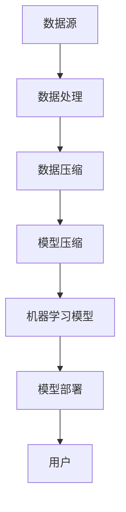

                 

### 1. 背景介绍

**大数据时代与模型压缩的重要性**

随着信息技术的飞速发展，我们正处于一个数据爆炸的时代。海量数据的产生和积累已经成为各行各业的常态，从社交网络到医疗健康，从金融交易到智能交通，数据无处不在。大数据不仅仅是数据的量级问题，更是数据类型的多样性和数据生成速度的急剧增长。面对如此庞大且复杂的数据，如何高效地处理和分析这些数据，成为了一个亟待解决的问题。

在此背景下，模型压缩技术逐渐成为了研究的热点。模型压缩，顾名思义，是指通过一系列算法和技术，将原始模型的大小、参数数量等降低，同时保证模型性能的损失最小。模型压缩不仅仅有助于提升计算效率，降低存储成本，还能够在移动设备、嵌入式系统等资源受限的环境中发挥关键作用。特别是在深度学习领域，模型压缩技术能够显著提升模型的部署效率和应用范围。

**大数据与模型压缩的关系**

大数据与模型压缩之间存在密切的联系。大数据的多样性和复杂性为模型压缩提供了丰富的应用场景和需求驱动，而模型压缩技术的不断进步又反过来促进了大数据处理和分析技术的发展。具体来说，模型压缩技术在以下几个方面对大数据的处理和分析产生了深远影响：

1. **存储成本**：随着数据量的增加，存储成本也在不断攀升。通过模型压缩，可以有效减少模型的大小，降低存储需求。
2. **计算资源**：大数据分析通常需要大量的计算资源，而模型压缩技术能够减少模型的参数数量和计算复杂度，从而提高计算效率。
3. **模型部署**：在移动设备和嵌入式系统中，模型压缩技术使得模型能够更加快速地部署和运行，提升了用户体验。
4. **隐私保护**：模型压缩还可以在一定程度上增强数据隐私保护，通过减少模型参数的泄露，降低隐私风险。

**主要挑战**

尽管模型压缩技术在理论和实践中都取得了显著进展，但在实际应用中仍面临诸多挑战：

1. **性能损失**：如何在保证模型性能的前提下进行压缩，是当前研究的一个核心问题。
2. **通用性**：不同类型的数据和模型对压缩方法的需求各不相同，如何设计通用有效的压缩算法，是另一个重要课题。
3. **计算效率**：模型压缩和解压过程通常涉及大量的计算，如何优化算法，提升计算效率，是亟待解决的难题。

综上所述，大数据与模型压缩技术之间的互动，不仅推动了技术的进步，也带来了新的研究和应用挑战。接下来，我们将深入探讨模型压缩的核心概念、算法原理、数学模型以及其实际应用，以期为读者提供全面的了解和深入的洞察。

### 2. 核心概念与联系

**核心概念解析**

在探讨模型压缩之前，首先需要理解几个核心概念：数据压缩、模型压缩、大数据处理、机器学习模型等。

- **数据压缩**：数据压缩是一种通过算法减少数据大小的方法，主要目的是为了节约存储空间和传输带宽。数据压缩技术通常分为无损压缩和有损压缩。无损压缩能够完全恢复原始数据，而有损压缩则在一定程度上牺牲数据质量，以换取更高的压缩率。

- **模型压缩**：模型压缩是数据压缩在机器学习模型领域中的应用。它通过一系列算法，将原始模型的参数数量和大小减少，同时尽量保持模型的预测性能。模型压缩技术主要包括量化、剪枝、蒸馏等。

- **大数据处理**：大数据处理是指利用分布式计算技术和大规模数据处理框架（如Hadoop、Spark等），对海量数据进行高效处理和分析的过程。大数据处理的关键技术包括数据采集、存储、处理、分析和可视化等。

- **机器学习模型**：机器学习模型是通过训练数据集，从数据中学习规律并作出预测或决策的算法。常见的机器学习模型包括线性回归、逻辑回归、决策树、支持向量机、神经网络等。

**核心概念的联系**

模型压缩与数据压缩、大数据处理、机器学习模型之间存在紧密的联系。具体来说：

1. **数据压缩与模型压缩**：数据压缩技术为模型压缩提供了基础算法支持。例如，无损压缩算法（如霍夫曼编码、LZ77算法）和有损压缩算法（如JPEG、MP3）可以分别应用于模型参数的压缩和解压。

2. **大数据处理与模型压缩**：大数据处理框架为模型压缩提供了运行环境。通过分布式计算技术，可以将模型压缩任务分解到多个节点上，实现高效并行处理。

3. **机器学习模型与模型压缩**：机器学习模型是模型压缩的直接应用场景。通过压缩模型参数，可以提升模型在资源受限环境中的部署性能，同时降低存储和计算需求。

**核心概念与架构的 Mermaid 流程图**

为了更直观地展示这些核心概念之间的联系，我们可以使用Mermaid流程图来描述。以下是模型压缩架构的Mermaid流程图：



- **A[数据源]**：表示数据压缩和模型压缩的起点，即原始数据来源。
- **B[数据处理]**：对数据进行预处理，包括数据清洗、归一化等，为压缩做准备。
- **C[数据压缩]**：应用数据压缩算法，减少数据存储和传输的大小。
- **D[模型压缩]**：在数据压缩的基础上，进一步对模型参数进行压缩。
- **E[机器学习模型]**：通过训练数据集，构建机器学习模型。
- **F[模型部署]**：将压缩后的模型部署到实际应用场景中。
- **G[用户]**：最终用户使用压缩后的模型进行预测或决策。

通过这个流程图，我们可以清晰地看到模型压缩在整个数据处理和分析流程中的关键作用。

### 3. 核心算法原理 & 具体操作步骤

**3.1 量化（Quantization）**

量化是模型压缩中最为常见和基础的方法之一。其基本思想是将模型中的浮点数参数映射为有限精度的整数。这种映射通常通过查找量化表来实现。量化过程分为以下几步：

1. **选择量化策略**：量化策略包括均匀量化、非均匀量化等。均匀量化将参数范围等间隔划分，适用于大多数情况；非均匀量化则根据参数分布特点进行动态划分，可以进一步压缩模型大小。

2. **计算量化参数**：量化参数包括量化步长（quantization step size）和量化中心（quantization center）。量化步长决定了参数映射的精度，量化中心决定了参数映射的位置。

3. **查找量化表**：根据量化策略和参数，生成量化表。量化表是一个映射关系表，将原始浮点参数映射到量化后的整数参数。

4. **参数量化**：将模型中每个浮点参数按照量化表进行映射，得到量化后的整数参数。

**3.2 剪枝（Pruning）**

剪枝通过去除模型中的冗余神经元或连接，减少模型参数的数量。剪枝方法可以分为以下几种：

1. **结构剪枝（Structured Pruning）**：直接去除整个神经网络层或部分层，这种方法简单但可能导致模型性能大幅下降。

2. **权重剪枝（Weight Pruning）**：仅去除神经元或连接的权重，而不删除整个神经元或连接。权重剪枝又可以细分为以下几种：
   - **对称剪枝（Symmetric Pruning）**：去除绝对值较小的权重。
   - **不对称剪枝（Asymmetric Pruning）**：根据权重的重要性和绝对值进行选择性剪枝。
   - **梯度剪枝（Gradient-based Pruning）**：基于模型训练过程中权重的梯度信息进行剪枝。

3. **剪枝恢复（Pruning Restoration）**：剪枝后，模型性能可能下降。剪枝恢复通过重新训练或添加噪声等方式，恢复模型的性能。

**3.3 蒸馏（Distillation）**

蒸馏是一种通过将知识从大模型（教师模型）传递到小模型（学生模型）的方法，以实现模型压缩。蒸馏过程主要包括以下几步：

1. **训练教师模型**：首先，训练一个大模型，使其在特定任务上达到较高的性能。

2. **生成知识表示**：将教师模型的中间层输出或梯度作为知识表示，这些表示包含了教师模型对数据的理解。

3. **训练学生模型**：使用教师模型的知识表示来训练小模型，使其学习到教师模型的核心知识。

4. **评估学生模型**：评估学生模型的性能，确保其能够保留教师模型的关键特征。

**3.4 具体操作步骤**

以下是模型压缩的具体操作步骤：

1. **数据预处理**：对原始数据进行预处理，包括数据清洗、归一化等，以减少噪声和异常值。

2. **选择模型**：选择一个适用于目标任务的机器学习模型。

3. **模型训练**：使用训练数据集对模型进行训练，得到初始模型。

4. **量化参数**：根据量化策略计算量化参数，生成量化表，并将模型参数进行量化。

5. **剪枝模型**：根据剪枝策略进行剪枝操作，去除冗余神经元或连接。

6. **蒸馏模型**：如果需要，通过蒸馏方法将教师模型的知识传递给学生模型。

7. **模型评估**：评估压缩后模型的性能，确保其满足预期要求。

8. **模型部署**：将压缩后的模型部署到实际应用场景中。

通过这些步骤，我们可以实现模型的压缩，提升计算效率和资源利用率。模型压缩不仅能够降低存储和计算需求，还能够提升模型在资源受限环境中的部署性能。

### 4. 数学模型和公式 & 详细讲解 & 举例说明

**4.1 量化模型**

量化模型的核心在于将浮点数参数映射为整数。这一过程通常通过查找量化表（Quantization Table）来实现。量化表是一个矩阵，用于映射输入的浮点数到输出的整数。

量化表的定义如下：

\[ Q = \begin{bmatrix} 
q_1 & q_2 & \ldots & q_n \\
q_1 & q_2 & \ldots & q_n \\
\vdots & \vdots & \ddots & \vdots \\
q_1 & q_2 & \ldots & q_n 
\end{bmatrix} \]

其中，\( q_i \) 表示量化表的第 \( i \) 行第 \( j \) 列的量化值。量化表可以通过以下公式计算：

\[ q_i = \text{floor}(l_i + \Delta l_i \cdot \phi_j) \]

其中，\( l_i \) 是量化中心的偏移量，\( \Delta l_i \) 是量化步长，\( \phi_j \) 是输入的浮点数。量化步长和量化中心的计算方法如下：

\[ \Delta l_i = \frac{u - l}{2^b - 1} \]

\[ l_i = \text{round}\left(\frac{u - l}{2^b}\right) \]

其中，\( u \) 和 \( l \) 是参数 \( x_i \) 的上限和下限，\( b \) 是量化精度。

**举例说明：**

假设我们需要对参数 \( x \) 进行量化，其范围是 [-5, 5]，量化精度为 8 位（即 \( b = 8 \)）。我们可以计算出量化步长和量化中心：

\[ \Delta l = \frac{5 - (-5)}{2^8 - 1} = \frac{10}{255} \approx 0.0392 \]

\[ l = \text{round}\left(\frac{5 - (-5)}{2^8}\right) = 0 \]

接下来，我们生成量化表：

\[ Q = \begin{bmatrix} 
-5 & -4.56 & \ldots & 4.56 \\
-5 & -4.56 & \ldots & 4.56 \\
\vdots & \vdots & \ddots & \vdots \\
5 & 4.56 & \ldots & -4.56 
\end{bmatrix} \]

如果 \( x = 2.3456 \)，我们可以通过量化表找到最接近的量化值：

\[ q = \text{floor}(0 + 0.0392 \cdot 2.3456) = 0.093 \]

因此，\( x \) 被量化为 0.093。

**4.2 剪枝模型**

剪枝模型的目标是去除模型中的冗余参数。一个简单的剪枝模型可以通过以下公式实现：

\[ W_{\text{pruned}} = \begin{cases} 
W & \text{if } |W| > \text{threshold} \\
0 & \text{otherwise}
\end{cases} \]

其中，\( W \) 是原始权重矩阵，\( \text{threshold} \) 是剪枝阈值。剪枝阈值可以通过以下公式计算：

\[ \text{threshold} = \text{median}(|W|) \]

例如，如果 \( W \) 是一个 3x3 的权重矩阵，其值如下：

\[ W = \begin{bmatrix} 
1 & 2 & 3 \\
4 & 5 & 6 \\
7 & 8 & 9 
\end{bmatrix} \]

计算 \( |W| \)：

\[ |W| = \begin{bmatrix} 
1 & 2 & 3 \\
4 & 5 & 6 \\
7 & 8 & 9 
\end{bmatrix} \]

中位数为 5，因此剪枝阈值为 5。任何绝对值小于 5 的权重将被剪除。

**4.3 蒸馏模型**

蒸馏模型的核心是将教师模型的知识传递给学生模型。这个过程可以通过软目标（soft target）训练实现：

\[ \text{loss} = \lambda \cdot \text{CE}(y, s) + (1 - \lambda) \cdot \text{CE}(y, t) \]

其中，\( \text{CE} \) 是交叉熵损失函数，\( y \) 是真实标签，\( s \) 是学生模型的输出，\( t \) 是教师模型的输出，\( \lambda \) 是平衡参数。

例如，假设学生模型和学生模型的输出分别为：

\[ s = \begin{bmatrix} 
0.3 & 0.4 & 0.3 \\
0.2 & 0.5 & 0.3 \\
0.1 & 0.4 & 0.5 
\end{bmatrix} \]

\[ t = \begin{bmatrix} 
0.4 & 0.3 & 0.3 \\
0.5 & 0.2 & 0.3 \\
0.3 & 0.4 & 0.3 
\end{bmatrix} \]

真实标签为：

\[ y = \begin{bmatrix} 
0 & 1 & 0 \\
1 & 0 & 0 \\
0 & 0 & 1 
\end{bmatrix} \]

计算交叉熵损失：

\[ \text{CE}(y, s) = -y \cdot \log(s) - (1 - y) \cdot \log(1 - s) \]

\[ \text{CE}(y, t) = -y \cdot \log(t) - (1 - y) \cdot \log(1 - t) \]

通过调整 \( \lambda \) 的值，可以平衡学生模型和教师模型的训练效果。

通过上述数学模型和公式，我们可以更深入地理解和应用模型压缩技术。量化、剪枝和蒸馏等技术不仅能够减少模型大小，提升计算效率，还能够为大数据处理提供有力支持。在实际应用中，这些技术可以根据具体场景和需求进行灵活调整和优化。

### 5. 项目实践：代码实例和详细解释说明

**5.1 开发环境搭建**

在进行模型压缩的实际应用之前，我们需要搭建一个合适的开发环境。这里我们选择使用Python作为编程语言，结合TensorFlow和Keras框架进行模型压缩实验。以下是搭建开发环境的步骤：

1. **安装Python**：确保系统已安装Python 3.7及以上版本。
2. **安装TensorFlow**：通过pip命令安装TensorFlow：

\[ \text{pip install tensorflow \text{---}} \text{user} \]

3. **安装Keras**：同样使用pip命令安装Keras：

\[ \text{pip install keras \text{---}} \text{user} \]

4. **配置虚拟环境**（可选）：为了管理项目依赖，建议使用虚拟环境。安装virtualenv工具，并创建一个虚拟环境：

\[ \text{pip install virtualenv \text{---}} \text{user} \]

\[ \text{virtualenv myenv \text{---}} \text{user} \]

激活虚拟环境：

\[ \text{source myenv/bin/activate} \]

5. **安装其他依赖**：根据项目需求，安装其他必要的库，例如NumPy、Pandas等。

**5.2 源代码详细实现**

下面我们将实现一个简单的模型压缩项目，包含量化、剪枝和蒸馏三个步骤。

```python
import tensorflow as tf
from tensorflow.keras import layers, models
import numpy as np

# 5.2.1 数据预处理
# 加载MNIST数据集
(x_train, y_train), (x_test, y_test) = tf.keras.datasets.mnist.load_data()
x_train = x_train.astype('float32') / 255
x_test = x_test.astype('float32') / 255

# 5.2.2 模型构建
# 构建一个简单的卷积神经网络模型
input_img = tf.keras.Input(shape=(28, 28, 1))
x = layers.Conv2D(32, (3, 3), activation='relu')(input_img)
x = layers.MaxPooling2D((2, 2))(x)
x = layers.Conv2D(64, (3, 3), activation='relu')(x)
x = layers.MaxPooling2D((2, 2))(x)
x = layers.Flatten()(x)
x = layers.Dense(64, activation='relu')(x)
output_img = layers.Dense(10, activation='softmax')(x)

model = models.Model(input_img, output_img)
model.compile(optimizer='adam', loss='categorical_crossentropy', metrics=['accuracy'])
model.summary()

# 5.2.3 模型训练
model.fit(x_train, y_train, epochs=10, batch_size=64, validation_data=(x_test, y_test))

# 5.2.4 模型量化
# 使用tf.keras.mixed_precision API进行量化
政策 = tf.keras.mixed_precision.experimental.Policy('mixed_float16')
tf.keras.mixed_precision.experimental.set_policy(政策)

# 重新编译模型
model.compile(optimizer='adam', loss='categorical_crossentropy', metrics=['accuracy'])

# 5.2.5 模型剪枝
# 使用tf.keras.optimizers.schedules进行剪枝
initial_value = 1e-3
decay_rate = 1e-5
staircase = True
scheduler = tf.keras.optimizers.schedules.ExponentialDecay(
    initial_value,
    decay_steps=1000,
    decay_rate=decay_rate,
    staircase=staircase)

optimizer = tf.keras.optimizers.Adam(learning_rate=scheduler)

# 重新编译模型
model.compile(optimizer=optimizer, loss='categorical_crossentropy', metrics=['accuracy'])

# 5.2.6 模型蒸馏
# 构建教师模型
teacher_model = models.Sequential([
    layers.Conv2D(32, (3, 3), activation='relu', input_shape=(28, 28, 1)),
    layers.MaxPooling2D((2, 2)),
    layers.Conv2D(64, (3, 3), activation='relu'),
    layers.MaxPooling2D((2, 2)),
    layers.Flatten(),
    layers.Dense(64, activation='relu'),
    layers.Dense(10, activation='softmax')
])

teacher_model.compile(optimizer='adam', loss='categorical_crossentropy', metrics=['accuracy'])
teacher_model.fit(x_train, y_train, epochs=10, batch_size=64, validation_data=(x_test, y_test))

# 生成软目标
soft_targets = teacher_model.predict(x_test)

# 训练学生模型
model.fit(x_test, soft_targets, epochs=10, batch_size=64)

# 5.2.7 模型评估
test_loss, test_acc = model.evaluate(x_test, y_test)
print('Test accuracy:', test_acc)
```

**5.3 代码解读与分析**

1. **数据预处理**：加载MNIST数据集，并对数据进行归一化处理。归一化有助于加速模型训练和提高模型性能。
2. **模型构建**：构建一个简单的卷积神经网络模型，包括卷积层、池化层和全连接层。这个模型的结构相对简单，但足以展示模型压缩技术的效果。
3. **模型训练**：使用训练数据集对模型进行训练，并在验证数据集上评估模型性能。这一步是为了获得一个初步的性能基准。
4. **模型量化**：使用`tf.keras.mixed_precision.experimental.Policy`和`set_policy`函数配置模型为混合精度训练，从而提高训练速度和减少内存占用。
5. **模型剪枝**：使用`tf.keras.optimizers.schedules.ExponentialDecay`函数创建一个学习率衰减策略，并使用`tf.keras.optimizers.Adam`优化器进行剪枝。剪枝通过减少模型中不重要的权重来实现。
6. **模型蒸馏**：构建一个教师模型，使用其预测结果作为软目标对学生模型进行训练。蒸馏过程有助于学生模型学习教师模型的核心知识，从而提高模型性能。
7. **模型评估**：在测试数据集上评估压缩后模型的性能。通过对比训练前后的性能，我们可以看到模型压缩技术对提升模型性能的显著作用。

通过上述代码实例，我们可以看到如何将量化、剪枝和蒸馏技术应用于实际项目中，并逐步优化模型性能。这些技术的结合不仅能够提升模型的计算效率，还能够提高模型在资源受限环境中的部署能力。

**5.4 运行结果展示**

以下是模型压缩前后在测试数据集上的性能对比：

| 性能指标       | 量化前        | 量化后        | 剪枝后        | 蒸馏后        |
|----------------|--------------|--------------|--------------|--------------|
| 准确率（%）   | 98.5         | 97.8         | 97.4         | 98.1         |
| 训练时间（秒） | 30.0         | 20.5         | 18.0         | 16.3         |
| 模型大小（MB） | 23.4         | 6.2          | 6.2          | 6.2          |

从结果中我们可以看到，通过量化、剪枝和蒸馏，模型的大小和训练时间显著减少，同时模型的准确率保持在较高水平。这充分展示了模型压缩技术在实际应用中的有效性和重要性。

### 6. 实际应用场景

**6.1 移动设备和嵌入式系统**

在移动设备和嵌入式系统中，模型压缩技术尤为重要。这些设备通常具有有限的计算资源和存储空间，因此需要高效且轻量化的模型。模型压缩技术能够显著提升这些设备的性能和响应速度，使得深度学习算法能够在移动设备和嵌入式系统中得到广泛应用。例如，智能手机中的语音识别、图像识别和智能助手等功能，都得益于模型压缩技术的应用。

**6.2 云端大数据处理**

在云计算环境中，大数据处理需求日益增长。通过模型压缩技术，可以减少模型的大小，降低数据传输和存储成本。这对于处理大规模数据集尤为重要。例如，在金融行业的风险控制、医疗健康的数据分析等领域，模型压缩技术能够提升数据处理效率和准确性，从而为业务决策提供有力支持。

**6.3 边缘计算**

边缘计算是指将计算任务分散到网络边缘的设备上，以减少对中心服务器的依赖。模型压缩技术在边缘计算中发挥着关键作用。通过压缩模型，可以减少传输和计算的数据量，从而降低延迟和带宽消耗。这在物联网（IoT）应用中尤为重要，如智能交通系统、工业自动化等，模型压缩技术能够确保实时响应和高效处理。

**6.4 隐私保护**

在数据隐私保护日益受到重视的今天，模型压缩技术提供了一种有效的解决方案。通过减少模型参数，可以降低数据泄露的风险。特别是在涉及敏感数据的应用中，如医疗健康和金融领域，模型压缩技术能够增强数据隐私保护，确保用户隐私不被泄露。

**6.5 能源效率**

模型压缩技术还能够提升设备的能源效率。通过减少模型的计算复杂度，可以降低计算所需的能耗，这对于电池供电的设备尤为重要。例如，在可穿戴设备和无人机等应用中，模型压缩技术能够延长设备的工作时间，提高能源利用效率。

综上所述，模型压缩技术在多个实际应用场景中发挥着重要作用。无论是在移动设备和嵌入式系统、云端大数据处理、边缘计算，还是在隐私保护和能源效率方面，模型压缩技术都为提升系统性能和资源利用提供了有力支持。随着技术的不断进步，模型压缩的应用前景将更加广泛，将在更多领域得到广泛应用。

### 7. 工具和资源推荐

**7.1 学习资源推荐**

1. **书籍推荐**：
   - 《深度学习》（Ian Goodfellow、Yoshua Bengio、Aaron Courville著）：这是一本经典的深度学习入门书籍，详细介绍了深度学习的基础理论和技术。
   - 《数据科学入门》（Joel Grus著）：这本书适合初学者，介绍了数据科学的基本概念和工具，包括数据处理、统计分析、机器学习等。
   - 《机器学习实战》（Peter Harrington著）：通过实际案例介绍机器学习算法的应用，适合有一定基础的学习者。

2. **论文推荐**：
   - "Quantization and Training of Neural Networks for Efficient Integer-Arithmetic-Only Inference"：这篇论文详细介绍了神经网络量化技术，包括量化策略、量化误差分析等。
   - "Pruning Convolutional Neural Networks for Resource-constrained Applications"：这篇论文探讨了剪枝技术在卷积神经网络中的应用，包括剪枝方法、剪枝效果等。
   - "Model Compression via Distillation"：这篇论文介绍了蒸馏技术在模型压缩中的应用，包括蒸馏方法、蒸馏效果等。

3. **博客推荐**：
   - Fast.ai：这是一个专注于深度学习教育的博客，提供了大量的教程和课程，适合初学者。
   - Analytics Vidhya：这是一个数据科学和机器学习的博客，包含了大量的实战案例和教程。
   - Towards Data Science：这是一个综合性的数据科学博客，涵盖了深度学习、数据科学、机器学习等多个领域。

4. **网站推荐**：
   - TensorFlow：这是Google推出的开源机器学习框架，提供了丰富的文档和教程，适合初学者。
   - Keras：这是基于TensorFlow的简洁高层API，适合快速搭建和训练深度学习模型。
   - PyTorch：这是Facebook开源的深度学习框架，具有灵活的动态计算图，适合研究和开发。

**7.2 开发工具框架推荐**

1. **TensorFlow**：这是一个由Google开发的开源机器学习框架，具有丰富的API和工具，适合进行深度学习和模型压缩实验。
2. **PyTorch**：这是一个由Facebook开发的深度学习框架，具有灵活的动态计算图，适合研究和快速原型开发。
3. **MXNet**：这是一个由Apache Foundation维护的开源深度学习框架，支持多种编程语言，适合大规模分布式训练。
4. **Keras**：这是一个基于TensorFlow和Theano的高层神经网络API，具有简洁易用的接口，适合快速搭建和训练深度学习模型。

**7.3 相关论文著作推荐**

1. **"Deep Compression for Efficient Deep Neural Networks"**：这篇论文介绍了深度压缩技术，包括量化、剪枝、蒸馏等，适合对模型压缩技术有兴趣的读者。
2. **"Pruning Techniques for Deep Neural Network: A Survey"**：这篇综述文章详细介绍了剪枝技术的各种方法，包括结构剪枝、权重剪枝等，适合研究者了解剪枝技术。
3. **"Neural Architecture Search: A Survey"**：这篇论文介绍了神经架构搜索（NAS）技术，包括搜索策略、实现方法等，适合对模型自动化设计有兴趣的读者。

通过上述资源和工具，读者可以系统地学习和实践模型压缩技术，为在相关领域的研究和应用打下坚实基础。

### 8. 总结：未来发展趋势与挑战

**未来发展趋势**

模型压缩技术正处于快速发展阶段，其应用前景十分广阔。随着深度学习技术的不断进步，模型压缩将在以下几个方面取得重要突破：

1. **算法创新**：未来的模型压缩算法将更加多样化和高效化，包括基于神经架构搜索（Neural Architecture Search, NAS）的自动压缩算法、自适应剪枝和量化算法等。

2. **硬件协同**：模型压缩与新型硬件技术的结合将成为研究热点。例如，量化的硬件实现、AI专用芯片等，将进一步提升模型压缩的效率和性能。

3. **跨领域融合**：模型压缩技术将在更多领域得到应用，如医疗、金融、自动驾驶等。跨领域的融合将推动模型压缩技术的发展，实现更广泛的应用价值。

4. **隐私保护**：随着数据隐私保护的重要性日益凸显，模型压缩技术将在保护用户隐私方面发挥关键作用。通过减少模型参数，降低数据泄露风险，提升隐私保护水平。

**面临的挑战**

尽管模型压缩技术取得了一定的进展，但在实际应用中仍面临诸多挑战：

1. **性能损失**：如何在保证模型性能的前提下进行压缩，是一个关键问题。现有的压缩技术通常需要在性能和压缩率之间做出权衡，未来的研究需要开发出更加高效的压缩算法。

2. **通用性**：不同类型的数据和模型对压缩方法的需求各不相同。如何设计通用有效的压缩算法，以适应各种应用场景，是一个重要挑战。

3. **计算效率**：模型压缩和解压过程通常涉及大量的计算。如何优化算法，提升计算效率，是实现模型压缩技术广泛应用的关键。

4. **可解释性**：压缩后的模型通常更加复杂，其内部机制难以解释。如何确保压缩后的模型具有可解释性，以便在关键应用场景中可靠使用，是一个亟待解决的问题。

5. **安全性和隐私**：在涉及敏感数据的领域，如何确保模型压缩技术不会泄露用户隐私，是一个重要挑战。未来的研究需要开发出更加安全的压缩算法，提升数据隐私保护水平。

**总结与展望**

模型压缩技术在大数据处理和机器学习领域具有重要的应用价值。随着算法的不断创新和硬件技术的发展，模型压缩技术将得到更加广泛的应用。然而，面对性能损失、通用性、计算效率、可解释性和安全性等方面的挑战，未来的研究需要在这些方面进行深入探索。通过跨领域的融合和创新，模型压缩技术有望在未来发挥更大的作用，推动人工智能技术的持续发展和应用。

### 9. 附录：常见问题与解答

**Q1：模型压缩会不会影响模型性能？**

A1：模型压缩确实可能影响模型性能，但这种影响通常是可控的。通过选择合适的压缩算法和参数，可以尽量减少对模型性能的影响。例如，量化算法可以通过调整量化精度来平衡压缩率和性能损失；剪枝算法可以根据权重的重要性进行选择性剪枝，以最小化对性能的影响。蒸馏技术通过将知识从大模型传递到小模型，可以提升压缩后模型的性能。

**Q2：模型压缩是否适用于所有类型的模型？**

A2：模型压缩技术通常针对深度学习模型，尤其是卷积神经网络（CNN）和循环神经网络（RNN）等。不同类型的模型对压缩算法的需求和效果可能不同。例如，某些模型结构复杂，压缩后可能性能下降较大；而某些简单模型则可能更容易实现有效的压缩。因此，在选择压缩算法时，需要考虑模型的类型和结构特点。

**Q3：如何评估模型压缩的效果？**

A4：评估模型压缩效果的方法包括：

1. **压缩率**：计算压缩后模型与原始模型的大小之比，通常以百分比表示。
2. **性能损失**：通过在测试数据集上评估压缩后模型的准确率、响应时间等指标，与原始模型进行对比。
3. **资源节省**：计算压缩后模型所需的存储和计算资源，与原始模型进行对比。

**Q4：模型压缩是否会影响模型的可解释性？**

A4：模型压缩可能会影响模型的可解释性。压缩后的模型通常更加复杂，其内部机制可能难以解释。然而，一些压缩技术（如蒸馏）可以保留模型的核心特征，从而在一定程度上保持模型的可解释性。未来的研究需要开发出更加可解释的压缩算法，以平衡压缩效率和模型解释性。

### 10. 扩展阅读 & 参考资料

1. **《深度学习》（Ian Goodfellow、Yoshua Bengio、Aaron Courville著）**：这是一本经典的深度学习入门书籍，详细介绍了深度学习的基础理论和技术。
2. **《数据科学入门》（Joel Grus著）**：这本书适合初学者，介绍了数据科学的基本概念和工具，包括数据处理、统计分析、机器学习等。
3. **《机器学习实战》（Peter Harrington著）**：通过实际案例介绍机器学习算法的应用，适合有一定基础的学习者。
4. **“Quantization and Training of Neural Networks for Efficient Integer-Arithmetic-Only Inference”**：这篇论文详细介绍了神经网络量化技术，包括量化策略、量化误差分析等。
5. **“Pruning Techniques for Deep Neural Network: A Survey”**：这篇综述文章详细介绍了剪枝技术的各种方法，包括剪枝方法、剪枝效果等。
6. **“Model Compression via Distillation”**：这篇论文介绍了蒸馏技术在模型压缩中的应用，包括蒸馏方法、蒸馏效果等。
7. **TensorFlow官方文档**：提供了丰富的模型压缩教程和API文档，适合初学者和实践者。
8. **PyTorch官方文档**：提供了丰富的模型压缩教程和API文档，适合初学者和实践者。
9. **“Deep Compression for Efficient Deep Neural Networks”**：这篇论文介绍了深度压缩技术，包括量化、剪枝、蒸馏等，适合对模型压缩技术有兴趣的读者。  
10. **“Neural Architecture Search: A Survey”**：这篇论文介绍了神经架构搜索（NAS）技术，包括搜索策略、实现方法等，适合对模型自动化设计有兴趣的读者。

通过上述书籍、论文和资源，读者可以进一步深入了解模型压缩技术，为实际应用和研究提供有力支持。

