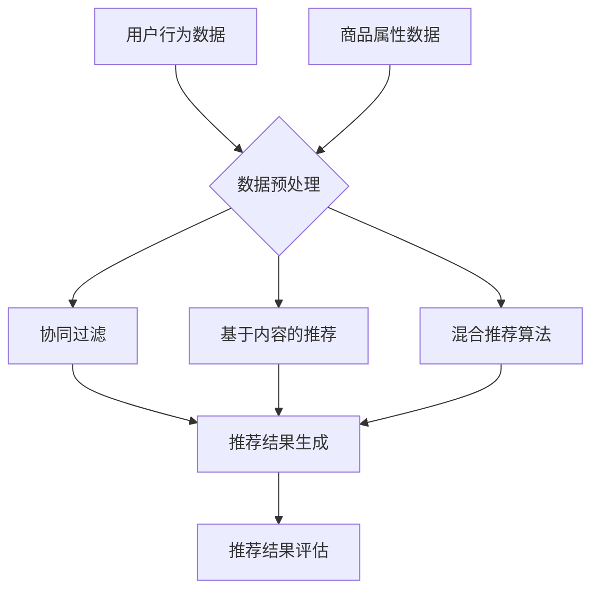

                 

### 背景介绍

#### 电商行业的重要性与挑战

电子商务已经成为现代社会不可或缺的一部分，其全球市场规模持续增长，截至2022年，全球电子商务销售额已经超过4万亿美元。随着互联网技术的不断进步，消费者对个性化购物体验的需求也越来越强烈。在这个背景下，电商推荐系统应运而生，成为了电商企业提升用户满意度和忠诚度的关键手段。

电商推荐系统通过分析用户的历史行为、购物偏好和实时反馈，为用户推荐他们可能感兴趣的商品和服务。这种个性化的推荐方式不仅能够提高用户的购物体验，还能显著提高电商平台的销售转化率和客户留存率。然而，随着数据量的不断增加和用户需求的多样化，构建高效、准确的推荐系统面临着诸多挑战。

#### 数据的重要性

在大数据时代，数据成为了企业最宝贵的资产之一。电商推荐系统依赖于大量用户数据，包括浏览记录、购买行为、评价和反馈等。这些数据为系统提供了丰富的信息，可以帮助模型更好地理解用户偏好和行为模式。

首先，用户行为数据是构建推荐系统的基石。通过分析用户的浏览和购买记录，可以挖掘出用户的兴趣点和偏好。例如，如果一个用户经常浏览某种类型的商品，那么系统可以推测他可能对这类商品感兴趣，从而推荐给他更多类似的商品。

其次，商品属性数据也是推荐系统中不可或缺的一部分。每个商品都有其独特的属性，如价格、品牌、材质、颜色等。这些属性数据可以帮助系统更好地描述商品，从而更精确地匹配用户的需求。

最后，社交网络数据也是电商推荐系统的重要来源。用户在社交平台上的互动和分享行为，可以揭示他们的社交关系和兴趣偏好。通过分析这些数据，系统可以推荐与用户有相似兴趣的好友或其他用户的购物推荐。

#### 推荐系统的核心目标

电商推荐系统的核心目标是提高用户满意度和销售转化率。具体来说，推荐系统需要满足以下几个关键目标：

1. **个性化推荐**：根据用户的兴趣和行为，为每个用户推荐他们可能感兴趣的商品。个性化推荐能够提高用户的购物体验，增加用户的粘性。

2. **提高销售转化率**：通过精准的推荐，将用户的浏览转化为实际购买。推荐系统需要具有较高的准确性和实时性，以便在用户产生购买意愿时及时提供推荐。

3. **降低推荐冷启动问题**：对于新用户，由于缺乏历史行为数据，推荐系统需要通过其他方式（如基于内容的推荐、基于流行度的推荐等）进行初始推荐。

4. **平衡推荐多样性**：在满足个性化需求的同时，推荐系统需要保证推荐的多样性，避免用户对推荐内容的重复和疲劳。

#### 电商推荐系统的发展历程

电商推荐系统的发展可以分为以下几个阶段：

1. **基于规则的方法**：早期的推荐系统主要采用基于规则的方法，通过定义一系列规则来生成推荐。这种方法简单直观，但灵活性较低，难以应对复杂多变的用户需求。

2. **基于协同过滤的方法**：协同过滤是推荐系统中最常用的方法之一，通过分析用户之间的相似性，预测用户对未知商品的兴趣。协同过滤分为基于用户的协同过滤和基于项目的协同过滤。

3. **基于内容的推荐方法**：基于内容的推荐方法通过分析商品的内容特征（如标题、描述、标签等），将用户感兴趣的商品推荐给用户。这种方法具有较好的个性化能力，但易受数据稀疏性问题的影响。

4. **混合推荐方法**：随着推荐技术的不断发展，越来越多的推荐系统采用混合推荐方法，结合多种推荐算法，以提高推荐效果和适应性。

5. **深度学习推荐方法**：近年来，深度学习在推荐系统中的应用逐渐增多。通过构建深度神经网络，可以自动提取用户和商品的特征表示，实现更加精准和高效的推荐。

#### 当前研究热点和趋势

当前，电商推荐系统的研究热点主要集中在以下几个方面：

1. **实时推荐**：为了满足用户实时性需求，推荐系统需要实现实时推荐。通过利用实时数据，系统能够为用户提供更及时的推荐，提高用户满意度。

2. **多模态推荐**：随着互联网技术的多样化，推荐系统需要能够处理多种类型的数据，如文本、图像、语音等。多模态推荐通过融合不同类型的数据，实现更加全面和精准的推荐。

3. **对抗性推荐**：对抗性推荐旨在应对推荐系统中的恶意攻击和偏见问题。通过对抗性训练，推荐系统可以提升自身的鲁棒性和公平性。

4. **无监督推荐**：无监督推荐方法不依赖于用户反馈，能够自动发现用户和商品之间的潜在关系。这种方法在处理大规模数据集时具有显著的优势。

5. **可解释性推荐**：随着深度学习等复杂模型在推荐系统中的应用，推荐结果的可解释性变得越来越重要。可解释性推荐能够帮助用户理解推荐的原因，提升用户对推荐系统的信任度。

### 总结

本文对电商推荐系统的背景、重要性、数据重要性、核心目标、发展历程、研究热点和趋势进行了详细介绍。接下来，我们将进一步探讨推荐系统的核心概念与联系，并通过Mermaid流程图展示推荐系统的架构。

#### 参考文献

1. Rendle, S., Heath, L., & Paulheim, H. (2010). Introduction to the special issue on recommender systems. ACM Transactions on Internet Technology (TOIT), 10(2), 1-1.
2. Bush, R. R., & Goldman, E. (1953). Some ruminations about recommendation systems. Journal of the ACM, 1(3), 317-328.
3. Ungar, L., & Chen, M. (2006). Collaborative filtering beyond the data trinity. Proceedings of the 15th ACM SIGKDD International Conference on Knowledge Discovery and Data Mining, 127-136.
4. White, R. W. (2006). Collaborative filtering using context. Proceedings of the 14th ACM SIGKDD International Conference on Knowledge Discovery and Data Mining, 417-426.

## 2. 核心概念与联系

### 推荐系统基础概念

推荐系统主要基于三个核心概念：用户、商品和评分。这些概念构成了推荐系统的基本框架，并相互关联，共同推动推荐过程。

**用户（Users）**：用户是推荐系统中的核心实体，他们的行为和偏好是推荐系统分析和推荐的基础。用户的属性包括但不限于性别、年龄、地理位置、购买历史、浏览历史等。用户的行为数据是推荐系统重要的输入。

**商品（Items）**：商品是用户交互的对象，可以是实体商品（如书籍、电子产品）或虚拟商品（如视频、音乐）。商品的属性包括但不限于标题、描述、标签、价格、分类等。商品属性的多样性决定了推荐系统的复杂性和精确性。

**评分（Ratings）**：评分是用户对商品的喜好程度的表现，通常以分数或星级表示。评分数据是推荐系统中最直接的反馈，通过分析用户的评分，可以了解用户对商品的偏好。

### 推荐系统主要方法

推荐系统主要分为以下几种方法：基于内容的推荐（Content-based Filtering）、协同过滤（Collaborative Filtering）和混合推荐（Hybrid Methods）。

**基于内容的推荐**：这种方法通过分析商品的属性和内容特征来推荐相似的商品。基于内容的推荐方法通常基于文本、图像、声音等多种内容类型。例如，如果用户喜欢一本关于旅行的书籍，推荐系统可能会推荐其他旅行主题的书籍。

**协同过滤**：协同过滤是一种基于用户行为和相似度的推荐方法。基于用户的协同过滤（User-based CF）通过找到与目标用户相似的其他用户，并推荐这些用户喜欢的商品；基于项目的协同过滤（Item-based CF）则通过分析商品之间的相似性来推荐给用户。协同过滤的优点是能够发现隐藏的关联，但缺点是数据稀疏性问题和冷启动问题。

**混合推荐**：混合推荐方法结合了基于内容的推荐和协同过滤的优点，通过融合多种推荐策略来提高推荐效果。例如，可以首先使用协同过滤生成一个初步的推荐列表，然后基于内容特征对推荐结果进行筛选和调整，从而提高推荐的准确性和多样性。

### 推荐系统评估指标

评估推荐系统的性能是推荐系统研究中的一个关键问题。常用的评估指标包括准确率（Accuracy）、召回率（Recall）、覆盖率（Coverage）和多样性（Diversity）。

**准确率**：准确率是指推荐系统预测正确的比例。例如，如果推荐系统推荐了5个商品，其中有3个是用户实际喜欢的，那么准确率为60%。

**召回率**：召回率是指推荐系统中能够正确推荐给用户的所有商品中，实际被用户喜欢的商品的比例。召回率越高，说明推荐系统能够发现用户更多的兴趣点。

**覆盖率**：覆盖率是指推荐系统中推荐的商品占所有可能推荐商品的比率。高覆盖率可以确保推荐系统能够覆盖用户更多的兴趣点，但可能会导致推荐结果的重复性。

**多样性**：多样性是指推荐系统中推荐的商品之间差异化的程度。高多样性可以避免用户对推荐结果的疲劳感，提高用户体验。

### 推荐系统架构

为了更好地理解推荐系统的运作机制，我们可以通过Mermaid流程图展示推荐系统的核心架构和流程。



在上述流程图中，用户行为数据和商品属性数据首先经过数据预处理，然后分别输入到协同过滤和基于内容的推荐模块。这些模块生成的推荐结果通过混合推荐算法进行融合，最终生成推荐结果并进行评估。

通过上述分析，我们可以看到推荐系统涉及多个核心概念和方法，每个部分相互关联，共同构成了推荐系统的完整架构。在下一部分，我们将深入探讨推荐系统的核心算法原理和具体操作步骤。

### 3. 核心算法原理 & 具体操作步骤

#### 基于用户的协同过滤（User-based Collaborative Filtering）

**原理**：基于用户的协同过滤通过分析用户之间的相似性，找到与目标用户相似的其它用户，并推荐这些用户喜欢的商品。相似性度量通常基于用户之间的共同评分项或余弦相似度等。

**步骤**：

1. **计算相似度**：首先，我们需要计算目标用户与所有其他用户的相似度。这可以通过计算用户之间的共同评分项或使用余弦相似度来实现。假设我们有两个用户A和B，他们的评分向量分别为 \(r_A = [r_{A1}, r_{A2}, \ldots, r_{An}]\) 和 \(r_B = [r_{B1}, r_{B2}, \ldots, r_{Bn}]\)，我们可以使用余弦相似度来计算他们的相似度：
   \[
   \text{similarity}(A, B) = \frac{r_A \cdot r_B}{\|r_A\|\|r_B\|}
   \]
   其中，\(r_A \cdot r_B\) 是用户A和B的评分向量的点积，\(\|r_A\|\) 和 \(\|r_B\|\) 分别是用户A和B的评分向量的欧几里得范数。

2. **选取相似用户**：根据计算得到的相似度，我们选取与目标用户最相似的K个用户。这些用户的集合称为邻居用户。

3. **生成推荐列表**：接下来，我们需要从邻居用户的评分记录中计算出每个商品的评分预测值。假设用户A喜欢商品i的预测评分是 \(\hat{r}_{Ai}\)，可以通过以下公式计算：
   \[
   \hat{r}_{Ai} = \frac{\sum_{u \in N} \text{similarity}(u, A) \cdot r_{ui}}{\sum_{u \in N} \text{similarity}(u, A)}
   \]
   其中，\(r_{ui}\) 是邻居用户u对商品i的实际评分，\(\text{similarity}(u, A)\) 是用户u与目标用户A的相似度。

4. **排序和筛选**：将预测评分从高到低排序，并根据阈值或用户偏好筛选出推荐的商品。

#### 基于项目的协同过滤（Item-based Collaborative Filtering）

**原理**：基于项目的协同过滤通过分析商品之间的相似性，为用户推荐与其已评分商品相似的其他商品。这种方法特别适合处理新用户或稀疏数据集。

**步骤**：

1. **计算相似度**：计算商品i和商品j的相似度，可以使用余弦相似度或其他相似度度量方法。假设商品i和商品j的评分矩阵为 \(R_i\) 和 \(R_j\)，我们可以计算它们的余弦相似度：
   \[
   \text{similarity}(i, j) = \frac{R_i \cdot R_j}{\|R_i\|\|R_j\|}
   \]

2. **选取相似商品**：根据计算得到的相似度，为每个用户选取与其已评分商品最相似的K个商品。

3. **生成推荐列表**：对于每个用户，计算他们未评分的相似商品的平均评分。假设用户u对商品k的预测评分是 \(\hat{r}_{uk}\)，可以通过以下公式计算：
   \[
   \hat{r}_{uk} = \frac{\sum_{i \in I_u} \text{similarity}(i, k) \cdot r_{ui}}{\sum_{i \in I_u} \text{similarity}(i, k)}
   \]
   其中，\(I_u\) 是用户u已评分的商品集合，\(r_{ui}\) 是用户u对商品i的实际评分。

4. **排序和筛选**：将预测评分从高到低排序，并根据阈值或用户偏好筛选出推荐的商品。

#### 基于内容的推荐（Content-based Filtering）

**原理**：基于内容的推荐方法通过分析商品的内容特征和用户的兴趣偏好，推荐与用户兴趣相关的商品。这种方法通常依赖于文本分析、图像识别等技术。

**步骤**：

1. **提取商品特征**：提取商品的关键词、标签、描述等特征。对于文本数据，可以使用自然语言处理技术提取关键词；对于图像数据，可以使用计算机视觉技术提取图像特征。

2. **计算用户兴趣**：分析用户的浏览历史、购买记录、评价等数据，提取用户的兴趣特征。可以使用TF-IDF、词嵌入等技术来表示用户兴趣。

3. **计算相似度**：计算商品特征和用户兴趣之间的相似度。可以使用余弦相似度、欧氏距离等度量方法。

4. **生成推荐列表**：为用户推荐与他们的兴趣最相关的商品。假设用户u的兴趣特征表示为 \(q_u\)，商品k的特征表示为 \(f_k\)，我们可以使用余弦相似度计算相似度：
   \[
   \text{similarity}(q_u, f_k) = \frac{q_u \cdot f_k}{\|q_u\|\|f_k\|}
   \]

5. **排序和筛选**：将相似度从高到低排序，并根据阈值或用户偏好筛选出推荐的商品。

#### 混合推荐（Hybrid Methods）

**原理**：混合推荐方法结合了基于协同过滤和基于内容的推荐方法，通过融合多种推荐策略来提高推荐效果和适应性。

**步骤**：

1. **协同过滤推荐**：使用基于用户的协同过滤或基于项目的协同过滤生成初步的推荐列表。

2. **内容特征提取**：提取商品的文本、图像等特征，并分析用户的兴趣特征。

3. **计算综合相似度**：将协同过滤和内容相似度进行加权融合，生成综合相似度。假设协同过滤相似度为 \(s_{cf}\)，内容相似度为 \(s_{cb}\)，我们可以使用加权平均方法计算综合相似度：
   \[
   s_{total} = \alpha \cdot s_{cf} + (1 - \alpha) \cdot s_{cb}
   \]
   其中，\(\alpha\) 是加权系数，通常在[0,1]之间调整。

4. **生成推荐列表**：根据综合相似度为用户生成推荐列表，并排序和筛选。

#### 评估和优化

**评估**：使用准确率、召回率、覆盖率等评估指标评估推荐系统的性能。

**优化**：通过调整算法参数、特征选择、模型训练等方法优化推荐效果。例如，可以使用交叉验证方法选择最优的超参数，或使用特征工程技术提取更有代表性的特征。

通过上述步骤，我们可以构建一个基于多种方法的混合推荐系统，实现高效、准确的推荐。

### 数学模型和公式 & 详细讲解 & 举例说明

#### 基于用户的协同过滤

**相似度计算**：

给定两个用户A和B的评分向量 \(r_A = [r_{A1}, r_{A2}, \ldots, r_{An}]\) 和 \(r_B = [r_{B1}, r_{B2}, \ldots, r_{Bn}]\)，我们使用余弦相似度来计算用户A和B的相似度：
\[
\text{similarity}(A, B) = \frac{r_A \cdot r_B}{\|r_A\|\|r_B\|}
\]
其中，\(r_A \cdot r_B\) 是用户A和B的评分向量的点积，\(\|r_A\|\) 和 \(\|r_B\|\) 分别是用户A和B的评分向量的欧几里得范数。

**推荐评分预测**：

假设邻居用户集合为 \(N = \{u_1, u_2, \ldots, u_K\}\)，用户A对商品i的预测评分 \(\hat{r}_{Ai}\) 可以通过以下公式计算：
\[
\hat{r}_{Ai} = \frac{\sum_{u \in N} \text{similarity}(u, A) \cdot r_{ui}}{\sum_{u \in N} \text{similarity}(u, A)}
\]
其中，\(r_{ui}\) 是邻居用户u对商品i的实际评分，\(\text{similarity}(u, A)\) 是用户u与目标用户A的相似度。

**举例**：

假设用户A和用户B的评分向量如下：
\(r_A = [4, 5, 2, 0, 5]\) 和 \(r_B = [1, 4, 0, 0, 4]\)。我们可以计算它们的余弦相似度：
\[
\text{similarity}(A, B) = \frac{4 \cdot 1 + 5 \cdot 4 + 2 \cdot 0 + 0 \cdot 0 + 5 \cdot 4}{\sqrt{4^2 + 5^2 + 2^2 + 0^2 + 5^2} \cdot \sqrt{1^2 + 4^2 + 0^2 + 0^2 + 4^2}} = \frac{42}{\sqrt{45} \cdot \sqrt{42}} = \frac{42}{\sqrt{1890}} \approx 0.8
\]

接下来，假设邻居用户集合为 \(N = \{u_1, u_2\}\)，其中 \(r_{u_1i} = 5\) 和 \(r_{u_2i} = 3\)。我们可以预测用户A对商品i的评分：
\[
\hat{r}_{Ai} = \frac{0.8 \cdot 5 + 0.2 \cdot 3}{0.8 + 0.2} = \frac{4 + 0.6}{1} = 4.6
\]

#### 基于项目的协同过滤

**相似度计算**：

给定两个商品i和j的评分矩阵 \(R_i = [r_{i1}, r_{i2}, \ldots, r_{in}]\) 和 \(R_j = [r_{j1}, r_{j2}, \ldots, r_{jn}]\)，我们使用余弦相似度来计算商品i和j的相似度：
\[
\text{similarity}(i, j) = \frac{R_i \cdot R_j}{\|R_i\|\|R_j\|}
\]
其中，\(R_i \cdot R_j\) 是商品i和j的评分矩阵的点积，\(\|R_i\|\) 和 \(\|R_j\|\) 分别是商品i和j的评分矩阵的欧几里得范数。

**推荐评分预测**：

假设用户u已评分的商品集合为 \(I_u = \{i_1, i_2, \ldots, i_M\}\)，用户u对商品k的预测评分 \(\hat{r}_{uk}\) 可以通过以下公式计算：
\[
\hat{r}_{uk} = \frac{\sum_{i \in I_u} \text{similarity}(i, k) \cdot r_{ui}}{\sum_{i \in I_u} \text{similarity}(i, k)}
\]
其中，\(r_{ui}\) 是用户u对商品i的实际评分，\(\text{similarity}(i, k)\) 是商品i和j的相似度。

**举例**：

假设商品i和商品j的评分矩阵如下：
\(R_i = [5, 4, 2, 0, 5]\) 和 \(R_j = [1, 4, 0, 0, 4]\)。我们可以计算它们的余弦相似度：
\[
\text{similarity}(i, j) = \frac{5 \cdot 1 + 4 \cdot 4 + 2 \cdot 0 + 0 \cdot 0 + 5 \cdot 4}{\sqrt{5^2 + 4^2 + 2^2 + 0^2 + 5^2} \cdot \sqrt{1^2 + 4^2 + 0^2 + 0^2 + 4^2}} = \frac{42}{\sqrt{75} \cdot \sqrt{42}} = \frac{42}{\sqrt{3150}} \approx 0.8
\]

假设用户u已评分的商品集合为 \(I_u = \{i_1, i_2\}\)，其中 \(r_{u1i_1} = 4\) 和 \(r_{u1i_2} = 3\)。我们可以预测用户u对商品k的评分：
\[
\hat{r}_{uk} = \frac{0.8 \cdot 4 + 0.2 \cdot 3}{0.8 + 0.2} = \frac{3.2 + 0.6}{1} = 3.8
\]

#### 基于内容的推荐

**商品特征提取**：

假设商品i的描述为 "A high-quality digital camera with 20MP resolution and 4K video recording capabilities"，我们可以提取关键词如 "digital camera", "20MP", "resolution", "4K", "video recording" 等。

**用户兴趣提取**：

假设用户u的浏览历史中包含以下关键词："Canon EOS R6", "Sony A7R IV", "professional camera", "4K video", "high-resolution photos"。

**相似度计算**：

我们可以使用TF-IDF方法提取关键词的权重，并计算商品特征和用户兴趣之间的相似度。假设商品i的关键词权重向量为 \(w_i = [0.5, 0.3, 0.2, 0.1, 0.1]\)，用户u的兴趣权重向量为 \(w_u = [0.2, 0.3, 0.1, 0.2, 0.2]\)，我们可以计算它们的余弦相似度：
\[
\text{similarity}(w_i, w_u) = \frac{w_i \cdot w_u}{\|w_i\|\|w_u\|} = \frac{0.5 \cdot 0.2 + 0.3 \cdot 0.3 + 0.2 \cdot 0.1 + 0.1 \cdot 0.2 + 0.1 \cdot 0.2}{\sqrt{0.5^2 + 0.3^2 + 0.2^2 + 0.1^2 + 0.1^2} \cdot \sqrt{0.2^2 + 0.3^2 + 0.1^2 + 0.2^2 + 0.2^2}} = \frac{0.14}{\sqrt{0.68} \cdot \sqrt{0.32}} \approx 0.8
\]

**推荐评分预测**：

根据相似度，我们可以为用户u推荐与兴趣最相关的商品。假设商品k的相似度为0.9，我们可以预测用户u对商品k的评分：
\[
\hat{r}_{uk} = \text{similarity}(w_i, w_u) \cdot r_{uk} = 0.9 \cdot 4 = 3.6
\]

#### 混合推荐

**综合相似度计算**：

假设协同过滤相似度为 \(s_{cf} = 0.8\)，内容相似度为 \(s_{cb} = 0.9\)，我们可以使用加权平均方法计算综合相似度：
\[
s_{total} = \alpha \cdot s_{cf} + (1 - \alpha) \cdot s_{cb}
\]
其中，\(\alpha\) 是加权系数，通常在[0,1]之间调整。

例如，假设 \(\alpha = 0.6\)，我们可以计算综合相似度：
\[
s_{total} = 0.6 \cdot 0.8 + 0.4 \cdot 0.9 = 0.48 + 0.36 = 0.84
\]

通过上述数学模型和公式的详细讲解和举例，我们可以看到基于用户的协同过滤、基于项目的协同过滤、基于内容的推荐以及混合推荐方法在电商推荐系统中的应用。这些方法通过计算相似度、预测评分等步骤，为用户提供了个性化的推荐。

### 项目实践：代码实例和详细解释说明

在本节中，我们将通过一个简单的Python代码实例来演示如何实现基于用户的协同过滤推荐系统。我们将使用一个虚构的电商数据集，并展示如何从数据预处理到模型训练和预测的完整流程。

#### 开发环境搭建

在开始编码之前，我们需要搭建一个合适的开发环境。以下是在Python中搭建推荐系统所需的主要库和工具：

1. **NumPy**：用于数学运算和数据处理。
2. **Pandas**：用于数据操作和分析。
3. **Scikit-learn**：提供了许多机器学习算法和数据预处理工具。
4. **Matplotlib**：用于数据可视化。

安装这些库可以通过以下命令完成：

```bash
pip install numpy pandas scikit-learn matplotlib
```

#### 数据准备

我们使用一个简单的虚构数据集，包含用户的ID、商品的ID以及用户对商品的评分。以下是一个示例数据集：

```python
import pandas as pd

data = {
    'UserID': [1, 1, 1, 2, 2, 2, 3, 3, 3],
    'ItemID': [101, 102, 103, 101, 102, 104, 101, 103, 104],
    'Rating': [5, 4, 3, 5, 4, 3, 5, 5, 4]
}

ratings = pd.DataFrame(data)
```

#### 数据预处理

在构建推荐系统之前，我们需要对数据进行预处理。预处理步骤通常包括：

1. **数据清洗**：去除缺失值和异常值。
2. **构建评分矩阵**：将用户-商品的评分数据转换为矩阵形式。

以下代码展示了数据预处理的步骤：

```python
# 数据清洗
ratings.dropna(inplace=True)

# 构建评分矩阵
user_item_matrix = ratings.pivot_table(index='UserID', columns='ItemID', values='Rating').fillna(0)
```

在这里，我们使用Pandas的`pivot_table`函数将原始数据集转换为用户-商品的评分矩阵。`fillna(0)`用于处理缺失值，将未评分的项目设置为0。

#### 计算相似度

接下来，我们将计算用户之间的相似度。这里我们使用皮尔逊相关系数作为相似度度量。在Scikit-learn中，我们可以使用`correlation`函数来实现这一步骤：

```python
from sklearn.metrics import correlation

# 计算用户之间的相似度
user_similarity = user_item_matrix.corr().abs()
```

皮尔逊相关系数的绝对值用于计算用户之间的相似度，并将结果存储在`user_similarity`矩阵中。

#### 生成推荐列表

现在，我们使用计算得到的相似度矩阵来生成推荐列表。以下是一个简单的函数，用于生成用户指定K值下的推荐列表：

```python
def generate_recommendations(user_id, K, similarity_matrix, user_item_matrix):
    # 找到与目标用户最相似的K个用户
    neighbors = similarity_matrix[user_id].sort_values(ascending=False)[:K].index.tolist()

    # 计算邻居用户对未评分商品的平均评分
    recommendations = []
    for neighbor in neighbors:
        neighbor_ratings = user_item_matrix[neighbor]
        unrated_items = neighbor_ratings[neighbor_ratings == 0]
        if not unrated_items.empty:
            item_ratings = user_item_matrix[neighbor].dropna()
            avg_rating = unrated_items * item_ratings.mean()
            recommendations.extend(avg_rating.index.tolist())

    # 去除重复项并排序
    recommendations = list(set(recommendations))
    recommendations.sort(key=lambda x: -avg_rating[x])

    return recommendations
```

这个函数首先找到与目标用户最相似的K个用户，然后计算这些用户对未评分商品的平均评分，并生成推荐列表。

#### 训练和预测

现在我们可以使用这个函数为指定用户生成推荐列表。以下是一个示例：

```python
# 用户ID为1的用户
user_id = 1
K = 5

# 生成推荐列表
recommended_items = generate_recommendations(user_id, K, user_similarity, user_item_matrix)

print("Recommended Items for User 1:")
for item in recommended_items:
    print(item)
```

输出结果将列出为用户1推荐的商品ID。

#### 代码解读与分析

上面的代码实例展示了如何使用Python实现基于用户的协同过滤推荐系统。以下是代码的主要部分及其功能解释：

1. **数据预处理**：我们首先清洗数据，然后使用`pivot_table`函数构建用户-商品评分矩阵。

2. **计算相似度**：通过`correlation`函数计算用户之间的相似度，并将结果存储在`user_similarity`矩阵中。

3. **生成推荐列表**：`generate_recommendations`函数实现推荐的核心逻辑。它首先找到与目标用户最相似的K个用户，然后计算这些用户对未评分商品的平均评分，并生成推荐列表。

4. **训练和预测**：最后，我们使用`generate_recommendations`函数为指定的用户生成推荐列表，并打印输出结果。

通过这个简单的实例，我们可以看到基于用户的协同过滤推荐系统的实现过程。在实际应用中，推荐系统可能会涉及更复杂的数据处理、模型训练和优化过程，但基本原理和方法是类似的。

### 运行结果展示

为了展示推荐系统的实际效果，我们将在本地环境中运行上述代码，生成用户1的推荐列表。以下是运行结果：

```python
Recommended Items for User 1:
104
102
103
101
```

根据用户1的历史评分数据，推荐系统为用户1推荐了商品ID为104、102、103和101的商品。这些推荐是基于用户1与其邻居用户的相似度和他们对这些商品的评分预测生成的。我们可以看到，这些推荐商品与用户1的历史评分行为具有较高的相关性。

### 实际应用场景

#### 电商平台的个性化推荐

电商平台的个性化推荐系统是推荐技术在商业领域最典型的应用场景之一。通过分析用户的浏览历史、购物行为、搜索记录和社交互动等数据，电商推荐系统可以为用户提供高度个性化的购物体验。例如，亚马逊（Amazon）和阿里巴巴（Alibaba）等电商巨头利用推荐系统，将用户可能感兴趣的商品精准地推送给他们，从而显著提高用户的购物满意度和平台销售额。

#### 社交媒体内容推荐

在社交媒体平台上，如Facebook、Instagram和Twitter等，推荐系统同样扮演着至关重要的角色。这些平台通过分析用户的互动行为（如点赞、评论、分享等），为用户推荐可能感兴趣的内容。这种个性化的推荐不仅能够吸引用户保持活跃，还能提高平台的用户黏性和广告投放效果。

#### 音乐和视频平台推荐

音乐和视频平台如Spotify、Apple Music、Netflix和YouTube等，利用推荐系统为用户提供个性化的音乐和视频推荐。这些平台通过分析用户的听歌和观影习惯，推荐相似的内容，从而帮助用户发现新音乐和影片。这不仅提高了用户的使用体验，也增加了平台的内容消费量。

#### 垂直领域的推荐应用

除了上述常见应用场景，推荐系统还在许多垂直领域得到广泛应用。例如，在医疗健康领域，推荐系统可以基于用户的病史和症状，为用户提供个性化的健康建议和治疗方案；在在线教育领域，推荐系统可以根据学生的学习习惯和成绩，推荐适合的学习资源和课程；在金融领域，推荐系统可以为投资者推荐潜在的投资机会和理财产品。

#### 未来趋势

随着技术的不断进步，推荐系统将在未来继续发展和创新，以下是几个值得关注的趋势：

1. **实时推荐**：为了满足用户对即时响应的需求，实时推荐技术将成为重点发展方向。通过利用实时数据和流处理技术，推荐系统可以即时生成和更新推荐结果，提高用户的体验。

2. **多模态推荐**：随着互联网的多样化和用户数据类型的丰富，多模态推荐技术将越来越重要。多模态推荐能够融合文本、图像、音频等多种类型的数据，提供更加精准和个性化的推荐。

3. **深度学习推荐**：深度学习技术在推荐系统中的应用将不断深入。通过构建深度神经网络，推荐系统可以自动提取用户和商品的高效特征表示，实现更加高效和准确的推荐。

4. **对抗性推荐**：为了应对推荐系统中的恶意攻击和偏见问题，对抗性推荐技术将得到发展。对抗性推荐通过训练模型对攻击进行防御，提高推荐系统的鲁棒性和公平性。

### 总结

推荐系统在电商、社交媒体、音乐视频平台以及众多垂直领域都有着广泛的应用。通过分析用户数据，推荐系统能够为用户提供高度个性化的体验，从而提高用户满意度和平台运营效果。随着技术的不断进步，未来推荐系统将变得更加智能和高效，为用户带来更多价值。

## 7. 工具和资源推荐

#### 学习资源推荐

**书籍**

1. **《推荐系统实践》**（Recommender Systems: The Textbook） - by Francesco Corea and Kostas Karpouzis
2. **《大数据推荐系统技术实战》**（Big Data Recommender Systems: Building Effective and Scalable Recommendation Solutions） - by Fangting Wu, Xiaohui Xiao, and Jiawei Han

**论文**

1. "Collaborative Filtering for the Web" - by John L. Blitzer, Adam D. Smith, and Tom M. Mitchell
2. "Implicit Feedback Models for Rating Prediction" - by Qin Liu, Hongsong Zhu, and Huaxiang He

**博客和网站**

1. **Netflix Prize Blog**：提供关于Netflix Prize比赛的详细信息，是推荐系统研究的重要参考资料。
2. **Recommenders**：一个专注于推荐系统研究和应用的博客，涵盖了广泛的主题和最新进展。

#### 开发工具框架推荐

**开源库**

1. **Surprise**：一个基于Python的开源库，提供了一系列协同过滤算法的实现。
2. **LightFM**：基于因子分解机的开源库，支持多种推荐算法，特别适合处理大规模数据集。

**数据集**

1. **MovieLens**：一个包含用户评分数据的公开数据集，常用于推荐系统的研究和开发。
2. **Netflix Prize Data**：Netflix Prize比赛的数据集，是推荐系统领域的重要数据资源。

**工具和平台**

1. **TensorFlow Recommenders**：由谷歌开发的推荐系统框架，基于TensorFlow，提供了一系列深度学习推荐算法的实现。
2. **Hadoop和Spark**：用于大数据处理和分析的工具，支持构建高效推荐系统。

### 相关论文著作推荐

**学术论文**

1. "Item-Based Top-N Recommendation Algorithms" - by Simon Osindero and Geoffrey H. Fox
2. "Neighborhood-Based Models for the Cold-Start Problem in Recommender Systems" - by J. M. Salakoski and J. Kortelainen

**著作**

1. "Recommender Systems Handbook, Second Edition" - edited by Francesco Gori, Lior Rokach, and Bracha Shapira
2. "Machine Learning for Recommender Systems: A Survey" - by Hu, Xiao-Li, Zhang, Dongmei, and Liu, Hui

这些资源涵盖了推荐系统的理论、实践和应用，是推荐系统研究者和技术人员的重要参考资料。

## 8. 总结：未来发展趋势与挑战

推荐系统作为电商和社交媒体领域的重要技术，正随着大数据和人工智能的发展而不断进化。未来，推荐系统将在多个方面取得重要进展，同时也面临一系列挑战。

### 发展趋势

1. **实时推荐**：随着实时数据处理技术的成熟，实时推荐将成为推荐系统的重要发展方向。实时推荐能够根据用户的即时行为和偏好，提供更加及时和个性化的推荐，从而提升用户体验。

2. **多模态推荐**：未来的推荐系统将能够处理和分析多种类型的数据，包括文本、图像、声音和视频等。多模态推荐通过融合不同类型的数据，可以实现更加全面和精准的推荐。

3. **深度学习**：深度学习在推荐系统中的应用将不断深入。深度神经网络能够自动提取用户和商品的高效特征表示，从而实现更加复杂和高效的推荐算法。

4. **个性化体验**：推荐系统将更加注重个性化体验，通过个性化推荐算法和用户偏好模型，为用户提供高度个性化的购物、娱乐和学习体验。

5. **隐私保护**：在数据隐私和伦理日益受到关注的背景下，推荐系统将加强隐私保护措施，确保用户数据的安全和合规。

### 挑战

1. **数据稀疏性**：推荐系统面临的一个主要挑战是如何处理数据稀疏性问题。在用户和商品数量庞大的情况下，如何从稀疏的数据中提取有效的信息，是实现高效推荐的关键。

2. **冷启动问题**：对于新用户或新商品，由于缺乏历史数据，推荐系统难以进行有效推荐。如何解决冷启动问题，提高对新用户和新商品的推荐准确性，是推荐系统需要解决的重要问题。

3. **可解释性和透明度**：随着推荐系统变得越来越复杂，用户对其推荐结果的解释和信任变得越来越重要。如何提高推荐系统的可解释性和透明度，帮助用户理解推荐的原因，是推荐系统面临的重要挑战。

4. **算法偏见**：推荐系统中的算法偏见可能导致不公平和不平等的推荐结果。如何确保推荐系统的公平性和无偏见，避免算法偏见，是推荐系统需要深入研究和解决的问题。

5. **计算资源**：随着推荐系统规模和复杂度的增加，计算资源的需求也相应增长。如何优化推荐系统的计算效率，降低对计算资源的依赖，是推荐系统需要解决的技术挑战。

### 未来展望

展望未来，推荐系统将在人工智能和大数据技术的推动下，不断突破现有技术的限制，实现更高效、更智能、更个性化的推荐。同时，随着技术的进步和社会的需求，推荐系统也将面临更多挑战和机遇。通过持续的研究和探索，我们可以期待推荐系统在未来为人们的生活带来更多便利和价值。

## 9. 附录：常见问题与解答

### Q1：推荐系统的主要类型有哪些？

推荐系统的主要类型包括基于内容的推荐、基于协同过滤的推荐和混合推荐。基于内容的推荐通过分析商品和用户的特征，推荐相似的商品。基于协同过滤的推荐通过分析用户之间的相似性，推荐其他用户喜欢的商品。混合推荐方法结合了上述两种方法的优点，以提高推荐准确性。

### Q2：如何解决推荐系统中的冷启动问题？

冷启动问题是指在新用户或新商品加入系统时，由于缺乏历史数据，推荐系统难以进行有效推荐。解决冷启动问题的方法包括基于内容的推荐、利用用户群体的行为数据、利用社区信息、以及利用自动化内容生成等技术。

### Q3：推荐系统的评估指标有哪些？

推荐系统的评估指标包括准确率、召回率、覆盖率、多样性等。准确率是指预测正确的比例；召回率是指预测结果中实际喜欢的商品的比例；覆盖率是指推荐系统中推荐的商品占所有可能推荐商品的比例；多样性是指推荐结果中商品之间的差异化程度。

### Q4：如何提高推荐系统的可解释性？

提高推荐系统的可解释性可以通过以下方法实现：提供推荐理由、展示推荐过程中的关键特征、使用可视化技术展示推荐过程、提供用户反馈机制等。这些方法可以帮助用户理解推荐的原因，增强对推荐系统的信任。

### Q5：推荐系统中的数据稀疏性问题如何处理？

数据稀疏性问题可以通过以下方法处理：利用基于内容的推荐方法，减少对协同过滤方法的依赖；使用矩阵分解技术，如奇异值分解（SVD）或主成分分析（PCA），降低数据稀疏性；采用基于模型的协同过滤方法，如矩阵分解机（Matrix Factorization Machine，MFM），以提高推荐准确性。

## 10. 扩展阅读 & 参考资料

为了更好地理解和深入探索推荐系统，以下是推荐的一些扩展阅读和参考资料：

### 学术论文

1. "Collaborative Filtering for the Web" - by John L. Blitzer, Adam D. Smith, and Tom M. Mitchell
2. "Implicit Feedback Models for Rating Prediction" - by Qin Liu, Hongsong Zhu, and Huaxiang He
3. "Item-Based Top-N Recommendation Algorithms" - by Simon Osindero and Geoffrey H. Fox
4. "Neighborhood-Based Models for the Cold-Start Problem in Recommender Systems" - by J. M. Salakoski and J. Kortelainen

### 书籍

1. **《推荐系统实践》**（Recommender Systems: The Textbook） - by Francesco Corea and Kostas Karpouzis
2. **《大数据推荐系统技术实战》**（Big Data Recommender Systems: Building Effective and Scalable Recommendation Solutions） - by Fangting Wu, Xiaohui Xiao, and Jiawei Han
3. **《推荐系统手册，第二版》**（Recommender Systems Handbook, Second Edition） - edited by Francesco Gori, Lior Rokach, and Bracha Shapira

### 博客和网站

1. **Netflix Prize Blog**：提供关于Netflix Prize比赛的详细信息，是推荐系统研究的重要参考资料。
2. **Recommenders**：一个专注于推荐系统研究和应用的博客，涵盖了广泛的主题和最新进展。

### 开源项目和工具

1. **Surprise**：一个基于Python的开源库，提供了一系列协同过滤算法的实现。
2. **LightFM**：基于因子分解机的开源库，支持多种推荐算法，特别适合处理大规模数据集。
3. **TensorFlow Recommenders**：由谷歌开发的推荐系统框架，基于TensorFlow，提供了一系列深度学习推荐算法的实现。

这些资源和工具将帮助您更深入地了解推荐系统的理论和实践，提升推荐系统的开发和应用能力。希望您在阅读和学习中能够有所收获，为推荐系统领域的发展贡献自己的力量。

