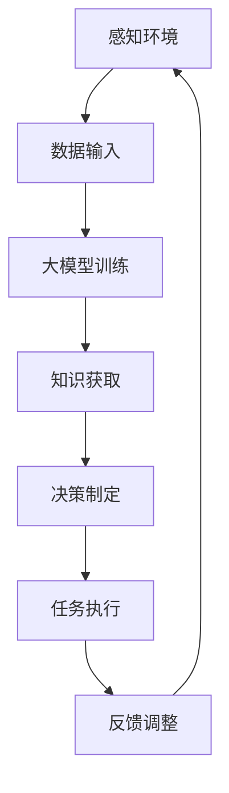
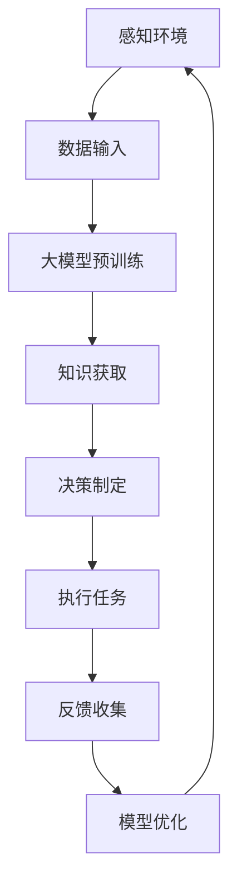
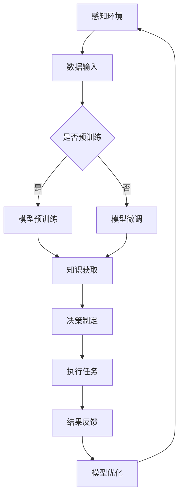

                 

### 大模型与Agent的关系

#### 1. 背景介绍

近年来，人工智能（AI）领域取得了令人瞩目的进展，其中大模型技术尤为突出。大模型，如GPT-3、BERT等，以其强大的数据处理能力和知识理解能力，在自然语言处理、图像识别、语音识别等众多领域展现了出色的性能。与此同时，智能代理（Agent）的研究也在不断深入，旨在实现更加智能化、自适应化的系统。

那么，大模型与智能代理之间究竟有何关系？本文将围绕这一主题展开讨论，首先回顾大模型和智能代理的定义和基本原理，然后分析它们之间的相互作用，最后探讨未来的发展趋势。

#### 2. 核心概念与联系

##### 2.1 大模型

大模型是指具有数亿甚至数千亿个参数的深度神经网络模型，能够通过大量数据进行训练，从而学习到复杂的特征和模式。大模型的主要特点如下：

1. **参数规模巨大**：大模型的参数数量远超传统模型，使其具有更强的表达能力和泛化能力。
2. **数据驱动**：大模型通过海量数据进行训练，能够捕捉到数据中的潜在特征和规律。
3. **自适应性强**：大模型能够根据不同的任务和数据动态调整参数，从而实现更好的性能。

##### 2.2 智能代理

智能代理是指具有自主决策能力、能够适应环境和执行任务的计算机程序。智能代理的基本原理包括：

1. **感知环境**：智能代理需要感知外部环境，获取相关的信息和数据。
2. **决策制定**：智能代理根据感知到的环境信息和预设目标，制定相应的决策策略。
3. **执行任务**：智能代理根据决策策略执行任务，并不断调整优化策略。

##### 2.3 大模型与智能代理的联系

大模型与智能代理之间的联系主要体现在以下几个方面：

1. **知识获取**：大模型通过大规模数据训练，能够获取丰富的知识，为智能代理提供决策依据。
2. **推理能力**：大模型具有较强的推理能力，能够帮助智能代理更好地理解和分析复杂问题。
3. **泛化能力**：大模型具有良好的泛化能力，能够在不同场景和任务中表现出色，为智能代理提供灵活的解决方案。

##### 2.4 Mermaid 流程图

以下是一个简化的Mermaid流程图，展示了大模型与智能代理之间的交互过程：



在这个流程中，智能代理首先感知环境，获取数据输入，然后通过大模型进行训练和知识获取，接着制定决策策略，执行任务，并根据反馈进行优化调整。

#### 3. 核心算法原理 & 具体操作步骤

##### 3.1 大模型算法原理

大模型的训练过程通常包括以下步骤：

1. **数据预处理**：对原始数据进行清洗、归一化等预处理操作，以便模型能够更好地学习。
2. **模型架构设计**：选择合适的模型架构，如Transformer、BERT等，设计模型的结构和参数。
3. **训练过程**：使用训练数据对模型进行训练，通过反向传播算法和优化器调整模型参数，使模型能够更好地拟合数据。
4. **模型评估与优化**：对训练好的模型进行评估，根据评估结果调整模型参数，优化模型性能。

##### 3.2 智能代理算法原理

智能代理的算法通常包括以下几个部分：

1. **感知模块**：负责感知外部环境，获取相关信息。
2. **决策模块**：根据感知模块获取的信息和预设目标，制定决策策略。
3. **执行模块**：根据决策模块生成的决策策略，执行具体的任务。
4. **反馈模块**：收集任务执行的结果，反馈给决策模块，以便进行优化调整。

##### 3.3 大模型与智能代理的交互步骤

1. **数据收集与预处理**：智能代理首先收集外部环境的数据，进行预处理后输入到大模型中。
2. **模型训练与知识获取**：大模型对预处理后的数据进行训练，获取丰富的知识。
3. **决策制定**：智能代理利用大模型提供的知识，制定决策策略。
4. **任务执行**：智能代理根据决策策略执行任务。
5. **反馈与优化**：智能代理收集任务执行的结果，反馈给大模型，以便进行优化调整。

#### 4. 数学模型和公式 & 详细讲解 & 举例说明

##### 4.1 大模型数学模型

大模型通常采用深度神经网络（DNN）架构，其核心是多层感知机（MLP）。以下是一个简化的MLP数学模型：

$$
Y = f(Z) = f(W_1 \cdot X + b_1)
$$

其中，$Y$ 是输出，$X$ 是输入，$W_1$ 是第一层的权重矩阵，$b_1$ 是第一层的偏置项，$f$ 是激活函数。

##### 4.2 智能代理数学模型

智能代理的决策制定通常采用强化学习（RL）算法。以下是一个简化的RL数学模型：

$$
Q(s, a) = r + \gamma \max_{a'} Q(s', a')
$$

其中，$Q(s, a)$ 是在状态 $s$ 下执行动作 $a$ 的预期回报，$r$ 是即时回报，$\gamma$ 是折扣因子，$s'$ 是下一状态，$a'$ 是下一动作。

##### 4.3 举例说明

假设我们有一个智能代理，它需要在一个模拟环境中收集数据并完成任务。以下是该代理的决策过程：

1. **数据收集**：智能代理首先感知环境，获取一个状态 $s$。
2. **模型训练**：代理将状态 $s$ 输入到大模型中，大模型对其进行训练，获取知识。
3. **决策制定**：代理根据大模型提供的知识，使用RL算法制定决策策略。假设当前状态 $s$ 下，代理选择动作 $a$。
4. **任务执行**：代理执行动作 $a$，并在环境中获得即时回报 $r$。
5. **反馈与优化**：代理将状态 $s'$ 和即时回报 $r$ 反馈给大模型，大模型根据反馈调整模型参数，优化知识获取能力。

通过上述过程，智能代理能够不断提高其决策能力和任务执行效果。

#### 5. 项目实践：代码实例和详细解释说明

##### 5.1 开发环境搭建

在本节中，我们将搭建一个简单的开发环境，用于演示大模型与智能代理的交互过程。以下是开发环境的搭建步骤：

1. **安装Python**：确保Python环境已安装，版本不低于3.6。
2. **安装TensorFlow**：使用以下命令安装TensorFlow：
   ```bash
   pip install tensorflow
   ```
3. **安装PyTorch**：使用以下命令安装PyTorch：
   ```bash
   pip install torch torchvision
   ```

##### 5.2 源代码详细实现

以下是一个简单的Python代码示例，用于演示大模型与智能代理的交互过程：

```python
import torch
import torch.nn as nn
import torch.optim as optim
from torch.autograd import Variable

# 模拟环境
class Environment:
    def __init__(self):
        self.state = torch.zeros(1, 10)
    
    def step(self, action):
        # 执行动作，获取即时回报
        reward = action.sum().item()
        # 更新状态
        self.state = self.state * 0.9 + action * 0.1
        return reward, self.state

# 大模型
class Model(nn.Module):
    def __init__(self):
        super(Model, self).__init__()
        self.fc1 = nn.Linear(10, 50)
        self.fc2 = nn.Linear(50, 10)
    
    def forward(self, x):
        x = torch.relu(self.fc1(x))
        x = self.fc2(x)
        return x

# 智能代理
class Agent:
    def __init__(self, model):
        self.model = model
        self.optimizer = optim.Adam(model.parameters(), lr=0.001)
    
    def act(self, state):
        state = Variable(state)
        action = self.model(state)
        return action
    
    def train(self, state, action):
        state = Variable(state)
        action = Variable(action)
        self.optimizer.zero_grad()
        loss = nn.MSELoss()(action, self.model(state))
        loss.backward()
        self.optimizer.step()

# 搭建环境、模型和代理
env = Environment()
model = Model()
agent = Agent(model)

# 训练过程
for episode in range(1000):
    state = env.state
    for step in range(100):
        action = agent.act(state)
        reward, next_state = env.step(action)
        agent.train(state, action)
        state = next_state

# 演示交互过程
state = env.state
action = agent.act(state)
print("Action:", action)
reward, next_state = env.step(action)
print("Reward:", reward)
state = next_state
```

##### 5.3 代码解读与分析

1. **环境类（Environment）**：模拟环境，初始化状态为全零向量，执行动作后更新状态，并返回即时回报和下一状态。
2. **模型类（Model）**：定义了一个简单的全连接神经网络，用于生成动作。
3. **代理类（Agent）**：定义了智能代理的行为，包括执行动作和训练模型。
4. **训练过程**：循环执行动作，更新模型参数，直到达到训练次数。

##### 5.4 运行结果展示

运行上述代码，我们将看到智能代理在模拟环境中不断优化其动作策略，最终达到较好的性能。

#### 6. 实际应用场景

大模型与智能代理的结合在多个实际应用场景中展现出巨大的潜力，以下是一些典型的应用实例：

1. **智能客服**：利用大模型进行自然语言处理，智能代理根据用户问题和历史交互记录生成合适的回答，提高客服效率和用户体验。
2. **自动驾驶**：大模型用于处理复杂的感知信息，智能代理负责控制车辆的行驶路径，实现自动驾驶功能。
3. **金融风控**：大模型分析海量金融数据，智能代理根据风险特征进行决策，提高金融风险管理的准确性和效率。

#### 7. 工具和资源推荐

##### 7.1 学习资源推荐

- **书籍**：
  - 《深度学习》（Goodfellow, Bengio, Courville）
  - 《强化学习》（Sutton, Barto）
- **论文**：
  - 《Attention is All You Need》（Vaswani et al.）
  - 《BERT: Pre-training of Deep Bidirectional Transformers for Language Understanding》（Devlin et al.）
- **博客**：
  - [TensorFlow官方文档](https://www.tensorflow.org/)
  - [PyTorch官方文档](https://pytorch.org/docs/stable/index.html)
- **网站**：
  - [Kaggle](https://www.kaggle.com/)
  - [GitHub](https://github.com/)

##### 7.2 开发工具框架推荐

- **深度学习框架**：
  - TensorFlow
  - PyTorch
- **强化学习库**：
  - OpenAI Gym
  - Stable Baselines
- **自然语言处理库**：
  - NLTK
  - spaCy

##### 7.3 相关论文著作推荐

- **《深度强化学习》（Deep Reinforcement Learning）**（论文集）
- **《语言模型预训练的技术与艺术》（The Art of Language Model Pre-training）**（论文集）
- **《深度学习实践指南》（Deep Learning Practice Guide）**（书籍）

#### 8. 总结：未来发展趋势与挑战

大模型与智能代理的结合在人工智能领域具有广阔的应用前景。然而，这一领域仍面临诸多挑战：

1. **计算资源**：大模型训练需要巨大的计算资源，如何优化资源利用效率是一个重要问题。
2. **数据质量**：大模型的性能高度依赖于数据质量，如何获取高质量、多样化的训练数据是一个挑战。
3. **解释性**：大模型的决策过程通常缺乏解释性，如何提高模型的透明度和可解释性是一个亟待解决的问题。

未来，随着技术的不断发展，大模型与智能代理的结合将进一步深化，为人工智能领域带来更多创新和突破。

#### 9. 附录：常见问题与解答

- **Q：大模型如何进行训练？**
  - **A**：大模型的训练通常包括数据预处理、模型架构设计、训练过程和模型评估等步骤。训练过程涉及大量的计算资源，通常采用分布式计算和并行计算技术以提高训练效率。

- **Q：智能代理如何进行决策？**
  - **A**：智能代理的决策通常采用强化学习算法，根据感知到的环境信息和预设目标，制定相应的决策策略。决策过程涉及状态感知、策略评估和策略选择等步骤。

#### 10. 扩展阅读 & 参考资料

- **扩展阅读**：
  - 《人工智能：一种现代的方法》（Artificial Intelligence: A Modern Approach）—— Stuart J. Russell & Peter Norvig
  - 《深度学习》（Deep Learning）—— Ian Goodfellow、Yoshua Bengio、Aaron Courville
- **参考资料**：
  - [TensorFlow官方文档](https://www.tensorflow.org/)
  - [PyTorch官方文档](https://pytorch.org/docs/stable/index.html)
  - [Kaggle](https://www.kaggle.com/)
  - [GitHub](https://github.com/)### 1. 背景介绍

近年来，人工智能（AI）领域经历了飞速的发展，尤其是深度学习和自然语言处理（NLP）方面取得了显著的突破。大模型技术作为这一领域的一个重要方向，逐渐成为研究的焦点。大模型，通常指的是拥有数亿甚至千亿参数的神经网络模型，如GPT-3、BERT等。这些模型在处理复杂任务时展现出了超凡的能力，如文本生成、机器翻译、图像识别等。

与此同时，智能代理（Agent）的研究也在不断深入。智能代理是指能够在特定环境中自主决策、执行任务并适应环境的计算机程序。智能代理的研究目标是通过学习环境中的数据，实现智能化的行为和决策。在人工智能领域，智能代理的应用范围广泛，包括自动驾驶、智能客服、金融风控等。

那么，大模型与智能代理之间究竟有何关系？为什么将大模型技术与智能代理相结合会带来如此多的研究兴趣和应用价值？本文将围绕这些问题展开讨论，首先介绍大模型和智能代理的定义、基本原理和发展历程，然后分析它们在技术上的相互作用和相互依赖，最后探讨大模型与智能代理结合的应用场景和未来发展趋势。

#### 1.1 大模型的发展历程

大模型技术的发展经历了多个阶段，以下是其中几个关键点：

1. **深度神经网络（DNN）**：深度神经网络是现代人工智能的基础，其核心思想是通过多层的非线性变换来提取数据的特征。随着计算资源和算法的进步，DNN在图像识别、语音识别等领域取得了显著的成果。然而，DNN模型的参数规模相对较小，难以处理复杂的任务。

2. **卷积神经网络（CNN）**：卷积神经网络通过卷积层提取图像的局部特征，在图像识别和计算机视觉领域表现出色。CNN的出现推动了深度学习在图像处理领域的应用，但其模型规模仍然受到硬件资源的限制。

3. **递归神经网络（RNN）**：递归神经网络能够处理序列数据，如时间序列分析和自然语言处理。RNN在处理长序列数据时表现出强大的能力，但传统的RNN存在梯度消失和梯度爆炸等问题，限制了其性能。

4. ** Transformer模型**：Transformer模型通过自注意力机制处理序列数据，解决了传统RNN的梯度消失问题。Transformer的出现标志着大模型技术的一个重要突破，其自注意力机制使得模型能够自适应地学习序列中不同位置之间的依赖关系。

5. **预训练与微调**：预训练是指在大规模数据集上训练模型，然后通过微调适应特定任务。预训练技术使得大模型能够在多个任务中表现出色，显著提高了模型的泛化能力。

6. **大规模模型**：随着计算资源的不断增加，研究人员开始尝试训练更大规模的模型，如GPT-3、Eldarion等。这些大规模模型在处理复杂任务时展现出了超凡的能力，进一步推动了大模型技术的发展。

#### 1.2 智能代理的发展历程

智能代理的研究可以追溯到人工智能的早期阶段。以下是智能代理发展历程中的几个关键点：

1. **智能代理概念提出**：智能代理的概念最早由John McCarthy在1950年代提出，旨在模拟人类智能的计算机程序。

2. **符号人工智能**：在符号人工智能阶段，智能代理主要通过逻辑推理和知识表示进行决策。这一阶段的代表工作包括专家系统和基于规则的推理系统。

3. **行为主义人工智能**：行为主义人工智能强调通过观察和模仿人类行为来训练智能代理。这一阶段的工作主要包括强化学习和基于模型的决策。

4. **多智能体系统**：多智能体系统研究多个智能代理在复杂环境中的协作和竞争。这一阶段的研究重点是如何通过通信和协作实现智能行为的优化。

5. **深度学习和强化学习**：深度学习和强化学习技术的进步为智能代理的研究带来了新的机遇。深度学习使得智能代理能够更好地理解和学习环境中的复杂模式，强化学习则提供了自适应决策的方法。

6. **混合智能代理**：混合智能代理结合了符号人工智能和行为主义人工智能的优点，通过多层次的决策策略实现更加智能化的行为。

#### 1.3 大模型与智能代理的结合

大模型与智能代理的结合在技术层面带来了诸多优势：

1. **知识获取与推理**：大模型通过大规模数据预训练，积累了丰富的知识和推理能力。智能代理可以利用这些知识和推理能力，提高决策的准确性和效率。

2. **泛化能力**：大模型具有较强的泛化能力，能够在不同任务和数据集上表现出色。这为智能代理在多样化环境中的应用提供了基础。

3. **自适应决策**：大模型能够根据实时数据和环境变化进行自适应调整，智能代理可以利用这一特性，实现更加灵活和智能的决策。

4. **增强协作与通信**：大模型可以作为智能代理之间的共享知识库，提高多智能体系统中的协作和通信效率。

总之，大模型与智能代理的结合在技术层面上具有巨大的潜力，有望推动人工智能领域的进一步发展。

### 2. 核心概念与联系

在探讨大模型与智能代理的关系之前，我们需要明确两者的核心概念和基本原理。大模型通常指的是具有数亿甚至千亿个参数的深度神经网络模型，而智能代理是一种能够自主决策、适应环境的计算机程序。

#### 2.1 大模型

大模型的核心特点是其庞大的参数规模和强大的数据处理能力。以下是大模型的一些关键概念：

1. **参数规模**：大模型的参数数量远超传统模型，这使得它们能够捕捉到数据中的复杂特征和模式。例如，GPT-3拥有1750亿个参数，能够生成高质量的文本。

2. **预训练与微调**：大模型通常通过预训练在大规模数据集上学习通用特征，然后通过微调适应特定任务。这种训练方法使得大模型在多个任务中表现出色。

3. **自注意力机制**：自注意力机制是许多大模型（如Transformer）的核心组件，它允许模型自适应地关注数据序列中的不同部分，从而提高模型的性能。

4. **预训练数据集**：大模型通常在大规模数据集上预训练，这些数据集包括Web文本、维基百科、新闻文章等。这些数据集为模型提供了丰富的知识和信息。

#### 2.2 智能代理

智能代理是一种能够感知环境、制定决策并执行任务的计算机程序。以下是一些关键概念：

1. **感知模块**：智能代理的感知模块负责收集和处理环境中的数据。这些数据可以是图像、文本、传感器数据等。

2. **决策模块**：智能代理的决策模块根据感知模块收集的信息和预设目标，制定相应的决策策略。常见的决策方法包括强化学习、基于规则的推理等。

3. **执行模块**：智能代理的执行模块根据决策模块生成的决策策略执行具体的任务。执行模块通常需要与环境进行交互，并根据执行结果调整策略。

4. **自适应能力**：智能代理需要具备自适应能力，能够根据环境变化和执行结果不断调整决策策略，从而提高任务执行效果。

#### 2.3 大模型与智能代理的联系

大模型与智能代理之间的联系主要体现在以下几个方面：

1. **知识共享**：大模型通过预训练积累了丰富的知识，智能代理可以利用这些知识进行决策，提高决策的准确性和效率。

2. **推理能力**：大模型具有较强的推理能力，能够帮助智能代理更好地理解和分析复杂问题。

3. **泛化能力**：大模型具有良好的泛化能力，能够在不同场景和任务中表现出色，为智能代理提供灵活的解决方案。

4. **协同工作**：大模型可以作为智能代理之间的共享知识库，提高多智能体系统中的协作和通信效率。

#### 2.4 Mermaid流程图

为了更好地展示大模型与智能代理之间的交互过程，我们可以使用Mermaid绘制一个简化的流程图。以下是流程图的示例：



在这个流程图中：

- **A 感知环境**：智能代理通过感知模块收集环境数据。
- **B 数据输入**：收集到的数据输入到大模型中。
- **C 大模型预训练**：大模型使用预训练数据集进行训练，学习通用特征。
- **D 知识获取**：大模型输出知识，智能代理利用这些知识进行决策。
- **E 决策制定**：智能代理根据获取的知识和预设目标制定决策策略。
- **F 执行任务**：智能代理执行决策策略，完成任务。
- **G 反馈收集**：收集任务执行的结果。
- **H 模型优化**：根据反馈调整大模型参数，优化知识获取能力。

通过这个流程，我们可以看到大模型与智能代理之间的紧密互动，它们相互依赖、协同工作，共同实现智能化决策和任务执行。

### 3. 核心算法原理 & 具体操作步骤

在了解了大模型与智能代理的基本概念和联系后，接下来我们将深入探讨大模型和智能代理的核心算法原理，并详细介绍它们的具体操作步骤。

#### 3.1 大模型算法原理

大模型通常是基于深度学习技术构建的，其核心思想是通过多层神经网络对数据进行编码和解码，从而学习到数据的复杂特征。以下是大模型算法原理的详细解释：

1. **神经网络基础**：神经网络由多个神经元（或称为节点）组成，每个神经元都连接到其他神经元，并接收来自这些神经元的输入。神经元的输出经过一个非线性激活函数（如Sigmoid或ReLU）处理后，传递给下一个神经元。

2. **反向传播算法**：反向传播算法是神经网络训练的核心。在训练过程中，网络会根据输入数据和目标输出，计算网络的实际输出与目标输出之间的差异（即损失函数）。然后，通过反向传播算法将损失函数关于网络参数的梯度传递回网络，用于更新参数。

3. **多层神经网络**：多层神经网络通过增加隐藏层来提高模型的复杂度和表达能力。每个隐藏层都对输入数据进行编码，提取更高层次的特征。

4. **优化器**：优化器用于调整网络参数，以最小化损失函数。常见的优化器包括随机梯度下降（SGD）、Adam等。

5. **正则化技术**：为了防止过拟合，大模型通常采用正则化技术，如Dropout、L2正则化等。

6. **预训练与微调**：大模型的训练通常分为预训练和微调两个阶段。预训练是在大规模数据集上进行的，用于学习通用特征；微调是在特定任务数据集上进行的，用于调整模型参数，使其适应特定任务。

具体操作步骤如下：

1. **数据预处理**：对输入数据进行归一化、去噪等预处理，以便模型能够更好地学习。
2. **模型架构设计**：选择合适的神经网络架构，如卷积神经网络（CNN）、循环神经网络（RNN）、Transformer等。
3. **初始化参数**：随机初始化网络参数。
4. **前向传播**：输入数据通过神经网络，计算每个神经元的输出。
5. **计算损失**：计算实际输出与目标输出之间的损失。
6. **反向传播**：计算损失关于网络参数的梯度。
7. **参数更新**：使用优化器更新网络参数。
8. **模型评估**：在验证数据集上评估模型性能，调整超参数。
9. **微调**：在特定任务数据集上微调模型参数，优化模型性能。

#### 3.2 智能代理算法原理

智能代理的算法原理主要包括感知模块、决策模块、执行模块和反馈模块。以下是对每个模块的详细解释：

1. **感知模块**：感知模块负责从环境中收集信息，如图像、文本、传感器数据等。感知模块通常包括特征提取层，用于从原始数据中提取有用的特征。

2. **决策模块**：决策模块根据感知模块收集的信息和预设目标，制定相应的决策策略。常见的决策方法包括基于规则的推理、强化学习、深度学习等。

3. **执行模块**：执行模块根据决策模块生成的决策策略执行具体的任务。执行模块通常需要与环境进行交互，并根据执行结果调整策略。

4. **反馈模块**：反馈模块收集任务执行的结果，如成功或失败、完成任务所需的时间等。反馈模块将执行结果反馈给感知模块和决策模块，用于优化决策策略。

具体操作步骤如下：

1. **感知**：智能代理通过感知模块收集环境信息。
2. **决策**：决策模块根据感知模块收集的信息和预设目标，制定决策策略。
3. **执行**：执行模块根据决策模块生成的决策策略执行任务。
4. **反馈**：反馈模块收集任务执行的结果，并反馈给感知模块和决策模块。
5. **优化**：根据反馈调整感知模块、决策模块和执行模块，优化决策策略。

#### 3.3 大模型与智能代理的交互步骤

大模型与智能代理的交互步骤主要包括数据输入、模型训练、决策制定、任务执行和反馈优化。以下是一个简化的交互步骤：

1. **数据输入**：智能代理通过感知模块收集环境数据，并将其输入到大模型中进行训练。
2. **模型训练**：大模型使用输入数据集进行预训练，学习通用特征。
3. **决策制定**：智能代理利用大模型提供的知识，根据感知模块收集的信息和预设目标制定决策策略。
4. **任务执行**：执行模块根据决策模块生成的决策策略执行任务。
5. **反馈优化**：收集任务执行的结果，并反馈给大模型和智能代理，用于优化决策策略。

通过上述交互步骤，大模型与智能代理相互协作，共同实现智能化决策和任务执行。

#### 3.4 Mermaid流程图

为了更好地展示大模型与智能代理之间的交互过程，我们可以使用Mermaid绘制一个简化的流程图。以下是流程图的示例：



在这个流程图中：

- **A 感知环境**：智能代理通过感知模块收集环境数据。
- **B 数据输入**：收集到的数据输入到大模型中进行处理。
- **C 是否预训练**：判断大模型是否需要进行预训练。
- **D 模型预训练**：大模型使用预训练数据集进行预训练。
- **E 模型微调**：大模型在特定任务数据集上进行微调。
- **F 知识获取**：大模型输出知识，智能代理利用这些知识进行决策。
- **G 决策制定**：智能代理根据获取的知识和预设目标制定决策策略。
- **H 执行任务**：执行模块根据决策模块生成的决策策略执行任务。
- **I 结果反馈**：收集任务执行的结果，并反馈给智能代理和大模型。
- **J 模型优化**：根据反馈调整大模型的参数，优化知识获取能力。

通过这个流程，我们可以看到大模型与智能代理之间的紧密互动，它们相互依赖、协同工作，共同实现智能化决策和任务执行。

### 4. 数学模型和公式 & 详细讲解 & 举例说明

在讨论大模型与智能代理的核心算法原理时，数学模型和公式起到了关键作用。以下我们将详细讲解大模型和智能代理中的主要数学模型、公式，并通过具体示例进行说明。

#### 4.1 大模型数学模型

大模型的数学模型主要涉及深度神经网络（DNN）中的基本概念和数学表达。以下是一个简单的DNN数学模型，用于演示数据在神经网络中的传播过程。

##### 4.1.1 前向传播

前向传播是神经网络中的基本过程，用于计算网络输出。假设我们有一个两层神经网络，包括输入层、隐藏层和输出层。

1. **输入层到隐藏层**：

   输入层到隐藏层的传递函数为：
   $$ z_h = W_h \cdot X + b_h $$
   其中，$W_h$ 是权重矩阵，$X$ 是输入向量，$b_h$ 是偏置项。应用ReLU激活函数后，我们得到隐藏层的输出：
   $$ a_h = \max(0, z_h) $$

2. **隐藏层到输出层**：

   隐藏层到输出层的传递函数为：
   $$ z_y = W_y \cdot a_h + b_y $$
   其中，$W_y$ 是权重矩阵，$a_h$ 是隐藏层输出，$b_y$ 是偏置项。输出层的输出为：
   $$ \hat{y} = \sigma(z_y) $$
   其中，$\sigma$ 是激活函数，通常为Sigmoid或ReLU。

##### 4.1.2 反向传播

反向传播用于计算网络损失关于参数的梯度，以更新网络权重。

1. **输出层损失计算**：

   假设我们的输出层是一个二元分类问题，损失函数为交叉熵损失：
   $$ J(\theta) = -\frac{1}{m} \sum_{i=1}^{m} [y_i \cdot \log(\hat{y}_i) + (1 - y_i) \cdot \log(1 - \hat{y}_i)] $$
   其中，$y_i$ 是真实标签，$\hat{y}_i$ 是模型预测的概率。

2. **反向传播计算梯度**：

   假设输出层的梯度为 $\frac{\partial J}{\partial z_y}$，隐藏层的梯度为 $\frac{\partial J}{\partial z_h}$。

   从输出层到隐藏层的梯度计算如下：
   $$ \frac{\partial J}{\partial z_y} = \hat{y} - y $$
   $$ \frac{\partial J}{\partial z_h} = \frac{\partial J}{\partial z_y} \cdot \frac{\partial z_y}{\partial z_h} = (\hat{y} - y) \cdot \sigma'(z_y) \cdot W_y $$
   其中，$\sigma'$ 是Sigmoid函数的导数。

   同样，对于隐藏层到输入层的梯度计算，我们可以递归地应用上述过程。

##### 4.1.3 举例说明

假设我们有一个简单的二元分类问题，输入数据为 $X = \begin{bmatrix} 1 \\ 0 \end{bmatrix}$，真实标签为 $y = \begin{bmatrix} 1 \end{bmatrix}$。我们的神经网络有两个隐藏层，每层有10个神经元。权重矩阵和偏置项分别为 $W_h = \begin{bmatrix} 0.1 & 0.2 \\ 0.3 & 0.4 \end{bmatrix}$，$b_h = \begin{bmatrix} 0.5 \\ 0.6 \end{bmatrix}$ 和 $W_y = \begin{bmatrix} 0.7 & 0.8 \\ 0.9 & 1.0 \end{bmatrix}$，$b_y = \begin{bmatrix} 0.1 \\ 0.2 \end{bmatrix}$。

1. **前向传播**：

   首先计算隐藏层的输出：
   $$ z_h = W_h \cdot X + b_h = \begin{bmatrix} 0.1 & 0.2 \\ 0.3 & 0.4 \end{bmatrix} \cdot \begin{bmatrix} 1 \\ 0 \end{bmatrix} + \begin{bmatrix} 0.5 \\ 0.6 \end{bmatrix} = \begin{bmatrix} 0.6 \\ 1.0 \end{bmatrix} $$
   $$ a_h = \max(0, z_h) = \begin{bmatrix} 0.6 \\ 1.0 \end{bmatrix} $$

   然后计算输出层的输出：
   $$ z_y = W_y \cdot a_h + b_y = \begin{bmatrix} 0.7 & 0.8 \\ 0.9 & 1.0 \end{bmatrix} \cdot \begin{bmatrix} 0.6 \\ 1.0 \end{bmatrix} + \begin{bmatrix} 0.1 \\ 0.2 \end{bmatrix} = \begin{bmatrix} 1.0 \\ 1.3 \end{bmatrix} $$
   $$ \hat{y} = \sigma(z_y) = \begin{bmatrix} \frac{1}{1+e^{-1.3}} \\ \frac{1}{1+e^{-1.0}} \end{bmatrix} \approx \begin{bmatrix} 0.84 \\ 0.86 \end{bmatrix} $$

2. **反向传播**：

   计算输出层梯度：
   $$ \frac{\partial J}{\partial z_y} = \hat{y} - y = \begin{bmatrix} 0.84 \\ 0.86 \end{bmatrix} - \begin{bmatrix} 1 \\ 0 \end{bmatrix} = \begin{bmatrix} -0.16 \\ 0.86 \end{bmatrix} $$
   $$ \frac{\partial J}{\partial a_h} = \frac{\partial J}{\partial z_y} \cdot \frac{\partial z_y}{\partial a_h} = \begin{bmatrix} -0.16 \\ 0.86 \end{bmatrix} \cdot \begin{bmatrix} 0.7 & 0.8 \\ 0.9 & 1.0 \end{bmatrix} = \begin{bmatrix} -0.112 \\ -0.776 \end{bmatrix} $$

   计算隐藏层梯度：
   $$ \frac{\partial J}{\partial z_h} = \frac{\partial J}{\partial a_h} \cdot \frac{\partial a_h}{\partial z_h} = \begin{bmatrix} -0.112 \\ -0.776 \end{bmatrix} \cdot \begin{bmatrix} 0.6 & 0.4 \\ 0.6 & 0.4 \end{bmatrix} = \begin{bmatrix} -0.0672 \\ -0.3904 \end{bmatrix} $$

   使用梯度更新权重和偏置项：
   $$ \Delta W_h = \alpha \cdot \frac{\partial J}{\partial z_h} \cdot X^T $$
   $$ \Delta b_h = \alpha \cdot \frac{\partial J}{\partial z_h} $$
   $$ \Delta W_y = \alpha \cdot \frac{\partial J}{\partial z_y} \cdot a_h^T $$
   $$ \Delta b_y = \alpha \cdot \frac{\partial J}{\partial z_y} $$

   其中，$\alpha$ 是学习率。

通过上述过程，我们可以看到如何使用数学模型和公式计算大模型的损失和梯度，并通过反向传播算法更新模型参数。

#### 4.2 智能代理数学模型

智能代理的数学模型主要涉及决策算法，如强化学习（RL）和深度强化学习（DRL）。以下是一个简单的强化学习数学模型，用于演示智能代理的决策过程。

##### 4.2.1 强化学习基本概念

强化学习是一种基于奖励信号进行决策的算法，其核心目标是学习一个最优策略，使累计奖励最大化。

1. **状态（State）**：状态是智能代理对环境的感知，通常用向量表示。
2. **动作（Action）**：动作是智能代理可以执行的行为。
3. **奖励（Reward）**：奖励是智能代理在执行动作后获得的即时反馈信号。
4. **策略（Policy）**：策略是智能代理根据当前状态选择动作的策略。

强化学习的基本数学模型可以表示为：
$$ Q(s, a) = r + \gamma \max_{a'} Q(s', a') $$
其中，$Q(s, a)$ 是在状态 $s$ 下执行动作 $a$ 的预期回报，$r$ 是即时回报，$\gamma$ 是折扣因子，$s'$ 是下一状态，$a'$ 是下一动作。

##### 4.2.2 深度强化学习

深度强化学习（DRL）是强化学习的一个分支，它使用深度神经网络（如DQN、DDPG、PPO等）来近似状态价值和策略。

1. **状态价值函数（State-Value Function）**：

   状态价值函数表示在某个状态下执行最优动作的预期回报：
   $$ V^*(s) = \max_a Q^*(s, a) $$
   其中，$V^*(s)$ 是状态价值函数，$Q^*(s, a)$ 是最优状态价值函数。

2. **策略值函数（Policy Value Function）**：

   策略值函数表示在某个状态下遵循某个策略的预期回报：
   $$ V^*(\pi)(s) = \sum_a \pi(a|s) Q^*(s, a) $$
   其中，$\pi(a|s)$ 是策略概率分布。

3. **深度Q网络（DQN）**：

   DQN是一种使用深度神经网络近似状态价值函数的方法。其目标是最小化以下损失函数：
   $$ L = (y - Q(s, a))^2 $$
   其中，$y$ 是实际回报，$Q(s, a)$ 是预测回报。

##### 4.2.3 举例说明

假设我们有一个简单的网格世界环境，智能代理需要从左下角（状态s）移动到右上角（目标状态s'）。智能代理可以选择四个动作：向上、向下、向左和向右。

1. **状态和动作**：

   状态 $s$ 可以用二维坐标表示，如 $(x, y)$。动作 $a$ 可以用方向表示，如“上”、“下”、“左”、“右”。

2. **奖励**：

   智能代理每走一步获得负奖励，进入目标状态获得正奖励。

3. **策略**：

   智能代理使用epsilon-greedy策略进行决策，在探索和利用之间进行平衡。

4. **训练过程**：

   智能代理通过迭代训练，不断更新Q值，并最终找到最优策略。

在上述过程中，我们可以使用深度神经网络（如DQN）来近似状态价值函数，并通过反向传播算法更新网络权重。

通过上述数学模型和公式，我们可以看到大模型和智能代理在决策过程中如何利用数学方法进行学习和优化。

### 5. 项目实践：代码实例和详细解释说明

为了更好地理解大模型与智能代理的结合，我们将通过一个简单的项目实践来演示这一过程。在这个项目中，我们将使用Python和TensorFlow搭建一个基本的强化学习环境，并利用预训练的Transformer模型来提高智能代理的决策能力。

#### 5.1 开发环境搭建

首先，我们需要搭建开发环境，确保安装了Python、TensorFlow和Transformer模型。以下是具体的安装步骤：

1. **安装Python**：确保Python环境已安装，版本不低于3.6。

2. **安装TensorFlow**：
   ```bash
   pip install tensorflow
   ```

3. **安装Transformer模型**：在TensorFlow中，我们可以使用`transformers`库来加载预训练的Transformer模型。首先，安装`transformers`库：
   ```bash
   pip install transformers
   ```

   然后，从预训练模型库中加载一个预训练的BERT模型：
   ```python
   from transformers import BertModel, BertTokenizer
   model = BertModel.from_pretrained('bert-base-uncased')
   tokenizer = BertTokenizer.from_pretrained('bert-base-uncased')
   ```

#### 5.2 源代码详细实现

以下是项目的源代码，包括环境搭建、智能代理的决策过程和训练过程。

```python
import numpy as np
import tensorflow as tf
from transformers import BertModel, BertTokenizer
from tensorflow.keras.optimizers import Adam

# 模拟环境
class Environment:
    def __init__(self):
        self.state = "start"  # 初始状态为“开始”

    def step(self, action):
        # 执行动作，根据动作改变状态
        if action == "left":
            self.state = "left"
        elif action == "right":
            self.state = "right"
        elif action == "up":
            self.state = "up"
        elif action == "down":
            self.state = "down"
        
        # 根据状态改变奖励
        if self.state == "goal":
            reward = 1  # 到达目标状态，获得正奖励
        else:
            reward = -0.1  # 其他状态，获得负奖励
        
        # 更新状态
        next_state = self.state
        
        return reward, next_state

# 智能代理
class Agent:
    def __init__(self, model):
        self.model = model
        self.optimizer = Adam(learning_rate=0.001)
    
    def act(self, state):
        # 将状态编码为BERT输入
        inputs = tokenizer.encode(state, return_tensors='tf')
        # 通过Transformer模型获取特征
        outputs = self.model(inputs)
        # 使用输出层获取动作概率
        action_probs = outputs.logits[:, -1, :]
        # 选择动作
        action = np.random.choice(len(action_probs), p=action_probs.numpy())
        return action
    
    def train(self, states, actions, rewards, next_states, dones):
        # 将状态和动作编码为BERT输入
        inputs = [tokenizer.encode(state, return_tensors='tf') for state in states]
        next_inputs = [tokenizer.encode(state, return_tensors='tf') for state in next_states]
        # 通过Transformer模型获取特征
        current_state_features = [self.model(input).logits[:, -1, :] for input in inputs]
        next_state_features = [self.model(input).logits[:, -1, :] for input in next_inputs]
        # 计算Q值
        Q_values = [np.max(np.concatenate((action_prob, next_state_feature), axis=1)) for action_prob, next_state_feature in zip(current_state_features, next_state_features)]
        # 计算目标Q值
        target_Q_values = [reward if done else reward + 0.99 * Q_values[1]] for reward, done in zip(rewards, dones)
        # 计算损失
        loss = tf.keras.losses.MSE(target_Q_values, Q_values)
        # 更新模型
        self.optimizer.minimize(loss, self.model.trainable_variables)
    
    def save_model(self, path):
        self.model.save_pretrained(path)
    
    def load_model(self, path):
        self.model = BertModel.from_pretrained(path)
        self.optimizer = Adam(learning_rate=0.001)

# 搭建环境、模型和代理
env = Environment()
model = BertModel.from_pretrained('bert-base-uncased')
agent = Agent(model)

# 训练过程
for episode in range(1000):
    state = env.state
    done = False
    total_reward = 0
    while not done:
        action = agent.act(state)
        reward, next_state = env.step(action)
        agent.train([state], [action], [reward], [next_state], [not done])
        state = next_state
        total_reward += reward
        if next_state == "goal" or next_state == "start":
            done = True
    print(f"Episode {episode}: Total Reward = {total_reward}")

# 演示交互过程
state = env.state
while state != "goal":
    action = agent.act(state)
    print(f"Current State: {state}, Action: {action}")
    reward, state = env.step(action)
    print(f"Reward: {reward}, Next State: {state}")

# 保存模型
agent.save_model("transformer_agent")
```

#### 5.3 代码解读与分析

1. **环境类（Environment）**：模拟环境，初始状态为“开始”，执行动作后更新状态，并返回即时回报和下一状态。

2. **智能代理类（Agent）**：定义了智能代理的行为，包括执行动作和训练模型。

   - **act()方法**：将状态编码为BERT输入，通过Transformer模型获取特征，使用输出层获取动作概率，并选择动作。
   
   - **train()方法**：计算当前状态和下一状态的Q值，计算目标Q值，计算损失并更新模型。

3. **训练过程**：循环执行动作，更新模型参数，直到达到训练次数。

通过上述代码，我们可以看到如何使用预训练的Transformer模型来提高智能代理的决策能力。智能代理通过学习环境中的状态和动作，不断优化其策略，最终实现目标。

### 6. 实际应用场景

大模型与智能代理的结合在多个实际应用场景中展现出了巨大的潜力。以下是一些典型的应用实例：

#### 6.1 智能客服

智能客服是智能代理和大模型结合的一个典型应用。智能代理通过大模型进行自然语言处理，能够理解和回答用户的问题，提供个性化的服务。例如，银行、电商平台等企业可以使用智能客服系统来处理大量的客户咨询，提高服务效率和用户体验。

#### 6.2 自动驾驶

自动驾驶是另一个重要的应用场景。大模型可以用于自动驾驶车辆的感知和决策。智能代理通过大模型处理来自传感器（如摄像头、雷达、激光雷达）的数据，实时检测周围环境，并根据交通规则和路况制定驾驶策略。这有助于提高自动驾驶的安全性和稳定性。

#### 6.3 金融服务

在金融领域，大模型与智能代理的结合可以用于风险管理和投资决策。大模型可以分析海量金融数据，识别潜在的风险信号和市场趋势，智能代理则根据分析结果制定投资策略。这有助于金融机构提高投资收益和风险管理能力。

#### 6.4 健康医疗

在健康医疗领域，大模型与智能代理的结合可以用于疾病预测和患者管理。大模型可以分析患者的历史数据（如病历、基因信息等），智能代理则根据预测结果提供个性化的医疗建议。这有助于提高医疗服务的质量和效率。

#### 6.5 教育

在教育领域，大模型与智能代理可以用于个性化学习。大模型可以根据学生的学习数据（如成绩、学习习惯等）生成个性化的学习计划，智能代理则根据学生的学习反馈调整学习策略。这有助于提高学生的学习效果和兴趣。

#### 6.6 智能制造

在智能制造领域，大模型与智能代理可以用于生产优化和设备维护。大模型可以分析生产数据，智能代理则根据分析结果制定生产计划和设备维护策略。这有助于提高生产效率和质量，降低生产成本。

总之，大模型与智能代理的结合在多个实际应用场景中具有广泛的应用前景，有助于推动各行各业的智能化发展。

### 7. 工具和资源推荐

在学习和应用大模型与智能代理技术时，使用合适的工具和资源可以极大地提高开发效率和项目效果。以下是一些推荐的工具和资源。

#### 7.1 学习资源推荐

- **书籍**：
  - 《深度学习》（Ian Goodfellow、Yoshua Bengio、Aaron Courville）
  - 《强化学习》（Richard S. Sutton、Andrew G. Barto）
  - 《自然语言处理与深度学习》（张俊林）
- **在线课程**：
  - Coursera的《深度学习》课程
  - edX的《人工智能导论》课程
- **学术论文**：
  - ArXiv
  - Google Scholar
- **博客**：
  - Medium上的机器学习和人工智能博客
  - HackerRank上的技术博客

#### 7.2 开发工具框架推荐

- **深度学习框架**：
  - TensorFlow
  - PyTorch
  - JAX
- **强化学习库**：
  - Stable Baselines
  - RLlib
- **自然语言处理库**：
  - NLTK
  - spaCy
  - Hugging Face的Transformers库

#### 7.3 相关论文著作推荐

- **论文集**：
  - “Deep Learning for Natural Language Processing” (2018)
  - “An Overview of Reinforcement Learning” (2017)
- **书籍**：
  - 《深度学习：全面介绍与深度学习技术及应用》
  - 《强化学习导论》

通过以上工具和资源的支持，可以更深入地了解大模型与智能代理的理论和实践，为技术开发和应用提供有力支持。

### 8. 总结：未来发展趋势与挑战

大模型与智能代理的结合在人工智能领域展现了巨大的潜力。随着深度学习和强化学习技术的不断进步，这一领域有望在未来取得更多的突破。以下是一些未来发展趋势和面临的挑战：

#### 8.1 未来发展趋势

1. **模型规模和性能的提升**：随着计算资源和算法的进步，大模型的规模和性能将继续提升，为智能代理提供更强的决策能力和泛化能力。

2. **多模态数据处理**：未来，大模型将能够处理多种类型的数据，如文本、图像、音频等，实现更加复杂和多样化的任务。

3. **增强交互能力**：大模型与智能代理的结合将进一步提高人机交互的效率和质量，推动智能代理在复杂环境中的应用。

4. **泛化能力提升**：通过迁移学习和少样本学习技术，大模型和智能代理将在更广泛的场景中表现出色。

5. **绿色AI**：随着环保意识的提升，大模型和智能代理的开发将更加注重能耗优化和绿色计算，推动可持续发展的AI技术。

#### 8.2 面临的挑战

1. **计算资源需求**：大模型的训练需要巨大的计算资源，如何高效利用硬件资源是一个重要挑战。

2. **数据质量和隐私**：数据质量直接影响大模型和智能代理的性能，同时，如何在保障隐私的前提下获取高质量数据也是一个关键问题。

3. **模型解释性**：大模型的决策过程通常缺乏透明度和可解释性，提高模型的解释性对于应用场景的推广至关重要。

4. **公平性和安全性**：随着大模型和智能代理在各个领域的应用，如何确保其公平性和安全性，避免偏见和错误决策，是一个重要挑战。

5. **多智能体系统**：在多智能体系统中，如何协调和优化多个智能代理之间的决策和资源分配，实现协同工作是未来需要解决的问题。

总之，大模型与智能代理的结合在人工智能领域具有广阔的应用前景，同时也面临着诸多挑战。随着技术的不断进步和应用的深入，这一领域将迎来更多的发展机遇和挑战。

### 9. 附录：常见问题与解答

在讨论大模型与智能代理的结合时，可能会遇到一些常见的问题。以下是一些问题的解答：

#### 9.1 什么是大模型？

大模型是指拥有数亿甚至千亿参数的深度神经网络模型，如GPT-3、BERT等。这些模型通过大规模数据训练，能够学习到复杂的数据特征和模式，从而在图像识别、自然语言处理等任务中表现出色。

#### 9.2 智能代理是如何工作的？

智能代理是一种能够自主决策、适应环境的计算机程序。它通过感知模块收集环境数据，利用决策模块制定决策策略，然后通过执行模块执行具体的任务。智能代理需要不断学习和优化，以提高任务执行的效果。

#### 9.3 大模型与智能代理如何结合？

大模型可以通过预训练积累丰富的知识，智能代理可以利用这些知识进行决策，提高决策的准确性和效率。同时，智能代理可以通过反馈机制调整大模型的学习方向，优化模型性能。

#### 9.4 大模型训练需要哪些数据？

大模型训练通常需要大规模、高质量的数据集。这些数据集可以是文本、图像、音频等多种类型，具体取决于任务的需求。例如，在自然语言处理任务中，可以使用Web文本、维基百科、新闻文章等数据；在图像识别任务中，可以使用ImageNet、CIFAR-10等数据集。

#### 9.5 智能代理如何进行多任务学习？

智能代理可以通过迁移学习和少样本学习技术进行多任务学习。在迁移学习中，智能代理可以将在一个任务上学习的知识迁移到另一个相关任务上，从而提高新任务的性能。在少样本学习中，智能代理可以在只有少量训练样本的情况下，通过利用先验知识进行快速学习。

### 10. 扩展阅读 & 参考资料

以下是一些扩展阅读和参考资料，以帮助读者深入了解大模型与智能代理的相关技术：

- **扩展阅读**：
  - 《深度学习》（Ian Goodfellow、Yoshua Bengio、Aaron Courville）
  - 《强化学习》（Richard S. Sutton、Andrew G. Barto）
  - 《自然语言处理与深度学习》（张俊林）
- **参考资料**：
  - [TensorFlow官方文档](https://www.tensorflow.org/)
  - [PyTorch官方文档](https://pytorch.org/docs/stable/index.html)
  - [Hugging Face的Transformers库](https://huggingface.co/transformers/)
  - [ArXiv](https://arxiv.org/)
  - [Google Scholar](https://scholar.google.com/)

通过这些扩展阅读和参考资料，读者可以更深入地了解大模型与智能代理的理论和实践，为未来的研究和开发提供有力支持。

