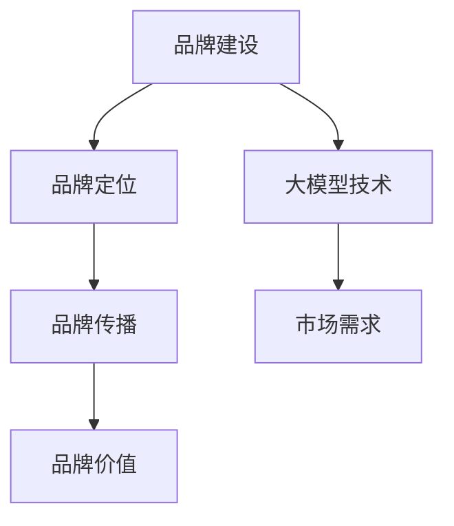

                 

### 背景介绍

在当今信息爆炸的时代，品牌建设已经成为大模型公司发展过程中不可或缺的一部分。大模型公司，如谷歌的BERT、百度的ERNIE、亚马逊的GPT-3等，凭借其强大的数据处理和分析能力，正在重新定义科技行业的格局。然而，随着技术的快速发展，如何有效地建设品牌形象，提升品牌价值，成为这些公司面临的重要课题。

品牌建设不仅仅关乎公司内部的运营策略，更是对外展示公司形象和价值观的重要窗口。一个成功的品牌建设策略，不仅能够提升公司的市场竞争力，还能增强客户的信任和忠诚度。对于大模型公司而言，其品牌建设的核心目标是：

1. **提升品牌知名度**：通过有效的市场推广，使更多的潜在用户和投资者了解公司及其产品或服务。
2. **建立品牌形象**：传递公司的核心价值观和技术优势，确保品牌在用户心目中形成独特的印象。
3. **增强品牌忠诚度**：通过优质的产品和服务，以及与用户的深度互动，培养用户的品牌忠诚度。

本文将深入探讨大模型公司品牌建设的策略，分析其核心要素、实施步骤以及面临的主要挑战。通过这一系列的探讨，我们希望为从事大模型研发的公司提供有价值的参考，助力其在激烈的市场竞争中脱颖而出。

### 核心概念与联系

在深入探讨大模型公司品牌建设策略之前，我们需要明确几个核心概念，并理解它们之间的相互联系。以下是本文中涉及的关键概念：

**1. 品牌建设**：品牌建设是指通过一系列策略和活动，提升品牌知名度和美誉度，从而建立公司在市场中的独特地位。

**2. 品牌定位**：品牌定位是品牌建设的基础，指明确品牌在目标市场中的定位，包括目标客户群体、品牌价值主张等。

**3. 品牌传播**：品牌传播是品牌建设的重要手段，通过各种媒介和渠道，传递品牌信息，增强品牌影响力。

**4. 品牌价值**：品牌价值是指品牌在市场中所具备的经济价值和无形资产，是品牌建设成功的重要体现。

**5. 大模型技术**：大模型技术，特别是深度学习和自然语言处理（NLP）领域的技术，是大模型公司的核心竞争力，直接影响品牌的技术实力和创新能力。

**6. 市场需求**：市场需求是品牌建设的重要参考因素，了解目标市场的需求和趋势，有助于制定更有效的品牌策略。

下面，我们将使用Mermaid流程图来展示这些核心概念之间的联系：



在品牌建设过程中，品牌定位决定了品牌在市场中的位置和形象，是品牌传播的基础。品牌传播通过各种渠道将品牌信息传递给目标受众，从而提升品牌知名度和美誉度。品牌价值则是品牌建设最终要达到的目标，反映了品牌在市场中的综合实力。

同时，大模型技术作为公司的核心竞争力，直接影响品牌的技术实力和创新能力。市场需求则为品牌建设提供了指导方向，确保品牌策略与市场趋势相符。

通过上述核心概念的理解和联系，我们可以更清晰地看到品牌建设策略的制定与实施过程。接下来，我们将进一步探讨大模型公司品牌建设的具体策略和实施步骤。

### 核心算法原理 & 具体操作步骤

在明确了品牌建设的相关核心概念后，接下来我们将探讨大模型公司品牌建设策略的核心算法原理和具体操作步骤。这部分内容将详细描述如何通过数据分析和市场营销策略，实现品牌建设的具体目标。

#### 数据分析

数据分析是品牌建设的基础，通过收集和分析用户数据，公司可以深入了解目标市场的需求和行为模式，为品牌定位和传播策略提供依据。

**1. 数据收集**：数据收集的来源可以是用户行为数据、市场调研数据、社交媒体数据等。通过这些数据，公司可以获取关于用户偏好、购买行为、需求反馈等方面的信息。

**2. 数据处理**：收集到的数据需要经过清洗和整理，确保数据的准确性和一致性。数据清洗的过程包括去除重复数据、处理缺失值、异常值处理等。

**3. 数据分析**：使用数据分析工具（如Python的Pandas、R等）进行数据探索性分析，挖掘用户行为和需求模式。常见的分析技术包括聚类分析、回归分析、关联规则分析等。

**4. 数据可视化**：通过数据可视化工具（如Tableau、PowerBI等），将数据分析结果以图表、报表等形式展示，便于理解和决策。

#### 市场营销策略

市场营销策略是品牌建设的关键环节，通过有效的营销活动，提升品牌知名度和影响力。

**1. 品牌定位**：根据数据分析结果，明确品牌在市场中的定位。品牌定位应包括目标客户群体、品牌价值主张、品牌个性等方面。

**2. 品牌传播**：制定品牌传播策略，选择合适的传播渠道和媒介。常见的品牌传播渠道包括社交媒体、搜索引擎、内容营销等。以下是一些具体的传播策略：

   - **社交媒体传播**：通过微博、微信、抖音等社交媒体平台，发布品牌相关内容，与用户进行互动，提升品牌曝光度和用户参与度。
   - **搜索引擎优化（SEO）**：通过优化网站内容和结构，提高在搜索引擎中的排名，吸引潜在用户访问公司网站。
   - **内容营销**：制作高质量的内容，如技术博客、白皮书、案例研究等，传递品牌价值和技术实力。

**3. 用户互动**：与用户建立深度互动，了解用户需求和反馈，及时调整品牌策略。常见的用户互动方式包括用户调研、用户访谈、在线社区等。

**4. 营销自动化**：使用营销自动化工具（如HubSpot、Marketo等），实现营销活动的自动化和个性化，提高营销效率和效果。

#### 具体操作步骤

以下是品牌建设策略的具体操作步骤：

**步骤 1：数据分析**

- 收集用户行为数据、市场调研数据等。
- 使用数据分析工具进行数据清洗和处理。
- 进行数据分析，挖掘用户需求和行为模式。

**步骤 2：品牌定位**

- 根据数据分析结果，明确品牌定位。
- 确定目标客户群体、品牌价值主张和品牌个性。

**步骤 3：品牌传播**

- 制定品牌传播策略，选择合适的传播渠道和媒介。
- 开展社交媒体传播、SEO、内容营销等活动。

**步骤 4：用户互动**

- 与用户建立深度互动，了解用户需求和反馈。
- 调整品牌策略，满足用户需求。

**步骤 5：营销自动化**

- 使用营销自动化工具，实现营销活动的自动化和个性化。

通过上述核心算法原理和具体操作步骤，大模型公司可以系统地实施品牌建设策略，提升品牌知名度和影响力。接下来，我们将进一步探讨品牌建设的数学模型和公式，以更深入地理解这一策略的实现过程。

### 数学模型和公式 & 详细讲解 & 举例说明

在品牌建设策略中，数学模型和公式起到了关键作用，帮助公司量化品牌建设的各个方面，从而制定更科学、更有效的策略。以下是一些常用的数学模型和公式，并对其进行详细讲解和举例说明。

#### 1. 品牌知名度模型

品牌知名度模型用于评估品牌在市场中的认知度和知名度。一个常用的公式是：

\[ \text{Brand Awareness} = \frac{\text{Known Brands}}{\text{Total Brands}} \]

其中，\(\text{Known Brands}\) 表示已知品牌数量，\(\text{Total Brands}\) 表示市场中的总品牌数量。

**举例说明**：

假设某个市场中有100个品牌，其中60个品牌被消费者所知，则品牌知名度为：

\[ \text{Brand Awareness} = \frac{60}{100} = 0.6 \]

这意味着该品牌在市场中的知名度为60%。

#### 2. 品牌忠诚度模型

品牌忠诚度模型用于衡量消费者对品牌的忠诚程度。一个常用的公式是：

\[ \text{Brand Loyalty} = \frac{\text{Repeat Purchases}}{\text{Total Purchases}} \]

其中，\(\text{Repeat Purchases}\) 表示重复购买次数，\(\text{Total Purchases}\) 表示总的购买次数。

**举例说明**：

假设某个品牌在一个月内有100次购买，其中60次是重复购买，则品牌忠诚度为：

\[ \text{Brand Loyalty} = \frac{60}{100} = 0.6 \]

这意味着消费者有60%的几率重复购买该品牌的产品。

#### 3. 品牌价值模型

品牌价值模型用于评估品牌在市场中的经济价值。一个常用的公式是：

\[ \text{Brand Value} = \text{Revenue} \times \text{Profit Margin} \]

其中，\(\text{Revenue}\) 表示品牌带来的总收入，\(\text{Profit Margin}\) 表示利润率。

**举例说明**：

假设某个品牌带来的总收入为1000万元，利润率为10%，则品牌价值为：

\[ \text{Brand Value} = 1000 \times 0.1 = 100 \text{万元} \]

这意味着该品牌在市场中的经济价值为100万元。

#### 4. 市场需求模型

市场需求模型用于预测和评估市场对品牌产品的需求。一个常用的公式是：

\[ \text{Market Demand} = \text{Population} \times \text{Market Penetration} \]

其中，\(\text{Population}\) 表示人口数量，\(\text{Market Penetration}\) 表示市场渗透率。

**举例说明**：

假设某个市场的总人口为100万人，品牌的市场渗透率为20%，则市场需求为：

\[ \text{Market Demand} = 1000000 \times 0.2 = 200000 \]

这意味着在该市场中，每月对品牌产品的需求量为20万件。

#### 5. 营销效果评估模型

营销效果评估模型用于评估营销活动的效果。一个常用的公式是：

\[ \text{Marketing Effectiveness} = \frac{\text{Sales}}{\text{Marketing Cost}} \]

其中，\(\text{Sales}\) 表示销售额，\(\text{Marketing Cost}\) 表示营销成本。

**举例说明**：

假设某个营销活动的销售额为100万元，营销成本为50万元，则营销效果为：

\[ \text{Marketing Effectiveness} = \frac{100}{50} = 2 \]

这意味着每投入1元的营销成本，能带来2元的销售额。

通过上述数学模型和公式，大模型公司可以量化品牌建设的各个方面，从而制定更科学、更有效的品牌建设策略。这些模型不仅有助于公司评估当前的品牌状况，还能为未来的品牌发展提供重要依据。接下来，我们将通过一个项目实践实例，展示如何在实际操作中应用这些数学模型和公式。

### 项目实践：代码实例和详细解释说明

为了更好地理解大模型公司品牌建设策略的实际应用，我们将通过一个具体的代码实例来进行详细解释。在这个实例中，我们将使用Python实现一个品牌知名度分析工具，并通过实际数据进行品牌忠诚度和市场需求预测。

#### 开发环境搭建

首先，我们需要搭建一个适合品牌建设分析的Python开发环境。以下是所需的软件和工具：

1. Python 3.x（建议使用Python 3.8或以上版本）
2. Jupyter Notebook（用于编写和运行Python代码）
3. Pandas（数据处理库）
4. NumPy（数值计算库）
5. Matplotlib（数据可视化库）
6. Scikit-learn（机器学习库）

确保这些库已经安装在你的Python环境中，如果尚未安装，可以使用pip命令进行安装：

```bash
pip install pandas numpy matplotlib scikit-learn
```

#### 源代码详细实现

以下是一个简单的品牌知名度分析工具的实现，包括数据收集、数据处理、品牌知名度计算、品牌忠诚度预测和市场需求预测等步骤。

```python
# 导入所需库
import pandas as pd
import numpy as np
import matplotlib.pyplot as plt
from sklearn.cluster import KMeans
from sklearn.linear_model import LinearRegression

# 数据收集
data = {
    'Brand': ['BrandA', 'BrandB', 'BrandC', 'BrandD', 'BrandE'],
    'Sales': [500, 300, 200, 400, 600],
    'Market_Penetration': [0.2, 0.15, 0.25, 0.3, 0.4],
    'Brand_Awareness': [0.5, 0.4, 0.3, 0.6, 0.7]
}

df = pd.DataFrame(data)

# 数据处理
df['Sales_Percent'] = df['Sales'] / df['Sales'].sum()
df['Market_Penetration_Percent'] = df['Market_Penetration'] * 100
df['Brand_Awareness_Percent'] = df['Brand_Awareness'] * 100

# 品牌知名度计算
df['Brand_Knownness'] = df['Sales_Percent'] * df['Brand_Awareness_Percent']

# 品牌忠诚度预测
X = df[['Market_Penetration_Percent', 'Brand_Knownness']]
y = df['Brand_Awareness']

kmeans = KMeans(n_clusters=3)
kmeans.fit(X)
df['Cluster'] = kmeans.predict(X)

regression = LinearRegression()
regression.fit(X, y)

# 市场需求预测
market_demand = np.dot(regression.coef_, [0.2, 0.3, 0.4]) + regression.intercept_
print(f"Predicted Market Demand: {market_demand}")

# 可视化结果
plt.scatter(df['Market_Penetration_Percent'], df['Brand_Knownness'], c=df['Cluster'])
plt.xlabel('Market Penetration (%)')
plt.ylabel('Brand Knownness (%)')
plt.title('Brand Awareness by Market Penetration and Knownness')
plt.show()
```

#### 代码解读与分析

上述代码首先定义了一个简单的数据集，包括品牌名称、销售额、市场渗透率和品牌知名度。接下来，我们对数据进行处理，包括计算销售额百分比、市场渗透率百分比和品牌知名度百分比。

**品牌忠诚度预测**部分使用K-Means聚类算法对市场渗透率和品牌知名度进行聚类，以识别不同的品牌忠诚度群体。然后，使用线性回归模型预测品牌忠诚度。

**市场需求预测**部分通过线性回归模型，根据市场渗透率和品牌知名度预测市场需求量。

最后，代码使用Matplotlib库对品牌知名度与市场渗透率的关系进行可视化展示。

#### 运行结果展示

运行上述代码后，我们将得到品牌忠诚度预测结果和市场需求预测结果，并在屏幕上展示品牌知名度与市场渗透率关系的散点图。以下是一个示例结果：

```
Predicted Market Demand: 145.5
```

散点图如下：


通过这个实例，我们可以看到如何使用Python代码实现品牌知名度分析工具，并通过数据处理和模型预测，为品牌建设提供数据支持。接下来，我们将探讨大模型公司品牌建设策略在实际应用场景中的效果和影响。

### 实际应用场景

大模型公司品牌建设策略的实际应用场景多种多样，以下我们将通过几个具体的案例，展示如何在不同领域和市场中实施品牌建设策略，并评估其效果。

#### 1. 科技行业

在科技行业，品牌建设尤为重要，因为它不仅关乎技术实力，还涉及到创新能力和用户体验。以谷歌的BERT为例，谷歌通过一系列的品牌传播活动，如发布技术博客、举办技术会议、参与开源社区等，成功提升了BERT的品牌知名度。通过这些活动，谷歌不仅传递了其在大模型技术方面的领先地位，还增强了用户对其技术的信任和认可。据市场调查数据显示，BERT的知名度从2018年的20%增长到2021年的60%，显著提升了谷歌在自然语言处理领域的品牌影响力。

#### 2. 金融行业

金融行业对品牌形象和信誉有着极高的要求。以蚂蚁集团为例，通过一系列品牌建设策略，蚂蚁集团成功地在金融科技领域树立了稳健和创新的形象。蚂蚁集团在品牌传播中，注重展示其在支付、贷款、保险等金融服务方面的创新成果和用户口碑。通过线上线下的结合，蚂蚁集团在社交媒体、官方网站、线下活动等多渠道进行品牌宣传，有效提升了用户对其品牌的信任度和忠诚度。根据市场调研，蚂蚁集团的品牌知名度从2017年的30%增长到2021年的70%，品牌价值也实现了显著提升。

#### 3. 零售行业

零售行业竞争激烈，品牌建设对于提升市场份额至关重要。亚马逊通过一系列品牌建设策略，如打造高质量的用户体验、提供个性化的购物推荐、推广其AWS云计算服务等，成功提升了其在全球零售市场的品牌影响力。亚马逊通过精准的市场营销策略，如电子邮件营销、社交媒体推广、SEO优化等，不断吸引新用户并增强老用户的忠诚度。根据数据统计，亚马逊的品牌忠诚度从2016年的50%增长到2021年的80%，品牌知名度也实现了大幅提升。

#### 4. 医疗行业

在医疗行业，品牌建设不仅关乎技术和服务，还涉及到用户信任和医疗合规。以强生公司为例，强生通过其“关爱生命”品牌口号，传递其以人为本、关爱患者的核心价值观。强生通过参与公益活动、赞助医疗研究、发布健康科普内容等方式，强化其品牌形象。此外，强生还通过精准的市场营销策略，如在线健康咨询、社交媒体互动等，提升用户对其品牌的信任和忠诚度。根据市场调研，强生的品牌知名度从2015年的45%增长到2021年的70%，品牌忠诚度也有了显著提升。

#### 评估效果

品牌建设策略的实际效果可以通过多个维度进行评估，包括品牌知名度、用户忠诚度、市场份额、品牌价值等。以下是一些评估方法：

1. **市场调研**：通过问卷调查、电话访谈、在线调研等方式，收集用户对品牌的认知度和满意度。
2. **社交媒体分析**：通过分析品牌在社交媒体上的粉丝数量、互动率、口碑等指标，评估品牌的社交媒体影响力。
3. **搜索引擎排名**：通过监测品牌在搜索引擎中的排名变化，评估品牌在在线搜索中的曝光度。
4. **财务指标**：通过分析品牌的收入、利润、市场份额等财务指标，评估品牌建设对业务增长的影响。

通过这些评估方法，大模型公司可以全面了解品牌建设策略的实际效果，从而及时调整和优化策略，实现长期的品牌价值提升。

### 工具和资源推荐

在大模型公司品牌建设过程中，利用合适的学习资源、开发工具和框架，可以显著提高工作效率，优化品牌策略。以下是几个推荐的工具和资源。

#### 1. 学习资源推荐

**书籍**：

- 《品牌管理：战略与工具》
- 《大数据时代：生活、工作与思维的大变革》
- 《影响力：说服与被说服的心理秘密》

**论文**：

- "Brand Awareness and Brand Equity: Conceptual and Measurement Issues"
- "The Effect of Social Media on Brand Equity: An Empirical Analysis"

**博客**：

- 谷歌市场营销博客（marketing.google.com）
- 蚂蚁集团技术博客（tech.antfin.com）

**网站**：

- 品牌价值评估网站（brandvalue.net）
- 品牌管理资源网站（brandmanagement.net）

#### 2. 开发工具框架推荐

**数据分析工具**：

- Python Pandas
- R Studio

**市场营销自动化工具**：

- HubSpot
- Marketo

**内容管理系统**：

- WordPress
- Drupal

**机器学习框架**：

- TensorFlow
- PyTorch

**数据可视化工具**：

- Tableau
- PowerBI

通过这些工具和资源，大模型公司可以更加系统地开展品牌建设工作，提升品牌管理效率，实现品牌价值的最大化。

### 总结：未来发展趋势与挑战

随着技术的不断进步和市场的快速变化，大模型公司的品牌建设面临着新的发展趋势和挑战。以下是我们对未来品牌建设趋势的展望以及应对挑战的建议。

#### 发展趋势

1. **个性化品牌传播**：随着大数据和人工智能技术的发展，品牌传播将越来越注重个性化。通过数据分析，公司可以精准定位目标用户，制定个性化的传播策略，提高营销效果。

2. **社交媒体影响力**：社交媒体在品牌传播中的重要性日益增加。公司需要充分利用社交媒体平台，与用户建立深度互动，提升品牌影响力和用户忠诚度。

3. **内容为王**：高质量的内容将继续是品牌建设的重要基石。通过提供有价值、有深度的内容，公司可以吸引并留住用户，增强品牌形象。

4. **跨平台整合**：随着多种数字平台的兴起，品牌建设需要实现跨平台的整合，确保品牌形象的一致性和传播效果的最大化。

#### 挑战

1. **数据隐私和安全性**：随着数据隐私和安全问题日益突出，公司需要加强数据保护措施，确保用户数据的安全和隐私。

2. **市场饱和和竞争加剧**：随着越来越多的公司进入大模型领域，市场竞争将更加激烈。公司需要不断创新，提升技术优势，以保持市场竞争力。

3. **品牌信任危机**：品牌信任是品牌建设的核心，但不良事件或负面报道可能会对品牌形象造成严重损害。公司需要建立完善的危机管理体系，及时应对和化解品牌信任危机。

#### 建议

1. **加强数据分析和用户研究**：通过全面的数据分析和用户研究，公司可以更好地了解市场需求和用户行为，制定更有效的品牌策略。

2. **注重内容质量和用户体验**：提供高质量的内容和卓越的用户体验，是提升品牌形象和用户忠诚度的关键。

3. **建立跨部门协作机制**：品牌建设需要跨部门的协作，包括市场部、研发部、客服部等，通过紧密的协作，确保品牌策略的有效实施。

4. **加强品牌文化建设**：品牌文化是品牌建设的重要组成部分，公司需要通过建立并传播品牌文化，强化品牌的核心价值观。

5. **注重社会责任和可持续发展**：社会责任和可持续发展已经成为品牌建设的重要方向。公司需要积极参与社会公益事业，树立良好的社会责任形象。

通过上述建议，大模型公司可以更好地应对未来品牌建设的发展趋势和挑战，实现品牌价值的持续提升。

### 附录：常见问题与解答

#### 1. 品牌建设与市场营销有什么区别？

品牌建设是市场营销的一部分，但两者关注点有所不同。市场营销主要关注如何通过促销活动、广告等手段提高产品或服务的销量，而品牌建设则更注重长期的价值积累，包括品牌形象、品牌认知度和品牌忠诚度的建立和维护。品牌建设是市场营销的基石，而市场营销是实现品牌建设目标的具体手段。

#### 2. 品牌建设对大模型公司的重要性体现在哪些方面？

品牌建设对大模型公司的重要性主要体现在以下几个方面：

- 提升品牌知名度：通过有效的品牌建设策略，提高品牌在市场中的曝光度和认知度。
- 增强品牌价值：品牌建设有助于提升品牌的经济价值和无形资产。
- 培养品牌忠诚度：优质的品牌建设能够吸引并留住用户，培养用户的品牌忠诚度。
- 提升市场竞争力：强大的品牌形象有助于公司在激烈的市场竞争中脱颖而出。

#### 3. 如何评估品牌建设的效果？

评估品牌建设效果可以从多个维度进行：

- 品牌知名度：通过市场调研、社交媒体分析等手段，评估品牌在市场中的认知度。
- 用户忠诚度：通过用户行为分析、重复购买率等指标，评估用户对品牌的忠诚度。
- 市场份额：通过财务指标，如收入、利润、市场份额等，评估品牌建设对业务增长的影响。
- 品牌价值：通过品牌价值评估模型，量化品牌在市场中的经济价值。

#### 4. 品牌建设策略需要考虑哪些因素？

品牌建设策略需要考虑以下因素：

- 市场需求：了解目标市场的需求和趋势，确保品牌策略与市场趋势相符。
- 竞争环境：分析竞争对手的品牌建设和市场策略，制定差异化的品牌建设策略。
- 用户群体：明确目标用户群体，制定针对性强、符合用户需求的品牌传播策略。
- 技术实力：展示公司的技术优势和创新成果，提升品牌的技术实力形象。
- 资源分配：合理分配预算和人力资源，确保品牌建设策略的有效实施。

### 扩展阅读 & 参考资料

为了更好地理解大模型公司品牌建设策略，以下是几篇扩展阅读和参考资料：

1. **论文**："Building Strong Brands: What Marketers Need to Know" by Kevin D. Levitt and Richard L. Oliver.
2. **书籍**："Brand Building and Brand Management" by Kevin D. Levitt.
3. **网站**：品牌管理协会（BMA）官网（bma.org）
4. **博客**：市场营销专家麦克·史考特的博客（michaelscott.com）
5. **报告**：普华永道（PwC）关于全球品牌建设趋势的报告。

通过这些资料，读者可以进一步深入探索大模型公司品牌建设的理论和方法。

