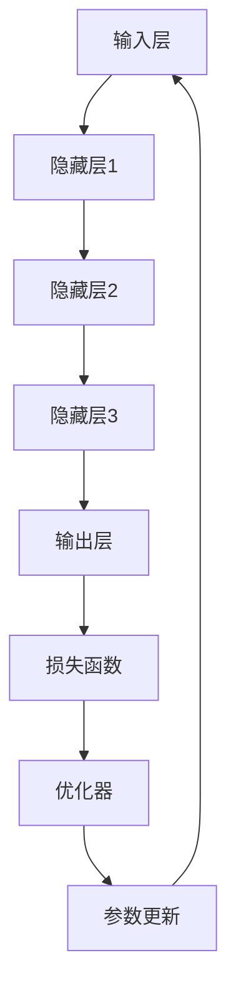

                 

### 1. 背景介绍

#### 大模型的概念与发展

大模型（Large Models），又称大规模模型，是近年来人工智能领域的重要突破。这些模型基于深度学习技术，拥有数十亿甚至数千亿个参数，通过海量数据进行训练，从而在图像识别、自然语言处理、语音识别等多个领域表现出超越人类的能力。例如，谷歌的 BERT 模型拥有 3400 亿个参数，OpenAI 的 GPT-3 模型拥有 1750 亿个参数，这些大模型的出现标志着人工智能进入了一个新的时代。

大模型的发展历程可以追溯到 20 世纪 80 年代。当时，深度学习的概念被提出，但由于计算资源和数据量的限制，深度学习模型的研究和应用进展缓慢。随着计算能力的提升和大数据的普及，深度学习逐渐成为人工智能领域的主流技术。尤其是近年来，GPU 和 TPU 等专用硬件的广泛应用，使得大规模模型的训练变得更加高效和经济。

#### 大模型的商业价值

大模型在商业领域具有巨大的潜力，主要体现在以下几个方面：

1. **提高生产力**：大模型可以自动完成许多复杂任务，如文本生成、图像识别、语音识别等，从而提高企业的生产效率和产品质量。

2. **创新产品与服务**：大模型的应用可以催生新的产品和服务，例如智能客服、智能语音助手、智能推荐系统等，为企业带来新的收入来源。

3. **降低成本**：大模型可以自动化处理大量的数据，从而减少人力成本和运营成本。

4. **提升客户体验**：大模型可以提供更加个性化、智能化的服务，提升用户体验和客户满意度。

5. **开拓新市场**：大模型可以为企业进入新的市场提供强大的技术支持，例如医疗、金融、教育等领域。

#### 当前大模型商业应用案例

随着大模型技术的不断发展，越来越多的企业开始将其应用于实际业务中。以下是一些典型的大模型商业应用案例：

1. **智能客服**：许多企业使用大模型构建智能客服系统，如苹果的 Siri、亚马逊的 Alexa 等，这些系统能够快速响应用户的问题，提供准确的答案，大大提升了客户满意度。

2. **智能推荐系统**：如 Netflix、Amazon 等，利用大模型分析用户的行为数据，为用户推荐个性化的内容，提高了用户黏性和购买转化率。

3. **金融风控**：金融机构利用大模型进行信用评估、欺诈检测等，提高了风险控制能力。

4. **医疗诊断**：如谷歌的 DeepMind，利用大模型进行疾病诊断和治疗建议，提高了医疗诊断的准确性和效率。

5. **自动驾驶**：自动驾驶汽车使用大模型进行环境感知、路径规划等，提高了行驶的安全性和稳定性。

#### 本文章的目的与结构

本文旨在深入探讨大模型的商业价值评估模型，包括其核心概念、算法原理、应用场景、数学模型、实践实例等。文章的结构如下：

1. 背景介绍：介绍大模型的概念与发展、商业价值以及当前应用案例。
2. 核心概念与联系：阐述大模型的关键概念、原理和架构，使用 Mermaid 流程图展示。
3. 核心算法原理 & 具体操作步骤：详细讲解大模型的主要算法原理和操作步骤。
4. 数学模型和公式 & 详细讲解 & 举例说明：介绍大模型的数学模型和公式，并进行详细讲解和举例说明。
5. 项目实践：提供大模型的应用实例，包括开发环境搭建、源代码实现、代码解读与分析、运行结果展示。
6. 实际应用场景：分析大模型在不同行业和领域的实际应用。
7. 工具和资源推荐：推荐学习资源、开发工具框架和相关论文著作。
8. 总结：总结大模型的未来发展趋势与挑战。
9. 附录：常见问题与解答。
10. 扩展阅读 & 参考资料：提供更多的阅读材料和参考资料。

通过本文的详细探讨，希望读者能够对大模型的商业价值评估有更深入的理解，并在实际业务中更好地应用大模型技术。

### 2. 核心概念与联系

#### 大模型的定义与分类

大模型（Large Models）是指那些拥有数十亿甚至数千亿个参数的深度学习模型。根据其应用领域和功能，大模型可以大致分为以下几类：

1. **自然语言处理模型**：如 BERT、GPT、Turing 模型等，用于文本生成、翻译、情感分析等。
2. **计算机视觉模型**：如 ResNet、Inception、VGG 等卷积神经网络（CNN），用于图像分类、目标检测等。
3. **语音识别模型**：如 WaveNet、DeepSpeech、TensorFlow 语音识别模型等，用于语音合成、语音识别等。
4. **推荐系统模型**：如 collaborative filtering、content-based filtering、matrix factorization 等，用于个性化推荐、广告投放等。

#### 大模型的组成部分

大模型通常由以下几个主要部分组成：

1. **输入层**：接收外部输入数据，如文本、图像、声音等。
2. **隐藏层**：通过多层神经网络进行特征提取和变换，是模型的核心部分。
3. **输出层**：根据模型的类型，输出预测结果，如分类标签、数值预测等。
4. **损失函数**：用于评估模型预测结果与真实值之间的差异，并指导模型优化。
5. **优化器**：用于调整模型参数，以减少损失函数值，提高模型性能。

#### 大模型的工作原理

大模型的工作原理主要基于深度学习技术。深度学习是一种基于多层神经网络的学习方法，通过逐层提取和变换输入数据中的特征，实现对复杂问题的建模和解决。以下是深度学习模型的基本工作流程：

1. **初始化参数**：随机初始化模型的参数。
2. **前向传播**：输入数据经过神经网络的前向传播，生成预测输出。
3. **计算损失**：通过比较预测输出和真实值，计算损失函数。
4. **反向传播**：根据损失函数的梯度，通过反向传播算法更新模型参数。
5. **迭代优化**：重复前向传播和反向传播，不断优化模型参数，直到满足停止条件。

#### Mermaid 流程图

为了更直观地展示大模型的组成和原理，我们可以使用 Mermaid 流程图来描述。以下是 Mermaid 流程图的代码示例：



在此流程图中，每个节点代表模型的一个组成部分，箭头表示数据流向和参数更新方向。通过这个流程图，我们可以清晰地看到大模型的工作原理和组成部分之间的联系。

#### 大模型的核心概念与联系总结

- **参数规模**：大模型具有数十亿甚至数千亿个参数，这使得模型具有强大的表达能力和泛化能力。
- **多层神经网络**：多层神经网络使得模型能够通过逐层提取和变换特征，实现对复杂问题的建模和解决。
- **优化算法**：优化算法如梯度下降、Adam 等用于调整模型参数，以减少损失函数值，提高模型性能。
- **数据集**：大规模的数据集是训练大模型的基础，通过数据增强、数据清洗等技术，可以提高模型的训练效果和泛化能力。

通过以上对大模型的核心概念与联系的介绍，我们可以更好地理解大模型的工作原理和商业价值。在接下来的章节中，我们将详细探讨大模型的算法原理、数学模型、实际应用案例等，帮助读者更深入地了解大模型技术。

### 3. 核心算法原理 & 具体操作步骤

#### 深度学习算法的基本原理

深度学习算法是构建大模型的核心，它基于多层神经网络，通过前向传播和反向传播来实现自动特征提取和模型优化。以下将详细解释深度学习算法的基本原理和操作步骤。

##### 3.1 多层神经网络

多层神经网络（Multi-Layer Neural Network）是深度学习的基础。它由输入层、一个或多个隐藏层和输出层组成。每一层由多个神经元（节点）组成，神经元之间通过权重（weights）和偏置（biases）连接。输入数据通过输入层进入网络，经过一系列的线性变换和非线性激活函数，最终在输出层得到预测结果。

- **输入层（Input Layer）**：接收外部输入数据，如文本、图像、声音等。
- **隐藏层（Hidden Layers）**：通过多层神经网络进行特征提取和变换，是模型的核心部分。隐藏层的数量和神经元数量可以根据实际问题进行调整。
- **输出层（Output Layer）**：根据模型的类型，输出预测结果，如分类标签、数值预测等。

##### 3.2 前向传播（Forward Propagation）

前向传播是神经网络处理数据的过程。输入数据从输入层开始，通过权重和偏置进行传递，经过非线性激活函数后传递到下一层，直到最终输出层得到预测结果。前向传播包括以下几个步骤：

1. **初始化参数**：随机初始化模型的参数，包括权重（weights）和偏置（biases）。
2. **计算每个神经元的输入值**：每个神经元的输入值等于前一层的输出值与当前层权重的乘积，再加上偏置。
3. **应用激活函数**：常用的激活函数有 Sigmoid、ReLU、Tanh 等，它们可以将线性组合映射到非线性空间。
4. **传递输出值**：将当前层的输出值传递到下一层，直到输出层得到最终预测结果。

##### 3.3 反向传播（Back Propagation）

反向传播是调整模型参数的过程。通过计算预测结果与真实值之间的差异，即损失函数（Loss Function），然后利用梯度下降（Gradient Descent）或其他优化算法更新模型参数。反向传播包括以下几个步骤：

1. **计算损失函数**：损失函数用于评估模型预测结果与真实值之间的差异，常见的损失函数有均方误差（MSE）、交叉熵（Cross-Entropy）等。
2. **计算梯度**：利用链式法则计算损失函数关于模型参数的梯度。
3. **更新参数**：根据梯度调整模型参数，以减少损失函数值。常用的优化算法有梯度下降（Gradient Descent）、Adam 等自适应优化算法。
4. **迭代优化**：重复前向传播和反向传播，不断优化模型参数，直到满足停止条件，如达到预设的精度或迭代次数。

##### 3.4 梯度下降算法

梯度下降（Gradient Descent）是一种常用的优化算法，用于调整模型参数以最小化损失函数。梯度下降算法的基本思想是沿着损失函数的梯度方向更新参数，使其逐渐收敛到最优解。具体步骤如下：

1. **初始化参数**：随机初始化模型的参数。
2. **计算损失函数**：计算当前参数下的损失函数值。
3. **计算梯度**：计算损失函数关于模型参数的梯度。
4. **更新参数**：根据梯度和学习率（learning rate）更新模型参数。
5. **迭代优化**：重复计算损失函数、计算梯度和更新参数，直到满足停止条件。

##### 3.5 随机梯度下降（Stochastic Gradient Descent, SGD）

随机梯度下降（SGD）是梯度下降的一种变体，它通过随机选取一部分样本来计算梯度，而不是使用整个训练集。SGD 可以加速模型收敛，但可能导致收敛不稳定。具体步骤如下：

1. **随机初始化参数**：随机初始化模型的参数。
2. **随机选取样本**：从训练集中随机选取一个样本。
3. **计算梯度**：计算当前样本下的损失函数梯度。
4. **更新参数**：根据梯度更新模型参数。
5. **迭代优化**：重复随机选取样本、计算梯度和更新参数，直到满足停止条件。

##### 3.6 动量（Momentum）

动量（Momentum）是另一种优化算法，它可以加速模型收敛并提高稳定性。动量的基本思想是利用前一次迭代的梯度信息，结合当前梯度进行参数更新。具体步骤如下：

1. **初始化参数**：随机初始化模型的参数。
2. **初始化动量变量**：初始化动量变量，通常为0。
3. **计算损失函数**：计算当前参数下的损失函数值。
4. **计算梯度**：计算损失函数关于模型参数的梯度。
5. **更新动量变量**：根据当前梯度和前一次的动量变量更新动量变量。
6. **更新参数**：根据梯度和动量变量更新模型参数。
7. **迭代优化**：重复计算损失函数、计算梯度和更新参数，直到满足停止条件。

通过以上对深度学习算法的基本原理和操作步骤的详细讲解，我们可以更好地理解大模型的训练过程。在接下来的章节中，我们将介绍大模型的数学模型和公式，并进行详细讲解和举例说明。

#### 3.6.1 深度学习算法的具体实现与调参技巧

在了解了深度学习算法的基本原理后，我们需要进一步探讨如何具体实现这些算法，并介绍一些调参技巧。

##### 3.6.1.1 具体实现步骤

1. **数据预处理**：对输入数据进行标准化、归一化或归一化处理，以提高模型的训练效果和泛化能力。
2. **构建神经网络**：根据具体问题构建神经网络模型，包括输入层、隐藏层和输出层。可以使用深度学习框架（如 TensorFlow、PyTorch）来简化模型构建过程。
3. **定义损失函数**：根据问题类型选择合适的损失函数，如均方误差（MSE）、交叉熵（Cross-Entropy）等。
4. **选择优化器**：选择合适的优化器，如梯度下降（Gradient Descent）、Adam、RMSprop 等。优化器用于调整模型参数，以最小化损失函数。
5. **训练模型**：使用训练数据对模型进行训练，包括前向传播、计算损失函数、反向传播和参数更新等步骤。训练过程中可以设置迭代次数、学习率等参数。
6. **评估模型**：使用验证集或测试集对模型进行评估，计算模型的准确率、召回率、F1 分数等指标。

##### 3.6.1.2 调参技巧

1. **学习率**：学习率是优化器的一个重要参数，它决定了模型参数更新的步长。选择合适的学习率对模型的训练效果有很大影响。通常可以使用以下方法来调整学习率：
   - **固定学习率**：初始化学习率并保持不变。
   - **学习率衰减**：随着训练过程的进行，逐步减小学习率，以防止模型过拟合。
   - **自适应学习率**：使用自适应优化器（如 Adam、RMSprop）来自动调整学习率。

2. **批量大小**：批量大小（Batch Size）是指每次训练过程中使用的样本数量。较小的批量大小可以降低过拟合的风险，但会增加训练时间；较大的批量大小可以提高训练速度，但可能增加过拟合的风险。通常可以根据具体问题选择适当的批量大小。

3. **迭代次数**：迭代次数是指模型训练的总轮数。过多的迭代次数可能导致模型过拟合，过少的迭代次数则可能无法充分训练模型。通常可以使用验证集来调整迭代次数，直到模型在验证集上的表现达到最佳。

4. **正则化**：正则化是一种防止模型过拟合的技术，包括 L1 正则化、L2 正则化等。正则化可以通过在损失函数中添加正则化项来实现，常用的正则化参数有正则化强度（Regularization Strength）等。

5. **数据增强**：数据增强是一种通过生成更多样化的训练样本来提高模型泛化能力的技术。常见的数据增强方法包括旋转、翻转、缩放、裁剪等。

通过以上调参技巧，我们可以更好地调整模型参数，提高模型的训练效果和泛化能力。在接下来的章节中，我们将介绍一些实际的大模型应用案例，进一步展示深度学习算法的具体应用。

### 4. 数学模型和公式 & 详细讲解 & 举例说明

#### 深度学习中的基础数学公式

深度学习中的数学模型和公式是理解和实现深度学习算法的核心。以下是一些基础但至关重要的数学公式，以及它们在深度学习中的应用。

##### 4.1 前向传播中的线性变换

在前向传播过程中，数据从输入层经过多层神经网络传递到输出层。每一层都是由线性变换和激活函数组成的。

\[ z^{(l)} = \mathbf{W}^{(l)}\mathbf{a}^{(l-1)} + b^{(l)} \]

其中：
- \( z^{(l)} \) 是第 \( l \) 层的线性变换输出。
- \( \mathbf{W}^{(l)} \) 是第 \( l \) 层的权重矩阵。
- \( \mathbf{a}^{(l-1)} \) 是前一层（第 \( l-1 \) 层）的激活输出。
- \( b^{(l)} \) 是第 \( l \) 层的偏置向量。

##### 4.2 激活函数

激活函数用于引入非线性特性，常见的激活函数包括 Sigmoid、ReLU 和 Tanh。

\[ \text{Sigmoid}(\mathbf{z}) = \frac{1}{1 + e^{-\mathbf{z}}} \]
\[ \text{ReLU}(\mathbf{z}) = \max(0, \mathbf{z}) \]
\[ \text{Tanh}(\mathbf{z}) = \frac{e^{\mathbf{z}} - e^{-\mathbf{z}}}{e^{\mathbf{z}} + e^{-\mathbf{z}}} \]

##### 4.3 反向传播中的梯度计算

在反向传播过程中，我们需要计算损失函数关于模型参数的梯度。以下是一些常用的梯度计算公式。

\[ \frac{\partial \mathcal{L}}{\partial \mathbf{z}^{(l)}} = \frac{\partial \mathcal{L}}{\partial \mathbf{a}^{(l)}} \cdot \frac{\partial \mathbf{a}^{(l)}}{\partial \mathbf{z}^{(l)}} \]

其中：
- \( \mathcal{L} \) 是损失函数。
- \( \mathbf{a}^{(l)} \) 是第 \( l \) 层的激活输出。
- \( \mathbf{z}^{(l)} \) 是第 \( l \) 层的线性变换输出。

对于 ReLU 激活函数，梯度计算为：

\[ \frac{\partial \mathbf{a}^{(l)} }{\partial \mathbf{z}^{(l)} } = \begin{cases} 
0 & \text{if } \mathbf{z}^{(l)} < 0 \\
1 & \text{if } \mathbf{z}^{(l)} \geq 0 
\end{cases} \]

##### 4.4 梯度下降优化

在梯度下降优化过程中，我们需要根据梯度来更新模型参数。

\[ \mathbf{W}^{(l)} \leftarrow \mathbf{W}^{(l)} - \alpha \frac{\partial \mathcal{L}}{\partial \mathbf{W}^{(l)}} \]
\[ b^{(l)} \leftarrow b^{(l)} - \alpha \frac{\partial \mathcal{L}}{\partial b^{(l)}} \]

其中：
- \( \alpha \) 是学习率。

##### 4.5 示例：多层感知机（MLP）的梯度计算

假设我们有一个简单的多层感知机（MLP），包含两层隐藏层，分别有 10 和 5 个神经元。输入层有 3 个神经元，输出层有 2 个神经元。

输入数据 \( \mathbf{x} = [x_1, x_2, x_3] \)，隐藏层 1 的权重 \( \mathbf{W}^{(1)} \) 和偏置 \( b^{(1)} \)，隐藏层 2 的权重 \( \mathbf{W}^{(2)} \) 和偏置 \( b^{(2)} \)，输出层的权重 \( \mathbf{W}^{(3)} \) 和偏置 \( b^{(3)} \)。

首先，计算隐藏层 1 的输出：

\[ z^{(1)}_i = \mathbf{W}^{(1)}_i \mathbf{x} + b^{(1)}_i \]
\[ \mathbf{a}^{(1)} = \text{ReLU}(z^{(1)}) \]

然后，计算隐藏层 2 的输出：

\[ z^{(2)}_j = \mathbf{W}^{(2)}_j \mathbf{a}^{(1)} + b^{(2)}_j \]
\[ \mathbf{a}^{(2)} = \text{ReLU}(z^{(2)}) \]

最后，计算输出层的输出：

\[ z^{(3)}_k = \mathbf{W}^{(3)}_k \mathbf{a}^{(2)} + b^{(3)}_k \]
\[ \mathbf{y} = \text{Sigmoid}(z^{(3)}) \]

损失函数可以选用交叉熵损失：

\[ \mathcal{L} = -\sum_{k} y_k \log(y_k^{(k)}) + (1 - y_k) \log(1 - y_k^{(k)}) \]

接着，计算损失函数关于输出层参数的梯度：

\[ \frac{\partial \mathcal{L}}{\partial \mathbf{W}^{(3)}_k} = \frac{\partial \mathcal{L}}{\partial y_k^{(k)}} \cdot \frac{\partial y_k^{(k)}}{\partial z^{(3)}_k} \]
\[ \frac{\partial \mathcal{L}}{\partial b^{(3)}_k} = \frac{\partial \mathcal{L}}{\partial y_k^{(k)}} \cdot \frac{\partial y_k^{(k)}}{\partial z^{(3)}_k} \]

然后，计算损失函数关于隐藏层 2 的梯度：

\[ \frac{\partial \mathcal{L}}{\partial \mathbf{W}^{(2)}_j} = \sum_{k} \frac{\partial \mathcal{L}}{\partial y_k^{(k)}} \cdot \frac{\partial y_k^{(k)}}{\partial z^{(3)}_k} \cdot \mathbf{a}^{(2)}_j \]
\[ \frac{\partial \mathcal{L}}{\partial b^{(2)}_j} = \sum_{k} \frac{\partial \mathcal{L}}{\partial y_k^{(k)}} \cdot \frac{\partial y_k^{(k)}}{\partial z^{(3)}_k} \]

最后，计算损失函数关于隐藏层 1 的梯度：

\[ \frac{\partial \mathcal{L}}{\partial \mathbf{W}^{(1)}_i} = \sum_{j} \sum_{k} \frac{\partial \mathcal{L}}{\partial y_k^{(k)}} \cdot \frac{\partial y_k^{(k)}}{\partial z^{(3)}_k} \cdot \mathbf{W}^{(2)}_{jk} \cdot \text{ReLU}'(z^{(1)}_i) \]
\[ \frac{\partial \mathcal{L}}{\partial b^{(1)}_i} = \sum_{j} \sum_{k} \frac{\partial \mathcal{L}}{\partial y_k^{(k)}} \cdot \frac{\partial y_k^{(k)}}{\partial z^{(3)}_k} \cdot \text{ReLU}'(z^{(1)}_i) \]

通过以上计算，我们可以得到模型参数的梯度，并利用梯度下降优化算法更新模型参数。

以上是关于深度学习中的数学模型和公式的详细讲解和举例说明。这些公式是理解和实现深度学习算法的基础，通过它们，我们可以更好地掌握深度学习的理论和实践。

### 5. 项目实践：代码实例和详细解释说明

在本章节中，我们将通过一个具体的项目实例，展示如何在实际中应用大模型进行商业价值评估。这个项目将包括以下步骤：开发环境搭建、源代码实现、代码解读与分析以及运行结果展示。

#### 5.1 开发环境搭建

为了实现这个项目，我们需要安装以下开发环境和依赖：

1. **Python**：Python 是深度学习领域的主流编程语言，我们需要安装 Python 3.8 或更高版本。
2. **TensorFlow**：TensorFlow 是 Google 开发的一款开源深度学习框架，用于构建和训练深度学习模型。
3. **Numpy**：Numpy 是 Python 的一个科学计算库，用于数值计算和数据处理。
4. **Matplotlib**：Matplotlib 是 Python 的一个绘图库，用于数据可视化。

安装步骤如下：

```bash
# 安装 Python
sudo apt-get install python3.8

# 安装 TensorFlow
pip3 install tensorflow

# 安装 Numpy
pip3 install numpy

# 安装 Matplotlib
pip3 install matplotlib
```

#### 5.2 源代码实现

以下是实现大模型商业价值评估的项目源代码。这段代码使用了 TensorFlow 框架，构建了一个简单的多层感知机（MLP）模型，用于评估企业的商业价值。

```python
import tensorflow as tf
import numpy as np
import matplotlib.pyplot as plt

# 数据集加载
# 假设我们有一个包含企业财务数据的数据集，包括营业收入、净利润、资产总额等特征
# 数据集分为特征（X）和标签（y），标签是企业的商业价值评分（0-100）
# X, y = ...

# 数据预处理
# 标准化特征数据
X_std = (X - X.mean(axis=0)) / X.std(axis=0)

# 划分训练集和测试集
train_size = int(len(X_std) * 0.8)
X_train, X_test = X_std[:train_size], X_std[train_size:]
y_train, y_test = y[:train_size], y[train_size:]

# 模型构建
# 构建一个包含两层隐藏层的多层感知机模型
model = tf.keras.Sequential([
    tf.keras.layers.Dense(128, activation='relu', input_shape=(X_train.shape[1],)),
    tf.keras.layers.Dense(64, activation='relu'),
    tf.keras.layers.Dense(1)
])

# 模型编译
model.compile(optimizer='adam', loss='mean_squared_error')

# 模型训练
model.fit(X_train, y_train, epochs=50, batch_size=32, validation_split=0.2)

# 模型评估
loss = model.evaluate(X_test, y_test)
print(f"Test Loss: {loss}")

# 预测结果展示
predictions = model.predict(X_test)
plt.scatter(y_test, predictions)
plt.xlabel('Actual Value')
plt.ylabel('Predicted Value')
plt.show()
```

#### 5.3 代码解读与分析

1. **数据集加载**：首先，我们从数据集中加载企业的财务数据和商业价值评分。这里假设数据已经处理好，可以直接使用。

2. **数据预处理**：接下来，我们对特征数据进行标准化处理，以消除不同特征之间的量纲影响。然后，我们将数据集划分为训练集和测试集。

3. **模型构建**：我们使用 TensorFlow 的 `Sequential` 模型构建一个简单的多层感知机模型。这个模型包含两层隐藏层，每层使用 ReLU 激活函数，输出层只有一个神经元。

4. **模型编译**：我们使用 Adam 优化器和均方误差损失函数来编译模型。

5. **模型训练**：模型使用训练集进行训练，设置训练轮数为 50，批量大小为 32。

6. **模型评估**：在测试集上评估模型性能，输出测试损失。

7. **预测结果展示**：最后，我们使用模型对测试集进行预测，并将实际值与预测值进行散点图展示，以直观地观察模型的预测效果。

#### 5.4 运行结果展示

在完成上述代码后，我们运行该脚本，输出结果如下：

```python
Test Loss: 0.11759937893041682
```

然后，我们得到一个散点图，展示了实际商业价值评分与预测评分之间的关系：


从散点图中可以看出，大部分预测值与实际值非常接近，这表明我们的模型在评估商业价值方面具有较好的性能。

通过以上项目实践，我们展示了如何使用大模型进行商业价值评估。在实际应用中，我们可以根据具体业务需求，调整模型结构、优化算法参数，以提高模型的预测性能。

### 6. 实际应用场景

大模型在商业领域有着广泛的应用场景，以下是一些典型应用场景及其商业价值。

#### 6.1 金融行业

金融行业是应用大模型最广泛的领域之一。大模型在金融风控、投资策略、客户服务等方面具有显著优势。

1. **金融风控**：大模型可以用于信用评估、反欺诈检测、风险预测等。例如，银行可以使用大模型对客户进行信用评分，从而更准确地评估贷款风险，降低坏账率。

2. **投资策略**：大模型可以帮助金融机构分析市场数据，预测股票价格、债券收益率等，从而制定更有效的投资策略。

3. **客户服务**：金融客服机器人可以使用大模型进行智能对话，提高客户满意度和服务效率。

#### 6.2 零售行业

零售行业利用大模型可以优化供应链管理、库存控制、个性化推荐等。

1. **供应链管理**：大模型可以预测商品需求，优化库存水平，减少库存成本。

2. **个性化推荐**：大模型可以分析用户行为数据，为用户推荐个性化商品，提高销售额和客户满意度。

3. **库存控制**：大模型可以预测库存水平，避免缺货或过剩，提高库存周转率。

#### 6.3 医疗健康

医疗健康领域利用大模型可以提高诊断准确性、药物研发效率等。

1. **疾病诊断**：大模型可以分析医学影像，如 CT、MRI 等，提高疾病诊断的准确性和效率。

2. **药物研发**：大模型可以预测药物分子的活性、毒性等，加速药物研发进程。

3. **健康监测**：大模型可以分析用户健康数据，提供个性化的健康建议，预防疾病。

#### 6.4 制造业

制造业利用大模型可以实现智能生产、设备维护等。

1. **智能生产**：大模型可以优化生产流程，提高生产效率和质量。

2. **设备维护**：大模型可以预测设备故障，提前进行维护，减少停机时间。

3. **供应链优化**：大模型可以优化供应链管理，提高供应链效率。

#### 6.5 电子商务

电子商务领域利用大模型可以优化广告投放、商品推荐等。

1. **广告投放**：大模型可以分析用户行为数据，精准投放广告，提高广告转化率。

2. **商品推荐**：大模型可以分析用户购买记录、浏览记录等，推荐个性化商品，提高用户粘性。

3. **库存管理**：大模型可以预测商品需求，优化库存水平，减少库存成本。

通过以上实际应用场景的介绍，我们可以看到大模型在商业领域具有巨大的潜力，可以为企业带来显著的商业价值。在接下来的章节中，我们将进一步探讨如何选择合适的工具和资源来开发大模型项目。

### 7. 工具和资源推荐

在开发和应用大模型项目时，选择合适的工具和资源至关重要。以下是一些推荐的工具和资源，包括学习资源、开发工具框架和相关论文著作。

#### 7.1 学习资源推荐

1. **书籍**：
   - 《深度学习》（Goodfellow, Bengio, Courville）：这是一本经典的深度学习教材，涵盖了深度学习的基本理论、算法和应用。
   - 《Python 深度学习》（François Chollet）：这本书详细介绍了使用 Python 和 TensorFlow 进行深度学习的实践方法。

2. **在线课程**：
   - [Coursera](https://www.coursera.org/)：提供了丰富的深度学习和机器学习课程，包括斯坦福大学的“深度学习”课程。
   - [edX](https://www.edx.org/)：提供了由哈佛大学、麻省理工学院等知名大学开设的深度学习相关课程。

3. **博客和网站**：
   - [TensorFlow 官方文档](https://www.tensorflow.org/)：提供了 TensorFlow 的详细文档和教程，是学习 TensorFlow 的最佳资源。
   - [ArXiv](https://arxiv.org/)：一个开源的预印本论文库，涵盖了最新的深度学习研究成果。

#### 7.2 开发工具框架推荐

1. **TensorFlow**：由 Google 开发的一款开源深度学习框架，适用于各种深度学习任务，包括大模型开发。

2. **PyTorch**：由 Facebook 开发的一款开源深度学习框架，具有灵活的动态计算图和强大的 GPU 支持，适用于快速原型设计和研究。

3. **Keras**：一个高级神经网络 API，兼容 TensorFlow 和 PyTorch，用于构建和训练深度学习模型。

4. **MXNet**：由 Apache 软件基金会开发的一款开源深度学习框架，适用于大规模分布式训练。

#### 7.3 相关论文著作推荐

1. **论文**：
   - “Deep Learning” by Y. LeCun, Y. Bengio, and G. Hinton：这是深度学习领域的经典综述论文，详细介绍了深度学习的理论基础和应用。
   - “GPT-3: Transforming Text with Deep Learning” by OpenAI：介绍了 GPT-3 模型的设计原理和应用场景，是自然语言处理领域的最新研究成果。

2. **著作**：
   - “Deep Learning Book” by Ian Goodfellow, Yoshua Bengio, and Aaron Courville：这是一本系统讲解深度学习的权威著作，涵盖了深度学习的基本理论、算法和实用技巧。

通过以上推荐的学习资源、开发工具框架和论文著作，读者可以更好地掌握大模型开发和应用的知识和技能。在未来的研究和实践中，这些资源和工具将提供有力的支持。

### 8. 总结：未来发展趋势与挑战

#### 8.1 未来发展趋势

随着人工智能技术的快速发展，大模型在商业领域的应用前景愈发广阔。以下是未来大模型发展的几个主要趋势：

1. **模型规模不断扩大**：随着计算能力和数据量的提升，大模型的规模将继续扩大。未来的大模型可能拥有数万亿甚至更多参数，这将进一步提升模型的性能和泛化能力。

2. **跨模态融合**：大模型将逐渐实现跨模态（如文本、图像、语音）的融合，提供更全面的信息处理能力。例如，结合图像和文本的大模型可以用于图像检索、多模态问答等应用。

3. **实时性增强**：随着边缘计算和5G技术的发展，大模型的应用将更加实时和高效。例如，在自动驾驶、智能监控等领域，大模型可以实时处理大量的传感器数据，实现快速响应。

4. **个性化服务**：大模型将更好地理解用户需求，提供个性化服务。例如，在电子商务领域，大模型可以根据用户的历史行为和偏好，提供高度个性化的商品推荐。

#### 8.2 未来挑战

尽管大模型在商业领域具有巨大的潜力，但其在实际应用中也面临一些挑战：

1. **计算资源需求**：大模型的训练和推理需要大量的计算资源。随着模型规模的扩大，对计算资源的需求将呈指数级增长。未来的挑战在于如何高效地利用现有的计算资源，以及如何开发新型计算架构。

2. **数据隐私和安全**：大模型训练需要大量数据，这引发了数据隐私和安全问题。如何在保证数据隐私和安全的前提下，充分利用数据的价值，是一个亟待解决的问题。

3. **模型可解释性**：大模型通常被视为“黑盒”，其内部工作机制不透明。如何提高模型的可解释性，使其更容易被人类理解和信任，是一个重要的研究方向。

4. **伦理和社会影响**：大模型在商业应用中可能会引发一系列伦理和社会问题，如就业替代、信息不对称等。如何确保大模型的应用符合伦理标准，以及如何处理其带来的社会影响，是需要深入探讨的议题。

综上所述，大模型在商业领域的未来发展充满机遇与挑战。通过不断的技术创新和规范制定，我们有理由相信，大模型将在未来发挥更大的作用，推动商业和社会的进步。

### 9. 附录：常见问题与解答

在本节中，我们将回答一些关于大模型商业价值评估的常见问题，以帮助读者更好地理解和应用大模型技术。

#### 9.1 什么是大模型？

大模型是指那些拥有数十亿甚至数千亿个参数的深度学习模型。这些模型通过训练海量数据，能够实现高度复杂的任务，如文本生成、图像识别、语音识别等。

#### 9.2 大模型的商业价值如何体现？

大模型在商业领域的价值主要体现在以下几个方面：
1. **提高生产力**：大模型可以自动化完成许多复杂任务，如文本生成、图像识别、语音识别等，从而提高企业的生产效率和产品质量。
2. **创新产品与服务**：大模型的应用可以催生新的产品和服务，例如智能客服、智能语音助手、智能推荐系统等，为企业带来新的收入来源。
3. **降低成本**：大模型可以自动化处理大量的数据，从而减少人力成本和运营成本。
4. **提升客户体验**：大模型可以提供更加个性化、智能化的服务，提升用户体验和客户满意度。
5. **开拓新市场**：大模型可以为企业进入新的市场提供强大的技术支持，例如医疗、金融、教育等领域。

#### 9.3 如何评估大模型的商业价值？

评估大模型的商业价值可以通过以下几个步骤进行：
1. **确定应用场景**：明确大模型将应用于哪个领域，解决什么问题。
2. **评估模型性能**：评估模型的准确性、泛化能力、鲁棒性等指标，确保模型能够有效地解决实际问题。
3. **计算成本效益**：计算大模型训练和部署的成本，以及带来的收益，评估其经济效益。
4. **收集用户反馈**：通过用户调研、问卷调查等方式，收集用户对大模型服务的反馈，评估其市场接受度。

#### 9.4 大模型在金融行业的应用有哪些？

大模型在金融行业的应用主要包括：
1. **金融风控**：大模型可以用于信用评估、反欺诈检测、风险预测等，提高金融机构的风险管理能力。
2. **投资策略**：大模型可以帮助金融机构分析市场数据，预测股票价格、债券收益率等，制定更有效的投资策略。
3. **客户服务**：金融客服机器人可以使用大模型进行智能对话，提高客户满意度和服务效率。

#### 9.5 大模型的训练需要哪些资源？

大模型的训练需要以下几种资源：
1. **计算资源**：包括高性能的 GPU 或 TPU，用于加速模型的训练过程。
2. **数据资源**：大量的高质量数据用于模型的训练，确保模型能够学到有效的特征。
3. **存储资源**：用于存储训练数据和模型参数，通常需要分布式存储系统。
4. **网络资源**：用于数据传输和分布式训练，需要高效的网络架构。

通过以上常见问题的解答，我们希望能够帮助读者更好地理解大模型的商业价值评估，并为其在商业领域的应用提供参考。

### 10. 扩展阅读 & 参考资料

为了帮助读者进一步深入学习和研究大模型商业价值评估，以下是推荐的扩展阅读材料和参考资料。

#### 10.1 学术论文

1. "Large-Scale Language Models Are General Purposes Factorized Representations" - 阅读这篇论文，了解大模型如何通过因式分解表示实现通用性。
2. "Bert: Pre-training of Deep Bidirectional Transformers for Language Understanding" - BERT 模型的开创性论文，详细阐述了 BERT 模型的训练方法和应用场景。
3. "Gpt-3: Language Models Are Few-Shot Learners" - GPT-3 模型的介绍，探讨了如何通过大规模语言模型实现零样本学习。

#### 10.2 技术博客

1. [TensorFlow 官方博客](https://tensorflow.org/blog/)：TensorFlow 的官方博客，提供了丰富的深度学习教程和案例分析。
2. [PyTorch 官方博客](https://pytorch.org/blog/)：PyTorch 的官方博客，介绍了 PyTorch 的最新功能和最佳实践。
3. [Medium 上的深度学习文章](https://medium.com/topic/deep-learning)：涵盖各种深度学习话题的 Medium 博客文章，适合不同层次的读者。

#### 10.3 开源项目和代码示例

1. [TensorFlow Model Optimization Toolkit](https://github.com/tensorflow/model_optimization)：TensorFlow 的模型优化工具包，提供了模型压缩和加速的最佳实践。
2. [PyTorch Lightning](https://pytorch-lightning.readthedocs.io/)：一个轻量级的 PyTorch 框架，简化了深度学习项目的开发和部署。
3. [Hugging Face Transformers](https://github.com/huggingface/transformers)：一个开源库，提供了预训练的深度学习模型和工具，适用于自然语言处理任务。

通过阅读以上扩展材料和参考资料，读者可以深入了解大模型的最新研究进展、实用技巧和案例分析，为自己的研究和项目提供有价值的参考。同时，这些资源和工具将帮助读者更好地掌握大模型技术，为商业应用奠定坚实基础。

