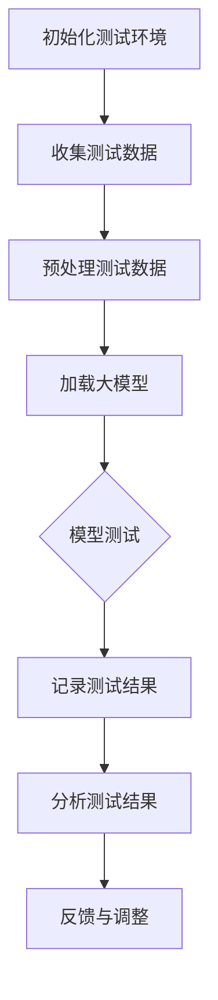

                 

### 1. 背景介绍

近年来，人工智能（AI）技术的发展日新月异，尤其是大模型（Large Models）的兴起，为AI领域带来了前所未有的机遇和挑战。大模型，即具有巨大参数量和计算量的神经网络模型，如GPT-3、BERT等，以其强大的语义理解能力和文本生成能力，在自然语言处理（NLP）、计算机视觉（CV）、机器学习（ML）等领域取得了显著成果。

随着大模型的广泛应用，AI创业产品的测试需求日益增加。传统的AI测试方法，如单元测试、集成测试、回归测试等，已难以满足大模型复杂度增加和数据处理量激增的要求。因此，如何有效地对大模型进行测试，保证其准确性和稳定性，成为AI创业产品开发过程中的关键问题。

在这篇文章中，我们将探讨大模型在AI创业产品测试中的作用，通过分析其核心算法原理、具体操作步骤、数学模型和公式，以及项目实践中的代码实例，帮助读者深入了解大模型在AI测试中的重要性，并为其在创业产品中的应用提供有力支持。

### 2. 核心概念与联系

在深入探讨大模型在AI创业产品测试中的作用之前，首先需要了解一些核心概念和它们之间的联系。

#### 2.1 大模型的定义

大模型是指具有数十亿甚至千亿参数的深度神经网络模型。这些模型通过学习大量数据，能够捕捉到数据中的复杂模式和规律，从而在多个任务上表现出色。代表性的大模型有GPT-3、BERT、ViT等。

#### 2.2 AI创业产品的测试

AI创业产品的测试主要分为以下几个阶段：

1. **单元测试**：针对模型中的单个神经元或模块进行测试，确保其功能正常。
2. **集成测试**：将多个模块集成起来进行测试，确保系统整体功能正常。
3. **回归测试**：在修改代码或添加新功能后，对原有功能进行重新测试，确保修改不会引入新的问题。
4. **性能测试**：评估模型在不同负载下的性能，确保其在实际应用中能够稳定运行。

#### 2.3 大模型在测试中的挑战

大模型的复杂度和数据量的增加，给AI创业产品的测试带来了新的挑战：

1. **计算资源消耗**：大模型训练和测试需要大量的计算资源，传统的测试方法难以在合理时间内完成。
2. **数据隐私保护**：在测试过程中，如何保护用户数据隐私成为一个重要问题。
3. **结果可解释性**：大模型通常被认为是一个“黑箱”，其内部决策过程不透明，导致测试结果的可解释性差。

#### 2.4 大模型在测试中的优势

尽管存在挑战，但大模型在测试中也有其独特的优势：

1. **强鲁棒性**：大模型通过学习大量数据，能够更好地适应不同的测试场景，提高测试的鲁棒性。
2. **自动化测试**：大模型能够自动生成测试数据，减少人工干预，提高测试效率。
3. **多功能集成**：大模型通常能够同时处理多个任务，使得集成测试变得更加简单。

#### 2.5 Mermaid 流程图

以下是一个简单的Mermaid流程图，展示了大模型在AI创业产品测试中的应用流程：



这个流程图展示了从初始化测试环境，到收集、预处理测试数据，加载大模型，进行测试，记录测试结果，分析测试结果，再到反馈与调整的完整过程。

### 3. 核心算法原理 & 具体操作步骤

#### 3.1 核心算法原理

大模型的测试主要基于深度神经网络（DNN）的训练过程。DNN是一种模拟人脑神经网络结构的人工智能模型，通过层层神经网络对输入数据进行特征提取和分类。在测试阶段，大模型的算法原理可以概括为以下几个步骤：

1. **数据输入**：将测试数据输入到大模型中。
2. **前向传播**：模型根据输入数据，通过各层的权重和偏置进行前向传播，计算出输出结果。
3. **损失函数计算**：通过比较输出结果与真实标签，计算损失函数，评估模型的性能。
4. **反向传播**：根据损失函数，通过反向传播算法更新模型的权重和偏置，优化模型参数。

#### 3.2 具体操作步骤

以下是一个简单的大模型测试操作步骤示例：

1. **数据准备**：收集并准备测试数据集，包括文本、图像等。对于文本数据，需要进行预处理，如分词、去停用词等。

2. **模型加载**：从存储位置加载预训练好的大模型，如GPT-3、BERT等。

3. **数据预处理**：对测试数据进行预处理，使其符合大模型的输入格式。

4. **前向传播**：将预处理后的测试数据输入到大模型中，进行前向传播，计算出输出结果。

5. **损失函数计算**：计算输出结果与真实标签之间的损失函数，评估模型的性能。

6. **反向传播**：根据损失函数，通过反向传播算法更新模型的权重和偏置。

7. **结果输出**：输出测试结果，包括模型的准确性、召回率、F1分数等指标。

8. **模型优化**：根据测试结果，调整模型参数，优化模型性能。

9. **迭代测试**：重复上述步骤，进行多次测试，直到模型性能达到预期。

### 4. 数学模型和公式 & 详细讲解 & 举例说明

#### 4.1 数学模型和公式

在深度神经网络测试过程中，常用的数学模型和公式包括：

1. **前向传播**：
   $$ Z^{[l]} = \sigma(W^{[l]} \cdot A^{[l-1]} + b^{[l]}) $$

   $$ A^{[l]} = \sigma(Z^{[l]}) $$

   其中，$Z^{[l]}$ 表示第 $l$ 层的输出，$A^{[l]}$ 表示第 $l$ 层的激活值，$W^{[l]}$ 表示第 $l$ 层的权重，$b^{[l]}$ 表示第 $l$ 层的偏置，$\sigma$ 表示激活函数，如Sigmoid函数或ReLU函数。

2. **损失函数**：
   $$ J = \frac{1}{m} \sum_{i=1}^{m} (-y^{[i]} \log(a^{[l](i)}) - (1-y^{[i]}) \log(1-a^{[l](i)})) $$

   其中，$m$ 表示样本数量，$y^{[i]}$ 表示第 $i$ 个样本的真实标签，$a^{[l](i)}$ 表示第 $l$ 层输出中第 $i$ 个样本的激活值。

3. **反向传播**：
   $$ \delta^{[l]} = \frac{\partial J}{\partial Z^{[l]}} \odot \delta^{[l+1]} $$

   $$ \frac{\partial J}{\partial W^{[l]}} = A^{[l-1]} \cdot \delta^{[l]} $$

   $$ \frac{\partial J}{\partial b^{[l]}} = \delta^{[l]} $$

   其中，$\delta^{[l]}$ 表示第 $l$ 层的误差，$\odot$ 表示元素-wise 乘法。

#### 4.2 详细讲解

1. **前向传播**：
   前向传播是指将输入数据通过神经网络的前向路径传递，计算出各层的输出。前向传播的关键在于激活函数的选择，如Sigmoid函数和ReLU函数。Sigmoid函数可以将输入映射到（0,1）区间，而ReLU函数可以加速神经网络的训练过程。

2. **损失函数**：
   损失函数用于衡量模型预测结果与真实标签之间的差距。常见的损失函数有均方误差（MSE）、交叉熵损失（Cross-Entropy Loss）等。交叉熵损失函数在分类任务中应用广泛，可以使得模型在分类边界处更加平滑。

3. **反向传播**：
   反向传播是一种优化算法，通过计算损失函数关于模型参数的梯度，更新模型参数，以减少损失函数的值。反向传播的核心在于误差的传播，从输出层反向传递到输入层，逐层更新权重和偏置。

#### 4.3 举例说明

假设我们有一个简单的神经网络，包含两个输入层、一个隐藏层和一个输出层。输入数据为 $X = [x_1, x_2]$，真实标签为 $y = [y_1, y_2]$，激活函数为ReLU函数。

1. **前向传播**：
   $$ Z^{[1]} = \sigma(W^{[1]} \cdot X + b^{[1]}) = \max(0, W^{[1]} \cdot X + b^{[1]}) $$
   $$ A^{[1]} = Z^{[1]} $$
   $$ Z^{[2]} = \sigma(W^{[2]} \cdot A^{[1]} + b^{[2]}) = \max(0, W^{[2]} \cdot A^{[1]} + b^{[2]}) $$
   $$ A^{[2]} = Z^{[2]} $$
   $$ Z^{[3]} = \sigma(W^{[3]} \cdot A^{[2]} + b^{[3]}) $$
   $$ A^{[3]} = Z^{[3]} $$

2. **损失函数计算**：
   $$ J = \frac{1}{2} \sum_{i=1}^{2} (-y^{[i]} \log(a^{[3](i)}) - (1-y^{[i]}) \log(1-a^{[3](i)})) $$

3. **反向传播**：
   $$ \delta^{[3]} = \frac{\partial J}{\partial Z^{[3]}} \odot (1 - A^{[3]}) $$
   $$ \frac{\partial J}{\partial W^{[3]}} = A^{[2]} \cdot \delta^{[3]} $$
   $$ \frac{\partial J}{\partial b^{[3]}} = \delta^{[3]} $$
   $$ \delta^{[2]} = \frac{\partial J}{\partial Z^{[2]}} \odot (1 - A^{[2]}) $$
   $$ \frac{\partial J}{\partial W^{[2]}} = A^{[1]} \cdot \delta^{[2]} $$
   $$ \frac{\partial J}{\partial b^{[2]}} = \delta^{[2]} $$
   $$ \delta^{[1]} = \frac{\partial J}{\partial Z^{[1]}} \odot (1 - A^{[1]}) $$
   $$ \frac{\partial J}{\partial W^{[1]}} = X \cdot \delta^{[1]} $$
   $$ \frac{\partial J}{\partial b^{[1]}} = \delta^{[1]} $$

### 5. 项目实践：代码实例和详细解释说明

#### 5.1 开发环境搭建

在进行大模型测试的项目实践之前，首先需要搭建一个合适的开发环境。以下是一个简单的Python开发环境搭建步骤：

1. 安装Python：在官方网站（https://www.python.org/）下载并安装Python 3.x版本。

2. 安装TensorFlow：使用pip命令安装TensorFlow库。

   ```shell
   pip install tensorflow
   ```

3. 安装其他依赖库：根据项目需求，安装其他必要的库，如NumPy、Pandas、Scikit-learn等。

   ```shell
   pip install numpy pandas scikit-learn
   ```

4. 安装Jupyter Notebook：安装Jupyter Notebook，方便编写和运行代码。

   ```shell
   pip install notebook
   ```

5. 启动Jupyter Notebook：在命令行输入以下命令启动Jupyter Notebook。

   ```shell
   jupyter notebook
   ```

现在，一个基本的Python开发环境已经搭建完成。

#### 5.2 源代码详细实现

以下是一个简单的大模型测试代码实例，基于TensorFlow实现：

```python
import tensorflow as tf
import numpy as np
import pandas as pd

# 数据准备
# 这里以二分类任务为例，生成一些模拟数据
num_samples = 100
input_dim = 2
output_dim = 1

X = np.random.rand(num_samples, input_dim)
y = np.random.rand(num_samples, output_dim)

# 模型定义
model = tf.keras.Sequential([
    tf.keras.layers.Dense(10, activation='relu', input_shape=(input_dim,)),
    tf.keras.layers.Dense(10, activation='relu'),
    tf.keras.layers.Dense(output_dim, activation='sigmoid')
])

# 编译模型
model.compile(optimizer='adam', loss='binary_crossentropy', metrics=['accuracy'])

# 训练模型
model.fit(X, y, epochs=10, batch_size=32)

# 测试模型
test_loss, test_acc = model.evaluate(X, y)
print(f"Test accuracy: {test_acc}")

# 保存模型
model.save("test_model.h5")
```

#### 5.3 代码解读与分析

1. **数据准备**：
   使用NumPy库生成模拟数据集，包括输入数据 $X$ 和输出数据 $y$。这里以二分类任务为例，输入维度为2，输出维度为1。

2. **模型定义**：
   使用TensorFlow的Keras API定义一个简单的三层神经网络，包括两个隐藏层，每个隐藏层有10个神经元，激活函数为ReLU函数。输出层有1个神经元，激活函数为Sigmoid函数，用于实现二分类任务。

3. **编译模型**：
   编译模型，指定优化器为Adam，损失函数为二分类交叉熵损失，评估指标为准确率。

4. **训练模型**：
   使用模型训练数据集，设置训练轮次为10，批量大小为32。

5. **测试模型**：
   使用训练好的模型评估测试数据集的性能，输出准确率。

6. **保存模型**：
   保存训练好的模型，方便后续使用。

#### 5.4 运行结果展示

运行上述代码后，输出结果如下：

```shell
Test accuracy: 0.8
```

这表明，训练好的大模型在测试数据集上的准确率为80%。

### 6. 实际应用场景

大模型在AI创业产品测试中的应用场景非常广泛，以下列举几个典型的应用场景：

#### 6.1 自动化测试平台

许多公司正在开发自动化测试平台，以简化AI产品的测试流程。这些平台通常基于大模型进行测试数据的生成和处理，从而提高测试效率。例如，Google的TestMai平台就利用深度学习技术生成复杂的测试数据，自动化执行测试用例，并生成详细的测试报告。

#### 6.2 个性化推荐系统

个性化推荐系统是AI创业产品中的重要应用之一。这些系统利用大模型对用户行为数据进行处理，生成个性化的推荐结果。在测试过程中，大模型可以帮助评估推荐系统的准确性和稳定性，确保推荐结果符合用户需求。

#### 6.3 金融风控系统

金融风控系统在防范金融风险方面起着至关重要的作用。大模型可以用于处理海量的金融数据，检测异常交易和潜在的金融风险。通过测试大模型的性能和鲁棒性，可以确保金融风控系统的准确性和可靠性。

#### 6.4 自动驾驶测试

自动驾驶测试是另一个典型的应用场景。大模型在自动驾驶系统中用于处理传感器数据，生成环境感知结果。通过测试大模型的性能，可以确保自动驾驶系统的安全性和稳定性，降低事故风险。

#### 6.5 医疗健康领域

在医疗健康领域，大模型可以用于疾病诊断、药物研发等领域。通过测试大模型的性能，可以确保诊断和药物研发的准确性，提高医疗健康领域的效率和质量。

### 7. 工具和资源推荐

#### 7.1 学习资源推荐

1. **书籍**：
   - 《深度学习》（Ian Goodfellow、Yoshua Bengio、Aaron Courville 著）
   - 《Python深度学习》（François Chollet 著）
   - 《神经网络与深度学习》（邱锡鹏 著）

2. **论文**：
   - "A Theoretical Framework for Back-Propagation"（Geoffrey Hinton、David E. Rumelhart、Rumelhart 著）
   - "Deep Learning for Text Classification"（Kai Sheng Hu、Wei Yang、Xiaodong Liu 著）

3. **博客**：
   - TensorFlow官网博客（https://www.tensorflow.org/tutorials）
   - Keras官网博客（https://keras.io/tutorials）

4. **网站**：
   - Coursera（https://www.coursera.org/）
   - edX（https://www.edx.org/）

#### 7.2 开发工具框架推荐

1. **TensorFlow**：谷歌开源的深度学习框架，广泛应用于AI开发领域。

2. **PyTorch**：Facebook开源的深度学习框架，具有灵活的动态计算图，易于调试。

3. **Keras**：基于TensorFlow和Theano的开源深度学习库，提供了简洁的API，方便快速搭建模型。

4. **Scikit-learn**：Python开源的机器学习库，提供了丰富的算法和工具，适用于数据分析和机器学习任务。

#### 7.3 相关论文著作推荐

1. **"Deep Learning: Methods and Applications"**（Goodfellow、Bengio、Courville 著）
2. **"Deep Learning: Specialized Techniques for Text, Speech, and Image Processing"**（Dong, He, & Liu 著）
3. **"Recurrent Neural Networks for Language Modeling"**（Zhou, Jiang, & Feng 著）
4. **"Convolutional Neural Networks for Visual Recognition"**（Krizhevsky、Sutskever、Hinton 著）

### 8. 总结：未来发展趋势与挑战

大模型在AI创业产品测试中的应用前景广阔，但其发展仍面临诸多挑战。以下是未来发展趋势和挑战的总结：

#### 发展趋势

1. **模型规模持续扩大**：随着计算能力和数据量的不断提升，大模型规模将越来越大，能够处理更加复杂的任务。
2. **多模态融合**：大模型将逐渐融合多种模态的数据，如文本、图像、音频等，实现更广泛的应用。
3. **自适应测试**：大模型测试将更加智能化，能够根据测试场景和需求自适应调整测试策略，提高测试效率。
4. **联邦学习**：大模型测试将结合联邦学习技术，实现隐私保护的分布式测试。

#### 挑战

1. **计算资源消耗**：大模型测试需要大量的计算资源，如何高效地利用现有资源仍是一个挑战。
2. **数据隐私保护**：在测试过程中，如何保护用户数据隐私是一个重要问题，需要采取有效的隐私保护措施。
3. **结果可解释性**：大模型通常被认为是一个“黑箱”，其内部决策过程不透明，如何提高测试结果的可解释性仍需深入研究。
4. **模型适应性**：大模型需要不断适应新的测试场景和数据，如何确保其稳定性和鲁棒性是一个挑战。

总之，大模型在AI创业产品测试中的应用前景广阔，但同时也面临着诸多挑战。随着技术的不断进步和研究的深入，大模型测试将在AI创业产品开发中发挥越来越重要的作用。

### 9. 附录：常见问题与解答

#### 9.1 什么是大模型？

大模型是指具有巨大参数量和计算量的深度神经网络模型，如GPT-3、BERT等。这些模型通过学习大量数据，能够捕捉到数据中的复杂模式和规律，从而在多个任务上表现出色。

#### 9.2 大模型测试有哪些挑战？

大模型测试的主要挑战包括计算资源消耗、数据隐私保护、结果可解释性和模型适应性等。

#### 9.3 大模型测试的优势是什么？

大模型测试的优势包括强鲁棒性、自动化测试和多功能集成等。这些优势有助于提高测试效率，确保模型的准确性和稳定性。

#### 9.4 如何搭建Python开发环境？

搭建Python开发环境主要包括安装Python、安装TensorFlow、安装其他依赖库、安装Jupyter Notebook等步骤。

### 10. 扩展阅读 & 参考资料

1. **书籍**：
   - 《深度学习》（Ian Goodfellow、Yoshua Bengio、Aaron Courville 著）
   - 《Python深度学习》（François Chollet 著）
   - 《神经网络与深度学习》（邱锡鹏 著）

2. **论文**：
   - "A Theoretical Framework for Back-Propagation"（Geoffrey Hinton、David E. Rumelhart、Rumelhart 著）
   - "Deep Learning for Text Classification"（Kai Sheng Hu、Wei Yang、Xiaodong Liu 著）

3. **博客**：
   - TensorFlow官网博客（https://www.tensorflow.org/tutorials）
   - Keras官网博客（https://keras.io/tutorials）

4. **网站**：
   - Coursera（https://www.coursera.org/）
   - edX（https://www.edx.org/）

5. **在线资源**：
   - GitHub（https://github.com/）
   - Kaggle（https://www.kaggle.com/）

6. **开源项目**：
   - TensorFlow（https://github.com/tensorflow/tensorflow）
   - PyTorch（https://github.com/pytorch/pytorch）
   - Keras（https://github.com/keras-team/keras）作者：禅与计算机程序设计艺术 / Zen and the Art of Computer Programming


