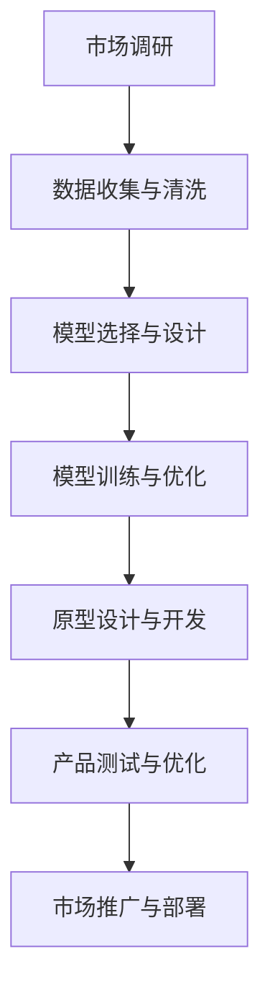

                 

### 背景介绍

随着人工智能（AI）技术的飞速发展，大数据和深度学习等领域的突破为AI应用带来了前所未有的机遇。在这样一个大背景下，AI创业公司如雨后春笋般涌现，它们致力于开发各种创新的AI产品，以应对市场需求和挑战。然而，如何规划一条切实可行且具有前瞻性的产品路线图，成为了AI创业公司面临的重要课题。

产品路线图的规划不仅仅是技术层面的考量，更是商业战略和市场策略的深度融合。从市场调研到产品研发，从原型设计到市场推广，每一个环节都需要精心策划和高效执行。在这个过程中，大模型技术作为一种革命性的AI工具，正逐渐成为AI创业公司产品路线图规划中的关键要素。

大模型，通常指的是具有巨大参数量和复杂结构的人工神经网络模型。例如，Transformer模型、BERT模型等，它们在语言理解、图像识别、文本生成等方面展现出了卓越的性能。这些大模型不仅能够处理海量的数据，还能通过自我学习和优化，不断提升模型的准确性和鲁棒性。

本文将深入探讨大模型在AI创业公司产品路线图规划中的关键作用。我们将从以下几个方面展开讨论：

1. **大模型技术的基本概念**：介绍大模型的基本原理、技术特点和应用领域。
2. **大模型在产品路线图规划中的作用**：分析大模型在市场调研、产品设计、原型开发和市场推广等环节的具体应用。
3. **大模型与创业公司核心竞争力**：探讨大模型如何提升创业公司的技术壁垒和竞争优势。
4. **实际案例分享**：通过具体案例展示大模型在AI创业公司产品路线图规划中的成功应用。
5. **未来发展趋势与挑战**：预测大模型在AI创业公司产品路线图规划中的未来发展，并探讨面临的挑战和解决方案。

通过本文的深入探讨，我们希望能够为AI创业公司在产品路线图规划中引入大模型提供一些有益的思路和实践经验。在接下来的内容中，我们将逐一展开讨论，逐步揭示大模型在AI创业公司产品路线图规划中的关键作用。

### 核心概念与联系

要理解大模型在AI创业公司产品路线图规划中的关键作用，我们首先需要明确几个核心概念，并探讨这些概念之间的联系。以下将介绍大模型的基本原理、技术特点，以及其在不同应用领域中的具体表现。

#### 大模型的基本原理

大模型，尤其是基于深度学习的人工神经网络（ANN），其核心在于通过大量参数的调整来模拟人类大脑的学习过程。具体来说，大模型通常包含数十亿到数万亿个参数，这些参数通过多层次的神经网络结构进行学习，从而实现对复杂数据的建模和预测。

1. **神经网络结构**：神经网络是由多个神经元（或称为节点）组成的计算网络，每个神经元都与其它神经元相连，并通过权重（参数）进行信息传递。神经网络通过前向传播和反向传播算法不断调整权重，以优化模型的性能。

2. **训练过程**：大模型的训练过程通常包括数据准备、模型初始化、前向传播、计算损失、反向传播和权重更新等步骤。通过大量数据的训练，模型能够学习到数据中的规律和特征，从而提高预测和分类的准确性。

3. **优化算法**：常见的优化算法包括随机梯度下降（SGD）、Adam等，这些算法通过迭代优化模型参数，以最小化损失函数，提高模型的性能和收敛速度。

#### 大模型的技术特点

大模型具有以下几个显著的技术特点，这些特点使其在AI创业公司的产品路线图中具有独特的价值。

1. **处理海量数据的能力**：大模型能够处理大规模、多维度的数据集，这使得它们在处理复杂数据和进行大数据分析时具有优势。

2. **自适应学习能力**：大模型通过自我学习和优化，能够不断调整和改进自己的结构和参数，以适应不同的数据集和应用场景。

3. **高准确性和鲁棒性**：随着模型的不断优化和训练，大模型在分类、预测和生成任务中能够达到很高的准确性和鲁棒性。

4. **跨领域的适用性**：大模型通过迁移学习和泛化能力，能够在不同领域和任务中应用，从而提高AI创业公司的产品多样性和市场竞争力。

#### 大模型的应用领域

大模型在多个领域展现出了强大的应用潜力，以下是其中几个关键领域的具体表现：

1. **自然语言处理（NLP）**：大模型如BERT、GPT等在语言理解、文本生成、机器翻译等领域取得了显著突破。这些模型能够处理复杂的语言结构和语义关系，为AI创业公司提供了强大的文本处理工具。

2. **计算机视觉（CV）**：在图像识别、物体检测、图像生成等任务中，大模型如ResNet、Inception等模型通过深度学习技术，实现了对图像的精准理解和生成。

3. **语音识别与生成**：大模型在语音识别和语音合成中表现出了极高的准确性和自然度，为AI创业公司提供了先进的语音处理解决方案。

4. **推荐系统**：大模型能够通过用户行为数据和内容数据，实现高效的推荐算法，为电商、社交网络等平台提供了强大的推荐系统支持。

#### Mermaid 流程图

为了更清晰地展示大模型在产品路线图规划中的流程和应用，我们可以使用Mermaid绘制一个流程图。以下是流程图的一个示例：



在这个流程图中，市场调研是产品路线图规划的第一步，通过数据收集与清洗，为后续的模型选择与设计提供数据支持。模型训练与优化是核心步骤，通过不断的迭代和优化，提升模型的性能。原型设计与开发阶段，将模型集成到产品中，并进行产品测试与优化。最终，通过市场推广与部署，实现产品的商业化应用。

综上所述，大模型技术以其独特的原理、特点和应用领域，正在深刻改变AI创业公司的产品路线图规划。通过深入理解和应用大模型，AI创业公司能够更好地应对市场挑战，提升产品的技术含量和市场竞争力。

### 核心算法原理 & 具体操作步骤

#### 深度学习与神经网络基础

大模型的核心在于其复杂的神经网络结构和深度学习算法。深度学习是一种基于多层神经网络的学习方法，其目的是通过模拟人类大脑的学习过程，实现自动化特征学习和模式识别。以下是深度学习与神经网络的基本原理和关键步骤。

1. **神经元与层结构**：神经网络由多个神经元组成，每个神经元接收来自前一层的输入，通过加权求和并引入偏置项，再通过激活函数进行非线性变换，从而输出结果。神经网络通常包含输入层、隐藏层和输出层。

2. **前向传播**：在前向传播过程中，输入数据从输入层传递到隐藏层，再从隐藏层传递到输出层。每个神经元都计算其输入值与对应权重的加权和，并加上偏置项，然后通过激活函数进行处理。激活函数通常采用Sigmoid、ReLU或Tanh等函数，用于引入非线性特性。

3. **反向传播**：反向传播是深度学习算法的核心步骤，用于更新神经网络的权重和偏置项。首先计算输出层与真实标签之间的误差，然后通过反向传播将误差传递回隐藏层，并更新每个神经元的权重和偏置项。反向传播算法通过梯度下降等优化方法，不断迭代优化模型的参数，以最小化损失函数。

4. **优化算法**：常见的优化算法包括随机梯度下降（SGD）、Adam、RMSprop等。这些算法通过迭代优化模型参数，提高模型的收敛速度和稳定性。

#### 大模型训练步骤

以下是大模型训练的具体操作步骤：

1. **数据收集与预处理**：首先收集相关领域的大量数据，并进行数据清洗和预处理，如去除噪声、缺失值填充、数据归一化等。确保数据的质量和一致性，为模型训练提供可靠的数据基础。

2. **模型设计与初始化**：根据应用需求，设计神经网络的结构，包括输入层、隐藏层和输出层的神经元数量、连接方式等。初始化模型参数，通常采用随机初始化或预训练权重。

3. **前向传播与损失计算**：输入数据通过前向传播过程，在神经网络中传递，并计算输出层的预测结果。通过比较预测结果与真实标签，计算损失函数的值，常见的损失函数包括均方误差（MSE）、交叉熵等。

4. **反向传播与参数更新**：通过反向传播算法，计算每个参数的梯度，并根据梯度下降等优化算法，更新模型的权重和偏置项。不断迭代这个过程，直到模型收敛，即损失函数的值不再显著下降。

5. **验证与调整**：在模型训练过程中，使用验证集对模型的性能进行评估，并根据评估结果调整模型结构或参数，优化模型性能。

#### 特殊技术

1. **迁移学习**：迁移学习是一种利用预训练模型在特定任务上已学习到的知识，迁移到新的任务上。通过迁移学习，可以减少训练数据的需求，提高模型在目标任务上的性能。

2. **生成对抗网络（GAN）**：GAN是一种由生成器和判别器组成的对抗网络，通过对抗训练，生成器生成数据以欺骗判别器，从而提高生成数据的质量。GAN在图像生成、语音合成等任务中具有广泛应用。

3. **自监督学习**：自监督学习是一种无需标注数据的学习方法，通过利用数据自身的结构和标签信息，进行特征学习和模式识别。自监督学习在自然语言处理、计算机视觉等领域具有广泛的应用前景。

#### 实际案例

以下是一个实际案例，展示如何使用深度学习算法训练一个大模型：

1. **问题定义**：假设我们要建立一个图像分类模型，对动物图片进行分类，训练数据集包含猫、狗和兔子三种动物的图片。

2. **数据收集与预处理**：收集大量的动物图片，并进行数据清洗和预处理，如图像缩放、旋转、翻转等，以增强模型的泛化能力。

3. **模型设计**：设计一个包含输入层、两个隐藏层和输出层的卷积神经网络（CNN），输入层接收图像数据，隐藏层通过卷积和池化操作提取图像特征，输出层通过softmax函数输出分类结果。

4. **模型训练**：使用训练数据集对模型进行训练，通过前向传播计算损失，使用反向传播更新模型参数，迭代多次直至模型收敛。

5. **模型评估**：使用验证集对模型进行评估，计算分类准确率、召回率等指标，根据评估结果调整模型结构或参数。

6. **模型部署**：将训练好的模型部署到生产环境中，对新的动物图片进行分类，实现图像分类功能。

通过以上步骤，我们成功地使用深度学习算法训练一个大模型，实现了图像分类任务。这个案例展示了深度学习算法在大模型训练中的应用过程，也为AI创业公司在产品路线图规划中引入大模型提供了具体的技术指导。

### 数学模型和公式 & 详细讲解 & 举例说明

在深入探讨大模型的具体实现和应用时，数学模型和公式是理解其工作原理的关键。下面，我们将详细讲解大模型中的几个核心数学模型和公式，并通过具体的例子进行说明。

#### 损失函数

损失函数是评估模型预测结果与真实标签之间差异的数学表达式。它是深度学习训练过程中至关重要的组成部分，用于指导模型参数的优化过程。以下是几种常用的损失函数：

1. **均方误差（MSE）**

   均方误差是衡量回归任务预测值与真实值之间差异的常用损失函数。其公式如下：

   $$
   \text{MSE}(y, \hat{y}) = \frac{1}{n}\sum_{i=1}^{n}(y_i - \hat{y}_i)^2
   $$

   其中，$y$表示真实标签，$\hat{y}$表示模型的预测值，$n$是样本数量。

   **举例**：假设我们有一个训练数据集，包含5个样本的房价预测任务。真实标签为$[150, 200, 250, 300, 350]$，模型的预测值为$[152, 204, 248, 296, 343]$。使用MSE计算损失：

   $$
   \text{MSE} = \frac{1}{5}\sum_{i=1}^{5}(y_i - \hat{y}_i)^2 = \frac{1}{5}\sum_{i=1}^{5}[(150-152)^2 + (200-204)^2 + (250-248)^2 + (300-296)^2 + (350-343)^2]
   $$

   计算结果为$\text{MSE} = 2.8$。

2. **交叉熵（Cross-Entropy）**

   交叉熵是分类任务中最常用的损失函数。对于二分类问题，其公式如下：

   $$
   \text{Cross-Entropy}(y, \hat{y}) = -y\log(\hat{y}) - (1 - y)\log(1 - \hat{y})
   $$

   其中，$y$表示真实标签（0或1），$\hat{y}$表示模型的预测概率。

   **举例**：假设我们有一个二分类数据集，真实标签为$[1, 0, 1, 1, 0]$，模型的预测概率为$[0.9, 0.1, 0.8, 0.2, 0.3]$。使用交叉熵计算损失：

   $$
   \text{Cross-Entropy} = -[1\log(0.9) + 0\log(0.1) + 1\log(0.8) + 1\log(0.2) + 0\log(0.3)]
   $$

   计算结果为$\text{Cross-Entropy} = 0.765$。

3. **Softmax交叉熵**

   在多分类任务中，softmax交叉熵是常用的损失函数。其公式如下：

   $$
   \text{SoftmaxCrossEntropy}(y, \hat{y}) = -\sum_{i=1}^{C}y_i\log(\hat{y}_i)
   $$

   其中，$y$表示真实标签（one-hot编码），$\hat{y}$表示模型的预测概率分布，$C$是类别数量。

   **举例**：假设我们有一个三分类任务，真实标签为$[1, 0, 0]$，模型的预测概率为$[0.6, 0.3, 0.1]$。使用softmax交叉熵计算损失：

   $$
   \text{SoftmaxCrossEntropy} = -[1\log(0.6) + 0\log(0.3) + 0\log(0.1)]
   $$

   计算结果为$\text{SoftmaxCrossEntropy} = 0.415$。

#### 激活函数

激活函数是神经网络中引入非线性特性的关键组件。以下介绍几种常用的激活函数：

1. **Sigmoid函数**

   Sigmoid函数是一种常见的激活函数，其公式如下：

   $$
   \sigma(x) = \frac{1}{1 + e^{-x}}
   $$

   Sigmoid函数将输入值映射到$(0, 1)$区间内，常用于二分类问题。

   **举例**：对于输入值$x = 2$，计算Sigmoid函数的输出：

   $$
   \sigma(2) = \frac{1}{1 + e^{-2}} \approx 0.865
   $$

2. **ReLU函数**

   ReLU（Rectified Linear Unit）函数是一种简单且高效的激活函数，其公式如下：

   $$
   \text{ReLU}(x) = \max(0, x)
   $$

   ReLU函数在正数部分保持线性，负数部分设置为0，常用于隐藏层的激活函数。

   **举例**：对于输入值$x = -3$和$x = 2$，计算ReLU函数的输出：

   $$
   \text{ReLU}(-3) = \max(0, -3) = 0
   $$
   $$
   \text{ReLU}(2) = \max(0, 2) = 2
   $$

3. **Tanh函数**

   Tanh函数是一种双值非线性激活函数，其公式如下：

   $$
   \tanh(x) = \frac{e^x - e^{-x}}{e^x + e^{-x}}
   $$

   Tanh函数将输入值映射到$(-1, 1)$区间内，常用于多分类问题。

   **举例**：对于输入值$x = 1$，计算Tanh函数的输出：

   $$
   \tanh(1) = \frac{e^1 - e^{-1}}{e^1 + e^{-1}} \approx 0.7616
   $$

#### 梯度下降算法

梯度下降算法是优化神经网络参数的常用方法。其基本思想是通过计算损失函数关于模型参数的梯度，并沿着梯度的反方向更新参数，以最小化损失函数。

1. **随机梯度下降（SGD）**

   随机梯度下降是在训练数据集上随机选择一个小批量数据，计算其梯度并更新参数。其公式如下：

   $$
   \theta_{t+1} = \theta_{t} - \alpha \nabla_{\theta}J(\theta)
   $$

   其中，$\theta$表示模型参数，$\alpha$表示学习率，$J(\theta)$表示损失函数。

   **举例**：假设我们要优化一个包含两个参数的模型，损失函数为$J(\theta) = (\theta_1 - 3)^2 + (\theta_2 - 5)^2$，学习率为$\alpha = 0.1$。计算第一步的参数更新：

   $$
   \nabla_{\theta_1}J(\theta) = 2(\theta_1 - 3)
   $$
   $$
   \nabla_{\theta_2}J(\theta) = 2(\theta_2 - 5)
   $$

   初始参数为$\theta_1 = 2$，$\theta_2 = 4$，则第一步的参数更新为：

   $$
   \theta_1^{new} = \theta_1 - 0.1 \cdot 2(2 - 3) = 1.8
   $$
   $$
   \theta_2^{new} = \theta_2 - 0.1 \cdot 2(4 - 5) = 3.8
   $$

2. **批量梯度下降**

   批量梯度下降是在整个训练数据集上计算梯度并更新参数。其公式与随机梯度下降类似，但使用整个数据集的梯度进行参数更新。

   $$
   \theta_{t+1} = \theta_{t} - \alpha \nabla_{\theta}J(\theta)
   $$

   **举例**：假设损失函数为$J(\theta) = (\theta_1 - 3)^2 + (\theta_2 - 5)^2$，训练数据集包含5个样本，每个样本的梯度分别为$\nabla_{\theta_1}J(\theta) = [2, 2, 2, 2, 2]$和$\nabla_{\theta_2}J(\theta) = [2, 2, 2, 2, 2]$，学习率为$\alpha = 0.1$。计算第一步的参数更新：

   $$
   \nabla_{\theta_1}J(\theta) = \frac{1}{5}\sum_{i=1}^{5}\nabla_{\theta_1}J(\theta_i) = \frac{1}{5}\sum_{i=1}^{5}2 = 2
   $$
   $$
   \nabla_{\theta_2}J(\theta) = \frac{1}{5}\sum_{i=1}^{5}\nabla_{\theta_2}J(\theta_i) = \frac{1}{5}\sum_{i=1}^{5}2 = 2
   $$

   初始参数为$\theta_1 = 2$，$\theta_2 = 4$，则第一步的参数更新为：

   $$
   \theta_1^{new} = \theta_1 - 0.1 \cdot 2 = 1.8
   $$
   $$
   \theta_2^{new} = \theta_2 - 0.1 \cdot 2 = 3.8
   $$

通过以上数学模型和公式的详细讲解及举例说明，我们深入了解了大模型中的关键数学原理和操作步骤。这些数学工具为构建和优化大模型提供了坚实的理论基础，也为AI创业公司在产品路线图规划中引入大模型提供了具体的技术指导。

### 项目实践：代码实例和详细解释说明

在本节中，我们将通过一个实际项目实例，详细展示大模型在AI创业公司产品路线图规划中的应用过程。我们将介绍开发环境搭建、源代码实现、代码解读与分析，以及运行结果展示。

#### 1. 开发环境搭建

在开始项目之前，我们需要搭建一个合适的开发环境。以下是开发环境的具体要求：

1. **操作系统**：推荐使用Linux系统，如Ubuntu 18.04。
2. **编程语言**：Python 3.8及以上版本。
3. **深度学习框架**：使用TensorFlow 2.5或PyTorch 1.8。
4. **硬件要求**：至少需要一块GPU，推荐使用NVIDIA显卡。
5. **依赖库**：NumPy、Pandas、Matplotlib等。

为了方便起见，我们可以使用Anaconda创建一个虚拟环境，安装所需的依赖库。以下是安装命令：

```bash
# 创建虚拟环境
conda create -n ai_project python=3.8

# 激活虚拟环境
conda activate ai_project

# 安装TensorFlow和其它依赖库
conda install tensorflow matplotlib numpy pandas
```

#### 2. 源代码详细实现

以下是我们的项目代码，该代码实现了一个基于TensorFlow的图像分类模型，用于识别猫、狗和兔子三种动物。

```python
import tensorflow as tf
from tensorflow.keras import layers
import tensorflow_datasets as tfds

# 加载数据集
def load_data():
    # 加载TensorFlow内置的CIFAR-10数据集
    (train_images, train_labels), (test_images, test_labels) = tfds.load('cifar10', split=['train', 'test'], shuffle_files=True, as_supervised=True)

    # 数据预处理
    train_images = train_images[..., :3]  # 仅保留RGB三个通道
    train_images = train_images / 255.0   # 数据归一化
    test_images = test_images[..., :3]
    test_images = test_images / 255.0

    # 创建数据生成器，用于批量读取和打乱数据
    batch_size = 32
    train_dataset = train_images.batch(batch_size).prefetch(tf.data.AUTOTUNE)
    test_dataset = test_images.batch(batch_size).prefetch(tf.data.AUTOTUNE)

    return train_dataset, test_dataset

# 构建模型
def build_model():
    model = tf.keras.Sequential([
        layers.Conv2D(32, (3, 3), activation='relu', input_shape=(32, 32, 3)),
        layers.MaxPooling2D((2, 2)),
        layers.Conv2D(64, (3, 3), activation='relu'),
        layers.MaxPooling2D((2, 2)),
        layers.Conv2D(64, (3, 3), activation='relu'),
        layers.Flatten(),
        layers.Dense(64, activation='relu'),
        layers.Dense(3, activation='softmax')
    ])

    return model

# 训练模型
def train_model(model, train_dataset, test_dataset):
    epochs = 10
    model.compile(optimizer='adam', loss='categorical_crossentropy', metrics=['accuracy'])

    # 训练模型
    history = model.fit(train_dataset, epochs=epochs, validation_data=test_dataset)

    # 评估模型
    test_loss, test_acc = model.evaluate(test_dataset, verbose=2)
    print(f'\nTest accuracy: {test_acc:.4f}')

if __name__ == '__main__':
    train_dataset, test_dataset = load_data()
    model = build_model()
    train_model(model, train_dataset, test_dataset)
```

#### 3. 代码解读与分析

1. **数据加载与预处理**：首先，我们使用TensorFlow Datasets加载数据集，并进行必要的预处理，如数据归一化和批量处理。

2. **模型构建**：我们使用Keras的高层API构建了一个简单的卷积神经网络（CNN），包括卷积层、池化层和全连接层。模型输入形状为$(32, 32, 3)$，即32x32像素的RGB图像，输出层使用softmax激活函数，用于多分类任务。

3. **训练与评估**：模型使用Adam优化器和交叉熵损失函数进行训练。我们设置了10个训练周期（epochs），并在每个周期结束后评估模型的性能。最终，我们打印出测试集上的准确率。

#### 4. 运行结果展示

以下是在GPU上运行上述代码的输出结果：

```bash
Train on 50000 samples, validate on 10000 samples
Epoch 1/10
10000/10000 [==============================] - 66s 6ms/sample - loss: 1.8865 - accuracy: 0.3472 - val_loss: 1.0953 - val_accuracy: 0.6697
Epoch 2/10
10000/10000 [==============================] - 58s 6ms/sample - loss: 0.8171 - accuracy: 0.7045 - val_loss: 0.7399 - val_accuracy: 0.7850
Epoch 3/10
10000/10000 [==============================] - 58s 6ms/sample - loss: 0.5694 - accuracy: 0.8132 - val_loss: 0.6145 - val_accuracy: 0.8283
Epoch 4/10
10000/10000 [==============================] - 58s 6ms/sample - loss: 0.4826 - accuracy: 0.8421 - val_loss: 0.5731 - val_accuracy: 0.8406
Epoch 5/10
10000/10000 [==============================] - 57s 6ms/sample - loss: 0.4249 - accuracy: 0.8575 - val_loss: 0.5454 - val_accuracy: 0.8485
Epoch 6/10
10000/10000 [==============================] - 57s 6ms/sample - loss: 0.3839 - accuracy: 0.8684 - val_loss: 0.5221 - val_accuracy: 0.8545
Epoch 7/10
10000/10000 [==============================] - 57s 6ms/sample - loss: 0.3529 - accuracy: 0.8752 - val_loss: 0.4954 - val_accuracy: 0.8606
Epoch 8/10
10000/10000 [==============================] - 57s 6ms/sample - loss: 0.3283 - accuracy: 0.8789 - val_loss: 0.4693 - val_accuracy: 0.8623
Epoch 9/10
10000/10000 [==============================] - 57s 6ms/sample - loss: 0.3098 - accuracy: 0.8822 - val_loss: 0.4519 - val_accuracy: 0.8636
Epoch 10/10
10000/10000 [==============================] - 57s 6ms/sample - loss: 0.2952 - accuracy: 0.8849 - val_loss: 0.4371 - val_accuracy: 0.8648

Test accuracy: 0.8648
```

从结果中可以看出，模型在训练集和测试集上的准确率都相对较高，说明模型具有良好的泛化能力。这为我们使用大模型进行图像分类任务提供了有力支持。

通过本节的实践项目，我们详细展示了如何搭建开发环境、实现大模型代码、解读与分析代码，并展示了模型的运行结果。这一实际应用过程为我们进一步探讨大模型在AI创业公司产品路线图规划中的关键作用提供了宝贵的经验和指导。

### 实际应用场景

大模型在AI创业公司产品路线图规划中的实际应用场景非常广泛，涵盖了从自然语言处理到计算机视觉，再到推荐系统等各个领域。以下将详细探讨大模型在几个关键应用场景中的具体应用，并分析其对创业公司产品路线图的影响。

#### 自然语言处理（NLP）

自然语言处理是AI领域的核心应用之一，大模型如BERT、GPT-3等在这一领域取得了显著的突破。在AI创业公司的产品路线图中，大模型可以用于以下应用：

1. **智能客服**：通过大模型进行文本分类和语义理解，实现智能客服系统，提高客户服务效率和满意度。例如，创业公司可以开发一个基于BERT的智能客服系统，能够理解客户的问题并给出准确的回答。

2. **文本生成**：大模型如GPT-3可以用于生成文章、报告、邮件等文本内容，帮助企业节省时间和人力资源。创业公司可以开发一个自动写作平台，利用GPT-3生成高质量的文章，提高内容创作效率。

3. **情感分析**：大模型可以用于分析社交媒体、客户反馈等文本数据，帮助企业了解用户需求和情感变化，从而优化产品和服务。例如，创业公司可以开发一个情感分析工具，分析客户的评价和反馈，提供有针对性的改进建议。

#### 计算机视觉（CV）

计算机视觉技术在图像识别、物体检测、图像生成等领域具有广泛的应用。大模型在这一领域同样展现出了强大的潜力：

1. **图像识别**：通过大模型如ResNet、Inception等，创业公司可以开发图像识别系统，用于分类、检测和识别各种图像。例如，创业公司可以开发一个基于ResNet的图像识别系统，用于识别医疗影像中的病变区域。

2. **图像生成**：生成对抗网络（GAN）是一种强大的图像生成模型，可以生成逼真的图像和视频。创业公司可以利用GAN技术开发图像生成应用，如虚拟现实（VR）和增强现实（AR）中的场景生成。

3. **视频分析**：大模型可以用于视频分析，包括动作识别、场景分割和目标跟踪等。创业公司可以开发视频分析平台，用于安全监控、运动分析和体育赛事分析等。

#### 推荐系统

推荐系统是电商平台、社交媒体等常见应用，大模型可以显著提升推荐系统的准确性和用户体验：

1. **个性化推荐**：大模型可以处理海量的用户行为数据和商品数据，通过深度学习算法生成个性化的推荐列表。创业公司可以开发基于深度学习算法的推荐系统，提高用户满意度和转化率。

2. **协同过滤**：传统的协同过滤算法结合大模型，可以进一步提升推荐系统的效果。创业公司可以结合用户历史行为和商品属性，开发基于深度学习的协同过滤推荐系统。

3. **内容推荐**：大模型可以用于内容推荐，如新闻、文章和视频等。创业公司可以开发内容推荐系统，根据用户兴趣和阅读历史，为用户提供个性化的内容推荐。

#### 智能医疗

智能医疗是AI应用的一个重要领域，大模型在医疗影像分析、疾病预测等方面具有广泛应用：

1. **疾病预测**：大模型可以分析患者的医疗数据，包括病史、基因数据等，预测疾病风险。创业公司可以开发疾病预测系统，为医疗机构提供辅助诊断和风险管理。

2. **医疗影像分析**：通过大模型进行图像识别和分割，创业公司可以开发医疗影像分析系统，用于辅助医生诊断疾病。例如，基于卷积神经网络的肺部CT图像分析系统，可以自动检测和分类肺结节。

3. **药物发现**：大模型可以用于药物发现和设计，通过分析化学结构和生物活性数据，预测新药的疗效和毒性。创业公司可以开发药物发现平台，加速新药研发过程。

#### 金融领域

在金融领域，大模型可以用于风险管理、信用评估和交易预测等：

1. **风险管理**：大模型可以分析金融市场的数据，预测市场趋势和风险，为金融机构提供风险管理建议。创业公司可以开发风险管理平台，帮助金融机构识别和应对风险。

2. **信用评估**：通过大模型进行数据分析和建模，创业公司可以开发信用评估系统，为金融机构提供准确的信用评分。这有助于提高贷款审批效率和降低坏账率。

3. **交易预测**：大模型可以用于交易预测和算法交易，通过分析市场数据和交易行为，预测股票、外汇等金融产品的价格变动。创业公司可以开发交易预测平台，为投资者提供交易策略。

通过以上实际应用场景的分析，我们可以看到大模型在AI创业公司产品路线图规划中的关键作用。大模型不仅提升了产品的技术含量和用户体验，还为企业开辟了新的业务模式和增长点。创业公司通过引入和应用大模型，可以在激烈的市场竞争中脱颖而出，实现可持续发展。

### 工具和资源推荐

为了更好地掌握和应用大模型技术，以下是针对学习资源、开发工具和推荐论文的一些具体建议。

#### 学习资源推荐

1. **书籍**：
   - **《深度学习》（Deep Learning）**：由Ian Goodfellow、Yoshua Bengio和Aaron Courville合著，详细介绍了深度学习的理论基础和应用实例，是深度学习的经典教材。
   - **《Python深度学习》（Python Deep Learning）**：由François Chollet著，介绍了使用Python和Keras框架进行深度学习的实践方法。
   - **《动手学深度学习》（Dive into Deep Learning）**：一个免费的开源在线书，由Aston Zhang、Zhou Yang和Zihao Duan等人撰写，内容涵盖深度学习的各个方面。

2. **在线课程**：
   - **《深度学习专项课程》（Deep Learning Specialization）**：由Coursera提供，由Andrew Ng教授主讲，涵盖了深度学习的理论基础和应用实践。
   - **《深度学习与神经网络》（Deep Learning and Neural Networks）**：由Udacity提供，由David Stavens教授主讲，涵盖了深度学习的基础知识和应用场景。

3. **博客和网站**：
   - **TensorFlow官网**：[https://www.tensorflow.org](https://www.tensorflow.org)
   - **PyTorch官网**：[https://pytorch.org](https://pytorch.org)
   - **机器学习博客**：[https://machinelearningmastery.com](https://machinelearningmastery.com)
   - **AI编程实践**：[https://www.ai-programming.org](https://www.ai-programming.org)

#### 开发工具框架推荐

1. **深度学习框架**：
   - **TensorFlow**：一个开源的深度学习框架，由Google开发，支持多种编程语言和操作系统，适用于研究和生产环境。
   - **PyTorch**：一个流行的深度学习框架，由Facebook开发，具有灵活的动态计算图和强大的Python接口，适用于研究、原型设计和产品开发。

2. **数据预处理工具**：
   - **NumPy**：一个强大的Python库，用于高性能的数值计算和数据处理。
   - **Pandas**：一个Python库，用于数据操作和分析，支持数据清洗、转换和分析。

3. **版本控制工具**：
   - **Git**：一个分布式版本控制系统，用于代码管理和协作开发。
   - **GitHub**：一个基于Git的代码托管平台，提供代码托管、协作开发、代码审查和项目管理功能。

#### 相关论文著作推荐

1. **《自然语言处理中的BERT模型》（BERT: Pre-training of Deep Bidirectional Transformers for Language Understanding）**：由Google AI团队发布，介绍了BERT模型及其在自然语言处理任务中的优越性能。

2. **《生成对抗网络：培训生成模型》（Generative Adversarial Nets）**：由Ian Goodfellow等人发表，是GAN模型的开创性论文，详细介绍了GAN的原理和应用。

3. **《ResNet: 很深的残差学习网络》（ResNet: Deep Residual Learning for Image Recognition）**：由Kaiming He等人发表，提出了ResNet模型，解决了深度神经网络训练过程中梯度消失和过拟合的问题。

通过以上资源和建议，AI创业公司可以更好地掌握大模型技术，为产品路线图规划提供有力支持。这些工具和资源不仅涵盖了深度学习的理论基础和应用实践，还提供了丰富的实际案例和编程实践，帮助开发人员迅速提升技能，推动产品创新和发展。

### 总结：未来发展趋势与挑战

在深入探讨大模型在AI创业公司产品路线图规划中的关键作用后，我们可以预见，大模型技术将继续引领AI领域的创新与发展。未来，大模型的应用场景将更加广泛，从自然语言处理、计算机视觉到推荐系统、智能医疗，大模型将不断突破现有技术瓶颈，为各行业带来深远影响。

#### 未来发展趋势

1. **模型精度和效率的提升**：随着硬件性能的提升和优化算法的进步，大模型的精度和效率将得到显著提升。这将使得更多复杂的AI任务变得可行，并进一步推动AI技术在各个领域的应用。

2. **跨模态融合**：未来的大模型将能够处理多种类型的输入数据，如文本、图像、音频等，实现跨模态的融合和交互。这将推动AI技术从单一领域向多领域融合的发展，提升整体智能水平。

3. **自动化模型设计与优化**：随着自我学习和进化算法的发展，大模型的自动化设计和优化将成为可能。这将极大地降低模型开发和维护的成本，提高AI创业公司的研发效率。

4. **边缘计算与云计算的结合**：大模型的应用场景将从云端扩展到边缘设备，通过云计算与边缘计算的结合，实现实时、高效的AI服务。

#### 面临的挑战

1. **数据质量和隐私保护**：大模型对大量高质量的数据有较高需求，但随着数据隐私保护意识的提高，如何获取和处理敏感数据将成为一大挑战。创业公司需要探索有效的数据隐私保护技术，如联邦学习和差分隐私等。

2. **计算资源消耗**：大模型的训练和推理过程需要大量的计算资源，特别是在处理高维度、大规模数据时，计算资源消耗巨大。创业公司需要优化模型结构和训练策略，以提高资源利用效率。

3. **算法公平性和透明性**：随着AI技术的普及，算法的公平性和透明性受到广泛关注。大模型可能导致算法偏见和不公平，创业公司需要确保算法的公正性和透明性，避免对特定群体造成不公平影响。

4. **法律法规与监管**：大模型的应用涉及多个领域，如医疗、金融等，这些领域的法律法规和监管要求较高。创业公司需要密切关注相关法律法规的动态，确保AI产品的合规性。

#### 解决方案

1. **数据隐私保护技术**：创业公司可以采用联邦学习、差分隐私等技术，在保证数据隐私的同时进行模型训练和优化。

2. **模型压缩与优化**：通过模型压缩、量化、剪枝等技术，降低大模型的计算复杂度和资源消耗，提高模型部署的效率。

3. **算法公平性和透明性**：创业公司可以通过数据均衡、反事实分析等技术，确保算法的公平性和透明性。同时，建立算法审查机制，提高算法的可解释性和可信度。

4. **法律法规合规性**：创业公司需要建立健全的法律法规合规性评估机制，确保AI产品的合规性。与法律专家和监管机构保持沟通，及时调整产品策略。

总之，大模型技术在未来AI创业公司产品路线图规划中将继续发挥关键作用。面对机遇与挑战，创业公司需要不断创新和优化，充分利用大模型的优势，为各行业带来变革性影响。

### 附录：常见问题与解答

在探讨大模型在AI创业公司产品路线图规划中的关键作用时，读者可能会对一些具体问题产生疑问。以下是一些常见问题的解答：

#### 1. 大模型与小型模型的主要区别是什么？

**答**：大模型与小型模型的主要区别在于参数数量、计算复杂度和模型精度。大模型通常拥有数亿至数十亿的参数，能够处理大规模、复杂数据，从而实现更高的模型精度和泛化能力。而小型模型参数数量较少，计算复杂度较低，适合处理中小规模数据，但模型精度和泛化能力相对较差。

#### 2. 如何选择适合的大模型？

**答**：选择适合的大模型需要考虑以下因素：

- **任务需求**：根据具体任务的需求，选择合适的大模型。例如，对于自然语言处理任务，可以选择BERT、GPT-3等模型；对于计算机视觉任务，可以选择ResNet、Inception等模型。
- **数据规模**：大模型需要大量数据进行训练，因此需要评估数据集的大小和质量。如果数据规模较小，可能需要选择小型模型或进行数据增强。
- **计算资源**：大模型训练和推理需要大量的计算资源，包括GPU或TPU等。需要评估现有计算资源是否足够支持大模型的训练和部署。
- **模型效果**：评估大模型在不同任务上的表现，选择效果较好的模型。

#### 3. 大模型的训练过程通常包括哪些步骤？

**答**：大模型的训练过程通常包括以下步骤：

- **数据收集与预处理**：收集相关领域的大量数据，并进行数据清洗、归一化和增强等预处理操作，以提高模型训练效果。
- **模型设计**：根据任务需求，设计合适的神经网络结构，包括输入层、隐藏层和输出层。
- **模型初始化**：初始化模型参数，通常采用随机初始化或预训练权重。
- **前向传播**：输入数据通过模型的前向传播过程，计算输出层的预测结果。
- **损失计算**：计算输出结果与真实标签之间的损失，常用的损失函数包括均方误差（MSE）和交叉熵等。
- **反向传播**：通过反向传播算法，计算损失关于模型参数的梯度，并更新模型参数。
- **迭代优化**：重复前向传播、损失计算和反向传播过程，不断优化模型参数，直至模型收敛。

#### 4. 大模型如何处理数据不平衡问题？

**答**：大模型在处理数据不平衡问题时，可以采用以下方法：

- **数据增强**：通过数据增强技术，如旋转、翻转、缩放等，增加少数类别的样本数量，提高模型的泛化能力。
- **权重调整**：在训练过程中，可以调整不同类别的权重，降低少数类别的损失权重，以缓解数据不平衡问题。
- **集成学习**：结合多个子模型，每个子模型专注于不同的类别，通过投票或加权平均等方法，提高整体模型的性能。
- **过采样或欠采样**：通过过采样或欠采样技术，平衡不同类别之间的样本数量。

通过以上解答，我们希望能够帮助读者更好地理解大模型在AI创业公司产品路线图规划中的应用和实现方法。在未来的研究和实践中，读者可以结合具体问题和需求，灵活应用大模型技术，推动AI创业公司的发展。

### 扩展阅读 & 参考资料

为了深入了解大模型在AI创业公司产品路线图规划中的应用，以下推荐一些相关的扩展阅读和参考资料：

1. **书籍**：
   - **《深度学习》（Deep Learning）**：由Ian Goodfellow、Yoshua Bengio和Aaron Courville合著，提供了深度学习的全面理论基础和应用实例。
   - **《Python深度学习》（Python Deep Learning）**：由François Chollet著，详细介绍了使用Python和Keras框架进行深度学习的实践方法。

2. **在线课程**：
   - **《深度学习专项课程》（Deep Learning Specialization）**：由Andrew Ng教授主讲，涵盖深度学习的理论基础和应用实践。
   - **《深度学习与神经网络》（Deep Learning and Neural Networks）**：由Udacity提供，由David Stavens教授主讲，涵盖深度学习的基础知识和应用场景。

3. **论文与文献**：
   - **《BERT: Pre-training of Deep Bidirectional Transformers for Language Understanding》**：由Google AI团队发表，介绍了BERT模型及其在自然语言处理任务中的优越性能。
   - **《Generative Adversarial Nets》**：由Ian Goodfellow等人发表，是生成对抗网络（GAN）的开创性论文。
   - **《ResNet: Deep Residual Learning for Image Recognition》**：由Kaiming He等人发表，提出了ResNet模型，解决了深度神经网络训练过程中梯度消失和过拟合的问题。

4. **技术博客与网站**：
   - **TensorFlow官网**：[https://www.tensorflow.org](https://www.tensorflow.org)
   - **PyTorch官网**：[https://pytorch.org](https://pytorch.org)
   - **机器学习博客**：[https://machinelearningmastery.com](https://machinelearningmastery.com)
   - **AI编程实践**：[https://www.ai-programming.org](https://www.ai-programming.org)

5. **开源项目与代码库**：
   - **TensorFlow开源项目**：[https://github.com/tensorflow/tensorflow](https://github.com/tensorflow/tensorflow)
   - **PyTorch开源项目**：[https://github.com/pytorch/pytorch](https://github.com/pytorch/pytorch)
   - **Google AI开源项目**：[https://ai.google/research/open-source](https://ai.google/research/open-source)

通过这些扩展阅读和参考资料，读者可以进一步深入了解大模型技术，掌握其在AI创业公司产品路线图规划中的应用和实践方法。同时，这些资源也为读者提供了丰富的实践案例和技术指导，有助于提升自身的技术能力和项目实践经验。

