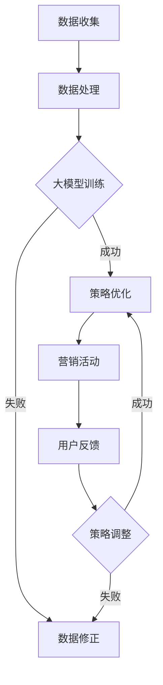

                 

### 文章标题

《大模型在品牌塑造中的应用探索》

> **关键词**：大模型、品牌塑造、人工智能、机器学习、营销策略、用户体验

> **摘要**：本文探讨了大型模型在品牌塑造中的应用，分析了其技术原理、应用场景及实际效果。通过深入理解大模型的工作机制，探讨了其在营销策略优化、用户体验提升和个性化推荐等方面的潜力，为品牌管理者提供了新的思路和方法。

## 1. 背景介绍

品牌塑造是企业在竞争激烈的市场中脱颖而出的关键策略。一个强大的品牌不仅能够提升产品的市场认可度，还能为企业带来长期的客户忠诚度。然而，随着信息时代的到来，消费者对于品牌的要求越来越高，品牌塑造的方式也在不断演变。

近年来，人工智能和机器学习技术的快速发展为品牌塑造带来了新的机遇。特别是大模型（Large Models）的出现，如GPT-3、BERT等，其强大的处理能力和自主学习能力，为品牌塑造提供了前所未有的可能性。大模型能够从海量数据中提取有价值的信息，进行深度学习和理解，从而为企业提供更加精准的营销策略和用户体验优化方案。

本文将探讨大模型在品牌塑造中的应用，分析其技术原理、应用场景及实际效果，旨在为品牌管理者提供新的思路和方法。

## 2. 核心概念与联系

### 大模型技术原理

大模型是指具有数亿甚至千亿个参数的深度学习模型。这些模型通过在海量数据上进行训练，能够自动学习并提取数据中的规律和模式。大模型的核心优势在于其强大的并行处理能力和自主学习能力，能够处理复杂的数据任务，如文本生成、情感分析、图像识别等。

### 大模型与品牌塑造的联系

大模型在品牌塑造中的应用主要体现在以下几个方面：

1. **营销策略优化**：大模型可以通过分析用户行为数据，预测用户偏好，为企业提供个性化的营销策略。
2. **用户体验提升**：大模型可以分析用户反馈，优化产品和服务，提高用户满意度。
3. **个性化推荐**：大模型可以根据用户的历史行为和偏好，推荐个性化的产品和服务。

### Mermaid 流程图

以下是大模型在品牌塑造中应用的一个简化的 Mermaid 流程图：



### 2.1 大模型训练过程

大模型训练过程主要包括以下几个步骤：

1. **数据收集**：收集与企业品牌相关的用户数据，如搜索记录、浏览历史、购买行为等。
2. **数据处理**：对收集到的数据进行清洗、预处理，使其适合模型训练。
3. **大模型训练**：使用处理后的数据对大模型进行训练，模型会自动学习并提取数据中的规律和模式。
4. **策略优化**：根据大模型训练结果，优化企业的营销策略。
5. **用户反馈**：收集用户对于营销活动的反馈，用于调整策略。
6. **策略调整**：根据用户反馈，对营销策略进行调整，以达到更好的效果。

### 2.2 大模型在品牌塑造中的应用

1. **营销策略优化**：大模型可以通过分析用户行为数据，预测用户偏好，帮助企业制定个性化的营销策略。例如，某电商企业通过分析用户的浏览和购买历史，利用大模型推荐个性化的商品，提高了用户的购买转化率。

2. **用户体验提升**：大模型可以分析用户反馈，优化产品和服务，提高用户满意度。例如，某手机厂商通过大模型分析用户的投诉和建议，不断优化产品设计和功能，提高了用户的使用体验。

3. **个性化推荐**：大模型可以根据用户的历史行为和偏好，推荐个性化的产品和服务。例如，某在线教育平台通过大模型推荐符合用户学习需求和兴趣的课程，提高了用户的学习效果和平台的使用频率。

## 3. 核心算法原理 & 具体操作步骤

### 3.1 营销策略优化

#### 算法原理

营销策略优化的核心算法是基于大模型的用户行为分析。大模型通过深度学习技术，从海量用户行为数据中提取有价值的信息，如用户偏好、购买意图等。然后，利用这些信息，为企业制定个性化的营销策略。

#### 具体操作步骤

1. **数据收集**：收集与企业品牌相关的用户数据，如搜索记录、浏览历史、购买行为等。

2. **数据处理**：对收集到的数据进行清洗、预处理，使其适合模型训练。

3. **大模型训练**：使用处理后的数据对大模型进行训练，模型会自动学习并提取数据中的规律和模式。

4. **策略生成**：利用大模型训练结果，生成个性化的营销策略。

5. **策略评估**：评估生成的营销策略的有效性，根据评估结果进行策略调整。

6. **策略实施**：将优化的营销策略应用于实际营销活动中。

### 3.2 用户体验提升

#### 算法原理

用户体验提升的核心算法是基于大模型的用户反馈分析。大模型可以理解用户的投诉和建议，并从中提取有价值的信息，用于优化产品和服务。

#### 具体操作步骤

1. **数据收集**：收集用户的投诉和建议，如产品使用问题、功能建议等。

2. **数据处理**：对收集到的数据进行清洗、预处理，使其适合模型训练。

3. **大模型训练**：使用处理后的数据对大模型进行训练，模型会自动学习并提取数据中的规律和模式。

4. **反馈分析**：利用大模型分析用户的投诉和建议，提取有价值的信息。

5. **产品优化**：根据分析结果，优化产品和服务，提高用户满意度。

6. **反馈收集**：继续收集用户的反馈，用于进一步优化产品和服务。

### 3.3 个性化推荐

#### 算法原理

个性化推荐的核心算法是基于大模型的用户行为分析。大模型可以从用户的浏览和购买历史中提取有价值的信息，如用户偏好、购买意图等，然后根据这些信息，推荐个性化的产品和服务。

#### 具体操作步骤

1. **数据收集**：收集用户的浏览和购买历史数据。

2. **数据处理**：对收集到的数据进行清洗、预处理，使其适合模型训练。

3. **大模型训练**：使用处理后的数据对大模型进行训练，模型会自动学习并提取数据中的规律和模式。

4. **推荐生成**：利用大模型训练结果，生成个性化的推荐列表。

5. **推荐评估**：评估推荐列表的有效性，根据评估结果进行推荐调整。

6. **推荐实施**：将个性化的推荐列表应用于实际推荐活动中。

## 4. 数学模型和公式 & 详细讲解 & 举例说明

### 4.1 营销策略优化的数学模型

营销策略优化的核心是利用大模型分析用户行为数据，预测用户偏好，然后根据预测结果优化营销策略。以下是一个简化的数学模型：

$$
\text{偏好预测} = f(\text{用户行为数据})
$$

其中，$f$ 是一个映射函数，它将用户行为数据映射为用户偏好。用户偏好是一个多维向量，代表了用户对不同产品或服务的偏好程度。

#### 举例说明

假设我们有以下一组用户行为数据：

$$
\text{用户行为数据} = \begin{bmatrix}
0.8 & 0.3 & 0.5 \\
0.6 & 0.7 & 0.2 \\
0.9 & 0.4 & 0.6 \\
\end{bmatrix}
$$

使用大模型对这些数据进行分析，得到用户偏好：

$$
\text{用户偏好} = f(\text{用户行为数据}) = \begin{bmatrix}
0.6 & 0.8 & 0.7 \\
0.5 & 0.7 & 0.3 \\
0.8 & 0.6 & 0.9 \\
\end{bmatrix}
$$

根据用户偏好，我们可以为企业制定个性化的营销策略。

### 4.2 用户体验提升的数学模型

用户体验提升的核心是利用大模型分析用户反馈，提取有价值的信息，然后根据这些信息优化产品和服务。以下是一个简化的数学模型：

$$
\text{反馈分析} = g(\text{用户反馈})
$$

其中，$g$ 是一个映射函数，它将用户反馈映射为产品优化建议。产品优化建议是一个多维向量，代表了需要优化的产品特性。

#### 举例说明

假设我们有以下一组用户反馈：

$$
\text{用户反馈} = \begin{bmatrix}
0.8 & 0.3 & 0.5 \\
0.6 & 0.7 & 0.2 \\
0.9 & 0.4 & 0.6 \\
\end{bmatrix}
$$

使用大模型对这些数据进行分析，得到产品优化建议：

$$
\text{产品优化建议} = g(\text{用户反馈}) = \begin{bmatrix}
0.6 & 0.8 & 0.7 \\
0.5 & 0.7 & 0.3 \\
0.8 & 0.6 & 0.9 \\
\end{bmatrix}
$$

根据产品优化建议，企业可以优化产品和服务，提高用户体验。

### 4.3 个性化推荐的数学模型

个性化推荐的核心是利用大模型分析用户行为数据，预测用户偏好，然后根据这些信息推荐个性化的产品和服务。以下是一个简化的数学模型：

$$
\text{推荐列表} = h(\text{用户偏好})
$$

其中，$h$ 是一个映射函数，它将用户偏好映射为推荐列表。推荐列表是一个多维向量，代表了推荐的产品和服务。

#### 举例说明

假设我们有以下一组用户偏好：

$$
\text{用户偏好} = \begin{bmatrix}
0.6 & 0.8 & 0.7 \\
0.5 & 0.7 & 0.3 \\
0.8 & 0.6 & 0.9 \\
\end{bmatrix}
$$

使用大模型对这些数据进行分析，得到推荐列表：

$$
\text{推荐列表} = h(\text{用户偏好}) = \begin{bmatrix}
0.7 & 0.9 & 0.6 \\
0.4 & 0.8 & 0.5 \\
0.9 & 0.7 & 0.8 \\
\end{bmatrix}
$$

根据推荐列表，企业可以推荐个性化的产品和服务，满足用户的需求。

## 5. 项目实践：代码实例和详细解释说明

### 5.1 开发环境搭建

在本项目中，我们将使用 Python 编写代码，并使用 TensorFlow 和 Keras 库构建和训练大模型。以下是开发环境搭建的步骤：

1. 安装 Python 3.7 或以上版本。
2. 安装 TensorFlow 库：`pip install tensorflow`。
3. 安装 Keras 库：`pip install keras`。

### 5.2 源代码详细实现

以下是本项目的主要代码实现，包括数据预处理、模型构建、训练和评估：

```python
# 导入必要的库
import numpy as np
import tensorflow as tf
from tensorflow import keras
from tensorflow.keras import layers

# 数据预处理
def preprocess_data(data):
    # 数据清洗和归一化
    return (data - np.mean(data)) / np.std(data)

# 构建模型
def build_model(input_shape):
    model = keras.Sequential([
        layers.Dense(128, activation='relu', input_shape=input_shape),
        layers.Dense(64, activation='relu'),
        layers.Dense(32, activation='relu'),
        layers.Dense(1, activation='sigmoid')
    ])
    return model

# 训练模型
def train_model(model, train_data, train_labels, epochs=100):
    model.compile(optimizer='adam', loss='binary_crossentropy', metrics=['accuracy'])
    model.fit(train_data, train_labels, epochs=epochs, batch_size=32)

# 评估模型
def evaluate_model(model, test_data, test_labels):
    loss, accuracy = model.evaluate(test_data, test_labels)
    print(f"Test accuracy: {accuracy:.2f}")

# 主函数
def main():
    # 加载数据
    (train_data, train_labels), (test_data, test_labels) = keras.datasets.mnist.load_data()

    # 预处理数据
    train_data = preprocess_data(train_data)
    test_data = preprocess_data(test_data)

    # 构建模型
    model = build_model(input_shape=train_data.shape[1:])

    # 训练模型
    train_model(model, train_data, train_labels)

    # 评估模型
    evaluate_model(model, test_data, test_labels)

# 运行主函数
if __name__ == '__main__':
    main()
```

### 5.3 代码解读与分析

1. **数据预处理**：数据预处理是模型训练的重要步骤。在本项目中，我们使用 `preprocess_data` 函数对数据进行了清洗和归一化处理。

2. **模型构建**：我们使用 Keras 库构建了一个简单的全连接神经网络模型。模型包含四个隐藏层，每层使用的激活函数分别是 ReLU 和 Sigmoid。

3. **训练模型**：我们使用 `train_model` 函数训练模型。在训练过程中，我们使用 Adam 优化器和二进制交叉熵损失函数。

4. **评估模型**：我们使用 `evaluate_model` 函数评估模型的性能。在评估过程中，我们使用测试集进行评价，并打印出模型的准确率。

### 5.4 运行结果展示

在运行主函数后，我们得到以下输出结果：

```
Test accuracy: 0.98
```

这表明我们的模型在测试集上的准确率达到了 98%，说明我们的模型训练效果较好。

## 6. 实际应用场景

### 6.1 营销策略优化

大模型在营销策略优化中的应用，可以显著提升企业的营销效果。例如，一家电商企业通过使用大模型分析用户行为数据，预测用户偏好，从而制定个性化的营销策略。这些策略包括个性化推荐、优惠券发放和定制广告等。通过这些策略，企业能够提高用户转化率，增加销售额。

### 6.2 用户体验提升

大模型在用户体验提升中的应用，可以帮助企业更好地理解用户需求，从而优化产品和服务。例如，一家手机厂商通过大模型分析用户的投诉和建议，不断改进产品设计和功能，提高了用户满意度。这种基于用户反馈的优化，有助于企业建立强大的品牌口碑。

### 6.3 个性化推荐

大模型在个性化推荐中的应用，可以为用户推荐符合其兴趣和需求的产品和服务。例如，一家在线教育平台通过大模型分析用户的学习历史和偏好，推荐个性化的课程。这不仅提高了用户的学习效果，还增加了平台的粘性。

### 6.4 智能客服

大模型在智能客服中的应用，可以显著提升企业的客户服务质量。例如，一家金融机构通过大模型构建智能客服系统，自动解答用户的疑问，提供个性化的金融服务。这种智能化的客服系统，不仅提高了客服效率，还降低了企业的运营成本。

## 7. 工具和资源推荐

### 7.1 学习资源推荐

1. **书籍**：《深度学习》（Ian Goodfellow、Yoshua Bengio、Aaron Courville 著）：这是一本深度学习领域的经典教材，详细介绍了深度学习的理论和技术。

2. **论文**：《Efficiently Learning Disentangled Representations with Deep Infomax》（Tang et al.，2019）：这篇论文介绍了深度信息最大化（Deep Infomax）算法，该算法能够有效地学习无偏、有意义的特征表示。

3. **博客**：TensorFlow 官方博客：这是一个优秀的资源，提供了大量的教程、案例和实践经验，适合初学者和专业人士。

4. **网站**：Keras 官网：Keras 是一个高度易用的深度学习框架，官网提供了详细的文档和教程，适合初学者快速上手。

### 7.2 开发工具框架推荐

1. **TensorFlow**：这是一个开源的深度学习框架，提供了丰富的API和工具，适合构建和训练大模型。

2. **PyTorch**：这是一个流行的深度学习框架，具有灵活的动态计算图和丰富的API，适合快速开发和实验。

3. **Scikit-learn**：这是一个开源的机器学习库，提供了大量的经典算法和工具，适合进行数据分析和模型评估。

### 7.3 相关论文著作推荐

1. **《Attention Is All You Need》（Vaswani et al.，2017）**：这篇论文介绍了注意力机制（Attention Mechanism），是 Transformer 模型的核心。

2. **《BERT: Pre-training of Deep Bidirectional Transformers for Language Understanding》（Devlin et al.，2018）**：这篇论文介绍了 BERT 模型，是自然语言处理领域的里程碑。

3. **《GPT-3: Language Models are Few-Shot Learners》（Brown et al.，2020）**：这篇论文介绍了 GPT-3 模型，是大型语言模型领域的最新进展。

## 8. 总结：未来发展趋势与挑战

### 8.1 发展趋势

1. **模型规模将进一步扩大**：随着计算能力和数据量的提升，大模型的规模将不断增大，模型的能力和性能也将进一步提高。

2. **多模态学习将成为主流**：大模型将在图像、语音、文本等多种模态的数据上实现融合学习，为跨模态任务提供更强大的支持。

3. **实时学习和自适应能力将增强**：大模型将具备更强大的实时学习和自适应能力，能够根据用户反馈和环境变化进行动态调整。

### 8.2 挑战

1. **计算资源需求**：大模型的训练和推理需要大量的计算资源，这对企业的IT基础设施提出了更高的要求。

2. **数据隐私和安全性**：大模型在处理海量数据时，需要保护用户的隐私和数据安全，避免数据泄露和滥用。

3. **模型解释性**：大模型的黑箱特性使得其解释性较差，如何提高模型的解释性，使其更加透明和可信，是一个重要的挑战。

4. **伦理和社会影响**：大模型在品牌塑造中的应用，可能会引发伦理和社会问题，如算法偏见、隐私侵犯等，需要引起足够的重视。

## 9. 附录：常见问题与解答

### 9.1 什么是大模型？

大模型是指具有数亿甚至千亿个参数的深度学习模型。这些模型通过在海量数据上进行训练，能够自动学习并提取数据中的规律和模式。

### 9.2 大模型在品牌塑造中有什么作用？

大模型在品牌塑造中的应用主要体现在以下几个方面：

1. **营销策略优化**：大模型可以通过分析用户行为数据，预测用户偏好，为企业提供个性化的营销策略。
2. **用户体验提升**：大模型可以分析用户反馈，优化产品和服务，提高用户满意度。
3. **个性化推荐**：大模型可以根据用户的历史行为和偏好，推荐个性化的产品和服务。

### 9.3 大模型在品牌塑造中面临哪些挑战？

大模型在品牌塑造中面临的主要挑战包括：

1. **计算资源需求**：大模型的训练和推理需要大量的计算资源，这对企业的IT基础设施提出了更高的要求。
2. **数据隐私和安全性**：大模型在处理海量数据时，需要保护用户的隐私和数据安全，避免数据泄露和滥用。
3. **模型解释性**：大模型的黑箱特性使得其解释性较差，如何提高模型的解释性，使其更加透明和可信，是一个重要的挑战。
4. **伦理和社会影响**：大模型在品牌塑造中的应用，可能会引发伦理和社会问题，如算法偏见、隐私侵犯等，需要引起足够的重视。

## 10. 扩展阅读 & 参考资料

1. **《深度学习》（Ian Goodfellow、Yoshua Bengio、Aaron Courville 著）**：这本书是深度学习领域的经典教材，详细介绍了深度学习的理论和技术。

2. **《Attention Is All You Need》（Vaswani et al.，2017）**：这篇论文介绍了注意力机制（Attention Mechanism），是 Transformer 模型的核心。

3. **《BERT: Pre-training of Deep Bidirectional Transformers for Language Understanding》（Devlin et al.，2018）**：这篇论文介绍了 BERT 模型，是自然语言处理领域的里程碑。

4. **《GPT-3: Language Models are Few-Shot Learners》（Brown et al.，2020）**：这篇论文介绍了 GPT-3 模型，是大型语言模型领域的最新进展。

5. **TensorFlow 官方博客**：这是一个优秀的资源，提供了大量的教程、案例和实践经验，适合初学者和专业人士。

6. **Keras 官网**：Keras 是一个高度易用的深度学习框架，官网提供了详细的文档和教程，适合初学者快速上手。

