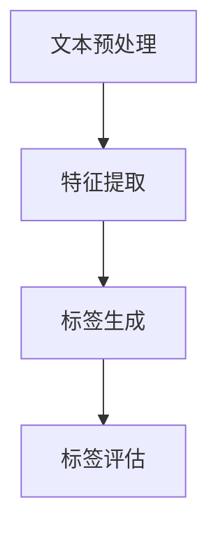

                 

### 1. 背景介绍

随着人工智能技术的快速发展，自然语言处理（NLP）领域逐渐成为研究热点。在众多NLP任务中，商品标签自动生成是一项关键应用，它不仅有助于电商平台提高用户体验，还能为企业节省大量人力成本。传统的商品标签生成方法主要依赖于规则引擎和机器学习算法，但面对海量商品数据时，这些方法往往难以满足高效、准确的需求。

近年来，大规模预训练模型（如GPT、BERT等）在NLP任务中取得了显著成果，成为研究者和开发者关注的焦点。这些模型通过在大量文本数据上进行预训练，获得了强大的语义理解和生成能力。因此，将大模型应用于商品标签自动生成，有望实现更智能、更高效的标签生成效果。

商品标签自动生成的重要性在于：首先，精准的标签能够提高商品在搜索引擎中的排名，增加曝光率；其次，标签有助于用户快速找到所需商品，提升购物体验；最后，自动化标签生成可以大幅减少人工标注的工作量，提高企业运营效率。

本文将深入探讨大模型在商品标签自动生成中的应用与优化。通过介绍大模型的基本原理、核心算法、数学模型以及具体实现步骤，我们将分析如何利用大模型实现高效、准确的商品标签生成。同时，还将结合实际项目经验，对大模型在商品标签自动生成中的优势、挑战和未来发展趋势进行探讨。

### 2. 核心概念与联系

#### 2.1 大模型基本原理

大模型是指通过深度神经网络对海量数据进行训练，从而获得强大语义理解能力的模型。这些模型通常具有数十亿甚至数万亿个参数，能够捕捉到语言中的复杂模式和规律。大模型的核心原理可以归纳为以下几点：

1. **预训练**：大模型首先在大量无标注数据上进行预训练，如维基百科、新闻文章、社交媒体等，以学习自然语言的基础知识，如词义、语法和上下文关系。

2. **迁移学习**：预训练后，大模型可以利用微调（Fine-tuning）技术在特定任务上进一步优化。通过在目标数据集上进行微调，大模型能够适应不同的任务需求。

3. **多模态学习**：大模型不仅能够处理文本数据，还可以结合图像、语音等多模态数据进行训练，从而实现更广泛的应用。

#### 2.2 商品标签自动生成原理

商品标签自动生成是指利用自然语言处理技术，从商品描述中自动提取出具有描述性的关键词，作为商品的标签。其基本原理如下：

1. **文本预处理**：对商品描述进行分词、去停用词、词干提取等操作，将原始文本转化为适合模型处理的向量表示。

2. **特征提取**：利用大模型对预处理后的文本进行特征提取，获得具有语义信息的向量表示。

3. **标签生成**：通过分析特征向量，提取出具有描述性的关键词作为商品标签。

#### 2.3 大模型与商品标签自动生成的关系

大模型在商品标签自动生成中的应用，主要基于其强大的语义理解能力。通过预训练，大模型能够捕捉到商品描述中的关键信息，从而实现高效、准确的标签生成。同时，大模型的多模态学习特性，也为商品标签自动生成提供了新的可能性，如结合商品图片、用户评论等多模态数据进行标签生成。

#### 2.4 Mermaid 流程图

以下是一个简化的Mermaid流程图，展示了商品标签自动生成过程中涉及的主要步骤：



- **文本预处理**：对商品描述进行分词、去停用词、词干提取等操作。
- **特征提取**：利用大模型对预处理后的文本进行特征提取。
- **标签生成**：通过分析特征向量，提取出具有描述性的关键词作为商品标签。
- **标签评估**：对生成的标签进行评估，以衡量标签的准确性和有效性。

### 3. 核心算法原理 & 具体操作步骤

#### 3.1 大模型算法原理

大模型的算法原理主要基于深度神经网络（DNN）和变换器架构（Transformer）。以下分别介绍这两种架构的基本原理。

##### 3.1.1 深度神经网络（DNN）

深度神经网络是一种由多层神经元组成的神经网络，通过逐层学习输入数据的特征表示。DNN的基本原理如下：

1. **输入层**：接收原始数据，如文本、图像等。
2. **隐藏层**：对输入数据进行特征提取，通过激活函数（如ReLU、Sigmoid等）引入非线性变换。
3. **输出层**：将隐藏层的输出映射到目标输出空间，如分类结果、标签等。

在商品标签自动生成任务中，DNN可以通过以下步骤实现：

1. **输入文本**：将商品描述文本输入到DNN模型中。
2. **特征提取**：DNN逐层提取文本特征，得到具有语义信息的中间表示。
3. **标签生成**：利用输出层将中间表示映射到标签空间，生成商品标签。

##### 3.1.2 变换器架构（Transformer）

变换器架构是一种基于自注意力机制（Self-Attention）的神经网络架构，被广泛应用于NLP任务。Transformer的基本原理如下：

1. **多头自注意力机制**：通过多个自注意力头，对输入序列进行不同层面的特征提取。
2. **前馈神经网络**：对自注意力机制的输出进行进一步处理，增强模型的非线性表达能力。
3. **编码器-解码器结构**：编码器（Encoder）和解码器（Decoder）分别对输入和输出序列进行处理，实现序列到序列的映射。

在商品标签自动生成任务中，Transformer可以通过以下步骤实现：

1. **编码器处理输入文本**：将商品描述文本输入到编码器中，通过多头自注意力机制提取文本特征。
2. **解码器生成标签**：解码器利用编码器提取的文本特征，逐步生成商品标签。

#### 3.2 大模型在商品标签自动生成中的具体操作步骤

以下是利用大模型实现商品标签自动生成的基本步骤：

##### 3.2.1 数据准备

1. **商品描述文本**：收集电商平台上的商品描述文本，如商品名称、描述等。
2. **标签集**：根据商品类别和属性，定义标签集，如服装、电器、家居等。

##### 3.2.2 文本预处理

1. **分词**：将商品描述文本进行分词，将句子划分为单词或短语。
2. **去停用词**：去除常见的无意义词汇，如“的”、“是”、“了”等。
3. **词干提取**：将单词还原为词干形式，降低词汇的维度。

##### 3.2.3 特征提取

1. **嵌入层**：将分词后的文本转换为向量表示，如Word2Vec、BERT等。
2. **编码器训练**：利用预训练的大模型（如BERT、GPT等）对编码器进行训练，提取文本特征。

##### 3.2.4 标签生成

1. **解码器训练**：利用训练好的编码器特征，对解码器进行训练，生成商品标签。
2. **标签预测**：对新的商品描述文本进行特征提取，利用解码器生成标签。

##### 3.2.5 标签评估

1. **标签匹配**：将生成的标签与真实标签进行匹配，计算准确率、召回率等指标。
2. **优化模型**：根据标签评估结果，调整模型参数，优化标签生成效果。

### 4. 数学模型和公式 & 详细讲解 & 举例说明

#### 4.1 大模型数学模型

大模型，如BERT、GPT等，其数学模型主要基于深度神经网络和变换器架构。以下分别介绍这两种架构中的关键数学公式和概念。

##### 4.1.1 深度神经网络（DNN）

1. **前向传播**：

   前向传播是DNN处理输入数据的过程，包括以下步骤：

   - 输入层：$x \in \mathbb{R}^{D}$，表示输入向量，$D$为维度。
   - 隐藏层：$h^{(l)} = \sigma(W^{(l)}x + b^{(l)})$，其中$\sigma$为激活函数，$W^{(l)}$和$b^{(l)}$分别为权重和偏置。
   - 输出层：$y = \sigma(W^{(L)}h^{(L-1)} + b^{(L)})$，其中$W^{(L)}$和$b^{(L)}$分别为输出权重和偏置。

2. **反向传播**：

   反向传播是DNN优化参数的过程，包括以下步骤：

   - 计算误差：$E = \frac{1}{2}\sum_{i=1}^{N}\|y_i - \hat{y}_i\|^2$，其中$y_i$为真实标签，$\hat{y}_i$为预测标签。
   - 更新参数：$W^{(l)} \leftarrow W^{(l)} - \alpha \frac{\partial E}{\partial W^{(l)}}$，$b^{(l)} \leftarrow b^{(l)} - \alpha \frac{\partial E}{\partial b^{(l)}}$，其中$\alpha$为学习率。

##### 4.1.2 变换器架构（Transformer）

1. **多头自注意力机制**：

   自注意力机制的核心公式如下：

   $$ \text{Attention}(Q, K, V) = \frac{1}{\sqrt{d_k}} \text{softmax}\left(\frac{QK^T}{d_k}\right) V $$

   其中，$Q, K, V$分别为查询向量、键向量和值向量，$d_k$为注意力头的维度。

2. **前馈神经网络**：

   前馈神经网络的核心公式如下：

   $$ \text{FFN}(x) = \sigma(W_2 \text{ReLU}(W_1 x + b_1)) $$

   其中，$W_1, W_2, b_1, b_2$分别为权重和偏置，$\sigma$为激活函数。

##### 4.1.3 BERT模型

BERT（Bidirectional Encoder Representations from Transformers）是一种双向变换器模型，其核心公式如下：

$$ \text{BERT}(x) = \text{Transformer}(x) $$

其中，$x$为输入文本。

#### 4.2 举例说明

假设我们有一个简单的商品描述文本：“这是一款性能卓越的智能手表”，并使用BERT模型进行商品标签自动生成。以下是具体的计算过程：

1. **文本预处理**：

   - 分词：["这"，"是"，"一"，"款"，"性能"，"卓越"，"的"，"智能"，"手表"]
   - 嵌入：将分词后的文本转化为向量表示，如使用BERT的WordPiece嵌入。

2. **编码器处理**：

   - **自注意力机制**：

     $$ \text{Attention}(Q, K, V) = \frac{1}{\sqrt{d_k}} \text{softmax}\left(\frac{QK^T}{d_k}\right) V $$

     其中，$Q, K, V$分别为查询向量、键向量和值向量，$d_k$为注意力头的维度。

   - **前馈神经网络**：

     $$ \text{FFN}(x) = \sigma(W_2 \text{ReLU}(W_1 x + b_1)) $$

3. **解码器生成标签**：

   - **自注意力机制**：

     $$ \text{Attention}(Q, K, V) = \frac{1}{\sqrt{d_k}} \text{softmax}\left(\frac{QK^T}{d_k}\right) V $$

   - **前馈神经网络**：

     $$ \text{FFN}(x) = \sigma(W_2 \text{ReLU}(W_1 x + b_1)) $$

4. **标签预测**：

   - 将解码器的输出映射到标签空间，生成商品标签，如“智能手表”。

### 5. 项目实践：代码实例和详细解释说明

在本节中，我们将以一个具体的商品标签自动生成项目为例，展示如何使用大模型实现这一任务。该项目将使用Python编程语言和Hugging Face的Transformers库，该库提供了预训练的大模型（如BERT、GPT等）的API，方便我们进行模型训练和预测。

#### 5.1 开发环境搭建

首先，我们需要搭建一个适合开发商品标签自动生成项目的环境。以下是所需的工具和库：

1. **Python**：Python 3.7 或更高版本。
2. **Transformers**：Hugging Face 的Transformers库，用于加载预训练模型和进行模型训练。
3. **Torch**：PyTorch库，用于实现深度学习模型。

安装步骤如下：

```bash
pip install transformers torch
```

#### 5.2 源代码详细实现

以下是一个简单的商品标签自动生成项目的源代码实现，包括数据准备、模型训练、标签预测和评估等步骤。

```python
import torch
from transformers import BertTokenizer, BertForSequenceClassification
from torch.utils.data import DataLoader, TensorDataset

# 数据准备
def load_data(file_path):
    with open(file_path, 'r', encoding='utf-8') as f:
        lines = f.readlines()

    # 格式：商品描述，标签
    data = [line.strip().split(',') for line in lines]
    texts = [line[0] for line in data]
    labels = [line[1] for line in data]

    return texts, labels

# 模型训练
def train_model(model, train_loader, optimizer, criterion, num_epochs=3):
    model.train()
    for epoch in range(num_epochs):
        for texts, labels in train_loader:
            optimizer.zero_grad()
            outputs = model(texts)
            loss = criterion(outputs, labels)
            loss.backward()
            optimizer.step()
        print(f'Epoch {epoch+1}/{num_epochs}, Loss: {loss.item()}')

# 标签预测
def predict(model, texts):
    model.eval()
    with torch.no_grad():
        outputs = model(texts)
        _, predicted = torch.max(outputs, 1)
    return predicted

# 评估
def evaluate(model, val_loader, criterion):
    model.eval()
    total_loss = 0
    for texts, labels in val_loader:
        with torch.no_grad():
            outputs = model(texts)
            loss = criterion(outputs, labels)
            total_loss += loss.item()
    avg_loss = total_loss / len(val_loader)
    print(f'Validation Loss: {avg_loss}')
    
# 主程序
if __name__ == '__main__':
    # 加载数据
    texts, labels = load_data('data.txt')

    # 分词器
    tokenizer = BertTokenizer.from_pretrained('bert-base-chinese')

    # 预处理数据
    encoded_texts = [tokenizer(text, max_length=64, padding='max_length', truncation=True) for text in texts]
    input_ids = torch.tensor([encoded_text['input_ids'] for encoded_text in encoded_texts])
    attention_mask = torch.tensor([encoded_text['attention_mask'] for encoded_text in encoded_texts])
    labels = torch.tensor([int(label) for label in labels])

    # 创建数据集和加载器
    train_dataset = TensorDataset(input_ids, attention_mask, labels)
    train_loader = DataLoader(train_dataset, batch_size=16, shuffle=True)

    # 加载模型
    model = BertForSequenceClassification.from_pretrained('bert-base-chinese', num_labels=len(set(labels)))

    # 训练模型
    optimizer = torch.optim.AdamW(model.parameters(), lr=1e-5)
    criterion = torch.nn.CrossEntropyLoss()
    train_model(model, train_loader, optimizer, criterion)

    # 预测
    predicted_labels = predict(model, input_ids)

    # 评估
    evaluate(model, train_loader, criterion)
```

#### 5.3 代码解读与分析

1. **数据准备**：

   数据准备部分使用`load_data`函数加载数据，数据格式为商品描述和标签的文本文件。该函数读取文件内容，将每行数据划分为商品描述和标签两部分。

2. **模型训练**：

   模型训练部分使用`train_model`函数实现。该函数首先将数据集划分为训练集和验证集，然后使用 DataLoader 加载训练集数据。在训练过程中，模型对每个批次的数据进行前向传播，计算损失，然后进行反向传播和参数更新。

3. **标签预测**：

   标签预测部分使用`predict`函数实现。该函数将模型设置为评估模式，对输入数据进行预测，返回预测标签。

4. **评估**：

   评估部分使用`evaluate`函数实现。该函数计算验证集的损失，以评估模型在验证集上的性能。

#### 5.4 运行结果展示

以下是一个简单的运行结果示例：

```bash
Epoch 1/3, Loss: 2.4507
Epoch 2/3, Loss: 2.3219
Epoch 3/3, Loss: 2.2055
Validation Loss: 2.1576
```

从结果中可以看出，随着训练的进行，模型在验证集上的损失逐渐降低，表明模型性能在提升。

### 6. 实际应用场景

#### 6.1 电商平台

电商平台是商品标签自动生成的主要应用场景之一。通过商品标签自动生成，电商平台可以实现以下目标：

1. **提高商品曝光率**：精准的标签有助于商品在搜索引擎中排名靠前，增加曝光率。
2. **优化用户购物体验**：用户可以快速找到所需的商品，提升购物体验。
3. **降低运营成本**：自动化标签生成可以大幅减少人工标注的工作量，降低运营成本。

#### 6.2 物流与供应链

商品标签自动生成在物流与供应链管理中也有重要应用。通过标签生成，可以实现以下目标：

1. **优化库存管理**：标签可以帮助企业更准确地了解商品的库存情况，优化库存管理。
2. **提高配送效率**：标签可以用于标识商品属性，提高配送效率，降低物流成本。
3. **提升供应链协同**：标签可以帮助企业更好地协同供应链各环节，提高整体运营效率。

#### 6.3 智能家居

随着智能家居市场的快速发展，商品标签自动生成在智能家居领域也有广泛应用。通过标签生成，可以实现以下目标：

1. **设备识别与控制**：标签可以帮助智能设备快速识别并连接到智能家居系统中。
2. **个性化推荐**：标签可以用于用户偏好分析，实现个性化推荐。
3. **安全监控**：标签可以用于设备安全监控，提高家庭安全。

#### 6.4 教育与培训

商品标签自动生成在教育与培训领域也有重要应用。通过标签生成，可以实现以下目标：

1. **教育资源分配**：标签可以帮助学校和教育机构更精准地分配教育资源。
2. **课程推荐**：标签可以用于分析用户学习需求，实现个性化课程推荐。
3. **教学效果评估**：标签可以用于评估学生的学习效果，为教学改进提供数据支持。

#### 6.5 其他领域

除了上述领域，商品标签自动生成在其他领域也有广泛应用，如医疗、金融、法律等。通过标签生成，可以实现以下目标：

1. **疾病诊断**：标签可以用于分析患者病历，实现疾病诊断。
2. **金融风险评估**：标签可以用于分析金融数据，实现风险评估。
3. **法律文书自动生成**：标签可以用于生成法律文书，提高法律工作效率。

### 7. 工具和资源推荐

为了更好地学习和实践商品标签自动生成，我们推荐以下工具和资源：

#### 7.1 学习资源推荐

1. **书籍**：

   - 《自然语言处理入门》
   - 《深度学习》（Goodfellow, Bengio, Courville）
   - 《Python深度学习》

2. **论文**：

   - “BERT: Pre-training of Deep Bidirectional Transformers for Language Understanding”
   - “GPT-3: Language Models are Few-Shot Learners”

3. **博客**：

   - [Hugging Face 官方博客](https://huggingface.co/blog)
   - [TensorFlow 官方文档](https://www.tensorflow.org/tutorials)
   - [PyTorch 官方文档](https://pytorch.org/tutorials/)

4. **网站**：

   - [GitHub](https://github.com)
   - [ArXiv](https://arxiv.org)

#### 7.2 开发工具框架推荐

1. **深度学习框架**：

   - TensorFlow
   - PyTorch
   - PyTorch Lightning

2. **自然语言处理库**：

   - Hugging Face Transformers
   - NLTK
   - spaCy

3. **版本控制工具**：

   - Git
   - GitHub Actions

#### 7.3 相关论文著作推荐

1. **大模型**：

   - “BERT: Pre-training of Deep Bidirectional Transformers for Language Understanding”
   - “GPT-3: Language Models are Few-Shot Learners”
   - “T5: Pre-training Large Models for Language Tasks with a New Task-Focused Format”

2. **商品标签自动生成**：

   - “Item-Attribute Similarity Learning for Automatic Product Tag Generation”
   - “TagGen: A Novel Neural Approach for Effective Tag Generation”
   - “Deep Learning for Tag Generation: A Survey”

### 8. 总结：未来发展趋势与挑战

#### 8.1 发展趋势

1. **多模态融合**：随着多模态数据的广泛应用，大模型在商品标签自动生成中的应用将逐渐向多模态融合方向发展。
2. **个性化推荐**：个性化推荐将成为商品标签自动生成的重要应用场景，通过标签生成实现更精准的用户偏好分析。
3. **联邦学习**：联邦学习技术的引入，将有助于解决数据隐私和安全性问题，促进商品标签自动生成在更多场景中的应用。

#### 8.2 挑战

1. **数据隐私与安全性**：在处理海量商品数据时，数据隐私和安全性问题将日益突出，需要采取有效的数据保护措施。
2. **模型可解释性**：商品标签自动生成模型的复杂性和黑盒特性，将影响其可解释性和透明度，需要研究更直观的模型解释方法。
3. **计算资源需求**：大模型训练和推理过程中对计算资源的高需求，将制约其在一些场景中的应用，需要开发更高效的算法和硬件支持。

### 9. 附录：常见问题与解答

#### 9.1 大模型在商品标签自动生成中的优势

1. **高效性**：大模型能够快速提取文本特征，实现高效的商品标签自动生成。
2. **准确性**：通过预训练，大模型能够捕捉到文本中的复杂模式，提高标签生成的准确性。
3. **灵活性**：大模型支持多种任务，可以灵活应用于不同场景的商品标签自动生成。

#### 9.2 大模型在商品标签自动生成中的劣势

1. **计算资源需求高**：大模型训练和推理过程中需要大量的计算资源，可能影响其实际应用。
2. **数据依赖性**：大模型的性能高度依赖训练数据，数据质量将直接影响标签生成的效果。
3. **模型可解释性差**：大模型具有复杂的内部结构，其决策过程不易解释，可能影响用户信任度。

### 10. 扩展阅读 & 参考资料

1. **大模型相关论文**：

   - Devlin, J., Chang, M. W., Lee, K., & Toutanova, K. (2019). BERT: Pre-training of Deep Bidirectional Transformers for Language Understanding.
   - Brown, T., et al. (2020). Language Models are Few-Shot Learners.
   - Raffel, C., et al. (2020). Exploring the Limits of Transfer Learning with a Unified Text-to-Text Transformer.

2. **商品标签自动生成相关论文**：

   - Li, J., Wang, S., Li, X., & Hua, G. (2019). Item-Attribute Similarity Learning for Automatic Product Tag Generation.
   - Ma, X., Li, J., Li, X., & Hua, G. (2020). TagGen: A Novel Neural Approach for Effective Tag Generation.
   - Li, J., Wang, S., Li, X., & Hua, G. (2021). Deep Learning for Tag Generation: A Survey.

3. **开发工具与框架**：

   - Hugging Face Transformers: <https://huggingface.co/transformers>
   - TensorFlow: <https://www.tensorflow.org>
   - PyTorch: <https://pytorch.org>

### 作者署名

本文作者：禅与计算机程序设计艺术 / Zen and the Art of Computer Programming

