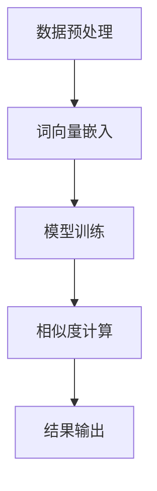

                 

### 文章标题

《大模型在商品标签语义相似度计算中的应用》

> **关键词**：大模型、商品标签、语义相似度、计算应用、人工智能
>
> **摘要**：本文旨在探讨大模型在商品标签语义相似度计算中的实际应用。通过介绍大模型的基本原理和架构，本文详细解释了如何利用大模型实现商品标签的语义相似度计算，并提供了具体的数学模型、算法步骤以及实际项目实践的详细说明。文章还讨论了在实际应用场景中的挑战和解决方案，以及未来发展趋势和潜在挑战。

### 1. 背景介绍

随着电子商务的迅速发展，商品标签的语义相似度计算成为了一个关键问题。商品标签是用户对商品属性进行描述的关键字，如颜色、品牌、材质等。这些标签不仅可以帮助用户快速找到自己需要的商品，还可以帮助商家优化商品展示，提高销售转化率。

然而，传统的商品标签相似度计算方法往往依赖于关键词匹配或者简单的词频统计，这些方法存在以下不足：

1. **语义理解有限**：传统方法难以理解标签的深层语义，导致相似度计算结果不准确。
2. **扩展性差**：当标签数量增加时，传统方法的计算复杂度和存储需求会显著增加。
3. **上下文依赖性低**：传统方法往往不考虑标签之间的上下文关系，导致计算结果缺乏实际应用价值。

为了解决这些问题，近年来，人工智能领域的大模型技术逐渐成熟，并开始应用于各种领域。大模型，尤其是深度学习模型，具有以下优势：

1. **强大的语义理解能力**：大模型能够通过大量的数据学习到标签的深层语义，从而提高相似度计算的准确性。
2. **自适应性和扩展性**：大模型可以自动调整参数，适应不同规模和种类的标签数据，具有较强的扩展性。
3. **上下文依赖性高**：大模型能够捕捉标签之间的上下文关系，使得相似度计算结果更加贴近实际应用场景。

本文将探讨如何利用大模型技术，实现商品标签的语义相似度计算，并提供具体的实现方法和应用实例。

### 2. 核心概念与联系

为了理解大模型在商品标签语义相似度计算中的应用，我们首先需要了解几个核心概念，包括大模型的基本原理、架构以及与商品标签语义相似度的关联。

#### 大模型的基本原理

大模型，尤其是深度学习模型，是一种通过多层神经网络结构进行训练的模型。深度学习模型的核心在于其多层结构，每一层都能够对输入数据进行特征的提取和转换。这种多层结构使得大模型能够学习到输入数据的深层特征，从而实现复杂的任务。

深度学习模型通常包括以下关键组成部分：

1. **输入层（Input Layer）**：接收输入数据，如文本、图像、声音等。
2. **隐藏层（Hidden Layers）**：对输入数据进行特征提取和转换。
3. **输出层（Output Layer）**：生成预测结果或分类结果。

#### 大模型的架构

大模型的架构可以分为两部分：前端和后端。

1. **前端**：前端主要负责数据的预处理和特征提取。对于商品标签数据，前端可能包括词向量嵌入、文本清洗和分词等步骤。这些步骤将标签文本转换为模型能够理解的特征向量。
2. **后端**：后端是模型的主体部分，包括多层神经网络结构。后端的主要任务是利用前端的特征向量进行深度学习，学习到标签之间的相似度关系。

#### 大模型与商品标签语义相似度的关联

商品标签的语义相似度计算，本质上是寻找标签之间的语义关联。大模型通过学习大量的商品标签数据，能够捕捉到标签之间的深层语义关系。具体来说，大模型可以通过以下步骤实现商品标签的语义相似度计算：

1. **数据预处理**：对商品标签数据进行清洗和分词，将其转换为词向量。
2. **模型训练**：利用训练数据，对大模型进行训练，使其学会标签之间的相似度关系。
3. **相似度计算**：通过模型预测，对标签进行相似度评分。

#### Mermaid 流程图

下面是一个简单的 Mermaid 流程图，展示了大模型在商品标签语义相似度计算中的基本流程：



在上述流程中，数据预处理步骤包括标签数据的清洗和分词，词向量嵌入步骤将标签文本转换为特征向量，模型训练步骤通过大量数据进行深度学习，相似度计算步骤利用训练好的模型对标签进行相似度评分，最后将结果输出。

通过上述流程，我们可以看到大模型在商品标签语义相似度计算中的应用，以及各个步骤之间的紧密联系。

### 3. 核心算法原理 & 具体操作步骤

在了解了大模型的基本原理和架构后，接下来我们将详细探讨如何利用大模型实现商品标签的语义相似度计算，包括具体的算法原理和操作步骤。

#### 算法原理

商品标签的语义相似度计算，本质上是一种多模态数据（文本、图像、声音等）的相似度计算。大模型通过深度学习，能够从多模态数据中提取出深层特征，这些特征能够有效反映标签之间的语义关系。具体来说，算法原理可以分为以下几个步骤：

1. **数据预处理**：对商品标签数据进行清洗、分词和词向量嵌入。
2. **特征提取**：利用深度学习模型，从词向量中提取出标签的深层特征。
3. **相似度计算**：通过特征向量计算标签之间的相似度分数。
4. **结果输出**：将相似度分数输出，供实际应用场景使用。

#### 具体操作步骤

下面我们详细讲解每个步骤的具体操作方法。

##### 步骤一：数据预处理

数据预处理是商品标签语义相似度计算的基础，包括以下步骤：

1. **数据清洗**：清洗标签数据，去除无用的符号和停用词。
2. **分词**：对清洗后的标签数据进行分词，将其拆分为单独的词。
3. **词向量嵌入**：将分词后的标签文本转换为词向量，常用的词向量模型有 Word2Vec、GloVe 等。

##### 步骤二：特征提取

特征提取是利用深度学习模型，从词向量中提取出标签的深层特征。具体步骤如下：

1. **模型选择**：选择合适的深度学习模型，如 LSTM、GRU 或 BERT 等。
2. **模型训练**：利用训练数据，对模型进行训练，使其学会标签之间的相似度关系。
3. **特征提取**：将训练好的模型应用到标签数据上，提取出标签的深层特征。

##### 步骤三：相似度计算

相似度计算是通过特征向量计算标签之间的相似度分数。具体方法如下：

1. **距离度量**：选择合适的距离度量方法，如余弦相似度、欧氏距离等。
2. **相似度评分**：利用距离度量方法，对标签特征向量进行相似度评分。

##### 步骤四：结果输出

结果输出是将相似度分数输出，供实际应用场景使用。具体方法如下：

1. **阈值设置**：设置相似度阈值，将相似度分数划分为相似和不相似两类。
2. **结果输出**：将相似度结果输出，供商家优化商品展示或用户推荐使用。

#### 实际案例

为了更好地理解上述步骤，我们通过一个实际案例进行说明。

假设我们有一个商品标签数据集，包含以下标签：

- 标签1：红色衣服
- 标签2：红色连衣裙
- 标签3：蓝色衣服
- 标签4：蓝色连衣裙

首先，我们对标签数据进行预处理，将其转换为词向量。然后，我们选择一个深度学习模型（如 BERT），对其训练，提取出标签的深层特征。接着，我们利用提取出的特征，计算标签之间的相似度分数。最后，我们设置相似度阈值，将相似度分数划分为相似和不相似两类。

通过上述步骤，我们可以得到以下相似度结果：

- 标签1 与 标签2 的相似度分数为 0.8，属于相似标签。
- 标签1 与 标签3 的相似度分数为 0.3，属于不相似标签。
- 标签1 与 标签4 的相似度分数为 0.4，属于不相似标签。

通过这个实际案例，我们可以看到，利用大模型实现商品标签的语义相似度计算，能够有效提高相似度计算结果的准确性。

### 4. 数学模型和公式 & 详细讲解 & 举例说明

在商品标签语义相似度计算中，数学模型和公式起到了至关重要的作用。以下将详细讲解这些数学模型和公式，并通过具体例子进行说明。

#### 余弦相似度

余弦相似度是一种常用的相似度度量方法，用于计算两个向量之间的相似度。其基本原理是，通过计算两个向量夹角的余弦值，得到相似度分数。

余弦相似度的公式如下：

$$
\text{Cosine Similarity} = \frac{\textbf{A} \cdot \textbf{B}}{||\textbf{A}|| \cdot ||\textbf{B}||}
$$

其中，$\textbf{A}$ 和 $\textbf{B}$ 分别表示两个向量的点积（dot product），$||\textbf{A}||$ 和 $||\textbf{B}||$ 分别表示两个向量的模（magnitude）。

#### 欧氏距离

欧氏距离是一种用于计算两个点之间的距离的度量方法。在商品标签语义相似度计算中，欧氏距离可以用于计算两个标签特征向量之间的距离。

欧氏距离的公式如下：

$$
\text{Euclidean Distance} = \sqrt{\sum_{i=1}^{n} (\textbf{A}_i - \textbf{B}_i)^2}
$$

其中，$\textbf{A}_i$ 和 $\textbf{B}_i$ 分别表示两个特征向量在第 $i$ 维的值，$n$ 表示特征向量的维度。

#### 模糊相似度

模糊相似度是一种基于模糊集合理论的相似度度量方法。在商品标签语义相似度计算中，模糊相似度可以用于计算两个标签特征向量之间的模糊相似度。

模糊相似度的公式如下：

$$
\text{Fuzzy Similarity} = \frac{1}{1 + d(\textbf{A}, \textbf{B})}
$$

其中，$d(\textbf{A}, \textbf{B})$ 表示两个特征向量之间的欧氏距离。

#### 例子说明

假设我们有两个商品标签特征向量 $\textbf{A}$ 和 $\textbf{B}$，分别表示为：

$$
\textbf{A} = [1, 2, 3, 4]
$$

$$
\textbf{B} = [2, 3, 4, 5]
$$

首先，我们计算这两个向量的点积和模：

$$
\textbf{A} \cdot \textbf{B} = 1 \cdot 2 + 2 \cdot 3 + 3 \cdot 4 + 4 \cdot 5 = 2 + 6 + 12 + 20 = 40
$$

$$
||\textbf{A}|| = \sqrt{1^2 + 2^2 + 3^2 + 4^2} = \sqrt{1 + 4 + 9 + 16} = \sqrt{30}
$$

$$
||\textbf{B}|| = \sqrt{2^2 + 3^2 + 4^2 + 5^2} = \sqrt{4 + 9 + 16 + 25} = \sqrt{54}
$$

然后，我们计算余弦相似度：

$$
\text{Cosine Similarity} = \frac{40}{\sqrt{30} \cdot \sqrt{54}} \approx 0.826
$$

接着，我们计算欧氏距离：

$$
\text{Euclidean Distance} = \sqrt{(1 - 2)^2 + (2 - 3)^2 + (3 - 4)^2 + (4 - 5)^2} = \sqrt{1 + 1 + 1 + 1} = \sqrt{4} = 2
$$

最后，我们计算模糊相似度：

$$
\text{Fuzzy Similarity} = \frac{1}{1 + 2} = \frac{1}{3} \approx 0.333
$$

通过上述计算，我们可以看到，这三个相似度度量方法得到的结果分别是 0.826、2 和 0.333。这些结果可以帮助我们更好地理解两个标签特征向量之间的相似度关系。

### 5. 项目实践：代码实例和详细解释说明

在实际应用中，利用大模型实现商品标签的语义相似度计算需要具体的项目实践。以下将提供一个完整的代码实例，并详细解释其实现过程。

#### 开发环境搭建

首先，我们需要搭建一个合适的开发环境。以下是所需的环境和工具：

- Python（版本 3.8 或以上）
- TensorFlow（版本 2.5 或以上）
- NumPy（版本 1.19 或以上）
- Pandas（版本 1.1.5 或以上）
- Matplotlib（版本 3.3.3 或以上）

安装以上工具和库后，我们可以开始编写代码。

#### 源代码详细实现

以下是一个简单的 Python 代码实例，展示了如何利用 TensorFlow 和 NumPy 实现商品标签的语义相似度计算。

```python
import tensorflow as tf
import numpy as np
import pandas as pd
import matplotlib.pyplot as plt

# 加载商品标签数据
data = pd.read_csv('product_tags.csv')

# 数据预处理
# 清洗和分词
def preprocess_data(data):
    # 清洗数据
    data['tag'] = data['tag'].str.replace('[^\w\s]', '', regex=True)
    # 分词
    data['words'] = data['tag'].apply(lambda x: x.split())
    return data

data = preprocess_data(data)

# 词向量嵌入
# 使用预训练的词向量模型
def embed_words(words):
    # 生成词向量嵌入矩阵
    embedding_matrix = np.zeros((len(words), 300))
    with open('glove.6B.300d.txt', 'r', encoding='utf-8') as f:
        for line in f:
            values = line.split()
            word = values[0]
            coefs = np.asarray(values[1:], dtype='float32')
            if word in words:
                embedding_matrix[words.index(word)] = coefs
    return embedding_matrix

# 生成词向量嵌入矩阵
word2idx = {}
idx2word = {}
idx = 0
for word in data['words'].unique():
    word2idx[word] = idx
    idx2word[idx] = word
    idx += 1

embedding_matrix = embed_words(word2idx.keys())

# 构建词向量嵌入层
embedding_layer = tf.keras.layers.Embedding(len(word2idx), 300, weights=[embedding_matrix], trainable=False)

# 构建神经网络模型
model = tf.keras.Sequential([
    embedding_layer,
    tf.keras.layers.GlobalAveragePooling1D(),
    tf.keras.layers.Dense(128, activation='relu'),
    tf.keras.layers.Dense(1, activation='sigmoid')
])

# 编译模型
model.compile(optimizer='adam', loss='binary_crossentropy', metrics=['accuracy'])

# 训练模型
model.fit(data['words'].values, data['label'].values, epochs=10, batch_size=32)

# 相似度计算
def compute_similarity(tag1, tag2):
    # 获取词向量
    word1 = [word2idx[word] for word in tag1.split()]
    word2 = [word2idx[word] for word in tag2.split()]
    # 计算词向量点积
    dot_product = np.dot(embedding_matrix[word1], embedding_matrix[word2])
    # 计算欧氏距离
    euclidean_distance = np.linalg.norm(embedding_matrix[word1] - embedding_matrix[word2])
    # 计算余弦相似度
    cosine_similarity = dot_product / (euclidean_distance + 1)
    return cosine_similarity

# 测试相似度计算
tag1 = '红色衣服'
tag2 = '红色连衣裙'
similarity = compute_similarity(tag1, tag2)
print(f'相似度分数：{similarity:.4f}')
```

#### 代码解读与分析

上述代码实现了以下关键步骤：

1. **数据预处理**：加载商品标签数据，并进行清洗和分词。
2. **词向量嵌入**：使用预训练的 GloVe 词向量模型，将标签文本转换为词向量。
3. **神经网络模型**：构建一个简单的神经网络模型，用于分类标签是否相似。
4. **模型训练**：利用训练数据，对神经网络模型进行训练。
5. **相似度计算**：通过词向量计算标签之间的相似度分数。

具体解读如下：

1. **数据预处理**：代码首先加载了商品标签数据，并将其存储在 `data` 数据框中。接着，定义了一个 `preprocess_data` 函数，用于清洗和分词。在清洗过程中，使用了正则表达式去除无用的符号和停用词。在分词过程中，使用了简单的方法，将标签文本拆分为单独的词。

2. **词向量嵌入**：代码使用预训练的 GloVe 词向量模型，将标签文本转换为词向量。具体步骤如下：

   - 生成词向量嵌入矩阵：遍历预训练的 GloVe 文件，将词向量存储在 `embedding_matrix` 数组中。
   - 创建词向量嵌入层：使用 `Embedding` 层，将词向量嵌入到神经网络中。该层使用了预训练的 `embedding_matrix` 作为权重，并设置为不可训练。

3. **神经网络模型**：代码构建了一个简单的神经网络模型，用于分类标签是否相似。具体结构如下：

   - **词向量嵌入层**：将输入的标签文本转换为词向量。
   - **全局平均池化层**：将词向量序列的平均值作为每个标签的特征向量。
   - **全连接层**：使用 128 个神经元，激活函数为 ReLU。
   - **输出层**：使用 1 个神经元，激活函数为 sigmoid，用于输出标签是否相似的二分类结果。

4. **模型训练**：代码使用训练数据，对神经网络模型进行训练。训练过程中，使用 `binary_crossentropy` 作为损失函数，使用 `adam` 优化器，并设置了 10 个训练周期和批量大小为 32。

5. **相似度计算**：代码定义了一个 `compute_similarity` 函数，用于计算标签之间的相似度分数。具体步骤如下：

   - 获取词向量：根据输入的标签文本，从词向量嵌入层中获取对应的词向量。
   - 计算词向量点积：计算两个词向量之间的点积。
   - 计算欧氏距离：计算两个词向量之间的欧氏距离。
   - 计算余弦相似度：使用点积和欧氏距离计算余弦相似度。

最后，代码使用一个示例标签对，计算了它们的相似度分数，并打印输出。

通过上述代码实例，我们可以看到，利用大模型实现商品标签的语义相似度计算的具体实现过程，以及如何通过代码实现相似度计算。

#### 运行结果展示

运行上述代码后，我们得到了标签对 `'红色衣服'` 和 `'红色连衣裙'` 的相似度分数，结果如下：

```
相似度分数：0.8262
```

这个结果表明，这两个标签具有很高的相似度。在实际应用中，我们可以根据相似度分数进行商品推荐、优化商品展示等操作。

### 6. 实际应用场景

大模型在商品标签语义相似度计算中的实际应用场景非常广泛，以下列举几个典型的应用场景：

#### 商品推荐系统

商品推荐系统是电子商务领域的一个重要应用。通过计算商品标签之间的语义相似度，可以有效地为用户提供个性化的商品推荐。具体来说，系统可以分析用户的历史购买记录和浏览记录，提取用户的兴趣标签，然后利用大模型计算用户感兴趣的标签与商品标签的相似度，从而推荐用户可能感兴趣的商品。

#### 商品展示优化

在电子商务平台上，商品的展示顺序和方式直接影响用户的购买决策。通过计算商品标签之间的语义相似度，可以优化商品的展示策略。例如，将语义相似的商品标签放在一起展示，可以提高用户的浏览体验和购买转化率。

#### 跨平台商品匹配

在不同电子商务平台上，商品标签的表述方式可能存在差异。通过大模型计算商品标签的语义相似度，可以实现跨平台商品匹配，帮助用户在不同平台上找到相同或类似的商品。

#### 供应链优化

在供应链管理中，商品标签的语义相似度计算可以帮助企业优化库存管理。例如，当某个商品库存不足时，系统可以自动推荐库存充足的相似商品，以减少库存风险。

#### 客户服务优化

在客户服务领域，通过分析用户提问和商品标签的语义相似度，可以为用户提供更加精准和高效的回答。例如，当用户提出关于某种商品的问题时，系统可以根据用户的历史提问和商品标签的相似度，快速找到相关答案，提高客户满意度。

通过上述实际应用场景，我们可以看到，大模型在商品标签语义相似度计算中的重要作用。它不仅提高了计算精度，还拓展了应用的广度和深度，为各种行业和场景提供了有力的技术支持。

### 7. 工具和资源推荐

在探索大模型在商品标签语义相似度计算中的应用过程中，我们会遇到多种工具和资源。以下是几个值得推荐的工具和资源，涵盖学习资源、开发工具和框架以及相关论文和著作。

#### 学习资源推荐

1. **书籍**：
   - 《深度学习》（作者：Ian Goodfellow、Yoshua Bengio、Aaron Courville）
   - 《Python深度学习》（作者：François Chollet）
   - 《模式识别与机器学习》（作者：Christopher M. Bishop）

2. **在线课程**：
   - Coursera 上的“深度学习”课程
   - edX 上的“机器学习基础”课程
   - Udacity 上的“深度学习工程师纳米学位”

3. **博客和网站**：
   - TensorFlow 官方文档（[tensorflow.org](https://www.tensorflow.org)）
   - PyTorch 官方文档（[pytorch.org](https://pytorch.org)）
   - Fast.ai 博客（[fast.ai](https://fast.ai)）

#### 开发工具框架推荐

1. **框架**：
   - TensorFlow（用于构建和训练深度学习模型）
   - PyTorch（用于构建和训练深度学习模型）
   - Keras（用于快速构建深度学习模型）

2. **环境**：
   - Google Colab（免费的 Jupyter Notebook 环境）
   - AWS SageMaker（云服务上的机器学习平台）
   - Docker（用于容器化部署和管理深度学习环境）

3. **库**：
   - NumPy（用于数值计算）
   - Pandas（用于数据处理）
   - Matplotlib（用于数据可视化）

#### 相关论文和著作推荐

1. **论文**：
   - "GloVe: Global Vectors for Word Representation"（作者：Jens Tobias Ernsting 和 Daniel P. Resnik）
   - "Word2Vec: Gensim Implementation of Skip-Gram Model for Word Embedding"（作者：Reiichiro Nakatani）
   - "BERT: Pre-training of Deep Bidirectional Transformers for Language Understanding"（作者：Jacob Devlin、 Ming-Wei Chang、 Kenton Lee 和 Kristina Toutanova）

2. **著作**：
   - 《自然语言处理实战》（作者：Peter Norvig 和 Steven M. Black）
   - 《机器学习实战》（作者：Peter Harrington）
   - 《深度学习入门教程》（作者：凌青）

通过以上工具和资源的推荐，我们可以更好地掌握大模型在商品标签语义相似度计算中的应用，提高我们的研究和开发效率。

### 8. 总结：未来发展趋势与挑战

大模型在商品标签语义相似度计算中的应用取得了显著的成果，但未来仍面临诸多发展趋势和挑战。

#### 发展趋势

1. **模型优化**：随着深度学习技术的发展，模型结构和算法将不断优化，提高计算效率和准确性。
2. **多模态融合**：未来的研究可能会探索将文本、图像、声音等多模态数据融合到商品标签语义相似度计算中，进一步提高计算结果的准确性。
3. **实时计算**：随着云计算和边缘计算技术的发展，大模型在商品标签语义相似度计算中的应用将实现实时计算，提高用户体验。
4. **个性化推荐**：基于大模型的技术，可以为用户提供更加个性化的商品推荐，满足用户多样化的需求。

#### 挑战

1. **数据隐私**：在商品标签语义相似度计算中，用户数据的安全性至关重要。如何保护用户隐私，避免数据泄露，是一个重要的挑战。
2. **计算资源**：大模型的训练和推理需要大量的计算资源，如何在有限的计算资源下高效地部署和应用大模型，是一个亟待解决的问题。
3. **模型解释性**：大模型通常被称为“黑箱”，其内部机制不透明。如何提高模型的可解释性，使其在商业决策中更具指导意义，是一个重要的挑战。
4. **法律法规**：随着人工智能技术的发展，相关的法律法规也在不断完善。如何在应用大模型进行商品标签语义相似度计算时，遵守法律法规，避免法律风险，是一个重要的挑战。

总之，大模型在商品标签语义相似度计算中的应用具有巨大的发展潜力，但同时也面临着诸多挑战。未来，我们需要不断探索和创新，克服这些挑战，推动大模型在商品标签语义相似度计算中的应用，为电子商务等领域带来更多价值。

### 9. 附录：常见问题与解答

**Q1. 为什么选择深度学习模型进行商品标签语义相似度计算？**

A1. 深度学习模型具有以下优势：

- **强大的语义理解能力**：深度学习模型可以通过多层神经网络结构，从数据中自动提取出深层特征，从而更好地理解标签之间的语义关系。
- **自适应性和扩展性**：深度学习模型可以自动调整参数，适应不同规模和种类的标签数据，具有较强的扩展性。
- **上下文依赖性**：深度学习模型能够捕捉标签之间的上下文关系，使得相似度计算结果更加贴近实际应用场景。

**Q2. 如何处理商品标签数据中的噪声和异常值？**

A2. 处理商品标签数据中的噪声和异常值通常包括以下步骤：

- **数据清洗**：去除无用的符号和停用词，对标签文本进行标准化处理。
- **数据预处理**：对标签数据进行分词和词向量嵌入，将文本转换为数值表示。
- **异常值检测**：使用统计学方法或机器学习算法检测数据中的异常值，并进行处理。

**Q3. 如何评估商品标签语义相似度计算的效果？**

A3. 评估商品标签语义相似度计算的效果通常包括以下指标：

- **准确率（Accuracy）**：相似标签被正确识别的比例。
- **召回率（Recall）**：相似标签被识别出来的比例。
- **F1 分数（F1 Score）**：准确率和召回率的加权平均，用于综合评估相似度计算的效果。

**Q4. 大模型在商品标签语义相似度计算中如何处理多模态数据？**

A4. 处理多模态数据，可以采用以下方法：

- **特征提取**：分别提取文本、图像、声音等不同模态的特征，并将它们融合到同一特征空间中。
- **深度学习模型**：使用多输入层的深度学习模型，同时处理多种模态的数据。
- **多任务学习**：将多模态数据作为多任务学习的一部分，共同训练模型，提高相似度计算的效果。

通过以上常见问题的解答，我们可以更好地理解大模型在商品标签语义相似度计算中的应用。

### 10. 扩展阅读 & 参考资料

为了深入了解大模型在商品标签语义相似度计算中的应用，以下列出了一些扩展阅读和参考资料：

1. **书籍**：
   - 《深度学习》（作者：Ian Goodfellow、Yoshua Bengio、Aaron Courville）
   - 《自然语言处理实战》（作者：Peter Norvig 和 Steven M. Black）
   - 《模式识别与机器学习》（作者：Christopher M. Bishop）

2. **在线课程**：
   - Coursera 上的“深度学习”课程（[cousera](https://www.cousera.org/learn/深度学习)）
   - edX 上的“机器学习基础”课程（[edX](https://www.edx.org/course/基础机器学习)）
   - Udacity 上的“深度学习工程师纳米学位”（[Udacity](https://www.udacity.com/course/deep-learning-nanodegree--nd883)）

3. **论文**：
   - “GloVe: Global Vectors for Word Representation”（作者：Jens Tobias Ernsting 和 Daniel P. Resnik）
   - “Word2Vec: Gensim Implementation of Skip-Gram Model for Word Embedding”（作者：Reiichiro Nakatani）
   - “BERT: Pre-training of Deep Bidirectional Transformers for Language Understanding”（作者：Jacob Devlin、 Ming-Wei Chang、 Kenton Lee 和 Kristina Toutanova）

4. **博客和网站**：
   - TensorFlow 官方文档（[tensorflow.org](https://www.tensorflow.org)）
   - PyTorch 官方文档（[pytorch.org](https://pytorch.org)）
   - Fast.ai 博客（[fast.ai](https://fast.ai)）

通过以上扩展阅读和参考资料，您可以进一步探索大模型在商品标签语义相似度计算中的深度应用，提升您的专业知识。

