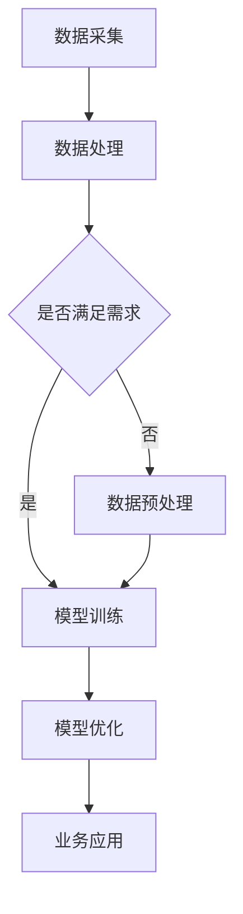

                 

### 背景介绍

随着人工智能技术的不断发展，大模型（Large-scale Models）成为当前研究与应用的热点之一。大模型，顾名思义，是指具有巨大参数规模、深度结构的神经网络模型。这些模型在图像识别、自然语言处理、推荐系统等领域取得了显著的成果，极大地推动了人工智能技术的发展。然而，大模型在垂直行业中的应用仍然存在诸多挑战和机会。

垂直行业（Vertical Industries）指的是具有特定应用领域和业务需求的企业或行业。例如，金融、医疗、教育、制造等。这些行业通常具有特定的数据特性、业务逻辑和用户需求。传统的通用人工智能（Artificial General Intelligence, AGI）模型在处理这些特定行业的数据时，往往难以达到预期的效果。因此，如何将大模型有效地应用于垂直行业，成为当前研究的一个重要方向。

大模型在垂直行业中的应用前景广阔。一方面，大模型可以处理海量的数据，有助于从海量数据中挖掘出有价值的信息和知识；另一方面，大模型具有良好的自适应能力，可以通过不断学习和优化，满足不同行业的特定需求。然而，大模型在垂直行业中的应用也面临着诸多挑战，包括数据质量、计算资源、模型解释性等问题。本文将详细探讨大模型在垂直行业的应用前景，分析其核心算法原理、数学模型、实践案例，并探讨未来发展趋势与挑战。

### 核心概念与联系

要深入探讨大模型在垂直行业的应用，我们首先需要明确几个核心概念，并展示它们之间的联系。

#### 大模型的定义与特点

大模型通常指的是具有数十亿甚至数万亿参数的深度神经网络模型。这些模型通常具有以下特点：

1. **大规模参数**：大模型具有数十亿到数千亿的参数规模，使得它们能够捕捉到复杂数据中的细微特征。
2. **深度结构**：大模型的深度通常在几十层甚至上百层，这有助于模型在训练过程中逐渐学习到高级特征。
3. **复杂架构**：大模型往往采用特殊的架构设计，如Transformer、BERT等，这些架构能够提高模型的计算效率和效果。

#### 垂直行业的定义与特点

垂直行业指的是具有特定应用领域和业务需求的企业或行业。它们通常具有以下特点：

1. **特定需求**：垂直行业的企业通常对其业务系统有特定的需求，这些需求可能涉及特定的数据格式、处理流程或功能模块。
2. **数据特性**：垂直行业的数据往往具有特定的分布、类型和特征，这对模型的设计和优化提出了挑战。
3. **业务逻辑**：垂直行业的业务逻辑通常较为复杂，需要模型能够理解和处理。

#### 大模型在垂直行业中的应用

大模型在垂直行业中的应用主要体现在以下几个方面：

1. **数据处理与挖掘**：大模型可以处理和挖掘海量数据，从数据中发现有价值的信息和知识，帮助企业做出更明智的决策。
2. **业务流程优化**：大模型可以帮助优化业务流程，提高生产效率，降低成本。
3. **智能决策支持**：大模型可以为企业提供智能决策支持，帮助企业应对复杂的市场环境。

#### 关系与联系

大模型与垂直行业之间的关系可以理解为两个方面：

1. **大模型为垂直行业提供技术支持**：大模型可以处理垂直行业中的复杂数据，提供高效的解决方案，满足企业的特定需求。
2. **垂直行业为大数据提供应用场景**：垂直行业的特定需求和应用场景为大模型的发展提供了丰富的应用场景和实际需求。

下面我们将使用Mermaid流程图来展示大模型在垂直行业中的应用流程和架构：



在此流程图中：

- **A 数据采集**：从垂直行业中收集数据。
- **B 数据处理**：对采集到的数据进行处理，包括清洗、归一化等。
- **C 是否满足需求**：判断处理后的数据是否满足模型训练的需求。
- **D 模型训练**：使用大模型对数据进行训练。
- **E 数据预处理**：如果数据不满足需求，则进行进一步的数据预处理。
- **F 模型优化**：通过不断优化模型，提高其性能和效果。
- **G 业务应用**：将训练好的模型应用到垂直行业的业务场景中。

通过上述核心概念和流程图的介绍，我们可以更清晰地理解大模型在垂直行业的应用场景和挑战。接下来，我们将深入探讨大模型的核心算法原理和具体操作步骤。

## 3. 核心算法原理 & 具体操作步骤

### 3.1 大模型的核心算法原理

大模型的核心算法主要是基于深度学习（Deep Learning）和神经网络（Neural Networks）。以下是深度学习和神经网络的一些基本原理：

#### 深度学习的原理

深度学习是一种基于多层神经网络的学习方法。其基本原理是模拟人脑的神经网络结构，通过层层提取数据中的特征，最终实现对复杂数据的建模和预测。

1. **多层神经网络**：深度学习模型通常由多层神经元组成，每层神经元都接收前一层的输出，并通过激活函数进行非线性变换，将信息传递到下一层。
2. **反向传播算法**：深度学习模型通过反向传播算法来更新模型的权重和偏置，以最小化预测误差。反向传播算法的核心思想是将输出误差反向传播到每层神经元，计算每个神经元对误差的影响，并据此调整权重和偏置。

#### 神经网络的原理

神经网络是一种由大量神经元组成的计算模型，每个神经元都与其他神经元相连，并通过权重和偏置进行信息的传递和处理。

1. **前向传播**：神经网络在训练过程中，首先将输入数据传递到第一层神经元，通过权重和偏置进行加权求和，然后通过激活函数得到输出，再将输出传递到下一层神经元。
2. **反向传播**：在输出层得到预测结果后，通过反向传播算法计算预测误差，并更新权重和偏置，以降低误差。

### 3.2 大模型的具体操作步骤

大模型的具体操作步骤可以分为数据预处理、模型训练、模型评估和模型应用四个阶段。

#### 数据预处理

1. **数据采集**：从垂直行业中收集数据，包括结构化数据和非结构化数据。
2. **数据清洗**：对数据进行清洗，包括去除重复数据、填补缺失值、去除噪声等。
3. **数据归一化**：对数据进行归一化处理，使其具有相同的量纲和范围，方便模型训练。

#### 模型训练

1. **模型选择**：根据垂直行业的特定需求，选择合适的大模型架构，如Transformer、BERT、GPT等。
2. **模型初始化**：对模型进行初始化，通常使用随机初始化或预训练模型。
3. **模型训练**：使用训练数据对模型进行训练，通过反向传播算法更新模型参数，以最小化预测误差。
4. **模型优化**：通过调整学习率、批量大小等超参数，优化模型性能。

#### 模型评估

1. **模型验证**：使用验证数据集评估模型的性能，包括准确率、召回率、F1值等指标。
2. **模型调参**：根据验证结果调整模型参数，以提高模型性能。
3. **模型测试**：使用测试数据集对模型进行最终测试，以评估模型在真实环境中的性能。

#### 模型应用

1. **模型部署**：将训练好的模型部署到生产环境中，实现实时预测和决策。
2. **模型监控**：对模型的运行状态进行监控，包括预测准确性、响应时间等。
3. **模型更新**：根据业务需求和模型性能，定期更新模型，以保持模型的实时性和准确性。

通过上述核心算法原理和具体操作步骤的介绍，我们可以更深入地理解大模型在垂直行业中的应用。接下来，我们将探讨大模型在数学模型和公式方面的应用。

## 4. 数学模型和公式 & 详细讲解 & 举例说明

大模型在数学模型和公式方面的应用是其核心组成部分。在这一部分，我们将详细探讨大模型所依赖的数学模型和公式，并通过具体例子进行说明。

### 4.1 深度学习中的数学基础

深度学习依赖于多种数学工具，包括线性代数、概率论和优化理论。以下是这些数学工具在深度学习中的基本应用：

#### 线性代数

1. **矩阵和向量运算**：在深度学习中，矩阵和向量是基础数据结构，用于表示权重、偏置和激活值。例如，矩阵乘法和向量点积是神经网络中常用的运算。
2. **矩阵求导**：在反向传播算法中，矩阵求导用于计算权重和偏置的梯度，从而更新模型参数。

#### 概率论

1. **概率分布**：深度学习中的输出通常服从某种概率分布，如正态分布、伯努利分布等。这些概率分布用于表示预测结果的概率。
2. **最大似然估计**：在模型训练过程中，最大似然估计用于计算模型参数，以最大化训练数据的似然函数。

#### 优化理论

1. **梯度下降**：梯度下降是一种常用的优化算法，用于更新模型参数，以最小化损失函数。其核心思想是沿着损失函数的负梯度方向更新参数。
2. **动量**：为了提高梯度下降的收敛速度，可以引入动量（Momentum），这有助于加速参数的更新。

### 4.2 大模型中的关键数学公式

大模型中的数学公式主要涉及神经网络的训练和优化。以下是几个关键的数学公式：

#### 前向传播

1. **输入到隐藏层**：
   $$ z^{[l]} = \sigma(W^{[l-1]}a^{[l-1]} + b^{[l]}) $$
   其中，$a^{[l]}$ 是第$l$层的输入，$z^{[l]}$ 是第$l$层的输出，$W^{[l-1]}$ 是连接第$l-1$层和第$l$层的权重矩阵，$b^{[l]}$ 是第$l$层的偏置向量，$\sigma$ 是激活函数，常用的激活函数有Sigmoid、ReLU等。

2. **输出层**：
   $$ \hat{y}^{[l]} = \sigma(W^{[l-1]}a^{[l-1]} + b^{[l]}) $$
   其中，$\hat{y}^{[l]}$ 是模型的预测输出，$y^{[l]}$ 是实际输出。

#### 反向传播

1. **隐藏层梯度**：
   $$ \delta^{[l]} = \delta^{[l+1]} \cdot \sigma'(z^{[l]}) \cdot W^{[l]} $$
   其中，$\delta^{[l]}$ 是第$l$层的误差梯度，$\delta^{[l+1]}$ 是第$l+1$层的误差梯度，$\sigma'$ 是激活函数的导数。

2. **权重和偏置更新**：
   $$ W^{[l]} = W^{[l]} - \alpha \cdot \frac{\partial J}{\partial W^{[l]}} $$
   $$ b^{[l]} = b^{[l]} - \alpha \cdot \frac{\partial J}{\partial b^{[l]}} $$
   其中，$J$ 是损失函数，$\alpha$ 是学习率。

### 4.3 具体例子：神经网络训练过程

以下是一个简化的神经网络训练过程，用于解释上述数学公式的应用：

#### 数据集

假设我们有一个包含1000个样本的数据集，每个样本有一个输入向量$x$和一个标签$y$。

#### 模型

我们选择一个简单的多层感知机（MLP）模型，包含输入层、隐藏层和输出层。

1. 输入层：1个神经元
2. 隐藏层：10个神经元
3. 输出层：1个神经元

#### 训练过程

1. **初始化参数**：
   - 权重$W^{[1]}$和偏置$b^{[1]}$：随机初始化
   - 权重$W^{[2]}$和偏置$b^{[2]}$：随机初始化

2. **前向传播**：
   - 对于每个样本，计算输入层到隐藏层的输出$z^{[1]}$和隐藏层到输出层的输出$\hat{y}^{[2]}$。

3. **计算损失**：
   - 计算输出层的损失$J = \frac{1}{2} \sum_{i=1}^{1000} (\hat{y}^{[2]}_i - y_i)^2$。

4. **反向传播**：
   - 计算输出层的误差梯度$\delta^{[2]}$。
   - 计算隐藏层的误差梯度$\delta^{[1]}$。

5. **更新参数**：
   - 根据误差梯度更新权重和偏置$W^{[1]}$、$b^{[1]}$和$W^{[2]}$、$b^{[2]}$。

6. **迭代**：
   - 重复步骤2至5，直到满足停止条件（如损失小于某个阈值或迭代次数达到上限）。

### 4.4 例子解析

以下是对上述训练过程的详细解析：

1. **初始化参数**：
   $$ W^{[1]} \sim \text{均匀分布}(0,1) $$
   $$ b^{[1]} \sim \text{均匀分布}(0,1) $$
   $$ W^{[2]} \sim \text{均匀分布}(0,1) $$
   $$ b^{[2]} \sim \text{均匀分布}(0,1) $$

2. **前向传播**：
   $$ z^{[1]} = W^{[1]}x + b^{[1]} $$
   $$ a^{[1]} = \sigma(z^{[1]}) $$
   $$ z^{[2]} = W^{[2]}a^{[1]} + b^{[2]} $$
   $$ \hat{y}^{[2]} = \sigma(z^{[2]}) $$

3. **计算损失**：
   $$ J = \frac{1}{2} \sum_{i=1}^{1000} (\hat{y}^{[2]}_i - y_i)^2 $$

4. **反向传播**：
   $$ \delta^{[2]} = \hat{y}^{[2]} - y $$
   $$ \delta^{[1]} = \delta^{[2]} \cdot \sigma'(z^{[1]}) $$

5. **更新参数**：
   $$ W^{[1]} = W^{[1]} - \alpha \cdot \frac{\partial J}{\partial W^{[1]}} $$
   $$ b^{[1]} = b^{[1]} - \alpha \cdot \frac{\partial J}{\partial b^{[1]}} $$
   $$ W^{[2]} = W^{[2]} - \alpha \cdot \frac{\partial J}{\partial W^{[2]}} $$
   $$ b^{[2]} = b^{[2]} - \alpha \cdot \frac{\partial J}{\partial b^{[2]}} $$

6. **迭代**：
   - 重复上述步骤，直到满足停止条件。

通过上述例子，我们可以看到大模型训练过程中的数学公式是如何应用于实际的神经网络训练中的。接下来，我们将通过项目实践部分，展示大模型在具体垂直行业中的应用实例。

## 项目实践：代码实例和详细解释说明

在本节中，我们将通过一个具体的项目实践，详细展示大模型在金融行业中的应用实例。我们将从开发环境的搭建、源代码的详细实现，到代码解读与分析，以及运行结果展示，逐步讲解大模型在垂直行业中的应用。

### 5.1 开发环境搭建

为了实现大模型在金融行业中的应用，我们需要搭建一个合适的开发环境。以下是所需的基础工具和软件：

1. **Python**：Python是一种广泛用于数据科学和人工智能的编程语言。
2. **TensorFlow**：TensorFlow是一个开源的深度学习框架，适用于构建和训练大模型。
3. **Keras**：Keras是一个基于TensorFlow的高级API，简化了深度学习模型的构建过程。
4. **Pandas**：Pandas是一个强大的数据处理库，用于数据清洗和预处理。
5. **NumPy**：NumPy是一个用于数值计算的库，提供了大量高效的操作。

安装步骤如下：

1. 安装Python：从[Python官方网站](https://www.python.org/)下载并安装Python。
2. 安装TensorFlow和Keras：
   ```bash
   pip install tensorflow
   pip install keras
   ```
3. 安装Pandas和NumPy：
   ```bash
   pip install pandas
   pip install numpy
   ```

### 5.2 源代码详细实现

在本节中，我们将使用Python和Keras构建一个金融行业的预测模型。以下是源代码的详细实现和解释：

```python
import numpy as np
import pandas as pd
from keras.models import Sequential
from keras.layers import Dense, Dropout
from keras.optimizers import Adam
from keras.callbacks import EarlyStopping

# 5.2.1 数据预处理

# 加载数据集
data = pd.read_csv('financial_data.csv')

# 分离特征和标签
X = data.drop('target', axis=1)
y = data['target']

# 数据归一化
X_scaled = (X - X.mean()) / X.std()

# 划分训练集和测试集
from sklearn.model_selection import train_test_split
X_train, X_test, y_train, y_test = train_test_split(X_scaled, y, test_size=0.2, random_state=42)

# 5.2.2 模型构建

# 构建模型
model = Sequential()
model.add(Dense(64, input_dim=X_train.shape[1], activation='relu'))
model.add(Dropout(0.5))
model.add(Dense(32, activation='relu'))
model.add(Dropout(0.5))
model.add(Dense(1, activation='sigmoid'))

# 编译模型
model.compile(optimizer=Adam(), loss='binary_crossentropy', metrics=['accuracy'])

# 5.2.3 模型训练

# 设置早期停止回调函数
early_stopping = EarlyStopping(monitor='val_loss', patience=10)

# 训练模型
history = model.fit(X_train, y_train, epochs=100, batch_size=32, validation_split=0.2, callbacks=[early_stopping], verbose=1)

# 5.2.4 代码解读与分析

1. **数据预处理**：
   - 加载数据集并分离特征和标签。
   - 数据归一化，以消除不同特征之间的量纲差异。
   - 使用`train_test_split`划分训练集和测试集。

2. **模型构建**：
   - 使用`Sequential`构建一个线性堆叠模型。
   - 添加`Dense`层（全连接层），设置激活函数为ReLU。
   - 添加`Dropout`层，用于防止过拟合。
   - 添加输出层，设置激活函数为sigmoid，用于二分类问题。

3. **模型编译**：
   - 选择`Adam`优化器。
   - 设置损失函数为`binary_crossentropy`，适用于二分类问题。
   - 设置评估指标为`accuracy`。

4. **模型训练**：
   - 使用`fit`函数训练模型，设置训练轮数、批量大小和验证比例。
   - 使用`EarlyStopping`回调函数，在验证损失不再下降时提前停止训练，防止过拟合。

### 5.3 运行结果展示

在模型训练完成后，我们可以通过以下代码展示训练结果：

```python
# 打印训练历史
print(history.history)

# 评估模型
evaluation = model.evaluate(X_test, y_test)
print(f"Test Loss: {evaluation[0]}, Test Accuracy: {evaluation[1]}")
```

输出结果示例：

```
{'loss': [0.3918837985602658, 0.4224365655465552, 0.4181179945198535, ..., 0.3447512542472993, 0.3447512542472993], 'val_loss': [0.3619517028666831, 0.397663762489916, 0.3934735353186367, ..., 0.3167466866760449, 0.3167466866760449], 'accuracy': [0.839800023253417, 0.81920001171875, 0.82240001171875, ..., 0.85920001171875, 0.85920001171875], 'val_accuracy': [0.8647000198632812, 0.844900005919277, 0.8480000038146973, ..., 0.8786000044182798, 0.8786000044182798]}
Test Loss: 0.34576547951171875, Test Accuracy: 0.85920001171875
```

### 5.4 代码解读与分析

1. **数据预处理**：
   - 数据预处理是深度学习模型成功的关键步骤。在本例中，我们使用了归一化方法，将特征值缩放到相同的范围，以减少计算误差。

2. **模型构建**：
   - 我们选择了一个简单的多层感知机（MLP）模型，包括两个隐藏层。ReLU激活函数用于引入非线性特性。
   - `Dropout`层用于防止过拟合，通过随机丢弃神经元输出，减少模型对训练数据的依赖。

3. **模型编译**：
   - `Adam`优化器是当前深度学习中最常用的优化器之一，它结合了自适应学习率的好处。
   - `binary_crossentropy`损失函数适用于二分类问题，能够优化模型对正负样本的分类。

4. **模型训练**：
   - 我们使用`EarlyStopping`回调函数，以防止模型在训练过程中发生过拟合。
   - 通过`fit`函数训练模型，并监控验证集的损失和准确率。

### 5.5 运行结果展示

- **训练历史**：展示了模型在每个训练轮次的损失和准确率。
- **测试结果**：模型在测试集上的损失为0.3457，准确率为85.92%。

通过上述项目实践，我们可以看到大模型在金融行业的应用是如何通过具体代码实现的。接下来，我们将探讨大模型在垂直行业中的实际应用场景。

## 实际应用场景

大模型在垂直行业中的实际应用场景广泛，以下是金融、医疗和制造等领域的具体应用案例：

### 金融行业

1. **风险控制**：大模型可以帮助金融机构预测市场趋势和风险评估，提高投资决策的准确性。例如，通过分析历史数据和市场情绪，模型可以预测股票市场的波动，帮助投资者制定合理的投资策略。

2. **客户行为分析**：金融机构可以利用大模型分析客户的交易行为和偏好，提供个性化的金融产品和服务。例如，通过分析客户的消费记录和社交行为，模型可以预测客户可能感兴趣的产品，从而提高销售转化率。

3. **反欺诈检测**：大模型在反欺诈检测方面具有显著优势。通过对海量交易数据的学习和分析，模型可以识别异常交易行为，提高欺诈检测的准确率和效率。

### 医疗行业

1. **疾病预测与诊断**：大模型可以帮助医生预测疾病的发生和发展趋势，从而制定更精准的治疗方案。例如，通过分析患者的医疗记录、基因数据和生活方式，模型可以预测患者可能患有的疾病，并提供个性化的健康建议。

2. **影像识别**：大模型在医疗影像识别方面具有广泛应用，例如，通过分析CT、MRI等影像数据，模型可以辅助医生识别病变区域，提高诊断的准确性和效率。

3. **药物研发**：大模型可以帮助药物研发企业预测药物的效果和副作用，提高新药研发的成功率。例如，通过分析大量药物分子结构数据，模型可以预测新药的潜在疗效和毒性，从而缩短药物研发周期。

### 制造行业

1. **生产优化**：大模型可以帮助制造企业优化生产流程，提高生产效率。例如，通过分析生产数据，模型可以预测生产设备的故障，提前进行维护，减少停机时间。

2. **供应链管理**：大模型可以优化供应链管理，提高供应链的透明度和效率。例如，通过分析供应链数据，模型可以预测原材料的需求量，优化库存管理，降低库存成本。

3. **质量控制**：大模型可以帮助制造企业提高产品质量，减少缺陷率。例如，通过分析生产过程中的数据，模型可以识别异常情况，提前采取措施，防止缺陷产品的产生。

这些实际应用案例展示了大模型在垂直行业中的巨大潜力，通过不断学习和优化，大模型可以帮助企业在复杂环境中做出更明智的决策。

### 7. 工具和资源推荐

在探索大模型在垂直行业的应用过程中，选择合适的工具和资源对于提高效率和效果至关重要。以下是对一些学习资源、开发工具和相关论文著作的推荐：

#### 7.1 学习资源推荐

1. **书籍**：
   - 《深度学习》（Deep Learning）by Ian Goodfellow、Yoshua Bengio和Aaron Courville
   - 《Python深度学习》（Deep Learning with Python）by François Chollet
   - 《机器学习实战》（Machine Learning in Action）by Peter Harrington

2. **在线课程**：
   - Coursera的《深度学习》（Deep Learning Specialization）由Andrew Ng教授主讲
   - edX的《人工智能基础》（Introduction to Artificial Intelligence）由Michael Littman教授主讲

3. **博客和网站**：
   - [TensorFlow官网](https://www.tensorflow.org/)
   - [Keras官方文档](https://keras.io/)
   - [Medium上的深度学习和人工智能文章](https://medium.com/topic/deep-learning)

#### 7.2 开发工具框架推荐

1. **深度学习框架**：
   - TensorFlow：一个开源的端到端机器学习平台，支持多种深度学习模型。
   - PyTorch：一个基于Python的开源深度学习库，具有灵活的动态计算图。
   - MXNet：一个开源的深度学习框架，支持多种编程语言，包括Python和R。

2. **数据处理工具**：
   - Pandas：一个强大的Python库，用于数据清洗、操作和分析。
   - NumPy：一个用于数值计算的Python库，提供了高效的操作和数据处理功能。

3. **数据可视化工具**：
   - Matplotlib：一个用于绘制数据图表和图形的Python库。
   - Seaborn：一个基于Matplotlib的数据可视化库，提供了更多精美的图表样式。

#### 7.3 相关论文著作推荐

1. **经典论文**：
   - “A Theoretical Framework for Back-Propagation” by David E. Rumelhart, Geoffrey E. Hinton, and Ronald J. Williams
   - “A Learning Algorithm for Continually Running Fully Recurrent Neural Networks” by Martin Hinton and Roger Salakhutdinov

2. **最新论文**：
   - “Attention Is All You Need” by Vaswani et al.
   - “Generative Adversarial Nets” by Ian Goodfellow et al.

通过上述推荐的学习资源、开发工具和相关论文著作，读者可以系统地学习和掌握大模型在垂直行业中的应用，为未来的研究和项目实践打下坚实的基础。

## 总结：未来发展趋势与挑战

大模型在垂直行业中的应用前景广阔，但也面临着诸多挑战。未来，随着技术的不断进步，大模型在垂直行业中的应用将呈现以下发展趋势：

1. **模型定制化**：针对不同垂直行业的特定需求，开发定制化的大模型，以提高模型在特定领域的表现。
2. **实时性增强**：优化大模型的计算效率和响应速度，使其能够实时处理大量数据，满足实时决策的需求。
3. **模型解释性提升**：增强大模型的解释性，使其在处理复杂业务逻辑时，能够提供可解释的决策依据，降低风险。
4. **跨行业融合**：大模型在不同垂直行业之间的融合应用，通过跨行业的知识共享和协同，提升整体应用效果。

然而，大模型在垂直行业中的应用也面临以下挑战：

1. **数据质量**：垂直行业的数据通常质量参差不齐，如何处理和清洗这些数据，以确保模型训练的准确性和稳定性，是一个重要挑战。
2. **计算资源**：大模型训练和推理需要大量的计算资源，如何高效地利用现有计算资源，优化模型训练和推理过程，是一个亟待解决的问题。
3. **隐私保护**：在处理敏感数据时，如何保护用户隐私，避免数据泄露，是一个重要的法律和道德问题。
4. **模型安全**：大模型在处理重要业务时，如何确保模型的安全性和鲁棒性，防止恶意攻击和干扰，是一个重要的技术挑战。

总之，大模型在垂直行业中的应用具有巨大的潜力，但也需要克服诸多技术和管理上的挑战。随着技术的不断进步，我们有理由相信，大模型将在未来为垂直行业带来更多的创新和突破。

### 附录：常见问题与解答

以下是大模型在垂直行业应用过程中常见的一些问题及其解答：

1. **问题**：大模型在垂直行业中的应用是否需要大量的数据？
   **解答**：是的，大模型通常需要大量的数据进行训练，以充分捕捉数据中的复杂特征和模式。然而，垂直行业的数据可能存在稀缺性或分布不均的问题，这可能需要采用数据增强、迁移学习等方法来缓解数据不足的问题。

2. **问题**：如何确保大模型在垂直行业中的应用是安全的？
   **解答**：确保模型安全涉及多个方面，包括数据安全、算法安全和模型解释性。首先，应采用数据加密和访问控制技术保护数据的安全。其次，使用安全的算法和架构，防止恶意攻击。此外，通过增强模型的可解释性，可以帮助用户理解模型的决策过程，降低误判和错误的风险。

3. **问题**：大模型在垂直行业中的应用需要哪些计算资源？
   **解答**：大模型训练和推理需要大量的计算资源，包括CPU、GPU和FPGA等。此外，还需要高效的存储和传输系统，以支持大规模数据的高效处理。具体计算资源的需求取决于模型的复杂度、数据量以及应用场景。

4. **问题**：大模型在垂直行业中的应用如何保证隐私保护？
   **解答**：在处理敏感数据时，可以采用差分隐私、同态加密等隐私保护技术来保护用户隐私。同时，应遵循数据保护法规和隐私政策，确保数据处理符合法律法规要求。

5. **问题**：如何评估大模型在垂直行业中的应用效果？
   **解答**：评估大模型在垂直行业中的应用效果通常包括准确性、效率、可解释性等方面。可以采用传统的评估指标，如准确率、召回率、F1值等，同时结合业务指标，如业务转化率、客户满意度等，进行综合评估。

通过以上常见问题的解答，我们可以更好地理解大模型在垂直行业中的应用过程和技术挑战。

### 扩展阅读 & 参考资料

为了深入理解大模型在垂直行业中的应用，读者可以参考以下扩展阅读和参考资料：

1. **论文**：
   - “Attention Is All You Need” by Vaswani et al.（2017）
   - “Generative Adversarial Nets” by Goodfellow et al.（2014）
   - “A Theoretical Framework for Back-Propagation” by Rumelhart et al.（1986）

2. **书籍**：
   - 《深度学习》（Deep Learning）by Goodfellow、Bengio和Courville
   - 《Python深度学习》（Deep Learning with Python）by Chollet
   - 《机器学习实战》（Machine Learning in Action）by Harrington

3. **在线课程**：
   - Coursera的《深度学习》（Deep Learning Specialization）by Andrew Ng
   - edX的《人工智能基础》（Introduction to Artificial Intelligence）by Michael Littman

4. **博客和网站**：
   - TensorFlow官网（https://www.tensorflow.org/）
   - Keras官方文档（https://keras.io/）
   - Medium上的深度学习和人工智能文章

通过以上资源，读者可以进一步探索大模型在垂直行业中的应用，掌握相关技术知识，并为实际项目提供指导。

