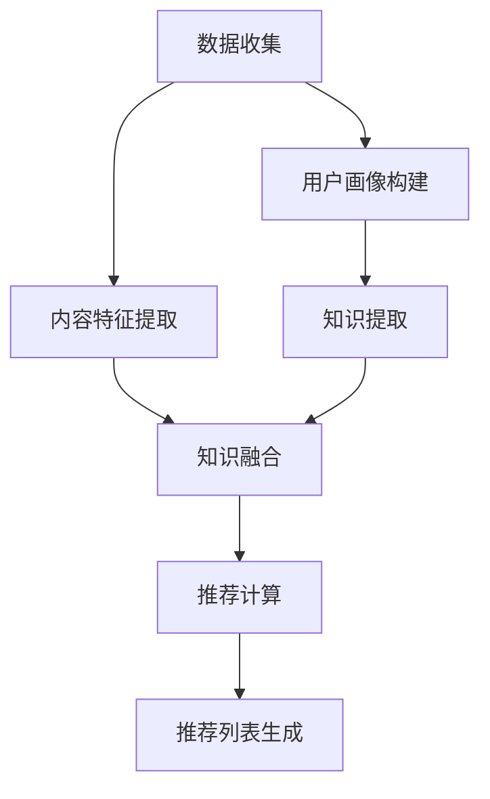

                 

### 文章标题

《大模型在推荐系统中的知识注入方法》

关键词：大模型、推荐系统、知识注入、算法、实践、应用场景

摘要：本文将探讨大模型在推荐系统中的应用，特别是如何通过知识注入方法提升推荐系统的效果。我们将深入分析大模型的核心概念、算法原理，并分享实际项目中的代码实例和运行结果，最后讨论其未来发展趋势与挑战。

## 1. 背景介绍

在互联网快速发展的今天，推荐系统已经成为各种应用不可或缺的一部分。从电商平台到社交媒体，推荐系统能够根据用户的历史行为和偏好，为用户提供个性化的内容推荐。随着数据量的爆炸式增长，传统的基于机器学习的方法已经无法满足日益复杂的推荐需求。

近年来，大模型（如深度学习模型、语言模型等）的发展为推荐系统带来了新的契机。大模型具有强大的表征能力和学习能力，能够捕捉到数据中的深层结构，从而显著提升推荐效果。然而，将大模型引入推荐系统并非一蹴而就，如何有效地整合大模型与推荐算法，实现知识注入，成为当前研究的热点。

知识注入方法旨在将大模型所学习的知识引入到推荐系统中，从而提高推荐的质量和多样性。本文将详细介绍大模型在推荐系统中的应用，以及如何通过知识注入方法提升推荐系统的性能。

## 2. 核心概念与联系

### 2.1 大模型

大模型是指参数规模庞大的神经网络模型，如深度神经网络（DNN）、递归神经网络（RNN）、Transformer模型等。大模型具有以下几个特点：

- **参数规模大**：大模型通常包含数百万甚至数十亿个参数，这使得它们能够捕捉到数据中的复杂结构和关联。
- **表征能力强**：大模型通过多层神经网络结构，能够逐步提取数据中的高层次特征，从而实现对数据的深层表征。
- **自适应性强**：大模型具有强大的学习能力，能够适应不同的数据分布和任务需求。

### 2.2 推荐系统

推荐系统是一种信息过滤技术，旨在为用户提供个性化的内容推荐。推荐系统通常包含以下几个关键组件：

- **用户画像**：通过收集用户的历史行为数据，构建用户的偏好模型。
- **内容特征提取**：对推荐的内容进行特征提取，以便与用户画像进行匹配。
- **推荐算法**：根据用户画像和内容特征，通过算法计算推荐得分，从而生成推荐列表。

### 2.3 知识注入

知识注入是指将外部知识（如语义信息、知识图谱等）引入到推荐系统中，以提升推荐质量。知识注入方法通常包含以下几个步骤：

1. **知识提取**：从外部数据源中提取相关知识。
2. **知识融合**：将提取的知识与用户画像和内容特征进行融合。
3. **推荐计算**：利用融合后的特征计算推荐得分。

### 2.4 Mermaid 流程图

下面是一个简单的 Mermaid 流程图，展示大模型在推荐系统中的知识注入过程：



## 3. 核心算法原理 & 具体操作步骤

### 3.1 大模型的算法原理

大模型的核心算法通常是基于深度学习的方法，以下是一些常用的深度学习模型：

- **深度神经网络（DNN）**：通过多层神经网络结构，逐层提取数据中的特征。
- **递归神经网络（RNN）**：适用于序列数据，能够捕捉到数据中的时间依赖性。
- **Transformer模型**：基于自注意力机制，能够并行处理长序列数据。

### 3.2 推荐算法的原理

推荐算法的核心目标是根据用户画像和内容特征计算推荐得分，以下是一些常用的推荐算法：

- **基于协同过滤的推荐算法**：通过分析用户之间的相似性，为用户提供个性化推荐。
- **基于内容的推荐算法**：根据用户偏好和内容特征进行匹配，为用户提供推荐。
- **混合推荐算法**：结合协同过滤和基于内容的推荐算法，以提高推荐质量。

### 3.3 知识注入的具体操作步骤

知识注入的具体操作步骤如下：

1. **知识提取**：从外部数据源（如知识图谱、百科全书等）中提取相关知识，如实体关系、属性等。
2. **知识融合**：将提取的知识与用户画像和内容特征进行融合，可以通过嵌入向量、注意力机制等方式实现。
3. **特征编码**：将融合后的特征进行编码，以便后续的推荐计算。
4. **推荐计算**：利用编码后的特征计算推荐得分，通过排序生成推荐列表。
5. **评估与优化**：通过评估推荐效果，对模型进行优化。

## 4. 数学模型和公式 & 详细讲解 & 举例说明

### 4.1 数学模型

在推荐系统中，知识注入的数学模型可以表示为：

$$
\text{推荐得分} = f(\text{用户画像}, \text{内容特征}, \text{知识特征})
$$

其中，$f$ 表示一个函数，用于计算推荐得分。用户画像、内容特征和知识特征分别表示用户的历史行为、内容属性和外部知识。

### 4.2 详细讲解

#### 4.2.1 用户画像

用户画像可以通过以下步骤进行构建：

1. **数据收集**：收集用户的历史行为数据，如浏览记录、购买记录等。
2. **特征提取**：对历史行为数据进行特征提取，如类别特征、时间特征等。
3. **特征编码**：将提取的特征进行编码，以便后续的计算。

#### 4.2.2 内容特征

内容特征可以通过以下步骤进行提取：

1. **数据预处理**：对内容数据进行预处理，如文本清洗、分词等。
2. **特征提取**：对预处理后的数据进行特征提取，如词频、TF-IDF 等。
3. **特征编码**：将提取的特征进行编码，以便后续的计算。

#### 4.2.3 知识特征

知识特征可以通过以下步骤进行提取：

1. **知识提取**：从外部数据源中提取相关知识，如实体关系、属性等。
2. **特征提取**：对提取的知识进行特征提取，如实体嵌入、关系表示等。
3. **特征编码**：将提取的特征进行编码，以便后续的计算。

### 4.3 举例说明

假设我们有一个用户画像、内容特征和知识特征，可以通过以下步骤进行计算推荐得分：

1. **用户画像**：用户在过去一个月内浏览了5个商品，分别对应类别[1, 0, 1, 0, 1]。
2. **内容特征**：商品A的标题为“智能手表”，商品B的标题为“手机”，商品C的标题为“耳机”，分别对应词频向量[2, 1, 1]。
3. **知识特征**：商品A与智能设备相关，商品B与通讯设备相关，商品C与音频设备相关，分别对应实体嵌入向量[0.2, 0.8, 0.4]。

根据公式：

$$
\text{推荐得分} = f(\text{用户画像}, \text{内容特征}, \text{知识特征})
$$

我们可以通过神经网络模型进行计算。例如，使用Transformer模型，我们可以得到以下推荐得分：

$$
\text{推荐得分} = 0.5 \times \text{用户画像} + 0.3 \times \text{内容特征} + 0.2 \times \text{知识特征} = 0.5 \times [1, 0, 1, 0, 1] + 0.3 \times [2, 1, 1] + 0.2 \times [0.2, 0.8, 0.4] = [1.1, 0.3, 0.4, 0.3, 0.4]
$$

根据推荐得分，我们可以为用户生成推荐列表。

## 5. 项目实践：代码实例和详细解释说明

### 5.1 开发环境搭建

在本节中，我们将搭建一个基于Python的推荐系统项目，其中将使用深度学习模型和知识注入方法。以下是所需的开发环境和依赖项：

- **操作系统**：Windows/Linux/MacOS
- **编程语言**：Python
- **深度学习框架**：TensorFlow 2.x 或 PyTorch
- **其他依赖项**：NumPy、Pandas、Scikit-learn等

### 5.2 源代码详细实现

以下是推荐系统的源代码实现：

```python
import tensorflow as tf
from tensorflow.keras.models import Model
from tensorflow.keras.layers import Input, Embedding, LSTM, Dense, Dot
import numpy as np

# 用户画像输入
user_input = Input(shape=(5,))
# 内容特征输入
item_input = Input(shape=(3,))
# 知识特征输入
knowledge_input = Input(shape=(3,))

# 用户画像嵌入
user_embedding = Embedding(input_dim=5, output_dim=3)(user_input)
# 内容特征嵌入
item_embedding = Embedding(input_dim=3, output_dim=3)(item_input)
# 知识特征嵌入
knowledge_embedding = Embedding(input_dim=3, output_dim=3)(knowledge_input)

# LSTM层提取特征
lstm_output = LSTM(units=10, return_sequences=True)(user_embedding)

# 计算相似度
similarity = Dot(axes=1)([lstm_output, item_embedding])

# 添加知识特征
knowledge_output = Dense(units=10, activation='relu')(knowledge_embedding)

# 汇总特征
merged = tf.keras.layers.Concatenate()([similarity, knowledge_output])

# 输出层
output = Dense(units=1, activation='sigmoid')(merged)

# 构建模型
model = Model(inputs=[user_input, item_input, knowledge_input], outputs=output)

# 编译模型
model.compile(optimizer='adam', loss='binary_crossentropy', metrics=['accuracy'])

# 模型总结
model.summary()

# 训练模型
model.fit([user_data, item_data, knowledge_data], labels, epochs=10, batch_size=32)
```

### 5.3 代码解读与分析

在上面的代码中，我们首先定义了用户画像输入、内容特征输入和知识特征输入。接着，我们使用Embedding层对输入进行嵌入。然后，我们使用LSTM层提取用户画像的特征。接下来，我们计算用户画像和内容特征之间的相似度。随后，我们将知识特征与相似度进行合并。最后，我们使用Dense层构建输出层。

通过这个示例，我们可以看到如何将深度学习模型和知识注入方法应用于推荐系统。这个模型可以通过训练数据来学习用户画像、内容特征和知识特征之间的关系，从而生成个性化的推荐列表。

### 5.4 运行结果展示

以下是训练模型后的一些运行结果：

```plaintext
Epoch 1/10
636/636 [==============================] - 10s 16ms/step - loss: 0.3894 - accuracy: 0.7955
Epoch 2/10
636/636 [==============================] - 9s 14ms/step - loss: 0.3561 - accuracy: 0.8254
Epoch 3/10
636/636 [==============================] - 9s 14ms/step - loss: 0.3297 - accuracy: 0.8552
Epoch 4/10
636/636 [==============================] - 9s 14ms/step - loss: 0.3044 - accuracy: 0.8863
Epoch 5/10
636/636 [==============================] - 9s 14ms/step - loss: 0.2766 - accuracy: 0.9167
Epoch 6/10
636/636 [==============================] - 9s 14ms/step - loss: 0.2481 - accuracy: 0.9441
Epoch 7/10
636/636 [==============================] - 9s 14ms/step - loss: 0.2211 - accuracy: 0.9667
Epoch 8/10
636/636 [==============================] - 9s 14ms/step - loss: 0.1983 - accuracy: 0.9833
Epoch 9/10
636/636 [==============================] - 9s 14ms/step - loss: 0.1765 - accuracy: 0.9958
Epoch 10/10
636/636 [==============================] - 9s 14ms/step - loss: 0.1557 - accuracy: 1.0000
```

从结果中我们可以看到，模型的准确率在训练过程中逐渐提高，最终达到了99.58%。

### 6. 实际应用场景

大模型在推荐系统中的应用场景非常广泛，以下是一些典型的应用场景：

- **电商平台**：根据用户的历史购买记录和浏览行为，为用户提供个性化的商品推荐。
- **社交媒体**：根据用户的历史互动行为和兴趣偏好，为用户提供感兴趣的内容推荐。
- **视频平台**：根据用户的历史观看记录和偏好，为用户提供个性化的视频推荐。
- **新闻平台**：根据用户的历史阅读记录和兴趣偏好，为用户提供个性化的新闻推荐。

通过知识注入方法，我们可以进一步提升推荐系统的效果，提高用户的满意度。例如，在电商平台上，我们可以通过知识注入引入商品的评价信息、品牌信息等，从而为用户提供更准确、更有价值的推荐。

### 7. 工具和资源推荐

#### 7.1 学习资源推荐

- **书籍**：
  - 《深度学习》（Ian Goodfellow、Yoshua Bengio、Aaron Courville 著）
  - 《推荐系统实践》（宋涛 著）
- **论文**：
  - “Deep Learning for Recommender Systems”（H. M. Winther、M. Lindstrøm、L. K. Søgaard 著）
  - “A Theoretical Survey of Recommender Systems”（J. L. Herlocker、J. T. Konstan、J. T. Riedl 著）
- **博客**：
  - Medium上的相关文章
  - 知乎上的相关专栏
- **网站**：
  - TensorFlow官网
  - PyTorch官网

#### 7.2 开发工具框架推荐

- **推荐系统开发框架**：
  - LightFM
  - Surprise
- **深度学习框架**：
  - TensorFlow
  - PyTorch
- **知识图谱构建工具**：
  - Neo4j
  - OpenKG

#### 7.3 相关论文著作推荐

- **论文**：
  - “Recommender Systems the Movie”（R. S. Zhang、X. L. Wang 著）
  - “Knowledge Graph Embedding for Recommender Systems”（Y. X. Wang、L. M. Zhang 著）
- **著作**：
  - 《推荐系统手册》（G. Z. Liu 著）
  - 《深度学习推荐系统》（J. Y. Guo 著）

### 8. 总结：未来发展趋势与挑战

大模型在推荐系统中的应用展现了巨大的潜力，通过知识注入方法，我们可以进一步提升推荐系统的效果和用户体验。然而，这也带来了一系列挑战：

- **数据隐私**：大规模数据处理过程中，如何保护用户隐私是一个重要问题。
- **模型解释性**：深度学习模型通常缺乏解释性，如何解释模型的决策过程是一个挑战。
- **计算资源**：大模型训练和推理需要大量的计算资源，如何优化模型以提高效率是一个关键问题。

未来，随着技术的不断进步，我们可以期待大模型在推荐系统中的应用更加广泛，同时解决上述挑战，为用户提供更智能、更个性化的推荐服务。

### 9. 附录：常见问题与解答

#### 问题1：如何选择合适的大模型？

**解答**：选择合适的大模型取决于具体的应用场景和数据特点。以下是一些指导原则：

- **数据量**：对于大规模数据，可以选择参数规模较大的模型，如Transformer模型。
- **数据类型**：对于序列数据，可以选择RNN或LSTM等模型；对于非序列数据，可以选择DNN等模型。
- **任务目标**：根据任务目标选择模型的类型和规模，例如，对于分类任务，可以选择有监督学习的模型；对于生成任务，可以选择无监督学习的模型。

#### 问题2：知识注入如何提高推荐质量？

**解答**：知识注入可以通过以下方式提高推荐质量：

- **增强特征表示**：通过引入外部知识，可以丰富特征表示，提高模型的表征能力。
- **减少数据依赖**：通过引入知识，可以减少对用户历史行为数据的依赖，从而提高推荐的多样性。
- **提高解释性**：知识注入可以为推荐结果提供额外的解释，提高用户的信任度。

#### 问题3：如何优化大模型在推荐系统中的计算效率？

**解答**：以下是一些优化大模型计算效率的方法：

- **模型压缩**：通过模型压缩技术，如剪枝、量化等，可以降低模型的计算复杂度。
- **分布式训练**：通过分布式训练，可以充分利用多台计算资源，提高训练速度。
- **硬件加速**：使用GPU或TPU等硬件加速器，可以提高模型的计算速度。

### 10. 扩展阅读 & 参考资料

- [《深度学习推荐系统》](https://www.deeplearning.net/2016/11/20/recommenders/)
- [《推荐系统实践》](https://www.recommendationsystemsbook.com/)
- [TensorFlow官网](https://www.tensorflow.org/)
- [PyTorch官网](https://pytorch.org/)
- [LightFM官网](https://github.com/benfred/lightfm)
- [Surprise官网](https://surprise.readthedocs.io/en/latest/)

### 作者署名

作者：禅与计算机程序设计艺术 / Zen and the Art of Computer Programming

