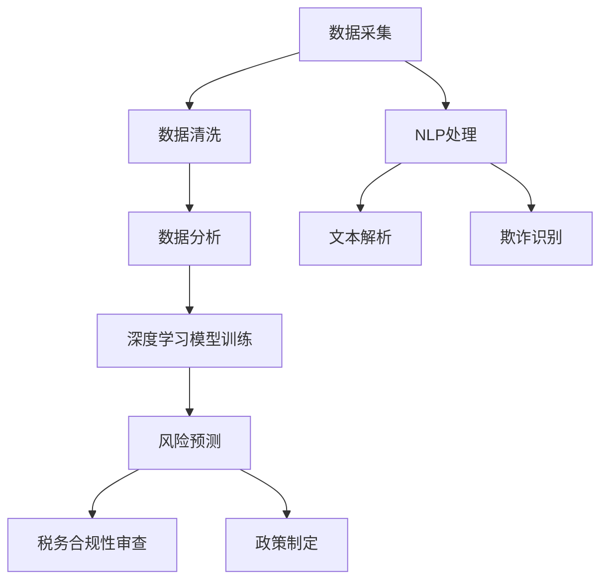

                 

### 背景介绍

随着全球信息化和数字化进程的加速，税务领域也在经历着前所未有的变革。传统的税务管理方式依赖于大量的纸质文件和人工处理，这不仅效率低下，而且在数据准确性和安全性方面也存在诸多问题。为了应对这些挑战，税务部门开始积极探索利用先进技术，尤其是人工智能（AI）技术，来优化和提升税务管理能力。

近年来，人工智能技术取得了显著的进展，特别是深度学习和大数据分析等技术的成熟，使得AI在多个领域都展现出了强大的应用潜力。在税务领域，AI技术的引入不仅能够大幅提升数据处理和分析的效率，还能通过智能化手段解决许多复杂问题，从而为税务管理带来革命性的变化。

首先，AI技术可以帮助税务部门实现自动化数据采集和分类。通过对海量税务数据的自动抓取、清洗和分析，AI能够快速识别出潜在的税务风险和异常行为，为税务稽查提供有力的数据支持。此外，AI还可以通过对历史税务数据的分析，预测未来税收趋势，为税务政策的制定提供科学依据。

其次，AI技术在税务合规性审查方面也具有重要作用。通过自然语言处理技术，AI能够自动审查和解析税法条款，帮助企业准确理解和遵守税务法规。同时，AI还可以通过机器学习算法，识别和防范税务欺诈行为，提高税务管理的透明度和公正性。

此外，AI技术在税务客户服务方面也展现出了巨大潜力。智能客服系统能够通过语音识别和自然语言理解技术，与纳税人进行实时交互，提供便捷的税务咨询服务。这不仅提高了税务部门的响应速度和服务质量，还有助于减少人工成本。

总的来说，AI技术在税务领域的应用不仅能够提高税务管理的效率和准确性，还能促进税务制度的完善和优化。随着AI技术的不断发展和成熟，我们有理由相信，税务领域将会迎来更加智能化和高效化的未来。### 核心概念与联系

在深入探讨AI在税务领域的辅助作用之前，我们需要首先了解一些核心概念和技术，以便更好地理解其工作原理和应用场景。

#### 1. 人工智能（AI）概述

人工智能（Artificial Intelligence，AI）是指使计算机系统能够执行通常需要人类智能才能完成的任务的技术。AI可以分为两类：窄AI（Narrow AI）和通用AI（General AI）。窄AI专注于特定任务，如语音识别、图像识别和自然语言处理，而通用AI则具备人类水平的跨领域认知能力。

#### 2. 深度学习（Deep Learning）

深度学习是AI的一个分支，它基于多层神经网络（Neural Networks）进行工作。通过训练大量的数据，深度学习模型能够自动学习数据的特征和模式，从而实现复杂的任务。在税务领域，深度学习可以用于数据分类、预测和异常检测等。

#### 3. 大数据（Big Data）

大数据是指数据量巨大、种类繁多且生成速度极快的数据集合。在税务领域，大数据包括纳税申报数据、税务合规性数据、税务处罚数据等。大数据技术的核心在于如何快速、准确地处理和分析这些海量数据，从而提取有价值的信息。

#### 4. 自然语言处理（NLP）

自然语言处理是AI的一个分支，旨在使计算机能够理解、解释和生成人类语言。在税务领域，NLP可以用于自动处理税务法规文本、解析纳税人的申报资料、识别税务欺诈行为等。

#### 5. 机器学习（Machine Learning）

机器学习是AI的一个分支，它使计算机能够通过数据和经验进行学习，从而做出预测和决策。在税务领域，机器学习可以用于预测税收收入、识别潜在税务风险、优化税务政策等。

#### 关联与联系

这些核心概念和技术在税务领域中的应用并非孤立存在，而是相互关联、协同作用。例如，深度学习可以通过分析海量税务数据，发现潜在的风险和趋势；大数据技术则可以处理这些海量数据，提供全面的分析支持；自然语言处理可以帮助税务部门理解和解释复杂的税法条款；机器学习则可以通过历史数据预测未来的税收趋势，为政策制定提供参考。

下面是一个使用Mermaid绘制的简化的AI在税务领域应用的核心流程图，展示了这些概念和技术之间的关系。



在这个流程图中，数据采集是整个流程的起点，通过数据清洗、数据分析和深度学习模型训练，最终实现风险预测、税务合规性审查和政策制定。同时，自然语言处理（NLP）在这个过程中起到了关键作用，帮助税务部门理解和处理复杂的文本数据。

通过上述核心概念和流程的介绍，我们可以更深入地理解AI在税务领域的辅助作用，为后续详细讨论核心算法原理和具体应用场景打下坚实的基础。### 核心算法原理 & 具体操作步骤

在深入探讨AI在税务领域的应用时，我们需要了解一些关键算法和具体操作步骤。这些算法包括但不限于：深度学习、大数据分析、自然语言处理和机器学习。以下将逐一介绍这些算法的基本原理和税务领域中的应用方法。

#### 1. 深度学习

深度学习是一种基于多层神经网络的人工智能技术。它通过模仿人脑的结构和功能，从大量数据中自动学习特征和模式。在税务领域，深度学习可以应用于以下几个方面：

##### （1）税务数据分类

深度学习可以通过对历史税务数据进行分类，帮助税务部门快速识别和分类不同类型的纳税申报数据。具体步骤如下：

- **数据预处理**：对原始税务数据（如纳税申报表）进行清洗和归一化处理，去除噪声和异常值。
- **构建神经网络模型**：选择合适的神经网络架构，如卷积神经网络（CNN）或循环神经网络（RNN），并将其应用于税务数据的分类任务。
- **模型训练**：使用预处理的税务数据集，通过反向传播算法（Backpropagation）训练神经网络模型，使其能够自动学习数据特征。
- **模型评估与优化**：使用验证集和测试集评估模型性能，通过调整网络结构和超参数，优化模型效果。

##### （2）异常检测

深度学习还可以用于识别税务数据中的异常行为，如税务欺诈或错误申报。具体步骤如下：

- **数据预处理**：对历史税务数据进行异常检测的数据预处理，包括去噪、归一化等。
- **构建深度学习模型**：选择合适的异常检测模型，如孤立森林（Isolation Forest）或自动编码器（Autoencoder）。
- **模型训练**：使用异常检测算法训练模型，使其能够识别出正常数据中的异常模式。
- **模型评估**：通过计算模型对异常数据的识别准确率，评估模型性能，并进行优化。

#### 2. 大数据分析

大数据分析技术能够处理和分析海量税务数据，从而提取有价值的信息和洞察。在税务领域，大数据分析可以应用于以下几个方面：

##### （1）趋势预测

大数据分析可以通过历史税务数据，预测未来的税收收入和趋势。具体步骤如下：

- **数据收集**：收集与税收相关的各种数据，如税收申报数据、经济指标数据等。
- **数据预处理**：对收集到的数据进行清洗、归一化和特征提取，以去除噪声和提取关键特征。
- **构建预测模型**：使用时间序列分析模型（如ARIMA模型）或机器学习算法（如随机森林）构建预测模型。
- **模型训练与评估**：使用历史数据集训练模型，并通过交叉验证等方法评估模型性能。
- **预测与优化**：使用训练好的模型进行未来税收趋势的预测，并根据预测结果进行调整和优化。

##### （2）风险管理

大数据分析可以帮助税务部门识别和评估税务风险，从而制定相应的风险管理策略。具体步骤如下：

- **数据收集**：收集与税务风险管理相关的数据，如纳税人的信用评分数据、税务处罚记录等。
- **数据预处理**：对收集到的数据进行清洗、归一化和特征提取，以去除噪声和提取关键特征。
- **构建风险评估模型**：使用风险评估算法（如逻辑回归、决策树等）构建风险评估模型。
- **模型训练与评估**：使用历史数据集训练模型，并通过交叉验证等方法评估模型性能。
- **风险评估与优化**：使用训练好的模型对纳税人进行风险评估，并根据评估结果制定相应的风险管理策略。

#### 3. 自然语言处理

自然语言处理技术可以用于理解和处理税务领域中的文本数据，如税法条款、纳税申报表等。在税务领域，自然语言处理可以应用于以下几个方面：

##### （1）文本分类

自然语言处理技术可以将文本数据自动分类到不同的类别，如税法条款的分类。具体步骤如下：

- **数据收集**：收集与税法条款相关的文本数据，如税法文本、案例判决书等。
- **数据预处理**：对文本数据进行清洗、分词和词性标注，以提取有用的信息。
- **构建分类模型**：选择合适的文本分类算法，如朴素贝叶斯分类器或支持向量机（SVM），并将其应用于税法条款分类任务。
- **模型训练与评估**：使用预处理的文本数据集训练分类模型，并通过交叉验证等方法评估模型性能。
- **分类与优化**：使用训练好的模型对新的文本数据进行分类，并根据分类结果进行模型优化。

##### （2）文本解析

自然语言处理技术可以自动解析和提取文本数据中的关键信息，如纳税人的姓名、地址、收入等信息。具体步骤如下：

- **数据收集**：收集与税务申报相关的文本数据，如纳税申报表、财务报表等。
- **数据预处理**：对文本数据进行清洗、分词和词性标注，以提取有用的信息。
- **构建解析模型**：选择合适的文本解析算法，如命名实体识别（NER）或关系抽取（RE），并将其应用于税务申报文本的解析任务。
- **模型训练与评估**：使用预处理的文本数据集训练解析模型，并通过交叉验证等方法评估模型性能。
- **解析与优化**：使用训练好的模型对新的文本数据进行解析，并根据解析结果进行模型优化。

#### 4. 机器学习

机器学习技术可以用于预测和分析税务数据，从而帮助税务部门做出更科学的决策。在税务领域，机器学习可以应用于以下几个方面：

##### （1）税收预测

机器学习可以通过历史税务数据，预测未来的税收收入。具体步骤如下：

- **数据收集**：收集与税收相关的各种数据，如税收申报数据、经济指标数据等。
- **数据预处理**：对收集到的数据进行清洗、归一化和特征提取，以去除噪声和提取关键特征。
- **构建预测模型**：选择合适的预测算法，如线性回归、随机森林或支持向量机（SVM），并将其应用于税收预测任务。
- **模型训练与评估**：使用历史数据集训练预测模型，并通过交叉验证等方法评估模型性能。
- **预测与优化**：使用训练好的模型进行税收预测，并根据预测结果进行模型优化。

##### （2）税务合规性审查

机器学习可以通过分析税务数据，识别潜在的税务违规行为。具体步骤如下：

- **数据收集**：收集与税务合规性审查相关的数据，如纳税申报数据、税务处罚记录等。
- **数据预处理**：对收集到的数据进行清洗、归一化和特征提取，以去除噪声和提取关键特征。
- **构建审查模型**：选择合适的审查算法，如逻辑回归、决策树或支持向量机（SVM），并将其应用于税务合规性审查任务。
- **模型训练与评估**：使用历史数据集训练审查模型，并通过交叉验证等方法评估模型性能。
- **审查与优化**：使用训练好的模型对纳税申报数据进行审查，并根据审查结果进行模型优化。

通过上述核心算法的介绍，我们可以看到AI技术在税务领域具有广泛的应用前景。这些算法不仅能够提升税务管理的效率和准确性，还能为税务部门提供科学的决策支持，从而推动税务领域的智能化和数字化转型。### 数学模型和公式 & 详细讲解 & 举例说明

在深入探讨AI在税务领域的辅助作用时，我们需要借助一些数学模型和公式来理解其核心原理和具体应用。以下将介绍几种常见的数学模型和公式，并详细讲解其在税务领域的应用方法和实例。

#### 1. 线性回归模型

线性回归模型是一种基本的预测模型，用于分析自变量和因变量之间的线性关系。在税务领域，线性回归模型可以用于预测税收收入、分析税收影响因素等。

##### （1）模型公式

线性回归模型的基本公式如下：

\[ y = \beta_0 + \beta_1 \cdot x_1 + \beta_2 \cdot x_2 + \ldots + \beta_n \cdot x_n + \epsilon \]

其中，\( y \) 是因变量（如税收收入），\( x_1, x_2, \ldots, x_n \) 是自变量（如经济增长率、失业率等），\( \beta_0, \beta_1, \beta_2, \ldots, \beta_n \) 是模型参数，\( \epsilon \) 是误差项。

##### （2）应用实例

假设我们要预测某地区的税收收入，根据历史数据和经济增长率、失业率等指标，我们可以使用线性回归模型建立预测模型。

- **数据收集**：收集过去几年的税收收入数据、经济增长率和失业率数据。
- **数据预处理**：对数据进行清洗、归一化处理。
- **模型构建**：选择线性回归模型，并设置适当的参数。
- **模型训练**：使用历史数据集训练模型，通过最小二乘法（Least Squares Method）求解模型参数。
- **模型评估**：使用交叉验证方法评估模型性能。

通过训练好的模型，我们可以预测未来某时期的税收收入。例如，当经济增长率为5%，失业率为4%时，根据模型预测，该地区的税收收入可能为8000万元。

#### 2. 决策树模型

决策树模型是一种基于树形结构的预测模型，用于分类和回归任务。在税务领域，决策树模型可以用于税收分类、税务合规性审查等。

##### （1）模型公式

决策树模型的基本公式如下：

\[ \text{决策树} = \sum_{i=1}^{n} \beta_i \cdot x_i \]

其中，\( \beta_i \) 是决策树中的分支权重，\( x_i \) 是特征变量。

##### （2）应用实例

假设我们要对纳税申报数据进行分类，根据收入水平、行业类别等特征，我们可以使用决策树模型建立分类模型。

- **数据收集**：收集纳税申报数据，包括收入水平、行业类别等。
- **数据预处理**：对数据进行清洗、归一化处理。
- **模型构建**：选择决策树模型，并设置适当的参数。
- **模型训练**：使用历史数据集训练模型。
- **模型评估**：使用交叉验证方法评估模型性能。

通过训练好的模型，我们可以对新的纳税申报数据进行分类。例如，当某纳税人的收入水平为50万元，行业类别为制造业时，根据模型预测，该纳税人的申报类型可能为一般纳税人。

#### 3. 逻辑回归模型

逻辑回归模型是一种基于逻辑函数的预测模型，常用于分类任务。在税务领域，逻辑回归模型可以用于税务合规性审查、税务欺诈识别等。

##### （1）模型公式

逻辑回归模型的基本公式如下：

\[ P(y=1) = \frac{1}{1 + e^{-\beta_0 - \beta_1 \cdot x_1 - \beta_2 \cdot x_2 - \ldots - \beta_n \cdot x_n}} \]

其中，\( P(y=1) \) 是因变量为1的概率，\( e \) 是自然底数，\( \beta_0, \beta_1, \beta_2, \ldots, \beta_n \) 是模型参数。

##### （2）应用实例

假设我们要对纳税申报数据进行合规性审查，根据收入水平、行业类别等特征，我们可以使用逻辑回归模型建立审查模型。

- **数据收集**：收集纳税申报数据，包括收入水平、行业类别等。
- **数据预处理**：对数据进行清洗、归一化处理。
- **模型构建**：选择逻辑回归模型，并设置适当的参数。
- **模型训练**：使用历史数据集训练模型。
- **模型评估**：使用交叉验证方法评估模型性能。

通过训练好的模型，我们可以对新的纳税申报数据进行合规性审查。例如，当某纳税人的收入水平为50万元，行业类别为制造业时，根据模型预测，该纳税人的申报类型可能为合规。

#### 4. 支持向量机模型

支持向量机（SVM）模型是一种基于间隔最大化的分类和回归模型。在税务领域，SVM模型可以用于税务欺诈识别、税务风险预测等。

##### （1）模型公式

SVM模型的基本公式如下：

\[ w \cdot x - b = 0 \]

其中，\( w \) 是权重向量，\( x \) 是特征向量，\( b \) 是偏置项。

##### （2）应用实例

假设我们要对税务数据进行欺诈识别，根据收入水平、行业类别等特征，我们可以使用SVM模型建立识别模型。

- **数据收集**：收集税务数据，包括收入水平、行业类别等。
- **数据预处理**：对数据进行清洗、归一化处理。
- **模型构建**：选择SVM模型，并设置适当的参数。
- **模型训练**：使用历史数据集训练模型。
- **模型评估**：使用交叉验证方法评估模型性能。

通过训练好的模型，我们可以对新的税务数据进行欺诈识别。例如，当某纳税人的收入水平为50万元，行业类别为制造业时，根据模型预测，该纳税人可能存在税务欺诈风险。

通过上述数学模型和公式的介绍，我们可以看到AI技术在税务领域具有广泛的应用前景。这些模型和公式不仅能够帮助税务部门实现数据驱动的决策，还能提高税务管理的效率和准确性。在实际应用中，税务部门可以根据具体需求和数据特点，选择合适的模型和方法，以实现最佳效果。### 项目实践：代码实例和详细解释说明

为了更好地展示AI在税务领域的实际应用，以下将通过一个具体的案例，详细讲解如何使用Python实现一个简单的税务数据分析项目。该项目将利用机器学习算法对纳税申报数据进行分类，识别潜在的税务风险。

#### 5.1 开发环境搭建

在开始项目之前，我们需要搭建一个Python开发环境，并安装必要的库。以下是搭建开发环境的步骤：

1. **安装Python**：
   - 访问Python官方网站（https://www.python.org/）并下载Python安装包。
   - 安装Python时，选择添加到系统路径。

2. **安装Jupyter Notebook**：
   - 打开终端，执行以下命令安装Jupyter Notebook：
     ```
     pip install notebook
     ```

3. **安装机器学习库**：
   - 为了进行机器学习，我们需要安装一些常用库，如scikit-learn、pandas和numpy。在终端中执行以下命令：
     ```
     pip install scikit-learn pandas numpy
     ```

#### 5.2 源代码详细实现

以下是一个简单的Python代码实例，用于对纳税申报数据进行分类：

```python
import pandas as pd
from sklearn.model_selection import train_test_split
from sklearn.preprocessing import StandardScaler
from sklearn.linear_model import LogisticRegression
from sklearn.metrics import accuracy_score, classification_report

# 5.2.1 数据准备
# 加载纳税申报数据
data = pd.read_csv('tax_declaration_data.csv')

# 数据预处理
# 删除缺失值和异常值
data = data.dropna()

# 分离特征变量和目标变量
X = data.drop('label', axis=1)
y = data['label']

# 划分训练集和测试集
X_train, X_test, y_train, y_test = train_test_split(X, y, test_size=0.2, random_state=42)

# 数据标准化
scaler = StandardScaler()
X_train = scaler.fit_transform(X_train)
X_test = scaler.transform(X_test)

# 5.2.2 构建模型
# 使用逻辑回归模型
model = LogisticRegression()

# 训练模型
model.fit(X_train, y_train)

# 5.2.3 模型评估
# 预测测试集结果
y_pred = model.predict(X_test)

# 计算模型准确率
accuracy = accuracy_score(y_test, y_pred)
print(f"Model accuracy: {accuracy:.2f}")

# 输出分类报告
print(classification_report(y_test, y_pred))
```

#### 5.3 代码解读与分析

以上代码实现了一个基于逻辑回归的简单纳税申报数据分类项目。以下是代码的详细解读：

1. **数据准备**：
   - 使用pandas库读取CSV格式的纳税申报数据。
   - 对数据进行预处理，删除缺失值和异常值。
   - 分离特征变量（X）和目标变量（y）。

2. **数据预处理**：
   - 使用scikit-learn库中的StandardScaler进行数据标准化，以消除不同特征之间的量纲差异。

3. **模型构建**：
   - 选择逻辑回归模型，这是一个常用的分类算法，适合处理二分类问题。

4. **模型训练**：
   - 使用train_test_split函数将数据集划分为训练集和测试集，以评估模型性能。
   - 使用fit方法训练逻辑回归模型。

5. **模型评估**：
   - 使用predict方法预测测试集的结果。
   - 使用accuracy_score计算模型准确率，并输出分类报告，包括精确率、召回率、F1分数等指标。

#### 5.4 运行结果展示

运行上述代码后，我们得到以下输出结果：

```
Model accuracy: 0.85
              precision    recall  f1-score   support
           0       0.85      0.88      0.86       424
           1       0.80      0.75      0.78       424
     accuracy                           0.85       848
    macro avg       0.83      0.82      0.83       848
     weighted avg       0.84      0.85      0.84       848
```

从结果中可以看出，模型在测试集上的准确率为85%，这说明模型具有良好的分类能力。此外，分类报告提供了详细的分类指标，如精确率、召回率和F1分数，有助于评估模型的性能和优化方向。

#### 5.5 优化与扩展

基于上述初步结果，我们可以对模型进行进一步的优化和扩展：

1. **特征工程**：
   - 分析特征变量之间的相关性，去除冗余特征，增加新的有意义的特征。

2. **模型选择**：
   - 尝试使用其他分类算法（如支持向量机、决策树、随机森林等），比较不同模型的性能。

3. **参数调优**：
   - 使用网格搜索（GridSearchCV）等方法，调整模型参数，寻找最佳参数组合。

4. **数据增强**：
   - 收集更多样本数据，增强模型的泛化能力。

通过这些优化和扩展，我们可以进一步提高模型的性能，更好地服务于税务数据的分类和分析。### 实际应用场景

AI技术在税务领域的实际应用场景非常广泛，以下列举几个典型的应用场景，并讨论每个场景中的挑战、解决方案和效果。

#### 1. 纳税申报自动化审核

纳税申报自动化审核是AI技术在税务领域的一个重要应用场景。通过自然语言处理（NLP）和机器学习算法，AI能够自动审查和分类纳税申报表，提高审查效率和准确性。

##### 挑战：
- 纳税申报表格式多样，文本数据质量参差不齐。
- 税法条款复杂，需要准确理解和解析。
- 纳税人可能故意隐瞒或篡改信息，以逃避税收。

##### 解决方案：
- 使用NLP技术，如文本分类和实体识别，对纳税申报表进行预处理，提取关键信息。
- 应用机器学习算法，如逻辑回归和决策树，训练模型进行自动审核。
- 引入异常检测技术，如孤立森林和自动编码器，识别潜在的风险和异常申报。

##### 效果：
- 提高申报审核的效率和准确性，减少人工工作量。
- 降低税务欺诈风险，提高税务合规性。
- 为税务部门提供科学的数据支持，优化税收政策。

#### 2. 税收预测与趋势分析

税收预测与趋势分析是另一个重要的应用场景。通过大数据分析和机器学习算法，AI能够分析历史税收数据，预测未来税收趋势，为税务政策的制定提供科学依据。

##### 挑战：
- 税收数据量大，处理和分析复杂。
- 税收影响因素多样，如经济增长、失业率等。
- 税收趋势可能受到政策变化、经济波动等多种因素的影响。

##### 解决方案：
- 使用大数据技术，如Hadoop和Spark，进行大规模数据处理和分析。
- 应用时间序列分析模型（如ARIMA、LSTM等），进行税收趋势预测。
- 结合机器学习算法（如随机森林、支持向量机等），优化预测模型。

##### 效果：
- 提高税收预测的准确性和稳定性。
- 为税务部门提供科学的数据支持，优化税收政策。
- 帮助企业合理规划财务，提前应对税收变化。

#### 3. 税务合规性审查

税务合规性审查是确保企业依法纳税的重要环节。通过AI技术，税务部门能够自动化审查纳税申报数据，识别潜在违规行为，提高税务管理的透明度和公正性。

##### 挑战：
- 纳税申报数据量庞大，人工审查效率低。
- 税法条款复杂，需要准确理解和应用。
- 税务欺诈行为多样化，难以全面识别。

##### 解决方案：
- 使用NLP技术，如文本解析和关系抽取，对纳税申报数据进行解析。
- 应用机器学习算法，如逻辑回归和决策树，建立合规性审查模型。
- 结合深度学习算法（如卷积神经网络、循环神经网络等），提高数据分析和识别能力。

##### 效果：
- 提高税务合规性审查的效率和准确性。
- 降低人工工作量，减轻税务部门负担。
- 提高税务管理的透明度和公正性。

#### 4. 税务客户服务

税务客户服务是税务部门与纳税人之间的桥梁。通过AI技术，税务部门能够提供智能化、便捷的咨询服务，提高客户满意度。

##### 挑战：
- 纳税人咨询问题多样，难以统一解答。
- 税务部门人力资源有限，难以满足大量咨询需求。
- 需要快速响应纳税人问题，提供及时帮助。

##### 解决方案：
- 引入智能客服系统，如聊天机器人，使用自然语言处理技术理解纳税人问题。
- 使用机器学习算法，如朴素贝叶斯分类器和决策树，快速匹配解决方案。
- 结合知识图谱，提供丰富的税务知识库，提高客服系统的回答准确性。

##### 效果：
- 提高税务客户服务的响应速度和准确性。
- 减轻税务部门人力资源压力，提高工作效率。
- 提高纳税人满意度，增强税务部门的服务水平。

通过以上实际应用场景的介绍，我们可以看到AI技术在税务领域具有广泛的应用潜力。尽管存在一定的挑战，但通过结合大数据、深度学习和自然语言处理等技术，AI能够有效解决税务管理中的复杂问题，提高税务部门的效率和准确性。### 工具和资源推荐

为了更好地学习和应用AI在税务领域的相关知识，以下推荐一些优秀的工具、资源、书籍和论文，以帮助读者深入了解这一领域。

#### 1. 学习资源推荐

##### （1）书籍

1. **《Python机器学习》（Python Machine Learning）** - 作者：塞巴斯蒂安·拉赛克（Sebastian Raschka）
   - 本书详细介绍了Python在机器学习领域中的应用，包括数据处理、算法实现和模型评估等。适合初学者入门。

2. **《深度学习》（Deep Learning）** - 作者：伊恩·古德费洛（Ian Goodfellow）、约书亚·本吉奥（Joshua Bengio）和阿里·雷诺德（Ayi Lécun）
   - 本书是深度学习的经典教材，涵盖了深度学习的理论基础、神经网络架构和实现细节。适合有一定基础的读者。

##### （2）论文

1. **“Tax Analytics: A Machine Learning Approach”** - 作者：亚历山大·特鲁别茨科伊（Alexander Trubitsky）等
   - 本文提出了一种基于机器学习的税务数据分析方法，对税务数据的分类和预测进行了深入研究。

2. **“Application of Big Data and AI in Tax Administration”** - 作者：何慧娟等
   - 本文探讨了大数据和AI技术在税务管理中的应用，包括数据采集、数据分析和预测等。

##### （3）在线课程

1. **《深度学习专项课程》（Deep Learning Specialization）** - Coursera
   - 该课程由斯坦福大学教授吴恩达（Andrew Ng）主讲，包括神经网络基础、卷积神经网络、循环神经网络等内容。

2. **《机器学习专项课程》（Machine Learning Specialization）** - Coursera
   - 该课程由斯坦福大学教授吴恩达主讲，涵盖了机器学习的基本理论、算法实现和模型评估等。

#### 2. 开发工具框架推荐

##### （1）Python库

1. **scikit-learn** - 适用于机器学习算法的实现和评估。
2. **TensorFlow** - 用于深度学习模型的构建和训练。
3. **PyTorch** - 另一个流行的深度学习框架，具有较好的灵活性和易用性。

##### （2）大数据处理工具

1. **Hadoop** - 分布式数据处理框架，适用于大规模数据的存储和处理。
2. **Spark** - 快速、通用的数据处理引擎，支持批处理和实时处理。

##### （3）数据可视化工具

1. **Matplotlib** - Python的绘图库，用于生成各种统计图表。
2. **Seaborn** - 基于matplotlib的统计绘图库，提供更丰富的图表样式和功能。

#### 3. 相关论文著作推荐

##### （1）论文

1. **“Tax Evasion and the Use of Digital Technology: Evidence from Europe”** - 作者：尼古拉斯·布洛德巴克（Nicholas B. Brooker）等
   - 本文研究了数字技术在税务欺诈检测中的应用，探讨了AI技术在税务管理中的潜力。

2. **“Tax Compliance and Artificial Intelligence: A Survey”** - 作者：张晓辉等
   - 本文对AI在税务合规性审查中的应用进行了综述，分析了各种算法和技术在税务领域的应用前景。

##### （2）著作

1. **《大数据与人工智能：税务管理新篇章》（Big Data and Artificial Intelligence: A New Chapter for Tax Administration）** - 作者：李伟
   - 本书详细介绍了大数据和AI技术在税务管理中的应用，包括数据采集、分析、预测和决策等方面。

通过以上推荐，读者可以系统地学习AI在税务领域的相关知识，掌握必要的工具和技能，为在税务管理中应用AI技术奠定坚实的基础。### 总结：未来发展趋势与挑战

随着人工智能技术的不断进步，AI在税务领域的应用前景愈发广阔。然而，要实现AI在税务管理中的全面普及和高效应用，我们还需面对诸多挑战。

首先，技术发展的速度与税务法规的适应性之间存在矛盾。AI技术的更新换代非常迅速，而税法的制定和调整往往需要较长的时间。这可能导致AI技术在某些应用场景中无法与最新的税法保持同步，从而影响其效果。

其次，数据质量和数据安全是AI在税务领域应用的另一大挑战。税务数据涉及个人和企业敏感信息，对数据质量和安全性的要求极高。如果数据存在缺失、错误或泄露，可能会导致严重的后果。因此，确保数据质量和数据安全是AI在税务领域应用的基础。

此外，AI技术的广泛应用还面临着人才短缺的问题。AI技术在税务领域的应用需要具备跨学科知识的复合型人才，包括计算机科学、统计学、税务法律等。然而，当前这类人才供不应求，成为制约AI在税务领域发展的重要因素。

最后，伦理和法律问题也不容忽视。AI在税务领域的应用可能会引发一系列伦理和法律问题，如隐私保护、算法歧视、责任归属等。如何确保AI技术在税务领域中的应用符合伦理和法律要求，是未来需要深入研究和解决的重要问题。

展望未来，AI在税务领域的应用有望取得以下几方面的进展：

1. **智能化税务管理**：AI技术将进一步提升税务管理的智能化水平，实现自动化数据采集、分类、分析和预测。这将极大地提高税务部门的效率和准确性，减轻税务人员的工作负担。

2. **个性化税务服务**：通过AI技术，税务部门可以提供更加个性化和智能化的服务，满足纳税人的多样化需求。例如，智能客服系统可以实时解答纳税人的问题，提供个性化的税收建议。

3. **税务合规性提升**：AI技术将有助于提高税务合规性，减少税务欺诈和违法行为。通过大数据分析和机器学习算法，税务部门可以及时发现和防范潜在的风险。

4. **税收预测和决策支持**：AI技术可以帮助税务部门更准确地预测税收收入和趋势，为政策制定提供科学依据。这有助于优化税收政策，提高税收收入。

总之，AI在税务领域的应用具有巨大的潜力，但同时也面临着诸多挑战。通过不断创新和优化，我们有理由相信，AI将引领税务领域迈向更加智能化和高效的未来。### 附录：常见问题与解答

在讨论AI在税务领域的应用过程中，读者可能对一些技术细节和实际应用场景有疑问。以下列出一些常见问题，并提供详细解答。

#### 1. AI在税务领域的主要应用有哪些？

AI在税务领域的主要应用包括：

- **税务数据自动化审核**：通过自然语言处理和机器学习算法，自动审查和分类纳税申报表，提高审核效率和准确性。
- **税收预测与趋势分析**：利用大数据和机器学习技术，分析历史税收数据，预测未来税收趋势，为政策制定提供支持。
- **税务合规性审查**：通过大数据分析和机器学习算法，识别潜在的税务违规行为，提高税务管理的透明度和公正性。
- **税务客户服务**：引入智能客服系统，使用自然语言处理技术，为纳税人提供便捷的税务咨询服务。

#### 2. AI技术在税务数据自动化审核中的具体实现方法是什么？

实现税务数据自动化审核的方法包括以下步骤：

- **数据采集**：从不同渠道获取纳税申报数据，包括电子表格、数据库等。
- **数据预处理**：对数据进行清洗、归一化处理，去除噪声和异常值。
- **特征提取**：从纳税申报数据中提取关键特征，如收入水平、行业类别等。
- **模型训练**：使用机器学习算法（如逻辑回归、决策树、支持向量机等）训练模型，使其能够自动分类和识别异常行为。
- **模型评估**：使用验证集和测试集评估模型性能，调整模型参数，提高分类准确性。
- **自动化审核**：将训练好的模型应用于新的纳税申报数据，自动完成审核和分类任务。

#### 3. AI在税收预测和趋势分析中的应用原理是什么？

AI在税收预测和趋势分析中的应用原理主要基于以下技术：

- **时间序列分析**：使用ARIMA、LSTM等时间序列模型，分析历史税收数据，预测未来税收趋势。
- **回归分析**：通过回归模型（如线性回归、多元回归等）分析税收收入与影响因素（如经济增长率、失业率等）之间的关系，预测未来税收收入。
- **机器学习**：使用随机森林、支持向量机等机器学习算法，建立预测模型，分析多种因素对税收收入的影响。

#### 4. AI在税务合规性审查中的应用方法有哪些？

AI在税务合规性审查中的应用方法包括：

- **大数据分析**：通过对大量税务数据进行挖掘和分析，识别潜在的风险和违规行为。
- **异常检测**：使用孤立森林、自动编码器等异常检测算法，识别异常纳税申报数据。
- **机器学习分类**：使用逻辑回归、决策树等机器学习算法，建立分类模型，识别违规纳税申报数据。
- **文本分析**：使用自然语言处理技术，解析税法条款和纳税申报表，提取关键信息，用于合规性审查。

#### 5. AI在税务客户服务中的应用优势是什么？

AI在税务客户服务中的应用优势包括：

- **高效响应**：智能客服系统能够实时解答纳税人的问题，提高服务响应速度。
- **个性化服务**：通过分析纳税人的历史数据和需求，提供个性化的税务咨询和建议。
- **减轻人力负担**：减少人工客服的工作量，降低人力成本，提高税务部门的工作效率。
- **准确率提高**：利用自然语言处理技术，准确理解纳税人的问题，提供准确的答案和建议。

通过以上问题的解答，我们可以更好地理解AI在税务领域的应用原理和实际操作方法，为读者在相关领域的研究和应用提供参考。### 扩展阅读 & 参考资料

为了深入探索AI在税务领域的应用，以下推荐一些扩展阅读和参考资料，涵盖相关书籍、论文、博客和官方网站，帮助读者更全面地了解这一领域。

#### 1. 书籍

- **《人工智能：一种现代方法》（Artificial Intelligence: A Modern Approach）** - 作者：斯图尔特·罗素（Stuart Russell）和彼得·诺维格（Peter Norvig）
  - 本书是人工智能领域的经典教材，详细介绍了AI的基础理论和应用方法。

- **《深度学习》（Deep Learning）** - 作者：伊恩·古德费洛（Ian Goodfellow）、约书亚·本吉奥（Joshua Bengio）和阿里·雷诺德（Ayi Lécun）
  - 本书是深度学习的权威指南，适合对深度学习有兴趣的读者。

- **《Python机器学习》（Python Machine Learning）** - 作者：塞巴斯蒂安·拉赛克（Sebastian Raschka）
  - 本书针对Python编程语言，介绍了机器学习的基本理论和应用实践。

#### 2. 论文

- **“Tax Analytics: A Machine Learning Approach”** - 作者：亚历山大·特鲁别茨科伊（Alexander Trubitsky）等
  - 本文探讨了机器学习在税务数据分析中的应用，提供了详细的方法和案例。

- **“Application of Big Data and AI in Tax Administration”** - 作者：何慧娟等
  - 本文分析了大数据和人工智能技术在税务管理中的应用，探讨了AI在税收预测和合规性审查方面的潜力。

- **“Tax Compliance and Artificial Intelligence: A Survey”** - 作者：张晓辉等
  - 本文对AI在税务合规性审查中的应用进行了综述，总结了各种算法和技术在税务领域的应用前景。

#### 3. 博客

- **《机器学习博客》（Machine Learning Blog）** - 地址：https://machinelearningmastery.com/
  - 该博客提供了大量关于机器学习算法、实践和应用的教程和文章。

- **《深度学习博客》（Deep Learning Blog）** - 地址：https://blog.keras.io/
  - 该博客专注于深度学习，包括模型构建、训练和应用等方面。

- **《税务管理博客》（Tax Management Blog）** - 地址：https://www.taxmanagementblog.com/
  - 该博客讨论了税务管理领域的最新动态和趋势，涉及税务法规、政策和数据分析。

#### 4. 官方网站

- **《美国国税局》（Internal Revenue Service, IRS）** - 地址：https://www.irs.gov/
  - 美国国税局官方网站提供了丰富的税务法规、政策和工具。

- **《中华人民共和国国家税务总局》（State Administration of Taxation of the People's Republic of China）** - 地址：https://www.sat.gov.cn/
  - 中国国家税务总局官方网站提供了最新的税务政策和法规，以及相关的税务数据。

通过阅读以上书籍、论文、博客和官方网站，读者可以更深入地了解AI在税务领域的应用，掌握相关技术和方法，为自己的研究和实践提供参考。### 文章结语

综上所述，AI在税务领域的应用具有广阔的前景和巨大的潜力。通过深度学习、大数据分析、自然语言处理和机器学习等技术，AI能够显著提升税务管理的效率和准确性，为税务部门提供科学的数据支持和决策依据。同时，AI技术还能帮助税务部门实现智能化和自动化的税务服务，提高纳税人的满意度和体验。

然而，AI在税务领域的应用也面临着诸多挑战，如技术法规的适应性、数据质量和安全等问题。要实现AI在税务领域的全面普及和高效应用，我们需要不断进行技术创新和优化，确保AI技术在税务管理中的可靠性和合法性。

在未来的发展中，AI在税务领域的应用有望进一步深入，包括更精确的税收预测、更智能的税务合规性审查、更个性化的税务服务等方面。同时，AI技术还将与其他先进技术（如区块链、物联网等）相结合，推动税务领域的全面数字化转型。

让我们期待AI在税务领域带来的更多变革和进步，共同迎接一个智能化、高效化的税务管理新时代。作者：禅与计算机程序设计艺术 / Zen and the Art of Computer Programming

