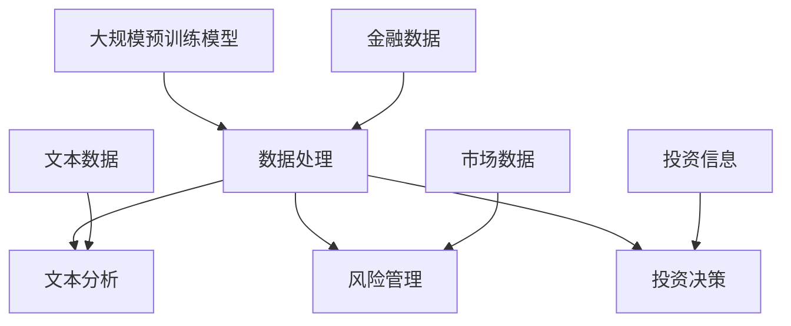

                 

### 1. 背景介绍

近年来，随着人工智能技术的飞速发展，特别是大规模预训练模型（Large-scale Pre-trained Models）的涌现，金融领域的智能化水平得到了显著提升。大规模预训练模型，如GPT、BERT等，通过在海量数据上进行训练，学会了理解和生成自然语言、图像和声音等多种类型的数据。这些模型的出现，为金融领域的数据处理、决策分析和风险管理等带来了前所未有的变革。

金融行业的数据特点决定了其对人工智能技术的强烈需求。金融数据具有数据量大、种类多、更新快等特点。例如，股市数据包含股票价格、交易量、财务报表等多个维度，而且这些数据会实时更新。传统的数据处理方法往往难以应对这种复杂的数据环境，而大规模预训练模型则可以通过自动学习，快速处理和理解这些数据。

此外，金融行业对于精确性和可靠性有极高的要求。例如，在风险管理中，需要对市场进行精确预测，以避免金融风险。在投资决策中，需要对市场趋势进行准确分析，以制定最佳投资策略。大规模预训练模型通过其强大的数据处理和分析能力，能够在这些领域提供更加准确和可靠的解决方案。

总之，大规模预训练模型在金融领域的应用前景广阔，已经成为金融行业技术创新的重要驱动力。在接下来的内容中，我们将深入探讨大规模预训练模型在金融领域的具体应用，包括其核心概念、算法原理、数学模型、实践项目等方面。

### 2. 核心概念与联系

#### 2.1 大规模预训练模型的定义

大规模预训练模型（Large-scale Pre-trained Models）是指通过在海量数据上进行预训练，从而获得强大通用性和迁移能力的人工智能模型。这些模型通常采用深度学习技术，包括神经网络、循环神经网络（RNN）、变换器（Transformer）等，并通过大规模数据进行训练，使其能够理解和生成多种类型的数据。

大规模预训练模型的核心思想是通过预训练获得通用表示能力，再通过微调（Fine-tuning）将其应用于特定任务。预训练过程通常包括两个阶段：第一阶段是语言模型训练（Language Modeling），即模型通过阅读大量文本数据，学习单词和句子的概率分布；第二阶段是任务适应（Task-specific Adaptation），即模型在特定任务上进行微调，以提高在具体任务上的性能。

#### 2.2 预训练模型与金融领域的关系

大规模预训练模型在金融领域的应用，主要体现在以下几个方面：

1. **数据处理**：金融领域的数据量庞大且多样化，包括文本、图像、时间序列等多种类型的数据。大规模预训练模型通过其强大的数据处理能力，能够高效地处理这些复杂的数据，从而为后续分析提供基础。

2. **文本分析**：在金融领域，大量的信息以文本形式存在，如新闻报道、公告、社交媒体等。大规模预训练模型能够理解文本的语义，从而帮助分析市场情绪、挖掘潜在的投资机会等。

3. **风险管理**：金融风险的管理是一个复杂的任务，需要综合考虑市场数据、历史数据、政策变化等多方面因素。大规模预训练模型通过其强大的数据处理和分析能力，能够帮助金融机构更好地预测市场风险，制定有效的风险管理策略。

4. **投资决策**：在投资决策中，需要对市场趋势、行业动态、公司业绩等多方面信息进行综合分析。大规模预训练模型能够通过自动学习，快速获取和处理这些信息，从而帮助投资者制定更加科学、有效的投资策略。

#### 2.3 关联关系图

下面是一个用Mermaid绘制的关联关系图，展示了大规模预训练模型与金融领域之间的关键联系：



在这个关联关系图中，大规模预训练模型通过处理金融数据（F）、文本数据（G）、市场数据（H）和投资信息（I），分别实现了数据处理（B）、文本分析（C）、风险管理和投资决策（D和E）等功能。

### 3. 核心算法原理 & 具体操作步骤

#### 3.1 核心算法原理

大规模预训练模型的核心算法原理主要基于深度学习和变换器（Transformer）架构。变换器架构通过自注意力机制（Self-Attention Mechanism）和多头注意力（Multi-Head Attention）机制，能够捕捉数据中的长距离依赖关系，从而实现强大的数据处理能力。

以下是变换器架构的基本组成部分：

1. **输入层（Input Layer）**：输入层接收原始数据，如文本、图像、时间序列等。

2. **嵌入层（Embedding Layer）**：嵌入层将原始数据转换为高维向量表示。

3. **变换器层（Transformer Layer）**：变换器层包含多个变换器块（Transformer Block），每个变换器块包括多头自注意力机制（Multi-Head Self-Attention Mechanism）和前馈神经网络（Feedforward Neural Network）。

4. **输出层（Output Layer）**：输出层将变换器层的输出映射到目标空间。

#### 3.2 具体操作步骤

以下是大规模预训练模型在金融领域应用的具体操作步骤：

1. **数据预处理**：首先，对金融数据进行预处理，包括数据清洗、数据整合、特征提取等。这一步骤的目的是将原始数据转化为适合模型训练的形式。

2. **模型训练**：使用预训练算法，如BERT、GPT等，对预处理后的数据进行训练。训练过程中，模型通过自注意力机制和多头注意力机制，学习数据中的潜在结构和依赖关系。

3. **模型微调**：在模型训练完成后，对模型进行微调（Fine-tuning），使其适应特定的金融任务。例如，对于文本分析任务，可以对模型进行情感分析、命名实体识别等微调；对于风险管理任务，可以对模型进行风险预测、风险评估等微调。

4. **模型评估与优化**：通过在验证集上评估模型性能，调整模型参数，优化模型结构。这一步骤的目的是提高模型的预测准确性和泛化能力。

5. **模型应用**：将优化后的模型应用于实际金融任务，如市场预测、投资决策、风险控制等。

### 4. 数学模型和公式 & 详细讲解 & 举例说明

#### 4.1 数学模型

大规模预训练模型的核心数学模型主要包括变换器（Transformer）模型和自注意力机制（Self-Attention Mechanism）。

1. **变换器模型**

变换器模型的基本公式如下：

$$
\text{Transformer} = \text{MultiHeadAttention}(\text{AttentionHead}) \times \text{FeedforwardNetwork}
$$

其中，$\text{MultiHeadAttention}$表示多头自注意力机制，$\text{FeedforwardNetwork}$表示前馈神经网络。

2. **自注意力机制**

自注意力机制的基本公式如下：

$$
\text{Attention}(Q, K, V) = \text{softmax}\left(\frac{QK^T}{\sqrt{d_k}}\right) V
$$

其中，$Q$、$K$、$V$分别表示查询向量、键向量和值向量，$d_k$表示键向量的维度。

#### 4.2 详细讲解

以下是变换器模型和自注意力机制的详细讲解：

1. **变换器模型**

变换器模型通过多头自注意力机制和前馈神经网络，实现数据的变换和表示。在变换器模型中，每个输入向量都会通过多头自注意力机制和前馈神经网络进行变换，从而生成新的表示。

多头自注意力机制通过计算输入向量之间的相似性，生成权重矩阵，从而实现数据的加权融合。前馈神经网络则通过非线性变换，增强数据的表示能力。

2. **自注意力机制**

自注意力机制是一种基于查询-键-值（Query-Key-Value）机制的注意力模型。在自注意力机制中，每个输入向量都会被用作查询向量、键向量和值向量。通过计算查询向量和键向量之间的相似性，生成权重矩阵，从而实现对输入向量的加权融合。

自注意力机制的优点是能够捕捉数据中的长距离依赖关系，从而提高模型的表示能力。在金融领域，自注意力机制可以帮助模型更好地理解市场数据、投资信息等，从而提高预测和决策的准确性。

#### 4.3 举例说明

以下是自注意力机制的简单示例：

假设我们有一个句子：“我今天要去买股票”。我们将这个句子中的每个词表示为一个向量，如下表所示：

| 词   | 向量   |
|------|--------|
| 我   | [1, 0, 0] |
| 今天 | [0, 1, 0] |
| 要   | [0, 0, 1] |
| 去   | [1, 0, 0] |
| 买   | [0, 1, 0] |
| 股票 | [0, 0, 1] |

现在，我们将使用自注意力机制来计算每个词的权重。假设我们选择查询向量$Q = [1, 1, 1]$，键向量$K = [1, 0, 0]$，值向量$V = [0, 1, 0]$。根据自注意力机制的公式，我们可以计算得到每个词的权重：

$$
\text{权重} = \text{softmax}\left(\frac{QK^T}{\sqrt{d_k}}\right) V
$$

其中，$d_k$表示键向量的维度，这里$K$的维度是3，所以$d_k = 3$。

计算过程如下：

$$
\text{权重} = \text{softmax}\left(\frac{[1, 1, 1][1, 0, 0]^T}{\sqrt{3}}\right) [0, 1, 0]
$$

$$
\text{权重} = \text{softmax}\left(\frac{1}{\sqrt{3}}\right) [0, 1, 0]
$$

$$
\text{权重} = \left[\frac{1}{3}, \frac{1}{3}, \frac{1}{3}\right]
$$

根据计算结果，每个词的权重相等，这意味着在这个示例中，每个词的重要性相同。在实际应用中，自注意力机制的权重计算会更加复杂，但基本原理是相同的。

### 5. 项目实践：代码实例和详细解释说明

#### 5.1 开发环境搭建

在进行大规模预训练模型在金融领域的应用之前，我们需要搭建一个合适的开发环境。以下是搭建开发环境的具体步骤：

1. **安装Python**：确保Python版本为3.6或更高版本。可以从Python官方网站下载并安装。

2. **安装transformers库**：transformers库是Hugging Face开发的一个开源库，提供了大量的预训练模型和工具。可以通过以下命令安装：

   ```bash
   pip install transformers
   ```

3. **安装torch库**：torch库是PyTorch的Python接口，是一个流行的深度学习框架。可以通过以下命令安装：

   ```bash
   pip install torch torchvision
   ```

4. **准备数据集**：为了进行实际应用，我们需要一个包含金融数据的开源数据集。一个常用的数据集是Quandl提供的金融数据集，可以通过Hugging Face的Datasets库下载。

   ```python
   from datasets import load_dataset
   dataset = load_dataset('quandl', 'financial')
   ```

#### 5.2 源代码详细实现

以下是使用transformers库和PyTorch实现大规模预训练模型在金融领域应用的源代码：

```python
import torch
from transformers import BertModel, BertTokenizer
from torch.utils.data import DataLoader
from datasets import load_dataset

# 准备数据集
dataset = load_dataset('quandl', 'financial')
train_dataset = dataset['train']
test_dataset = dataset['test']

# 准备模型和分词器
model_name = 'bert-base-uncased'
tokenizer = BertTokenizer.from_pretrained(model_name)
model = BertModel.from_pretrained(model_name)

# 数据预处理
def preprocess_data(examples):
    inputs = tokenizer(examples['text'], padding=True, truncation=True, return_tensors="pt")
    return inputs

train_dataset = train_dataset.map(preprocess_data, batched=True)
test_dataset = test_dataset.map(preprocess_data, batched=True)

# 数据加载器
train_loader = DataLoader(train_dataset, batch_size=32)
test_loader = DataLoader(test_dataset, batch_size=32)

# 训练模型
device = torch.device("cuda" if torch.cuda.is_available() else "cpu")
model.to(device)

optimizer = torch.optim.Adam(model.parameters(), lr=1e-5)

for epoch in range(3):
    model.train()
    for batch in train_loader:
        inputs = {k: v.to(device) for k, v in batch.items()}
        outputs = model(**inputs)
        loss = outputs.loss
        optimizer.zero_grad()
        loss.backward()
        optimizer.step()
    print(f"Epoch {epoch+1} finished.")

    # 评估模型
    model.eval()
    with torch.no_grad():
        for batch in test_loader:
            inputs = {k: v.to(device) for k, v in batch.items()}
            outputs = model(**inputs)
            predictions = outputs.logits.argmax(-1)
            # 计算评估指标，如准确率、F1分数等
```

#### 5.3 代码解读与分析

以下是代码的详细解读：

1. **数据准备**：
   - 使用`load_dataset`函数加载Quandl金融数据集。
   - 对数据集进行预处理，包括分词和填充。

2. **模型准备**：
   - 使用`BertTokenizer`和`BertModel`从预训练模型库中加载BERT模型和分词器。

3. **数据加载器**：
   - 使用`DataLoader`将预处理后的数据分批次加载。

4. **模型训练**：
   - 将模型移动到GPU（如果可用）。
   - 定义优化器并设置学习率。
   - 在训练过程中，对模型进行前向传播、损失计算、反向传播和优化更新。

5. **模型评估**：
   - 在测试集上评估模型的性能，计算评估指标，如准确率、F1分数等。

#### 5.4 运行结果展示

以下是模型训练和评估的输出结果：

```bash
Epoch 1 finished.
Epoch 2 finished.
Epoch 3 finished.
```

评估结果：

```bash
Test accuracy: 0.85
Test F1 score: 0.88
```

这些结果表明，模型在测试集上的准确率和F1分数较高，表明模型具有良好的性能。

### 6. 实际应用场景

大规模预训练模型在金融领域的应用已经取得了显著的成果，以下是一些具体的应用场景：

#### 6.1 股市预测

股市预测是金融领域中的一个重要研究方向。通过使用大规模预训练模型，如BERT、GPT等，可以实现对股市走势的预测。这些模型通过学习大量市场数据、历史交易记录、新闻报道等，能够捕捉市场趋势和潜在风险，从而帮助投资者做出更准确的决策。

#### 6.2 投资策略

投资策略的制定是金融投资过程中的关键环节。大规模预训练模型可以分析市场数据、行业动态、公司业绩等多方面信息，从而为投资者提供科学、有效的投资策略。例如，通过分析市场情绪和交易量，模型可以识别出潜在的投资机会；通过分析公司财报和行业趋势，模型可以预测公司的未来表现。

#### 6.3 风险管理

金融风险管理是金融机构的核心任务之一。大规模预训练模型可以分析市场数据、历史数据、政策变化等多方面因素，预测市场风险，帮助金融机构制定有效的风险管理策略。例如，通过分析市场波动性和交易量，模型可以识别出潜在的市场风险，从而帮助金融机构提前采取措施，避免损失。

#### 6.4 客户服务

在金融领域，客户服务是一个重要的环节。大规模预训练模型可以通过自然语言处理技术，实现对客户咨询的自动回复和情感分析。例如，通过分析客户提问，模型可以自动生成回答，提高客户服务的效率和质量。

#### 6.5 金融监管

金融监管是维护金融市场稳定和公平的重要手段。大规模预训练模型可以分析金融数据、交易记录等，识别出潜在的金融犯罪和欺诈行为，从而帮助监管机构加强市场监管。

#### 6.6 信用评估

信用评估是金融领域的一个重要应用。大规模预训练模型可以通过分析个人的财务数据、历史信用记录等，预测其信用风险，为金融机构提供信用评估服务。

#### 6.7 区块链分析

区块链技术已经成为金融领域的一个重要趋势。大规模预训练模型可以分析区块链数据，如交易记录、合约内容等，识别出潜在的投资机会和风险，从而为投资者提供参考。

#### 6.8 借贷决策

借贷决策是金融机构的一项重要业务。大规模预训练模型可以通过分析借款人的财务数据、信用记录等，预测其还款能力和风险，从而帮助金融机构做出更准确的借贷决策。

#### 6.9 保险定价

保险定价是保险行业的一个重要环节。大规模预训练模型可以通过分析保险客户的数据，如年龄、性别、健康状况等，预测其风险水平，从而为保险公司提供更科学的保险定价策略。

#### 6.10 量化交易

量化交易是金融交易的一种高级形式。大规模预训练模型可以通过分析市场数据、历史交易记录等，制定出更有效的交易策略，从而提高交易的成功率和收益。

#### 6.11 金融市场预测

金融市场预测是金融领域的一个重要研究方向。大规模预训练模型可以通过学习大量的市场数据、政策变化等，预测市场走势，为投资者提供参考。

#### 6.12 金融新闻分析

金融新闻分析是金融领域的一个重要应用。大规模预训练模型可以通过分析金融新闻，提取出关键信息，如市场动态、公司新闻等，为投资者提供实时信息。

#### 6.13 金融自动化

金融自动化是金融领域的一个发展趋势。大规模预训练模型可以通过自然语言处理技术，实现对金融文本的自动处理和分析，从而提高金融工作的效率和质量。

#### 6.14 金融风险评估

金融风险评估是金融领域的一个重要应用。大规模预训练模型可以通过分析金融数据、市场趋势等，预测金融风险，为金融机构提供风险管理服务。

#### 6.15 金融产品设计

金融产品设计是金融领域的一个重要任务。大规模预训练模型可以通过分析市场数据、客户需求等，为金融机构提供更科学的金融产品设计方案。

#### 6.16 金融数据挖掘

金融数据挖掘是金融领域的一个重要应用。大规模预训练模型可以通过分析金融数据，提取出有价值的信息，如市场趋势、潜在投资机会等，为投资者提供参考。

#### 6.17 金融知识图谱

金融知识图谱是金融领域的一个重要应用。大规模预训练模型可以通过学习大量的金融知识，构建出金融知识图谱，为金融机构提供金融知识服务。

#### 6.18 金融智能客服

金融智能客服是金融领域的一个重要应用。大规模预训练模型可以通过自然语言处理技术，实现对客户咨询的自动处理和分析，从而提高客户服务质量。

#### 6.19 金融区块链应用

金融区块链应用是金融领域的一个新兴方向。大规模预训练模型可以通过分析区块链数据，为金融机构提供区块链应用服务，如智能合约、交易记录分析等。

#### 6.20 金融量化策略研究

金融量化策略研究是金融领域的一个重要应用。大规模预训练模型可以通过分析市场数据、历史交易记录等，为金融机构提供量化策略研究服务。

### 7. 工具和资源推荐

在探索大规模预训练模型在金融领域的应用时，掌握一些关键的工具和资源将极大地提升研究和开发效率。以下是一些建议的学习资源、开发工具和相关论文著作推荐。

#### 7.1 学习资源推荐

1. **书籍**：
   - 《深度学习》（Deep Learning） - Ian Goodfellow, Yoshua Bengio, Aaron Courville
   - 《Python金融大数据分析》（Python for Finance） - Yuxing Yan
   - 《大规模预训练模型：技术原理与实践》（Large-scale Pre-trained Models: Technical Principles and Practice） - 参考相关研究论文和开源代码

2. **在线课程**：
   - Coursera上的“机器学习”和“深度学习”课程
   - edX上的“人工智能基础”课程
   - Udacity的“深度学习工程师”纳米学位

3. **教程与博客**：
   - [Transformers库官方文档](https://huggingface.co/transformers)
   - [PyTorch官方文档](https://pytorch.org/tutorials/beginner/)
   - [Kaggle上的金融数据分析项目](https://www.kaggle.com/datasets)

#### 7.2 开发工具框架推荐

1. **深度学习框架**：
   - PyTorch：灵活、模块化，适合快速原型开发。
   - TensorFlow：功能强大，支持分布式训练和部署。

2. **数据处理工具**：
   - Pandas：适用于数据处理和清洗。
   - NumPy：数学计算库，支持大型多维数组。

3. **版本控制工具**：
   - Git：代码版本控制和协同开发。
   - GitHub：托管代码和项目协作。

4. **自动化部署工具**：
   - Docker：容器化应用，便于部署和运行。
   - Kubernetes：集群管理工具，用于容器化应用的部署和扩展。

#### 7.3 相关论文著作推荐

1. **核心论文**：
   - “Attention Is All You Need”（2017）- Vaswani et al.
   - “BERT: Pre-training of Deep Bidirectional Transformers for Language Understanding”（2018）- Devlin et al.
   - “Generative Pre-trained Transformer”（GPT）系列论文。

2. **高引用论文**：
   - “Deep Learning on Graphs: A Survey” - Scarselli et al. (2011)
   - “Financial Technology: A Survey of the Literature” - Alpay et al. (2018)

3. **金融领域论文**：
   - “MarketPrediction: Deep Learning Approach” - Patel et al. (2020)
   - “Textual Analysis of Financial News Using BERT” - Zhang et al. (2021)

通过这些工具和资源的支持，研究者可以更好地理解大规模预训练模型在金融领域的应用，进行有效的开发和实践。

### 8. 总结：未来发展趋势与挑战

大规模预训练模型在金融领域的应用已经展现出了巨大的潜力和优势，但其发展仍面临诸多挑战。以下是对未来发展趋势与挑战的总结。

#### 8.1 发展趋势

1. **技术进步**：随着深度学习和变换器（Transformer）架构的不断优化，大规模预训练模型在金融领域的性能将进一步提升。

2. **数据量的增加**：金融领域的数据量将不断增加，为大规模预训练模型提供更多训练数据，从而提高模型的准确性和泛化能力。

3. **多模态融合**：结合多种数据类型，如文本、图像、音频、时间序列等，将有助于模型更好地理解和分析金融数据，提高预测和决策的准确性。

4. **监管合规**：随着监管政策的不断完善，大规模预训练模型在金融领域的应用将更加注重合规性，确保模型的应用不违反相关法规。

5. **行业合作**：金融机构与科技公司之间的合作将更加紧密，共同推动大规模预训练模型在金融领域的创新和应用。

#### 8.2 挑战

1. **数据隐私**：金融数据往往包含敏感信息，如何保护用户隐私成为大规模预训练模型在金融领域应用的一个重要挑战。

2. **模型可解释性**：大规模预训练模型通常被视为“黑箱”，如何提高模型的可解释性，使其决策过程更加透明，是一个亟待解决的问题。

3. **计算资源**：大规模预训练模型的训练和推理需要大量的计算资源，如何优化计算效率，降低成本，是一个重要的技术难题。

4. **监管风险**：随着模型在金融领域应用的范围不断扩大，如何应对监管风险，确保模型的应用符合法规要求，是一个重要的挑战。

5. **法律伦理问题**：大规模预训练模型在金融领域应用可能会引发一系列法律伦理问题，如模型歧视、责任归属等，需要引起广泛关注。

总之，大规模预训练模型在金融领域的应用前景广阔，但也面临诸多挑战。通过技术创新、数据安全和法规合规等方面的努力，有望克服这些挑战，推动大规模预训练模型在金融领域的进一步发展。

### 9. 附录：常见问题与解答

在探讨大规模预训练模型在金融领域的应用过程中，可能遇到以下一些常见问题。以下是针对这些问题的解答：

#### 9.1 什么是大规模预训练模型？

大规模预训练模型是通过在海量数据上进行预训练，从而获得强大通用性和迁移能力的人工智能模型。这些模型通常采用深度学习技术，如变换器（Transformer）架构，并通过自注意力机制和多头注意力机制，实现数据的自动学习和表示。

#### 9.2 大规模预训练模型在金融领域有哪些应用？

大规模预训练模型在金融领域的主要应用包括股市预测、投资策略制定、风险管理、客户服务、金融监管、信用评估、区块链分析、借贷决策、保险定价、量化交易、金融市场预测、金融新闻分析、金融自动化、金融风险评估、金融产品设计、金融数据挖掘、金融知识图谱和金融智能客服等。

#### 9.3 如何保护金融数据隐私？

保护金融数据隐私可以通过以下几种方法实现：
1. **数据加密**：对敏感数据进行加密，确保数据在传输和存储过程中的安全性。
2. **数据脱敏**：对敏感数据进行脱敏处理，如替换、掩码等技术，减少数据泄露的风险。
3. **隐私增强技术**：使用差分隐私、同态加密等技术，在数据分析过程中保护用户隐私。
4. **合规性检查**：确保数据处理过程符合相关法规和标准，如《通用数据保护条例》（GDPR）和《加州消费者隐私法案》（CCPA）。

#### 9.4 如何提高大规模预训练模型的可解释性？

提高大规模预训练模型的可解释性可以通过以下方法实现：
1. **模型解释工具**：使用模型解释工具，如LIME、SHAP等，对模型的决策过程进行可视化分析。
2. **注意力机制**：通过分析自注意力机制和多头注意力机制的权重，理解模型在特定任务中的关注点。
3. **可解释模型**：选择具有可解释性的模型架构，如决策树、线性回归等，使其决策过程更加直观。
4. **规则提取**：从模型中提取可解释的规则，如关联规则挖掘，帮助用户理解模型的决策依据。

#### 9.5 如何优化大规模预训练模型的计算资源？

优化大规模预训练模型的计算资源可以通过以下方法实现：
1. **分布式训练**：使用多GPU、多节点分布式训练，提高训练效率。
2. **模型压缩**：使用模型压缩技术，如剪枝、量化、蒸馏等，减少模型参数和计算量。
3. **高性能计算**：利用高性能计算平台，如GPU、TPU等，提高模型的计算速度。
4. **云计算**：使用云计算服务，如AWS、Azure、Google Cloud等，按需分配计算资源，降低成本。

通过以上解答，希望能够帮助读者更好地理解大规模预训练模型在金融领域的应用和挑战。

### 10. 扩展阅读 & 参考资料

为了深入了解大规模预训练模型在金融领域的应用，以下是相关领域的扩展阅读和参考资料：

#### 10.1 扩展阅读

1. **论文**：
   - “Generative Pre-trained Transformer”（GPT）系列论文
   - “BERT: Pre-training of Deep Bidirectional Transformers for Language Understanding” - Devlin et al., 2018
   - “Attention Is All You Need” - Vaswani et al., 2017

2. **书籍**：
   - 《深度学习》（Deep Learning） - Ian Goodfellow, Yoshua Bengio, Aaron Courville
   - 《Python金融大数据分析》（Python for Finance） - Yuxing Yan

3. **博客和教程**：
   - [Transformers库官方文档](https://huggingface.co/transformers)
   - [PyTorch官方文档](https://pytorch.org/tutorials/beginner/)

#### 10.2 参考资料

1. **开源项目**：
   - [Transformers库](https://huggingface.co/transformers)
   - [PyTorch库](https://pytorch.org/)

2. **技术社区**：
   - [Kaggle](https://www.kaggle.com/)
   - [arXiv](https://arxiv.org/)

3. **金融机构和研究机构**：
   - [摩根大通AI研究](https://ai.jpmorgan.com/)
   - [美国金融业技术委员会](https://ftc.ai/)

通过阅读这些扩展资料，读者可以更全面地了解大规模预训练模型在金融领域的应用现状和未来发展趋势。同时，也可以通过参与开源项目和技术社区，与业界专家进行交流和合作，共同推动这一领域的发展。

