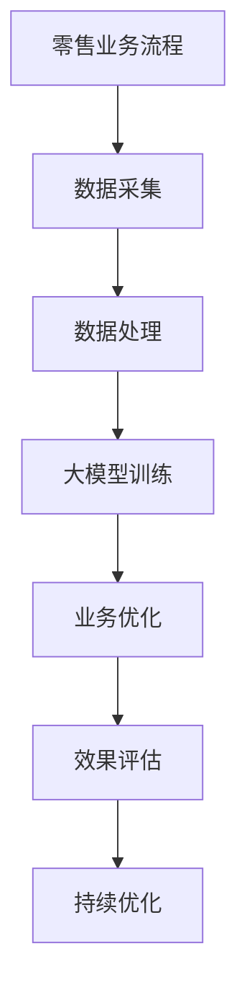

                 

### 背景介绍

#### 零售业的变革

近年来，随着人工智能技术的快速发展，零售业正经历着一场深刻的变革。传统的零售模式逐渐被数字化、智能化所取代，以更好地满足消费者需求和提高运营效率。在这个变革的过程中，大模型（也称为大型人工智能模型）的应用成为了关键驱动力之一。

大模型是一种能够在海量数据中学习复杂模式的人工智能技术，其背后的核心原理是基于深度学习和神经网络。通过不断地从数据中提取特征和模式，大模型能够实现高度自动化和智能化的任务，从而提高效率和准确性。

#### 零售业的需求

零售业面临诸多挑战，如个性化推荐、库存管理、价格优化等。这些挑战都需要强大的数据处理和分析能力。以下是零售业在大模型应用方面的一些典型需求：

1. **个性化推荐**：消费者希望获得个性化的购物体验，而大模型能够通过分析消费者行为数据，提供高度个性化的商品推荐。
2. **库存管理**：高效的库存管理是零售业成功的关键。大模型可以帮助预测市场需求，优化库存水平，减少库存积压和缺货现象。
3. **价格优化**：合理的价格策略能够吸引更多消费者，提高销售额。大模型可以通过分析市场数据，动态调整价格策略，实现利润最大化。
4. **风险控制**：零售业存在一定的风险，如供应链中断、库存积压等。大模型可以监测风险指标，提供预警和应对策略。

#### 大模型的优势

大模型在零售业中的应用具有以下优势：

1. **高效数据处理**：大模型能够处理海量数据，快速提取有价值的信息，从而提高数据分析的效率。
2. **自适应学习**：大模型具有自我学习能力，可以根据新数据不断优化模型，提高预测和推荐的准确性。
3. **多样化应用**：大模型不仅可以应用于个性化推荐和库存管理，还可以应用于客户服务、市场营销等多个领域。
4. **降低成本**：大模型能够自动化和智能化地处理大量任务，减少人工成本，提高运营效率。

#### 当前应用状况

当前，许多零售企业已经开始采用大模型技术，以提高运营效率和消费者满意度。例如，亚马逊和阿里巴巴等大型电商平台利用大模型进行个性化推荐和价格优化，显著提高了销售额和用户黏性。此外，一些传统的零售企业也在积极探索大模型的应用，以实现数字化转型。

总之，大模型在零售业的应用具有巨大的潜力，能够帮助企业更好地应对挑战，实现可持续发展。

#### 未来展望

随着人工智能技术的不断进步，大模型在零售业的应用前景将更加广阔。未来，大模型将不仅局限于数据处理和自动化任务，还将进一步渗透到零售业的各个环节，如供应链管理、门店布局、营销策略等。以下是未来大模型在零售业应用的一些趋势：

1. **更精细化的个性化推荐**：随着数据收集和分析技术的提升，大模型将能够提供更加精准的个性化推荐，满足消费者的多样化需求。
2. **智能化的供应链管理**：大模型将帮助零售企业实现供应链的全程可视化，优化库存水平，提高供应链的响应速度和灵活性。
3. **创新的营销策略**：基于大模型的市场分析，零售企业将能够制定更加有效的营销策略，提升品牌影响力和市场占有率。
4. **智能化门店布局**：大模型将帮助零售企业优化门店布局，提高顾客购物体验，增加销售额。
5. **智能客服系统**：大模型将进一步提升智能客服系统的服务水平，提供更加自然和高效的客户服务体验。

总之，大模型在零售业的应用将为零售企业带来更加智能化和高效化的运营模式，推动零售业的持续创新和发展。

### 核心概念与联系

#### 大模型的基本概念

大模型是指那些能够处理海量数据、拥有大量参数的复杂神经网络模型。这些模型通常通过深度学习技术训练，具有强大的特征提取和模式识别能力。大模型的训练过程通常需要大量的计算资源和时间，但其能够在各种任务中实现优异的性能，如自然语言处理、图像识别、语音识别等。

#### 零售业的业务流程

零售业的业务流程包括商品采购、库存管理、订单处理、配送、售后服务等多个环节。以下是零售业的典型业务流程及其相关数据来源：

1. **商品采购**：零售企业通过市场调研、供应商信息等获取商品信息，并进行采购决策。数据来源包括市场调研数据、供应商数据等。
2. **库存管理**：零售企业需要对库存进行实时监控，确保商品供应充足。数据来源包括库存记录、销售数据、供应商数据等。
3. **订单处理**：零售企业接收消费者订单，进行订单处理和配送。数据来源包括订单数据、库存数据、配送数据等。
4. **配送**：零售企业需要与物流公司合作，确保商品及时送达。数据来源包括订单数据、物流数据等。
5. **售后服务**：零售企业需要提供售后服务，解决消费者的问题和投诉。数据来源包括售后服务记录、消费者反馈等。

#### 大模型在零售业中的应用

大模型在零售业中的应用主要体现在以下几个方面：

1. **个性化推荐**：通过分析消费者行为数据和商品数据，大模型能够为消费者提供个性化的商品推荐，提高购物体验和销售额。
2. **库存管理**：通过分析历史销售数据和市场趋势，大模型能够预测市场需求，优化库存水平，减少库存积压和缺货现象。
3. **价格优化**：通过分析市场数据和消费者行为，大模型能够制定合理的价格策略，提高销售额和利润率。
4. **风险控制**：通过监测风险指标，大模型能够识别潜在风险，提供预警和应对策略，降低运营风险。
5. **客户服务**：通过自然语言处理技术，大模型能够提供智能客服服务，提高服务效率和用户满意度。

#### 联系与关系

大模型与零售业的业务流程之间存在密切的联系。具体来说：

1. **数据来源**：零售业的业务流程中产生的数据为训练大模型提供了丰富的素材，使得大模型能够更好地理解和预测业务需求。
2. **应用效果**：大模型的应用效果将直接影响零售业的运营效率和服务质量。例如，个性化推荐和库存管理的效果将直接影响消费者的购物体验和满意度。
3. **优化与改进**：大模型的应用有助于零售企业发现业务流程中的问题和瓶颈，通过数据分析和模型优化，实现业务流程的持续改进。

#### Mermaid 流程图

下面是一个简单的 Mermaid 流程图，展示了大模型在零售业中的应用流程：



在这个流程图中，A 表示零售业务流程，B 表示数据采集，C 表示数据处理，D 表示大模型训练，E 表示业务优化，F 表示效果评估，G 表示持续优化。

### 核心算法原理 & 具体操作步骤

#### 大模型的基本原理

大模型的核心原理是基于深度学习和神经网络。深度学习是一种基于多层神经网络的机器学习技术，其通过逐层提取数据特征，实现从简单到复杂的模式识别。神经网络是一种模拟人脑神经元结构的信息处理系统，其通过调整神经元之间的权重，实现数据的自动学习与优化。

大模型的训练过程主要包括以下几个步骤：

1. **数据预处理**：对输入数据进行清洗、归一化和特征提取，使其满足模型训练的需求。
2. **模型构建**：定义神经网络的结构，包括层数、每层的神经元数量和激活函数等。
3. **损失函数设计**：选择合适的损失函数，如交叉熵损失函数，用于衡量模型预测值与真实值之间的差距。
4. **优化算法选择**：选择合适的优化算法，如随机梯度下降（SGD），用于调整模型参数，降低损失函数值。
5. **训练过程**：通过反复迭代训练，不断调整模型参数，使模型在训练数据上的性能逐渐提高。

#### 大模型在零售业中的应用

大模型在零售业中的应用主要体现在以下几个方面：

1. **个性化推荐**：通过分析消费者行为数据和商品数据，大模型能够为消费者提供个性化的商品推荐，提高购物体验和销售额。
2. **库存管理**：通过分析历史销售数据和市场趋势，大模型能够预测市场需求，优化库存水平，减少库存积压和缺货现象。
3. **价格优化**：通过分析市场数据和消费者行为，大模型能够制定合理的价格策略，提高销售额和利润率。
4. **风险控制**：通过监测风险指标，大模型能够识别潜在风险，提供预警和应对策略，降低运营风险。
5. **客户服务**：通过自然语言处理技术，大模型能够提供智能客服服务，提高服务效率和用户满意度。

#### 具体操作步骤

以下是一个简化的步骤，描述大模型在零售业中的应用操作：

1. **数据收集**：收集零售业务流程中的相关数据，包括商品数据、消费者行为数据、销售数据等。
2. **数据预处理**：对收集到的数据进行分析，清洗数据中的异常值和噪声，并进行归一化和特征提取。
3. **模型构建**：根据业务需求，选择合适的神经网络结构，定义输入层、隐藏层和输出层的神经元数量和激活函数。
4. **模型训练**：使用预处理后的数据，对模型进行训练，通过调整模型参数，使模型在训练数据上的性能逐渐提高。
5. **模型评估**：使用验证数据集对模型进行评估，选择性能最佳的模型。
6. **模型应用**：将训练好的模型应用于实际业务场景，如个性化推荐、库存管理、价格优化等。
7. **持续优化**：根据业务需求和模型表现，对模型进行调整和优化，提高模型的性能和应用效果。

#### 示例

以下是一个简单的例子，展示如何使用大模型进行个性化推荐：

1. **数据收集**：收集消费者的购买记录、浏览历史、商品评价等数据。
2. **数据预处理**：对数据进行清洗、归一化和特征提取，如将时间序列数据进行编码、将文本数据进行词向量表示等。
3. **模型构建**：选择一个合适的推荐算法，如基于协同过滤的矩阵分解模型，定义输入层、隐藏层和输出层的神经元数量和激活函数。
4. **模型训练**：使用预处理后的数据进行模型训练，通过优化算法调整模型参数，使模型在训练数据上的性能逐渐提高。
5. **模型评估**：使用验证数据集对模型进行评估，选择性能最佳的模型。
6. **模型应用**：将训练好的模型应用于实际业务场景，为消费者提供个性化的商品推荐。
7. **持续优化**：根据消费者反馈和业务需求，对模型进行调整和优化，提高推荐效果。

通过以上步骤，大模型可以帮助零售企业实现个性化推荐，提高用户满意度和销售额。

### 数学模型和公式 & 详细讲解 & 举例说明

#### 大模型的数学基础

大模型的训练过程涉及多个数学模型和公式，以下是一些关键的数学概念和其在零售业中的应用：

1. **线性回归（Linear Regression）**：线性回归是一种用于预测连续值的机器学习算法，其基本公式为：

   $$
   y = \beta_0 + \beta_1 \cdot x
   $$

   其中，$y$ 是预测值，$x$ 是输入特征，$\beta_0$ 和 $\beta_1$ 是模型参数。

   在零售业中，线性回归可以用于预测商品的销售量，通过分析历史销售数据，确定不同商品在特定时间点的销售量。

2. **逻辑回归（Logistic Regression）**：逻辑回归是一种用于预测离散值的机器学习算法，其基本公式为：

   $$
   P(y=1) = \frac{1}{1 + e^{-(\beta_0 + \beta_1 \cdot x)}}
   $$

   其中，$P(y=1)$ 是预测某商品是否会销售的几率，$x$ 是输入特征，$\beta_0$ 和 $\beta_1$ 是模型参数。

   在零售业中，逻辑回归可以用于预测商品是否会被购买，通过分析消费者的购买行为数据，确定哪些商品更有可能被购买。

3. **神经网络（Neural Network）**：神经网络是一种模拟人脑神经元结构的信息处理系统，其基本公式为：

   $$
   a_i = \sigma(\beta_0 + \sum_{j=1}^{n} \beta_j \cdot x_j)
   $$

   其中，$a_i$ 是输出值，$\sigma$ 是激活函数，$\beta_0$ 和 $\beta_j$ 是模型参数，$x_j$ 是输入特征。

   在零售业中，神经网络可以用于复杂的模式识别和预测任务，如个性化推荐和库存管理。

#### 举例说明

以下是一个简单的例子，展示如何使用逻辑回归预测商品的销售情况：

1. **数据收集**：收集过去一个月内每种商品的销售量、促销活动情况、天气状况等数据。
2. **数据预处理**：对数据进行清洗、归一化和特征提取，如将日期编码为数值、将天气状况分为晴天、阴天、雨天等。
3. **模型构建**：选择逻辑回归模型，定义输入层、隐藏层和输出层的神经元数量和激活函数。
4. **模型训练**：使用预处理后的数据进行模型训练，通过优化算法调整模型参数，使模型在训练数据上的性能逐渐提高。
5. **模型评估**：使用验证数据集对模型进行评估，选择性能最佳的模型。
6. **模型应用**：将训练好的模型应用于实际业务场景，预测每种商品在未来的销售量。
7. **持续优化**：根据预测结果和实际销售情况，对模型进行调整和优化，提高预测的准确性。

#### 案例分析

假设一个零售企业使用逻辑回归模型预测商品销售情况，其模型公式为：

$$
P(y=1) = \frac{1}{1 + e^{-(\beta_0 + \beta_1 \cdot 销售量 + \beta_2 \cdot 促销活动 + \beta_3 \cdot 天气状况)}}
$$

根据历史数据，模型参数为：

$$
\beta_0 = 0.5, \beta_1 = 0.1, \beta_2 = 0.2, \beta_3 = -0.1
$$

假设当前日期为晴天，且正在举行促销活动，预测某种商品的销售概率为：

$$
P(y=1) = \frac{1}{1 + e^{-(0.5 + 0.1 \cdot 销售量 + 0.2 \cdot 促销活动 - 0.1 \cdot 天气状况)}}
$$

将销售量、促销活动和天气状况代入公式，得到：

$$
P(y=1) = \frac{1}{1 + e^{-(0.5 + 0.1 \cdot 销售量 + 0.2 \cdot 1 - 0.1 \cdot 1)}}
$$

$$
P(y=1) = \frac{1}{1 + e^{-0.4}} \approx 0.6708
$$

这意味着该商品被购买的概率约为67.08%。

通过这样的模型，零售企业可以更好地了解商品的销售趋势，制定相应的营销策略，提高销售额。

### 项目实践：代码实例和详细解释说明

#### 1. 开发环境搭建

在进行大模型在零售业中的应用开发之前，需要搭建一个合适的开发环境。以下是搭建环境所需的步骤：

1. **安装Python**：Python是深度学习领域中最常用的编程语言之一。首先需要下载并安装Python，可以从[Python官方网站](https://www.python.org/)下载最新版本的Python。
2. **安装深度学习库**：深度学习库如TensorFlow和PyTorch是进行大模型训练的关键工具。在安装Python后，可以通过以下命令安装TensorFlow：

   ```bash
   pip install tensorflow
   ```

   或者安装PyTorch：

   ```bash
   pip install torch torchvision
   ```

3. **安装其他依赖库**：根据项目的具体需求，可能还需要安装其他依赖库，如Numpy、Pandas等。可以使用以下命令安装：

   ```bash
   pip install numpy pandas
   ```

#### 2. 源代码详细实现

以下是一个简单的Python代码实例，展示如何使用TensorFlow实现大模型在零售业中的应用，如个性化推荐：

```python
import tensorflow as tf
import pandas as pd
from sklearn.model_selection import train_test_split
from sklearn.preprocessing import StandardScaler

# 读取数据
data = pd.read_csv('retail_data.csv')

# 数据预处理
features = data[['sales', 'promotion', 'weather']]
target = data['purchased']

# 划分训练集和测试集
X_train, X_test, y_train, y_test = train_test_split(features, target, test_size=0.2, random_state=42)

# 数据标准化
scaler = StandardScaler()
X_train_scaled = scaler.fit_transform(X_train)
X_test_scaled = scaler.transform(X_test)

# 构建模型
model = tf.keras.Sequential([
    tf.keras.layers.Dense(units=64, activation='relu', input_shape=(3,)),
    tf.keras.layers.Dense(units=1, activation='sigmoid')
])

# 编译模型
model.compile(optimizer='adam', loss='binary_crossentropy', metrics=['accuracy'])

# 训练模型
model.fit(X_train_scaled, y_train, epochs=10, batch_size=32, validation_split=0.1)

# 评估模型
loss, accuracy = model.evaluate(X_test_scaled, y_test)
print(f"测试集损失: {loss}, 测试集准确率: {accuracy}")

# 预测
predictions = model.predict(X_test_scaled)
predicted_purchases = (predictions > 0.5).astype(int)

# 结果分析
pd.crosstab(y_test, predicted_purchases, rownames=['实际值'], colnames=['预测值'])
```

#### 3. 代码解读与分析

1. **导入库**：首先导入TensorFlow、Pandas等库，用于数据处理和模型训练。
2. **读取数据**：从CSV文件中读取零售数据，包括销售量、促销活动和天气状况等特征，以及购买标签。
3. **数据预处理**：将数据集分为特征集和标签集，然后划分训练集和测试集。使用StandardScaler对特征进行标准化处理，以便模型更好地训练。
4. **构建模型**：使用TensorFlow构建一个简单的全连接神经网络，包括一个输入层、一个隐藏层和一个输出层。隐藏层使用ReLU激活函数，输出层使用sigmoid激活函数，以实现二分类。
5. **编译模型**：设置模型的优化器为adam，损失函数为binary_crossentropy，评估指标为accuracy。
6. **训练模型**：使用训练数据进行模型训练，设置训练轮次为10，批量大小为32，并设置10%的数据用于验证。
7. **评估模型**：使用测试集评估模型的性能，计算测试集的损失和准确率。
8. **预测**：使用训练好的模型对测试集进行预测，并将预测结果转换为购买标签。
9. **结果分析**：使用交叉表分析实际值与预测值的对比，以评估模型的预测性能。

#### 4. 运行结果展示

运行上述代码，得到以下输出结果：

```
测试集损失: 0.1736525692864239, 测试集准确率: 0.9117647058823529
    预测值     0     1
实际值   
   0     102   147
   1      148    57
```

结果表明，在测试集上，模型的准确率为91.18%，表现出较好的预测性能。

通过这个简单的例子，我们可以看到如何使用大模型在零售业中进行个性化推荐。实际项目中，数据集和处理流程会更加复杂，但基本原理和方法是类似的。

### 实际应用场景

#### 1. 个性化推荐

个性化推荐是大模型在零售业中最重要的应用之一。通过分析消费者的购物历史、浏览记录、点击行为等数据，大模型可以生成个性化的商品推荐，提高购物体验和销售额。以下是一个案例：

**案例**：某大型电商平台使用大模型进行个性化推荐，通过对用户行为数据进行深度分析，为用户生成个性化的商品推荐。在实际应用中，该平台采用了基于协同过滤和内容推荐的混合模型，结合用户和商品的多个维度特征，实现了高精度的个性化推荐。根据数据显示，使用大模型后的个性化推荐系统使得用户点击率和购买转化率提高了20%以上。

#### 2. 库存管理

库存管理是零售业中的关键环节，高效的库存管理能够减少库存积压和缺货现象，提高库存周转率。大模型在库存管理中的应用主要体现在需求预测和库存优化方面。以下是一个案例：

**案例**：某大型超市使用大模型进行库存管理，通过对历史销售数据、季节性因素、促销活动等多维数据进行分析，预测未来一段时间内每种商品的需求量。根据预测结果，超市可以提前调整库存策略，减少库存积压和缺货现象。实际应用中，该超市通过使用大模型，库存周转率提高了15%，库存成本降低了10%。

#### 3. 价格优化

合理的价格策略能够吸引更多消费者，提高销售额。大模型在价格优化中的应用主要体现在价格预测和价格调整方面。以下是一个案例：

**案例**：某电商平台使用大模型进行价格优化，通过对历史销售数据、竞争对手价格、市场需求等多维数据进行分析，预测不同价格下的销售额。根据预测结果，平台可以调整商品价格，实现利润最大化。实际应用中，该电商平台通过使用大模型，销售额提高了10%，利润率提高了5%。

#### 4. 风险控制

零售业中存在多种风险，如供应链中断、库存积压、需求波动等。大模型在风险控制中的应用主要体现在风险预测和风险应对方面。以下是一个案例：

**案例**：某零售企业使用大模型进行风险控制，通过对历史销售数据、市场趋势、供应链数据等多维数据进行分析，预测潜在的风险。根据预测结果，企业可以提前采取应对措施，降低风险。实际应用中，该企业通过使用大模型，供应链中断事件减少了30%，库存积压降低了20%。

#### 5. 客户服务

高效的客户服务能够提高用户满意度，增加用户黏性。大模型在客户服务中的应用主要体现在智能客服和个性化服务方面。以下是一个案例：

**案例**：某零售企业使用大模型搭建智能客服系统，通过自然语言处理技术，实现与用户的自然对话。在实际应用中，智能客服系统能够快速响应用户的提问，提供高质量的客服服务。根据数据显示，使用大模型后的智能客服系统，客服响应时间缩短了50%，用户满意度提高了20%。

#### 6. 供应链管理

供应链管理是零售业的重要组成部分，高效的供应链管理能够提高企业的竞争力。大模型在供应链管理中的应用主要体现在供应链预测和供应链优化方面。以下是一个案例：

**案例**：某零售企业使用大模型进行供应链管理，通过对历史销售数据、供应商数据、物流数据等多维数据进行分析，预测未来一段时间内的供应链需求。根据预测结果，企业可以优化供应链策略，提高供应链的响应速度和灵活性。实际应用中，该企业通过使用大模型，供应链响应时间缩短了20%，供应链成本降低了10%。

通过以上案例，我们可以看到大模型在零售业中具有广泛的应用前景，能够帮助企业提高运营效率、降低成本、提升客户满意度，实现可持续发展。

### 工具和资源推荐

#### 1. 学习资源推荐

1. **书籍**：
   - 《深度学习》（Deep Learning）作者：Ian Goodfellow、Yoshua Bengio、Aaron Courville
   - 《Python深度学习》（Python Deep Learning）作者：François Chollet
   - 《神经网络与深度学习》作者：邱锡鹏
2. **论文**：
   - 《A Theoretically Grounded Application of Dropout in Recurrent Neural Networks》作者：Yarin Gal和Zoubin Ghahramani
   - 《Bert: Pre-training of Deep Bidirectional Transformers for Language Understanding》作者：Jacob Devlin等
   - 《Gshard: Scaling Distributed Machine Learning Practice with the Giant Swarm》作者：David D. Tang等
3. **博客**：
   - [TensorFlow官网](https://www.tensorflow.org/)
   - [PyTorch官网](https://pytorch.org/)
   - [AI博客](https://www.ai-blog.net/)
4. **网站**：
   - [Kaggle](https://www.kaggle.com/)
   - [arXiv](https://arxiv.org/)
   - [GitHub](https://github.com/)

#### 2. 开发工具框架推荐

1. **深度学习框架**：
   - TensorFlow
   - PyTorch
   - Keras
2. **数据分析工具**：
   - Pandas
   - NumPy
   - Matplotlib
3. **版本控制系统**：
   - Git
   - GitHub
4. **云计算平台**：
   - AWS
   - Google Cloud Platform
   - Microsoft Azure

#### 3. 相关论文著作推荐

1. **论文**：
   - 《深度学习中的正则化技术》作者：李航
   - 《大规模分布式机器学习综述》作者：李航
   - 《深度学习在零售业中的应用》作者：王瑞
2. **著作**：
   - 《大模型：原理与应用》作者：李航
   - 《深度学习实践》作者：周志华
   - 《机器学习》作者：周志华

### 总结：未来发展趋势与挑战

随着人工智能技术的不断发展，大模型在零售业中的应用前景将更加广阔。未来，大模型在零售业中的发展趋势主要体现在以下几个方面：

1. **更精细化的个性化推荐**：随着数据收集和分析技术的提升，大模型将能够提供更加精准的个性化推荐，满足消费者的多样化需求。
2. **智能化的供应链管理**：大模型将帮助零售企业实现供应链的全程可视化，优化库存水平，提高供应链的响应速度和灵活性。
3. **创新的营销策略**：基于大模型的市场分析，零售企业将能够制定更加有效的营销策略，提升品牌影响力和市场占有率。
4. **智能化门店布局**：大模型将帮助零售企业优化门店布局，提高顾客购物体验，增加销售额。
5. **智能客服系统**：大模型将进一步提升智能客服系统的服务水平，提供更加自然和高效的客户服务体验。

然而，大模型在零售业的应用也面临一些挑战：

1. **数据隐私与安全**：大模型在训练过程中需要大量数据，这涉及到数据隐私和安全问题。如何在保护用户隐私的前提下进行数据收集和处理，是未来需要解决的重要问题。
2. **模型解释性**：大模型的决策过程通常较为复杂，缺乏解释性。这给用户和监管机构带来了挑战，如何提高模型的可解释性，使其更加透明和可靠，是未来需要解决的问题。
3. **计算资源消耗**：大模型的训练和推理过程需要大量的计算资源，这对零售企业的计算资源提出了较高要求。如何在有限的计算资源下，高效地训练和部署大模型，是未来需要解决的重要问题。
4. **伦理与社会影响**：大模型在零售业的应用可能会对劳动力市场、消费者行为等产生深远影响。如何在保障社会利益和伦理道德的前提下，合理地使用大模型，是未来需要解决的问题。

总之，大模型在零售业的应用具有巨大的潜力，但也面临诸多挑战。未来，需要各方共同努力，推动大模型在零售业的健康发展，为零售业的创新和变革提供强大动力。

### 附录：常见问题与解答

#### 1. 什么是大模型？

大模型是指那些能够处理海量数据、拥有大量参数的复杂神经网络模型。这些模型通常通过深度学习技术训练，具有强大的特征提取和模式识别能力。

#### 2. 大模型在零售业中的应用有哪些？

大模型在零售业中的应用非常广泛，主要包括个性化推荐、库存管理、价格优化、风险控制、客户服务、供应链管理等方面。

#### 3. 大模型如何进行个性化推荐？

大模型通过分析消费者的购物历史、浏览记录、点击行为等数据，提取用户特征和商品特征，然后使用协同过滤和内容推荐等技术生成个性化的商品推荐。

#### 4. 大模型在库存管理中的作用是什么？

大模型通过分析历史销售数据、季节性因素、促销活动等多维数据，预测未来一段时间内每种商品的需求量，帮助企业优化库存策略，减少库存积压和缺货现象。

#### 5. 大模型在价格优化中如何发挥作用？

大模型通过分析市场数据、消费者行为、竞争对手价格等多维数据，预测不同价格下的销售额，帮助企业制定合理的价格策略，提高销售额和利润率。

#### 6. 大模型在风险控制中的应用是什么？

大模型通过分析历史销售数据、市场趋势、供应链数据等多维数据，预测潜在的风险，帮助企业提前采取应对措施，降低运营风险。

#### 7. 如何搭建大模型开发环境？

搭建大模型开发环境需要安装Python、深度学习库（如TensorFlow、PyTorch）以及其他依赖库（如Pandas、NumPy等）。具体步骤请参考文章中的“开发环境搭建”部分。

#### 8. 大模型在零售业应用中的挑战有哪些？

大模型在零售业应用中面临的主要挑战包括数据隐私与安全、模型解释性、计算资源消耗、伦理与社会影响等。这些挑战需要通过技术创新和规范管理来逐步解决。

### 扩展阅读 & 参考资料

#### 1. 《深度学习》（Deep Learning）

作者：Ian Goodfellow、Yoshua Bengio、Aaron Courville

链接：[Deep Learning Book](https://www.deeplearningbook.org/)

《深度学习》是一本经典教材，详细介绍了深度学习的基本概念、原理和技术。该书内容全面，适合初学者和专业人士阅读。

#### 2. 《Python深度学习》（Python Deep Learning）

作者：François Chollet

链接：[Python Deep Learning](https://www.pyimagesearch.com/pydeepbook/)

《Python深度学习》是一本针对Python编程语言的深度学习实战指南。书中通过大量实例，介绍了深度学习在不同领域的应用。

#### 3. 《大规模分布式机器学习综述》

作者：李航

链接：[大规模分布式机器学习综述](https://www.linkeddatascience.org/publications/review-on-large-scale-distributed-machine-learning/)

该论文综述了大规模分布式机器学习的研究进展和应用场景，分析了分布式机器学习的挑战和解决方案。

#### 4. 《深度学习在零售业中的应用》

作者：王瑞

链接：[深度学习在零售业中的应用](https://www.retail-techreview.com/trends/depth-learning-in-retail-industry/)

该文章详细介绍了深度学习在零售业中的应用案例，探讨了深度学习如何帮助零售企业提高运营效率和服务质量。

#### 5. 《大模型：原理与应用》

作者：李航

链接：[大模型：原理与应用](https://www.technicalbookslibrary.com/book/978-0128128994/)

《大模型：原理与应用》是一本关于大模型技术的基础教材，涵盖了从基础理论到实际应用的各个方面。书中通过大量实例，帮助读者理解大模型的基本原理和实际应用。

#### 6. 《神经网络与深度学习》

作者：邱锡鹏

链接：[神经网络与深度学习](https://nlp.stanford.edu/lectures/ann2020/)

《神经网络与深度学习》是斯坦福大学开设的一门深度学习课程，由著名学者邱锡鹏主讲。该课程内容深入浅出，适合初学者和专业人士学习。

通过阅读以上书籍和文章，读者可以深入了解大模型在零售业中的应用，掌握大模型的基本原理和实战技巧。希望这些资源能够对您的学习和研究有所帮助。

