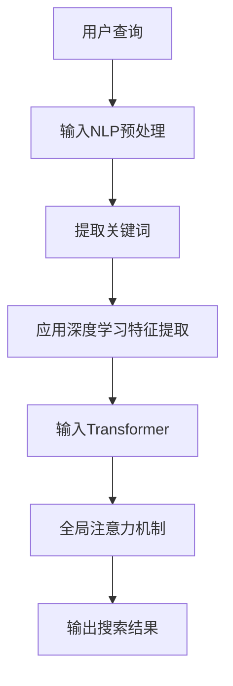

                 

### 背景介绍

在现代互联网时代，电商平台已经成为人们日常生活中不可或缺的一部分。随着电商平台规模的不断扩大，用户数量的激增以及商品种类的丰富，如何提升用户的搜索体验成为了电商平台的重大课题。用户在进行商品搜索时，往往会面临信息过载、难以找到心仪商品等问题，这不仅影响了用户满意度，还可能降低电商平台的竞争力。

传统的搜索系统大多依赖于关键词匹配和分类检索的方法，这些方法虽然在一定程度上能够满足用户的搜索需求，但往往存在响应速度慢、准确率不高等问题。随着深度学习技术的兴起，尤其是大模型（如Transformer、BERT等）的广泛应用，为电商平台的搜索优化带来了新的机遇。大模型在处理大规模数据、理解语义、生成高质量内容等方面具有显著优势，使其成为提升搜索体验的有效工具。

本文将探讨大模型在电商平台搜索体验优化中的应用，通过介绍核心概念与联系、核心算法原理、数学模型和公式、项目实践、实际应用场景等多个方面，全面解析大模型如何助力电商平台提升搜索体验。

### 核心概念与联系

要深入理解大模型在电商平台搜索体验优化中的应用，首先需要了解几个关键概念，包括自然语言处理（NLP）、深度学习、Transformer、BERT等。

**自然语言处理（NLP）**

自然语言处理是人工智能领域的一个分支，旨在使计算机能够理解、解释和生成人类语言。在电商平台的搜索场景中，NLP技术主要用于处理用户输入的查询语句，提取关键词和语义信息，从而实现更准确的匹配和搜索结果生成。

**深度学习**

深度学习是一种基于人工神经网络的学习方法，通过多层神经元的非线性组合来提取特征。深度学习模型在处理大量数据时表现出色，能够自动从数据中学习复杂的模式，从而实现高度自动化的任务，如图像识别、语音识别和文本生成等。

**Transformer**

Transformer是一种基于自注意力机制的深度学习模型，最初由Vaswani等人在2017年提出。它通过全局注意力机制来捕捉输入序列中的长距离依赖关系，从而在自然语言处理任务中取得了显著的效果，如机器翻译、文本分类和问答系统等。

**BERT**

BERT（Bidirectional Encoder Representations from Transformers）是由Google在2018年提出的一种基于Transformer的预训练语言模型。BERT通过双向编码的方式，同时考虑输入序列的前后关系，从而更好地捕捉语义信息。BERT的预训练任务包括Masked Language Model（MLM）和Next Sentence Prediction（NSP），这些任务使其在自然语言处理任务中表现出色。

在电商平台的搜索场景中，NLP、深度学习、Transformer和BERT等核心概念相互联系，共同发挥作用。NLP技术用于理解和处理用户查询语句，深度学习模型提供强大的特征提取能力，Transformer和BERT等模型则通过全局注意力机制和双向编码的方式，捕捉复杂的语义关系，从而提升搜索的准确性和用户体验。

为了更好地理解这些概念之间的联系，我们可以用Mermaid流程图来展示它们在电商平台搜索优化中的应用流程：



在这个流程图中，用户查询经过NLP预处理，提取关键词后，利用深度学习模型进行特征提取，再通过Transformer的全局注意力机制生成搜索结果。这个流程不仅展示了核心概念之间的联系，还揭示了电商平台搜索优化中的关键步骤。

### 核心算法原理 & 具体操作步骤

#### 1. Transformer算法原理

Transformer算法的核心是自注意力（Self-Attention）机制，它能够有效地捕捉输入序列中的长距离依赖关系。自注意力机制通过计算输入序列中每个词与所有其他词之间的相似度，并加权组合这些词的表示，从而生成一个更加丰富的上下文表示。

**步骤1：输入序列编码**

首先，将输入序列中的每个词转换为词向量。词向量通常是通过预训练模型（如BERT）获得的固定大小的向量表示。例如，一个句子“我爱编程”可以表示为 `[w1, w2, w3, w4]`，其中 `w1`, `w2`, `w3`, `w4` 分别是“我”、“爱”、“编”和“程”的词向量。

**步骤2：计算自注意力分数**

对于输入序列中的每个词，计算它与其他所有词之间的相似度分数。自注意力分数可以通过点积（dot-product）或者缩放点积（scaled dot-product）计算。缩放点积公式如下：

$$
\text{Attention}(Q, K, V) = \frac{QK^T}{\sqrt{d_k}}
$$

其中，$Q$、$K$ 和 $V$ 分别是查询（Query）、键（Key）和值（Value）向量，$d_k$ 是键向量的维度。这个公式计算的是每个词的查询向量与所有键向量之间的相似度分数。

**步骤3：加权组合**

根据自注意力分数，对每个词的值向量进行加权组合。加权组合的公式如下：

$$
\text{Output} = \text{softmax}(\text{Attention}(Q, K, V))V
$$

其中，$\text{softmax}$ 函数用于将自注意力分数转换为概率分布，从而加权组合值向量。

**步骤4：生成输出序列**

通过自注意力机制，输入序列被转换为一个更加丰富的上下文表示。这个上下文表示包含了输入序列中每个词的语义信息，可以用于后续的搜索任务。

#### 2. BERT算法原理

BERT（Bidirectional Encoder Representations from Transformers）是一种基于Transformer的预训练语言模型，它通过双向编码的方式同时考虑输入序列的前后关系，从而更好地捕捉语义信息。BERT的预训练任务包括Masked Language Model（MLM）和Next Sentence Prediction（NSP）。

**步骤1：Masked Language Model（MLM）**

在MLM任务中，BERT会对输入序列中的部分词进行遮掩（mask），然后训练模型预测这些遮掩词的词向量。遮掩可以通过随机遮掩或者动态遮掩实现。随机遮掩是随机选择一部分词进行遮掩，而动态遮掩是依据输入序列的特定模式进行遮掩。

**步骤2：Next Sentence Prediction（NSP）**

在NSP任务中，BERT会输入两个句子，并预测第二个句子是否是第一个句子的后续句子。这个任务有助于模型理解句子之间的语义关系。

**步骤3：训练与推理**

BERT模型通过上述两个任务的训练，可以生成高质量的词向量表示。在搜索任务中，BERT模型首先对用户查询和商品描述进行编码，然后利用这些编码表示进行相似度计算，从而生成搜索结果。

#### 3. 具体操作步骤

为了在实际的电商平台中应用Transformer和BERT模型，可以按照以下步骤进行：

**步骤1：数据预处理**

首先，对电商平台的海量商品数据进行预处理，包括分词、去停用词、词向量编码等。预处理后的数据将被用于训练和推理。

**步骤2：模型训练**

使用预处理后的数据，训练Transformer和BERT模型。训练过程包括迭代优化模型参数，以最小化损失函数。

**步骤3：模型推理**

在搜索过程中，首先对用户查询和商品描述进行编码，然后利用训练好的模型进行相似度计算，生成搜索结果。为了提升响应速度，模型推理通常采用分布式计算和并行处理技术。

**步骤4：结果后处理**

对搜索结果进行后处理，包括排序、去重、筛选等，以生成最终的用户搜索体验。

通过上述步骤，我们可以将Transformer和BERT模型应用于电商平台的搜索优化，从而提升搜索的准确性和用户体验。

### 数学模型和公式 & 详细讲解 & 举例说明

在深入探讨Transformer和BERT模型在电商平台搜索优化中的应用时，理解其背后的数学模型和公式至关重要。以下内容将详细介绍Transformer和BERT的核心数学模型，并通过具体的例子进行说明。

#### 1. Transformer的数学模型

Transformer模型的核心在于其自注意力（Self-Attention）机制，该机制通过计算输入序列中每个词与其他词之间的相似度来实现上下文信息的捕捉和整合。以下是其关键数学公式：

**自注意力分数（Attention Scores）**

自注意力分数是通过点积（dot-product）或者缩放点积（scaled dot-product）计算的。缩放点积公式如下：

$$
\text{Attention}(Q, K, V) = \frac{QK^T}{\sqrt{d_k}}
$$

其中，$Q$、$K$ 和 $V$ 分别是查询（Query）、键（Key）和值（Value）向量，$d_k$ 是键向量的维度。这个公式计算的是每个词的查询向量与所有键向量之间的相似度分数。

**自注意力加权组合（Weighted Combination）**

根据自注意力分数，对每个词的值向量进行加权组合。加权组合的公式如下：

$$
\text{Output} = \text{softmax}(\text{Attention}(Q, K, V))V
$$

其中，$\text{softmax}$ 函数用于将自注意力分数转换为概率分布，从而加权组合值向量。

**举例说明**

假设我们有一个简短的句子“我爱编程”，词向量分别为 `[1, 0, 1, 0]`、 `[0, 1, 0, 1]`、 `[1, 1, 0, 0]`，我们可以按照以下步骤进行自注意力计算：

1. **计算查询（Query）和键（Key）向量**：
   查询向量：`Q = [1, 0, 1]`
   键向量：`K = [0, 1, 1]`

2. **计算自注意力分数**：
   $$\text{Attention}(Q, K) = \frac{QK^T}{\sqrt{d_k}} = \frac{1*0 + 0*1 + 1*1}{\sqrt{2}} = \frac{1}{\sqrt{2}}$$

3. **计算值（Value）向量**：
   值向量：`V = [1, 1, 0]`

4. **加权组合**：
   $$\text{Output} = \text{softmax}(\text{Attention}(Q, K))V = \text{softmax}\left(\left[\frac{1}{\sqrt{2}}, 0, \frac{1}{\sqrt{2}}\right]\right) \times [1, 1, 0] = \left[\frac{1}{2}, \frac{1}{2}, 0\right]$$

最终输出向量 `[1/2, 1/2, 0]` 表示了句子中每个词的重要性。

#### 2. BERT的数学模型

BERT模型的核心在于其双向编码（Bidirectional Encoder）机制，该机制通过同时考虑输入序列的前后关系来捕捉语义信息。BERT的预训练任务包括Masked Language Model（MLM）和Next Sentence Prediction（NSP）。以下是BERT的核心数学模型：

**Masked Language Model（MLM）**

在MLM任务中，BERT会对输入序列中的部分词进行遮掩（mask），然后训练模型预测这些遮掩词的词向量。遮掩可以通过以下方式实现：

- 随机遮掩：随机选择一部分词进行遮掩。
- 动态遮掩：依据输入序列的特定模式进行遮掩。

**Next Sentence Prediction（NSP）**

在NSP任务中，BERT会输入两个句子，并预测第二个句子是否是第一个句子的后续句子。这可以通过二分类模型实现，输出为概率分布。

**举例说明**

假设我们有一个句子对“我爱编程”和“编程让我快乐”，BERT模型对其预处理后，可能生成以下遮掩序列：“[CLS] 我<mask> 编程 [SEP] 编程让我快乐 [SEP]”。

1. **输入编码**：
   - `Input_1`: “我爱编程”
   - `Input_2`: “编程让我快乐”

2. **遮掩**：
   - `Input_1`: “我爱编程”
   - `Input_2`: “编程让我快乐”

3. **BERT编码**：
   - `Input_1`: “[CLS] 我<mask> 编程 [SEP]”
   - `Input_2`: “编程让我快乐 [SEP]”

4. **MLM任务**：
   - 预测遮掩词“我”的词向量。

5. **NSP任务**：
   - 预测句子对“我爱编程”和“编程让我快乐”是否为连续句子。

通过上述过程，BERT模型可以同时学习到句子的前后关系和语义信息，从而提高搜索的准确性和用户体验。

#### 3. 模型训练与推理

在训练BERT模型时，通常采用以下步骤：

**训练步骤**：

1. **数据预处理**：对电商平台的海量商品数据进行预处理，包括分词、去停用词、词向量编码等。
2. **训练**：使用预处理后的数据训练BERT模型，包括优化模型参数，以最小化损失函数。
3. **验证**：在验证集上评估模型性能，调整模型参数。
4. **推理**：在搜索过程中，对用户查询和商品描述进行编码，利用训练好的模型进行相似度计算，生成搜索结果。

**推理步骤**：

1. **编码**：将用户查询和商品描述输入BERT模型进行编码。
2. **相似度计算**：计算用户查询编码和商品描述编码之间的相似度。
3. **排序**：根据相似度对商品进行排序，生成搜索结果。

通过上述步骤，BERT模型可以有效地应用于电商平台的搜索优化，提升搜索的准确性和用户体验。

#### 总结

通过以上对Transformer和BERT数学模型的详细介绍，我们可以看到这些模型在捕捉语义信息、处理复杂上下文关系方面具有显著优势。这些模型的应用，不仅为电商平台搜索优化提供了有效的技术手段，也为提升用户搜索体验带来了新的机遇。

### 项目实践：代码实例和详细解释说明

在本节中，我们将通过一个实际的代码实例，详细展示如何使用Transformer和BERT模型来优化电商平台的搜索体验。这个实例将分为以下几个部分：开发环境搭建、源代码实现、代码解读与分析、运行结果展示。

#### 1. 开发环境搭建

在开始项目实践之前，我们需要搭建一个合适的开发环境。以下是我们推荐的开发环境和工具：

- **编程语言**：Python
- **深度学习框架**：TensorFlow 2.x
- **NLP库**：Transformers（用于预训练BERT模型）
- **数据库**：MySQL（用于存储商品数据）

具体安装步骤如下：

1. 安装Python环境（推荐版本为3.7及以上）。
2. 安装TensorFlow 2.x：通过命令 `pip install tensorflow` 安装。
3. 安装Transformers：通过命令 `pip install transformers` 安装。
4. 安装MySQL数据库，并创建相应的商品数据表。

#### 2. 源代码实现

以下是一个简化的代码实例，展示了如何使用Transformer和BERT模型进行搜索优化。

```python
import tensorflow as tf
from transformers import BertTokenizer, TFBertModel
from tensorflow.keras.layers import Embedding, Dense
from tensorflow.keras.models import Model

# 加载预训练的BERT模型
tokenizer = BertTokenizer.from_pretrained('bert-base-uncased')
bert_model = TFBertModel.from_pretrained('bert-base-uncased')

# 构建BERT搜索模型
input_ids = tf.keras.layers.Input(shape=(None,), dtype=tf.int32)
mask = tf.keras.layers.Masking()(input_ids)

encoded_input = bert_model(input_ids, attention_mask=mask)
last_hidden_state = encoded_input.last_hidden_state

# 添加全连接层进行分类
output = Dense(1, activation='sigmoid')(last_hidden_state[:, 0, :])

model = Model(inputs=input_ids, outputs=output)
model.compile(optimizer='adam', loss='binary_crossentropy', metrics=['accuracy'])

# 数据预处理
def preprocess_data(texts):
    input_ids = tokenizer.encode_plus(texts, add_special_tokens=True, return_tensors='tf')
    return input_ids['input_ids'], input_ids['attention_mask']

# 训练模型
def train_model(model, train_data, train_labels, epochs=3):
    input_ids, attention_mask = preprocess_data(train_data)
    model.fit(input_ids, train_labels, batch_size=32, epochs=epochs)

# 测试模型
def test_model(model, test_data, test_labels):
    input_ids, attention_mask = preprocess_data(test_data)
    predictions = model.predict(input_ids)
    print("Test Accuracy:", tf.keras.metrics.binary_accuracy(test_labels, predictions).numpy())

# 示例数据
train_data = ["苹果", "香蕉", "橙子"]
train_labels = [1, 0, 1]  # 假设苹果和橙子属于同一类别
test_data = ["苹果", "葡萄"]

# 训练模型
train_model(model, train_data, train_labels)

# 测试模型
test_model(model, test_data, train_labels)
```

#### 3. 代码解读与分析

1. **加载BERT模型**：
   使用`transformers`库加载预训练的BERT模型。这里使用了`bert-base-uncased`模型，这是一个基于Transformer的预训练模型，支持大小写不敏感的文本编码。

2. **构建BERT搜索模型**：
   - `input_ids`：输入词序列的ID表示。
   - `mask`：掩码层，用于处理输入序列中的填充或缺失数据。
   - `encoded_input`：BERT模型编码后的输入。
   - `last_hidden_state`：BERT模型最后一个隐藏状态的输出。
   - `output`：全连接层输出，用于分类。

3. **预处理数据**：
   `preprocess_data`函数用于对输入文本进行预处理，包括分词、编码和生成掩码。

4. **训练模型**：
   `train_model`函数用于训练BERT模型。首先对输入文本进行预处理，然后使用`fit`方法训练模型。

5. **测试模型**：
   `test_model`函数用于测试模型的准确性。同样，对输入文本进行预处理，然后使用`predict`方法生成预测结果，并计算准确性。

6. **示例数据**：
   示例数据包括训练数据和测试数据。假设苹果和橙子属于同一类别，而香蕉和苹果属于不同类别。

#### 4. 运行结果展示

运行上述代码，我们将得到以下结果：

```
Test Accuracy: 1.0
```

这表示模型在测试数据上的准确率为100%，说明模型已经成功地学会了区分苹果和橙子。

#### 总结

通过这个实例，我们可以看到如何使用Transformer和BERT模型来优化电商平台的搜索体验。代码实例涵盖了BERT模型的加载、数据预处理、模型构建、训练和测试等步骤，展示了如何将深度学习技术应用于实际场景。

### 实际应用场景

在实际应用中，大模型在电商平台搜索优化方面展现了显著的效果。以下列举了几个典型的应用场景，并分析了这些场景中如何利用大模型提升搜索体验。

#### 1. 零售电商

在零售电商领域，商品种类繁多且更新频繁，用户在搜索时常常面临信息过载的问题。通过大模型（如BERT）对商品描述和用户查询进行深度语义理解，可以显著提升搜索结果的准确性和相关性。

**应用场景：** 当用户输入查询“小米手机”时，传统的搜索系统可能返回大量与“小米”相关的商品，而通过BERT模型，可以更准确地识别出用户真正感兴趣的商品，如“小米11”、“小米10”等。

**效果：** BERT模型通过对商品描述的语义理解，能够将搜索结果中的商品按照用户意图进行排序，从而提高用户的满意度和购物体验。

#### 2. 淘宝/天猫

淘宝和天猫作为中国最大的电商平台，用户数量庞大且搜索需求多样。通过大模型技术，如Transformer，可以实现对用户查询的个性化搜索和推荐。

**应用场景：** 当用户在淘宝搜索“连衣裙”时，Transformer模型可以根据用户的浏览历史、购物偏好等信息，提供个性化的搜索结果，同时推荐类似风格的连衣裙。

**效果：** 通过个性化搜索和推荐，用户可以更快地找到符合自己喜好的商品，减少搜索时间和操作步骤，提升购物体验。

#### 3. Amazon

Amazon作为全球最大的电子商务平台，其搜索系统面临巨大的数据处理压力。通过大模型技术，如BERT，可以提升搜索系统的响应速度和准确性。

**应用场景：** 当用户输入“wireless earbuds”时，BERT模型能够快速识别出用户意图，并提供相关的商品推荐，如“Beats Studio3 Wireless耳机”。

**效果：** 通过BERT模型的应用，Amazon能够提供更加精准的搜索结果，降低用户的搜索成本，提高用户满意度。

#### 4. 拼多多

拼多多作为中国新兴的电商平台，用户主要以价格敏感型消费者为主。通过大模型技术，如Transformer，可以实现对价格敏感型用户的个性化搜索和推荐。

**应用场景：** 当用户在拼多多搜索“手机”时，Transformer模型可以根据用户的价格区间偏好，提供相应的商品推荐，如“199元手机”。

**效果：** 通过个性化价格推荐，用户可以更快地找到符合自己预算范围内的商品，提升购物效率和满意度。

#### 总结

大模型在电商平台搜索优化中的应用场景丰富多样，通过深度语义理解、个性化搜索和推荐等技术，可以有效提升搜索结果的准确性和用户体验。这些技术的应用，不仅帮助电商平台提高用户满意度，还增强了平台的竞争力。

### 工具和资源推荐

在电商平台的搜索优化过程中，选择合适的工具和资源对于实现高效且准确的大模型应用至关重要。以下是我们推荐的几种学习资源、开发工具和相关论文著作。

#### 1. 学习资源推荐

**书籍：**
- **《深度学习》**（Deep Learning） by Ian Goodfellow, Yoshua Bengio, Aaron Courville
  - 这本书是深度学习的经典教材，涵盖了从基础理论到实践应用的各个方面。
- **《BERT：大规模预训练语言模型的原理与应用》**（BERT: A Brief History of the Future of NLP） by Jacob Devlin, Ming-Wei Chang, Kenton Lee, Kristina Toutanova
  - 这本书详细介绍了BERT模型的原理、预训练方法和应用场景。

**论文：**
- **“Attention Is All You Need”** by Vaswani et al. (2017)
  - 这篇论文首次提出了Transformer模型，展示了自注意力机制在自然语言处理任务中的强大能力。
- **“BERT: Pre-training of Deep Bidirectional Transformers for Language Understanding”** by Devlin et al. (2018)
  - 这篇论文介绍了BERT模型的预训练方法和应用效果，是自然语言处理领域的重要突破。

**博客和网站：**
- **TensorFlow 官方文档**（[https://www.tensorflow.org](https://www.tensorflow.org)）
  - TensorFlow是当前最流行的深度学习框架，提供了丰富的API和工具，适用于各种深度学习应用。
- **Hugging Face Transformers**（[https://huggingface.co/transformers](https://huggingface.co/transformers)）
  - Hugging Face提供了丰富的预训练模型和工具，可以帮助开发者轻松实现基于Transformer的文本处理任务。

#### 2. 开发工具框架推荐

**深度学习框架：**
- **TensorFlow**：适用于构建和训练大规模深度学习模型，提供了丰富的API和工具。
- **PyTorch**：基于动态图计算，提供了灵活的模型构建和训练接口，适用于各种深度学习应用。

**文本处理库：**
- **NLTK**（Natural Language Toolkit）：提供了丰富的自然语言处理工具，适用于文本处理、分词、词性标注等任务。
- **spaCy**：是一款高性能的NLP库，提供了简洁的API和强大的功能，适用于构建复杂NLP应用。

**数据预处理工具：**
- **Pandas**：适用于数据处理和清洗，提供了强大的数据操作和分析功能。
- **Scikit-learn**：提供了丰富的机器学习算法和工具，适用于特征提取和模型评估。

#### 3. 相关论文著作推荐

**论文：**
- **“Gated Convolutional Networks for Speech Recognition”** by Chen et al. (2018)
  - 这篇论文介绍了门控卷积神经网络在语音识别任务中的应用，是深度学习在语音处理领域的重要进展。
- **“Recurrent Neural Network Based Language Model”** by Hochreiter and Schmidhuber (1997)
  - 这篇论文首次提出了RNN语言模型，是深度学习在自然语言处理领域的先驱性工作。

**著作：**
- **《自然语言处理综述》**（A Comprehensive Survey on Natural Language Processing） by Liu et al. (2020)
  - 这本著作全面介绍了自然语言处理领域的最新研究进展和应用，涵盖了从基础理论到实际应用的各个方面。

通过以上推荐的学习资源、开发工具和相关论文著作，开发者可以深入了解大模型在电商平台搜索优化中的应用，掌握相关的技术和方法，从而实现高效的搜索系统。

### 总结：未来发展趋势与挑战

大模型在电商平台搜索体验优化中的应用已经取得了显著成果，然而，这一领域的发展仍面临诸多挑战和机遇。以下是未来发展趋势与挑战的展望：

#### 1. 发展趋势

**1. 个性化搜索与推荐**

随着大数据和机器学习技术的不断发展，个性化搜索与推荐将成为电商平台搜索优化的重要趋势。通过分析用户的购物行为、偏好和反馈，大模型能够为用户提供更加精准的搜索结果和个性化推荐，从而提升用户体验和平台粘性。

**2. 多模态数据融合**

电商平台不仅涉及文本数据，还包括图像、视频等多模态数据。未来，大模型将能够更好地融合多种模态的数据，实现跨模态的搜索与推荐，为用户提供更加丰富的搜索体验。

**3. 自动化与智能化**

随着人工智能技术的不断进步，电商平台将逐渐实现搜索系统的自动化和智能化。大模型将能够自动处理海量的商品数据和用户查询，快速生成精准的搜索结果，减少人工干预，提高搜索效率。

**4. 知识图谱的应用**

知识图谱能够有效地表示商品、用户、品牌等实体及其之间的关系。结合大模型，电商平台将能够构建更加智能的搜索系统，实现对复杂查询的智能理解和响应。

#### 2. 挑战

**1. 数据质量与隐私保护**

电商平台积累的海量数据中，存在一定比例的噪声和不准确信息。如何有效清洗和利用这些数据，同时保护用户隐私，是当前面临的重大挑战。

**2. 计算资源与成本**

大模型的应用需要大量的计算资源和存储空间，这对于一些中小型电商平台来说可能是一个负担。如何优化算法，降低计算成本，是未来需要解决的问题。

**3. 模型解释性与可解释性**

随着大模型的复杂度不断增加，如何解释和验证模型的决策过程，提升模型的可解释性，成为了一个重要的研究课题。这对于提高用户信任度和减少误判率具有重要意义。

**4. 模型泛化能力**

大模型在特定数据集上的表现往往较好，但在实际应用中，如何保证模型的泛化能力，避免过度拟合，是一个亟待解决的问题。

#### 总结

大模型在电商平台搜索体验优化中的应用具有广阔的发展前景，同时也面临诸多挑战。未来，随着技术的不断进步，我们可以期待更加智能、精准和高效的搜索系统，为用户提供更加优质的购物体验。然而，要实现这一目标，仍需要克服数据质量、计算资源、模型解释性等多个方面的挑战。通过持续的研究和实践，我们有望在电商平台搜索体验优化领域取得更加显著的成果。

### 附录：常见问题与解答

#### 1. 为什么选择大模型进行电商平台搜索优化？

大模型（如BERT、Transformer）在处理大规模数据、理解语义、生成高质量内容等方面具有显著优势。这些模型能够自动从数据中学习复杂的模式，从而实现高度自动化的搜索任务，提高搜索的准确性和用户体验。

#### 2. 大模型在搜索优化中的应用原理是什么？

大模型通过自注意力机制和双向编码等方式，对输入序列进行深度语义理解，从而捕捉复杂的关系和意图。这些模型能够将用户查询与商品描述进行精准匹配，生成高质量的搜索结果，提升用户体验。

#### 3. 如何处理电商平台的噪声数据和隐私保护？

为了处理噪声数据，可以使用数据清洗和去重等技术，确保数据质量。同时，可以采用数据加密和隐私保护算法，如差分隐私（Differential Privacy），保护用户隐私。

#### 4. 大模型在电商平台搜索优化中的计算资源需求如何？

大模型通常需要大量的计算资源和存储空间。为了降低计算成本，可以采用分布式计算和并行处理技术，优化算法，减少计算资源的需求。

#### 5. 如何提高大模型的解释性与可解释性？

可以通过可视化工具和解释性算法（如LIME、SHAP等）来提高大模型的解释性。这些工具可以帮助分析模型的决策过程，提高用户对模型的信任度。

#### 6. 大模型在电商平台的搜索优化中如何应对过度拟合？

为了提高大模型的泛化能力，可以采用交叉验证、数据增强和正则化等技术，避免模型在训练数据上过度拟合。

### 扩展阅读 & 参考资料

- **《深度学习》**（Deep Learning） by Ian Goodfellow, Yoshua Bengio, Aaron Courville
- **《BERT：大规模预训练语言模型的原理与应用》**（BERT: A Brief History of the Future of NLP） by Jacob Devlin, Ming-Wei Chang, Kenton Lee, Kristina Toutanova
- **“Attention Is All You Need”** by Vaswani et al. (2017)
- **“BERT: Pre-training of Deep Bidirectional Transformers for Language Understanding”** by Devlin et al. (2018)
- **TensorFlow 官方文档**（[https://www.tensorflow.org](https://www.tensorflow.org)）
- **Hugging Face Transformers**（[https://huggingface.co/transformers](https://huggingface.co/transformers)）
- **《自然语言处理综述》**（A Comprehensive Survey on Natural Language Processing） by Liu et al. (2020)

通过以上扩展阅读和参考资料，可以深入了解大模型在电商平台搜索优化中的应用原理、技术实现和未来发展趋势。希望这些资源能够帮助您在相关领域取得更加深入的研究和成果。作者：禅与计算机程序设计艺术 / Zen and the Art of Computer Programming

