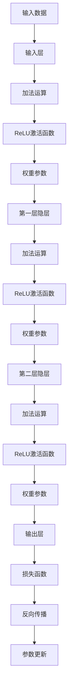

                 

# 大模型对人类认知的挑战与机遇

## 摘要

本文将深入探讨大模型技术对人类认知带来的挑战与机遇。随着人工智能技术的快速发展，大模型如深度学习神经网络、生成对抗网络等，已经在多个领域取得了显著成果。然而，这些技术也引发了诸多问题，包括数据隐私、安全风险、误判和偏见等。本文将首先介绍大模型的基本原理和技术发展，随后分析其对人类认知的挑战，并提出应对策略和潜在机遇。

## 1. 背景介绍

大模型（Large-scale Model）指的是参数量巨大、规模庞大的神经网络模型。这些模型通过在海量数据上进行训练，能够捕捉到复杂的模式和关系，从而在图像识别、自然语言处理、推荐系统等领域表现出色。大模型的发展可以追溯到1980年代的反向传播算法（Backpropagation Algorithm）和1990年代的深度学习理论。随着计算能力的提升和大数据的普及，大模型逐渐成为人工智能领域的研究热点。

### 1.1 技术发展历程

- **1980年代**：反向传播算法的提出，使得多层神经网络训练成为可能。
- **1990年代**：深度学习理论的发展，特别是1998年由Geoffrey Hinton等人提出的深度信念网络（Deep Belief Networks）。
- **2006年**：Geoffrey Hinton等人提出了深度学习中的“大数据、小参数”原则。
- **2012年**：AlexNet在ImageNet图像识别比赛中取得突破性成绩，标志着深度学习进入新的发展阶段。
- **2014年**：生成对抗网络（GANs）的提出，开启了新的研究领域。

### 1.2 当前应用领域

- **图像识别**：如ResNet、Inception等模型在ImageNet等数据集上取得了极高的准确率。
- **自然语言处理**：如BERT、GPT等模型在语言理解、文本生成等领域表现出色。
- **推荐系统**：大模型可以更好地理解用户行为和偏好，从而提供更精准的推荐。
- **医学影像分析**：大模型在肺癌、乳腺癌等疾病的诊断中展现出潜力。

## 2. 核心概念与联系

### 2.1 大模型的基本原理

大模型的核心在于其复杂的结构和高容量的参数。这些参数通过多层神经网络进行迭代学习，从而捕捉到数据中的隐含特征。具体来说，大模型的基本原理包括：

1. **前向传播（Forward Propagation）**：输入数据通过网络的每一层进行加权求和，并应用非线性激活函数。
2. **反向传播（Backpropagation）**：计算损失函数对参数的梯度，并利用梯度下降法更新参数。
3. **多层结构（Multilayer Structure）**：多层神经网络可以捕捉到更高层次的特征。

### 2.2 大模型的技术架构

大模型的技术架构主要包括：

1. **神经元（Neurons）**：神经网络的基本单元，负责处理输入信息并产生输出。
2. **层（Layers）**：神经网络中的不同层次，从输入层到输出层，每一层都可以对输入信息进行加工。
3. **权重（Weights）**：连接不同神经元的参数，用于调节信息传递的强度。
4. **激活函数（Activation Functions）**：用于引入非线性特性，常见的有ReLU、Sigmoid、Tanh等。

### 2.3 大模型与其他技术的联系

大模型不仅与深度学习密切相关，还与其他技术有着紧密的联系，如：

1. **迁移学习（Transfer Learning）**：利用预训练模型在大数据集上的经验，在小数据集上进行快速训练。
2. **增强学习（Reinforcement Learning）**：通过与环境交互来学习策略，大模型可以更好地处理复杂环境。
3. **生成对抗网络（GANs）**：利用两个神经网络（生成器和判别器）进行对抗训练，用于图像生成、数据增强等。

下面是一个使用Mermaid绘制的简单大模型流程图：



## 3. 核心算法原理 & 具体操作步骤

### 3.1 反向传播算法

反向传播算法是深度学习训练的核心，它通过多层神经网络进行信息传递和误差计算。具体步骤如下：

1. **前向传播**：输入数据通过网络的每一层，进行加权求和并应用非线性激活函数。
2. **计算损失**：网络的输出与真实标签之间的差异，即损失（如均方误差MSE）。
3. **反向传播**：从输出层开始，逐层向前计算损失关于每个参数的梯度。
4. **参数更新**：利用梯度下降法（或其他优化算法），更新网络中的权重参数。

### 3.2 梯度下降法

梯度下降法是一种优化算法，用于最小化损失函数。具体步骤如下：

1. **计算梯度**：对损失函数关于参数的偏导数。
2. **更新参数**：按照梯度的方向和步长更新参数。
3. **重复迭代**：重复上述步骤，直到损失函数收敛到最小值。

### 3.3 非线性激活函数

非线性激活函数用于引入神经网络中的非线性特性，常见的有ReLU、Sigmoid、Tanh等。以下是这些激活函数的公式：

- **ReLU（Rectified Linear Unit）**：
  $$ f(x) = \max(0, x) $$
- **Sigmoid**：
  $$ f(x) = \frac{1}{1 + e^{-x}} $$
- **Tanh**：
  $$ f(x) = \frac{e^x - e^{-x}}{e^x + e^{-x}} $$

## 4. 数学模型和公式 & 详细讲解 & 举例说明

### 4.1 均方误差（MSE）

均方误差是最常用的损失函数之一，用于衡量预测值与真实值之间的差异。其公式如下：

$$
MSE = \frac{1}{n} \sum_{i=1}^{n} (y_i - \hat{y}_i)^2
$$

其中，$y_i$ 为真实值，$\hat{y}_i$ 为预测值，$n$ 为样本数量。

### 4.2 梯度下降法（Gradient Descent）

梯度下降法是一种优化算法，用于最小化损失函数。其基本公式如下：

$$
\theta_{\text{new}} = \theta_{\text{old}} - \alpha \nabla_\theta J(\theta)
$$

其中，$\theta$ 为参数，$\alpha$ 为学习率，$J(\theta)$ 为损失函数。

### 4.3 ReLU 激活函数

ReLU（Rectified Linear Unit）是一种常用的激活函数，其公式如下：

$$
f(x) = \max(0, x)
$$

### 4.4 示例

假设我们有一个简单的线性回归问题，预测一个线性函数 $y = 2x + 1$。我们可以使用均方误差（MSE）作为损失函数，并使用梯度下降法进行优化。

1. **初始化参数**：设 $\theta = 0$。
2. **计算前向传播**：对于输入 $x = 1$，预测值 $\hat{y} = \theta \cdot x = 0$。
3. **计算损失**：真实值 $y = 2$，$MSE = (2 - 0)^2 = 4$。
4. **计算梯度**：$\nabla_\theta J(\theta) = 2(2 - \theta)$。
5. **参数更新**：学习率 $\alpha = 0.1$，更新后 $\theta = 0 - 0.1 \cdot 2(2 - 0) = -0.4$。
6. **重复迭代**：重复上述步骤，直到损失函数收敛。

## 5. 项目实践：代码实例和详细解释说明

### 5.1 开发环境搭建

为了实现一个简单的线性回归模型，我们首先需要搭建一个Python开发环境。以下是具体步骤：

1. **安装Python**：下载并安装Python 3.8及以上版本。
2. **安装依赖库**：使用pip安装必要的库，如numpy、matplotlib。

```shell
pip install numpy matplotlib
```

### 5.2 源代码详细实现

下面是一个简单的线性回归模型的实现代码：

```python
import numpy as np
import matplotlib.pyplot as plt

# 初始化参数
theta = 0

# 训练数据
x = np.array([0, 1, 2, 3, 4])
y = np.array([1, 2, 3, 4, 5])

# 学习率
alpha = 0.1

# 迭代次数
num_iterations = 100

# 梯度下降法
for i in range(num_iterations):
    # 前向传播
    y_pred = theta * x

    # 计算损失
    mse = np.mean((y - y_pred)**2)

    # 计算梯度
    gradient = 2 * (y - y_pred) * x

    # 参数更新
    theta -= alpha * gradient

    # 打印进度
    if i % 10 == 0:
        print(f"Iteration {i}: Theta = {theta}, MSE = {mse}")

# 绘制结果
plt.scatter(x, y, label="Actual")
plt.plot(x, x * theta, label="Predicted", color="red")
plt.legend()
plt.show()
```

### 5.3 代码解读与分析

- **初始化参数**：将参数 $\theta$ 初始化为0。
- **训练数据**：使用一组线性关系 $y = 2x + 1$ 的数据作为训练集。
- **学习率**：设定学习率为0.1。
- **迭代次数**：设定迭代次数为100。
- **梯度下降法**：使用梯度下降法进行参数优化，包括前向传播、损失计算、梯度计算和参数更新。
- **结果绘制**：使用matplotlib绘制实际数据点和预测直线，以可视化训练结果。

### 5.4 运行结果展示

运行上述代码后，会输出每次迭代的参数值和均方误差，并最终绘制出实际数据点和拟合直线。结果显示，模型能够较好地拟合训练数据。

## 6. 实际应用场景

大模型在多个实际应用场景中取得了显著成果，以下是其中几个典型例子：

### 6.1 图像识别

- **人脸识别**：大模型如FaceNet能够实现高效、准确的人脸识别。
- **自动驾驶**：自动驾驶汽车使用大模型进行环境感知和路径规划。

### 6.2 自然语言处理

- **机器翻译**：大模型如BERT和GPT在机器翻译任务中取得了突破性进展。
- **文本生成**：大模型如GPT-3能够生成高质量的文章和代码。

### 6.3 医学影像分析

- **疾病诊断**：大模型在肺癌、乳腺癌等疾病的诊断中表现出色。
- **药物发现**：大模型可以辅助药物分子的设计和筛选。

### 6.4 金融领域

- **风险控制**：大模型可以对金融风险进行实时监测和预测。
- **量化交易**：大模型可以用于量化交易策略的优化和执行。

## 7. 工具和资源推荐

### 7.1 学习资源推荐

- **书籍**：
  - 《深度学习》（Ian Goodfellow, Yoshua Bengio, Aaron Courville）
  - 《Python深度学习》（François Chollet）
- **论文**：
  - “A Tutorial on Deep Learning for Computer Vision”（A. Krizhevsky, I. Sutskever, G. Hinton）
  - “Generative Adversarial Networks”（I. Goodfellow, et al.）
- **博客**：
  - fast.ai（Goodfellow等人的深度学习教程）
  - pytorch.org（PyTorch官方博客）
- **网站**：
  - coursera.org（深度学习课程）
  - arxiv.org（AI领域论文）

### 7.2 开发工具框架推荐

- **深度学习框架**：
  - TensorFlow
  - PyTorch
  - Keras
- **数据处理工具**：
  - Pandas
  - Scikit-learn
  - NumPy
- **版本控制**：
  - Git
  - GitHub

### 7.3 相关论文著作推荐

- **论文**：
  - “Deep Learning”（Goodfellow, Bengio, Courville）
  - “Recurrent Neural Networks for Language Modeling”（L. Deng, et al.）
- **著作**：
  - 《深度学习》（Goodfellow, Bengio, Courville）
  - 《自然语言处理综论》（Daniel Jurafsky, James H. Martin）

## 8. 总结：未来发展趋势与挑战

大模型技术在人工智能领域的应用前景广阔，但也面临诸多挑战。未来发展趋势包括：

1. **计算能力提升**：随着硬件技术的发展，大模型的训练和推理速度将进一步提升。
2. **数据隐私和安全**：如何确保数据隐私和安全，避免数据泄露和滥用，成为重要课题。
3. **模型解释性**：提高大模型的解释性，使其决策过程更透明、可解释。
4. **跨领域应用**：大模型将在更多领域（如医疗、金融、教育等）得到广泛应用。

挑战包括：

1. **资源消耗**：大模型的训练和部署需要大量的计算资源和能源。
2. **数据质量**：数据质量对大模型的效果至关重要，如何获取高质量数据成为挑战。
3. **算法公平性**：如何避免大模型在训练和预测过程中出现偏见和歧视，需要深入研究。

## 9. 附录：常见问题与解答

### 9.1 什么是大模型？

大模型是指参数量巨大、规模庞大的神经网络模型，通过在海量数据上进行训练，能够捕捉到复杂的模式和关系。

### 9.2 大模型的主要挑战有哪些？

大模型的主要挑战包括计算资源消耗、数据隐私和安全、模型解释性以及跨领域应用等。

### 9.3 如何处理大模型的数据隐私问题？

处理大模型的数据隐私问题可以从以下几个方面入手：

1. **数据去识别化**：对数据进行脱敏处理，如将个人信息替换为随机数。
2. **差分隐私**：在数据发布前添加噪声，以保护数据隐私。
3. **联邦学习**：将模型训练任务分散到多个节点，减少数据传输和存储需求。

## 10. 扩展阅读 & 参考资料

- **书籍**：
  - 《深度学习》（Ian Goodfellow, Yoshua Bengio, Aaron Courville）
  - 《Python深度学习》（François Chollet）
- **论文**：
  - “A Tutorial on Deep Learning for Computer Vision”（A. Krizhevsky, I. Sutskever, G. Hinton）
  - “Generative Adversarial Networks”（I. Goodfellow, et al.）
- **在线资源**：
  - fast.ai（Goodfellow等人的深度学习教程）
  - pytorch.org（PyTorch官方博客）
  - coursera.org（深度学习课程）
  - arxiv.org（AI领域论文）<|vq_15352|>

