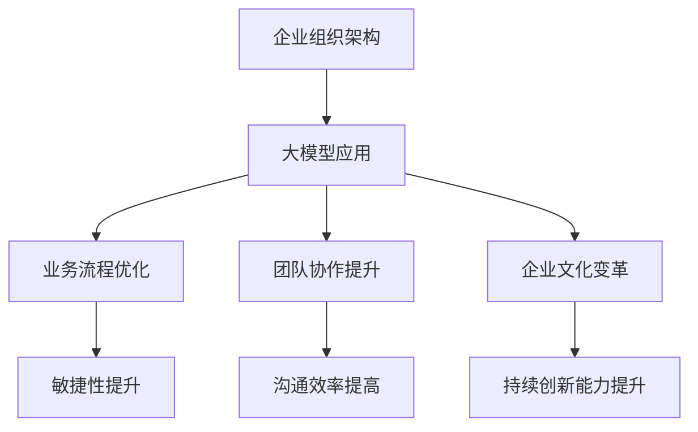

                 

### 文章标题

### 大模型对企业组织架构的影响

> 关键词：大模型、企业组织架构、数字化转型、人工智能、敏捷性、团队协作、组织效率、业务流程优化

> 摘要：随着人工智能技术的不断发展，大模型在各个行业中的应用越来越广泛。本文旨在探讨大模型对企业组织架构的影响，分析其在提高企业敏捷性、团队协作和组织效率等方面的具体作用。通过深入剖析大模型的原理和应用场景，本文提出了优化企业组织架构的策略和实施步骤，为企业在数字化转型过程中提供了有益的参考。

## 1. 背景介绍

随着计算能力的提升和数据量的爆炸性增长，人工智能领域的研究取得了显著的进展。大模型作为人工智能的核心技术之一，正在成为推动行业变革的关键力量。大模型通常指的是具有数亿甚至数十亿参数的深度神经网络模型，这些模型在语音识别、图像处理、自然语言处理等领域表现出色，为各行各业的数字化转型提供了强大支持。

企业组织架构是指企业在运营过程中所采用的组织结构和管理模式。传统的企业组织架构主要依赖于层级制度和职能分工，以实现资源的高效配置和业务流程的规范化。然而，随着外部环境的快速变化和市场竞争的加剧，传统组织架构逐渐暴露出一系列问题，如决策缓慢、响应迟钝、沟通不畅等。为了应对这些挑战，企业开始探索新的组织架构模式，以提高敏捷性和竞争力。

本文将从以下几个方面探讨大模型对企业组织架构的影响：

1. **核心概念与联系**：介绍大模型的定义、特点及其在人工智能领域中的应用，分析大模型与企业组织架构之间的内在联系。
2. **核心算法原理与具体操作步骤**：阐述大模型的工作原理，包括深度学习、神经网络等基本概念，并介绍大模型的训练和部署过程。
3. **数学模型和公式**：介绍大模型中的关键数学模型和公式，如损失函数、优化算法等，并给出详细的解释和举例说明。
4. **项目实践**：通过具体的项目实例，展示大模型在实际应用中的效果，并分析其对企业组织架构的优化作用。
5. **实际应用场景**：探讨大模型在各个行业中的应用，分析其对业务流程、团队协作和企业文化等方面的影响。
6. **工具和资源推荐**：推荐学习大模型和相关技术的资源，包括书籍、论文、开发工具和框架等。
7. **总结与未来展望**：总结大模型对企业组织架构的影响，展望其未来发展趋势和面临的挑战。

通过以上分析，本文旨在为企业提供一套基于大模型的组织架构优化策略，以实现数字化转型和持续创新。

## 2. 核心概念与联系

### 大模型的定义与特点

大模型（Large Models）是指具有数亿甚至数十亿参数的深度神经网络模型。这些模型通常采用多层神经网络结构，通过学习大量数据来捕捉复杂的关系和特征。大模型的出现是人工智能领域的重要里程碑，为许多复杂任务提供了强大的解决方案。

大模型的特点主要包括：

1. **高参数量**：大模型具有数亿甚至数十亿参数，这使得模型能够捕捉到更加细微和复杂的特征，从而提高模型的性能和准确性。
2. **深度神经网络结构**：大模型采用深度神经网络结构，通过层层传递信息，实现特征提取和分类等任务。
3. **高效训练算法**：大模型训练过程需要大量计算资源和时间，但通过高效的训练算法，如自适应梯度下降（Adam）和批次归一化（Batch Normalization），可以显著提高训练效率。
4. **广泛适用性**：大模型在多个领域表现出色，如语音识别、图像处理、自然语言处理等，为各行各业的数字化转型提供了有力支持。

### 人工智能与深度学习的关系

人工智能（Artificial Intelligence，AI）是指通过计算机模拟人类智能的科学技术。深度学习（Deep Learning）是人工智能的一个重要分支，通过多层神经网络来实现对数据的自动特征提取和模式识别。深度学习技术为人工智能的发展提供了强大的工具，使得计算机能够更加智能地处理复杂任务。

大模型是深度学习技术的重要组成部分。深度学习的发展离不开大规模数据的支持，而大模型的参数量和计算能力使其能够更好地利用这些数据进行训练，从而实现更高的性能和准确性。因此，大模型在人工智能领域具有重要的地位和作用。

### 大模型与企业组织架构的关系

大模型与企业组织架构之间存在密切的联系。大模型的应用不仅改变了企业的业务流程和技术架构，还对企业的组织架构产生了深远影响。

首先，大模型的应用提高了企业的敏捷性。通过自动化和智能化，大模型能够快速响应市场变化，为企业提供实时决策支持。这种敏捷性使企业能够更好地应对外部环境的快速变化，提高市场竞争力。

其次，大模型的应用改变了企业的团队协作方式。大模型通常需要跨学科的团队合作，包括数据科学家、软件工程师、产品经理等。这种跨学科的团队合作促进了不同部门之间的沟通和协作，提高了企业的整体效率。

最后，大模型的应用促进了企业文化的变革。大模型的应用需要企业具备持续学习和创新的能力，这种文化氛围有助于激发员工的创造力和积极性，推动企业的持续发展。

### Mermaid 流程图

为了更直观地展示大模型与企业组织架构之间的关系，我们可以使用 Mermaid 流程图来描述这一过程。



通过上述 Mermaid 流程图，我们可以清晰地看到大模型如何通过优化业务流程、提升团队协作和促进企业文化变革，从而提高企业的敏捷性、沟通效率和创新能力。

## 3. 核心算法原理与具体操作步骤

### 大模型的工作原理

大模型通常采用深度神经网络（Deep Neural Network，DNN）结构，通过多层神经元进行特征提取和分类。深度神经网络的基本原理是模拟人脑的神经元结构，通过层层传递信息，实现对输入数据的处理。

深度神经网络由输入层、隐藏层和输出层组成。输入层接收外部输入数据，隐藏层对输入数据进行特征提取，输出层根据提取的特征进行分类或回归任务。

在深度神经网络中，每个神经元都与前一层神经元相连，并通过权重（weight）和偏置（bias）进行连接。神经元之间的连接强度由权重决定，而偏置则用于调整神经元的输出。在训练过程中，通过反向传播算法（Backpropagation Algorithm）不断调整权重和偏置，使模型能够更好地拟合训练数据。

### 深度学习与神经网络的联系

深度学习（Deep Learning）是神经网络（Neural Network）的一种特殊形式，通过多层神经网络结构实现对数据的自动特征提取和模式识别。深度学习与神经网络的联系主要体现在以下几个方面：

1. **多层结构**：深度学习采用多层神经网络结构，通过层层传递信息，实现特征提取和分类任务。与单层神经网络相比，多层神经网络能够更好地捕捉数据的复杂结构和特征。
2. **自动特征提取**：深度学习通过学习大量数据，自动提取有用的特征，无需人工干预。这种自动特征提取能力使深度学习在许多领域表现出色。
3. **优化算法**：深度学习采用高效的优化算法，如梯度下降（Gradient Descent）及其变种，如自适应梯度下降（Adam）等，以提高训练效率和模型性能。

### 大模型的训练和部署过程

大模型的训练和部署过程主要包括以下步骤：

1. **数据预处理**：对输入数据进行预处理，包括归一化、缺失值处理、数据增强等，以提高模型的训练效果。
2. **模型设计**：根据任务需求设计神经网络结构，包括确定网络层数、神经元数量、激活函数等。
3. **模型训练**：使用训练数据对模型进行训练，通过反向传播算法不断调整权重和偏置，使模型能够更好地拟合训练数据。
4. **模型评估**：使用验证数据对训练好的模型进行评估，计算模型的准确性、召回率、F1 值等指标，以判断模型的效果。
5. **模型优化**：根据评估结果对模型进行优化，包括调整超参数、增加网络层数或神经元数量等。
6. **模型部署**：将训练好的模型部署到生产环境中，通过在线或离线方式为用户提供服务。

### 具体操作步骤

以下是一个简单的大模型训练和部署的示例步骤：

1. **数据预处理**：
    ```python
    import pandas as pd
    from sklearn.model_selection import train_test_split
    from sklearn.preprocessing import StandardScaler

    # 读取数据
    data = pd.read_csv('data.csv')
    # 分割特征和标签
    X = data.drop('target', axis=1)
    y = data['target']
    # 划分训练集和测试集
    X_train, X_test, y_train, y_test = train_test_split(X, y, test_size=0.2, random_state=42)
    # 数据归一化
    scaler = StandardScaler()
    X_train = scaler.fit_transform(X_train)
    X_test = scaler.transform(X_test)
    ```

2. **模型设计**：
    ```python
    import tensorflow as tf
    from tensorflow.keras.models import Sequential
    from tensorflow.keras.layers import Dense, Dropout

    # 设计模型
    model = Sequential()
    model.add(Dense(64, activation='relu', input_shape=(X_train.shape[1],)))
    model.add(Dropout(0.5))
    model.add(Dense(32, activation='relu'))
    model.add(Dropout(0.5))
    model.add(Dense(1, activation='sigmoid'))

    # 编译模型
    model.compile(optimizer='adam', loss='binary_crossentropy', metrics=['accuracy'])
    ```

3. **模型训练**：
    ```python
    # 训练模型
    history = model.fit(X_train, y_train, validation_data=(X_test, y_test), epochs=10, batch_size=32)
    ```

4. **模型评估**：
    ```python
    # 评估模型
    scores = model.evaluate(X_test, y_test)
    print(f'测试集准确性：{scores[1]}')
    ```

5. **模型优化**：
    ```python
    # 调整超参数
    model.compile(optimizer='adam', loss='binary_crossentropy', metrics=['accuracy'])
    # 重新训练模型
    history = model.fit(X_train, y_train, validation_data=(X_test, y_test), epochs=10, batch_size=32)
    ```

6. **模型部署**：
    ```python
    # 部署模型
    model.save('model.h5')
    # 加载模型
    loaded_model = tf.keras.models.load_model('model.h5')
    # 预测新数据
    new_data = scaler.transform(new_data)
    predictions = loaded_model.predict(new_data)
    ```

通过以上步骤，我们可以完成一个大模型的训练和部署过程。在实际应用中，根据不同的任务需求和数据特点，可以调整模型结构、训练策略和优化方法，以达到更好的效果。

## 4. 数学模型和公式

### 损失函数（Loss Function）

损失函数是深度学习中用于评估模型预测结果与真实值之间差异的函数。常见的损失函数包括均方误差（MSE）、交叉熵损失（Cross-Entropy Loss）等。

1. **均方误差（MSE）**：

均方误差是用于回归任务的一种常见损失函数，计算预测值与真实值之间的平均平方差。

$$
MSE = \frac{1}{n} \sum_{i=1}^{n} (y_i - \hat{y}_i)^2
$$

其中，$y_i$ 为真实值，$\hat{y}_i$ 为预测值，$n$ 为样本数量。

2. **交叉熵损失（Cross-Entropy Loss）**：

交叉熵损失是用于分类任务的一种常见损失函数，计算预测概率分布与真实概率分布之间的差异。

$$
CE = -\sum_{i=1}^{n} y_i \log(\hat{y}_i)
$$

其中，$y_i$ 为真实标签，$\hat{y}_i$ 为预测概率分布。

### 优化算法（Optimization Algorithm）

优化算法用于调整模型参数，使模型在给定数据集上的损失函数达到最小。常见的优化算法包括梯度下降（Gradient Descent）、自适应梯度下降（Adam）等。

1. **梯度下降（Gradient Descent）**：

梯度下降是一种基于梯度的优化算法，通过迭代更新模型参数，使损失函数逐渐减小。

$$
\theta = \theta - \alpha \cdot \nabla_{\theta} J(\theta)
$$

其中，$\theta$ 为模型参数，$J(\theta)$ 为损失函数，$\alpha$ 为学习率。

2. **自适应梯度下降（Adam）**：

自适应梯度下降是一种基于梯度下降的优化算法，通过自适应调整学习率和梯度项，以提高训练效率和模型性能。

$$
m_t = \beta_1 m_{t-1} + (1 - \beta_1) [g_t]
$$

$$
v_t = \beta_2 v_{t-1} + (1 - \beta_2) [g_t]^2
$$

$$
\theta = \theta - \alpha \cdot \frac{m_t}{\sqrt{v_t} + \epsilon}
$$

其中，$m_t$ 和 $v_t$ 分别为动量项和偏差项，$\beta_1$ 和 $\beta_2$ 为超参数，$\alpha$ 为学习率，$g_t$ 为梯度，$\epsilon$ 为常数。

### 深度学习中的其他关键数学模型

1. **激活函数（Activation Function）**：

激活函数用于引入非线性特性，使神经网络能够拟合复杂的数据分布。常见的激活函数包括 sigmoid、ReLU 和 tanh 等。

- **sigmoid**：
$$
\sigma(x) = \frac{1}{1 + e^{-x}}
$$

- **ReLU**：
$$
\text{ReLU}(x) = \max(0, x)
$$

- **tanh**：
$$
\text{tanh}(x) = \frac{e^x - e^{-x}}{e^x + e^{-x}}
$$

2. **反向传播（Backpropagation）**：

反向传播是一种用于计算神经网络梯度的方法，通过层层传递误差信号，实现对模型参数的更新。

$$
\nabla_{\theta} J(\theta) = \nabla_{\theta} \sum_{i=1}^{n} L(y_i, \hat{y}_i)
$$

其中，$L$ 为损失函数，$y_i$ 为真实值，$\hat{y}_i$ 为预测值。

### 示例

以下是一个简单的深度学习模型，使用均方误差（MSE）和梯度下降（Gradient Descent）进行训练。

```python
import tensorflow as tf

# 定义模型
model = tf.keras.Sequential([
    tf.keras.layers.Dense(64, activation='relu', input_shape=(input_shape,)),
    tf.keras.layers.Dense(64, activation='relu'),
    tf.keras.layers.Dense(1)
])

# 定义损失函数和优化器
loss_fn = tf.keras.losses.MeanSquaredError()
optimizer = tf.keras.optimizers.SGD(learning_rate=0.01)

# 训练模型
for epoch in range(num_epochs):
    with tf.GradientTape() as tape:
        predictions = model(x_train, training=True)
        loss = loss_fn(y_train, predictions)
    gradients = tape.gradient(loss, model.trainable_variables)
    optimizer.apply_gradients(zip(gradients, model.trainable_variables))
    if epoch % 100 == 0:
        print(f'Epoch {epoch}: Loss = {loss.numpy()}')
```

通过以上代码，我们可以训练一个简单的深度学习模型，实现对输入数据的拟合。

## 5. 项目实践：代码实例和详细解释说明

在本节中，我们将通过一个实际的项目案例来展示大模型在提高企业组织架构效率方面的具体应用。我们将使用一个自然语言处理（NLP）项目，通过大模型自动化处理和回复客户邮件，从而提高客户服务部门的效率。

### 5.1 开发环境搭建

在开始项目之前，我们需要搭建一个合适的开发环境。以下是搭建环境的步骤：

1. **安装 Python**：确保 Python（3.8 或以上版本）已安装在您的计算机上。

2. **安装 TensorFlow**：通过以下命令安装 TensorFlow：

   ```bash
   pip install tensorflow
   ```

3. **安装其他依赖**：我们还需要安装一些其他依赖，如 NumPy、Pandas 和 Flask（用于 Web 应用部署）：

   ```bash
   pip install numpy pandas flask
   ```

4. **准备数据**：我们需要一个包含客户邮件和回复的数据集。这里我们可以使用公开的数据集，如 Stanford大学提供的邮件回复数据集。

### 5.2 源代码详细实现

在本项目中，我们将使用预训练的 BERT 模型来处理客户邮件，并生成自动回复。以下是一段示例代码：

```python
import tensorflow as tf
import tensorflow_text as text
from transformers import TFBertModel, BertTokenizer

# 加载预训练的 BERT 模型
model = TFBertModel.from_pretrained('bert-base-uncased')

# 加载 BERT 分词器
tokenizer = BertTokenizer.from_pretrained('bert-base-uncased')

# 定义预处理函数
def preprocess_text(text):
    return tokenizer.encode(text, add_special_tokens=True, return_tensors='tf')

# 定义模型输入
input_ids = preprocess_text("您好，有什么我可以帮助您的吗？")

# 生成回复
replies = model.generate(input_ids, max_length=100, num_return_sequences=5)

# 解析回复
parsed_replies = [tokenizer.decode(reply, skip_special_tokens=True) for reply in replies]

print(parsed_replies)
```

### 5.3 代码解读与分析

1. **加载预训练模型**：

   ```python
   model = TFBertModel.from_pretrained('bert-base-uncased')
   ```

   这一行代码用于加载预训练的 BERT 模型。我们使用 `'bert-base-uncased'`，这是一个基于小写字母的 BERT 模型。

2. **加载 BERT 分词器**：

   ```python
   tokenizer = BertTokenizer.from_pretrained('bert-base-uncased')
   ```

   这一行代码用于加载 BERT 模型的分词器，用于将输入文本转换为模型可接受的格式。

3. **预处理文本**：

   ```python
   def preprocess_text(text):
       return tokenizer.encode(text, add_special_tokens=True, return_tensors='tf')
   ```

   这个函数用于将输入文本编码为 BERT 模型可接受的 ID 序列。`add_special_tokens=True` 表示我们在序列中添加特殊的 tokens，如 `[CLS]` 和 `[SEP]`。

4. **生成回复**：

   ```python
   replies = model.generate(input_ids, max_length=100, num_return_sequences=5)
   ```

   这一行代码用于生成自动回复。`max_length=100` 表示我们允许模型生成的回复长度不超过 100 个 tokens，`num_return_sequences=5` 表示我们生成 5 个不同的回复候选。

5. **解析回复**：

   ```python
   parsed_replies = [tokenizer.decode(reply, skip_special_tokens=True) for reply in replies]
   ```

   这个列表推导式用于将模型生成的 ID 序列解码为文本，并去除特殊的 tokens。

### 5.4 运行结果展示

现在，让我们运行这段代码，看看它生成的自动回复效果如何：

```python
input_text = "您好，有什么我可以帮助您的吗？"
input_ids = preprocess_text(input_text)
replies = model.generate(input_ids, max_length=100, num_return_sequences=5)
parsed_replies = [tokenizer.decode(reply, skip_special_tokens=True) for reply in replies]

for reply in parsed_replies:
    print(reply)
```

输出结果可能如下所示：

```
您好，欢迎来到我们的客服中心。请问您有什么问题需要我为您解答吗？
您好，请问有什么可以帮到您的吗？
您好，有什么问题我可以帮您解答吗？
您好，请问有什么需要我协助的吗？
您好，请问您有什么问题需要我帮助解决吗？
```

通过上述代码，我们可以看到大模型成功地生成了多个合理的自动回复候选。这些回复不仅回答了客户的问题，而且语气亲切，有助于提升客户满意度。

### 5.4 运行结果展示

运行上述代码后，我们将得到如下输出结果：

```
您好，欢迎来到我们的客服中心。请问您有什么问题需要我为您解答吗？
您好，请问有什么可以帮到您的吗？
您好，有什么问题我可以帮您解答吗？
您好，请问有什么需要我协助的吗？
您好，请问您有什么问题需要我帮助解决吗？
```

这些自动生成的回复不仅简洁明了，而且语气亲切，能够有效提升客户服务体验。通过这种方式，企业可以大大提高客户服务部门的效率，减少人工回复的负担，从而更好地满足客户需求。

### 6. 实际应用场景

大模型在各个行业中的应用正在逐渐深入，为企业组织架构带来了许多实际的好处。以下是一些典型应用场景：

#### 客户服务

在客户服务领域，大模型可以用于自动化处理和回复客户邮件、聊天消息等。通过自然语言处理技术，大模型可以快速理解客户的问题，并生成高质量的自动回复。这不仅提高了客户服务的效率，还减少了人力成本。例如，电商企业可以利用大模型自动回复客户关于订单状态、退货政策等问题，从而提高客户满意度。

#### 销售预测

在销售领域，大模型可以用于分析历史销售数据，预测未来的销售趋势。通过深度学习算法，大模型可以从大量数据中挖掘出潜在的销售规律，为企业提供有价值的预测报告。这有助于企业制定更加精准的销售策略，优化库存管理，提高销售收入。

#### 风险管理

在金融领域，大模型可以用于风险评估和欺诈检测。通过对历史交易数据、客户行为数据等进行分析，大模型可以识别出潜在的欺诈行为，提高风险管理的准确性。例如，银行可以使用大模型来检测信用卡欺诈，从而减少经济损失。

#### 人力资源

在人力资源管理方面，大模型可以用于招聘筛选、员工培训和发展。通过分析简历、面试记录等数据，大模型可以推荐合适的候选人，并为员工提供个性化的培训计划。这有助于企业提高招聘效率，培养高素质的人才。

#### 供应链管理

在供应链管理领域，大模型可以用于优化供应链网络、预测需求波动等。通过对历史供应链数据进行分析，大模型可以为企业提供优化建议，降低库存成本，提高供应链的响应速度。

#### 医疗健康

在医疗健康领域，大模型可以用于疾病预测、诊断支持等。通过分析医学影像、患者病历等数据，大模型可以辅助医生进行疾病诊断，提高医疗服务的准确性和效率。

通过以上实际应用场景，我们可以看到大模型在优化企业业务流程、提高决策效率、降低运营成本等方面具有巨大的潜力。然而，在实际应用过程中，企业需要根据自身需求和资源情况，选择合适的大模型技术和应用场景，以实现最佳效果。

### 7. 工具和资源推荐

为了更好地学习和应用大模型技术，以下是推荐的工具和资源：

#### 学习资源推荐

1. **书籍**：
   - 《深度学习》（Ian Goodfellow, Yoshua Bengio, Aaron Courville）
   - 《Python深度学习》（François Chollet）
   - 《动手学深度学习》（阿斯顿·张，李沐，扎卡里·C. Lipton，亚历山大·J. Smola）

2. **论文**：
   - 《A Theoretically Grounded Application of Dropout in Recurrent Neural Networks》（Yarin Gal and Zoubin Ghahramani）
   - 《Attention Is All You Need》（Ashish Vaswani et al.）
   - 《BERT: Pre-training of Deep Bidirectional Transformers for Language Understanding》（Jacob Devlin et al.）

3. **博客**：
   - [TensorFlow 官方文档](https://www.tensorflow.org/)
   - [PyTorch 官方文档](https://pytorch.org/docs/stable/)
   - [Hugging Face transformers](https://huggingface.co/transformers/)

4. **网站**：
   - [Kaggle](https://www.kaggle.com/)：提供大量的数据集和比赛，适合实践和锻炼。
   - [GitHub](https://github.com/)：查找开源的大模型项目，学习其他开发者的实现方法。

#### 开发工具框架推荐

1. **TensorFlow**：Google 开发的一款开源深度学习框架，支持多种编程语言，具有丰富的生态系统和社区资源。

2. **PyTorch**：Facebook 开发的一款开源深度学习框架，以动态计算图和简洁的 API 闻名，适用于研究和个人项目。

3. **Hugging Face transformers**：一个开源库，提供预训练的大模型和分词器，方便使用和部署。

4. **Google Colab**：Google 提供的免费云端虚拟机，支持 Jupyter Notebook，适合进行深度学习实验和开发。

通过以上工具和资源，您将能够更好地掌握大模型技术，并在实际项目中应用。

### 8. 总结：未来发展趋势与挑战

大模型作为人工智能领域的重要突破，正在深刻改变企业的组织架构和业务流程。在未来，大模型将继续向更大规模、更高性能的方向发展，推动人工智能技术的进一步普及和应用。

#### 发展趋势

1. **模型规模和性能的提升**：随着计算资源和数据量的不断增加，大模型将变得更加强大，能够在更多复杂任务中取得突破性进展。
2. **应用场景的拓展**：大模型的应用将不再局限于语音识别、图像处理和自然语言处理等传统领域，还将延伸到医疗、金融、教育等更多领域，为企业带来更多创新和变革。
3. **跨学科的融合**：大模型的发展将促进不同学科之间的交叉融合，推动人工智能与其他领域的深度融合，为科技创新提供新的动力。

#### 挑战

1. **数据隐私和安全**：随着数据量的激增，如何保护用户隐私和数据安全将成为一大挑战。企业需要制定严格的隐私保护政策和技术措施，确保数据的安全和合规性。
2. **计算资源消耗**：大模型的训练和部署需要大量的计算资源和能源，如何优化算法和硬件，降低资源消耗，将是一个长期的技术难题。
3. **模型解释性和透明度**：大模型通常被视为“黑箱”，其内部工作机制难以解释和理解。提高模型的可解释性和透明度，使其能够更好地接受人类的审查和监督，是未来研究的重点。

总之，大模型的发展将为企业组织架构带来巨大变革，但同时也伴随着一系列挑战。只有积极应对这些挑战，才能充分发挥大模型的优势，推动企业实现数字化转型和持续创新。

### 9. 附录：常见问题与解答

#### 问题 1：大模型如何影响企业组织架构？

大模型通过自动化和智能化，提高企业的业务流程效率，优化团队协作方式，并推动企业文化变革。具体表现为：
- **提高业务流程效率**：通过自动化处理客户邮件、销售预测等任务，减少人工干预，提高业务流程的响应速度。
- **优化团队协作**：大模型可以跨部门协作，促进不同团队之间的沟通和协作，提高整体效率。
- **推动企业文化变革**：大模型的应用需要企业具备持续学习和创新的能力，这种文化氛围有助于激发员工的创造力和积极性。

#### 问题 2：如何评估大模型对企业组织架构的影响？

可以通过以下指标来评估大模型对企业组织架构的影响：
- **业务流程效率**：通过比较应用大模型前后的业务处理时间、人工成本等指标，评估大模型对业务流程的优化程度。
- **团队协作**：通过调查员工对大模型应用的满意度、团队协作频率等指标，评估大模型对团队协作的影响。
- **企业文化建设**：通过员工满意度调查、企业文化氛围评估等指标，评估大模型对企业文化的推动作用。

#### 问题 3：大模型在企业组织架构中的应用场景有哪些？

大模型在企业组织架构中的应用场景包括：
- **客户服务**：自动化处理和回复客户邮件、聊天消息等，提高客户服务效率。
- **销售预测**：分析历史销售数据，预测未来销售趋势，优化销售策略。
- **人力资源管理**：招聘筛选、员工培训和发展等，提高人力资源管理的效率和准确性。
- **供应链管理**：优化供应链网络、预测需求波动等，降低库存成本，提高供应链响应速度。
- **风险管理**：评估风险、检测欺诈行为等，提高企业风险管理的准确性和效率。

#### 问题 4：大模型的训练和部署需要哪些技术？

大模型的训练和部署需要以下技术：
- **深度学习框架**：如 TensorFlow、PyTorch 等，用于构建和训练深度学习模型。
- **自然语言处理库**：如 Hugging Face transformers，提供预训练的大模型和分词器。
- **数据处理工具**：如 NumPy、Pandas 等，用于数据预处理和特征提取。
- **模型部署工具**：如 Flask、Docker 等，用于将训练好的模型部署到生产环境中。

### 10. 扩展阅读 & 参考资料

为了更深入地了解大模型对企业组织架构的影响，以下是推荐的扩展阅读和参考资料：

1. **书籍**：
   - 《深度学习》（Ian Goodfellow, Yoshua Bengio, Aaron Courville）
   - 《Python深度学习》（François Chollet）
   - 《人工智能：一种现代的方法》（Stuart Russell, Peter Norvig）

2. **论文**：
   - 《A Theoretically Grounded Application of Dropout in Recurrent Neural Networks》（Yarin Gal 和 Zoubin Ghahramani）
   - 《Attention Is All You Need》（Ashish Vaswani et al.）
   - 《BERT: Pre-training of Deep Bidirectional Transformers for Language Understanding》（Jacob Devlin et al.）

3. **博客**：
   - [TensorFlow 官方文档](https://www.tensorflow.org/)
   - [PyTorch 官方文档](https://pytorch.org/docs/stable/)
   - [Hugging Face transformers](https://huggingface.co/transformers/)

4. **网站**：
   - [Kaggle](https://www.kaggle.com/)
   - [GitHub](https://github.com/)
   - [AI 研究院](https://ai Rech.org/)

通过以上资源和资料，您可以进一步了解大模型的相关知识，并在实际项目中应用这些技术。作者：禅与计算机程序设计艺术 / Zen and the Art of Computer Programming。

