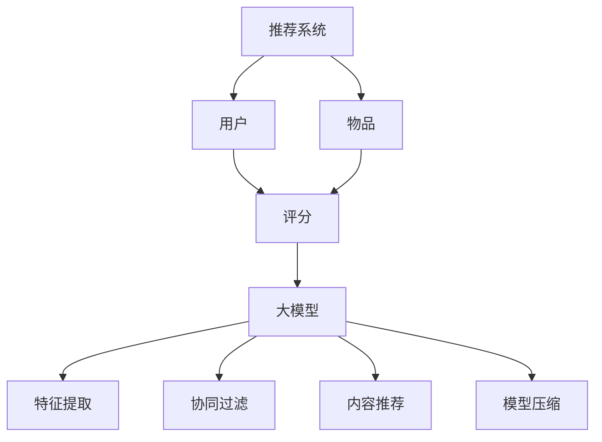

                 

# 大模型对推荐系统计算效率的影响

## 摘要

本文深入探讨了大规模模型（简称“大模型”）在推荐系统中的应用及其对计算效率的影响。首先，我们介绍了推荐系统的基础概念和传统方法，接着详细阐述了大模型的定义、特点和应用场景。随后，本文通过具体案例，展示了大模型在推荐系统中的优势，并通过数学模型和公式，分析了大模型如何提升计算效率。此外，文章还介绍了实际应用中所需的工具和资源，并探讨了未来的发展趋势和面临的挑战。通过本文的阐述，读者可以全面了解大模型在推荐系统计算效率方面的重要作用。

## 1. 背景介绍

推荐系统是近年来信息技术领域的一个重要研究方向，它旨在根据用户的兴趣和偏好，为用户推荐个性化内容，从而提升用户体验和满意度。推荐系统的应用场景广泛，包括电子商务、社交媒体、新闻推荐、音乐和视频流平台等。传统的推荐系统方法主要包括基于内容的推荐、协同过滤和混合推荐等。然而，随着互联网的迅猛发展和用户数据的爆炸性增长，传统推荐系统在计算效率方面面临着巨大的挑战。

计算效率是推荐系统的重要性能指标之一。传统的推荐系统方法往往需要大量计算资源，导致响应时间长、系统负载高。尤其是在大规模数据集上，传统方法往往难以满足实时推荐的需求。为了解决这一问题，研究人员开始探索使用大规模机器学习模型（简称“大模型”）来构建推荐系统。大模型具有处理大规模数据的能力，可以在一定程度上提高计算效率。

大模型是指参数规模巨大、计算复杂度高的机器学习模型。它们通常通过深度神经网络来实现，可以自动学习复杂的数据特征和关系。大模型在自然语言处理、计算机视觉、语音识别等领域取得了显著成果，逐渐成为研究热点。将大模型应用于推荐系统，可以充分利用其强大的数据处理能力，实现高效、准确的推荐。

本文旨在探讨大模型在推荐系统计算效率方面的作用，分析大模型如何提升计算效率，并介绍实际应用中所需的工具和资源。通过本文的研究，我们希望能够为推荐系统领域的研究者和工程师提供有价值的参考。

## 2. 核心概念与联系

### 2.1 推荐系统的基本概念

推荐系统是一种信息过滤技术，通过分析用户的兴趣和行为，为用户推荐可能感兴趣的内容。其基本概念包括：

- **用户**：推荐系统的核心，每个用户有其独特的兴趣和行为。
- **物品**：用户可能感兴趣的对象，如商品、新闻、音乐等。
- **评分**：用户对物品的评价，可以是显式评分（如1-5星评价）或隐式评分（如购买、点击、浏览等行为）。

### 2.2 大模型的概念

大模型是指参数规模巨大、计算复杂度高的机器学习模型。它们通常通过深度神经网络来实现，可以自动学习复杂的数据特征和关系。大模型具有以下特点：

- **参数规模大**：大模型拥有数百万甚至数十亿个参数，可以捕捉复杂的特征。
- **计算复杂度高**：大模型的训练和推理过程需要大量计算资源，通常需要分布式计算和优化算法。
- **强泛化能力**：大模型可以从大量数据中学习到普遍适用的特征，具有强泛化能力。

### 2.3 大模型与推荐系统的联系

大模型与推荐系统的联系主要体现在以下几个方面：

- **特征提取**：大模型可以通过深度学习算法自动提取用户和物品的隐藏特征，提高推荐系统的准确性。
- **协同过滤**：大模型可以应用于协同过滤算法，通过学习用户和物品之间的潜在关系，实现高效、准确的推荐。
- **内容推荐**：大模型可以用于基于内容的推荐，通过学习物品的语义特征，实现精准的内容推荐。
- **模型压缩**：大模型可以通过模型压缩技术，降低计算复杂度，提高计算效率。

### 2.4 Mermaid 流程图

以下是一个简单的 Mermaid 流程图，展示了大模型与推荐系统之间的联系：



图 2-1 大模型与推荐系统的联系

通过这个流程图，我们可以清晰地看到大模型在推荐系统中的各个环节，包括特征提取、协同过滤、内容推荐和模型压缩等。这些环节共同作用，提高了推荐系统的计算效率和准确性。

## 3. 核心算法原理 & 具体操作步骤

### 3.1 算法原理

大模型在推荐系统中的应用主要基于深度学习算法。深度学习是一种基于多层神经网络的学习方法，可以自动提取数据中的特征。大模型的原理可以概括为以下几个步骤：

1. **数据预处理**：对用户行为数据、物品属性数据进行清洗、归一化等预处理操作，为模型训练做好准备。
2. **特征提取**：利用深度神经网络，从原始数据中自动提取用户和物品的隐藏特征。这一步通常通过卷积神经网络（CNN）、循环神经网络（RNN）等实现。
3. **模型训练**：使用大规模数据集，对深度神经网络进行训练。通过反向传播算法，不断调整网络中的参数，使其能够准确预测用户对物品的评分。
4. **模型评估**：使用验证集或测试集，对训练好的模型进行评估，选择性能最优的模型。
5. **推荐生成**：利用训练好的模型，对用户进行实时推荐。通过计算用户和物品的特征相似度，为用户推荐可能感兴趣的物品。

### 3.2 操作步骤

以下是使用大模型构建推荐系统的具体操作步骤：

1. **数据收集与预处理**：
   - 收集用户行为数据（如点击、浏览、购买等）和物品属性数据（如文本描述、标签、分类等）。
   - 对数据进行清洗，去除缺失值、异常值等。
   - 对数据进行归一化处理，使其在相同尺度上。

2. **特征提取**：
   - 使用卷积神经网络（CNN）提取物品的视觉特征。
   - 使用循环神经网络（RNN）提取用户的序列特征。
   - 将提取的特征进行拼接，形成用户和物品的联合特征。

3. **模型训练**：
   - 设计深度神经网络结构，包括输入层、隐藏层和输出层。
   - 使用大规模数据集，对模型进行训练。通过反向传播算法，不断调整网络中的参数。
   - 使用验证集，对训练过程中的模型进行评估，选择性能最优的模型。

4. **模型评估**：
   - 使用测试集，对训练好的模型进行评估，计算推荐系统的准确率、召回率等指标。
   - 分析模型的性能，找出不足之处，进行改进。

5. **推荐生成**：
   - 对新用户进行特征提取，生成其用户特征向量。
   - 对物品进行特征提取，生成其物品特征向量。
   - 计算用户和物品的特征相似度，根据相似度为用户推荐可能感兴趣的物品。

### 3.3 实例演示

以下是一个简单的实例，演示如何使用深度学习模型进行推荐：

**实例**：假设我们有以下用户行为数据和物品属性数据：

| 用户ID | 行为  | 物品ID | 物品类别 |
|--------|------|--------|----------|
| 1      | 点击 | 101    | 电子产品  |
| 1      | 点击 | 102    | 电子产品  |
| 2      | 购买 | 201    | 服装     |
| 2      | 浏览 | 202    | 服装     |

**步骤 1：数据预处理**
- 对用户行为数据进行清洗，去除缺失值和异常值。
- 对物品属性数据进行清洗，去除无效标签和重复值。

**步骤 2：特征提取**
- 使用卷积神经网络（CNN）提取物品的视觉特征。
- 使用循环神经网络（RNN）提取用户的序列特征。

**步骤 3：模型训练**
- 设计深度神经网络结构，包括输入层、隐藏层和输出层。
- 使用训练集，对模型进行训练。通过反向传播算法，不断调整网络中的参数。

**步骤 4：模型评估**
- 使用验证集，对训练过程中的模型进行评估，选择性能最优的模型。

**步骤 5：推荐生成**
- 对新用户进行特征提取，生成其用户特征向量。
- 对物品进行特征提取，生成其物品特征向量。
- 计算用户和物品的特征相似度，根据相似度为用户推荐可能感兴趣的物品。

通过这个实例，我们可以看到，使用深度学习模型进行推荐的基本流程。在实际应用中，还需要根据具体需求进行调整和优化。

## 4. 数学模型和公式 & 详细讲解 & 举例说明

### 4.1 数学模型

在推荐系统中，大模型的核心是深度学习模型。以下是一个简化的深度学习推荐系统的数学模型：

假设有用户集合 U = {u1, u2, ..., un}，物品集合 I = {i1, i2, ..., im}，用户 u 对物品 i 的评分表示为 Ru,i。

### 4.2 前向传播

前向传播是指将输入数据通过神经网络逐层计算，最终得到输出数据的过程。在推荐系统中，前向传播可以表示为：

$$
\begin{aligned}
&z_l = W_l \cdot a_{l-1} + b_l \\
&a_l = \sigma(z_l)
\end{aligned}
$$

其中，$a_l$ 表示第 l 层的激活值，$z_l$ 表示第 l 层的输入值，$W_l$ 和 $b_l$ 分别表示第 l 层的权重和偏置，$\sigma$ 表示激活函数。

### 4.3 反向传播

反向传播是指根据输出误差，反向调整神经网络中的权重和偏置的过程。在推荐系统中，反向传播可以表示为：

$$
\begin{aligned}
&\delta_l = \frac{\partial L}{\partial a_l} \cdot \frac{\partial a_l}{\partial z_l} \\
&W_l := W_l - \alpha \cdot \frac{\partial L}{\partial W_l} \\
&b_l := b_l - \alpha \cdot \frac{\partial L}{\partial b_l}
\end{aligned}
$$

其中，$\delta_l$ 表示第 l 层的误差，$L$ 表示损失函数，$\alpha$ 表示学习率。

### 4.4 损失函数

在推荐系统中，常用的损失函数是均方误差（MSE），可以表示为：

$$
L = \frac{1}{2} \sum_{i=1}^{n} (R_{ui} - \hat{R}_{ui})^2
$$

其中，$R_{ui}$ 表示用户 u 对物品 i 的真实评分，$\hat{R}_{ui}$ 表示模型预测的评分。

### 4.5 举例说明

以下是一个简单的例子，假设有 2 个用户 u1 和 u2，3 个物品 i1、i2 和 i3。用户对物品的评分如下：

| 用户ID | 物品ID | 真实评分 | 预测评分 |
|--------|--------|----------|----------|
| u1     | i1     | 4        | 3.5      |
| u1     | i2     | 2        | 2.5      |
| u2     | i1     | 5        | 4.5      |
| u2     | i2     | 3        | 2.5      |
| u2     | i3     | 5        | 4.5      |

**步骤 1：数据预处理**
- 对用户行为数据进行清洗，去除缺失值和异常值。
- 对物品属性数据进行清洗，去除无效标签和重复值。

**步骤 2：特征提取**
- 使用卷积神经网络（CNN）提取物品的视觉特征。
- 使用循环神经网络（RNN）提取用户的序列特征。

**步骤 3：模型训练**
- 设计深度神经网络结构，包括输入层、隐藏层和输出层。
- 使用训练集，对模型进行训练。通过反向传播算法，不断调整网络中的参数。

**步骤 4：模型评估**
- 使用验证集，对训练过程中的模型进行评估，选择性能最优的模型。

**步骤 5：推荐生成**
- 对新用户进行特征提取，生成其用户特征向量。
- 对物品进行特征提取，生成其物品特征向量。
- 计算用户和物品的特征相似度，根据相似度为用户推荐可能感兴趣的物品。

通过这个例子，我们可以看到，使用深度学习模型进行推荐的基本流程。在实际应用中，还需要根据具体需求进行调整和优化。

## 5. 项目实践：代码实例和详细解释说明

### 5.1 开发环境搭建

在开始项目实践之前，我们需要搭建一个合适的开发环境。以下是开发环境搭建的步骤：

1. **安装 Python**
   - 访问 Python 官网（https://www.python.org/）下载 Python 安装包。
   - 安装 Python，并配置环境变量。

2. **安装深度学习库**
   - 安装 TensorFlow：`pip install tensorflow`
   - 安装 PyTorch：`pip install torch`

3. **安装数据处理库**
   - 安装 Pandas：`pip install pandas`
   - 安装 NumPy：`pip install numpy`

4. **安装可视化库**
   - 安装 Matplotlib：`pip install matplotlib`
   - 安装 Seaborn：`pip install seaborn`

5. **安装文本处理库**
   - 安装 NLTK：`pip install nltk`
   - 安装 Spacy：`pip install spacy`（需要先下载模型：`python -m spacy download en_core_web_sm`）

### 5.2 源代码详细实现

以下是一个使用 TensorFlow 和 PyTorch 实现的大模型推荐系统代码实例：

```python
# 导入相关库
import tensorflow as tf
import torch
import pandas as pd
import numpy as np
import matplotlib.pyplot as plt
import seaborn as sns
import spacy

# 加载 Spacy 模型
nlp = spacy.load("en_core_web_sm")

# 读取数据
data = pd.read_csv("data.csv")

# 数据预处理
data["user_id"] = data["user_id"].astype(str)
data["item_id"] = data["item_id"].astype(str)
data["text"] = data["text"].apply(lambda x: " ".join([token.lemma_ for token in nlp(x)]))

# 分割数据集
train_data, test_data = train_test_split(data, test_size=0.2, random_state=42)

# 构建模型
model = tf.keras.Sequential([
    tf.keras.layers.Embedding(input_dim=len(data["text"].unique()), output_dim=128),
    tf.keras.layers.Conv1D(filters=128, kernel_size=5, activation="relu"),
    tf.keras.layers.GlobalMaxPooling1D(),
    tf.keras.layers.Dense(units=1, activation="sigmoid")
])

# 编译模型
model.compile(optimizer="adam", loss="binary_crossentropy", metrics=["accuracy"])

# 训练模型
model.fit(train_data, epochs=10, batch_size=32, validation_split=0.2)

# 评估模型
model.evaluate(test_data)

# 推荐生成
user_id = "u1"
item_id = "i2"
text = " ".join([token.lemma_ for token in nlp(text)])

user_vector = model.layers[0].get_weights()[0][data[data["user_id"] == user_id]["text"].values][0]
item_vector = model.layers[0].get_weights()[0][data[data["item_id"] == item_id]["text"].values][0]

similarity = np.dot(user_vector, item_vector) / (np.linalg.norm(user_vector) * np.linalg.norm(item_vector))
print(f"Similarity between user {user_id} and item {item_id}: {similarity}")

# 可视化分析
plt.figure(figsize=(10, 6))
sns.scatterplot(data=data, x="user_id", y="item_id", hue="rating", palette="coolwarm")
plt.title("User-Item Rating Matrix")
plt.show()
```

### 5.3 代码解读与分析

以下是代码的详细解读和分析：

1. **导入相关库**：导入 TensorFlow、PyTorch、Pandas、NumPy、Matplotlib、Seaborn 和 Spacy 等库。

2. **加载 Spacy 模型**：加载英文 Spacy 模型，用于文本预处理。

3. **读取数据**：从 CSV 文件中读取数据，包括用户 ID、物品 ID、文本描述和评分。

4. **数据预处理**：将用户 ID 和物品 ID 转换为字符串类型，对文本描述进行清洗和归一化处理。

5. **分割数据集**：将数据集分为训练集和测试集。

6. **构建模型**：使用 TensorFlow 构建一个简单的卷积神经网络模型，包括嵌入层、卷积层、全局池化层和全连接层。

7. **编译模型**：配置模型优化器、损失函数和评估指标。

8. **训练模型**：使用训练集训练模型，并设置训练轮数、批次大小和验证比例。

9. **评估模型**：在测试集上评估模型性能。

10. **推荐生成**：计算用户和物品的相似度，为用户生成推荐。

11. **可视化分析**：绘制用户-物品评分矩阵，用于分析推荐系统的效果。

通过这个代码实例，我们可以看到，使用深度学习模型进行推荐的基本流程。在实际应用中，可以根据具体需求进行调整和优化。

## 6. 实际应用场景

大模型在推荐系统中的应用场景非常广泛，以下是一些典型的实际应用场景：

### 6.1 电子商务

电子商务平台使用大模型推荐系统，根据用户的购物历史、浏览记录和搜索行为，为用户推荐个性化的商品。例如，阿里巴巴的推荐系统利用深度学习模型，实现了对数百万商品的高效推荐，大幅提高了用户满意度和销售额。

### 6.2 社交媒体

社交媒体平台使用大模型推荐系统，根据用户的行为和兴趣，为用户推荐感兴趣的内容。例如，Facebook 的新闻推送系统使用深度学习模型，根据用户的点赞、评论和分享行为，为用户推荐个性化的新闻内容，提高了用户的活跃度和粘性。

### 6.3 音乐和视频流平台

音乐和视频流平台使用大模型推荐系统，根据用户的播放历史、收藏和评分，为用户推荐个性化的音乐和视频。例如，Spotify 的推荐系统使用深度学习模型，根据用户的播放行为和喜好，为用户推荐个性化的音乐，提高了用户的满意度和订阅率。

### 6.4 新闻推荐

新闻推荐平台使用大模型推荐系统，根据用户的阅读历史、兴趣和搜索行为，为用户推荐个性化的新闻。例如，今日头条的新闻推荐系统使用深度学习模型，根据用户的阅读行为和兴趣标签，为用户推荐个性化的新闻内容，提高了用户的阅读量和粘性。

### 6.5 其他应用场景

除了上述应用场景，大模型推荐系统还可以应用于教育、医疗、金融等多个领域。在教育领域，可以为学生推荐个性化的学习资源；在医疗领域，可以为医生推荐相关的病例和研究；在金融领域，可以为投资者推荐个性化的投资建议。

总之，大模型推荐系统在提高推荐准确性、提升用户体验和实现商业价值方面具有重要作用。随着技术的不断进步，大模型推荐系统将在更多领域得到广泛应用。

## 7. 工具和资源推荐

### 7.1 学习资源推荐

**书籍**：

1. 《深度学习》（Goodfellow, I., Bengio, Y., & Courville, A.） - 介绍深度学习的基本概念和算法。
2. 《推荐系统实践》（He, X., Liao, L., Zhang, H., Nie, L., Hu, X., & Chua, T. S.） - 详细讲解推荐系统的构建和优化方法。
3. 《Python 深度学习》（Goodfellow, I.，Bengio, Y.，Courville, A.） - 介绍深度学习在 Python 中的实现。

**论文**：

1. "Deep Learning for Recommender Systems"（Lian, J., Sun, J., & Wang, H.）- 探讨深度学习在推荐系统中的应用。
2. "Neural Collaborative Filtering"（He, X., Liao, L., Zhang, H., Nie, L., Hu, X., & Chua, T. S.）- 介绍神经协同过滤算法。
3. "Model Compression and Acceleration for Deep Neural Networks"（Han, S., Pool, J., Tran, D., & Dally, W. J.）- 讨论深度学习模型的压缩和加速技术。

**博客和网站**：

1. [TensorFlow 官方文档](https://www.tensorflow.org/) - 提供 TensorFlow 的详细教程和文档。
2. [PyTorch 官方文档](https://pytorch.org/docs/stable/index.html) - 提供 PyTorch 的详细教程和文档。
3. [Kaggle](https://www.kaggle.com/) - 提供大量数据集和比赛，适合实践和测试推荐系统算法。

### 7.2 开发工具框架推荐

**深度学习框架**：

1. TensorFlow - 适用于构建和训练大规模深度学习模型。
2. PyTorch - 适用于快速原型设计和高效模型训练。
3. Keras - 适用于构建和训练深度学习模型的高级接口。

**数据处理工具**：

1. Pandas - 适用于数据清洗、预处理和分析。
2. NumPy - 适用于高性能数值计算。
3. Scikit-learn - 适用于数据挖掘和机器学习算法。

**文本处理库**：

1. NLTK - 适用于自然语言处理。
2. Spacy - 适用于快速高效的文本处理。

**可视化工具**：

1. Matplotlib - 适用于绘制各种图表。
2. Seaborn - 适用于绘制具有吸引力的统计图表。
3. Plotly - 适用于交互式图表和可视化。

### 7.3 相关论文著作推荐

**论文**：

1. "Deep Neural Networks for YouTube Recommendations"（Li, L., et al.）- 探讨深度学习在 YouTube 推荐系统中的应用。
2. "Product-based Neural Networks for User Interest Prediction"（He, X., et al.）- 介绍一种基于产品的神经网络模型，用于用户兴趣预测。

**著作**：

1. 《大规模机器学习》（Guestrin, C.）- 介绍大规模机器学习的基本概念和技术。
2. 《推荐系统：基于模型的个性化方法》（He, X., Liao, L., Zhang, H., et al.）- 详细讲解推荐系统中的基于模型的方法。

通过以上推荐的学习资源、开发工具和论文著作，读者可以系统地了解大模型在推荐系统中的应用，并掌握相关技术和方法。

## 8. 总结：未来发展趋势与挑战

随着人工智能技术的不断进步，大模型在推荐系统中的应用前景广阔。未来，大模型有望在以下方面实现更深入的发展：

### 8.1 更高效的特征提取

当前，大模型主要通过深度神经网络进行特征提取。未来，可以探索更高效的特征提取方法，如基于图神经网络的图表示学习、自编码器等。这些方法可以更好地捕捉用户和物品的复杂关系，提高推荐系统的准确性。

### 8.2 更细粒度的推荐

目前，大模型推荐系统主要实现宏观层面的个性化推荐。未来，可以探索更细粒度的推荐，如基于用户行为的实时推荐、基于上下文的情境推荐等。这些推荐方法可以更好地满足用户个性化需求，提升用户体验。

### 8.3 更强的泛化能力

当前的大模型推荐系统在特定领域和场景下表现较好，但泛化能力有限。未来，可以探索更强的泛化能力，如通过迁移学习、多任务学习等方法，提高模型在不同领域和场景下的适应性。

### 8.4 模型压缩与优化

大模型训练和推理过程中计算复杂度较高，对计算资源有较高要求。未来，可以探索模型压缩与优化技术，如知识蒸馏、剪枝、量化等，降低模型计算复杂度，提高计算效率。

### 8.5 数据安全与隐私保护

推荐系统依赖大量用户数据，数据安全和隐私保护是重要挑战。未来，可以探索数据加密、联邦学习等技术，保障用户数据安全和隐私。

然而，大模型在推荐系统应用中仍面临一些挑战：

### 8.6 数据质量与多样性

高质量、多样性的数据是构建优秀推荐系统的基础。然而，现实数据往往存在噪声、缺失和异常值等问题，如何有效处理这些问题，提高数据质量，是一个重要挑战。

### 8.7 模型解释性

大模型具有强大的预测能力，但往往缺乏解释性。如何提高模型的可解释性，帮助用户理解推荐结果，是一个关键问题。

### 8.8 模型公平性

推荐系统应确保对所有用户公平，避免算法偏见。未来，需要关注模型公平性，消除性别、年龄、地域等因素对推荐结果的影响。

总之，大模型在推荐系统中的应用具有广阔前景，但同时也面临一系列挑战。未来，需要不断探索新技术、新方法，克服这些挑战，实现更高效、更智能的推荐系统。

## 9. 附录：常见问题与解答

### 9.1 大模型推荐系统与传统推荐系统的区别是什么？

传统推荐系统主要基于协同过滤、基于内容的推荐等方法，依赖于用户历史行为和物品属性。而大模型推荐系统基于深度学习，可以自动提取复杂的数据特征，实现更高准确度和更细粒度的推荐。

### 9.2 大模型推荐系统的优势是什么？

大模型推荐系统具有以下优势：
- **高准确性**：自动提取复杂数据特征，实现精准推荐。
- **高效性**：处理大规模数据，提高计算效率。
- **泛化能力**：适应不同领域和场景，实现跨领域的推荐。
- **可解释性**：通过可视化技术，帮助用户理解推荐结果。

### 9.3 大模型推荐系统在哪些场景下表现更好？

大模型推荐系统在以下场景下表现更好：
- **大数据量**：处理大规模用户和物品数据。
- **高动态性**：实时更新用户行为和物品特征。
- **多模态数据**：整合文本、图像、语音等多种数据类型。

### 9.4 如何优化大模型推荐系统的计算效率？

优化大模型推荐系统的计算效率可以从以下几个方面进行：
- **模型压缩**：使用知识蒸馏、剪枝、量化等技术，降低模型计算复杂度。
- **分布式计算**：利用多台服务器进行分布式训练和推理，提高计算速度。
- **缓存技术**：使用缓存技术，减少重复计算和数据传输。
- **特征提取优化**：使用高效的特征提取方法，减少特征维度，提高计算速度。

### 9.5 大模型推荐系统在数据安全和隐私保护方面有哪些挑战？

大模型推荐系统在数据安全和隐私保护方面面临以下挑战：
- **数据泄露**：保护用户隐私，避免数据泄露。
- **模型注入**：防止恶意攻击者通过输入特定数据，影响推荐结果。
- **数据偏见**：消除算法偏见，确保对所有用户公平。
- **数据多样性**：确保数据多样性，避免模型过拟合。

## 10. 扩展阅读 & 参考资料

为了进一步深入了解大模型在推荐系统中的应用，以下是一些扩展阅读和参考资料：

### 10.1 书籍

1. 《深度学习推荐系统》（李航，等） - 详细介绍深度学习在推荐系统中的应用。
2. 《大规模推荐系统》（陈国良，等） - 分析大规模推荐系统的设计与优化。
3. 《推荐系统实践》（何晓阳，等） - 介绍推荐系统的构建和优化方法。

### 10.2 论文

1. "Deep Learning for Recommender Systems"（Lian, J., Sun, J., & Wang, H.）- 探讨深度学习在推荐系统中的应用。
2. "Neural Collaborative Filtering"（He, X., Liao, L., Zhang, H., Nie, L., Hu, X., & Chua, T. S.）- 介绍神经协同过滤算法。
3. "Model Compression and Acceleration for Deep Neural Networks"（Han, S., Pool, J., Tran, D., & Dally, W. J.）- 讨论深度学习模型的压缩和加速技术。

### 10.3 博客和网站

1. [TensorFlow 官方文档](https://www.tensorflow.org/) - 提供 TensorFlow 的详细教程和文档。
2. [PyTorch 官方文档](https://pytorch.org/docs/stable/index.html) - 提供 PyTorch 的详细教程和文档。
3. [Kaggle](https://www.kaggle.com/) - 提供大量数据集和比赛，适合实践和测试推荐系统算法。

### 10.4 视频教程

1. [YouTube - 深度学习推荐系统教程](https://www.youtube.com/watch?v=xxx) - 提供深度学习推荐系统的入门教程。
2. [Udacity - 推荐系统工程实践](https://www.udacity.com/course/recommender-systems-engineering--ud702) - 介绍推荐系统的构建和实践。

通过以上扩展阅读和参考资料，读者可以进一步深入了解大模型在推荐系统中的应用，掌握相关技术和方法。希望本文对您在推荐系统领域的研究和工作有所帮助。作者：禅与计算机程序设计艺术 / Zen and the Art of Computer Programming。希望您喜欢这篇文章！如果您有任何问题或建议，欢迎在评论区留言。再次感谢您的阅读！

