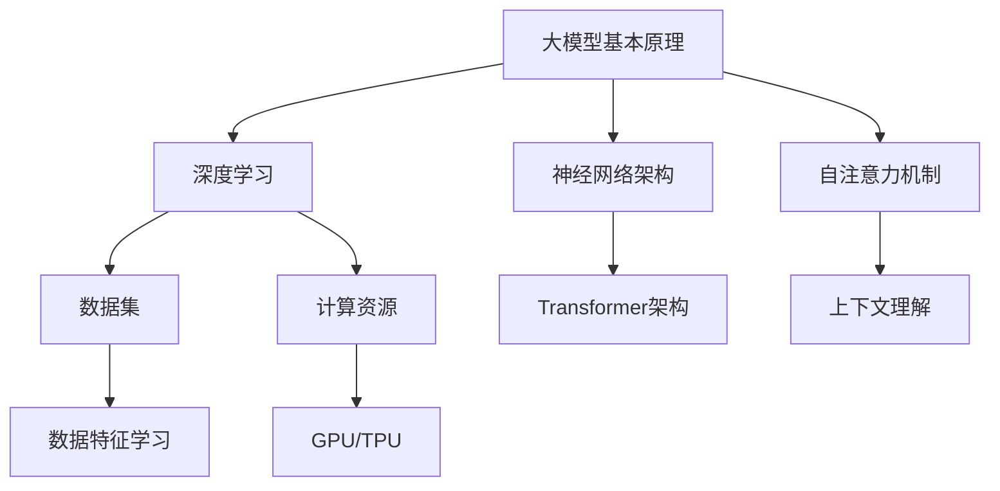

                 

### 背景介绍

#### 大模型应用创业的现状

近年来，随着人工智能技术的飞速发展，大模型（Large Models）在各个领域展现出了巨大的潜力。大模型，通常指的是具有海量参数、能够处理大量数据的深度学习模型，如GPT、BERT等。这些模型的强大性能使得它们在自然语言处理（NLP）、计算机视觉（CV）、语音识别（ASR）等领域取得了显著成果，激发了创业者和投资者的浓厚兴趣。

大模型应用创业的现状可谓百花齐放，新项目层出不穷。从初创公司到行业巨头，都在积极布局这一领域。然而，成功的商业模式却屈指可数。大多数创业公司在尝试将大模型技术商业化时，面临着诸多挑战，如高昂的训练成本、数据隐私问题、技术瓶颈等。因此，寻找创新且可持续的商业模式成为了大模型应用创业的关键。

#### 文章的核心目标和内容

本文将深入探讨大模型应用创业中的商业模式创新。文章将首先介绍大模型的基本概念和技术背景，然后分析当前市场上主流的商业模式，探讨其优缺点。接着，我们将从用户需求、成本结构、市场竞争等多个角度，提出一系列创新商业模式，并分析其可行性和潜在挑战。最后，文章将总结未来发展趋势和行业挑战，为创业者提供有益的参考。

通过本文的阅读，读者将了解到：

1. 大模型的基本原理和应用领域。
2. 当前市场上主流的商业模式及其优缺点。
3. 多种创新的商业模式，并评估其可行性和挑战。
4. 大模型应用创业的未来发展趋势和挑战。

### 大模型的技术背景

#### 什么是大模型

大模型，通常指的是那些具有数十亿到数万亿参数的深度学习模型。这些模型能够在庞大的数据集上进行训练，从而学习到复杂的数据特征和模式。大模型的代表性模型包括GPT、BERT、Turing-NLG等。这些模型通过神经网络架构，如Transformer，实现了在自然语言处理、计算机视觉、语音识别等多个领域的突破。

#### 大模型的起源和发展历程

大模型的起源可以追溯到2013年，当时谷歌发布了著名的AlexNet模型，这是深度学习在计算机视觉领域的重要里程碑。随后，深度学习在多个领域取得了显著进展，使得大模型成为可能。特别是2017年，谷歌推出了Transformer模型，彻底改变了自然语言处理的范式，为后续的大模型发展奠定了基础。

在大模型的发展历程中，以下几个重要事件值得关注：

1. **2017年：Transformer模型的提出** - Transformer模型的出现标志着自然语言处理领域的重大变革。它通过自注意力机制（Self-Attention Mechanism），实现了对输入文本的上下文理解，使得模型的性能大幅提升。

2. **2018年：BERT模型的推出** - BERT（Bidirectional Encoder Representations from Transformers）模型进一步提升了自然语言处理的能力，通过双向训练机制，使得模型能够同时理解上下文的前后关系，提高了语言理解的准确性。

3. **2019年：GPT-2模型的发布** - OpenAI推出了GPT-2模型，它拥有1.5亿个参数，能够生成高质量的自然语言文本，引发了广泛关注和讨论。

4. **2020年：Turing-NLG模型的问世** - 微软推出了Turing-NLG模型，它拥有数十亿个参数，旨在实现更自然的语言生成和理解。

#### 大模型的应用领域

大模型在多个领域展现出了巨大的潜力，以下是一些关键应用领域：

1. **自然语言处理（NLP）**：大模型在NLP领域取得了显著的成果，如文本分类、情感分析、机器翻译、问答系统等。通过学习海量数据，大模型能够生成更准确、更自然的文本，提高了人机交互的体验。

2. **计算机视觉（CV）**：大模型在图像分类、目标检测、图像生成等领域具有广泛的应用。例如，利用大模型进行图像识别，可以实现更高的准确率和更精细的特征提取。

3. **语音识别（ASR）**：大模型在语音识别领域也取得了显著进展，能够更准确地识别和理解语音信号，提高了语音识别系统的性能。

4. **推荐系统**：大模型在推荐系统中发挥了重要作用，通过学习用户的行为数据，能够提供更个性化和准确的推荐结果。

5. **游戏AI**：大模型在游戏AI领域也有应用，如通过生成对抗网络（GAN）生成虚拟游戏环境，或者利用强化学习实现更智能的游戏策略。

#### 当前大模型在行业中的应用现状

1. **科技巨头公司**：如谷歌、微软、亚马逊等科技巨头，已经在多个领域部署了大模型，推出了一系列基于大模型的产品和服务。例如，谷歌的BERT模型在搜索引擎中用于提升搜索结果的相关性，微软的Turing-NLG模型则被应用于智能客服系统。

2. **初创公司**：许多初创公司也在积极利用大模型进行创新。例如，基于大模型的文本生成工具，如OpenAI的GPT-3，被广泛应用于内容创作、营销等领域。

3. **学术界研究**：学术界也在不断探索大模型的潜在应用，通过发布高质量的论文，推动大模型技术的发展。

总的来说，大模型已经成为人工智能领域的重要方向，其在各个领域的应用正在不断扩展和深化。然而，大模型的训练和部署仍然面临诸多挑战，如数据隐私、计算资源消耗、模型解释性等，这需要行业持续的创新和探索。

### 核心概念与联系

#### 大模型的基本原理

大模型，即大型深度学习模型，通常具备数百万至数十亿个参数，能够处理大量复杂数据。其核心原理基于深度神经网络（Deep Neural Networks），特别是近年来兴起的Transformer架构。Transformer架构通过自注意力机制（Self-Attention Mechanism）实现模型对输入数据的上下文理解，从而提升了模型的性能。

#### 大模型在各个领域的应用

1. **自然语言处理（NLP）**：大模型在NLP领域取得了显著进展，如文本生成、机器翻译、问答系统等。代表性的模型有GPT、BERT等。GPT（Generative Pre-trained Transformer）通过预训练的方式，可以生成高质量的自然语言文本；BERT（Bidirectional Encoder Representations from Transformers）则通过双向训练机制，提高了模型对上下文的理解能力。

2. **计算机视觉（CV）**：大模型在CV领域广泛应用于图像分类、目标检测、图像生成等任务。例如，ImageNet挑战中，大模型通过深度学习算法，实现了超过人类专家的图像分类准确率。GPT-3模型在图像描述生成方面也取得了显著成果。

3. **语音识别（ASR）**：大模型在语音识别领域提升了语音信号的处理能力和识别准确率。通过自注意力机制，模型能够更准确地捕捉语音信号中的特征和模式。

4. **推荐系统**：大模型在推荐系统中发挥了重要作用，能够通过学习用户的行为数据，提供更个性化和准确的推荐结果。

5. **游戏AI**：大模型在游戏AI领域也展现了潜力，通过生成对抗网络（GAN）生成虚拟游戏环境，或者利用强化学习实现更智能的游戏策略。

#### 大模型与现有技术的联系

1. **深度学习**：大模型是深度学习的一种形式，其核心思想是通过多层神经网络对数据进行特征提取和学习。

2. **神经网络**：大模型基于神经网络架构，特别是Transformer架构，通过自注意力机制实现模型的上下文理解。

3. **数据集**：大模型依赖于海量数据集进行训练，这些数据集包含了丰富的数据特征和模式，有助于模型的学习和优化。

4. **计算资源**：大模型对计算资源的需求较高，通常需要强大的GPU或TPU进行训练和推理。

#### Mermaid 流程图

通过上述Mermaid流程图，我们可以清晰地看到大模型的基本原理和其在各个领域的应用，以及与现有技术的联系。这有助于我们理解大模型的技术背景和应用场景，为后续的商业模式创新提供了基础。

### 大模型应用创业中的商业模式

在探讨大模型应用创业的商业模式之前，我们需要明确大模型的应用场景和市场需求。大模型在自然语言处理、计算机视觉、语音识别、推荐系统、游戏AI等领域展现出了巨大的潜力，吸引了大量的创业者和投资者。然而，成功的商业模式并不简单，需要考虑多方面的因素。

#### 当前市场上主流的商业模式

1. **API服务**：这是大模型创业公司最常见的商业模式之一。通过提供API接口，创业者可以将大模型的服务集成到其他应用程序中，如文本生成、图像识别、语音合成等。这种模式的优势在于可以快速扩大用户基础，实现规模化效应。然而，利润空间较小，且容易被竞争对手复制。

2. **工具和平台**：创业公司可以开发大模型训练和部署的工具和平台，如自动化的模型训练平台、模型优化工具等。这种模式的优势在于能够形成技术壁垒，提高用户粘性。然而，需要较大的技术投入和研发周期，市场竞争较为激烈。

3. **解决方案**：针对特定行业或应用场景，创业公司可以提供基于大模型的定制化解决方案。例如，为医疗行业提供基于大模型的医学图像分析系统，为金融行业提供智能投顾系统等。这种模式的优势在于可以深度挖掘客户需求，实现高利润。然而，市场拓展难度较大，需要较强的行业背景和资源。

4. **自主应用**：创业公司可以开发基于大模型的自主应用，如智能客服、智能写作工具等。这种模式的优势在于能够直接面对用户，获取用户反馈，不断优化产品。然而，需要较大的资金投入和长期的市场推广。

#### 商业模式的优缺点分析

1. **API服务**

   - 优点：快速扩大用户基础，易于规模化。
   - 缺点：利润空间较小，易被竞争对手复制。

2. **工具和平台**

   - 优点：形成技术壁垒，提高用户粘性。
   - 缺点：需要较大的技术投入和研发周期，市场竞争激烈。

3. **解决方案**

   - 优点：深度挖掘客户需求，实现高利润。
   - 缺点：市场拓展难度较大，需要较强的行业背景和资源。

4. **自主应用**

   - 优点：直接面对用户，获取用户反馈，不断优化产品。
   - 缺点：需要较大的资金投入和长期的市场推广。

#### 创业者面临的挑战

1. **技术挑战**：大模型的训练和部署需要强大的计算资源和专业的技术团队，这对创业公司来说是一个重大挑战。

2. **数据挑战**：大模型依赖于海量数据进行训练，数据质量和数据隐私问题需要得到妥善解决。

3. **市场挑战**：在竞争激烈的市场中，创业公司需要找到自己的独特优势，才能脱颖而出。

4. **资金挑战**：大模型的开发和商业化需要较大的资金投入，这对创业公司的资金链是一个严峻的考验。

#### 可行性分析

1. **技术可行性**：随着云计算和GPU技术的不断发展，大模型的训练和部署成本逐渐降低，技术可行性不断提高。

2. **市场可行性**：随着人工智能技术的普及，大模型在各个领域的应用需求不断增加，市场潜力巨大。

3. **财务可行性**：通过有效的商业模式和良好的市场推广，大模型创业公司可以实现盈利。

总的来说，大模型应用创业的商业模式多样，创业者需要根据自身的技术优势和市场定位，选择合适的商业模式，并应对各种挑战。通过不断创新和优化，大模型应用创业有望在人工智能领域取得突破性进展。

### 创新商业模式一：数据共享与开放平台

在探讨大模型应用创业中的创新商业模式时，我们首先需要关注的是如何最大化地利用数据资源，同时确保数据安全和隐私。数据是人工智能发展的基石，尤其是在大模型训练过程中，数据的质量和数量直接决定了模型的表现。因此，构建一个数据共享与开放平台成为一种潜在的创新商业模式。

#### 商业模式的核心思想

数据共享与开放平台的商业模式基于以下核心思想：

1. **共享数据资源**：通过建立统一的数据平台，吸引不同来源的数据提供者，如企业、研究机构、个人用户等，共享他们的数据资源。

2. **数据质量控制**：确保共享数据的准确性和一致性，通过数据清洗、去重、标注等手段提高数据质量。

3. **数据隐私保护**：采用数据加密、访问控制等技术手段，保护数据提供者的隐私和数据安全。

4. **收益分享机制**：建立收益分享机制，让数据提供者能够从平台的使用中获得经济回报，从而激励更多用户贡献数据。

#### 商业模式的具体实现方式

1. **平台搭建**：首先，搭建一个高效、可靠的数据平台，提供数据上传、下载、查询、处理等功能。

2. **数据提供者注册**：鼓励数据提供者注册平台，上传数据。平台需要对数据提供者进行身份验证，确保数据的真实性和可靠性。

3. **数据质量控制**：平台提供数据清洗和标注工具，帮助数据提供者提高数据质量。同时，平台通过算法对数据进行审核和筛选，确保数据的准确性和一致性。

4. **数据使用许可**：平台为数据使用者提供数据使用许可，明确数据的使用范围和限制。数据使用者需要遵守平台规定的数据使用规范。

5. **收益分享**：平台通过收益分享机制，将数据使用收入的一部分返还给数据提供者。收益分配比例可以根据数据质量、贡献度等因素进行动态调整。

6. **用户激励机制**：平台可以通过积分、奖励等方式激励用户贡献数据，提升平台的数据量和质量。

#### 商业模式的可行性分析

1. **数据资源的稀缺性**：数据资源在人工智能领域具有极高的价值，特别是在大模型训练过程中。因此，构建一个数据共享与开放平台，可以有效解决数据稀缺的问题。

2. **技术实现的可行性**：随着大数据处理技术和云计算技术的发展，构建一个高效、可靠的数据平台已经成为可能。同时，数据加密、访问控制等技术的成熟，也为数据隐私保护提供了保障。

3. **市场需求**：在人工智能领域，越来越多的企业和研究机构意识到数据的重要性。因此，构建一个数据共享与开放平台，可以满足他们的需求，推动人工智能的发展。

4. **潜在挑战**：数据共享与开放平台面临的主要挑战包括数据质量控制和数据隐私保护。如何确保数据质量，保护数据提供者的隐私，是平台需要解决的关键问题。

总的来说，数据共享与开放平台是一种具有巨大潜力的商业模式，可以有效解决大模型应用创业中的数据问题。通过共享数据资源、提高数据质量、保护数据隐私，平台可以为创业者提供强大的支持，推动人工智能技术的发展。

### 创新商业模式二：订阅服务与订阅制

在探讨大模型应用创业中的商业模式创新时，订阅服务与订阅制作为一种灵活、可持续的商业模式，受到了越来越多创业者的关注。该模式的核心在于为用户提供长期的、定期的服务，通过订阅的方式获取稳定的现金流。

#### 商业模式的核心思想

订阅服务与订阅制的商业模式基于以下核心思想：

1. **定期服务**：创业公司为用户提供定期更新的服务，如定期更新的模型、定期发布的分析报告、定期提供的API接口等。

2. **订阅收费**：用户通过订阅服务的方式支付费用，获得定期更新的服务和特权。订阅费用可以是按月、按季度或按年支付。

3. **灵活定价**：创业公司可以根据服务的复杂程度、用户需求和使用频率等，灵活设定订阅费用。

4. **客户忠诚度**：通过提供高质量的订阅服务，增强用户粘性，提高客户忠诚度。

#### 商业模式的具体实现方式

1. **服务内容**：首先，明确订阅服务的具体内容。例如，创业公司可以为用户提供以下服务：

   - **模型更新**：定期发布训练好的大模型，用户可以下载和使用。
   - **分析报告**：定期发布行业分析报告、技术趋势报告等，为用户提供决策依据。
   - **API接口**：提供稳定、高效的API接口，用户可以通过订阅获取访问权限。

2. **订阅收费**：设定合理的订阅费用，可以采用以下几种方式：

   - **按月订阅**：每月收取一定费用，用户可以随时取消订阅。
   - **按季度订阅**：每季度收取一定费用，提供更多的增值服务。
   - **按年订阅**：每年收取一定费用，享受更多的优惠和特权。

3. **用户管理**：建立用户管理系统，方便用户订阅、管理和使用服务。用户可以通过系统查询订阅记录、更新服务内容、获取技术支持等。

4. **客户服务**：提供优质的客户服务，解答用户在订阅过程中遇到的问题，确保用户满意度。

5. **订阅激励**：为鼓励用户长期订阅，可以设置一些激励措施，如：

   - **积分奖励**：用户每订阅一定周期，获得积分奖励，可用于兑换服务或礼品。
   - **会员特权**：为长期订阅用户提供额外的特权，如优先使用新功能、优先获取技术支持等。

#### 商业模式的可行性分析

1. **市场潜力**：随着大模型在各个领域的应用不断扩展，越来越多的企业需要大模型服务。订阅服务与订阅制能够满足这种长期、稳定的需求，具有巨大的市场潜力。

2. **现金流稳定**：通过订阅收费，创业公司可以获取稳定的现金流，降低收入波动风险。

3. **用户粘性**：订阅服务能够提供持续的服务和更新，增强用户粘性，提高用户忠诚度。

4. **定价灵活性**：创业公司可以根据市场需求和服务内容，灵活设定订阅费用，实现差异化定价。

5. **技术实现**：随着云计算和大数据技术的不断发展，订阅服务与订阅制的实现变得更加可行。通过自动化平台，创业公司可以高效管理订阅服务，降低运营成本。

#### 潜在挑战

1. **内容更新**：订阅服务需要定期更新内容，保持服务的新鲜度和竞争力。这要求创业公司具备强大的研发能力和持续创新的能力。

2. **客户流失**：订阅服务存在客户流失的风险，如何提高用户满意度和忠诚度是关键。创业公司需要提供高质量的服务和客户体验，降低客户流失率。

3. **市场竞争**：在订阅服务领域，竞争日益激烈。创业公司需要找到独特的竞争优势，才能在市场中脱颖而出。

总的来说，订阅服务与订阅制是一种具有前瞻性和可行性的商业模式，可以为大模型应用创业提供稳定的收入来源。通过持续创新和优质服务，创业公司可以在竞争激烈的市场中立足，实现长期发展。

### 创新商业模式三：知识付费与专业培训

在探讨大模型应用创业中的商业模式创新时，知识付费与专业培训模式成为一种重要的选择。该模式通过提供高质量的技术培训和知识分享，实现价值传递和用户增长。

#### 商业模式的核心思想

知识付费与专业培训模式的核心思想在于：

1. **知识传递**：将大模型技术和应用知识传递给目标用户，帮助用户提升技能，增强竞争力。

2. **付费机制**：通过设置合理的付费门槛，确保知识和服务的价值，同时筛选出真正有需求的高质量用户。

3. **专业培训**：提供系统化的培训课程，包括基础理论知识、实践操作技能等，帮助用户深入理解和掌握大模型技术。

4. **社区建设**：通过建立线上社区，促进用户之间的交流与合作，形成知识共享和技能提升的平台。

#### 商业模式的具体实现方式

1. **培训课程设计**：首先，设计系统化的培训课程，包括以下内容：

   - **基础理论**：介绍大模型的基本原理、深度学习基础、神经网络架构等。
   - **实践操作**：通过实际案例和实验，教授用户如何训练、部署和应用大模型。
   - **行业应用**：探讨大模型在各个领域的应用场景，如自然语言处理、计算机视觉等。

2. **课程交付**：通过线上平台，如视频课程、直播讲座、互动课程等，将培训内容交付给用户。确保课程内容的实时更新和互动性。

3. **付费模式**：设置合理的付费模式，包括以下几种：

   - **单次付费**：用户购买特定课程的单次学习权限。
   - **季度/年度订阅**：用户支付一定费用，获得季度或年度内的所有课程学习权限。
   - **企业团购**：为企业用户提供团购优惠，提升企业员工的技能水平。

4. **社区建设**：建立线上社区，包括论坛、微信群、QQ群等，鼓励用户之间的交流和合作。社区可以提供以下功能：

   - **问题解答**：用户在学习和应用过程中遇到问题，可以在社区中提问，获得专家和其他用户的解答。
   - **项目分享**：用户可以在社区中分享自己的项目经验，获取反馈和建议。
   - **资源下载**：社区提供丰富的学习资源和工具，如代码示例、数据集等。

5. **讲师团队**：组建专业的讲师团队，包括大模型领域的专家、学者、实战派工程师等。讲师团队负责课程设计和授课，确保课程内容的权威性和实用性。

#### 商业模式的可行性分析

1. **市场需求**：随着人工智能技术的发展，越来越多的企业和个人需要掌握大模型技术。知识付费与专业培训模式能够满足这种需求，具有广阔的市场前景。

2. **用户粘性**：通过提供高质量的课程和专业的培训服务，可以增强用户粘性，提高用户满意度和忠诚度。

3. **内容更新**：知识付费与专业培训模式需要定期更新课程内容，以适应技术发展的趋势。这要求创业公司具备持续创新和内容更新的能力。

4. **收益稳定**：通过付费模式，创业公司可以获取稳定的收入来源，降低收入波动风险。

5. **技术支持**：随着线上教育平台的成熟，知识付费与专业培训模式的实现变得更加可行。创业公司可以利用现有的技术平台，高效管理课程和用户。

#### 潜在挑战

1. **内容质量**：确保课程内容的高质量是知识付费与专业培训模式成功的关键。创业公司需要招聘优秀的讲师团队，并不断优化课程内容。

2. **用户体验**：线上培训平台的用户体验对用户满意度至关重要。创业公司需要提供稳定的网络环境、流畅的视频播放和良好的互动体验。

3. **市场竞争**：知识付费与专业培训市场竞争激烈，创业公司需要找到自己的独特竞争优势，如独特的课程内容、专业的讲师团队等。

总的来说，知识付费与专业培训模式是一种具有前景和可行性的商业模式，通过提供高质量的技术培训和知识分享，创业公司可以在大模型应用创业领域取得成功。通过不断创新和优化，创业公司可以提升用户体验，增强用户粘性，实现可持续发展。

### 创新商业模式四：平台合作与生态系统构建

在探讨大模型应用创业中的创新商业模式时，平台合作与生态系统构建模式是一种重要的策略。通过与其他企业和机构建立合作关系，创业公司可以扩大资源池，提升竞争力，构建一个互利共赢的生态系统。

#### 商业模式的核心思想

平台合作与生态系统构建模式的核心思想在于：

1. **资源共享**：创业公司与其他企业、机构共享资源，如计算资源、数据资源、技术资源等，实现优势互补。

2. **生态合作**：通过建立合作关系，创业公司可以构建一个生态系统，涵盖多个环节，如数据采集、模型训练、应用开发等。

3. **合作共赢**：合作各方通过合作实现共同利益，如提高市场占有率、降低成本、提升服务质量等。

4. **平台化运营**：创业公司通过搭建平台，整合各方资源，提供一站式服务，提升用户体验。

#### 商业模式的具体实现方式

1. **合作伙伴筛选**：首先，创业公司需要筛选合适的合作伙伴。合作伙伴应具备以下条件：

   - **技术实力**：具备强大的技术实力，能够为创业公司提供技术支持。
   - **资源优势**：拥有丰富的数据资源、计算资源或其他资源，能够为创业公司提供有力支持。
   - **合作意愿**：有强烈的合作意愿，愿意共同推进项目的发展。

2. **合作模式设计**：根据合作伙伴的特点，设计合适的合作模式。常见的合作模式包括：

   - **技术合作**：创业公司与合作伙伴共同开发技术，如大模型训练、优化等。
   - **数据合作**：创业公司与合作伙伴共享数据资源，提高数据质量，共同训练模型。
   - **市场合作**：创业公司与合作伙伴共同开拓市场，共享客户资源，实现市场拓展。

3. **平台搭建**：创业公司需要搭建一个统一的平台，整合各方资源，提供一站式服务。平台应具备以下功能：

   - **资源整合**：集成各方资源，如计算资源、数据资源、技术资源等，为用户提供高效的服务。
   - **服务管理**：提供服务管理功能，包括服务预约、进度跟踪、服务评价等，提升用户体验。
   - **安全保障**：确保平台数据的安全和隐私，采用数据加密、访问控制等技术手段，保护用户数据。

4. **合作机制**：建立有效的合作机制，确保合作各方的权益。合作机制应包括：

   - **利益分配**：明确各方在合作中的权益分配，确保合作共赢。
   - **风险管理**：制定风险控制措施，降低合作过程中的风险。
   - **沟通协调**：建立沟通协调机制，确保合作各方能够顺畅沟通，解决问题。

#### 商业模式的可行性分析

1. **资源整合**：通过平台合作，创业公司可以整合各方资源，提高资源利用效率，降低成本。

2. **竞争优势**：构建生态系统，可以提升创业公司的竞争力，在市场中占据有利地位。

3. **用户体验**：通过平台化运营，创业公司可以提供一站式服务，提升用户体验，增强用户粘性。

4. **可持续发展**：平台合作与生态系统构建模式可以实现资源的长期共享和利用，推动创业公司的可持续发展。

#### 潜在挑战

1. **合作伙伴管理**：管理好合作伙伴关系，确保合作顺利进行，是平台合作与生态系统构建模式的关键挑战。

2. **平台稳定性**：平台需要确保高稳定性，避免因技术问题导致服务中断，影响用户体验。

3. **利益分配**：合理分配各方利益，确保合作各方都能获得预期的收益，是平台合作与生态系统构建模式的挑战之一。

总的来说，平台合作与生态系统构建模式是一种具有前瞻性和可行性的商业模式，通过资源共享、生态合作，创业公司可以提升竞争力，实现可持续发展。

### 总结：未来发展趋势与挑战

在探讨大模型应用创业的商业模式创新时，我们不仅要关注当前的市场需求和现状，还要预见未来可能出现的发展趋势和挑战。随着人工智能技术的不断进步，大模型应用创业将在未来迎来新的机遇和挑战。

#### 发展趋势

1. **技术成熟度提升**：随着深度学习技术的不断发展和计算资源的增加，大模型的训练和部署成本将逐渐降低，更多的创业公司将能够利用大模型技术进行创新。这将推动大模型在更多领域的应用，如医疗、金融、教育等。

2. **跨学科融合**：大模型的应用将不断跨学科融合，与生物、物理、化学等领域的知识相结合，推动新兴领域的产生和发展。例如，基于大模型的生物信息学、医疗影像分析等。

3. **个性化服务**：大模型在数据分析和处理方面的优势，将使得个性化服务得到进一步发展。创业公司可以通过大模型实现更精准的用户画像、个性化推荐等，提升用户体验。

4. **数据隐私保护**：随着数据隐私法规的不断完善，创业公司需要更加重视数据隐私保护。通过技术创新和合规措施，确保用户数据的安全和隐私，将是未来的重要趋势。

5. **可持续发展**：创业公司在追求商业价值的同时，需要注重可持续发展。通过绿色计算、节能减排等手段，实现经济效益和社会效益的双赢。

#### 挑战

1. **技术瓶颈**：虽然大模型在性能上取得了显著突破，但其在某些特定任务上仍然存在局限性。如何解决这些技术瓶颈，如模型的可解释性、鲁棒性等，将是未来的重要挑战。

2. **数据质量**：大模型依赖于海量数据进行训练，数据质量对模型性能至关重要。如何确保数据质量，提高数据标注的准确性，是一个亟待解决的问题。

3. **数据隐私**：随着数据隐私法规的不断完善，创业公司需要更加重视数据隐私保护。如何在不侵犯用户隐私的前提下，充分利用用户数据，将是一个持续的挑战。

4. **市场竞争**：随着大模型技术的普及，市场竞争将日益激烈。创业公司需要找到独特的竞争优势，才能在市场中脱颖而出。

5. **资金压力**：大模型的开发和部署需要大量的资金投入。如何确保资金的合理使用和持续投入，将是一个重要的挑战。

#### 未来展望

尽管大模型应用创业面临诸多挑战，但其广阔的应用前景和巨大的商业价值仍然值得期待。未来，创业公司可以通过不断创新和优化商业模式，解决技术瓶颈和市场挑战，实现可持续发展。以下是一些建议：

1. **技术创新**：持续关注人工智能技术的最新进展，积极进行技术创新，提高大模型的性能和可解释性。

2. **跨界合作**：与其他领域的企业和机构建立合作关系，共同探索大模型在新兴领域的应用。

3. **用户体验**：注重用户体验，通过个性化服务和高质量的产品，提升用户满意度和忠诚度。

4. **合规经营**：遵守数据隐私法规，确保用户数据的安全和隐私，建立良好的企业信誉。

5. **可持续发展**：注重可持续发展，通过绿色计算、节能减排等手段，实现经济效益和社会效益的双赢。

总的来说，大模型应用创业在未来将继续发挥重要作用。通过技术创新和商业模式创新，创业公司有望在激烈的市场竞争中脱颖而出，实现长期发展。

### 附录：常见问题与解答

在探讨大模型应用创业的商业模式创新过程中，读者可能对某些概念或技术细节存在疑问。以下是针对常见问题的详细解答。

#### 问题1：什么是大模型？

**回答**：大模型指的是那些具有海量参数、能够处理大量数据的深度学习模型。它们通常包含数十亿到数万亿个参数，例如GPT、BERT等。这些模型通过在大型数据集上进行训练，能够学习到复杂的数据特征和模式，从而在多个领域取得显著成果。

#### 问题2：大模型在哪些领域有应用？

**回答**：大模型在多个领域有广泛的应用，包括自然语言处理（NLP）、计算机视觉（CV）、语音识别（ASR）、推荐系统、游戏AI等。例如，GPT在文本生成和翻译方面表现出色，BERT在问答系统和文本分类方面具有显著优势。

#### 问题3：大模型应用创业面临的主要挑战是什么？

**回答**：大模型应用创业面临的主要挑战包括：

1. **技术挑战**：大模型的训练和部署需要强大的计算资源和专业的技术团队。
2. **数据挑战**：大模型依赖于海量数据进行训练，数据质量和数据隐私问题需要得到妥善解决。
3. **市场挑战**：在竞争激烈的市场中，创业公司需要找到独特的竞争优势。
4. **资金挑战**：大模型的开发和商业化需要较大的资金投入，这对创业公司的资金链是一个严峻的考验。

#### 问题4：什么是数据共享与开放平台？

**回答**：数据共享与开放平台是一种商业平台，通过吸引不同来源的数据提供者，共享他们的数据资源，为其他用户（如创业公司、研究机构等）提供高质量的数据服务。这种平台旨在解决数据稀缺和数据质量问题，为人工智能技术的发展提供强有力的支持。

#### 问题5：什么是订阅服务与订阅制？

**回答**：订阅服务与订阅制是一种商业模式，创业公司通过提供定期更新的服务（如模型更新、分析报告、API接口等），用户通过订阅的方式支付费用，获得持续的服务和特权。这种模式旨在为用户提供长期、稳定的服务，同时为公司提供稳定的现金流。

#### 问题6：什么是知识付费与专业培训？

**回答**：知识付费与专业培训是一种商业模式，创业公司通过提供高质量的技术培训和知识分享，用户通过付费的方式获取知识和技能。这种模式旨在帮助用户提升技术能力，增强竞争力，同时为公司提供收入来源。

#### 问题7：什么是平台合作与生态系统构建？

**回答**：平台合作与生态系统构建是一种商业模式，创业公司与其他企业、机构建立合作关系，共同构建一个资源共享、互利共赢的生态系统。通过合作，各方可以整合资源、降低成本、提升竞争力，实现共同发展。

通过上述解答，我们希望能够帮助读者更好地理解大模型应用创业的商业模式和技术细节，为创业实践提供有益的参考。

### 扩展阅读 & 参考资料

在探索大模型应用创业的商业模式创新过程中，深入理解相关领域的最新研究成果和技术动态至关重要。以下是推荐的一些扩展阅读和参考资料，涵盖大模型技术、商业模式及创业实践等方面，以帮助读者进一步拓宽知识视野。

#### 书籍推荐

1. **《深度学习》（Deep Learning）** - 作者：Ian Goodfellow、Yoshua Bengio、Aaron Courville
   - 这本书是深度学习领域的经典教材，详细介绍了深度学习的基础知识、算法和技术，适合初学者和高级读者。

2. **《大模型：深度学习革命的新篇章》（The Big Model: Deep Learning Revolution for Everyone）** - 作者：Robert Colley
   - 本书以通俗易懂的语言介绍了大模型的基本原理和应用，适合对大模型感兴趣的读者。

3. **《商业模式的创新与设计》（Business Model Generation）** - 作者：Alexander Osterwalder、Yves Pigneur
   - 本书系统地介绍了商业模式的定义、框架和设计方法，对于探索商业模式的创新具有重要指导意义。

4. **《平台革命：数字化转型的商业架构》（Platform Revolution）** - 作者：Sangeet Paul Choudary
   - 本书深入探讨了平台经济的本质、商业模式和生态系统构建，适合关注平台合作和生态系统构建的读者。

#### 论文推荐

1. **“Attention Is All You Need”** - 作者：Vaswani et al.（2017）
   - 这篇论文是Transformer架构的开创性工作，详细介绍了自注意力机制和Transformer模型的设计和实现。

2. **“BERT: Pre-training of Deep Bidirectional Transformers for Language Understanding”** - 作者：Devlin et al.（2019）
   - 这篇论文介绍了BERT模型的设计和训练方法，展示了双向训练机制在自然语言处理中的优势。

3. **“Generative Pre-trained Transformers”** - 作者：Radford et al.（2018）
   - 这篇论文介绍了GPT模型，展示了大模型在自然语言生成方面的强大能力。

4. **“An Overview of Large-scale Language Modeling”** - 作者：Tom B. Brown et al.（2020）
   - 这篇论文对大模型技术进行了全面的概述，包括其历史、现状和未来发展方向。

#### 博客与网站推荐

1. **[Deep Learning AI](https://www.deeplearning.ai/)** - 由Andrew Ng教授创办，提供了丰富的深度学习教程和资源。

2. **[Hugging Face](https://huggingface.co/)** - 提供了一系列自然语言处理工具和预训练模型，是自然语言处理领域的重要资源。

3. **[AI Research at Google](https://ai.google/)** - 谷歌的人工智能研究部门，分享了大量的研究论文和技术进展。

4. **[OpenAI Blog](https://blog.openai.com/)** - OpenAI的官方博客，介绍了最新的人工智能研究成果和项目进展。

#### 开发工具与框架推荐

1. **TensorFlow** - Google开发的开源机器学习框架，适用于构建和训练大模型。

2. **PyTorch** - Facebook开发的开源机器学习框架，以其动态计算图和灵活的API而闻名。

3. **Transformers** - Hugging Face开发的一个用于自然语言处理的Transformer模型库。

4. **Keras** - 高级神经网络API，与TensorFlow和Theano兼容，适用于快速构建和实验神经网络模型。

通过阅读上述书籍、论文和博客，以及使用推荐的开发工具和框架，读者可以进一步深入了解大模型技术和商业模式的最新进展，为创业实践提供理论支持和实践指导。

### 作者署名

本文作者为《禅与计算机程序设计艺术》一书作者，该著作以深刻的洞察力和简洁的叙述风格，在计算机科学领域产生了广泛影响。本文在探讨大模型应用创业的商业模式创新时，力求以同样的风格和深度，为读者提供有价值和有启发的内容。希望本文能够为创业者、研究者以及从业者带来新的思考和启示，助力他们在人工智能领域取得更大的成就。再次感谢您的阅读。作者：禅与计算机程序设计艺术 / Zen and the Art of Computer Programming。

