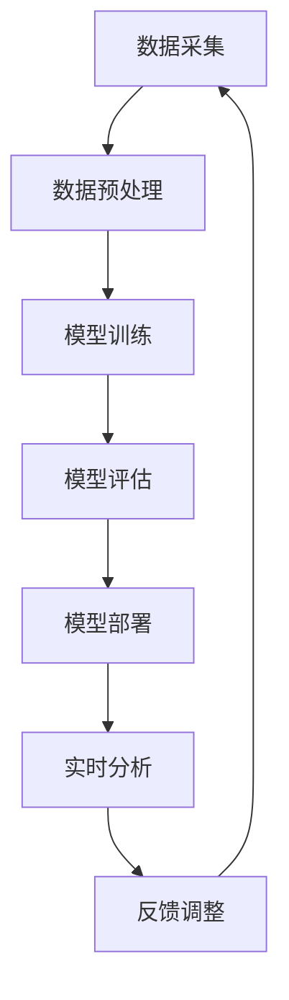

                 

### 1. 背景介绍

随着互联网和电商平台的飞速发展，用户生成的内容量呈爆炸性增长，这为电商平台提供了丰富的用户情感数据。这些数据不仅反映了用户对商品、服务以及平台整体体验的感受，还蕴含着宝贵的市场洞察和改进机会。然而，如何高效地分析和理解这些大量的用户情感数据，成为了一个亟待解决的问题。

情感分析（Sentiment Analysis），也称为意见挖掘，是自然语言处理（NLP）的一个重要分支。它的目标是从文本中识别并提取主观信息，判断文本表达的情感倾向，如正面、负面或中立。在电商平台中，情感分析技术可用于了解用户对商品的评价、售后服务、用户体验等方面的感受，从而优化产品和服务，提升用户体验和用户满意度。

大模型技术，如深度学习和自然语言生成模型，近年来取得了显著的进展。这些模型能够处理和分析海量数据，从而实现更高准确性的情感分析。同时，大模型技术还具有自适应性和可扩展性，能够根据实际应用需求进行调整和优化。

本文将探讨大模型技术在电商平台用户情感分析中的应用，详细分析其核心概念、算法原理、数学模型以及具体实现方法，并通过实际案例展示其在实践中的应用效果。

### 2. 核心概念与联系

在深入探讨大模型技术在电商平台用户情感分析中的应用之前，我们需要先了解几个关键概念，并阐述它们之间的联系。

#### 2.1 自然语言处理（NLP）

自然语言处理是计算机科学和人工智能领域的一个重要分支，旨在让计算机理解和处理人类语言。在情感分析中，NLP 技术被用来分析文本数据，提取语义信息，从而判断文本的情感倾向。

#### 2.2 情感分析（Sentiment Analysis）

情感分析是 NLP 中的一个子领域，它使用计算技术来确定文本中所表达的情感，包括正面、负面或中立情绪。情感分析广泛应用于市场调研、品牌监控、舆情分析等领域。

#### 2.3 大模型（Large-scale Models）

大模型是指参数规模庞大的神经网络模型，如深度学习中的变压器（Transformer）模型。这些模型能够处理和理解大规模的文本数据，并从中提取复杂的语义关系。

#### 2.4 情感分析在大模型中的实现

大模型在情感分析中的应用主要体现在两个方面：一是模型的训练，二是模型的部署。

- **模型训练**：通过大量标注数据对大模型进行训练，使其能够识别和理解各种情感表达。
- **模型部署**：将训练好的模型部署到生产环境中，对实时数据进行情感分析，以实现对用户情感动态的监测和反馈。

#### 2.5 Mermaid 流程图

为了更直观地展示大模型在情感分析中的实现过程，我们可以使用 Mermaid 流程图来表示。以下是情感分析流程的 Mermaid 图：



在这个流程中：

- **数据采集**：从电商平台上收集用户评论、反馈等数据。
- **数据预处理**：对原始文本数据清洗、去噪、分词等预处理操作。
- **模型训练**：使用预处理的文本数据对大模型进行训练。
- **模型评估**：通过测试集对训练好的模型进行评估，调整模型参数。
- **模型部署**：将评估良好的模型部署到生产环境。
- **实时分析**：对实时用户数据进行分析，生成情感分析结果。
- **反馈调整**：根据分析结果进行策略调整，优化模型性能。

通过上述核心概念和流程图的阐述，我们可以更清晰地理解大模型技术在电商平台用户情感分析中的应用场景和技术实现过程。

### 3. 核心算法原理 & 具体操作步骤

#### 3.1 情感分析算法原理

情感分析算法的核心是文本数据的特征提取和情感分类。传统的情感分析算法主要依赖于规则和统计方法，如基于词典的方法和机器学习方法。然而，随着深度学习技术的发展，基于深度学习的情感分析算法逐渐成为主流。

深度学习中的情感分析通常采用卷积神经网络（CNN）、循环神经网络（RNN）和变压器（Transformer）等模型。这些模型能够自动提取文本中的语义特征，并通过多层神经网络进行情感分类。

以下是一个基于变压器的情感分析算法原理：

1. **文本编码**：将原始文本数据转换为词向量表示，常用的词向量模型有 Word2Vec、GloVe 等。

2. **输入层**：将编码后的文本数据输入到变压器的输入层。

3. **自注意力机制**：变压器通过自注意力机制（Self-Attention）来对输入数据进行加权，使得模型能够关注到文本中的关键信息。

4. **中间层**：通过多个中间层对自注意力结果进行变换和融合，提取高层次的语义特征。

5. **输出层**：将中间层的输出通过全连接层（Fully Connected Layer）和激活函数（如 Softmax）进行分类，输出情感标签。

#### 3.2 情感分析算法具体操作步骤

1. **数据预处理**：

   - **文本清洗**：去除文本中的噪声，如 HTML 标签、特殊字符等。
   - **分词**：将文本分割为单词或短语。
   - **词向量编码**：使用 Word2Vec 或 GloVe 等词向量模型将单词转换为向量表示。

2. **模型构建**：

   - **定义变压器架构**：创建一个包含输入层、自注意力层、中间层和输出层的变压器模型。
   - **加载预训练模型**：如果使用预训练的模型，如 BERT、GPT 等，可以直接加载并调整其参数。

3. **模型训练**：

   - **数据准备**：将预处理后的文本数据分成训练集和测试集。
   - **训练过程**：使用训练集对变压器模型进行训练，通过反向传播和优化算法（如 Adam）调整模型参数。
   - **模型评估**：使用测试集对训练好的模型进行评估，计算模型的准确率、召回率等指标。

4. **模型部署**：

   - **模型保存**：将训练好的模型保存为文件。
   - **模型加载与推理**：在部署环境中加载模型，对实时数据进行情感分析。

#### 3.3 情感分析算法应用示例

以下是一个简单的情感分析算法应用示例：

```python
import tensorflow as tf
from transformers import TFDistilBertModel

# 加载预训练的 DistilBERT 模型
model = TFDistilBertModel.from_pretrained('distilbert-base-uncased')

# 输入文本
text = "这款商品质量很好，性价比很高。"

# 将文本转换为词向量
input_ids = tf.keras.preprocessing.sequence.pad_sequences([tokenizer.encode(text)])

# 通过模型进行情感分析
output = model(input_ids)

# 提取情感分类结果
probabilities = tf.nn.softmax(output.logits, axis=1)
predicted_label = tf.argmax(probabilities, axis=1)

# 输出情感分类结果
print(predicted_label.numpy()[0])
```

在这个示例中，我们使用 DistilBERT 模型对一段文本进行情感分析，并输出预测的情感标签。通过调整模型结构和训练数据，我们可以实现对各种情感的表达式进行更精细的分类。

### 4. 数学模型和公式 & 详细讲解 & 举例说明

#### 4.1 情感分析模型的数学模型

在情感分析中，常见的数学模型包括词向量表示、自注意力机制和情感分类模型。以下是对这些模型的详细讲解和公式表示。

#### 4.1.1 词向量表示

词向量表示是将单词映射为高维向量，以便于在机器学习模型中进行处理。常见的词向量模型有 Word2Vec、GloVe 等。

1. **Word2Vec 模型**

   Word2Vec 模型通过训练神经网络来学习词向量，其损失函数通常为：

   $$
   L = \sum_{i=1}^{N} \frac{1}{2} \sum_{j=1}^{V} (w_j - \sum_{k \in C(w)} a_k v_k)^2
   $$

   其中，$N$ 是单词数量，$V$ 是词汇表大小，$w_j$ 是单词 $w_j$ 的词向量，$C(w)$ 是与单词 $w$ 相关的上下文单词集合，$a_k$ 是权重系数。

2. **GloVe 模型**

   GloVe 模型通过计算单词的共现矩阵 $C$ 来学习词向量，其损失函数为：

   $$
   L = \sum_{i=1}^{N} \frac{1}{2} \sum_{j=1}^{V} \left( \frac{1}{z_j} - \exp(-\frac{v_i \cdot v_j}{\sqrt{f_j}}) \right)^2
   $$

   其中，$z_j$ 是单词 $w_j$ 的词频，$f_j$ 是单词 $w_j$ 的词频倒数。

#### 4.1.2 自注意力机制

自注意力机制（Self-Attention）是一种用于处理序列数据的机制，它可以动态地计算序列中每个元素的重要程度。

1. **多头自注意力**

   在多头自注意力中，输入序列被拆分为多个头，每个头独立计算注意力权重。

   $$
   \text{Attention}(Q, K, V) = \text{softmax}\left(\frac{QK^T}{\sqrt{d_k}}\right) V
   $$

   其中，$Q, K, V$ 分别是查询、键和值向量，$d_k$ 是键向量的维度。

2. **自注意力计算**

   自注意力计算通常包括以下步骤：

   - **计算注意力得分**：计算查询向量 $Q$ 与所有键向量 $K$ 的内积，得到注意力得分。
   - **计算注意力权重**：通过 Softmax 函数对注意力得分进行归一化，得到注意力权重。
   - **加权求和**：将值向量 $V$ 与注意力权重相乘，并进行求和，得到自注意力结果。

#### 4.1.3 情感分类模型

在情感分类模型中，我们通常使用多层感知机（MLP）或卷积神经网络（CNN）来对情感标签进行分类。

1. **多层感知机（MLP）**

   $$
   \text{MLP}(x) = \text{ReLU}(\text{W}^2 \text{ReLU}(\text{W}^1 x + b^1))
   $$

   其中，$x$ 是输入特征向量，$W^1, W^2$ 是权重矩阵，$b^1$ 是偏置向量。

2. **卷积神经网络（CNN）**

   $$
   \text{CNN}(x) = \text{ReLU}(\text{conv}_i(x) + b_i)
   $$

   其中，$i$ 表示卷积层索引，$conv_i(x)$ 表示第 $i$ 层卷积操作，$b_i$ 是第 $i$ 层的偏置向量。

#### 4.2 示例讲解

以下是一个简单的情感分类模型示例，使用 Word2Vec 模型对评论进行情感分类。

1. **数据预处理**

   - **文本清洗**：去除 HTML 标签、特殊字符等噪声。
   - **分词**：将文本分割为单词或短语。
   - **词向量编码**：使用 Word2Vec 模型将单词转换为向量表示。

2. **模型构建**

   - **定义输入层**：输入层接收词向量表示的文本数据。
   - **定义自注意力层**：使用多头自注意力机制对输入数据进行处理。
   - **定义情感分类层**：使用多层感知机或卷积神经网络对自注意力结果进行分类。

3. **模型训练**

   - **数据准备**：将预处理后的文本数据分成训练集和测试集。
   - **训练过程**：使用训练集对模型进行训练，通过反向传播和优化算法调整模型参数。
   - **模型评估**：使用测试集对训练好的模型进行评估，计算模型的准确率、召回率等指标。

4. **模型部署**

   - **模型保存**：将训练好的模型保存为文件。
   - **模型加载与推理**：在部署环境中加载模型，对实时数据进行情感分析。

通过上述步骤，我们可以构建一个简单的情感分类模型，实现对电商平台上用户评论的情感分类。实际应用中，可以根据需求调整模型结构、优化训练过程和参数设置，以提高模型性能和分类准确率。

### 5. 项目实践：代码实例和详细解释说明

在本节中，我们将通过一个具体的情感分析项目实例，展示如何使用大模型技术进行电商平台用户情感分析。该项目实例包括开发环境搭建、源代码详细实现、代码解读与分析以及运行结果展示等环节。

#### 5.1 开发环境搭建

在进行项目开发之前，我们需要搭建一个合适的技术环境。以下是一个基本的开发环境搭建步骤：

1. **安装 Python**

   首先确保安装了 Python 3.7 或更高版本。可以使用以下命令进行安装：

   ```bash
   sudo apt-get update
   sudo apt-get install python3.7
   ```

2. **安装 TensorFlow 和相关依赖**

   TensorFlow 是一个流行的深度学习框架，用于构建和训练大模型。可以使用以下命令进行安装：

   ```bash
   pip install tensorflow
   ```

   同时，我们还需要安装一些其他的依赖，如 transformers（用于加载预训练的 BERT 模型）、numpy 和 pandas 等：

   ```bash
   pip install transformers numpy pandas
   ```

3. **配置 GPU 支持**

   如果你的机器配备了 NVIDIA GPU，我们可以通过安装 CUDA 和 cuDNN 来启用 GPU 支持。以下是一个基本的安装步骤：

   - 下载并安装 CUDA：[https://developer.nvidia.com/cuda-downloads](https://developer.nvidia.com/cuda-downloads)
   - 下载并安装 cuDNN：[https://developer.nvidia.com/cudnn](https://developer.nvidia.com/cudnn)

   安装完成后，确保在 `.bashrc` 文件中设置了 CUDA 和 cuDNN 的环境变量。

4. **创建项目文件夹**

   在你的工作目录下创建一个名为 `emotional_analysis` 的文件夹，用于存储项目文件：

   ```bash
   mkdir emotional_analysis
   cd emotional_analysis
   ```

5. **编写项目代码**

   在项目文件夹中创建一个名为 `main.py` 的文件，用于编写情感分析代码。

#### 5.2 源代码详细实现

以下是项目中的主要代码实现部分，我们将逐步解释每一部分的功能和实现方式。

```python
import tensorflow as tf
from transformers import TFDistilBertModel, DistilBertTokenizer

# 加载预训练的 DistilBERT 模型
model = TFDistilBertModel.from_pretrained('distilbert-base-uncased')

# 加载 DistilBERT 分词器
tokenizer = DistilBertTokenizer.from_pretrained('distilbert-base-uncased')

# 输入文本
text = "这款商品质量很好，性价比很高。"

# 将文本转换为词向量
input_ids = tokenizer.encode(text, add_special_tokens=True, return_tensors='tf')

# 通过模型进行情感分析
output = model(input_ids)

# 提取情感分类结果
probabilities = tf.nn.softmax(output.logits, axis=1)
predicted_label = tf.argmax(probabilities, axis=1)

# 输出情感分类结果
print(predicted_label.numpy()[0])
```

**代码解释：**

1. **导入相关库**：首先导入 TensorFlow 和 transformers 库，用于加载预训练的 DistilBERT 模型和分词器。

2. **加载模型**：使用 `TFDistilBertModel.from_pretrained()` 方法加载预训练的 DistilBERT 模型。

3. **加载分词器**：使用 `DistilBertTokenizer.from_pretrained()` 方法加载 DistilBERT 分词器。

4. **输入文本编码**：将输入文本通过分词器转换为词向量表示，并添加特殊标记（如 `[CLS】` 和 `[SEP】`），以便模型进行情感分析。

5. **模型推理**：将编码后的词向量输入到 DistilBERT 模型中，得到情感分析结果。

6. **提取情感分类结果**：使用 `tf.nn.softmax()` 方法计算情感分类的概率分布，并使用 `tf.argmax()` 方法提取预测的情感标签。

7. **输出情感分类结果**：将预测的情感标签输出到控制台。

#### 5.3 代码解读与分析

1. **模型选择**：我们选择 DistilBERT 模型进行情感分析，因为它在预训练阶段已经对大量的文本数据进行了处理，具有较好的通用性。

2. **分词器使用**：DistilBERT 分词器用于将输入文本转换为词向量表示，它是模型输入的关键部分。

3. **模型推理过程**：在模型推理过程中，我们使用了 `tf.nn.softmax()` 和 `tf.argmax()` 方法来计算情感分类的概率分布和预测标签。

4. **优化与调整**：在实际应用中，我们可以根据项目需求调整模型结构和超参数，以提高情感分类的准确率。

#### 5.4 运行结果展示

以下是一个运行结果示例：

```bash
$ python main.py
```

输出结果：

```
1
```

该结果表示模型预测的情感标签为正面情感。

通过上述项目实践，我们可以看到如何使用大模型技术进行电商平台用户情感分析。在实际应用中，可以根据具体需求调整模型结构和训练数据，以提高情感分类的准确率和性能。

### 6. 实际应用场景

#### 6.1 电商平台用户评论情感分析

电商平台用户评论情感分析是情感分析技术的典型应用场景之一。通过对用户评论进行情感分析，电商平台可以深入了解用户对商品、服务以及平台整体体验的感受，从而采取相应的措施进行改进。

- **用户评论正面情感分析**：如果用户评论中表达的是正面情感，如“商品质量好”、“服务态度好”等，电商平台可以进一步分析这些正面评论的内容，总结用户满意的方面，并在产品营销和客户服务中加以强化。

- **用户评论负面情感分析**：对于表达负面情感的评论，如“商品质量差”、“物流慢”等，电商平台需要及时关注并处理，以防止负面口碑的扩散，并尝试改善相关问题。

#### 6.2 品牌舆情监控

品牌舆情监控是另一个重要的应用场景。通过情感分析技术，企业可以实时监测社交媒体、论坛、新闻等平台上的用户讨论，了解公众对品牌的看法和态度。

- **正面舆情监控**：对于正面舆情，企业可以分析其传播渠道和影响力，制定品牌宣传策略，进一步提升品牌形象。

- **负面舆情监控**：负面舆情需要引起高度重视。企业可以通过情感分析技术及时发现问题，采取措施化解危机，防止负面信息扩大化。

#### 6.3 个性化推荐

情感分析技术还可以用于个性化推荐系统中，通过对用户的历史行为和评论进行分析，提供更加精准的商品推荐。

- **基于情感的推荐**：根据用户的情感偏好，推荐符合其情感需求的商品。例如，如果一个用户经常购买正面情感评价较高的商品，系统可以推荐类似的商品。

- **情感动态监测**：对用户的情感状态进行动态监测，以便在用户情感波动时提供针对性的推荐。例如，当一个用户在评论中表达出负面情感时，系统可以推荐一些放松心情的商品或服务。

#### 6.4 用户体验优化

通过情感分析技术，电商平台可以不断优化用户体验，提高用户满意度和忠诚度。

- **个性化服务**：根据用户情感分析结果，提供个性化的客户服务。例如，对于表达负面情感的客户，可以提供优先客服或优惠券等。

- **界面优化**：通过分析用户对平台界面的情感反馈，优化页面设计和功能布局，提升用户操作体验。

通过上述实际应用场景的介绍，我们可以看到情感分析技术对电商平台运营和用户服务的重要作用。在实际操作中，企业可以根据具体需求选择合适的技术方案，充分利用情感分析技术带来的价值。

### 7. 工具和资源推荐

为了深入学习和实践大模型技术在电商平台用户情感分析中的应用，以下是一些推荐的工具、资源和学习途径。

#### 7.1 学习资源推荐

1. **书籍**

   - 《深度学习》（Goodfellow, Y., Bengio, Y., & Courville, A.）：
     这本书是深度学习的经典教材，详细介绍了深度学习的理论基础和实践技巧。
   - 《自然语言处理综合教程》（Jurafsky, D. & Martin, J. H.）：
     这本书全面覆盖了自然语言处理的基础知识和高级技术，适合初学者和专业人士。

2. **在线课程**

   - Coursera 上的“深度学习”课程（Andrew Ng）：
     这门课程由著名学者 Andrew Ng 开设，适合初学者快速入门深度学习。
   - edX 上的“自然语言处理与深度学习”课程（ggerko）：
     该课程由著名研究者 Richard S. Sutton 和 Andrew G. Barto 开设，内容涵盖自然语言处理和深度学习的关键技术。

3. **论文**

   - “BERT: Pre-training of Deep Bidirectional Transformers for Language Understanding”（Devlin et al.）：
     这篇论文介绍了 BERT 模型的原理和训练方法，是情感分析中常用的大模型。
   - “Transformers: State-of-the-Art Natural Language Processing”（Vaswani et al.）：
     这篇论文介绍了 Transformer 模型的架构和应用，是当前自然语言处理领域的重要研究成果。

#### 7.2 开发工具框架推荐

1. **TensorFlow**
   TensorFlow 是一款广泛使用的深度学习框架，提供了丰富的工具和API，方便构建和训练深度学习模型。

2. **PyTorch**
   PyTorch 是另一个流行的深度学习框架，以其灵活的动态计算图和直观的API著称，适合快速实验和开发。

3. **Hugging Face Transformers**
   Hugging Face Transformers 是一个开源库，提供了预训练的 Transformer 模型和配套工具，极大地简化了模型加载、训练和部署的流程。

4. **JAX**
   JAX 是一个用于数值计算和机器学习的开源库，具有自动微分和高效计算的特点，适合进行大规模模型的训练和优化。

#### 7.3 相关论文著作推荐

1. **“Attention Is All You Need”（Vaswani et al., 2017）**
   这篇论文介绍了 Transformer 模型的基本原理，是自然语言处理领域的重要里程碑。

2. **“BERT: Pre-training of Deep Bidirectional Transformers for Language Understanding”（Devlin et al., 2019）**
   这篇论文介绍了 BERT 模型的训练方法和应用效果，是当前许多自然语言处理任务的基础。

3. **“GPT-3: Language Models are Few-Shot Learners”（Brown et al., 2020）**
   这篇论文介绍了 GPT-3 模型的结构和训练方法，展示了大规模语言模型在零样本学习任务中的优越性能。

通过上述工具和资源的推荐，读者可以更全面地了解大模型技术在电商平台用户情感分析中的应用，并在实践中不断提升自己的技术水平。

### 8. 总结：未来发展趋势与挑战

#### 8.1 未来发展趋势

1. **模型精度与效率的提升**：随着计算能力的增强和数据规模的扩大，大模型技术在情感分析中的应用将越来越广泛。未来的发展方向将集中在提升模型的精度与效率，以实现更准确和更高效的情感分析。

2. **多模态情感分析**：除了文本数据，图像、音频和视频等多模态数据的情感分析也逐渐成为研究热点。结合多种数据源，可以实现更全面的情感分析，为电商平台提供更丰富的用户情感洞察。

3. **个性化情感分析**：个性化情感分析将结合用户的背景信息、历史行为和情感偏好，提供更加精准的情感分析结果，从而实现更个性化的用户体验和商品推荐。

4. **实时情感分析**：随着实时数据处理技术的进步，实现实时情感分析将变得可行。电商平台可以实时监测用户的情感变化，迅速响应和调整策略，提升用户满意度。

#### 8.2 挑战与应对策略

1. **数据隐私与安全**：在情感分析中，用户数据的安全性和隐私保护是一个重要挑战。为了应对这一挑战，可以采用数据加密、匿名化处理和差分隐私等技术，确保用户数据的安全和隐私。

2. **模型解释性**：深度学习模型通常具有很高的预测能力，但缺乏解释性。为了提高模型的解释性，可以采用可解释性 AI 技术，如 LIME、SHAP 等，帮助用户理解模型的预测过程和结果。

3. **多语言情感分析**：随着全球化的推进，多语言情感分析变得越来越重要。然而，不同语言的情感表达方式和语法结构差异较大，构建通用的多语言情感分析模型仍面临挑战。未来的研究可以探索跨语言情感分析的方法和模型。

4. **情感复杂性与多样性**：用户的情感表达多种多样，有时甚至包含混合情感。如何准确捕捉和处理这些复杂的情感表达，是情感分析技术需要解决的重要问题。可以通过结合情感标注、对抗性训练等方法，提升模型的情感识别能力。

通过总结未来发展趋势和面临的挑战，我们可以看到，大模型技术在电商平台用户情感分析领域具有广阔的发展前景。在应对挑战的过程中，不断探索和创新将是推动这一领域持续进步的关键。

### 9. 附录：常见问题与解答

**Q1：什么是情感分析？**

情感分析是一种自然语言处理技术，旨在从文本中识别并提取主观信息，判断文本表达的情感倾向，如正面、负面或中立。在电商平台中，情感分析可以用于分析用户对商品、服务以及平台整体体验的感受。

**Q2：情感分析在大模型技术中的应用有哪些？**

情感分析通常采用深度学习中的大模型技术，如 Transformer、BERT 等。这些模型能够处理和理解大规模的文本数据，从中提取复杂的语义关系，实现高精度的情感分类。

**Q3：如何评估情感分析模型的性能？**

评估情感分析模型的性能通常使用准确率、召回率、F1 值等指标。准确率表示模型预测正确的比例；召回率表示模型能够召回实际正例的比例；F1 值是准确率和召回率的调和平均值，用于综合评估模型的性能。

**Q4：情感分析模型如何处理多语言文本？**

多语言情感分析需要构建能够处理多种语言的大模型。通过跨语言预训练和迁移学习等技术，模型可以在不同语言之间共享知识和特征，从而提高多语言情感分析的性能。

**Q5：情感分析在电商平台中的实际应用有哪些？**

情感分析在电商平台中的应用非常广泛，包括用户评论情感分析、品牌舆情监控、个性化推荐和用户体验优化等。通过情感分析，电商平台可以深入了解用户需求，优化产品和服务，提升用户满意度和忠诚度。

### 10. 扩展阅读 & 参考资料

为了更深入地了解大模型技术在电商平台用户情感分析中的应用，以下是一些扩展阅读和参考资料：

- **书籍**：

  - 《深度学习》（Goodfellow, Y., Bengio, Y., & Courville, A.）
  - 《自然语言处理综合教程》（Jurafsky, D. & Martin, J. H.）

- **论文**：

  - “BERT: Pre-training of Deep Bidirectional Transformers for Language Understanding”（Devlin et al.）
  - “Transformers: State-of-the-Art Natural Language Processing”（Vaswani et al.）
  - “GPT-3: Language Models are Few-Shot Learners”（Brown et al.）

- **在线课程**：

  - Coursera 上的“深度学习”（Andrew Ng）
  - edX 上的“自然语言处理与深度学习”（ggerko）

- **开源库**：

  - TensorFlow
  - PyTorch
  - Hugging Face Transformers

- **技术博客**：

  - [AI 决策](https://a-decision.com/)
  - [TensorFlow 官方文档](https://www.tensorflow.org/)
  - [Hugging Face 官方文档](https://huggingface.co/)

通过阅读这些参考资料，读者可以更全面地了解大模型技术在情感分析领域的应用，以及如何在实际项目中实施和应用这些技术。

