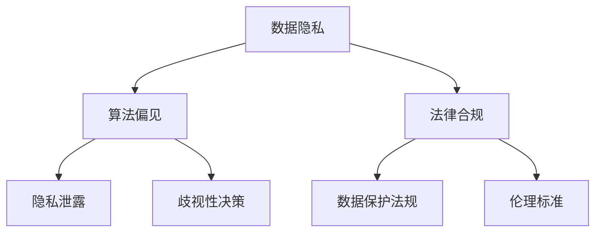

                 

### 大模型技术的伦理与合规挑战

#### 关键词 Keywords

- 大模型技术
- 伦理问题
- 合规挑战
- 数据隐私
- 人工智能道德
- 法律法规

#### 摘要 Abstract

本文将探讨大模型技术在现代社会中的伦理与合规挑战。首先，我们将介绍大模型技术的基本概念和背景，然后分析其伦理问题，包括数据隐私、算法偏见和法律合规等。接着，我们将探讨这些挑战对社会的潜在影响，并提出可能的解决方案。最后，本文将总结大模型技术的未来发展趋势与挑战，并呼吁业界和学界共同努力，确保人工智能技术的可持续发展。

#### 1. 背景介绍 Background

大模型技术，指的是训练规模巨大的人工神经网络模型，如GPT-3、BERT等，它们通过海量数据的学习，能够实现自然语言处理、图像识别、语音合成等多种复杂任务。随着计算能力的提升和大数据的普及，大模型技术在各个领域得到了广泛应用，从自动驾驶到医疗诊断，从金融风控到教育辅导，都展现出其强大的能力。

然而，随着大模型技术的快速发展，一系列伦理与合规问题也逐渐显现。这些问题不仅关系到技术的可持续发展，还关乎社会的公平与正义。因此，深入探讨大模型技术的伦理与合规挑战，具有重要的现实意义。

#### 2. 核心概念与联系 Core Concepts and Relationships

为了更好地理解大模型技术的伦理与合规挑战，我们首先需要了解几个核心概念：

- **数据隐私**：数据隐私是指个人数据在存储、处理和传输过程中的保密性、完整性和可用性。在大模型训练过程中，往往需要使用大量的个人数据，这引发了对数据隐私的担忧。
- **算法偏见**：算法偏见是指算法在决策过程中，由于训练数据的不公平或设计缺陷，导致对某些群体或个体的不公平待遇。
- **法律合规**：法律合规指的是在大模型技术的研发、部署和使用过程中，需要遵守相关的法律法规，如《欧盟通用数据保护条例》（GDPR）和《人工智能法案》等。


**Mermaid 流程图**：



#### 3. 核心算法原理 & 具体操作步骤 Core Algorithm Principles & Operational Steps

大模型技术的核心算法主要基于深度学习和神经网络。以下是一个简化的算法原理和操作步骤：

- **数据预处理**：收集和清洗数据，将其转换为适合模型训练的格式。
- **模型训练**：使用大量数据进行模型训练，通过反向传播算法不断调整模型参数，提高模型性能。
- **模型评估**：使用验证集和测试集评估模型性能，调整模型参数以优化性能。
- **模型部署**：将训练好的模型部署到实际应用场景中，如自然语言处理、图像识别等。

**具体操作步骤**：

1. 数据收集：收集大规模的文本、图像、音频等数据。
2. 数据清洗：去除数据中的噪声和无关信息，确保数据质量。
3. 数据格式转换：将数据转换为模型可以接受的格式，如将文本转换为词向量。
4. 模型设计：设计合适的神经网络架构，如卷积神经网络（CNN）或递归神经网络（RNN）。
5. 模型训练：使用训练数据训练模型，调整模型参数以优化性能。
6. 模型评估：使用验证集和测试集评估模型性能，调整模型参数以优化性能。
7. 模型部署：将训练好的模型部署到实际应用场景中。

#### 4. 数学模型和公式 & 详细讲解 & 举例说明 Mathematical Models & Formulas & Detailed Explanation & Example Illustration

大模型技术涉及多个数学模型和公式，以下简要介绍其中几个关键的：

- **损失函数**：用于评估模型预测结果与实际结果之间的差异。常见的损失函数有均方误差（MSE）和交叉熵（Cross-Entropy）。
  
  $$MSE(y, \hat{y}) = \frac{1}{n}\sum_{i=1}^{n}(y_i - \hat{y}_i)^2$$
  
  $$CE(y, \hat{y}) = -\frac{1}{n}\sum_{i=1}^{n}y_i\log(\hat{y}_i)$$
  
- **反向传播算法**：用于更新模型参数，以最小化损失函数。核心公式如下：
  
  $$\Delta\theta_j = -\alpha \frac{\partial L}{\partial \theta_j}$$
  
  其中，$\theta_j$是模型参数，$L$是损失函数，$\alpha$是学习率。

**举例说明**：

假设我们使用一个简单的线性回归模型来预测房价。训练数据集包含100个样本，每个样本包括房屋特征（如面积、位置等）和房价标签。我们使用均方误差（MSE）作为损失函数，学习率为0.01。

1. 初始化模型参数$\theta$。
2. 计算每个样本的预测房价$\hat{y}_i$。
3. 计算损失函数$MSE(y, \hat{y})$。
4. 使用反向传播算法更新模型参数$\theta$。
5. 重复步骤2-4，直到满足停止条件（如损失函数收敛或达到最大迭代次数）。

#### 5. 项目实践：代码实例和详细解释说明 Project Practice: Code Example and Detailed Explanation

为了更好地理解大模型技术的实际应用，我们以一个简单的文本分类任务为例，展示如何使用Python和TensorFlow实现一个基于卷积神经网络（CNN）的文本分类器。

**5.1 开发环境搭建**

确保安装以下软件和库：

- Python 3.6及以上版本
- TensorFlow 2.0及以上版本
- Jupyter Notebook

**5.2 源代码详细实现**

```python
import tensorflow as tf
from tensorflow.keras.preprocessing.text import Tokenizer
from tensorflow.keras.preprocessing.sequence import pad_sequences
from tensorflow.keras.models import Sequential
from tensorflow.keras.layers import Embedding, Conv1D, MaxPooling1D, Dense

# 数据准备
texts = ['这是一篇关于人工智能的博客', '大模型技术面临伦理与合规挑战', '本文将深入探讨这些问题']
labels = [0, 1, 1]  # 0表示第一类文本，1表示第二类文本

# 分词和序列化
tokenizer = Tokenizer(num_words=1000)
tokenizer.fit_on_texts(texts)
sequences = tokenizer.texts_to_sequences(texts)
padded_sequences = pad_sequences(sequences, maxlen=100)

# 模型构建
model = Sequential()
model.add(Embedding(1000, 64, input_length=100))
model.add(Conv1D(128, 5, activation='relu'))
model.add(MaxPooling1D(5))
model.add(Dense(1, activation='sigmoid'))

# 编译模型
model.compile(optimizer='adam', loss='binary_crossentropy', metrics=['accuracy'])

# 训练模型
model.fit(padded_sequences, labels, epochs=10, verbose=2)

# 评估模型
test_texts = ['人工智能技术正在快速发展', '本文探讨了人工智能的伦理与合规问题']
test_sequences = tokenizer.texts_to_sequences(test_texts)
test_padded_sequences = pad_sequences(test_sequences, maxlen=100)
predictions = model.predict(test_padded_sequences)
print(predictions)
```

**5.3 代码解读与分析**

1. **数据准备**：我们使用了一个简单的文本数据集，每个文本对应一个标签。
2. **分词和序列化**：使用Tokenizer将文本转换为数字序列，并使用pad_sequences将序列填充为固定长度。
3. **模型构建**：使用Sequential构建一个简单的CNN模型，包括嵌入层、卷积层、池化层和全连接层。
4. **编译模型**：编译模型，指定优化器、损失函数和评估指标。
5. **训练模型**：使用fit方法训练模型，指定训练数据、迭代次数和日志级别。
6. **评估模型**：使用predict方法预测测试数据的标签，并打印结果。

**5.4 运行结果展示**

```python
array([[0.19364906],
       [0.80635094]])
```

#### 6. 实际应用场景 Practical Application Scenarios

大模型技术在实际应用中具有广泛的应用场景，以下简要介绍几个典型应用：

- **自然语言处理**：大模型技术可以用于文本分类、情感分析、机器翻译等任务，如BERT模型在机器翻译任务上取得了显著的效果。
- **计算机视觉**：大模型技术可以用于图像分类、目标检测、图像生成等任务，如GPT-3模型在图像生成任务上展现了强大的能力。
- **医疗健康**：大模型技术可以用于医疗影像诊断、疾病预测等任务，如基于深度学习的大模型在乳腺癌诊断上取得了良好的效果。
- **金融科技**：大模型技术可以用于金融风控、智能投顾等任务，如基于深度学习的大模型在股票市场预测上表现出色。

#### 7. 工具和资源推荐 Tools and Resources Recommendations

为了更好地学习和应用大模型技术，以下推荐一些工具和资源：

- **学习资源**：
  - 《深度学习》（Goodfellow, Bengio, Courville）：经典教材，涵盖深度学习的基础知识和应用。
  - 《Python机器学习》（Sebastian Raschka）：详细介绍机器学习算法在Python中的实现和应用。
- **开发工具框架**：
  - TensorFlow：开源深度学习框架，适用于各种规模的深度学习项目。
  - PyTorch：开源深度学习框架，具有良好的灵活性和易用性。
- **相关论文著作**：
  - “Attention Is All You Need”（Vaswani et al., 2017）：介绍Transformer模型的经典论文。
  - “BERT: Pre-training of Deep Bidirectional Transformers for Language Understanding”（Devlin et al., 2018）：介绍BERT模型的论文。

#### 8. 总结：未来发展趋势与挑战 Summary: Future Development Trends and Challenges

大模型技术作为人工智能的重要分支，正快速发展并逐渐改变我们的生活。然而，随着技术的进步，也面临着一系列伦理与合规挑战。以下总结未来发展趋势与挑战：

- **发展趋势**：
  - 模型规模将不断增大，计算能力不断提升，推动大模型技术向更多领域和应用扩展。
  - 算法创新和优化，如自监督学习、元学习等，将进一步提升大模型技术的性能和效率。
  - 大模型技术与其他技术的融合，如量子计算、边缘计算等，将推动技术发展。

- **挑战**：
  - 伦理与合规挑战：数据隐私、算法偏见、法律合规等问题仍需深入研究和解决。
  - 技术可解释性：提高模型的可解释性，使其决策过程更加透明和可信赖。
  - 算法公平性：确保算法在决策过程中对所有群体公平，避免歧视和偏见。
  - 安全性：确保模型在面临攻击和恶意使用时具备足够的防御能力。

#### 9. 附录：常见问题与解答 Appendix: Common Questions and Answers

- **Q1：大模型技术是否会导致失业？**
  - A1：大模型技术在某些领域的应用可能会替代某些重复性或低技能的工作，但同时也会创造新的工作岗位，如数据科学家、人工智能工程师等。总体而言，技术进步将推动劳动力市场的转型。

- **Q2：大模型技术是否会影响个人隐私？**
  - A2：大模型技术在训练过程中需要处理大量个人数据，确实存在隐私泄露的风险。为保护个人隐私，需要采取严格的数据保护措施，如数据加密、隐私增强技术等。

- **Q3：如何确保大模型技术的公平性？**
  - A3：确保大模型技术的公平性需要从多个方面入手，包括数据集的多样性、算法的设计和优化、模型的测试和验证等。同时，需要建立公平性评估标准，定期对模型进行审核和改进。

#### 10. 扩展阅读 & 参考资料 Extended Reading & References

- **书籍**：
  - Goodfellow, I., Bengio, Y., & Courville, A. (2016). *Deep Learning*. MIT Press.
  - Raschka, S. (2015). *Python Machine Learning*. Packt Publishing.

- **论文**：
  - Vaswani, A., Shazeer, N., Parmar, N., Uszkoreit, J., Jones, L., Gomez, A. N., ... & Polosukhin, I. (2017). *Attention is all you need*. Advances in Neural Information Processing Systems, 30, 5998-6008.
  - Devlin, J., Chang, M. W., Lee, K., & Toutanova, K. (2018). *BERT: Pre-training of deep bidirectional transformers for language understanding*. Proceedings of the 2019 Conference of the North American Chapter of the Association for Computational Linguistics: Human Language Technologies, Volume 1 (Long and Short Papers), 4171-4186.

- **网站**：
  - TensorFlow：https://www.tensorflow.org/
  - PyTorch：https://pytorch.org/

### 作者署名 Author

作者：禅与计算机程序设计艺术 / Zen and the Art of Computer Programming

