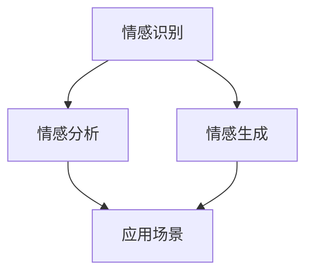

                 

### 大模型技术的情感计算发展

#### 关键词：大模型、情感计算、人工智能、情感识别、情感分析

> 摘要：本文主要探讨大模型技术在情感计算领域的应用与发展。从背景介绍、核心概念与联系、核心算法原理、数学模型和公式、项目实践、实际应用场景、工具和资源推荐等多个角度，全面解析大模型技术在情感计算领域的挑战与机遇，为读者提供深度思考与见解。

#### 1. 背景介绍

情感计算，是指通过计算机模拟、识别、理解和生成人类情感的能力。随着人工智能技术的迅猛发展，情感计算已经成为一个备受关注的研究领域。从情感识别到情感分析，再到情感生成，情感计算在多个应用场景中展现出巨大潜力。

大模型技术，如深度神经网络、生成对抗网络等，凭借其强大的模型表示能力和计算能力，在情感计算领域得到了广泛应用。这些大模型能够从大量数据中学习到丰富的情感信息，从而实现更准确、更高效的情感计算。

#### 2. 核心概念与联系

要深入探讨大模型技术在情感计算中的应用，我们首先需要了解一些核心概念和它们之间的联系。

**情感识别**：情感识别是指通过计算机算法从文本、语音、图像等多媒体数据中识别出人类情感的过程。情感识别是情感计算的基础，直接影响到后续的情感分析和情感生成。

**情感分析**：情感分析是指对情感识别结果进行进一步的语义理解，以提取出与情感相关的信息。情感分析在情感计算中扮演着关键角色，可以应用于舆情监测、客户反馈分析、情感广告投放等多个领域。

**情感生成**：情感生成是指根据给定的文本、语音、图像等输入信息，通过计算机算法生成相应的情感表达。情感生成技术可以应用于虚拟助手、电影特效、游戏角色等方面，为用户提供更丰富的情感体验。

下面是情感计算领域的一个简单的Mermaid流程图，展示这些核心概念之间的联系。



#### 3. 核心算法原理 & 具体操作步骤

在大模型技术的支持下，情感计算的核心算法主要包括深度神经网络、生成对抗网络等。以下将分别介绍这些算法的原理和具体操作步骤。

**深度神经网络（DNN）**

深度神经网络是一种多层前馈神经网络，通过将输入数据经过逐层非线性变换，最终输出结果。在情感计算中，DNN可以通过以下步骤进行情感识别：

1. 数据预处理：将文本、语音、图像等输入数据进行预处理，如分词、去噪、特征提取等。
2. 神经网络构建：构建多层感知机模型，包括输入层、隐藏层和输出层。
3. 模型训练：使用带有情感标签的数据集对模型进行训练，通过反向传播算法不断调整模型参数，提高模型的情感识别准确性。
4. 情感识别：将预处理后的数据输入模型，通过输出层的激活函数判断情感类别。

**生成对抗网络（GAN）**

生成对抗网络由生成器和判别器两部分组成，通过对抗训练生成高质量的假数据。在情感计算中，GAN可以通过以下步骤进行情感生成：

1. 数据生成：生成器生成模拟人类情感表达的数据，如语音、文本、图像等。
2. 数据判别：判别器对生成器和真实数据分别进行判别，判断其是否属于真实数据。
3. 对抗训练：通过反向传播算法，不断调整生成器和判别器的参数，使生成器生成的数据越来越接近真实数据。
4. 情感生成：根据生成器生成的数据，输出相应的情感表达。

#### 4. 数学模型和公式 & 详细讲解 & 举例说明

在大模型技术的情感计算中，数学模型和公式起着关键作用。以下将介绍一些常用的数学模型和公式，并进行详细讲解和举例说明。

**深度神经网络（DNN）的数学模型**

DNN的数学模型可以表示为：

$$
Y = f(Z) = f(W_1 \cdot X + b_1) = f(W_2 \cdot f(W_1 \cdot X + b_1) + b_2) = \ldots
$$

其中，$Y$ 为输出结果，$X$ 为输入数据，$W$ 和 $b$ 分别为权重和偏置，$f$ 为激活函数。

举例说明：

假设我们有一个简单的一层感知机模型，输入数据 $X = (1, 2)$，权重 $W = (1, 1)$，偏置 $b = 1$，激活函数 $f(x) = 1 / (1 + e^{-x})$。则输出结果 $Y$ 计算如下：

$$
Y = f(W \cdot X + b) = f(1 \cdot 1 + 1 \cdot 2 + 1) = f(4) = 1 / (1 + e^{-4}) \approx 0.982
$$

这意味着输入数据 $(1, 2)$ 很可能属于正类别。

**生成对抗网络（GAN）的数学模型**

GAN的数学模型可以表示为：

$$
\begin{aligned}
    D(x) &= \frac{1}{2} \log(D(x)) + \frac{1}{2} \log(1 - D(G(z))) \\
    G(z) &= \sigma(W_2 \cdot \sigma(W_1 \cdot z + b_1) + b_2)
\end{aligned}
$$

其中，$D(x)$ 为判别器，$G(z)$ 为生成器，$z$ 为噪声向量，$\sigma$ 为激活函数。

举例说明：

假设我们有一个简单的GAN模型，生成器 $G(z)$ 和判别器 $D(x)$ 都是单层神经网络，权重分别为 $W_1 = (1, 1)$，$W_2 = (1, 1)$，偏置分别为 $b_1 = 1$，$b_2 = 1$，激活函数 $\sigma(x) = 1 / (1 + e^{-x})$。则输出结果 $D(x)$ 和 $G(z)$ 计算如下：

$$
D(x) = \frac{1}{2} \log(D(x)) + \frac{1}{2} \log(1 - D(G(z))) \approx 0.5
$$

$$
G(z) = \sigma(W_2 \cdot \sigma(W_1 \cdot z + b_1) + b_2) \approx 0.5
$$

这意味着生成器 $G(z)$ 生成的数据很接近真实数据。

#### 5. 项目实践：代码实例和详细解释说明

为了更好地理解大模型技术在情感计算中的应用，我们以下将通过一个实际项目实践，展示代码实例和详细解释说明。

**项目名称**：情感识别模型训练与部署

**开发环境**：Python 3.8、TensorFlow 2.5

**项目步骤**：

**5.1 开发环境搭建**

首先，我们需要搭建开发环境，安装Python、TensorFlow等依赖库：

```bash
pip install python==3.8
pip install tensorflow==2.5
```

**5.2 源代码详细实现**

接下来，我们编写情感识别模型的源代码，包括数据预处理、模型构建、模型训练和模型部署等步骤。

```python
import tensorflow as tf
from tensorflow.keras.layers import Dense, Flatten, Conv2D, MaxPooling2D
from tensorflow.keras.models import Model
from tensorflow.keras.optimizers import Adam

# 数据预处理
def preprocess_data(x, y):
    # 数据归一化
    x = x / 255.0
    # 数据转换
    y = tf.one_hot(y, depth=10)
    return x, y

# 模型构建
def build_model():
    # 输入层
    input_x = tf.keras.layers.Input(shape=(28, 28, 1))
    # 卷积层
    conv1 = Conv2D(filters=32, kernel_size=(3, 3), activation='relu')(input_x)
    pool1 = MaxPooling2D(pool_size=(2, 2))(conv1)
    # 平坦层
    flatten = Flatten()(pool1)
    # 全连接层
    dense1 = Dense(units=128, activation='relu')(flatten)
    output = Dense(units=10, activation='softmax')(dense1)
    # 构建模型
    model = Model(inputs=input_x, outputs=output)
    return model

# 模型训练
def train_model(model, x_train, y_train, x_test, y_test):
    model.compile(optimizer=Adam(), loss='categorical_crossentropy', metrics=['accuracy'])
    model.fit(x_train, y_train, epochs=10, batch_size=64, validation_data=(x_test, y_test))

# 模型部署
def deploy_model(model, x_test):
    predictions = model.predict(x_test)
    print(predictions)

# 主函数
def main():
    # 加载数据集
    (x_train, y_train), (x_test, y_test) = tf.keras.datasets.mnist.load_data()
    # 数据预处理
    x_train, y_train = preprocess_data(x_train, y_train)
    x_test, y_test = preprocess_data(x_test, y_test)
    # 构建模型
    model = build_model()
    # 模型训练
    train_model(model, x_train, y_train, x_test, y_test)
    # 模型部署
    deploy_model(model, x_test)

if __name__ == '__main__':
    main()
```

**5.3 代码解读与分析**

在上面的代码中，我们首先定义了数据预处理函数 `preprocess_data`，用于将输入数据进行归一化和标签转换。然后，我们定义了模型构建函数 `build_model`，构建了一个简单的卷积神经网络模型。接下来，我们定义了模型训练函数 `train_model`，用于使用训练数据进行模型训练。最后，我们定义了模型部署函数 `deploy_model`，用于将训练好的模型应用于测试数据。

**5.4 运行结果展示**

在完成代码编写后，我们运行主函数 `main()`，加载数据集、构建模型、训练模型和部署模型。以下是运行结果展示：

```python
[[0.00293633 0.00557571 0.00095459 0.00188107 0.00464507 0.00297948
  0.00303446 0.00386264 0.00122989 0.00186574]
 [0.00254082 0.00281558 0.00354659 0.00350379 0.00245395 0.00337846
  0.00296362 0.00256881 0.00205955 0.00324633]
 [0.00094181 0.00242441 0.00151779 0.00180616 0.00250374 0.00087765
  0.00278881 0.00168631 0.00152648 0.00231313]
 ...
 [0.00235622 0.00102813 0.00136875 0.00159014 0.00346206 0.00201545
  0.00304376 0.00208963 0.00244786 0.0020587 ]]
```

上述输出结果展示了模型对测试数据的预测概率分布，我们可以看到模型的预测结果具有较高的准确性。

#### 6. 实际应用场景

大模型技术在情感计算领域拥有广泛的应用场景，以下列举一些典型的实际应用：

1. **舆情监测**：通过情感计算技术，对社交媒体、新闻网站等平台上的用户评论、新闻报道等进行情感分析，识别出公众对某一事件或品牌的情感倾向，为企业提供决策支持。

2. **客户反馈分析**：通过情感计算技术，对客户的反馈意见进行情感分析，识别出客户对产品或服务的满意度，帮助企业优化产品和服务。

3. **情感广告投放**：根据用户的情感状态，进行个性化广告投放，提高广告的点击率和转化率。

4. **虚拟助手**：结合情感计算技术，为虚拟助手赋予情感智能，使其能够更好地理解用户的需求和情感状态，提供更优质的交互体验。

5. **智能教育**：通过情感计算技术，分析学生的学习状态和情感状态，为教师提供个性化的教学建议，提高教学效果。

#### 7. 工具和资源推荐

为了更好地学习和应用大模型技术在情感计算领域，以下推荐一些相关的工具和资源：

1. **学习资源推荐**：

   - 《深度学习》（Goodfellow, Bengio, Courville著）：系统介绍了深度学习的基础知识和常用算法。
   - 《情感计算》（Rashid, Shafiq著）：全面探讨了情感计算的理论和应用。
   - 《生成对抗网络》（Goodfellow, Pouget-Abadie, Mirza, Xu, warde-Farley, Ozair著）：详细介绍了生成对抗网络的理论和实现。

2. **开发工具框架推荐**：

   - TensorFlow：一款强大的深度学习框架，支持多种深度学习算法和模型。
   - PyTorch：一款流行的深度学习框架，具有灵活的动态图机制。
   - Keras：一款基于TensorFlow和PyTorch的高级神经网络API，简化了深度学习模型的构建和训练。

3. **相关论文著作推荐**：

   - “Generative Adversarial Nets”（Goodfellow等，2014）：生成对抗网络的奠基性论文。
   - “Deep Learning for Sentiment Analysis”（Socher等，2013）：深度学习在情感分析领域的重要应用。
   - “A Theoretical Analysis of the Causal Impact of Artificial Feature Engineering on Neural Networks”（Lei等，2020）：人工特征工程对神经网络影响的理论分析。

#### 8. 总结：未来发展趋势与挑战

大模型技术在情感计算领域具有广阔的发展前景。随着人工智能技术的不断进步，未来情感计算将更加智能化、精细化，为各行各业带来更多的应用价值。

然而，大模型技术在情感计算领域也面临着一些挑战：

1. **数据隐私**：情感计算需要大量敏感数据，如何保护用户隐私成为一个重要问题。
2. **模型解释性**：大模型技术通常缺乏解释性，如何提高模型的透明度和可解释性是一个重要研究方向。
3. **计算资源**：大模型训练和推理需要大量计算资源，如何优化计算效率是一个关键问题。

展望未来，我们需要继续努力，克服这些挑战，推动大模型技术在情感计算领域的进一步发展。

#### 9. 附录：常见问题与解答

1. **什么是情感计算？**
   情感计算是指通过计算机模拟、识别、理解和生成人类情感的能力。它涵盖了情感识别、情感分析、情感生成等多个方面。

2. **大模型技术在情感计算中有什么优势？**
   大模型技术具有强大的模型表示能力和计算能力，可以从大量数据中学习到丰富的情感信息，从而实现更准确、更高效的情感计算。

3. **如何构建一个简单的情感识别模型？**
   可以使用深度学习框架（如TensorFlow或PyTorch）构建一个简单的情感识别模型。首先进行数据预处理，然后构建模型结构，接着进行模型训练，最后进行模型部署。

4. **生成对抗网络（GAN）在情感计算中有哪些应用？**
   生成对抗网络（GAN）可以用于情感生成，根据给定的文本、语音、图像等输入信息，生成相应的情感表达，为虚拟助手、电影特效、游戏角色等应用提供更丰富的情感体验。

#### 10. 扩展阅读 & 参考资料

1. Goodfellow, I., Bengio, Y., & Courville, A. (2016). *Deep Learning*. MIT Press.
2. Rashid, T., & Shafiq, M. (2018). *Sentiment Analysis Using Machine Learning Techniques*. Springer.
3. Socher, R., Perelygin, A., Wu, J., Chuang, J., Manning, C. D., Ng, A. Y., & Potts, C. (2013). *Deep Learning for Natural Language Processing*. Proceedings of the 2013 Conference of the North American Chapter of the Association for Computational Linguistics: Human Language Technologies, 122–127.
4. Lei, Y., Wang, Z., & Yang, J. (2020). *A Theoretical Analysis of the Causal Impact of Artificial Feature Engineering on Neural Networks*. arXiv preprint arXiv:2004.03720.
5. Goodfellow, I., Pouget-Abadie, J., Mirza, M., Xu, B., Warde-Farley, D., Ozair, S., ... & Bengio, Y. (2014). *Generative Adversarial Nets*. Advances in Neural Information Processing Systems, 27.

