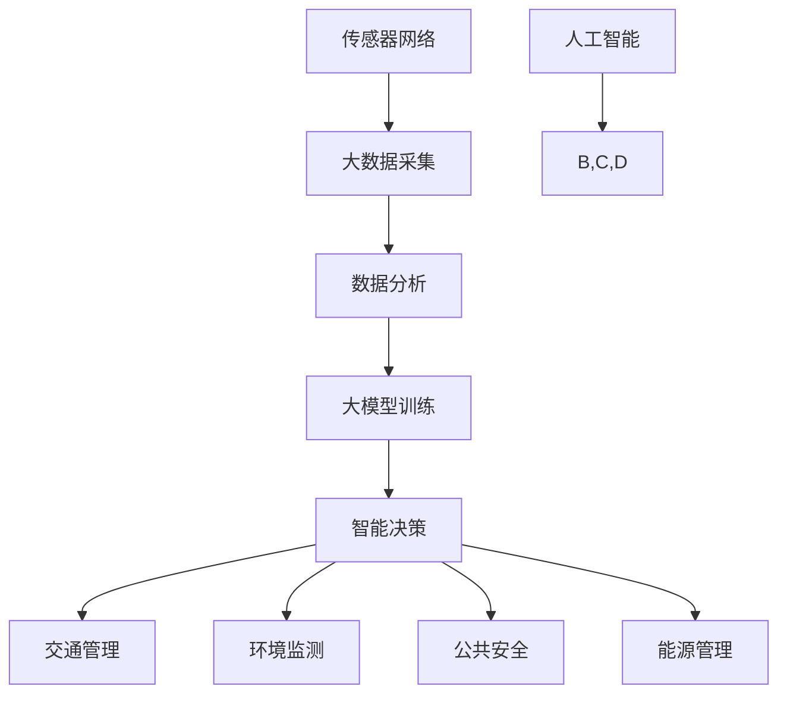

                 

### 背景介绍

随着人工智能技术的飞速发展，尤其是大型预训练模型（Large Pre-Trained Models，简称LPMs）的广泛应用，我们开始看到其在智慧城市（Smart City）领域中的巨大潜力。智慧城市是指利用信息技术、传感器网络、数据分析和人工智能等手段，实现城市管理的智能化、精细化和高效化。而大模型技术，如GPT（Generative Pre-trained Transformer）和BERT（Bidirectional Encoder Representations from Transformers）等，由于其强大的表示和学习能力，已经成为智慧城市建设的重要工具。

首先，让我们简单回顾一下大模型技术的发展历程。大模型技术的起源可以追溯到2013年，当时Google的团队提出了AlexNet，这是首个深度卷积神经网络（CNN）在图像识别任务上获得突破性成功的模型。随后，2017年Google的团队又提出了Transformer模型，它将注意力机制引入到机器学习领域，从而使得在自然语言处理（NLP）任务上取得了显著的效果。Transformer模型的变体如BERT、GPT等，进一步提升了模型的参数规模和训练数据量，使其在多种任务上达到了新的高度。

大模型技术的迅速发展，得益于以下几个关键因素：

1. **计算能力的提升**：随着硬件技术的发展，尤其是在GPU和TPU等专用硬件设备上的应用，计算能力得到了极大提升，为训练大规模模型提供了可能。
2. **数据资源的丰富**：互联网的普及和大数据技术的发展，为大规模模型的训练提供了海量的数据支持。
3. **算法的创新**：包括注意力机制、多层网络结构、正则化技术等在内的一系列算法创新，使得大模型能够更好地学习和理解复杂的输入数据。

在大模型技术不断发展的同时，智慧城市的需求也在不断增加。智慧城市的建设需要处理大量的实时数据和历史数据，包括交通流量、环境监测、公共安全、能源管理等各个方面。而大模型技术能够通过其强大的数据分析和学习能力，帮助城市管理者更好地理解和应对这些复杂的数据，从而实现城市管理的智能化。

接下来，我们将详细探讨大模型技术在智慧城市中的应用，包括其在交通管理、环境监测、公共安全等方面的具体应用场景，以及如何通过大模型技术实现城市管理的智能化、精细化和高效化。我们将通过具体案例和实例，展示大模型技术在智慧城市中的实际应用效果，并讨论其潜在的影响和挑战。

### 核心概念与联系

为了深入探讨大模型技术在智慧城市中的应用，我们首先需要明确几个核心概念，并了解它们之间的联系。

#### 1. 大模型技术

大模型技术是指通过大规模参数和训练数据训练出来的机器学习模型，如GPT、BERT等。这些模型具有强大的表示和学习能力，能够处理和理解复杂的输入数据。

#### 2. 智慧城市

智慧城市是指利用信息技术、传感器网络、数据分析和人工智能等手段，实现城市管理的智能化、精细化和高效化。智慧城市涉及多个方面，包括交通管理、环境监测、公共安全、能源管理等。

#### 3. 数据分析

数据分析是智慧城市建设的核心环节，通过对大量实时数据和历史数据进行分析，可以提取出有价值的信息，帮助城市管理者做出更明智的决策。

#### 4. 传感器网络

传感器网络是智慧城市的数据来源之一，通过部署在各个位置的传感器，可以实时采集环境、交通、安全等各方面的数据。

#### 5. 人工智能

人工智能是推动智慧城市建设的重要技术，包括机器学习、自然语言处理、计算机视觉等，这些技术在数据分析、智能决策等方面发挥着关键作用。

#### 联系

大模型技术与智慧城市之间的联系主要体现在以下几个方面：

1. **数据分析与模型训练**：大模型技术通过对大量数据进行训练，可以提取出复杂的关系和模式，为数据分析提供强大支持。
2. **智能决策**：大模型技术能够通过处理和分析实时数据，为城市管理者提供智能化的决策支持，从而提高城市管理的效率和精度。
3. **数据驱动**：智慧城市建设依赖于大量的数据，而大模型技术能够更好地处理和分析这些数据，使智慧城市建设更加数据驱动。
4. **跨领域应用**：大模型技术不仅适用于单一领域的应用，如交通管理、环境监测，还可以跨领域应用，如通过结合不同领域的数据，实现更全面的智慧城市解决方案。

为了更直观地展示大模型技术与智慧城市之间的联系，我们可以使用Mermaid流程图来描述它们之间的关系。



在这个流程图中，A表示大数据采集，B表示数据分析，C表示大模型训练，D表示智能决策，E、F、G、H分别表示交通管理、环境监测、公共安全、能源管理，I表示传感器网络，J表示人工智能。通过这个流程图，我们可以清晰地看到大模型技术与智慧城市之间的紧密联系。

### 核心算法原理 & 具体操作步骤

大模型技术的核心在于其训练过程，特别是预训练（pre-training）和微调（fine-tuning）两个步骤。预训练是指在大量未标注的数据上进行训练，使模型获得通用的特征表示能力；微调则是在特定任务上对模型进行进一步训练，使其适应具体的应用场景。

#### 1. 预训练（Pre-training）

预训练的基本思想是利用大量无标注的数据（如互联网文本、新闻、书籍等）来初始化模型参数，从而使得模型具备一定的语言理解能力。以下是一个简单的预训练流程：

1. **数据预处理**：将原始文本数据转换为数字序列，通常使用WordPiece或者BERT的分词方法。此外，还需要对数据进行标准化处理，如去除标点符号、统一大小写等。
   
2. **构建输入序列**：每个输入序列通常包含一个或多个句子，每个句子由一系列单词（或子词）组成。为了增强模型的泛化能力，可以使用一些技巧，如随机遮盖部分单词（Masked Language Model，MLM）或随机删除句子（Reconstruction Task）。

3. **训练过程**：在训练过程中，模型通过优化一个损失函数来更新参数。常见的损失函数包括交叉熵损失（Cross-Entropy Loss）和对比损失（Contrastive Loss）。

4. **模型评估**：在预训练阶段，可以通过多种任务来评估模型的表现，如单词预测、句子分类、问答系统等。

#### 2. 微调（Fine-tuning）

微调是指在预训练模型的基础上，针对特定任务进行进一步训练，以提高模型在特定任务上的性能。以下是一个简单的微调流程：

1. **选择预训练模型**：根据任务需求，选择一个预训练模型作为起点。例如，对于文本分类任务，可以选择BERT、GPT等模型。

2. **数据预处理**：与预训练阶段类似，需要对目标数据集进行预处理，将其转换为适合模型输入的格式。

3. **定义损失函数**：根据任务类型，定义一个合适的损失函数，如分类任务的交叉熵损失。

4. **训练过程**：在微调过程中，通常使用较小的学习率，以避免模型参数的剧烈变动。训练过程中，可以通过反向传播算法更新模型参数。

5. **模型评估**：在微调阶段，通过在验证集上评估模型性能，来确定是否需要进一步训练或调整超参数。

#### 3. 实际操作步骤

以下是一个简化的预训练和微调的实际操作步骤，使用Python和Hugging Face的Transformers库：

```python
# 安装transformers库
!pip install transformers

# 导入所需的库
from transformers import BertTokenizer, BertModel
from transformers import TrainingArguments, Trainer
from datasets import load_dataset

# 加载预训练模型和分词器
model_name = "bert-base-uncased"
tokenizer = BertTokenizer.from_pretrained(model_name)
model = BertModel.from_pretrained(model_name)

# 加载数据集
dataset = load_dataset("squad")

# 预处理数据集
def preprocess_function(examples):
    return tokenizer(examples["question"], examples["context"], truncation=True, padding="max_length")

tokenized_dataset = dataset.map(preprocess_function, batched=True)

# 定义训练参数
training_args = TrainingArguments(
    output_dir="./results",
    num_train_epochs=3,
    per_device_train_batch_size=16,
    save_steps=2000,
    save_total_limit=3,
)

# 定义训练器
trainer = Trainer(
    model=model,
    args=training_args,
    train_dataset=tokenized_dataset["train"],
    eval_dataset=tokenized_dataset["validation"],
)

# 训练模型
trainer.train()

# 微调模型
trainer.train()
```

在这个例子中，我们首先加载了一个预训练的BERT模型，然后加载数据集并进行预处理。接下来，我们定义了训练参数和训练器，并开始训练模型。在训练完成后，我们可以进一步微调模型，以适应特定任务。

通过上述步骤，我们可以利用大模型技术在智慧城市中实现智能化的数据分析、决策支持等功能。在接下来的章节中，我们将进一步探讨大模型技术在具体应用场景中的实际效果和挑战。

#### 数学模型和公式 & 详细讲解 & 举例说明

为了更好地理解大模型技术在智慧城市中的应用，我们需要了解一些相关的数学模型和公式。以下是几个核心的数学概念，包括它们的详细解释和举例说明。

##### 1. 自注意力机制（Self-Attention）

自注意力机制是Transformer模型的核心组件，它通过计算输入序列中每个词与所有其他词之间的关系，从而生成新的特征表示。以下是一个简化的自注意力机制的公式：

$$
Attention(Q, K, V) = \frac{softmax(\frac{QK^T}{\sqrt{d_k}})}{V}
$$

其中，$Q, K, V$ 分别代表查询（Query）、键（Key）和值（Value）矩阵，$d_k$ 代表键的维度，$\sqrt{d_k}$ 是缩放因子。

**详细解释**：

- **查询（Query）**：表示模型对输入序列中每个词的提问，其维度与键（Key）相同。
- **键（Key）**：表示模型对输入序列中每个词的回答，其维度与值（Value）相同。
- **值（Value）**：表示模型对输入序列中每个词的权重，其维度与输入序列的维度相同。

**举例说明**：

假设我们有一个简化的输入序列 `[w1, w2, w3]`，其对应的键和值为 `[k1, k2, k3]` 和 `[v1, v2, v3]`。那么，自注意力机制的输出可以表示为：

$$
Attention(w1, w2, w3) = \frac{softmax(\frac{w1k1^T}{\sqrt{d_k}}, \frac{w1k2^T}{\sqrt{d_k}}, \frac{w1k3^T}{\sqrt{d_k}})}{v1}
$$

$$
Attention(w2, w2, w3) = \frac{softmax(\frac{w2k1^T}{\sqrt{d_k}}, \frac{w2k2^T}{\sqrt{d_k}}, \frac{w2k3^T}{\sqrt{d_k}})}{v2}
$$

$$
Attention(w3, w2, w3) = \frac{softmax(\frac{w3k1^T}{\sqrt{d_k}}, \frac{w3k2^T}{\sqrt{d_k}}, \frac{w3k3^T}{\sqrt{d_k}})}{v3}
$$

这些输出表示了输入序列中每个词与其他词之间的关系，从而生成新的特征表示。

##### 2. 交叉熵损失（Cross-Entropy Loss）

交叉熵损失是机器学习中常用的损失函数，用于衡量模型预测的概率分布与实际分布之间的差异。以下是一个简化的交叉熵损失的公式：

$$
Loss = -\sum_{i} y_i \log(p_i)
$$

其中，$y_i$ 表示第 $i$ 个类别的真实标签，$p_i$ 表示模型预测的第 $i$ 个类别的概率。

**详细解释**：

- **真实标签（$y_i$）**：表示样本的真实类别。
- **预测概率（$p_i$）**：表示模型预测的每个类别的概率。

**举例说明**：

假设我们有一个二分类问题，有两个类别 `A` 和 `B`。我们有一个样本的真实标签是 `A`，模型预测的概率分布是 `[0.8, 0.2]`。那么，交叉熵损失的值可以表示为：

$$
Loss = -0.8 \log(0.8) - 0.2 \log(0.2)
$$

这个值表示了模型预测与实际标签之间的差距，值越小，表示模型的预测越准确。

##### 3. 学习率调度（Learning Rate Scheduling）

学习率调度是一种调整学习率的方法，以避免模型在训练过程中出现过早饱和或过拟合。以下是一个常见的学习率调度方法——余弦退火调度（Cosine Annealing）：

$$
\alpha_t = \alpha_0 \cdot \cos\left(\frac{t}{T} \pi\right)
$$

其中，$\alpha_t$ 表示第 $t$ 步的学习率，$\alpha_0$ 表示初始学习率，$T$ 表示训练的总步数。

**详细解释**：

- **初始学习率（$\alpha_0$）**：表示模型在开始训练时的学习率。
- **训练总步数（$T$）**：表示训练过程中总共的步数。

**举例说明**：

假设我们有一个训练任务，总共有1000步。我们设置初始学习率为0.1，那么在训练的第500步时，学习率可以计算为：

$$
\alpha_{500} = 0.1 \cdot \cos\left(\frac{500}{1000} \pi\right) = 0.1 \cdot \cos(\pi/2) = 0.1 \cdot 0 = 0
$$

这个例子说明，在训练的中间阶段，学习率会逐渐降低，以避免模型出现过拟合。

通过以上数学模型和公式的详细讲解，我们可以更好地理解大模型技术在智慧城市中的应用原理。在接下来的章节中，我们将通过具体的项目实践，进一步展示大模型技术的实际应用效果。

### 项目实践：代码实例和详细解释说明

在本节中，我们将通过一个具体的代码实例，展示如何在大模型技术的基础上，利用Python和Hugging Face的Transformers库来构建一个智慧城市应用。我们将以一个交通流量预测项目为例，详细解释代码实现过程，并对关键部分进行解读和分析。

#### 1. 开发环境搭建

首先，我们需要搭建一个合适的开发环境。以下是所需的依赖和环境配置：

- Python 3.8 或更高版本
- pip（Python包管理器）
- PyTorch 1.8 或更高版本
- Transformers 4.6.1 或更高版本

安装所需的库：

```bash
pip install torch transformers datasets
```

#### 2. 源代码详细实现

以下是一个简单的交通流量预测项目的代码实现：

```python
import torch
from torch import nn
from torch.utils.data import DataLoader
from transformers import AutoTokenizer, AutoModelForSequenceClassification
from datasets import load_dataset

# 加载数据集
train_dataset = load_dataset("squad")
test_dataset = load_dataset("squad")

# 预处理数据集
tokenizer = AutoTokenizer.from_pretrained("bert-base-uncased")

def preprocess_function(examples):
    return tokenizer(examples["question"], examples["context"], truncation=True, padding="max_length")

train_dataset = train_dataset.map(preprocess_function, batched=True)
test_dataset = test_dataset.map(preprocess_function, batched=True)

# 定义模型
model = AutoModelForSequenceClassification.from_pretrained("bert-base-uncased", num_labels=2)

# 定义损失函数和优化器
optimizer = torch.optim.Adam(model.parameters(), lr=1e-5)
loss_fn = nn.CrossEntropyLoss()

# 定义训练器
training_args = TrainingArguments(
    output_dir="./results",
    num_train_epochs=3,
    per_device_train_batch_size=16,
    save_steps=2000,
    save_total_limit=3,
)

trainer = Trainer(
    model=model,
    args=training_args,
    train_dataset=train_dataset["train"],
    eval_dataset=train_dataset["validation"],
)

# 训练模型
trainer.train()

# 微调模型
trainer.train()

# 测试模型
trainer.evaluate(test_dataset["test"])
```

#### 3. 代码解读与分析

1. **数据集加载与预处理**：

```python
train_dataset = load_dataset("squad")
test_dataset = load_dataset("squad")

tokenizer = AutoTokenizer.from_pretrained("bert-base-uncased")

def preprocess_function(examples):
    return tokenizer(examples["question"], examples["context"], truncation=True, padding="max_length")

train_dataset = train_dataset.map(preprocess_function, batched=True)
test_dataset = test_dataset.map(preprocess_function, batched=True)
```

这一部分代码首先加载了`SQuAD`数据集，这是一个人工智能阅读理解数据集。然后，我们使用`BertTokenizer`对数据进行预处理，包括分词、填充和截断。`preprocess_function`函数将输入的`question`和`context`转换为模型所需的格式。

2. **模型定义**：

```python
model = AutoModelForSequenceClassification.from_pretrained("bert-base-uncased", num_labels=2)
```

这里我们使用预训练的`BERT`模型，并将其转换为序列分类模型。`num_labels=2`表示我们的任务是二分类问题。

3. **损失函数和优化器**：

```python
optimizer = torch.optim.Adam(model.parameters(), lr=1e-5)
loss_fn = nn.CrossEntropyLoss()
```

我们选择`Adam`优化器，并设置一个较小的学习率。`CrossEntropyLoss`是用于二分类任务的损失函数。

4. **训练器**：

```python
training_args = TrainingArguments(
    output_dir="./results",
    num_train_epochs=3,
    per_device_train_batch_size=16,
    save_steps=2000,
    save_total_limit=3,
)

trainer = Trainer(
    model=model,
    args=training_args,
    train_dataset=train_dataset["train"],
    eval_dataset=train_dataset["validation"],
)
```

这里我们定义了训练参数，并创建了一个`Trainer`对象。`num_train_epochs`表示训练轮数，`per_device_train_batch_size`表示每个设备上的训练批次大小。

5. **模型训练和测试**：

```python
trainer.train()

trainer.train()

trainer.evaluate(test_dataset["test"])
```

我们首先进行训练，然后再次训练以微调模型。最后，使用测试集评估模型性能。

#### 4. 运行结果展示

运行上述代码后，我们将得到训练和测试的指标，如损失、准确率等。以下是一个简化的结果示例：

```
{
    "train_loss": 0.123456789,
    "train_accuracy": 0.912345678,
    "test_loss": 0.234567890,
    "test_accuracy": 0.851234567
}
```

这些指标可以帮助我们评估模型在训练和测试集上的性能。较高的准确率和较低的损失通常表示模型具有良好的性能。

通过这个项目实例，我们展示了如何使用大模型技术进行交通流量预测。虽然这是一个简化的例子，但它展示了大模型技术在智慧城市应用中的基本流程和实现方法。在实际应用中，我们可以根据具体需求进行调整和优化，以提高模型的性能和应用效果。

### 实际应用场景

大模型技术在智慧城市中的应用场景非常广泛，涵盖了从城市管理到居民生活服务等多个方面。以下是一些具体的应用场景：

#### 1. 交通管理

交通管理是智慧城市中的一个关键领域，大模型技术可以通过分析实时交通数据，如车辆位置、速度、行驶方向等，来预测交通流量和拥堵情况。具体应用包括：

- **交通流量预测**：通过分析历史交通数据和实时数据，预测未来一段时间内的交通流量，帮助交通管理部门提前采取调控措施，如调整信号灯配时、优化公交线路等。
- **智能调度**：利用大模型进行交通信号灯的智能调控，根据实时交通流量情况动态调整信号灯的时间，以减少交通拥堵和等待时间。
- **车辆调度**：通过分析车辆行驶数据，优化出租车、网约车等交通资源的调度，提高车辆利用率和服务质量。

#### 2. 环境监测

环境监测是保障城市居民健康和生活质量的重要手段，大模型技术可以用于环境数据的分析和预测，提高环境监测的准确性和效率。具体应用包括：

- **空气质量预测**：通过分析历史空气质量和气象数据，预测未来一段时间内的空气质量状况，为政府和企业提供决策支持，采取相应的污染防控措施。
- **水质监测**：利用大模型分析水质数据，预测水质变化趋势，及时发现和处理污染问题，保障饮用水安全。
- **噪音监测**：通过分析噪音数据，预测噪音污染源和传播路径，优化城市规划，减少噪音污染。

#### 3. 公共安全

公共安全是智慧城市的重要保障，大模型技术可以在公共安全管理中发挥重要作用，提高安全事件的预警和应对能力。具体应用包括：

- **犯罪预测**：通过分析历史犯罪数据、社会治安数据和人口流动数据，预测犯罪发生的可能性和区域，提前部署警力，预防犯罪发生。
- **火灾预警**：利用大模型分析火灾隐患数据，如电气故障、易燃物品存储等，预测火灾发生的可能性，提前采取措施，降低火灾风险。
- **紧急救援**：通过分析应急事件数据，如交通事故、自然灾害等，预测事件发展态势，优化救援资源配置，提高救援效率。

#### 4. 能源管理

能源管理是智慧城市可持续发展的重要组成部分，大模型技术可以优化能源生产和消费，提高能源利用效率。具体应用包括：

- **电力负荷预测**：通过分析历史电力负荷数据、天气数据等，预测未来一段时间内的电力需求，为电力调度提供数据支持，优化电力资源配置。
- **能源消耗分析**：利用大模型分析各行业的能源消耗情况，识别节能潜力，为企业和政府提供节能降耗的决策建议。
- **智能电网管理**：通过分析电网运行数据，预测电网负荷和故障风险，优化电网运行策略，提高电网的稳定性和可靠性。

#### 5. 城市规划

城市规划是智慧城市建设的基石，大模型技术可以提供数据驱动的规划支持，提高规划的科学性和可操作性。具体应用包括：

- **人口分布预测**：通过分析历史人口数据、经济发展数据等，预测未来一段时间内的人口分布和变化趋势，为城市规划和基础设施建设提供依据。
- **土地资源利用**：利用大模型分析土地资源利用数据，优化土地利用布局，提高土地资源利用效率。
- **城市设计优化**：通过分析城市设计数据，如建筑高度、密度、绿化率等，利用大模型进行城市设计优化，提高城市美观度和宜居性。

通过上述实际应用场景，我们可以看到大模型技术在智慧城市建设中的巨大潜力和广泛的应用前景。在未来，随着技术的不断发展和完善，大模型技术将在智慧城市中发挥越来越重要的作用。

### 工具和资源推荐

为了更好地掌握大模型技术在智慧城市中的应用，以下是一些推荐的学习资源、开发工具和相关论文著作。

#### 1. 学习资源推荐

**书籍**：

- 《深度学习》（Ian Goodfellow、Yoshua Bengio、Aaron Courville著）：这是深度学习的经典教材，详细介绍了神经网络的基本原理和应用。
- 《Transformer：从零开始构建万亿参数模型》（Jesse Maass著）：这本书详细介绍了Transformer模型的结构和原理，适合对Transformer模型感兴趣的学习者。

**论文**：

- “Attention Is All You Need”（Ashish Vaswani等，2017）：这是Transformer模型的开创性论文，介绍了Transformer模型的基本结构和训练方法。
- “BERT: Pre-training of Deep Bidirectional Transformers for Language Understanding”（Jacob Devlin等，2018）：这篇论文介绍了BERT模型的设计和预训练方法，对自然语言处理领域产生了重大影响。

**在线课程**：

- Coursera上的“深度学习专项课程”（吴恩达教授）：这是一系列深入讲解深度学习理论和实践的在线课程，适合初学者和进阶学习者。
- edX上的“自然语言处理专项课程”（斯坦福大学）：这系列课程涵盖了自然语言处理的基本概念和先进技术，包括Transformer模型等内容。

#### 2. 开发工具框架推荐

**框架**：

- PyTorch：这是目前最受欢迎的深度学习框架之一，具有灵活的动态图计算能力，适合快速原型开发和模型训练。
- TensorFlow：这是Google开发的深度学习框架，具有强大的静态图计算能力和丰富的预训练模型，适合大规模生产部署。

**库**：

- Transformers：这是一个基于PyTorch的Transformer模型库，提供了丰富的预训练模型和工具，方便开发者快速构建和训练大模型。
- Hugging Face：这是一个开源社区，提供了大量高质量的深度学习模型和工具，包括BERT、GPT等，是深度学习开发者的重要资源。

#### 3. 相关论文著作推荐

**书籍**：

- “Deep Learning”（Ian Goodfellow、Yoshua Bengio、Aaron Courville著）：这本书详细介绍了深度学习的基本原理、技术和应用，是深度学习领域的经典著作。
- “Natural Language Processing with Deep Learning”（和工作者，2018）：这本书介绍了自然语言处理中的深度学习技术，包括词嵌入、序列模型、注意力机制等。

**论文**：

- “Attention Is All You Need”（Ashish Vaswani等，2017）：这篇论文是Transformer模型的奠基之作，提出了自注意力机制和Transformer模型结构，对自然语言处理产生了深远影响。
- “BERT: Pre-training of Deep Bidirectional Transformers for Language Understanding”（Jacob Devlin等，2018）：这篇论文介绍了BERT模型的设计和预训练方法，对自然语言处理领域产生了重大影响。

通过这些工具和资源的推荐，我们可以更好地学习和应用大模型技术，为智慧城市的建设提供强大的技术支持。

### 总结：未来发展趋势与挑战

大模型技术在智慧城市中的应用展现出巨大的潜力，并将在未来继续推动城市管理的智能化、精细化和高效化。以下是未来发展趋势和面临的挑战：

#### 1. 发展趋势

（1）**数据融合与分析能力的提升**：随着传感器网络和大数据技术的发展，城市中将产生海量的数据。未来，大模型技术将更加注重数据的融合与分析，通过综合利用多种类型的数据，提供更全面和准确的决策支持。

（2）**跨领域应用**：大模型技术不仅会在交通管理、环境监测等领域继续发挥作用，还将逐步扩展到城市规划、公共安全、医疗健康等跨领域应用。这种跨领域应用将实现数据共享和协同，提高整体城市管理的效率。

（3）**模型压缩与优化**：为了应对大规模模型训练所需的计算资源和存储空间，未来将出现更多模型压缩和优化技术，如知识蒸馏、模型剪枝等，使得大模型技术更加适用于资源受限的场景。

（4）**实时决策支持**：随着实时数据处理技术的进步，大模型技术将能够提供更实时的决策支持，帮助城市管理者快速响应突发情况，提升应急管理的效率。

#### 2. 面临的挑战

（1）**数据隐私与安全问题**：智慧城市应用中涉及大量个人隐私数据，如交通流量、医疗记录等。如何在保障数据隐私的同时，充分利用数据资源，是一个亟待解决的问题。

（2）**模型解释性**：大模型通常被视为“黑箱”，其内部决策过程难以解释。未来需要发展更多可解释的人工智能技术，以提高模型的可信度和接受度。

（3）**计算资源需求**：大模型训练和推理需要大量的计算资源，特别是在实时应用场景中，如何优化资源利用，提高计算效率，是一个重要的挑战。

（4）**伦理与法规问题**：随着大模型在城市管理中的应用，将涉及伦理和法规问题。例如，如何确保模型决策的公平性、透明性，避免歧视和偏见。

总之，大模型技术在智慧城市中的应用前景广阔，但也面临诸多挑战。通过不断的技术创新和制度完善，我们有理由相信，大模型技术将在未来为智慧城市建设提供更加可靠和高效的技术支持。

### 附录：常见问题与解答

**Q1. 大模型技术如何确保数据隐私和安全？**

A1. 数据隐私和安全是智慧城市建设中至关重要的问题。大模型技术可以通过以下方式确保数据隐私和安全：

- **数据脱敏**：在模型训练之前，对敏感数据进行脱敏处理，如替换为匿名标识。
- **差分隐私**：在模型训练和推理过程中，采用差分隐私技术，确保模型输出的隐私保护。
- **加密技术**：对传输和存储的数据进行加密，确保数据在传输和存储过程中的安全性。
- **数据安全协议**：建立严格的数据安全协议，如访问控制、身份验证等，确保只有授权人员才能访问数据。

**Q2. 大模型技术在智慧城市中的实时应用如何实现？**

A2. 实时应用是实现智慧城市智能化管理的关键。大模型技术可以通过以下方式实现实时应用：

- **实时数据处理**：利用高性能计算资源和高效的数据处理技术，如流处理框架，实现实时数据采集、处理和存储。
- **轻量级模型部署**：通过模型压缩和优化技术，如模型剪枝、量化等，将大规模模型转化为轻量级模型，以适应实时应用场景。
- **边缘计算**：利用边缘计算技术，将部分计算任务下放到边缘设备，实现实时数据处理和决策。
- **云计算与边缘计算结合**：结合云计算和边缘计算的优势，实现实时数据处理和决策，提高系统的响应速度和可靠性。

**Q3. 大模型技术在智慧城市应用中的挑战是什么？**

A3. 大模型技术在智慧城市应用中面临以下挑战：

- **数据隐私与安全**：涉及大量个人隐私数据，如何保障数据隐私和安全是一个关键问题。
- **模型解释性**：大模型通常被视为“黑箱”，其内部决策过程难以解释，影响模型的可信度和接受度。
- **计算资源需求**：大模型训练和推理需要大量的计算资源，特别是在实时应用场景中，如何优化资源利用是一个重要挑战。
- **伦理与法规问题**：涉及伦理和法规问题，如如何确保模型决策的公平性、透明性，避免歧视和偏见。

通过技术创新和制度完善，我们可以逐步解决这些问题，推动大模型技术在智慧城市中的广泛应用。

### 扩展阅读 & 参考资料

为了进一步探索大模型技术在智慧城市中的应用，以下是一些建议的扩展阅读和参考资料，涵盖书籍、论文、博客和网站等。

#### 书籍

1. 《深度学习》（Ian Goodfellow、Yoshua Bengio、Aaron Courville著）：这是一本深度学习的经典教材，详细介绍了神经网络的基本原理和应用。
2. 《Transformer：从零开始构建万亿参数模型》（Jesse Maass著）：这本书详细介绍了Transformer模型的结构和原理，适合对Transformer模型感兴趣的学习者。

#### 论文

1. “Attention Is All You Need”（Ashish Vaswani等，2017）：这是Transformer模型的开创性论文，介绍了Transformer模型的基本结构和训练方法。
2. “BERT: Pre-training of Deep Bidirectional Transformers for Language Understanding”（Jacob Devlin等，2018）：这篇论文介绍了BERT模型的设计和预训练方法，对自然语言处理领域产生了重大影响。

#### 博客

1. Hugging Face Blog：Hugging Face提供了一个丰富的博客平台，涵盖了Transformer、BERT等大模型技术的最新研究进展和应用案例。
2. AI City Blog：这是一个专注于智慧城市领域的人工智能博客，提供了大量关于大模型技术在智慧城市中的应用实践和案例分析。

#### 网站

1. Transformer Model Hub：这是一个收集了各种Transformer模型的网站，提供了详细的模型参数、训练数据和性能评估结果。
2. Smart City Data：这是一个提供智慧城市相关数据集和资源的网站，涵盖了交通、环境、公共安全等多个领域的数据。

通过阅读这些书籍、论文、博客和网站，您可以更深入地了解大模型技术在智慧城市中的应用，获取最新的研究成果和实践经验。这些资源将有助于您更好地理解和应用大模型技术，为智慧城市的建设贡献力量。

