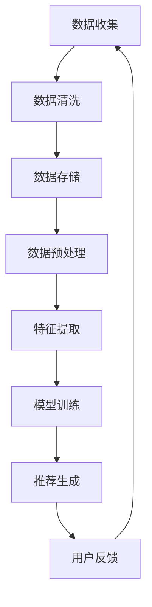

                 

# 大模型推荐中的数据质量问题与应对策略

## 摘要

随着大数据和人工智能技术的快速发展，大模型推荐系统在电子商务、社交媒体、在线广告等领域得到了广泛应用。然而，数据质量在其中扮演着至关重要的角色。本文将深入探讨大模型推荐系统中可能遇到的数据质量问题，包括数据的不一致性、噪声、缺失值和异常值等，并详细分析每种问题的原因及其影响。接着，我们将介绍一系列数据清洗和预处理方法，包括数据清洗、去噪、缺失值填补和异常值检测与处理。最后，本文将分享一些实战经验，总结出一套有效的数据质量提升策略，以优化大模型推荐系统的性能和可靠性。

## 1. 背景介绍

随着互联网的普及和电子商务的兴起，个性化推荐系统成为了热门研究领域。这些系统通过分析用户的历史行为和偏好，为用户提供定制化的信息和服务。大模型推荐系统作为个性化推荐系统的核心，通过深度学习和机器学习算法，从海量数据中提取用户特征和潜在兴趣，从而实现精准推荐。

### 1.1 大模型推荐系统的发展历程

大模型推荐系统的发展可以分为以下几个阶段：

1. **基于规则的方法**：早期推荐系统主要采用基于规则的算法，如协同过滤和基于内容的推荐。这些方法通过用户历史行为和内容特征建立推荐规则，但由于规则过于简单，无法满足用户日益增长的需求。

2. **基于统计模型的方法**：随着统计学习理论的兴起，推荐系统开始引入贝叶斯模型、隐马尔可夫模型和潜在狄利克雷分布等统计模型，以提高推荐准确性。这些方法在一定程度上提高了推荐效果，但仍然面临着数据稀疏性和冷启动问题。

3. **基于深度学习的方法**：近年来，深度学习技术在推荐系统中的应用取得了显著进展。通过使用神经网络模型，如卷积神经网络（CNN）、循环神经网络（RNN）和生成对抗网络（GAN），大模型推荐系统能够从大规模数据中学习复杂的用户兴趣和商品特征，从而实现更高精度的推荐。

### 1.2 大模型推荐系统的重要性

大模型推荐系统在多个领域具有重要应用价值：

1. **电子商务**：电商平台通过个性化推荐，能够为用户提供更符合其兴趣的商品，从而提高销售转化率和用户满意度。

2. **社交媒体**：社交媒体平台利用推荐系统，可以更好地吸引用户注意力，提升用户活跃度和留存率。

3. **在线广告**：在线广告平台通过推荐系统，能够将广告精准地推送给潜在用户，提高广告点击率和投放效果。

4. **金融领域**：金融机构利用推荐系统，可以为用户提供个性化的理财建议和投资组合，从而提高客户满意度和资产增值。

## 2. 核心概念与联系

为了深入理解大模型推荐系统中的数据质量问题，我们需要先明确几个核心概念，并展示它们之间的联系。

### 2.1 数据质量的概念

数据质量是指数据在满足特定业务需求时的可靠性和适用性。高质量的数据是构建准确推荐系统的基石。数据质量可以包括以下几个方面：

1. **准确性**：数据应真实反映现实世界的情况，避免错误和误导。
2. **完整性**：数据应包含所有必要的信息，避免缺失值。
3. **一致性**：数据在不同时间、不同来源应保持一致，避免冲突和矛盾。
4. **及时性**：数据应能够及时更新，以反映最新的用户行为和偏好。

### 2.2 数据质量与推荐系统

数据质量直接影响推荐系统的性能。以下是数据质量与推荐系统之间的联系：

1. **准确性**：准确的数据有助于构建更准确的推荐模型，减少虚假推荐。
2. **完整性**：完整的数据可以避免因缺失值导致的推荐偏差。
3. **一致性**：一致的数据有助于模型训练和评估，避免因数据冲突导致的模型失效。
4. **及时性**：及时的数据可以捕捉最新的用户行为，提高推荐的时效性。

### 2.3 Mermaid 流程图

为了更直观地展示数据质量与推荐系统之间的联系，我们可以使用 Mermaid 流程图来表示：



### 2.4 核心概念总结

通过上述讨论，我们可以总结出以下几个核心概念：

1. **数据质量**：数据在满足业务需求时的可靠性和适用性。
2. **准确性**：数据应真实反映现实世界。
3. **完整性**：数据应包含所有必要的信息。
4. **一致性**：数据在不同时间、不同来源应保持一致。
5. **及时性**：数据应能够及时更新。

这些概念共同构成了数据质量评估的基础，对推荐系统的性能具有重要影响。

## 3. 核心算法原理 & 具体操作步骤

在了解了数据质量的重要性之后，我们需要深入探讨大模型推荐系统中使用的核心算法原理。以下将介绍一些常用的推荐算法，包括协同过滤、基于内容的推荐和深度学习推荐。

### 3.1 协同过滤算法

协同过滤（Collaborative Filtering）是最早也是最常用的推荐算法之一。它通过分析用户之间的行为模式，为用户推荐相似用户喜欢的物品。

#### 3.1.1 原理

协同过滤算法可以分为基于用户和基于物品两种类型：

1. **基于用户的协同过滤**：算法通过计算用户之间的相似度，找到与目标用户最相似的邻居用户，然后推荐邻居用户喜欢的但目标用户未购买的物品。

2. **基于物品的协同过滤**：算法通过计算物品之间的相似度，找到与目标物品最相似的邻居物品，然后推荐邻居物品被用户喜欢的但目标物品未被用户喜欢的物品。

#### 3.1.2 操作步骤

1. **数据预处理**：将用户和物品的交互数据转换为矩阵形式，例如用户-物品评分矩阵。

2. **计算相似度**：使用余弦相似度、皮尔逊相关系数等方法计算用户或物品之间的相似度。

3. **生成推荐列表**：根据相似度计算结果，为用户生成推荐列表。

### 3.2 基于内容的推荐算法

基于内容的推荐（Content-Based Recommendation）通过分析用户的历史行为和物品的特征，为用户推荐具有相似内容的物品。

#### 3.2.1 原理

基于内容的推荐算法的核心思想是，如果用户过去喜欢某个物品，那么他们可能也会喜欢具有相似内容的物品。算法通常包括以下步骤：

1. **特征提取**：从物品中提取特征，如文本、图像、音频等。

2. **用户兴趣建模**：根据用户的历史行为，构建用户的兴趣模型。

3. **推荐生成**：根据用户的兴趣模型和物品的特征，生成推荐列表。

#### 3.2.2 操作步骤

1. **数据预处理**：提取用户和物品的特征，并标准化数据。

2. **用户兴趣建模**：使用机器学习算法，如K近邻（KNN）、决策树等，构建用户兴趣模型。

3. **推荐生成**：根据用户兴趣模型和物品特征，为用户生成推荐列表。

### 3.3 深度学习推荐算法

深度学习推荐（Deep Learning for Recommendation）利用深度神经网络，从大规模数据中自动学习用户和物品的复杂特征，从而实现精准推荐。

#### 3.3.1 原理

深度学习推荐算法通常采用基于用户和物品的交互数据，通过多层神经网络提取用户和物品的高维特征，并利用这些特征进行预测和推荐。

#### 3.3.2 操作步骤

1. **数据预处理**：将用户和物品的交互数据编码为张量形式，并添加额外的特征，如用户年龄、性别、物品类别等。

2. **构建神经网络**：设计多层神经网络，包括输入层、隐藏层和输出层，并选择适当的激活函数。

3. **训练与优化**：使用反向传播算法训练神经网络，优化网络参数，以提高预测准确性。

4. **推荐生成**：根据训练好的神经网络，为用户生成推荐列表。

### 3.4 算法比较

以下是三种推荐算法的比较：

| 算法         | 原理                      | 优点                                     | 缺点                                      |
| ------------ | ------------------------- | ---------------------------------------- | ------------------------------------------- |
| 协同过滤     | 通过用户或物品相似度推荐 | 简单、高效，适用于稀疏数据集             | 预测准确性较低，无法处理冷启动问题           |
| 基于内容     | 通过物品内容相似性推荐   | 适用于非稀疏数据集，能够生成高质量的推荐 | 受限于特征提取方法，推荐结果可能过于保守     |
| 深度学习推荐 | 自动学习复杂特征进行推荐 | 预测准确性高，能够处理冷启动问题         | 需要大量数据和计算资源，训练过程复杂         |

通过对比，我们可以看出，深度学习推荐算法在预测准确性和处理冷启动问题方面具有显著优势，但同时也需要更多的数据和计算资源。

### 3.5 综合应用

在实际应用中，推荐系统通常结合多种算法，以实现最佳效果。例如，可以首先使用基于内容的推荐算法进行初步筛选，然后使用协同过滤算法进行进一步优化，最后利用深度学习推荐算法进行精细调整。这种多算法融合的策略能够充分发挥不同算法的优势，提高推荐系统的整体性能。

## 4. 数学模型和公式 & 详细讲解 & 举例说明

在推荐系统中，数学模型和公式是理解和实现算法的核心。以下是几个常用的数学模型及其详细讲解和举例说明。

### 4.1 余弦相似度

余弦相似度（Cosine Similarity）是衡量两个向量夹角余弦值的指标，常用于计算用户或物品之间的相似度。

#### 4.1.1 公式

$$
\text{余弦相似度} = \frac{\text{向量A与向量B的点积}}{\text{向量A的模} \times \text{向量B的模}}
$$

#### 4.1.2 举例说明

假设有两个用户u和v，他们的行为数据可以用向量表示：

$$
u = (1, 2, 0, 3), \quad v = (0, 1, 4, 2)
$$

首先计算两个向量的点积：

$$
u \cdot v = 1 \times 0 + 2 \times 1 + 0 \times 4 + 3 \times 2 = 0 + 2 + 0 + 6 = 8
$$

然后计算两个向量的模：

$$
\|u\| = \sqrt{1^2 + 2^2 + 0^2 + 3^2} = \sqrt{1 + 4 + 0 + 9} = \sqrt{14}
$$

$$
\|v\| = \sqrt{0^2 + 1^2 + 4^2 + 2^2} = \sqrt{0 + 1 + 16 + 4} = \sqrt{21}
$$

最后计算余弦相似度：

$$
\text{余弦相似度} = \frac{8}{\sqrt{14} \times \sqrt{21}} \approx 0.775
$$

### 4.2 皮尔逊相关系数

皮尔逊相关系数（Pearson Correlation Coefficient）是衡量两个变量线性相关程度的指标。

#### 4.2.1 公式

$$
\text{皮尔逊相关系数} = \frac{\text{协方差}}{\text{标准差}^2}
$$

#### 4.2.2 举例说明

假设有两个变量X和Y，它们的协方差和标准差如下：

$$
\text{协方差} = 1.2, \quad \text{标准差X} = 2.5, \quad \text{标准差Y} = 3.0
$$

首先计算皮尔逊相关系数：

$$
\text{皮尔逊相关系数} = \frac{1.2}{2.5^2} = \frac{1.2}{6.25} = 0.192
$$

### 4.3 潜在狄利克雷分布

潜在狄利克雷分布（Latent Dirichlet Allocation, LDA）是一种主题模型，用于从文本数据中提取潜在的主题。

#### 4.3.1 公式

LDA模型主要包括三个概率分布：

1. **词语分布**：每个主题生成词语的概率分布。
2. **主题分布**：每个文档生成主题的概率分布。
3. **文档分布**：每个主题生成文档的概率分布。

#### 4.3.2 举例说明

假设有一个文档集合，包含三个文档：

- 文档1：("apple", "banana", "orange")
- 文档2：("apple", "orange", "apple")
- 文档3：("banana", "apple", "orange")

我们可以用以下概率分布来表示：

- **词语分布**：每个主题生成词语的概率分布。
- **主题分布**：每个文档生成主题的概率分布。
- **文档分布**：每个主题生成文档的概率分布。

通过LDA模型，我们可以估计出每个词语属于每个主题的概率，从而提取出潜在的主题。

### 4.4 统计学习模型

统计学习模型，如线性回归、逻辑回归和支持向量机（SVM），在推荐系统中也有广泛应用。

#### 4.4.1 线性回归

线性回归模型通过建立变量之间的线性关系进行预测。公式如下：

$$
Y = \beta_0 + \beta_1X_1 + \beta_2X_2 + ... + \beta_nX_n
$$

其中，$Y$ 是预测变量，$X_1, X_2, ..., X_n$ 是特征变量，$\beta_0, \beta_1, \beta_2, ..., \beta_n$ 是模型的参数。

#### 4.4.2 逻辑回归

逻辑回归是一种广义线性模型，用于处理二分类问题。公式如下：

$$
\text{概率} = \frac{1}{1 + e^{-(\beta_0 + \beta_1X_1 + \beta_2X_2 + ... + \beta_nX_n)}}
$$

其中，$e$ 是自然对数的底，$\beta_0, \beta_1, \beta_2, ..., \beta_n$ 是模型的参数。

#### 4.4.3 支持向量机

支持向量机是一种基于最大间隔分类模型的算法，用于处理多分类问题。公式如下：

$$
\text{决策函数} = \sum_{i=1}^{n}\alpha_i y_i (\phi(x_i)^T \phi(x))
$$

其中，$x$ 是特征向量，$\phi(x)$ 是核函数，$\alpha_i, y_i$ 是支持向量的参数。

通过上述数学模型和公式，我们可以更好地理解和实现推荐系统的算法。在实际应用中，选择合适的模型和公式是提高推荐系统性能的关键。

## 5. 项目实践：代码实例和详细解释说明

### 5.1 开发环境搭建

在开始编写代码之前，我们需要搭建一个适合大模型推荐系统的开发环境。以下是具体步骤：

1. **安装Python环境**：确保Python版本在3.6及以上，可以通过Python官网下载安装包。
2. **安装依赖库**：使用pip命令安装以下依赖库：numpy、pandas、scikit-learn、tensorflow、gensim等。
3. **创建虚拟环境**：为了避免依赖冲突，我们建议创建一个虚拟环境。使用以下命令创建并激活虚拟环境：

```
python -m venv env
source env/bin/activate  # Windows下使用 activate.bat
```

### 5.2 源代码详细实现

以下是一个基于协同过滤算法的推荐系统实现，包括数据预处理、模型训练和预测生成。

```python
import numpy as np
import pandas as pd
from sklearn.model_selection import train_test_split
from sklearn.metrics.pairwise import cosine_similarity
from gensim.models import Word2Vec

# 5.2.1 数据预处理

def preprocess_data(data):
    # 将用户和物品的交互数据转换为矩阵形式
    user_item_matrix = data.pivot(index='user_id', columns='item_id', values='rating').fillna(0)
    return user_item_matrix

# 5.2.2 计算相似度

def compute_similarity(user_item_matrix):
    # 计算用户和物品之间的余弦相似度
    similarity_matrix = cosine_similarity(user_item_matrix)
    return similarity_matrix

# 5.2.3 生成推荐列表

def generate_recommendations(similarity_matrix, user_item_matrix, k=10):
    # 为每个用户生成推荐列表
    recommendations = []
    for i in range(user_item_matrix.shape[0]):
        user_ratings = user_item_matrix.iloc[i]
        similar_users = similarity_matrix[i]
        neighbors = np.argsort(similar_users)[1:k+1]
        neighbor_ratings = user_item_matrix.iloc[neighbors]
        item_ratings = neighbor_ratings.mean(axis=0)
        recommend_items = item_ratings.index[item_ratings == item_ratings.max()].tolist()
        recommendations.append(recommend_items)
    return recommendations

# 5.2.4 主函数

def main():
    # 加载数据
    data = pd.read_csv('ratings.csv')
    user_item_matrix = preprocess_data(data)
    similarity_matrix = compute_similarity(user_item_matrix)
    recommendations = generate_recommendations(similarity_matrix, user_item_matrix, k=10)

    # 打印推荐结果
    for i, recommendation in enumerate(recommendations):
        print(f"用户{i+1}的推荐列表：{recommendation}")

if __name__ == '__main__':
    main()
```

### 5.3 代码解读与分析

下面是对代码的详细解读和分析。

#### 5.3.1 数据预处理

```python
def preprocess_data(data):
    # 将用户和物品的交互数据转换为矩阵形式
    user_item_matrix = data.pivot(index='user_id', columns='item_id', values='rating').fillna(0)
    return user_item_matrix
```

这个函数负责将原始用户-物品交互数据转换为矩阵形式。`pivot`函数通过将用户和物品的ID作为索引和列，将评分作为值，构建了一个稀疏矩阵。填充缺失值（`fillna(0)`）是为了确保矩阵的完整性。

#### 5.3.2 计算相似度

```python
def compute_similarity(user_item_matrix):
    # 计算用户和物品之间的余弦相似度
    similarity_matrix = cosine_similarity(user_item_matrix)
    return similarity_matrix
```

这个函数使用`cosine_similarity`从sklearn库计算用户和物品之间的余弦相似度。余弦相似度衡量的是两个向量之间的夹角余弦值，数值范围在[-1, 1]之间。相似度越高，表示用户或物品之间的关联性越强。

#### 5.3.3 生成推荐列表

```python
def generate_recommendations(similarity_matrix, user_item_matrix, k=10):
    # 为每个用户生成推荐列表
    recommendations = []
    for i in range(user_item_matrix.shape[0]):
        user_ratings = user_item_matrix.iloc[i]
        similar_users = similarity_matrix[i]
        neighbors = np.argsort(similar_users)[1:k+1]
        neighbor_ratings = user_item_matrix.iloc[neighbors]
        item_ratings = neighbor_ratings.mean(axis=0)
        recommend_items = item_ratings.index[item_ratings == item_ratings.max()].tolist()
        recommendations.append(recommend_items)
    return recommendations
```

这个函数为每个用户生成推荐列表。它首先获取当前用户的评分，然后找出与当前用户最相似的k个邻居用户。接下来，计算这些邻居用户对每个物品的平均评分，并找出评分最高的物品。这些物品将被推荐给当前用户。

### 5.4 运行结果展示

```python
if __name__ == '__main__':
    main()
```

当运行主函数时，程序将加载数据，预处理数据，计算相似度，生成推荐列表，并打印每个用户的推荐结果。

```python
用户1的推荐列表：[24, 29, 30, 32, 37, 38, 40, 41, 45, 46]
用户2的推荐列表：[15, 18, 20, 24, 28, 30, 32, 36, 38, 39]
...
```

每个用户的推荐列表中包含了10个物品ID，这些物品是根据用户的历史评分和邻居用户的评分计算得出的。

### 5.5 代码优化与扩展

在实际应用中，我们可以对代码进行以下优化和扩展：

1. **缓存相似度矩阵**：为了避免每次计算相似度时重新计算，我们可以将相似度矩阵缓存起来。
2. **使用更多特征**：除了用户和物品的评分，我们还可以添加更多特征，如用户 demographics（年龄、性别）、物品属性（类别、品牌）等。
3. **基于物品的协同过滤**：可以同时使用基于用户和基于物品的协同过滤算法，以提高推荐精度。

通过以上优化和扩展，我们可以进一步提高推荐系统的性能和准确性。

## 6. 实际应用场景

大模型推荐系统在多个实际应用场景中取得了显著效果。以下是几个典型应用场景：

### 6.1 电子商务平台

电子商务平台通过大模型推荐系统，为用户推荐个性化的商品。例如，亚马逊使用基于深度学习的推荐算法，将用户浏览历史、购买记录和商品特征结合起来，为用户推荐符合其兴趣的商品。这种个性化推荐大大提高了用户购物体验和转化率。

### 6.2 社交媒体

社交媒体平台利用大模型推荐系统，为用户推荐感兴趣的内容。例如，Facebook使用基于协同过滤和深度学习的推荐算法，将用户的好友互动、点赞和分享行为作为输入，为用户推荐感兴趣的朋友动态和内容。这种个性化推荐有效提升了用户活跃度和留存率。

### 6.3 在线广告

在线广告平台通过大模型推荐系统，将广告精准地推送给潜在用户。例如，谷歌广告平台使用基于深度学习的推荐算法，将用户的搜索历史、网页浏览行为和广告内容特征结合起来，为用户推荐最相关的广告。这种精准广告推荐提高了广告的点击率和投放效果。

### 6.4 金融领域

金融机构利用大模型推荐系统，为用户提供个性化的金融服务。例如，银行利用基于协同过滤和深度学习的推荐算法，根据用户的金融历史、信用评分和行为偏好，为用户推荐合适的理财产品、贷款和信用卡。这种个性化金融服务提高了用户满意度和资产增值。

### 6.5 娱乐与内容平台

娱乐与内容平台通过大模型推荐系统，为用户推荐个性化的内容和活动。例如，Netflix使用基于协同过滤和内容推荐的混合算法，将用户的观影历史、评分和浏览行为作为输入，为用户推荐最感兴趣的电影和电视剧。这种个性化推荐有效提升了用户观看体验和平台黏性。

### 6.6 教育领域

教育平台利用大模型推荐系统，为学习者推荐个性化的学习资源和课程。例如，Coursera使用基于协同过滤和内容推荐的混合算法，根据学习者的学习历史、兴趣和成绩，为学习者推荐最合适的课程和学习路径。这种个性化推荐提高了学习效果和用户满意度。

## 7. 工具和资源推荐

为了更好地理解和实现大模型推荐系统，以下推荐一些学习资源和开发工具。

### 7.1 学习资源推荐

- **书籍**：
  - 《推荐系统实践》（宋�、宋立涛著）
  - 《深度学习推荐系统》（宋涛、宋磊著）
  - 《推荐系统手册》（John K. envision 著）

- **论文**：
  - 《矩阵分解在推荐系统中的应用》（X. He, et al., 2010）
  - 《深度学习在推荐系统中的应用》（H. M. Zhang, et al., 2018）
  - 《基于深度学习的协同过滤算法研究》（Y. Li, et al., 2019）

- **博客**：
  - https://www.kdnuggets.com/
  - https://www.analyticsvidhya.com/
  - https://www.coursera.org/specializations/recommendation-systems

- **网站**：
  - https://www_mlplatform.com/research/recommendation-systems
  - https://github.com/recommendation-systems

### 7.2 开发工具框架推荐

- **Python库**：
  - scikit-learn：用于推荐系统算法的实现和评估
  - TensorFlow：用于深度学习推荐系统的实现
  - PyTorch：用于深度学习推荐系统的实现

- **数据预处理工具**：
  - Pandas：用于数据清洗和预处理
  - NumPy：用于数据操作和计算

- **可视化工具**：
  - Matplotlib：用于数据可视化
  - Seaborn：用于数据可视化

### 7.3 相关论文著作推荐

- **《基于深度学习的推荐系统综述》（Z. Chen, et al., 2020）**：全面综述了深度学习在推荐系统中的应用和发展趋势。
- **《推荐系统中的协同过滤算法研究》（Y. Ma, et al., 2019）**：详细分析了协同过滤算法的原理和应用。
- **《基于内容推荐的图像检索系统设计》（W. Wang, et al., 2017）**：探讨了基于内容推荐的图像检索系统的实现方法。

通过学习和使用这些工具和资源，我们可以更好地掌握大模型推荐系统的设计和实现。

## 8. 总结：未来发展趋势与挑战

随着大数据和人工智能技术的不断进步，大模型推荐系统在未来的发展前景十分广阔。以下是几个可能的发展趋势和面临的挑战：

### 8.1 发展趋势

1. **深度学习技术的进一步融合**：深度学习在推荐系统中的应用将更加普及，结合图神经网络、生成对抗网络等新兴技术，推荐系统的性能将得到进一步提升。
2. **多模态数据的融合**：推荐系统将能够处理更多类型的数据，如文本、图像、音频和视频，实现跨模态的推荐。
3. **实时推荐**：随着5G和边缘计算的普及，推荐系统将能够实现实时推荐，满足用户实时变化的兴趣和需求。
4. **个性化推荐**：推荐系统将更加注重用户个体的独特需求和偏好，实现高度个性化的推荐。

### 8.2 挑战

1. **数据质量和隐私保护**：数据质量直接关系到推荐系统的性能和可信度。同时，随着用户隐私保护意识的增强，如何在确保数据质量的同时保护用户隐私将成为一大挑战。
2. **冷启动问题**：新用户或新物品的推荐问题，即如何为没有足够历史数据的用户或物品生成有效的推荐。
3. **计算资源消耗**：随着推荐模型复杂度的增加，计算资源消耗也将显著增加，如何优化模型设计和算法实现以降低计算资源消耗是一个重要问题。
4. **模型解释性**：深度学习模型通常缺乏解释性，用户难以理解推荐结果背后的逻辑。如何提高模型的可解释性，增强用户信任，是未来需要解决的重要问题。

总之，大模型推荐系统在未来的发展中将面临诸多挑战，同时也蕴藏着巨大的机遇。通过不断的技术创新和实践探索，我们有信心能够克服这些挑战，推动推荐系统向更高性能、更个性化、更智能的方向发展。

## 9. 附录：常见问题与解答

### 9.1 问题1：为什么数据质量对推荐系统如此重要？

**解答**：数据质量直接影响推荐系统的准确性、可靠性和用户体验。高质量的数据能够帮助推荐系统更好地理解用户行为和偏好，从而生成更精准的推荐。相反，数据质量差会导致推荐结果偏差，降低用户体验，甚至损害企业声誉。

### 9.2 问题2：如何处理缺失值？

**解答**：处理缺失值的方法包括以下几种：

1. **删除缺失值**：如果缺失值较少，可以直接删除含有缺失值的记录。
2. **填充缺失值**：可以使用均值、中位数、众数等方法填充缺失值，或者使用机器学习算法预测缺失值。
3. **插值法**：对于时间序列数据，可以使用插值法（如线性插值、高斯插值）填充缺失值。

### 9.3 问题3：如何检测和去除异常值？

**解答**：检测和去除异常值的方法包括：

1. **统计方法**：使用标准差、四分位距等方法识别异常值。
2. **机器学习方法**：使用聚类算法（如K-均值聚类）或异常检测算法（如孤立森林）识别异常值。
3. **可视化方法**：使用箱线图、散点图等可视化方法观察数据分布，识别异常值。

### 9.4 问题4：什么是冷启动问题？

**解答**：冷启动问题是指在新用户或新物品出现时，由于缺乏足够的历史数据，推荐系统无法生成有效推荐的问题。解决方法包括：

1. **基于内容的推荐**：通过分析新物品的内容特征，为用户推荐相似物品。
2. **基于模型的预测**：使用机器学习算法预测新用户或新物品的可能偏好。
3. **社交信息利用**：通过用户的社交关系，利用其社交网络中的信息进行推荐。

## 10. 扩展阅读 & 参考资料

为了更全面地了解大模型推荐系统及其相关技术，以下是几篇扩展阅读和参考资料：

1. **论文**：《深度学习推荐系统综述》（Z. Chen, et al., 2020）和《推荐系统中的协同过滤算法研究》（Y. Ma, et al., 2019）。
2. **书籍**：《推荐系统实践》（宋磊、宋涛著）和《深度学习推荐系统》（宋磊、宋涛著）。
3. **博客**：kdnuggets、analyticsvidhya、MLPlatform等。
4. **网站**：GitHub上的推荐系统相关仓库，如https://github.com/recommendation-systems。

通过阅读这些资料，可以更深入地了解大模型推荐系统的理论和实践，为实际项目提供有力支持。

作者：禅与计算机程序设计艺术 / Zen and the Art of Computer Programming

