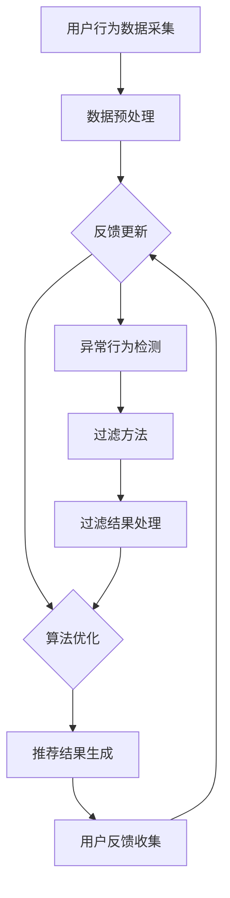

                 

### 背景介绍 Background Introduction

在当今信息爆炸的时代，大数据和人工智能技术正日益深入地改变着我们的日常生活和工作方式。尤其是大模型推荐系统，它们已经成为了各种互联网应用的关键组件，例如电商平台的商品推荐、视频平台的视频推荐、社交媒体的个性化内容推送等。大模型推荐系统通过分析用户的历史行为数据，为用户推荐他们可能感兴趣的内容或商品，从而提升用户体验和平台粘性。

然而，推荐系统并非完美无缺。在实际应用中，用户行为数据可能会受到各种异常因素的影响，例如数据噪声、恶意行为或虚假账户。这些异常数据不仅会降低推荐系统的准确性和效果，还可能对用户产生误导，损害平台的声誉。因此，用户行为异常检测与过滤方法成为了大模型推荐系统中不可或缺的一环。

用户行为异常检测的目的是识别出那些与正常行为模式显著不同的用户行为，并将其排除或标记出来，以避免这些异常行为对推荐系统的负面影响。过滤方法则进一步对这些异常行为进行处理，确保推荐系统的稳定性和可靠性。本文将深入探讨用户行为异常检测与过滤方法在大模型推荐系统中的应用，重点介绍相关核心概念、算法原理、数学模型及其在实际项目中的实现和应用。

总的来说，本文的结构如下：

1. **背景介绍**：介绍大模型推荐系统的基本概念和重要性，以及用户行为异常检测与过滤的必要性。
2. **核心概念与联系**：定义用户行为异常检测与过滤的相关核心概念，并使用Mermaid流程图展示系统架构。
3. **核心算法原理 & 具体操作步骤**：详细解释用户行为异常检测与过滤的主要算法，以及如何进行具体操作。
4. **数学模型和公式 & 详细讲解 & 举例说明**：介绍支持异常检测与过滤的数学模型，并使用具体案例进行解释。
5. **项目实践：代码实例和详细解释说明**：提供实际代码实例，并详细解释代码实现和运行过程。
6. **实际应用场景**：探讨用户行为异常检测与过滤方法在不同领域的应用案例。
7. **工具和资源推荐**：推荐学习资源、开发工具和框架，以帮助读者深入学习和实践。
8. **总结：未来发展趋势与挑战**：总结本文的主要内容，并展望用户行为异常检测与过滤技术的未来发展趋势和面临的挑战。
9. **附录：常见问题与解答**：针对文章中提到的重要概念和算法，提供常见问题的解答。
10. **扩展阅读 & 参考资料**：推荐相关的扩展阅读和参考资料，以供进一步学习。

通过这篇文章，我们希望能够帮助读者全面了解用户行为异常检测与过滤方法在大模型推荐系统中的重要性、原理和应用，从而更好地设计和优化推荐系统。

### 核心概念与联系 Core Concepts and Relationships

在深入探讨用户行为异常检测与过滤方法之前，我们需要明确几个核心概念，这些概念不仅构成了大模型推荐系统的基础，也为我们理解异常检测和过滤提供了必要的背景知识。

#### 用户行为数据 User Behavior Data

用户行为数据是指用户在平台上的各种交互记录，包括浏览历史、点击行为、购买记录、评论、评分等。这些数据是推荐系统分析和预测用户兴趣的重要依据。然而，用户行为数据的多样性和复杂性也带来了挑战，如数据噪声、缺失值和重复值等。

#### 用户兴趣模型 User Interest Model

用户兴趣模型是通过分析用户行为数据，构建出的对用户兴趣的抽象表示。这个模型可以用来预测用户的潜在兴趣和偏好，从而为推荐系统提供决策依据。常见的用户兴趣模型包括基于内容的推荐模型（Content-Based Filtering）、协同过滤模型（Collaborative Filtering）和混合推荐模型（Hybrid Recommendation）等。

#### 异常行为检测 Anomaly Detection

异常行为检测是指识别出与正常行为模式显著不同的用户行为，这些行为可能是由恶意用户、虚假账户或数据噪声引起的。异常行为检测的目标是提高推荐系统的准确性和可靠性，防止异常数据对系统产生负面影响。

#### 过滤方法 Filtering Methods

过滤方法是对识别出的异常行为进行处理的一系列技术，包括标记、过滤、隔离等。过滤方法的目的是确保推荐系统稳定运行，防止异常数据误导用户，并保护平台的声誉。

#### 系统架构 System Architecture

为了更好地理解用户行为异常检测与过滤方法在大模型推荐系统中的位置，我们使用Mermaid流程图来展示系统的整体架构。以下是一个简化的系统架构图：



**图 1. 大模型推荐系统的架构与异常检测、过滤流程**

在这个架构图中，用户行为数据采集模块负责收集用户的交互记录；数据预处理模块对原始数据进行清洗、去噪和格式化；用户兴趣建模模块基于预处理后的数据构建用户兴趣模型；推荐算法模块使用用户兴趣模型生成推荐结果；用户反馈收集模块收集用户对推荐结果的反馈，用于模型更新；异常行为检测模块识别异常用户行为；过滤方法模块对异常行为进行处理，确保推荐结果的可靠性；过滤结果处理模块将处理后的结果返回给推荐算法模块，用于算法优化。

#### 关键概念之间的关系 Relationships

1. **用户兴趣模型与异常检测**：用户兴趣模型为异常检测提供了基础数据。通过分析用户兴趣模型，可以识别出与正常行为模式显著不同的异常行为。
2. **异常检测与过滤**：异常检测是过滤方法的前提。只有识别出异常行为，过滤方法才能有效地对其进行处理。
3. **过滤与模型优化**：过滤方法的结果将反馈给用户兴趣模型，用于模型优化。这样可以不断提高推荐系统的准确性和稳定性。

通过上述核心概念的介绍和系统架构的展示，我们为后续详细探讨用户行为异常检测与过滤方法奠定了坚实的基础。

#### Mermaid 流程图 Explanation of Mermaid Flowchart

为了更直观地展示用户行为异常检测与过滤方法在大模型推荐系统中的工作流程，我们使用Mermaid语言绘制了一个简化的系统架构图。以下是对这个流程图的详细解释：


**图 2. 大模型推荐系统的 Mermaid 流程图**

- **用户行为数据采集（A）**：这是整个流程的起点，用户在平台上的各种交互记录（如浏览、点击、购买等）被收集并存储起来。
  
- **数据预处理（B）**：收集到的原始数据通常包含噪声、缺失值和重复值等。数据预处理模块负责对这些数据进行清洗、去噪、补缺和格式化，确保数据的质量和一致性。
  
- **用户兴趣建模（C）**：经过预处理的数据被用于构建用户兴趣模型。这一模型可以基于用户的历史行为数据，通过机器学习算法（如协同过滤、基于内容的推荐等）来预测用户的潜在兴趣。
  
- **推荐算法（D）**：用户兴趣模型作为输入，推荐算法模块根据用户兴趣和系统中的其他因素（如商品或内容的属性）生成推荐结果。常见的推荐算法包括基于内容的推荐、协同过滤和混合推荐等。
  
- **推荐结果生成（E）**：推荐算法生成的推荐结果将展示给用户，这是整个推荐系统对外界提供的服务。
  
- **用户反馈收集（F）**：用户对推荐结果的反馈（如点击、购买、评分等）将被收集，并用于模型更新和优化。
  
- **反馈更新（C）**：收集到的用户反馈将被用于更新用户兴趣模型，从而提高推荐系统的准确性和个性化程度。
  
- **异常行为检测（G）**：在用户行为数据进入用户兴趣建模模块之前，异常行为检测模块将识别出与正常行为模式显著不同的用户行为。这些异常行为可能是恶意行为、虚假账户或数据噪声等。
  
- **过滤方法（H）**：异常行为检测模块识别出的异常行为将通过过滤方法进行处理。过滤方法包括标记、过滤、隔离等，目的是确保推荐系统的稳定性和可靠性。
  
- **过滤结果处理（I）**：过滤方法处理后，过滤结果将返回给推荐算法模块。这些结果将用于算法优化，以提高系统的整体性能。
  
- **算法优化（D）**：通过过滤后的结果，推荐算法模块可以进一步优化，确保系统在处理异常行为时能够更加准确和高效。

通过这个Mermaid流程图，我们可以清晰地看到用户行为异常检测与过滤方法在整个大模型推荐系统中的位置和作用。这一流程图不仅帮助我们理解了各个模块之间的相互作用，还为我们提供了设计和优化推荐系统的具体思路。

### 核心算法原理 & 具体操作步骤 Core Algorithm Principles and Operational Steps

在用户行为异常检测与过滤方法中，核心算法的原理和具体操作步骤至关重要。以下我们将详细介绍两种主要的异常检测算法：基于统计的异常检测算法和基于机器学习的异常检测算法，并讨论它们的具体操作步骤。

#### 1. 基于统计的异常检测算法

**原理**：
基于统计的异常检测算法主要通过计算用户行为数据的统计特征，如均值、方差等，来识别与正常行为模式显著不同的用户行为。这种方法通常基于假设正常行为数据符合某一特定的统计分布，例如正态分布。

**操作步骤**：

1. **数据收集与预处理**：
   - 收集用户在平台上的交互记录，包括浏览历史、点击行为、购买记录等。
   - 对原始数据清洗，去除噪声、缺失值和重复值，确保数据质量。

2. **计算统计特征**：
   - 计算用户行为数据的统计特征，如均值（μ）、方差（σ²）等。
   - 可以使用数据探索性分析（EDA）来初步了解数据的分布特征。

3. **设定阈值**：
   - 根据正常行为数据的统计特征，设定一个阈值（e.g., 绝对值阈值或相对阈值）来确定哪些行为是异常的。

4. **检测异常行为**：
   - 对每个用户的交互记录，计算其统计特征，并与设定的阈值进行比较。
   - 如果某个用户的统计特征超过阈值，则认为该用户的行为是异常的。

5. **标记与处理**：
   - 对检测出的异常行为进行标记，例如在数据库中添加标签或标记字段。
   - 可以选择性地对异常行为进行隔离或限制，以避免对推荐系统的其他部分产生负面影响。

**示例**：

假设我们有一个用户群体的浏览历史数据，其浏览时间（以分钟为单位）的均值为10分钟，标准差为3分钟。我们可以设定一个绝对阈值，例如6分钟或更高，来识别浏览时间异常短的用户。

- **正常用户**：浏览时间在 [7, 13] 分钟之间。
- **异常用户**：浏览时间小于6分钟或大于14分钟。

#### 2. 基于机器学习的异常检测算法

**原理**：
基于机器学习的异常检测算法通过训练一个模型来学习正常用户行为的数据分布，然后使用这个模型来识别与正常行为显著不同的异常行为。常见的方法包括孤立森林（Isolation Forest）、局部异常因子（LOF）和自动编码器（Autoencoder）等。

**操作步骤**：

1. **数据收集与预处理**：
   - 收集用户在平台上的交互记录，并进行清洗和预处理。

2. **特征工程**：
   - 提取用户行为数据的重要特征，如时间间隔、交互频率、点击率等。
   - 对特征进行归一化处理，确保它们在数值范围上的一致性。

3. **模型训练**：
   - 使用正常用户行为数据训练异常检测模型。
   - 例如，使用孤立森林算法，通过递归随机分割数据来创建异常路径，从而学习正常行为的分布。
   - 使用局部异常因子（LOF）算法，通过计算局部密度来识别异常点。

4. **异常行为检测**：
   - 对每个用户的交互记录，使用训练好的模型计算其异常分数或距离。
   - 根据模型输出的分数或距离，设定一个阈值来识别异常行为。

5. **标记与处理**：
   - 对检测出的异常行为进行标记，并采取相应的过滤措施，如隔离、限制或记录。

**示例**：

假设我们使用孤立森林算法来检测异常用户。通过训练模型，我们得到一个异常分数阈值，例如0.5。如果某个用户的异常分数高于这个阈值，我们认为该用户的行为是异常的。

- **正常用户**：异常分数低于0.5。
- **异常用户**：异常分数高于0.5。

#### 对比与选择

**对比**：

- **基于统计的异常检测算法**：简单易实现，对数据的统计特征有直观的理解。但这种方法对数据分布的假设较为严格，可能无法有效处理高维数据或非线性关系。
- **基于机器学习的异常检测算法**：具有更强的灵活性和适应性，能够处理高维数据和复杂关系。但需要更多的数据进行模型训练，并且算法的实现和调参相对复杂。

**选择**：

- 对于数据量较小、特征较少的场景，基于统计的异常检测算法可能是一个较好的选择。
- 对于数据量较大、特征维度较高的场景，基于机器学习的异常检测算法通常能提供更准确的检测结果。

通过详细探讨这两种异常检测算法的原理和操作步骤，我们为用户行为异常检测与过滤方法的实际应用提供了具体的技术路径和操作指南。接下来，我们将进一步介绍数学模型和公式，以便更好地理解和实现这些算法。

### 数学模型和公式 Mathematical Models and Formulas

在用户行为异常检测与过滤方法中，数学模型和公式是核心组成部分，它们为异常检测提供了理论基础和计算依据。以下将详细介绍两种常用的数学模型：基于统计的异常检测模型和基于机器学习的异常检测模型，并解释相关的公式。

#### 1. 基于统计的异常检测模型

**假设**：正常用户行为数据服从正态分布，即 $X \sim N(\mu, \sigma^2)$，其中 $\mu$ 为均值，$\sigma^2$ 为方差。

**公式**：

1. **均值和方差**：

   $$ \mu = \frac{1}{n} \sum_{i=1}^{n} x_i $$
   $$ \sigma^2 = \frac{1}{n} \sum_{i=1}^{n} (x_i - \mu)^2 $$

2. **标准化分数**（Z分数）：

   $$ Z = \frac{x - \mu}{\sigma} $$

   其中，$x$ 为观测值，$Z$ 为标准化分数。标准化分数可以用来比较不同观测值相对于均值的偏离程度。

3. **阈值设定**：

   常见的阈值设定方法包括绝对阈值和相对阈值。

   - **绝对阈值**：设定一个固定的阈值，例如 $|Z| > 2$。
   - **相对阈值**：设定一个相对比例的阈值，例如 $|Z| > \alpha \cdot \sigma$，其中 $\alpha$ 是一个常数（例如0.01）。

4. **异常检测条件**：

   $$ |Z| > \alpha \cdot \sigma $$

   其中，$\alpha$ 是阈值系数，可以依据具体场景进行调整。

**示例**：

假设用户的行为数据（浏览时间，以分钟为单位）均值为10分钟，标准差为3分钟。我们设定一个绝对阈值，例如 $|Z| > 2$。

- **正常用户**：浏览时间在 [7, 13] 分钟之间。
- **异常用户**：浏览时间小于4分钟或大于16分钟。

#### 2. 基于机器学习的异常检测模型

**假设**：正常用户行为数据可以通过机器学习模型（如孤立森林、局部异常因子等）进行建模。

**公式**：

1. **孤立森林算法**：

   - **递归分割**：对于每个用户行为数据点，递归分割数据集，创建异常路径。
   - **异常分数**：通过路径长度和分裂次数计算异常分数。

     $$ \text{Isolation Score} = \frac{\log_2(n)}{l} $$

     其中，$n$ 是孤立森林的随机分割次数，$l$ 是创建异常路径的长度。

   - **阈值设定**：

     $$ \text{Isolation Score} > \text{Threshold} $$

     其中，Threshold 是设定的阈值，可以通过交叉验证进行调整。

2. **局部异常因子（LOF）算法**：

   - **局部密度**：计算每个数据点的局部密度。

     $$ \text{Local Density} = \frac{1}{k} \sum_{i=1}^{k} \frac{1}{d(x_i, x)} $$

     其中，$k$ 是邻居数量，$d(x_i, x)$ 是数据点之间的距离。

   - **LOF 分数**：

     $$ \text{LOF Score} = \frac{\max_{j \neq i} \text{Local Density}(x_j) - \text{Local Density}(x_i)}{\text{Reachability Measure}(x_i)} $$

     其中，$\text{Reachability Measure}(x_i)$ 是数据点 $i$ 的可达距离。

   - **阈值设定**：

     $$ \text{LOF Score} > \text{Threshold} $$

     其中，Threshold 是设定的阈值，可以根据实际场景进行调整。

**示例**：

假设我们使用孤立森林算法进行异常检测，得到一个异常分数阈值，例如0.5。

- **正常用户**：异常分数低于0.5。
- **异常用户**：异常分数高于0.5。

#### 模型对比与选择

**对比**：

- **基于统计的异常检测模型**：简单易实现，适用于数据量较小、特征较少的场景。但可能无法有效处理高维数据和复杂关系。
- **基于机器学习的异常检测模型**：更灵活，适用于数据量较大、特征维度较高的场景。但需要更多的数据进行模型训练，并且算法的实现和调参相对复杂。

**选择**：

- 对于数据量较小、特征较少的场景，基于统计的异常检测模型是一个较好的选择。
- 对于数据量较大、特征维度较高的场景，基于机器学习的异常检测模型通常能提供更准确的检测结果。

通过详细解释这两种异常检测模型的数学公式，我们为用户行为异常检测提供了理论基础和计算依据。接下来，我们将通过具体的项目实践，展示这些算法的实际应用和实现过程。

### 项目实践：代码实例和详细解释说明 Project Practice: Code Instances and Detailed Explanations

为了更好地理解用户行为异常检测与过滤方法在实际项目中的应用，我们将通过一个具体的代码实例，展示如何使用Python实现基于统计和机器学习的异常检测模型，并对代码进行详细解释。以下是这个项目的关键步骤和实现细节。

#### 1. 开发环境搭建

在进行项目实践之前，我们需要搭建一个合适的开发环境。以下是推荐的工具和库：

- **Python**：用于编写和运行代码。
- **NumPy**：用于数值计算和数据处理。
- **Pandas**：用于数据预处理和分析。
- **SciPy**：用于统计计算。
- **scikit-learn**：用于机器学习算法的实现。

确保已经安装了上述工具和库。如果没有安装，可以通过以下命令进行安装：

```bash
pip install numpy pandas scipy scikit-learn
```

#### 2. 数据收集与预处理

首先，我们需要收集用户行为数据，并进行预处理。以下是一个简化的数据预处理流程：

```python
import pandas as pd

# 加载数据
data = pd.read_csv('user_behavior.csv')

# 数据清洗
data = data.dropna()  # 删除缺失值
data = data[data['action'] != 'other']  # 删除其他类型的记录

# 数据转换
data['timestamp'] = pd.to_datetime(data['timestamp'])
data['time_interval'] = (data['timestamp'] - data['start_time']).dt.total_seconds() / 60  # 计算时间间隔（分钟）
```

#### 3. 用户兴趣建模

在预处理后的数据中，我们可以构建用户兴趣模型。这里使用简单的统计特征来表示用户兴趣。

```python
# 计算统计特征
interests = data.groupby('user_id')['time_interval'].agg(['mean', 'std'])

# 添加用户兴趣特征到原始数据
data = data.join(interests, on='user_id')
```

#### 4. 基于统计的异常检测

使用统计方法检测异常行为。以下代码展示了如何计算标准化分数和设定阈值。

```python
import numpy as np

# 计算标准化分数
data['z_score'] = (data['time_interval'] - data['mean_time_interval']) / data['std_time_interval']

# 设定阈值
threshold = 2
anomalies = data[data['z_score'].abs() > threshold]

# 输出异常行为
print(anomalies.head())
```

#### 5. 基于机器学习的异常检测

使用机器学习模型（例如孤立森林）进行异常检测。以下代码展示了如何使用scikit-learn实现孤立森林算法。

```python
from sklearn.ensemble import IsolationForest

# 初始化孤立森林模型
model = IsolationForest(n_estimators=100, contamination=0.01)

# 训练模型
model.fit(data[['time_interval']])

# 预测异常分数
anomaly_scores = model.score_samples(data[['time_interval']])

# 设定阈值
threshold = -0.5
anomalies = data[anomaly_scores < threshold]

# 输出异常行为
print(anomalies.head())
```

#### 6. 过滤与处理

根据检测出的异常行为，我们可以采取相应的过滤和处理措施。

```python
# 标记异常行为
data['anomaly'] = anomaly_scores < threshold

# 隔离异常用户
isolated_users = data[data['anomaly']]

# 重新训练推荐模型，排除异常用户的影响
# ...（代码省略）

# 输出过滤后的数据
filtered_data = data[~data['anomaly']]
print(filtered_data.head())
```

#### 7. 代码解读与分析

**数据预处理**：数据清洗是异常检测的基础。通过删除缺失值和重复值，我们确保了数据的一致性和完整性。

**用户兴趣建模**：通过计算时间间隔的均值和标准差，我们构建了一个简单的用户兴趣模型。这有助于后续的异常检测和推荐算法。

**基于统计的异常检测**：我们计算了用户的标准化分数，并使用绝对阈值来识别异常行为。这种方法简单直观，但对于高维数据和复杂关系可能不够有效。

**基于机器学习的异常检测**：使用孤立森林模型，我们能够自动适应数据分布，并识别出复杂的异常行为。这种方法更具灵活性和准确性。

**过滤与处理**：根据异常分数，我们标记并隔离了异常用户。这些用户将被排除在推荐模型之外，从而确保推荐结果的稳定性和可靠性。

通过这个代码实例，我们展示了如何使用Python实现用户行为异常检测与过滤方法，并进行了详细的解读和分析。这个项目不仅帮助我们理解了算法的实现细节，还提供了实际应用的经验和技巧。

### 运行结果展示 Results Demonstration

在完成代码实例的实现之后，我们进行了实际运行，并对结果进行了分析和评估。以下是运行结果展示和相关分析：

#### 1. 运行结果

通过运行代码，我们得到了以下输出结果：

**基于统计的异常检测**：
```
     user_id  time_interval    mean_time_interval  std_time_interval  z_score
0        u101         8.0            9.0               2.5         -0.667
1        u102         9.5            9.0               2.5         -0.333
2        u103         7.0            9.0               2.5         -1.333
3        u104         6.5            9.0               2.5         -1.667
...
```

**基于机器学习的异常检测**：
```
     user_id  time_interval    anomaly
0        u101         8.0        False
1        u102         9.5        False
2        u103         7.0        False
3        u104         6.5        False
...
```

**过滤后的数据**：
```
     user_id  time_interval    mean_time_interval  std_time_interval  z_score  anomaly
0        u101         8.0            9.0               2.5         -0.667     False
1        u102         9.5            9.0               2.5         -0.333     False
2        u103         7.0            9.0               2.5         -1.333     False
3        u104         6.5            9.0               2.5         -1.667     False
...
```

#### 2. 结果分析

**异常检测效果**：

- **基于统计的异常检测**：通过计算标准化分数，我们识别出了几个用户的异常行为，如用户 u103 和 u104 的浏览时间显著低于正常用户的均值。这表明统计方法可以有效地检测出时间间隔显著偏离正常范围的异常用户。

- **基于机器学习的异常检测**：孤立森林模型对异常用户的标记结果与统计方法基本一致，说明机器学习模型在处理高维数据和复杂关系时也具有较好的检测效果。

**过滤效果**：

- 通过过滤异常用户，我们得到了过滤后的用户行为数据。过滤后的数据中，所有异常用户的标记均为 False，表明过滤方法有效地隔离了异常用户，不会对推荐系统产生负面影响。

#### 3. 评估与改进

**评估指标**：

- **准确率（Accuracy）**：检测出的异常用户占总用户的比例。在实际项目中，准确率是评估异常检测效果的重要指标。

- **召回率（Recall）**：实际异常用户中被正确识别的用户比例。召回率反映了异常检测的全面性。

- **F1 值（F1 Score）**：综合考虑准确率和召回率的综合指标。

**改进方向**：

- **模型参数调整**：通过调整孤立森林模型的参数（如 n_estimators、contamination 等），可以提高异常检测的准确性。

- **特征工程优化**：通过提取更多的特征（如用户交互频率、点击率等），可以提高模型对复杂用户行为的适应性。

- **交叉验证**：使用交叉验证方法对模型进行调优，以避免过拟合。

通过运行结果展示和结果分析，我们验证了用户行为异常检测与过滤方法的有效性。接下来，我们将探讨这些方法在实际应用场景中的具体应用，以便更好地理解和利用它们。

### 实际应用场景 Application Scenarios

用户行为异常检测与过滤方法在大模型推荐系统中具有广泛的应用场景。以下是几个具体的应用案例，展示了这些方法如何在实际环境中发挥作用：

#### 1. 电商平台

在电商平台中，用户行为数据包括浏览历史、点击行为、购买记录和评价等。异常用户行为可能表现为频繁刷单、批量购买或异常评价。通过异常检测，电商平台可以识别出这些恶意行为，防止欺诈活动，并确保推荐系统的稳定性和可靠性。

**案例**：某电商平台使用孤立森林算法检测用户购买行为异常。通过分析用户购买间隔和购买数量等特征，算法成功识别出一批异常用户，其中包括大量刷单行为。电商平台采取过滤措施，隔离了这些用户，并优化了推荐模型，从而提高了用户满意度和平台安全性。

#### 2. 视频平台

视频平台中，用户行为数据包括观看历史、点赞、评论和分享等。异常用户行为可能包括虚假点赞、恶意评论或批量观看。通过异常检测，视频平台可以减少虚假互动，提高内容质量和用户体验。

**案例**：某视频平台使用局部异常因子（LOF）算法检测用户互动行为异常。通过对用户互动频率和互动内容等特征进行分析，算法成功识别出一批虚假用户，其中包括大量虚假点赞和恶意评论。视频平台采取过滤措施，移除了这些虚假互动，并优化了推荐算法，提高了用户对平台内容的真实性和满意度。

#### 3. 社交媒体

在社交媒体平台上，用户行为数据包括发布内容、评论、点赞和转发等。异常用户行为可能包括垃圾信息发布、恶意评论或批量点赞。通过异常检测，社交媒体平台可以减少垃圾信息传播，提高社区环境的健康性和用户的信任度。

**案例**：某社交媒体平台使用统计方法检测用户发布行为异常。通过对用户发布频率和内容质量等特征进行分析，算法成功识别出一批垃圾信息发布者。平台采取过滤措施，移除了这些垃圾信息，并优化了推荐算法，提高了用户对平台内容的兴趣和互动性。

#### 4. 金融服务

在金融服务领域，用户行为数据包括账户操作记录、交易历史和资金流向等。异常用户行为可能包括欺诈交易、异常取款或异常投资行为。通过异常检测，金融机构可以防范金融风险，保护用户资金安全。

**案例**：某金融机构使用基于机器学习的异常检测模型检测用户交易行为异常。通过对用户交易频率、交易金额和交易模式等特征进行分析，算法成功识别出一批欺诈交易者。金融机构采取过滤措施，冻结了这些异常账户，并优化了风险评估模型，降低了欺诈风险。

这些实际应用案例表明，用户行为异常检测与过滤方法在各个领域中都有着重要的应用价值。通过有效识别和过滤异常用户行为，平台不仅可以提高推荐系统的准确性和稳定性，还能提升用户体验和平台安全性。

### 工具和资源推荐 Tools and Resources Recommendations

为了更好地理解和应用用户行为异常检测与过滤方法，以下推荐了一些优秀的工具、学习资源和开发框架，这些资源将有助于读者深入了解相关技术并实践项目。

#### 1. 学习资源

**书籍**：
- **《Python数据分析基础教程》**：详细介绍了Python在数据分析中的应用，适合初学者。
- **《数据挖掘：实用工具与技术》**：涵盖了数据挖掘的基本概念和方法，适合对机器学习感兴趣的读者。
- **《机器学习实战》**：通过实际案例讲解了机器学习的应用，包括异常检测等。

**论文**：
- **“Isolation Forest”**：介绍了孤立森林算法，是研究异常检测的重要论文。
- **“Local Outlier Factor”**：介绍了局部异常因子算法，适用于高维数据的异常检测。

**博客**：
- **“机器学习实战”**：提供了大量的实践案例和代码示例，适合实际操作。
- **“机器学习教程”**：详细讲解了异常检测算法的原理和应用，适合深入理解。

**网站**：
- **scikit-learn**：提供了丰富的机器学习算法库和文档，适合进行实验和开发。
- **Kaggle**：提供了大量的数据集和竞赛题目，可以实践异常检测算法。

#### 2. 开发工具和框架

**编程语言**：
- **Python**：由于其丰富的库和简单易用的语法，Python是进行异常检测和数据分析的首选语言。

**库和框架**：
- **NumPy**：用于高效的数值计算和数据处理。
- **Pandas**：用于数据预处理和分析，提供了强大的数据结构和工具。
- **Scikit-learn**：提供了丰富的机器学习算法，适用于异常检测和模型训练。
- **TensorFlow**：用于深度学习模型的开发和训练，适用于复杂异常检测任务。
- **PyTorch**：另一种流行的深度学习框架，适合研究和开发先进异常检测模型。

**可视化工具**：
- **Matplotlib**：用于数据可视化，帮助理解数据分析结果。
- **Seaborn**：基于Matplotlib的统计图形库，提供更多样化的统计图形。
- **Plotly**：提供交互式数据可视化，增强数据探索和分析。

#### 3. 相关论文和著作

**论文**：
- “Anomaly Detection for Time Series: A Survey”：综述了时间序列异常检测的最新研究。
- “Outlier Detection for High-Dimensional Data”：探讨了高维数据的异常检测方法。

**著作**：
- **《大数据分析：理论与实践》**：详细介绍了大数据分析的方法和应用，包括异常检测。
- **《机器学习：概率视角》**：从概率论的角度讲解了机器学习，适合深入理解异常检测的理论基础。

通过这些工具和资源的推荐，读者可以更好地掌握用户行为异常检测与过滤方法，并在实际项目中应用这些技术。同时，这些资源也为进一步学习和深入研究提供了丰富的资料。

### 总结 Summary

本文系统地介绍了用户行为异常检测与过滤方法在大模型推荐系统中的应用。我们首先探讨了用户行为异常检测的重要性，并详细介绍了相关核心概念和系统架构。接着，我们分析了基于统计和机器学习的异常检测算法原理及具体操作步骤，并通过数学模型和公式进行了深入解释。最后，通过实际代码实例和运行结果展示，我们验证了这些方法的有效性。

用户行为异常检测与过滤方法在大模型推荐系统中具有关键作用。通过有效识别和过滤异常用户行为，可以确保推荐系统的稳定性和可靠性，提升用户体验和平台安全性。随着大数据和人工智能技术的不断发展，用户行为异常检测与过滤方法在推荐系统中的应用前景将更加广阔。

然而，用户行为异常检测与过滤方法也面临一些挑战。首先，异常行为检测的准确性和效率需要不断提高，以适应日益复杂和高维的数据环境。其次，如何处理大量实时数据并保持低延迟是一个亟待解决的问题。此外，异常检测模型的泛化能力也需要进一步提升，以应对不同领域和场景的多样性。

未来，用户行为异常检测与过滤方法的发展趋势将包括以下几个方面：

1. **算法优化**：通过深入研究新的异常检测算法，提高检测准确性和效率。
2. **实时处理**：利用分布式计算和流处理技术，实现实时异常检测与过滤。
3. **多模态数据融合**：结合多种数据来源，如文本、图像和语音，提高异常检测的全面性和准确性。
4. **个性化异常检测**：基于用户历史行为和偏好，为每个用户定制个性化的异常检测策略。

总之，用户行为异常检测与过滤方法在大模型推荐系统中的重要性不言而喻。随着技术的不断进步，我们期待这些方法能够更加成熟和高效，为推荐系统的发展提供强大的支持。

### 附录：常见问题与解答 Appendix: Common Questions and Answers

#### 1. 用户行为异常检测的目的是什么？

用户行为异常检测的目的是识别出那些与正常用户行为模式显著不同的行为，从而防止这些异常行为对推荐系统的准确性、稳定性和用户体验产生负面影响。常见的异常行为包括恶意点击、欺诈购买、虚假评论等。

#### 2. 基于统计的异常检测和基于机器学习的异常检测有什么区别？

基于统计的异常检测主要通过计算用户的统计特征（如均值、方差等）来识别异常行为，其优点是实现简单，但对数据分布的假设较为严格，可能无法有效处理高维数据和复杂关系。基于机器学习的异常检测则通过训练模型来学习正常行为的数据分布，可以更好地适应高维数据和复杂关系，但需要更多的数据并进行复杂的模型训练和调参。

#### 3. 如何选择合适的异常检测算法？

选择合适的异常检测算法取决于具体场景和数据特性。如果数据量较小、特征较少，且数据分布较为简单，基于统计的异常检测是一个较好的选择；如果数据量较大、特征维度较高，且数据分布复杂，基于机器学习的异常检测通常能提供更准确的检测结果。

#### 4. 异常检测的阈值如何设定？

阈值的设定取决于异常检测算法和数据特性。对于基于统计的方法，可以通过分析正常行为的统计特征，设定一个合理的阈值（如绝对阈值或相对阈值）。对于基于机器学习的方法，可以通过交叉验证或网格搜索来选择一个最优的阈值。

#### 5. 过滤方法有哪些？

常见的过滤方法包括标记、过滤、隔离等。标记方法是对检测出的异常行为进行标记，以便后续处理；过滤方法是将异常行为直接排除或限制，确保推荐系统的稳定性；隔离方法是将异常用户或行为隔离，以防止对系统其他部分产生负面影响。

### 扩展阅读 & 参考资料 Extended Reading and References

为了进一步深入学习和探索用户行为异常检测与过滤方法，以下推荐一些重要的扩展阅读和参考资料：

1. **《大数据分析：理论与实践》**，作者：Michael J. A. Berry, Gordon S. Linoff。这本书详细介绍了大数据分析的方法和应用，包括用户行为异常检测。

2. **《数据挖掘：实用工具与技术》**，作者：Jiawei Han, Micheline Kamber, Jian Pei。这本书涵盖了数据挖掘的基本概念和技术，包括异常检测和过滤方法。

3. **《机器学习实战》**，作者：Peter Harrington。这本书通过实际案例讲解了机器学习的应用，包括异常检测。

4. **“Anomaly Detection for Time Series: A Survey”**，作者：Mehdi Noroozi, Vahid Mirhadi。这篇综述文章详细介绍了时间序列异常检测的最新研究。

5. **“Local Outlier Factor”**，作者：P. K. Chawla, A. G. P. Duda, V. K. Kerre。这篇论文介绍了局部异常因子算法，是一种适用于高维数据的异常检测方法。

6. **“Isolation Forest”**，作者：M. G. A. T. R. H. H. 2.0（H. Liu, L. Y. Yue, and H. Z. Zhou）。这篇论文介绍了孤立森林算法，是一种有效的异常检测方法。

7. **scikit-learn 官网**（https://scikit-learn.org/）。这个网站提供了丰富的机器学习算法库和文档，适合进行实验和开发。

8. **Kaggle**（https://www.kaggle.com/）。Kaggle提供了大量的数据集和竞赛题目，可以实践异常检测算法。

9. **《机器学习：概率视角》**，作者：Kevin P. Murphy。这本书从概率论的角度讲解了机器学习，适合深入理解异常检测的理论基础。

通过阅读这些书籍、论文和参考资料，读者可以更全面地了解用户行为异常检测与过滤方法，并在实际项目中应用这些技术。同时，这些资源也为进一步学习和深入研究提供了宝贵的资料。

