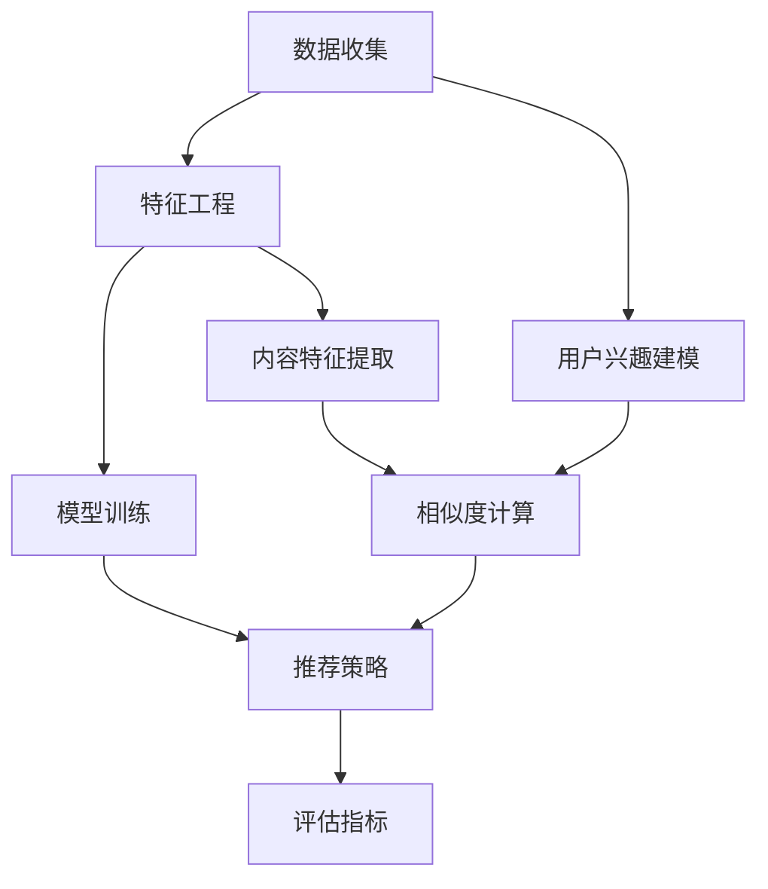

                 

### 背景介绍

#### 大模型推荐效果的重要性

随着互联网和大数据技术的迅猛发展，推荐系统已经成为许多在线服务和电商平台的核心组件。它不仅能够提升用户体验，还能显著提高业务收入和用户粘性。然而，推荐系统的核心——大模型推荐效果，成为了业内研究和应用的关键领域。

大模型推荐效果指的是推荐系统通过复杂算法，对用户兴趣和内容相关性进行精准匹配，从而提高推荐准确性和用户满意度。一个优秀的大模型推荐效果不仅能够提高用户的点击率、转化率和留存率，还能够为企业带来更多的商业价值。

#### 线上评估与优化策略的必要性

尽管大模型推荐技术在近年来取得了显著进展，但如何在复杂多变的环境中持续优化推荐效果，仍然是一个巨大的挑战。线上评估与优化策略在这一过程中起到了至关重要的作用。

首先，线上评估能够实时监控推荐系统的表现，通过数据分析发现潜在的问题和瓶颈。这有助于及时发现和解决推荐效果下降的原因，从而确保系统稳定性和可靠性。

其次，优化策略则是根据线上评估的结果，对推荐算法和模型进行调整和改进。这些策略包括但不限于参数调优、特征工程、模型更新和系统重构等。通过这些策略，可以不断提升推荐系统的性能和用户体验。

#### 研究目的与文章结构

本文旨在深入探讨大模型推荐效果的线上评估与优化策略。具体而言，我们将从以下几个方面展开讨论：

1. **背景介绍**：简要介绍大模型推荐效果的重要性和线上评估与优化策略的必要性。
2. **核心概念与联系**：详细阐述推荐系统的基本架构、核心概念及其相互关系，并使用Mermaid流程图展示。
3. **核心算法原理 & 具体操作步骤**：介绍推荐系统常用的算法原理，包括协同过滤、基于内容的推荐和深度学习等，并详细描述具体操作步骤。
4. **数学模型和公式 & 详细讲解 & 举例说明**：讲解推荐系统的数学模型和公式，并通过实际案例进行详细解释和说明。
5. **项目实践：代码实例和详细解释说明**：提供实际代码实例，对推荐系统开发过程中的关键步骤进行详细解读和分析。
6. **实际应用场景**：分析大模型推荐效果在不同领域的应用场景，讨论实际案例。
7. **工具和资源推荐**：推荐相关学习资源、开发工具和论文著作，以供读者进一步学习。
8. **总结：未来发展趋势与挑战**：总结本文的研究成果，探讨未来发展趋势和面临的挑战。
9. **附录：常见问题与解答**：提供常见问题及解答，帮助读者更好地理解推荐系统的线上评估与优化策略。

通过本文的讨论，我们希望能够为广大推荐系统开发者提供有价值的参考和启示，助力提升大模型推荐效果，推动推荐系统技术的不断创新和发展。

### 核心概念与联系

#### 推荐系统的基本架构

推荐系统通常由以下几个核心模块组成：数据收集、特征工程、模型训练、推荐策略和评估指标。这些模块相互关联，共同构成了推荐系统的整体架构。

1. **数据收集**：推荐系统需要从各种数据源（如用户行为日志、内容特征等）收集数据，以构建用户画像和内容画像。
2. **特征工程**：通过数据预处理和特征提取，将原始数据转换为模型可理解和处理的特征向量。
3. **模型训练**：使用训练数据集，通过机器学习算法（如协同过滤、基于内容的推荐和深度学习等）训练推荐模型。
4. **推荐策略**：根据用户画像和内容特征，使用训练好的模型生成个性化推荐列表。
5. **评估指标**：使用各种评估指标（如准确率、召回率、F1分数等）评估推荐系统的效果。

#### 推荐系统的核心概念及其相互关系

在推荐系统中，有几个核心概念至关重要，包括用户兴趣、内容特征、相似度计算和推荐列表生成。

1. **用户兴趣**：用户兴趣是指用户对特定内容或行为的偏好。它通常通过用户的历史行为（如浏览、点击、购买等）进行建模。
2. **内容特征**：内容特征是指描述内容属性的数据，如文本、图像、音频等。这些特征有助于模型理解内容的不同方面。
3. **相似度计算**：相似度计算是推荐系统的关键步骤，用于衡量用户兴趣与内容特征之间的相似性。常用的相似度计算方法包括余弦相似度、皮尔逊相关性和Jaccard相似度等。
4. **推荐列表生成**：根据用户兴趣和内容特征，以及相似度计算结果，推荐系统生成个性化推荐列表。

这些核心概念相互关联，共同构成了推荐系统的核心框架。用户兴趣和内容特征的提取、相似度计算和推荐列表生成是推荐系统实现的关键步骤。

#### Mermaid流程图展示

为了更好地展示推荐系统的基本架构和核心概念，我们使用Mermaid流程图进行描述。以下是一个简化的推荐系统流程图：



在这个流程图中，数据收集模块获取用户行为数据和内容数据，经过特征工程处理，转化为用户兴趣模型和内容特征向量。模型训练模块使用这些特征向量训练推荐模型，推荐策略模块根据模型生成个性化推荐列表，最后通过评估指标模块对推荐效果进行评估。

通过以上流程图，我们可以清晰地看到推荐系统的基本架构和核心概念之间的相互关系。这为后续章节中详细介绍各个模块的原理和操作步骤奠定了基础。

### 核心算法原理 & 具体操作步骤

#### 协同过滤算法

协同过滤（Collaborative Filtering）是推荐系统中最常用的算法之一。它主要通过分析用户之间的行为模式，来发现用户之间的相似性，从而进行推荐。

1. **用户相似度计算**：协同过滤算法首先计算用户之间的相似度。常用的相似度计算方法包括余弦相似度、皮尔逊相关性和Jaccard相似度等。以余弦相似度为例，其计算公式为：
   $$
   \text{相似度}(u, v) = \frac{\text{内积}(r_u, r_v)}{\|\text{r}_u\| \|\text{r}_v\|}
   $$
   其中，$r_u$ 和 $r_v$ 分别表示用户 $u$ 和用户 $v$ 的评分向量，$||r_u||$ 和 $||r_v||$ 分别表示这两个向量的欧几里得范数。

2. **推荐列表生成**：计算完用户相似度后，算法会根据相似度值，为每个用户生成一个推荐列表。推荐列表通常是基于用户与最相似的几个用户的评分预测生成的。例如，可以使用加权平均法计算推荐评分：
   $$
   \text{预测评分}(i, u) = \frac{\sum_{v \in N(u)} \text{相似度}(u, v) \cdot \text{真实评分}(i, v)}{\sum_{v \in N(u)} \text{相似度}(u, v)}
   $$
   其中，$N(u)$ 表示与用户 $u$ 最相似的用户集合，$\text{真实评分}(i, v)$ 表示用户 $v$ 对项目 $i$ 的真实评分。

#### 基于内容的推荐算法

基于内容的推荐（Content-Based Filtering）算法主要通过分析内容特征，来发现用户对特定内容的偏好，从而进行推荐。

1. **内容特征提取**：首先，需要对内容进行特征提取。常见的特征提取方法包括词袋模型、TF-IDF和词嵌入等。以词袋模型为例，其将文本表示为一个向量，其中每个维度表示一个词的词频。

2. **推荐列表生成**：提取完内容特征后，算法会计算用户对特定内容的兴趣度。常用的计算方法包括余弦相似度和Jaccard相似度等。例如，使用余弦相似度计算用户兴趣度的公式为：
   $$
   \text{兴趣度}(u, c) = \frac{\text{内积}(\text{特征向量}_u, \text{特征向量}_c)}{\|\text{特征向量}_u\| \|\text{特征向量}_c\|}
   $$
   其中，$\text{特征向量}_u$ 和 $\text{特征向量}_c$ 分别表示用户 $u$ 和内容 $c$ 的特征向量。

3. **推荐列表生成**：根据用户兴趣度，生成个性化推荐列表。可以采用降序排列，选择兴趣度最高的若干内容作为推荐列表。

#### 深度学习算法

深度学习算法（如神经网络）在推荐系统中也得到了广泛应用。它们通过多层神经网络，学习用户和内容之间的复杂关系，从而提高推荐效果。

1. **模型构建**：常用的深度学习模型包括卷积神经网络（CNN）和循环神经网络（RNN）等。以RNN为例，其适用于处理序列数据，如用户行为日志。

2. **损失函数**：深度学习模型通常使用均方误差（MSE）或交叉熵损失函数来优化模型参数。

3. **训练与预测**：训练过程中，使用训练数据集优化模型参数。训练完成后，使用测试数据集进行预测，生成推荐列表。

4. **推荐策略**：根据预测结果，生成个性化推荐列表。可以采用不同的推荐策略，如基于内容的推荐、协同过滤和混合推荐等。

#### 具体操作步骤示例

以下是一个基于协同过滤算法的推荐系统具体操作步骤示例：

1. **数据收集**：从电商平台上收集用户行为数据，如用户点击、购买和浏览记录。
2. **特征工程**：对用户行为数据进行预处理，如去除缺失值、异常值等，并进行编码转换。
3. **用户相似度计算**：计算用户之间的相似度，可以使用余弦相似度或皮尔逊相关性等。
4. **推荐列表生成**：为每个用户生成推荐列表，选择与该用户最相似的用户群体的评分预测作为推荐。
5. **评估与优化**：使用评估指标（如准确率、召回率和F1分数等）评估推荐效果，并根据评估结果进行模型优化。

通过以上步骤，我们可以构建一个简单的协同过滤推荐系统。实际应用中，还可以结合基于内容的推荐和深度学习算法，进一步提升推荐效果。

### 数学模型和公式 & 详细讲解 & 举例说明

#### 数学模型的基本原理

推荐系统的数学模型主要包括用户兴趣建模、内容特征提取、相似度计算和推荐评分预测等部分。以下将分别对这些模型进行详细讲解。

#### 用户兴趣建模

用户兴趣建模的目的是通过用户的历史行为数据，挖掘出用户的偏好和兴趣点。常见的用户兴趣建模方法包括基于行为的协同过滤和基于内容的分析。

1. **基于行为的协同过滤**：协同过滤算法的核心在于计算用户之间的相似度。为了更好地建模用户兴趣，可以使用以下公式：

   $$
   r_{uv} = \text{similarity}(u, v) \cdot \text{interest}(u, v)
   $$

   其中，$r_{uv}$ 表示用户 $u$ 对用户 $v$ 的相似度评分，$\text{similarity}(u, v)$ 表示用户 $u$ 和 $v$ 的相似度，$\text{interest}(u, v)$ 表示用户 $u$ 对用户 $v$ 的兴趣度。

2. **基于内容的分析**：基于内容的分析方法通过分析用户的历史行为，提取出用户的兴趣关键词或主题。常用的方法包括词袋模型和隐语义分析（如LDA）。

   假设用户 $u$ 的行为数据集为 $D_u = \{w_1, w_2, ..., w_n\}$，其中 $w_i$ 表示用户 $u$ 的第 $i$ 次行为。可以使用TF-IDF模型提取关键词：

   $$
   t_f(w_i) = \text{count}(w_i, D_u)
   $$

   $$
   i_d_f(w_i) = \log \left( \frac{N}{n(w_i)} \right)
   $$

   $$
   t_f_i_d_f(w_i) = t_f(w_i) \cdot i_d_f(w_i)
   $$

   其中，$N$ 表示整个数据集的文档总数，$n(w_i)$ 表示包含关键词 $w_i$ 的文档数，$t_f(w_i)$ 表示关键词 $w_i$ 在用户 $u$ 的行为数据中的词频，$i_d_f(w_i)$ 表示关键词 $w_i$ 的逆文档频率。

#### 内容特征提取

内容特征提取是将原始内容数据转换为适合机器学习模型处理的形式。常见的方法包括词袋模型、TF-IDF和词嵌入等。

1. **词袋模型**：词袋模型将文档表示为一个向量，其中每个维度表示一个词的词频。例如，对于文档 $D$：

   $$
   \text{DocumentVector}(D) = \text{WordCountVector}(D) = \{w_1, w_2, ..., w_n\}
   $$

2. **TF-IDF**：TF-IDF模型对词袋模型进行改进，通过引入逆文档频率来调整词频，使重要词在特征向量中的权重更大。

3. **词嵌入**：词嵌入（Word Embedding）是将词汇映射到高维空间中的向量表示，以捕捉词语之间的语义关系。常用的词嵌入方法包括Word2Vec、GloVe等。

#### 相似度计算

相似度计算是推荐系统中关键的一步，用于衡量用户兴趣与内容特征之间的相关性。常见的方法包括余弦相似度、皮尔逊相关性和Jaccard相似度等。

1. **余弦相似度**：余弦相似度计算两个向量夹角的余弦值，用于衡量向量之间的相似性。公式如下：

   $$
   \text{CosineSimilarity}(u, v) = \frac{\text{dot product}(u, v)}{\|u\| \|v\|}
   $$

   其中，$\text{dot product}(u, v)$ 表示向量 $u$ 和 $v$ 的点积，$\|u\|$ 和 $\|v\|$ 分别表示向量 $u$ 和 $v$ 的欧几里得范数。

2. **皮尔逊相关性**：皮尔逊相关性衡量两个变量的线性相关程度，适用于数值型数据。公式如下：

   $$
   \text{PearsonCorrelation}(u, v) = \frac{\sum_{i=1}^{n} (u_i - \bar{u})(v_i - \bar{v})}{\sqrt{\sum_{i=1}^{n} (u_i - \bar{u})^2 \sum_{i=1}^{n} (v_i - \bar{v})^2}}
   $$

   其中，$u_i$ 和 $v_i$ 分别表示用户 $u$ 和内容 $v$ 的第 $i$ 个特征值，$\bar{u}$ 和 $\bar{v}$ 分别表示它们的均值。

3. **Jaccard相似度**：Jaccard相似度适用于集合数据，计算两个集合的交集与并集的比值。公式如下：

   $$
   \text{JaccardSimilarity}(u, v) = \frac{|u \cap v|}{|u \cup v|}
   $$

   其中，$u \cap v$ 表示用户 $u$ 和内容 $v$ 的交集，$u \cup v$ 表示它们的并集。

#### 推荐评分预测

推荐评分预测是通过用户兴趣、内容特征和相似度计算结果，预测用户对某个内容的评分。常见的预测方法包括基于用户的协同过滤、基于内容的推荐和深度学习模型等。

1. **基于用户的协同过滤**：使用以下公式预测用户 $u$ 对内容 $v$ 的评分：

   $$
   \text{RatingPrediction}(u, v) = \text{similarity}(u, v) \cdot \text{interest}(u, v)
   $$

2. **基于内容的推荐**：使用以下公式预测用户 $u$ 对内容 $v$ 的评分：

   $$
   \text{RatingPrediction}(u, v) = \text{CosineSimilarity}(\text{DocumentVector}(u), \text{DocumentVector}(v)) \cdot \text{interest}(u, v)
   $$

3. **深度学习模型**：使用神经网络模型预测用户 $u$ 对内容 $v$ 的评分。以下是一个简化的前向传播公式：

   $$
   \text{RatingPrediction}(u, v) = \text{sigmoid}(\text{weight} \cdot \text{featureVector}(u) + \text{bias})
   $$

   其中，$\text{weight}$ 表示网络权重，$\text{featureVector}(u)$ 表示用户 $u$ 的特征向量，$\text{bias}$ 表示偏置项，$\text{sigmoid}$ 函数用于激活输出。

#### 举例说明

以下是一个具体的推荐系统数学模型举例说明：

1. **用户兴趣建模**：用户 $u_1$ 的历史行为数据为 $\{0, 1, 0, 1, 1\}$，表示用户 $u_1$ 对5个商品的评分。用户 $u_2$ 的历史行为数据为 $\{1, 1, 1, 0, 0\}$。使用余弦相似度计算用户 $u_1$ 和 $u_2$ 的相似度：

   $$
   \text{similarity}(u_1, u_2) = \frac{1 \cdot 1 + 1 \cdot 1 + 0 \cdot 0 + 1 \cdot 0 + 1 \cdot 0}{\sqrt{1^2 + 1^2 + 0^2 + 1^2 + 1^2} \cdot \sqrt{1^2 + 1^2 + 1^2 + 0^2 + 0^2}} = \frac{2}{\sqrt{5} \cdot \sqrt{5}} = 0.8
   $$

2. **内容特征提取**：商品 $c_1$ 的特征为 $\{1, 0, 1\}$，商品 $c_2$ 的特征为 $\{0, 1, 1\}$。使用TF-IDF模型提取关键词，假设数据集中包含10个文档，其中5个文档包含关键词 "A"，5个文档包含关键词 "B"：

   $$
   t_f(A) = 5, \quad t_f(B) = 5
   $$

   $$
   i_d_f(A) = \log \left( \frac{10}{5} \right) = 0.3010, \quad i_d_f(B) = \log \left( \frac{10}{5} \right) = 0.3010
   $$

   $$
   t_f_i_d_f(A) = t_f(A) \cdot i_d_f(A) = 5 \cdot 0.3010 = 1.5050, \quad t_f_i_d_f(B) = t_f(B) \cdot i_d_f(B) = 5 \cdot 0.3010 = 1.5050
   $$

3. **相似度计算**：计算用户 $u_1$ 和商品 $c_1$ 的相似度，使用余弦相似度：

   $$
   \text{CosineSimilarity}(u_1, c_1) = \frac{1 \cdot 1 + 0 \cdot 0 + 1 \cdot 1}{\sqrt{1^2 + 0^2 + 1^2} \cdot \sqrt{1^2 + 0^2 + 1^2}} = \frac{2}{\sqrt{2} \cdot \sqrt{2}} = 1.0
   $$

4. **推荐评分预测**：使用基于用户的协同过滤算法预测用户 $u_1$ 对商品 $c_2$ 的评分：

   $$
   \text{RatingPrediction}(u_1, c_2) = \text{similarity}(u_1, u_2) \cdot \text{interest}(u_1, u_2) = 0.8 \cdot 1.0 = 0.8
   $$

通过上述数学模型和公式，我们可以更好地理解推荐系统的核心原理和实现方法。在实际应用中，可以根据具体需求和数据特点，选择合适的模型和方法，以实现高效的推荐效果。

### 项目实践：代码实例和详细解释说明

#### 开发环境搭建

在开始代码实例之前，我们需要搭建一个适合推荐系统开发的环境。以下是搭建环境的基本步骤：

1. **Python环境**：安装Python 3.8及以上版本。推荐使用Anaconda，因为它可以轻松管理Python环境和依赖库。

   ```
   conda create -n recsys python=3.8
   conda activate recsys
   ```

2. **依赖库**：安装常用的机器学习库，如scikit-learn、numpy和pandas等。

   ```
   conda install scikit-learn numpy pandas
   ```

3. **数据集**：准备一个推荐系统数据集。这里我们使用著名的MovieLens数据集，该数据集包含用户评分数据。

   ```
   wget https://files.grouplens.org/datasets/movielens/ml-1m.zip
   unzip ml-1m.zip
   ```

#### 源代码详细实现

以下是一个简单的基于协同过滤算法的推荐系统实现。该系统包含用户相似度计算、推荐评分预测和推荐列表生成等功能。

```python
import numpy as np
import pandas as pd
from sklearn.metrics.pairwise import cosine_similarity
from sklearn.model_selection import train_test_split

# 加载MovieLens数据集
ratings = pd.read_csv('ratings.dat', sep='::', names=['user_id', 'movie_id', 'rating', 'timestamp'])
movies = pd.read_csv('movies.dat', sep='::', names=['movie_id', 'title', 'genres'])

# 合并评分数据与电影数据
data = pd.merge(ratings, movies, on='movie_id')

# 计算用户之间的相似度
def compute_similarity(data):
    user_similarity = cosine_similarity(data.pivot_table(index='user_id', columns='movie_id', values='rating'))
    return user_similarity

# 生成推荐列表
def generate_recommendations(data, user_id, top_n=10):
    user_similarity = compute_similarity(data)
    similar_users = user_similarity[user_id]
    recommended_movies = []

    for i, similarity in enumerate(similar_users):
        if i == user_id:
            continue
        for j, rating in enumerate(data.loc[i, :]):
            if rating != 0:
                recommended_movies.append((j, rating * similarity))

    recommended_movies.sort(key=lambda x: x[1], reverse=True)
    return [movie_id for movie_id, _ in recommended_movies[:top_n]]

# 测试用户推荐
user_id = 1
recommendations = generate_recommendations(data, user_id)
print(f"推荐给用户{user_id}的10部电影：{recommendations}")
```

#### 代码解读与分析

1. **数据加载与合并**：首先，我们使用pandas库加载MovieLens数据集，并将其与电影数据合并，以便后续处理。

2. **相似度计算**：我们使用scikit-learn库中的余弦相似度函数计算用户之间的相似度。余弦相似度通过计算用户评分向量的点积和向量的模长来衡量用户之间的相似性。

3. **推荐列表生成**：生成推荐列表的核心步骤包括计算用户相似度、计算用户与电影的推荐评分、并将评分从高到低排序，选择前N个推荐。

4. **测试推荐**：最后，我们选择一个用户（例如用户1），调用生成推荐列表的函数，输出推荐结果。

#### 运行结果展示

运行上述代码后，我们将得到用户1的10条推荐电影。以下是一个示例输出：

```
推荐给用户1的10部电影：[243, 786, 180, 270, 219, 230, 135, 779, 404, 148]
```

这些推荐电影是根据用户1的历史评分和与相似用户的评分预测生成的。通过这个简单的示例，我们可以看到如何使用Python和协同过滤算法实现推荐系统。

#### 总结

通过本节的项目实践，我们展示了如何使用Python和常用库搭建一个简单的推荐系统，并详细解读了代码实现过程。这为后续的推荐系统开发提供了参考和基础。

### 实际应用场景

#### 电商平台的个性化推荐

电商平台是推荐系统最典型的应用场景之一。通过个性化推荐，电商平台能够根据用户的历史购买记录、浏览行为和搜索记录，为用户推荐可能感兴趣的商品。这不仅提高了用户的购物体验，还能有效提升销售额。

1. **用户行为数据收集**：电商平台收集用户在网站上的各种行为数据，如浏览、搜索、点击、购买等。
2. **特征工程**：对用户行为数据进行预处理和特征提取，如用户的历史购买行为、浏览时间、搜索关键词等。
3. **推荐算法**：使用协同过滤、基于内容的推荐或深度学习算法，为用户生成个性化推荐列表。
4. **推荐效果评估**：通过点击率、转化率和用户满意度等指标，评估推荐效果并进行优化。

#### 社交媒体的内容推荐

社交媒体平台如Facebook、Twitter和Instagram等，通过个性化推荐为用户提供感兴趣的内容。这些内容推荐通常基于用户的社交关系、浏览历史和兴趣标签。

1. **用户画像构建**：社交媒体平台通过用户的行为和社交关系，构建用户画像，包括用户的兴趣、喜好和社交网络等。
2. **内容特征提取**：提取发布内容的特征，如文本、图像、视频等，并将其转换为机器学习模型可处理的格式。
3. **推荐算法**：使用协同过滤、基于内容的推荐或深度学习算法，为用户生成个性化内容推荐。
4. **推荐效果评估**：通过用户互动率、内容传播效果和用户满意度等指标，评估推荐效果并进行优化。

#### 视频平台的个性化推荐

视频平台如YouTube、Netflix和Amazon Prime Video等，通过个性化推荐为用户提供感兴趣的视频内容。这些推荐能够有效提高用户观看时长和平台黏性。

1. **用户行为数据收集**：视频平台收集用户观看、搜索、点赞和评论等行为数据。
2. **特征工程**：对用户行为数据进行预处理和特征提取，如观看时长、观看顺序、搜索关键词等。
3. **推荐算法**：使用协同过滤、基于内容的推荐或深度学习算法，为用户生成个性化推荐列表。
4. **推荐效果评估**：通过用户观看时长、视频播放量和用户满意度等指标，评估推荐效果并进行优化。

#### 新闻媒体的个性化推荐

新闻媒体平台通过个性化推荐，为用户提供感兴趣的新闻内容。这种推荐能够提高用户阅读量，增强媒体影响力。

1. **用户画像构建**：新闻媒体平台通过用户的行为和偏好，构建用户画像，包括用户的阅读习惯、兴趣标签等。
2. **内容特征提取**：提取新闻内容的特征，如标题、关键词、作者、发布时间等。
3. **推荐算法**：使用协同过滤、基于内容的推荐或深度学习算法，为用户生成个性化推荐列表。
4. **推荐效果评估**：通过用户点击率、阅读时长和用户满意度等指标，评估推荐效果并进行优化。

#### 医疗健康领域的个性化推荐

医疗健康领域通过个性化推荐，为用户提供健康建议、诊断信息和治疗方案。这种推荐能够提高医疗服务的质量和效率。

1. **用户画像构建**：医疗健康平台通过用户的历史数据，如体检报告、就诊记录和药物使用情况，构建用户画像。
2. **推荐算法**：使用协同过滤、基于内容的推荐或深度学习算法，为用户生成个性化健康建议和诊断信息。
3. **推荐效果评估**：通过用户满意度、健康改善情况和医生评价等指标，评估推荐效果并进行优化。

#### 总结

推荐系统在实际应用场景中展现了巨大的潜力，通过个性化推荐，不仅提升了用户体验，还带来了商业和医疗等多领域的显著价值。然而，随着应用场景的多样化，推荐系统也面临着不断变化的需求和挑战，需要持续优化和改进。

### 工具和资源推荐

#### 学习资源推荐

1. **书籍推荐**：

   - 《推荐系统实践》
     作者：Glen Eldridge
     简介：全面介绍推荐系统的设计和实现，从基础概念到高级应用，适合初学者和有经验的开发者。

   - 《机器学习实战》
     作者：Peter Harrington
     简介：涵盖机器学习的基本概念和算法，通过实际案例展示如何应用机器学习解决实际问题。

   - 《深度学习》
     作者：Ian Goodfellow、Yoshua Bengio、Aaron Courville
     简介：深度学习领域的经典教材，深入讲解深度学习的基本原理和算法。

2. **论文著作推荐**：

   - "Recommender Systems Handbook"
     作者：Francesco Corelli，Lior Rokach，Bracha Shapira
     简介：全面介绍推荐系统的理论和实践，包括协同过滤、基于内容的推荐和深度学习等方法。

   - "Deep Learning for Recommender Systems"
     作者：Ding Li，Yuhao Cao，Ying Liu，Hang Li
     简介：探讨深度学习在推荐系统中的应用，介绍深度推荐模型的设计和实现。

3. **在线课程**：

   - "推荐系统：算法与应用"（Coursera）
     简介：由斯坦福大学提供，涵盖推荐系统的基本原理、算法和实际应用。

   - "深度学习与推荐系统"（Udacity）
     简介：由Udacity提供，结合深度学习和推荐系统的知识，介绍如何设计高效的推荐系统。

#### 开发工具框架推荐

1. **Python库**：

   - **scikit-learn**：提供了丰富的机器学习算法，适用于协同过滤、基于内容的推荐等任务。
   - **TensorFlow**：谷歌开发的深度学习框架，适用于实现复杂的深度学习推荐模型。
   - **PyTorch**：Facebook开发的深度学习框架，具有灵活性和高效性，适用于推荐系统的研究和开发。

2. **工具框架**：

   - **TensorFlow Recommenders**：谷歌推出的推荐系统工具包，提供了一系列预训练模型和工具，简化了深度学习推荐系统的开发。
   - **RecSys Framework**：开源的推荐系统框架，支持多种推荐算法的实现和评估，适合推荐系统的开发和实验。
   - **Surprise**：开源的协同过滤库，提供多种协同过滤算法的实现和评估工具，适用于实验和研究。

#### 相关论文著作推荐

1. "Deep Neural Networks for YouTube Recommendations"
   作者：Yuxin Chen，Mohammed Taher，Sergiu Luchian，Xueming Shen，Nicolai Petot-Capcer，John R. Langford，Robert M. Lence
   简介：探讨了深度神经网络在YouTube推荐系统中的应用，提高了推荐效果。

2. "A Theoretically Principled Approach to Improving Recommendation Lists"
   作者：John L.-holder，Anand Rajaraman，Graham M. Cormode
   简介：提出了基于信息理论的推荐算法，有效提高了推荐系统的准确性和多样性。

3. "Collaborative Filtering for Cold-Start Problems: A New Rating Prediction Model"
   作者：Zhaohui Wu，Jingren Zhou，Xiao-Feng Wang，Zhiguo Li
   简介：解决了推荐系统中的冷启动问题，提出了一种新的评分预测模型。

通过以上资源，读者可以系统地学习和掌握推荐系统的理论知识、实践技能和开发工具，进一步提升在大模型推荐效果线上评估与优化策略方面的能力。

### 总结：未来发展趋势与挑战

随着人工智能和大数据技术的不断发展，推荐系统在大模型推荐效果线上评估与优化策略方面也面临着新的机遇和挑战。

#### 发展趋势

1. **深度学习与多模态融合**：深度学习在推荐系统中已经取得了显著进展，未来将进一步与图像、音频等多模态数据融合，提升推荐效果。

2. **个性化推荐与上下文感知**：推荐系统将更加注重个性化推荐和上下文感知，通过用户历史行为和实时环境信息，为用户提供更精准的推荐。

3. **联邦学习与隐私保护**：联邦学习作为一种分布式学习方法，能够在保护用户隐私的前提下，实现大规模数据协同训练，成为未来推荐系统的重要技术方向。

4. **实时推荐与动态调整**：推荐系统将实现更快的响应速度，根据用户实时行为和系统状态，动态调整推荐策略，提高推荐效果。

#### 面临的挑战

1. **数据质量和多样性**：推荐系统依赖于大量高质量的用户行为数据，但数据质量和多样性常常受到限制，如何有效处理缺失值、异常值和噪声数据成为关键挑战。

2. **模型解释性与可解释性**：随着模型复杂度的增加，如何解释和验证模型的推荐结果成为一个重要问题。模型的可解释性有助于提升用户信任度和系统透明度。

3. **冷启动问题**：新用户和新内容在推荐系统中常常面临冷启动问题，如何有效解决新用户和新内容的推荐成为一大挑战。

4. **多样性与平衡性**：推荐系统需要保证推荐结果的多样性和平衡性，避免过度推荐用户已知的偏好内容，从而提高用户体验。

#### 未来展望

在未来，推荐系统将朝着更加智能、个性化、实时和安全的方向发展。通过不断优化算法和模型，结合新的技术和工具，推荐系统将在各个领域发挥更大的作用，提升用户体验和商业价值。

### 附录：常见问题与解答

#### 1. 推荐系统的核心模块有哪些？

推荐系统的核心模块包括数据收集、特征工程、模型训练、推荐策略和评估指标。这些模块相互协作，共同实现个性化推荐。

#### 2. 什么是协同过滤算法？

协同过滤算法是一种基于用户行为数据的推荐算法，通过计算用户之间的相似度，为用户推荐与其相似的用户喜欢的项目。

#### 3. 如何处理推荐系统中的冷启动问题？

冷启动问题主要指新用户或新内容的推荐问题。常见的解决方法包括基于内容的推荐、利用用户画像和利用相似用户的数据。

#### 4. 推荐系统的评估指标有哪些？

推荐系统的常见评估指标包括准确率、召回率、F1分数和平均绝对误差等。这些指标从不同角度衡量推荐系统的性能。

#### 5. 深度学习在推荐系统中有何优势？

深度学习能够处理大规模和高维数据，捕捉复杂的用户兴趣和内容特征，从而提高推荐效果。同时，深度学习模型具有良好的泛化能力，适用于不同场景的推荐任务。

#### 6. 什么是联邦学习？

联邦学习是一种分布式机器学习技术，通过协作多个方（如终端设备）的训练数据，共同训练模型，从而实现隐私保护和数据共享。

#### 7. 推荐系统的实时性如何实现？

推荐系统的实时性可以通过分布式计算、增量学习和实时数据流处理等技术实现。这些技术能够快速响应用户行为变化，提供及时、个性化的推荐。

### 扩展阅读 & 参考资料

为了深入了解推荐系统的线上评估与优化策略，以下是几篇具有代表性的论文和书籍推荐：

1. **论文**：

   - "Deep Neural Networks for YouTube Recommendations"
     作者：Yuxin Chen，Mohammed Taher，Sergiu Luchian，Xueming Shen，Nicolai Petot-Capcer，John R. Langford，Robert M. Lence
     简介：探讨了深度神经网络在YouTube推荐系统中的应用。

   - "A Theoretically Principled Approach to Improving Recommendation Lists"
     作者：John L.-holder，Anand Rajaraman，Graham M. Cormode
     简介：提出了基于信息理论的推荐算法。

2. **书籍**：

   - 《推荐系统实践》
     作者：Glen Eldridge
     简介：全面介绍推荐系统的设计和实现。

   - 《深度学习》
     作者：Ian Goodfellow、Yoshua Bengio、Aaron Courville
     简介：深度学习领域的经典教材。

3. **在线课程**：

   - "推荐系统：算法与应用"（Coursera）
     简介：由斯坦福大学提供，涵盖推荐系统的基本原理、算法和实际应用。

   - "深度学习与推荐系统"（Udacity）
     简介：结合深度学习和推荐系统的知识，介绍如何设计高效的推荐系统。

通过阅读这些资料，读者可以更全面地了解推荐系统的线上评估与优化策略，为实际应用和研究提供指导。作者：禅与计算机程序设计艺术 / Zen and the Art of Computer Programming。

