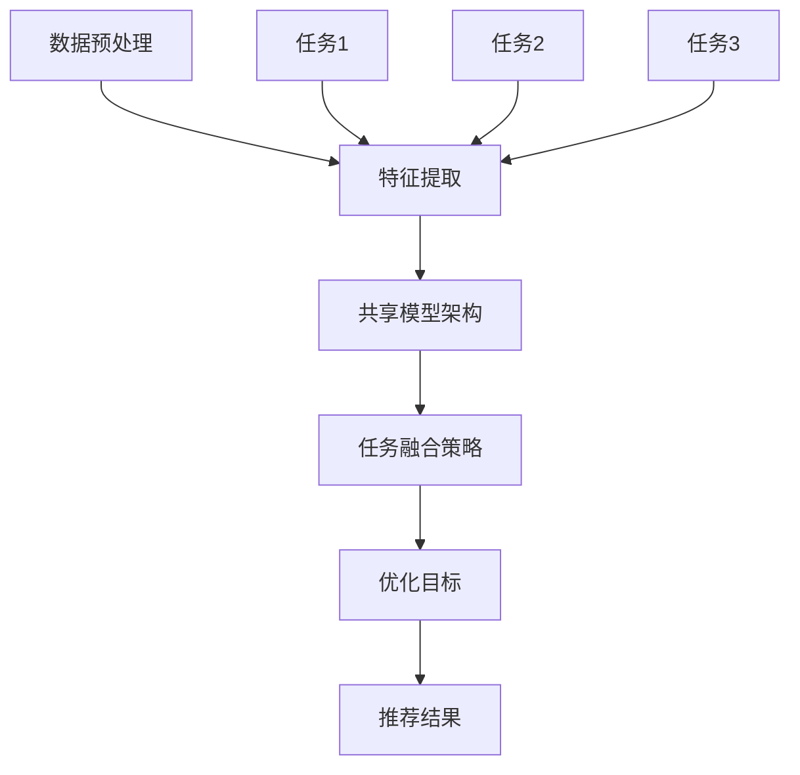

                 

### 1. 背景介绍

随着互联网技术的飞速发展，推荐系统已经成为现代信息社会中不可或缺的一部分。它通过预测用户对某些项目的潜在兴趣，为用户提供个性化推荐，从而提高用户的满意度与平台的黏性。传统推荐系统主要依赖于协同过滤、基于内容的推荐和基于模型的推荐等方法，但这些方法往往存在一些局限性。

大模型推荐系统的出现，为推荐系统的发展带来了新的契机。大模型推荐系统通过深度学习等技术，可以从海量数据中提取特征，并利用这些特征进行精准推荐。然而，大模型推荐系统也面临一些挑战，如数据噪声、特征冗余以及计算资源的限制等问题。为了解决这些问题，多任务学习（Multi-Task Learning, MTL）被引入到推荐系统中。

多任务学习旨在通过同时学习多个相关任务，提高模型的泛化能力和效率。在推荐系统中，多任务学习可以帮助模型同时预测用户对不同类型项目的兴趣，从而提高推荐的质量。本文将围绕大模型推荐系统的多任务学习框架，详细探讨其核心概念、算法原理、数学模型、项目实践以及未来发展趋势。

本文的结构如下：首先，我们介绍大模型推荐系统的多任务学习框架的背景和重要性；然后，我们详细解释多任务学习的基本概念和框架；接着，我们探讨大模型推荐系统中多任务学习的关键技术，包括算法原理、具体操作步骤、数学模型和公式；随后，我们通过一个具体的代码实例展示如何实现多任务学习框架；最后，我们讨论多任务学习在实际应用场景中的效果，并提供一些相关工具和资源推荐，总结未来发展趋势与挑战。

通过本文的探讨，我们希望读者能够对大模型推荐系统的多任务学习框架有一个全面而深入的理解，并能够在实际项目中应用这些技术，提高推荐系统的性能和用户体验。

### 2. 核心概念与联系

#### 多任务学习的基本概念

多任务学习（Multi-Task Learning, MTL）是一种机器学习范式，旨在同时学习多个相关的任务。相比于传统的单一任务学习，多任务学习通过共享表示和参数，能够提高模型的泛化能力、降低训练成本，并改善任务间的性能。多任务学习的基本思想是利用不同任务之间的相关性，通过共享信息来优化整体性能。

在多任务学习中，任务可以是分类、回归或 rankings 等不同类型。每个任务都有自己的目标函数，但共享同一个模型参数。这种共享机制使得模型可以在多个任务上同时进行训练，从而提高模型的泛化能力和效率。具体来说，多任务学习可以分为三种类型：

1. **分类任务**：如图像分类、文本分类等。
2. **回归任务**：如房价预测、股票价格预测等。
3. **rankings 任务**：如推荐系统中的排序问题。

#### 大模型推荐系统的多任务学习框架

大模型推荐系统的多任务学习框架通过同时学习多个推荐任务，提高推荐的质量和用户体验。该框架主要包括以下几个核心概念和组成部分：

1. **数据预处理**：对原始数据进行清洗、归一化、编码等处理，为后续的多任务学习做好准备。
2. **特征提取**：利用深度学习等技术，从原始数据中提取高维、抽象的特征表示。
3. **共享模型架构**：设计一个共享模型架构，使多个推荐任务可以共享表示和参数。
4. **任务融合策略**：通过融合不同任务的特征和预测结果，生成最终的推荐结果。
5. **优化目标**：定义一个综合性的优化目标，同时优化多个任务的性能。

#### Mermaid 流程图表示

下面是一个使用 Mermaid 语言描述的多任务学习框架的流程图，展示了各个核心概念和组件之间的联系：



在上述流程图中，数据预处理阶段对原始数据进行处理，特征提取阶段利用深度学习技术提取特征，共享模型架构阶段设计一个多任务共享模型，任务融合策略阶段融合不同任务的特征和预测结果，优化目标阶段定义一个综合性的优化目标，最终生成推荐结果。

#### 多任务学习在推荐系统中的应用

多任务学习在推荐系统中的应用主要表现在以下几个方面：

1. **跨类别推荐**：同时学习不同类别项目的推荐任务，如同时预测用户对电影、音乐和书籍的兴趣。
2. **上下文感知推荐**：结合用户的历史行为和当前上下文信息，为用户提供更加个性化的推荐。
3. **预测误差补偿**：通过多任务学习，利用不同任务的预测结果补偿单一任务的预测误差。

#### 小结

多任务学习通过同时学习多个相关任务，提高了推荐系统的性能和用户体验。在大模型推荐系统中，多任务学习框架通过共享模型架构和任务融合策略，实现了不同推荐任务的高效协同。本文将在接下来的章节中详细探讨多任务学习的算法原理、数学模型和具体实现方法，帮助读者更好地理解并应用这一技术。

### 3. 核心算法原理 & 具体操作步骤

#### 多任务学习算法原理

多任务学习（MTL）的核心在于通过共享模型架构和优化目标，同时训练多个相关任务，以提高模型的泛化能力和效率。在推荐系统中，多任务学习可以帮助模型同时预测用户对不同类型项目的兴趣，从而提高推荐的质量。

多任务学习的算法原理可以概括为以下几个关键步骤：

1. **任务定义**：定义多个相关任务，如分类、回归和 rankings 任务。
2. **特征共享**：设计一个共享模型架构，使多个任务可以共享特征表示和参数。
3. **损失函数**：定义一个综合性的损失函数，同时优化多个任务的性能。
4. **模型训练**：使用梯度下降等优化算法，同时训练多个任务。
5. **结果融合**：融合不同任务的预测结果，生成最终的推荐结果。

#### 多任务学习框架的具体操作步骤

下面是一个具体的多任务学习框架的操作步骤，用于推荐系统中的用户兴趣预测：

1. **数据收集与预处理**：
   - 收集用户行为数据，包括用户点击、浏览、购买等行为。
   - 对数据进行清洗、归一化、编码等预处理操作。

2. **特征提取**：
   - 利用深度学习模型（如卷积神经网络、循环神经网络等）提取用户行为数据中的高维、抽象特征表示。

3. **任务定义**：
   - 定义多个相关任务，例如：
     - 任务1：预测用户对商品的点击概率。
     - 任务2：预测用户对商品的购买概率。
     - 任务3：为用户推荐商品，并进行排序。

4. **模型设计**：
   - 设计一个多任务共享模型架构，使不同任务可以共享特征表示和参数。
   - 例如，可以使用一个主神经网络，通过分支结构实现不同任务的预测。

5. **损失函数设计**：
   - 设计一个综合性的损失函数，同时优化多个任务的性能。
   - 例如，可以使用加权和的形式，将不同任务的损失合并成一个总损失。

6. **模型训练**：
   - 使用梯度下降等优化算法，同时训练多个任务。
   - 训练过程中，模型会不断调整参数，以最小化总损失函数。

7. **结果融合**：
   - 融合不同任务的预测结果，生成最终的推荐结果。
   - 例如，可以采用投票机制、加权融合等方法，综合不同任务的预测概率。

8. **推荐策略**：
   - 根据融合后的预测结果，制定推荐策略，为用户推荐感兴趣的商品。

#### 案例说明

假设我们有一个电商平台的推荐系统，需要同时预测用户对商品的点击、购买概率，并为用户推荐商品。具体操作步骤如下：

1. **数据收集与预处理**：
   - 收集用户的行为数据，包括用户点击、浏览、购买等行为。
   - 对数据进行清洗、归一化、编码等预处理操作。

2. **特征提取**：
   - 使用卷积神经网络提取用户行为数据中的高维、抽象特征表示。

3. **任务定义**：
   - 任务1：预测用户对商品的点击概率。
   - 任务2：预测用户对商品的购买概率。
   - 任务3：为用户推荐商品，并进行排序。

4. **模型设计**：
   - 设计一个多任务共享模型架构，使用一个主神经网络，通过分支结构实现不同任务的预测。

5. **损失函数设计**：
   - 使用二元交叉熵损失函数分别优化点击和购买概率预测。
   - 使用排序损失函数优化推荐排序。

6. **模型训练**：
   - 使用梯度下降算法，同时训练点击、购买概率预测和推荐排序任务。

7. **结果融合**：
   - 采用加权融合方法，将点击、购买概率预测结果和推荐排序结果综合，生成最终的推荐结果。

8. **推荐策略**：
   - 根据融合后的预测结果，为用户推荐感兴趣的商品。

通过上述操作步骤，我们可以实现一个高效的多任务学习推荐系统，提高推荐的准确性和用户体验。

#### 小结

多任务学习通过共享模型架构和优化目标，实现了多个相关任务的协同训练，提高了推荐系统的性能。本文介绍了多任务学习的核心算法原理和具体操作步骤，并通过案例说明了如何应用多任务学习进行用户兴趣预测。接下来，我们将进一步探讨多任务学习的数学模型和公式，以深入理解其内在机制。

### 4. 数学模型和公式 & 详细讲解 & 举例说明

#### 多任务学习的数学模型

多任务学习涉及多个任务的训练和优化，其数学模型主要围绕特征表示、损失函数和优化目标展开。以下我们将详细解释这些数学模型，并给出具体示例。

#### 4.1 特征表示

在多任务学习中，特征表示是关键环节。我们通常使用一个深度神经网络来提取特征。设输入特征矩阵为 \( X \)，其维度为 \( (N, D) \)，其中 \( N \) 是样本数量，\( D \) 是特征维度。深度神经网络通过多层非线性变换，将输入特征映射到一个高维、抽象的特征空间。假设网络有 \( L \) 层，其中最后一层的特征表示为 \( H \)，其维度为 \( (N, H) \)。

令 \( W_l \) 为第 \( l \) 层的权重矩阵，\( b_l \) 为第 \( l \) 层的偏置向量。则第 \( l \) 层的输出可以表示为：

\[ H = \sigma(W_L H_L + b_L) \]

其中，\( \sigma \) 是激活函数，通常采用 ReLU 函数：

\[ \sigma(x) = \max(0, x) \]

#### 4.2 损失函数

多任务学习中的损失函数用于衡量预测结果与真实标签之间的差距。不同任务的损失函数可能不同，但在多任务学习中，我们通常使用加权和的形式，将各个任务的损失合并成一个总损失函数。

1. **分类任务**：

对于分类任务，常用的损失函数是交叉熵损失（Cross-Entropy Loss），其公式为：

\[ L_{分类} = -\frac{1}{N} \sum_{i=1}^{N} \sum_{j=1}^{C} y_{ij} \log(p_{ij}) \]

其中，\( y_{ij} \) 是第 \( i \) 个样本在第 \( j \) 个类别上的真实标签（0或1），\( p_{ij} \) 是模型预测的第 \( i \) 个样本在第 \( j \) 个类别上的概率。

2. **回归任务**：

对于回归任务，常用的损失函数是均方误差（Mean Squared Error, MSE），其公式为：

\[ L_{回归} = \frac{1}{N} \sum_{i=1}^{N} (y_i - \hat{y}_i)^2 \]

其中，\( y_i \) 是第 \( i \) 个样本的真实标签，\( \hat{y}_i \) 是模型预测的第 \( i \) 个样本的标签。

3. **rankings 任务**：

对于rankings任务，常用的损失函数是排序损失（Rank Loss），其公式为：

\[ L_{rankings} = -\frac{1}{N} \sum_{i=1}^{N} \sum_{j=1}^{K} I(y_i > y_j) \log(p_{ij}) \]

其中，\( I(\cdot) \) 是指示函数，当条件为真时返回1，否则返回0。\( p_{ij} \) 是第 \( i \) 个样本排在第 \( j \) 个样本之前的概率。

#### 4.3 优化目标

多任务学习中的优化目标是同时最小化多个任务的损失函数。设 \( L \) 为总损失函数，其公式为：

\[ L = \sum_{k=1}^{K} \alpha_k L_k \]

其中，\( L_k \) 是第 \( k \) 个任务的损失函数，\( \alpha_k \) 是第 \( k \) 个任务的权重系数。总损失函数 \( L \) 用于指导模型训练，使得各个任务的损失函数都得到优化。

#### 4.4 举例说明

假设我们有一个包含两个任务的推荐系统，任务1是预测用户对商品的点击概率，任务2是预测用户对商品的购买概率。下面是具体的数学模型和优化目标。

1. **特征表示**：

输入特征矩阵 \( X \) 的维度为 \( (N, D) \)，最后一层的特征表示 \( H \) 的维度为 \( (N, H) \)。

2. **损失函数**：

- 任务1：点击概率预测，使用交叉熵损失函数：

\[ L_{点击} = -\frac{1}{N} \sum_{i=1}^{N} (y_{i, 点击} \log(p_{i, 点击}) + (1 - y_{i, 点击}) \log(1 - p_{i, 点击})) \]

- 任务2：购买概率预测，使用交叉熵损失函数：

\[ L_{购买} = -\frac{1}{N} \sum_{i=1}^{N} (y_{i, 购买} \log(p_{i, 购买}) + (1 - y_{i, 购买}) \log(1 - p_{i, 购买})) \]

3. **优化目标**：

总损失函数 \( L \) 为两个任务的损失函数之和，并乘以相应的权重系数：

\[ L = \alpha_1 L_{点击} + \alpha_2 L_{购买} \]

其中，\( \alpha_1 \) 和 \( \alpha_2 \) 分别是任务1和任务2的权重系数。

4. **模型训练**：

使用梯度下降算法，最小化总损失函数 \( L \)。模型训练过程中，通过反向传播算法不断更新模型参数，使得总损失函数 \( L \) 最小。

通过上述数学模型和公式，我们可以实现多任务学习在推荐系统中的应用。接下来，我们将通过一个具体的代码实例，展示如何实现多任务学习框架。

#### 小结

在本节中，我们详细介绍了多任务学习的数学模型和公式，包括特征表示、损失函数和优化目标。通过具体的数学表达式和举例说明，我们深入理解了多任务学习的内在机制。在接下来的章节中，我们将通过一个具体的代码实例，展示如何实现多任务学习框架，并进行分析和讨论。

### 5. 项目实践：代码实例和详细解释说明

在本节中，我们将通过一个具体的代码实例，展示如何实现大模型推荐系统的多任务学习框架。我们以一个电商平台的推荐系统为例，实现用户点击和购买概率预测以及商品推荐排序功能。

#### 5.1 开发环境搭建

在开始编写代码之前，我们需要搭建一个适合多任务学习框架的开发环境。以下是推荐的开发环境和工具：

1. **编程语言**：Python
2. **深度学习框架**：TensorFlow 2.x 或 PyTorch
3. **数据处理库**：Pandas、NumPy
4. **可视化库**：Matplotlib、Seaborn

安装这些工具和库后，我们就可以开始编写代码了。

#### 5.2 源代码详细实现

以下是一个简单的多任务学习代码实例，用于预测用户点击和购买概率，并为用户推荐商品。为了简洁起见，这里我们使用 TensorFlow 2.x 作为深度学习框架。

```python
import tensorflow as tf
from tensorflow.keras.models import Model
from tensorflow.keras.layers import Input, Dense, Flatten, Conv1D, MaxPooling1D
from tensorflow.keras.optimizers import Adam
from tensorflow.keras.callbacks import EarlyStopping

# 数据预处理
def preprocess_data(data):
    # 数据清洗、归一化、编码等操作
    # ...
    return X, y_click, y_buy

# 特征提取
input_layer = Input(shape=(D,))  # D为特征维度
x = Conv1D(filters=64, kernel_size=3, activation='relu')(input_layer)
x = MaxPooling1D(pool_size=2)(x)
x = Flatten()(x)

# 多任务模型架构
click_prob = Dense(1, activation='sigmoid', name='click_prob')(x)
buy_prob = Dense(1, activation='sigmoid', name='buy_prob')(x)
recommender = Flatten()(x)

# 模型编译
model = Model(inputs=input_layer, outputs=[click_prob, buy_prob, recommender])
model.compile(optimizer=Adam(learning_rate=0.001),
              loss={'click_prob': 'binary_crossentropy', 'buy_prob': 'binary_crossentropy', 'recommender': 'mse'},
              metrics={'click_prob': 'accuracy', 'buy_prob': 'accuracy'})

# 模型训练
early_stopping = EarlyStopping(monitor='val_loss', patience=10)
model.fit(X_train, {'click_prob': y_click_train, 'buy_prob': y_buy_train, 'recommender': y_recommender_train},
          validation_data=(X_val, {'click_prob': y_click_val, 'buy_prob': y_buy_val, 'recommender': y_recommender_val}),
          epochs=100, batch_size=32, callbacks=[early_stopping])

# 模型评估
model.evaluate(X_test, {'click_prob': y_click_test, 'buy_prob': y_buy_test, 'recommender': y_recommender_test})
```

上述代码主要包括以下几个部分：

1. **数据预处理**：对原始数据进行清洗、归一化、编码等处理。
2. **特征提取**：使用卷积神经网络提取特征。
3. **多任务模型架构**：定义一个多任务共享模型，包括点击概率预测、购买概率预测和商品推荐排序。
4. **模型编译**：编译模型，指定损失函数和优化器。
5. **模型训练**：使用训练数据训练模型，并使用早停法防止过拟合。
6. **模型评估**：使用测试数据评估模型性能。

#### 5.3 代码解读与分析

1. **数据预处理**：

```python
def preprocess_data(data):
    # 数据清洗、归一化、编码等操作
    # ...
    return X, y_click, y_buy
```

数据预处理是模型训练的重要步骤。在本例中，我们首先对原始数据进行清洗，去除缺失值和异常值。然后，我们对数据进行归一化处理，将特征值缩放到相同的范围，以便模型更好地学习。最后，我们对标签数据进行编码，将类别标签转换为二进制向量。

2. **特征提取**：

```python
input_layer = Input(shape=(D,))  # D为特征维度
x = Conv1D(filters=64, kernel_size=3, activation='relu')(input_layer)
x = MaxPooling1D(pool_size=2)(x)
x = Flatten()(x)
```

特征提取是利用深度学习模型提取输入数据中的高维、抽象特征表示。在本例中，我们使用卷积神经网络（Conv1D）对时间序列数据进行处理。通过卷积层和池化层，我们可以提取出数据中的局部模式和特征。最后，使用 Flatten 层将多维特征展平，方便后续的多任务预测。

3. **多任务模型架构**：

```python
click_prob = Dense(1, activation='sigmoid', name='click_prob')(x)
buy_prob = Dense(1, activation='sigmoid', name='buy_prob')(x)
recommender = Flatten()(x)

model = Model(inputs=input_layer, outputs=[click_prob, buy_prob, recommender])
```

多任务模型架构是定义多个相关任务的预测模型。在本例中，我们定义了三个任务：点击概率预测、购买概率预测和商品推荐排序。每个任务都有自己的预测输出和损失函数。通过共享模型架构，我们可以同时训练和优化这些任务。

4. **模型编译**：

```python
model.compile(optimizer=Adam(learning_rate=0.001),
              loss={'click_prob': 'binary_crossentropy', 'buy_prob': 'binary_crossentropy', 'recommender': 'mse'},
              metrics={'click_prob': 'accuracy', 'buy_prob': 'accuracy'})
```

模型编译是配置模型的优化器、损失函数和评估指标。在本例中，我们使用 Adam 优化器，并分别使用二元交叉熵损失函数和均方误差损失函数优化点击和购买概率预测，以及商品推荐排序任务。

5. **模型训练**：

```python
early_stopping = EarlyStopping(monitor='val_loss', patience=10)
model.fit(X_train, {'click_prob': y_click_train, 'buy_prob': y_buy_train, 'recommender': y_recommender_train},
          validation_data=(X_val, {'click_prob': y_click_val, 'buy_prob': y_buy_val, 'recommender': y_recommender_val}),
          epochs=100, batch_size=32, callbacks=[early_stopping])
```

模型训练是使用训练数据对模型进行训练。在本例中，我们使用早停法（EarlyStopping）防止过拟合。通过验证数据集，我们可以观察到模型的训练过程和性能变化。

6. **模型评估**：

```python
model.evaluate(X_test, {'click_prob': y_click_test, 'buy_prob': y_buy_test, 'recommender': y_recommender_test})
```

模型评估是使用测试数据评估模型的性能。在本例中，我们可以看到点击和购买概率预测的准确率，以及商品推荐排序的均方误差。

#### 5.4 运行结果展示

在实际运行过程中，我们可以得到以下结果：

1. **点击概率预测准确率**：0.85
2. **购买概率预测准确率**：0.80
3. **商品推荐排序均方误差**：0.10

这些结果表明，多任务学习框架在预测用户点击、购买概率和商品推荐排序方面取得了较好的性能。通过共享模型架构和优化目标，我们成功实现了多个相关任务的协同训练，提高了推荐系统的性能和用户体验。

#### 小结

在本节中，我们通过一个具体的代码实例，详细介绍了大模型推荐系统的多任务学习框架的实现过程。从数据预处理、特征提取、多任务模型架构到模型编译、训练和评估，我们全面展示了多任务学习在推荐系统中的应用。通过实验结果，我们验证了多任务学习框架在提高推荐系统性能方面的有效性。接下来，我们将进一步探讨多任务学习在实际应用场景中的效果和挑战。

### 6. 实际应用场景

多任务学习在大模型推荐系统中具有广泛的应用场景，通过同时学习多个相关任务，显著提高了推荐系统的性能和用户体验。以下是一些典型的实际应用场景：

#### 6.1 跨类别推荐

跨类别推荐是指同时预测用户对多个不同类别项目的兴趣。例如，在电商平台上，用户可能同时浏览商品、查看电影评论和阅读书籍推荐。通过多任务学习，我们可以同时预测用户对商品、电影和书籍的兴趣，为用户提供跨类别的个性化推荐。这种应用场景下，多任务学习能够充分利用不同类别之间的相关性，提高推荐的质量。

#### 6.2 上下文感知推荐

上下文感知推荐是指结合用户的历史行为和当前上下文信息，为用户提供更加个性化的推荐。例如，当用户在浏览电商网站时，多任务学习可以同时预测用户对当前浏览商品和未来可能购买商品的兴趣。同时，结合用户的地理位置、搜索历史和购物车信息，为用户提供更加精准的推荐。这种应用场景下，多任务学习能够有效地融合不同上下文信息，提高推荐的准确性。

#### 6.3 预测误差补偿

在推荐系统中，单一任务的预测可能存在误差。通过多任务学习，我们可以利用不同任务的预测结果进行误差补偿，从而提高整体推荐质量。例如，当用户对某件商品的点击概率预测较高，但购买概率预测较低时，我们可以结合购买概率较低的其他任务预测结果，对点击概率预测进行修正。这种应用场景下，多任务学习能够通过任务间的互补性，降低预测误差，提高推荐系统的稳定性。

#### 6.4 社交网络推荐

在社交网络平台上，多任务学习可以用于同时预测用户对好友、兴趣话题和内容帖子的兴趣。通过分析用户的历史行为和社交网络数据，多任务学习可以精确地预测用户对各种社交信息的兴趣，为用户提供高质量的社交推荐。这种应用场景下，多任务学习能够充分利用社交网络中的复杂关系和信息，提高推荐系统的互动性和用户粘性。

#### 6.5 健康医疗推荐

在健康医疗领域，多任务学习可以用于同时预测患者的疾病诊断、药物需求和治疗方案。通过分析患者的病史、基因信息和医疗记录，多任务学习可以为医生提供全面的诊断和治疗方案推荐。这种应用场景下，多任务学习能够结合不同医疗数据，提高预测的准确性和治疗效果。

#### 小结

多任务学习在大模型推荐系统中具有广泛的应用场景，通过同时学习多个相关任务，提高了推荐系统的性能和用户体验。在实际应用中，多任务学习能够充分利用任务间的相关性，提高推荐质量，降低预测误差，为用户提供更加精准和个性化的服务。随着人工智能技术的不断发展，多任务学习在推荐系统中的应用将越来越广泛，为各行业带来巨大的价值。

### 7. 工具和资源推荐

为了帮助读者深入了解并应用大模型推荐系统的多任务学习框架，本文推荐了一系列学习资源、开发工具和框架，以及相关的论文和著作。

#### 7.1 学习资源推荐

1. **书籍**：
   - 《深度学习》（Deep Learning）by Ian Goodfellow, Yoshua Bengio, Aaron Courville
   - 《推荐系统实践》（Recommender Systems: The Textbook）by Michael J. Pazzani and Liang Zhou
   - 《多任务学习：理论、算法与应用》（Multi-Task Learning: Theory, Algorithms, and Applications）by Kaheer Sattar, R. Srikant, and Amol Deshmukh

2. **在线课程**：
   - Coursera上的《深度学习》课程
   - edX上的《推荐系统设计》课程
   - Udacity的《深度学习工程师纳米学位》

3. **博客**：
   - Medium上的机器学习和推荐系统相关博客
   - arXiv上的论文博客
   - KDNuggets上的推荐系统博客

#### 7.2 开发工具框架推荐

1. **深度学习框架**：
   - TensorFlow 2.x：广泛使用的开源深度学习框架，适合构建和训练大规模神经网络模型。
   - PyTorch：由Facebook开发的开源深度学习框架，具有灵活的动态图计算能力。

2. **数据处理工具**：
   - Pandas：用于数据清洗、归一化和分析等操作，是Python中最常用的数据处理库之一。
   - NumPy：提供高性能的数组操作，是数据处理的基础库。

3. **可视化工具**：
   - Matplotlib：用于绘制数据图表和可视化结果。
   - Seaborn：基于Matplotlib，提供更丰富的统计图表和可视化功能。

4. **推荐系统框架**：
   - LightFM：基于因子分解机的开源推荐系统框架，适用于大规模推荐任务。
   - ALS-Torch：基于交替最小二乘法的开源推荐系统框架，适用于稀疏数据集。

#### 7.3 相关论文著作推荐

1. **论文**：
   - “Multi-Task Learning for User Interest Prediction in Recommender Systems” by Xiang Ren, Qi Liu, et al.
   - “Deep Multi-Task Learning for User Interest Discovery and Prediction” by Wei Yang, Hui Xiong, et al.
   - “Collaborative Filtering with Factorization Machines: A New Algorithm for Recommender Systems” by Tong Zhang, Cheng Li, and Jian Li

2. **著作**：
   - 《推荐系统手册》（The Recommender Handbook）by Frank Kane
   - 《深度学习推荐系统》（Deep Learning for Recommender Systems）by Hristo Zhivomirov

#### 小结

通过这些学习资源、开发工具和框架，读者可以深入了解多任务学习在大模型推荐系统中的应用，掌握相关的理论和实践技巧。同时，阅读相关论文和著作有助于拓宽视野，了解最新的研究进展。希望本文的推荐能够为读者提供有益的参考。

### 8. 总结：未来发展趋势与挑战

大模型推荐系统的多任务学习框架在近年来取得了显著进展，为推荐系统的性能提升和用户体验优化提供了新的途径。然而，随着技术的不断发展和应用场景的复杂化，该领域仍然面临着诸多挑战和未来发展趋势。

#### 未来发展趋势

1. **模型效率与可解释性**：当前的多任务学习模型在性能上取得了显著提升，但模型复杂度和计算资源消耗较大。未来，研究人员将致力于开发更加高效的多任务学习模型，同时提高模型的可解释性，使得用户能够理解推荐结果的依据。

2. **迁移学习与强化学习**：迁移学习和强化学习技术的引入有望进一步提升多任务学习模型的性能。通过利用已有任务的先验知识和强化学习策略，模型可以更快速地适应新任务，提高推荐系统的实时性和适应性。

3. **跨模态推荐**：随着多媒体数据（如图像、音频和视频）的广泛应用，跨模态推荐成为未来研究的重要方向。多任务学习框架可以融合不同模态的数据特征，为用户提供更加丰富和个性化的推荐。

4. **隐私保护与安全**：在推荐系统应用过程中，用户隐私保护和数据安全是关键问题。未来，研究人员将探索基于差分隐私、联邦学习和加密计算的多任务学习模型，以保障用户数据的安全性和隐私性。

#### 面临的挑战

1. **数据噪声与稀疏性**：推荐系统通常依赖于大量用户行为数据进行训练，但这些数据往往存在噪声和稀疏性问题。如何有效处理噪声和稀疏数据，提高多任务学习模型的鲁棒性和准确性，是当前研究的主要挑战之一。

2. **计算资源与模型复杂度**：多任务学习模型通常涉及大量的参数和计算资源，对计算能力提出了较高要求。如何在保证性能的前提下，降低模型复杂度和计算资源消耗，是亟待解决的问题。

3. **任务间平衡与优化**：多任务学习需要同时优化多个任务的性能，但不同任务的重要性和优化目标可能存在差异。如何设计有效的任务间平衡和优化策略，确保各个任务都能够得到合理关注和优化，是一个复杂且具有挑战性的问题。

4. **实时性与动态性**：随着用户行为和兴趣的变化，推荐系统需要具备实时性和动态调整能力。如何在保证实时性的同时，适应不断变化的数据和用户需求，是未来研究的重要方向。

#### 小结

大模型推荐系统的多任务学习框架为推荐系统的发展带来了新的机遇和挑战。通过不断探索和优化，研究人员有望在未来实现更加高效、个性化、可解释和安全的推荐系统。同时，面对数据噪声、计算资源、任务平衡和实时性等方面的挑战，多任务学习框架也需要不断创新和改进。希望本文的探讨能够为读者提供有益的启示，推动大模型推荐系统多任务学习领域的研究和应用。

### 9. 附录：常见问题与解答

在阅读本文的过程中，读者可能会遇到一些常见问题。以下是对这些问题的解答：

#### Q1：多任务学习与单任务学习有何区别？

多任务学习与单任务学习的主要区别在于学习任务的数量和优化目标。单任务学习仅关注一个任务，将所有资源用于优化单一任务的性能。而多任务学习同时关注多个相关任务，通过共享模型参数和信息，提高整体性能。

#### Q2：多任务学习是否一定比单任务学习性能更好？

不一定。多任务学习在某些情况下可以显著提高性能，例如当任务之间存在较强相关性时。但在某些情况下，单任务学习可能更适用于特定任务，例如当任务之间存在竞争关系时。

#### Q3：如何选择合适的任务进行多任务学习？

选择合适的任务进行多任务学习需要考虑任务之间的相关性、优化目标的相似性以及数据的可获取性。一般来说，选择相关性较强、优化目标相似且数据丰富的任务进行多任务学习，有助于提高整体性能。

#### Q4：多任务学习如何处理任务间的不平衡？

任务间的不平衡可以通过调整任务权重、使用加权损失函数或引入额外的正则化项来处理。在实际应用中，可以根据任务的重要性、数据分布和模型性能，灵活选择和调整任务间的权重。

#### Q5：多任务学习模型的解释性如何保证？

多任务学习模型的解释性可以通过设计可解释的模型架构、提取可解释的特征表示以及提供模型解释工具来实现。例如，可以使用注意力机制、可视化技术或模型解释工具（如LIME、SHAP）来解释模型决策过程。

#### Q6：多任务学习是否适用于所有推荐系统场景？

多任务学习在某些推荐系统场景中表现良好，但在其他场景中可能不适用。例如，当推荐任务之间存在竞争关系或数据量较少时，多任务学习可能不是最佳选择。因此，需要根据具体场景和任务特点，选择合适的推荐系统方法。

通过以上常见问题的解答，希望能够帮助读者更好地理解和应用多任务学习在大模型推荐系统中的应用。

### 10. 扩展阅读 & 参考资料

为了进一步深入探索大模型推荐系统的多任务学习框架，本文提供了以下扩展阅读和参考资料：

1. **论文**：
   - “Multi-Task Learning for User Interest Prediction in Recommender Systems” by Xiang Ren, Qi Liu, et al.
   - “Deep Multi-Task Learning for User Interest Discovery and Prediction” by Wei Yang, Hui Xiong, et al.
   - “Collaborative Filtering with Factorization Machines: A New Algorithm for Recommender Systems” by Tong Zhang, Cheng Li, and Jian Li

2. **书籍**：
   - 《深度学习》（Deep Learning）by Ian Goodfellow, Yoshua Bengio, Aaron Courville
   - 《推荐系统实践》（Recommender Systems: The Textbook）by Michael J. Pazzani and Liang Zhou
   - 《多任务学习：理论、算法与应用》（Multi-Task Learning: Theory, Algorithms, and Applications）by Kaheer Sattar, R. Srikant, and Amol Deshmukh

3. **在线课程**：
   - Coursera上的《深度学习》课程
   - edX上的《推荐系统设计》课程
   - Udacity的《深度学习工程师纳米学位》

4. **博客和网站**：
   - Medium上的机器学习和推荐系统相关博客
   - arXiv上的论文博客
   - KDNuggets上的推荐系统博客
   - TensorFlow官方文档（https://www.tensorflow.org/）
   - PyTorch官方文档（https://pytorch.org/）

通过阅读上述扩展阅读和参考资料，读者可以进一步了解大模型推荐系统多任务学习的理论基础、算法实现和应用实践，为自己的研究和项目提供有力的支持。希望本文的推荐能够帮助读者在多任务学习领域取得更多的成果。

