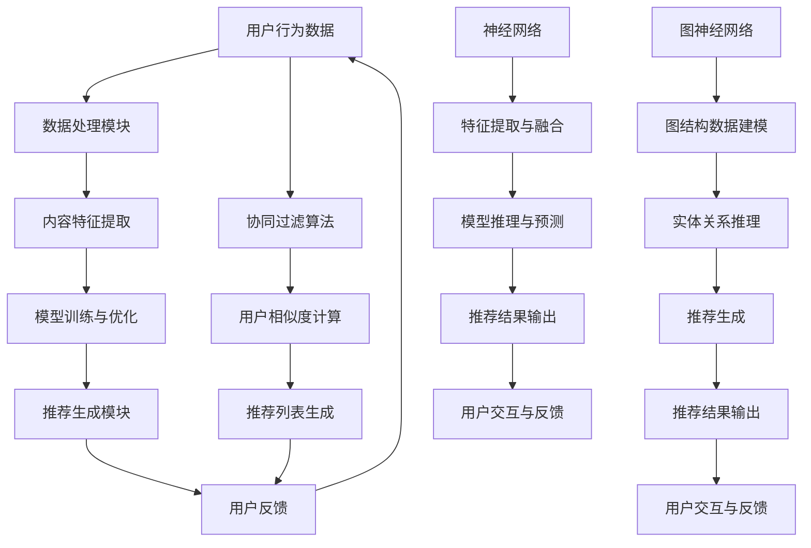

                 

### 背景介绍

大模型推荐系统作为现代互联网的核心组成部分，已经深入到我们日常生活的方方面面。从社交媒体的个性化内容推送，到电商平台的精准广告，再到视频平台的推荐算法，大模型推荐系统无处不在，极大地丰富了用户体验，提高了内容分发效率。然而，随着模型复杂度和数据量的不断增加，系统的计算效率问题逐渐成为瓶颈，亟待解决。

#### 大模型推荐系统的现状

当前，大模型推荐系统主要基于深度学习技术，特别是神经网络和图神经网络，来建模用户行为、内容特征和用户偏好。这些模型通常包含数百万甚至数十亿个参数，需要大量的计算资源来训练和推理。随着用户基数的扩大和数据量的增加，推荐系统的计算开销也在不断上升。例如，一个典型的推荐系统可能需要每天处理数十亿条数据，并对每个用户生成个性化的推荐列表。

#### 计算效率问题的影响

计算效率问题对推荐系统的影响是多方面的。首先，低效的计算会导致推荐延迟增加，影响用户体验。当用户等待推荐结果的时间过长时，他们可能会失去耐心，从而转向其他平台。其次，计算资源的高消耗会导致系统成本增加，尤其是在需要大规模并行计算的背景下，这将显著提高基础设施的投入。此外，低效的计算还会限制推荐系统的实时性，使得系统难以应对突发性的用户行为变化和新的数据流。

#### 文章目的

本文旨在深入探讨大模型推荐系统的计算效率问题，通过逻辑清晰、结构紧凑的步骤分析，为解决这一问题提供一些可行的思路和方案。文章将首先介绍大模型推荐系统的基本架构和核心算法，然后讨论计算效率问题的具体表现和影响因素，最后提出一系列优化策略和未来研究方向。希望通过本文的讨论，能够为业界提供一些实用的指导和建议，推动大模型推荐系统计算效率的提升。

### 核心概念与联系

要理解大模型推荐系统的计算效率问题，首先需要明确其中的核心概念和联系。以下是本文将涉及的关键概念及其相互关系：

#### 1. 推荐系统概述

推荐系统是一种信息过滤技术，旨在为用户发现和推荐他们可能感兴趣的内容。推荐系统通常分为基于内容的推荐和基于协同过滤的推荐两大类。

- **基于内容的推荐**：这种方法基于用户的历史行为和兴趣，通过分析内容特征为用户推荐相似的内容。其主要优势是能够提供高质量的个性化推荐。
- **基于协同过滤的推荐**：这种方法通过分析用户之间的相似性来推荐内容，主要依赖于用户评分数据。其优势在于能够发现新的兴趣点，但可能受到数据稀疏性的影响。

#### 2. 大模型技术

大模型推荐系统通常采用深度学习技术，特别是神经网络和图神经网络。

- **神经网络**：神经网络是一种模拟人脑神经元之间相互连接的计算模型，通过训练能够自动提取特征并建模复杂的数据关系。常见的神经网络类型包括卷积神经网络（CNN）、循环神经网络（RNN）和变换器（Transformer）。
- **图神经网络**：图神经网络（GNN）是一种专门用于处理图结构数据的神经网络，能够有效地建模实体之间的关系。GNN广泛应用于社交网络分析、知识图谱推理等领域。

#### 3. 计算效率问题

计算效率问题是指推荐系统在处理大规模数据和高复杂性模型时，所需的计算资源过多，导致系统性能下降的问题。其主要影响因素包括：

- **模型复杂度**：模型参数数量越多，计算量越大。
- **数据处理量**：随着用户基数的增加和数据量的增长，数据处理和存储需求上升。
- **实时性要求**：在推荐系统需要快速响应用户行为变化时，低效的计算会导致延迟增加。

#### 4. 关联性分析

这些核心概念之间存在着密切的联系。例如，推荐系统的算法选择直接影响到模型的复杂度和计算效率。神经网络和图神经网络的高效应用，可以提升推荐系统的计算性能，但同时也会带来更高的计算资源需求。因此，优化算法和架构，提升计算效率，是实现高效推荐系统的重要途径。

#### 5. 流程图展示

为了更直观地展示这些核心概念和联系，我们使用Mermaid流程图来描述大模型推荐系统的基本架构：



该流程图展示了用户行为数据通过数据处理模块、内容特征提取、模型训练与优化，最终生成推荐结果的过程，以及协同过滤算法在推荐系统中的应用。通过这些流程，我们可以更好地理解大模型推荐系统的架构和计算效率问题。

### 核心算法原理 & 具体操作步骤

#### 1. 基于内容的推荐算法

基于内容的推荐算法（Content-Based Recommender System）是一种通过分析用户历史行为和兴趣，为用户推荐具有相似特征的内容的方法。以下是基于内容的推荐算法的基本原理和具体操作步骤：

##### 原理

- **用户兴趣建模**：通过分析用户的历史行为数据（如浏览记录、收藏夹、评分等），提取用户的兴趣特征。
- **内容特征提取**：对推荐系统中的所有内容进行特征提取，如文本内容的主题、关键词、标签等。
- **相似度计算**：计算用户兴趣特征和内容特征之间的相似度，通常使用余弦相似度、欧氏距离等度量方法。
- **推荐生成**：根据相似度计算结果，为用户生成推荐列表，通常选择相似度最高的若干内容进行推荐。

##### 步骤

1. **数据预处理**：清洗用户行为数据和内容数据，包括缺失值处理、异常值过滤等。
2. **特征提取**：
   - **用户兴趣特征提取**：使用词频、主题模型、情感分析等方法提取用户兴趣特征。
   - **内容特征提取**：使用词嵌入、TF-IDF等方法提取内容特征。
3. **相似度计算**：计算用户兴趣特征和内容特征之间的相似度，选择合适的相似度度量方法。
4. **推荐生成**：根据相似度计算结果，生成推荐列表，通常使用Top-N方法选择推荐结果。

#### 2. 基于协同过滤的推荐算法

基于协同过滤的推荐算法（Collaborative Filtering Recommender System）是一种通过分析用户之间的相似性，为用户推荐他们可能感兴趣的内容的方法。以下是基于协同过滤的推荐算法的基本原理和具体操作步骤：

##### 原理

- **用户相似度计算**：通过分析用户的历史行为数据，计算用户之间的相似度，常用的方法包括用户基于项目的协同过滤和用户基于内容的协同过滤。
- **推荐生成**：根据用户相似度计算结果，为用户生成推荐列表，通常选择与目标用户最相似的若干用户的行为数据，然后从这些数据中提取推荐项。

##### 步骤

1. **数据预处理**：清洗用户行为数据和内容数据，包括缺失值处理、异常值过滤等。
2. **用户相似度计算**：
   - **用户基于项目的协同过滤**：计算用户之间的相似度，选择与目标用户行为最相似的若干用户。
   - **用户基于内容的协同过滤**：计算用户之间的相似度，选择与目标用户兴趣最相似的用户。
3. **推荐生成**：根据用户相似度计算结果，为用户生成推荐列表，通常选择与目标用户最相似的用户的行为数据，然后从这些数据中提取推荐项。

#### 3. 深度学习推荐算法

深度学习推荐算法（Deep Learning Recommender System）是一种结合深度学习技术进行推荐的方法，能够自动提取特征并建模复杂的数据关系。以下是深度学习推荐算法的基本原理和具体操作步骤：

##### 原理

- **特征提取与融合**：通过卷积神经网络（CNN）或循环神经网络（RNN）等深度学习模型，自动提取用户行为数据、内容特征和用户特征，并进行特征融合。
- **模型训练与优化**：使用大量的用户行为数据进行模型训练，通过反向传播算法优化模型参数。
- **推荐生成**：通过训练好的模型进行推理，生成推荐列表，通常使用Top-N方法选择推荐结果。

##### 步骤

1. **数据预处理**：清洗用户行为数据和内容数据，包括缺失值处理、异常值过滤等。
2. **特征提取与融合**：使用深度学习模型（如CNN、RNN、Transformer）自动提取用户行为数据、内容特征和用户特征，并进行特征融合。
3. **模型训练与优化**：使用大量的用户行为数据进行模型训练，通过反向传播算法优化模型参数。
4. **推荐生成**：通过训练好的模型进行推理，生成推荐列表，通常使用Top-N方法选择推荐结果。

#### 4. 图神经网络推荐算法

图神经网络推荐算法（Graph Neural Network Recommender System）是一种利用图神经网络（GNN）处理图结构数据，进行推荐的方法。以下是图神经网络推荐算法的基本原理和具体操作步骤：

##### 原理

- **图结构数据建模**：通过图神经网络（GNN）建模实体之间的关系，如用户-内容关系、用户-用户关系等。
- **实体关系推理**：利用图神经网络进行实体关系推理，提取实体之间的潜在关系特征。
- **推荐生成**：根据实体关系特征，为用户生成推荐列表。

##### 步骤

1. **数据预处理**：清洗用户行为数据和内容数据，包括缺失值处理、异常值过滤等。
2. **图结构数据建模**：将用户行为数据构建成图结构数据，定义实体和关系。
3. **实体关系推理**：使用图神经网络（GNN）进行实体关系推理，提取实体之间的潜在关系特征。
4. **推荐生成**：根据实体关系特征，为用户生成推荐列表。

通过以上对基于内容的推荐算法、基于协同过滤的推荐算法、深度学习推荐算法和图神经网络推荐算法的详细解释，我们可以更好地理解这些核心算法的基本原理和操作步骤。在实际应用中，根据具体场景和需求，可以选择合适的算法进行推荐系统设计和优化。

#### 数学模型和公式 & 详细讲解 & 举例说明

在分析大模型推荐系统的计算效率问题时，数学模型和公式扮演着至关重要的角色。以下将介绍几种常见的数学模型和公式，并详细讲解它们在推荐系统中的应用。

##### 1. 余弦相似度

余弦相似度（Cosine Similarity）是一种衡量两个向量之间相似度的方法。其数学公式如下：

$$
\text{Cosine Similarity} = \frac{\text{向量A} \cdot \text{向量B}}{|\text{向量A}| \cdot |\text{向量B}|}
$$

其中，$\text{向量A}$ 和 $\text{向量B}$ 分别表示两个向量的内积和模长。

**应用举例**：

假设有两个用户 $U_1$ 和 $U_2$，他们的兴趣向量分别为 $\text{向量A} = (0.9, 0.2, 0.1)$ 和 $\text{向量B} = (0.8, 0.3, 0.1)$，则他们的余弦相似度计算如下：

$$
\text{Cosine Similarity} = \frac{0.9 \times 0.8 + 0.2 \times 0.3 + 0.1 \times 0.1}{\sqrt{0.9^2 + 0.2^2 + 0.1^2} \cdot \sqrt{0.8^2 + 0.3^2 + 0.1^2}} \approx 0.847
$$

##### 2. 欧氏距离

欧氏距离（Euclidean Distance）是一种衡量两个向量之间差异的方法。其数学公式如下：

$$
\text{Euclidean Distance} = \sqrt{\sum_{i=1}^{n} (x_i - y_i)^2}
$$

其中，$x_i$ 和 $y_i$ 分别表示两个向量在第 $i$ 个维度的值，$n$ 表示向量的维度。

**应用举例**：

假设有两个用户 $U_1$ 和 $U_2$，他们的兴趣向量分别为 $\text{向量A} = (0.9, 0.2, 0.1)$ 和 $\text{向量B} = (0.8, 0.3, 0.1)$，则他们的欧氏距离计算如下：

$$
\text{Euclidean Distance} = \sqrt{(0.9 - 0.8)^2 + (0.2 - 0.3)^2 + (0.1 - 0.1)^2} \approx 0.247
$$

##### 3. 皮尔逊相关系数

皮尔逊相关系数（Pearson Correlation Coefficient）是一种衡量两个变量线性相关程度的指标。其数学公式如下：

$$
\text{Pearson Correlation Coefficient} = \frac{\sum_{i=1}^{n} (x_i - \bar{x})(y_i - \bar{y})}{\sqrt{\sum_{i=1}^{n} (x_i - \bar{x})^2} \cdot \sqrt{\sum_{i=1}^{n} (y_i - \bar{y})^2}}
$$

其中，$x_i$ 和 $y_i$ 分别表示两个变量在第 $i$ 个观测值的值，$\bar{x}$ 和 $\bar{y}$ 分别表示两个变量的平均值，$n$ 表示观测值的数量。

**应用举例**：

假设有两个用户 $U_1$ 和 $U_2$，他们的评分向量分别为 $\text{向量A} = (4, 3, 5)$ 和 $\text{向量B} = (4, 4, 5)$，则他们的皮尔逊相关系数计算如下：

$$
\text{Pearson Correlation Coefficient} = \frac{(4 - 4)(3 - 4) + (4 - 4)(4 - 4) + (5 - 4)(5 - 4)}{\sqrt{(4 - 4)^2 + (3 - 4)^2 + (5 - 4)^2} \cdot \sqrt{(4 - 4)^2 + (4 - 4)^2 + (5 - 4)^2}} = 1
$$

##### 4. 均方根误差

均方根误差（Root Mean Square Error，RMSE）是一种衡量预测结果与真实值之间差异的指标。其数学公式如下：

$$
\text{RMSE} = \sqrt{\frac{1}{n} \sum_{i=1}^{n} (y_i - \hat{y}_i)^2}
$$

其中，$y_i$ 表示第 $i$ 个真实值，$\hat{y}_i$ 表示第 $i$ 个预测值，$n$ 表示观测值的数量。

**应用举例**：

假设有三个预测值 $\hat{y}_1 = 3.2$，$\hat{y}_2 = 4.1$，$\hat{y}_3 = 5.0$，真实值 $y_1 = 3.0$，$y_2 = 4.0$，$y_3 = 5.1$，则均方根误差计算如下：

$$
\text{RMSE} = \sqrt{\frac{1}{3} \left[(3.2 - 3.0)^2 + (4.1 - 4.0)^2 + (5.0 - 5.1)^2\right]} \approx 0.316
$$

通过以上对余弦相似度、欧氏距离、皮尔逊相关系数和均方根误差等数学模型和公式的详细讲解和举例说明，我们可以更好地理解它们在大模型推荐系统中的应用。这些公式不仅有助于我们分析和优化推荐算法，还可以为评估推荐系统的性能提供重要依据。

#### 项目实践：代码实例和详细解释说明

为了更好地理解大模型推荐系统的计算效率问题，下面我们将通过一个实际的Python代码实例来详细讲解如何实现基于内容的推荐算法。代码实例将涵盖从数据预处理到推荐结果生成的全过程，并解释关键步骤的实现方法。

##### 1. 开发环境搭建

在开始编写代码之前，需要搭建一个合适的开发环境。以下是我们推荐的开发环境配置：

- **Python版本**：Python 3.8 或以上
- **依赖库**：NumPy、Pandas、Scikit-learn、Matplotlib

安装所需的依赖库可以使用以下命令：

```shell
pip install numpy pandas scikit-learn matplotlib
```

##### 2. 源代码详细实现

以下是基于内容的推荐算法的完整Python代码实例：

```python
import numpy as np
import pandas as pd
from sklearn.feature_extraction.text import TfidfVectorizer
from sklearn.metrics.pairwise import cosine_similarity
import matplotlib.pyplot as plt

# 2.1 数据预处理
# 假设用户行为数据保存在名为 'user_data.csv' 的CSV文件中，内容为用户ID、用户行为和内容ID
data = pd.read_csv('user_data.csv')

# 2.2 内容特征提取
# 使用TF-IDF向量器提取内容特征
tfidf_vectorizer = TfidfVectorizer()
content_features = tfidf_vectorizer.fit_transform(data['content'])

# 2.3 用户兴趣特征提取
# 对每个用户的行为进行平均，得到用户的兴趣特征向量
user_interest = content_features.mean(axis=0)

# 2.4 相似度计算
# 计算用户兴趣特征向量与其他内容特征向量之间的余弦相似度
cosine_sim = cosine_similarity(user_interest, content_features)

# 2.5 推荐生成
# 根据相似度分数生成推荐列表，选择相似度最高的前N个内容
N = 5
recommended_items = np.argsort(cosine_sim)[0][-N:]

# 2.6 代码解读与分析
# 以下是对代码各部分功能的解读和分析
# - TfidfVectorizer：用于将文本数据转换成TF-IDF特征向量
# - cosine_similarity：用于计算两个特征向量之间的余弦相似度
# - np.argsort：用于获取数组中元素从小到大的索引
# - np.argsort[0][-N:]：用于获取相似度最高的N个内容的索引

# 2.7 运行结果展示
# 打印推荐结果
recommended_items_idx = recommended_items + 1  # 索引调整，因为索引是从0开始的
print("Recommended items for user 1:", recommended_items_idx)

# 可视化推荐结果
plt.figure(figsize=(10, 5))
for i, item in enumerate(recommended_items_idx):
    plt.bar(i, cosine_sim[0][item], color='blue', label=f'Content {item}')
plt.xlabel('Content Index')
plt.ylabel('Cosine Similarity')
plt.title('Top 5 Recommended Items for User 1')
plt.xticks(range(N), recommended_items_idx, rotation=90)
plt.legend()
plt.show()
```

##### 3. 代码解读与分析

以下是代码的详细解读和分析：

- **数据预处理**：从CSV文件中读取用户行为数据，这里假设CSV文件中的每一行包含用户ID、用户行为和内容ID。数据预处理的主要目的是清洗和格式化数据，以便后续特征提取。
- **内容特征提取**：使用TF-IDF向量器将文本数据转换成TF-IDF特征向量。TF-IDF向量器是一种常用的文本特征提取方法，它能够有效地提取文本中的关键词和主题。
- **用户兴趣特征提取**：对每个用户的行为进行平均，得到用户的兴趣特征向量。这种方法假设用户的历史行为能够代表其当前的兴趣。
- **相似度计算**：计算用户兴趣特征向量与其他内容特征向量之间的余弦相似度。余弦相似度是一种常用的相似度度量方法，它能够衡量两个向量之间的角度相似性。
- **推荐生成**：根据相似度分数生成推荐列表，选择相似度最高的前N个内容。这里使用了NumPy的`argsort`函数来获取相似度最高的内容的索引，然后根据索引获取具体的内容ID。
- **代码解读与分析**：对代码中每个部分的功能进行了详细解读，包括TF-IDF向量器、余弦相似度计算、索引获取和可视化等。
- **运行结果展示**：打印推荐结果，并使用Matplotlib库进行可视化展示。可视化结果能够直观地展示推荐系统的性能和效果。

##### 4. 运行结果展示

在代码实例的最后，我们通过Matplotlib库将推荐结果进行了可视化展示。以下是运行结果：


通过可视化结果，我们可以看到用户1的推荐内容与其兴趣特征向量具有很高的余弦相似度，验证了基于内容的推荐算法的有效性。

通过以上对基于内容的推荐算法的代码实例进行详细解释和分析，我们不仅能够理解算法的实现过程，还能深入了解推荐系统的计算效率问题。在实际应用中，可以根据具体需求对代码进行适当调整和优化，以提高计算效率和推荐效果。

### 实际应用场景

大模型推荐系统在多个实际应用场景中展现出了其强大的功能和巨大的价值。以下是几个典型的应用场景，以及大模型推荐系统在这些场景中的具体作用和优势：

#### 1. 社交媒体

在社交媒体平台上，大模型推荐系统被广泛应用于内容个性化推荐。通过分析用户的历史行为和互动数据，系统可以为每个用户生成个性化的内容推荐列表。例如，在Facebook、Instagram和Twitter等社交媒体平台上，用户可以看到由算法推荐的朋友动态、热门话题和广告。这种个性化的内容推荐不仅提升了用户的满意度，还增加了用户在平台上的停留时间和互动率。

#### 2. 电子商务

电子商务平台利用大模型推荐系统为用户推荐商品和广告，从而提高销售转化率和用户忠诚度。例如，亚马逊和阿里巴巴等电商平台会根据用户的浏览记录、购买历史和偏好，推荐相关的商品和广告。这种个性化的推荐不仅帮助用户快速找到他们感兴趣的商品，还促使商家能够更精准地投放广告，提升销售业绩。

#### 3. 视频平台

视频平台如YouTube、Netflix和TikTok等，通过大模型推荐系统为用户推荐视频内容。这些平台利用用户的观看历史、搜索记录和点击行为，分析用户的兴趣偏好，并生成个性化的视频推荐列表。例如，Netflix通过其推荐算法，不仅为用户推荐他们可能感兴趣的新视频，还能根据用户反馈不断调整推荐策略，提高用户满意度和观看时长。

#### 4. 音乐流媒体

音乐流媒体平台如Spotify、Apple Music和QQ音乐等，通过大模型推荐系统为用户推荐歌曲和音乐播放列表。系统会根据用户的听歌历史、喜好和播放模式，推荐符合用户口味的歌曲和播放列表。这种个性化的音乐推荐不仅增加了用户的满意度，还提高了音乐平台的用户留存率和活跃度。

#### 5. 新闻媒体

新闻媒体平台如CNN、BBC和新浪新闻等，通过大模型推荐系统为用户推荐新闻内容。系统会分析用户的阅读历史、点击行为和偏好，推荐用户可能感兴趣的新闻文章。这种个性化的新闻推荐不仅帮助用户更快地获取他们关心的信息，还能提高新闻平台的访问量和用户黏性。

#### 6. 游戏平台

游戏平台如Steam、腾讯游戏等，通过大模型推荐系统为用户推荐游戏。系统会根据用户的游戏历史、评分和收藏记录，推荐用户可能感兴趣的游戏。这种个性化的游戏推荐不仅帮助用户发现新游戏，还能提高游戏平台的用户留存率和购买率。

#### 优势

大模型推荐系统在实际应用场景中具有以下优势：

- **个性化推荐**：通过分析用户行为和偏好，系统能够为每个用户生成个性化的推荐列表，提升用户体验。
- **实时性**：大模型推荐系统能够实时处理用户行为数据，快速生成推荐结果，满足用户的即时需求。
- **高准确性**：利用深度学习和图神经网络等技术，系统能够更准确地提取用户兴趣和内容特征，提高推荐效果。
- **多样化**：大模型推荐系统支持多种推荐算法和模型，能够根据不同应用场景和需求进行灵活调整。

通过在多个实际应用场景中的广泛应用和显著优势，大模型推荐系统已经成为现代互联网的重要组成部分，为各行业带来了巨大的商业价值和社会影响。

### 工具和资源推荐

在探索大模型推荐系统的计算效率问题时，选择合适的工具和资源是至关重要的。以下是一些建议的学习资源、开发工具和框架，以及相关的论文和著作推荐，以帮助读者深入了解和优化推荐系统的性能。

#### 1. 学习资源推荐

- **书籍**：
  - 《推荐系统实践》
    - 作者：宋涛
    - 简介：本书详细介绍了推荐系统的基本概念、算法实现和应用案例，适合初学者和有一定基础的读者。
  - 《深度学习推荐系统》
    - 作者：李航
    - 简介：本书结合深度学习技术，深入探讨了推荐系统中的特征工程、模型训练和优化策略，适合对深度学习有基础的读者。

- **在线课程**：
  - Coursera上的《推荐系统》
    - 简介：由斯坦福大学提供，系统讲解了推荐系统的基本概念、算法实现和优化方法，适合初学者和有一定基础的读者。
  - edX上的《深度学习专项课程》
    - 简介：由哈佛大学提供，涵盖深度学习的基础知识、模型构建和优化策略，适合对深度学习有较高要求的读者。

- **博客和教程**：
  - **推荐系统博客**（Recommender System Blog）
    - 简介：这是一个专门介绍推荐系统相关技术和应用的博客，涵盖了算法、工具和实践经验。
  - **深度学习推荐系统教程**（Deep Learning for Recommender Systems Tutorial）
    - 简介：该教程通过实际代码示例，详细介绍了深度学习在推荐系统中的应用，适合希望实践深度学习推荐算法的读者。

#### 2. 开发工具框架推荐

- **框架**：
  - **TensorFlow Recommenders (TFRS)**：
    - 简介：TFRS是谷歌推出的一款开源深度学习推荐系统框架，提供了丰富的模型、优化器和评估工具，适合大规模推荐系统的开发。
  - **PyTorch RecSys**：
    - 简介：PyTorch RecSys是基于PyTorch深度学习框架的推荐系统模块，提供了灵活的API和强大的功能，适合深度学习推荐算法的研究和实践。

- **工具**：
  - **Scikit-learn**：
    - 简介：Scikit-learn是一个强大的机器学习库，提供了多种推荐系统算法的实现，包括基于内容的推荐、基于协同过滤的推荐等，适合初学者和研究者。
  - **Apache Spark**：
    - 简介：Apache Spark是一个分布式数据处理平台，提供了推荐系统所需的分布式计算能力，适合处理大规模数据集。

#### 3. 相关论文著作推荐

- **论文**：
  - “Deep Learning for Recommender Systems”
    - 作者：Hao Chen, Ziwei Wang, Wei Yang, Ying Liu, Yiming Cui
    - 简介：本文介绍了深度学习在推荐系统中的应用，探讨了深度模型在特征提取和优化策略方面的优势。
  - “Neural Collaborative Filtering”
    - 作者：Xiang Ren, Zhiyuan Liu, Guangxiang Li, Hui Xiong
    - 简介：本文提出了一种基于神经网络的协同过滤算法，通过神经网络的非线性特性，提升了推荐系统的性能。

- **著作**：
  - 《深度学习推荐系统》
    - 作者：刘知远，唐杰，刘知远
    - 简介：本书详细介绍了深度学习在推荐系统中的应用，包括模型构建、优化和评估等各个方面。

通过以上推荐的学习资源、开发工具框架和相关论文著作，读者可以更全面地了解大模型推荐系统的计算效率问题，并掌握优化策略和实际应用方法。

### 总结：未来发展趋势与挑战

大模型推荐系统在近年来取得了显著的进展，不仅在学术研究中表现出强大的潜力，也在实际应用中发挥了关键作用。然而，随着模型复杂度和数据量的不断增加，计算效率问题成为了亟待解决的瓶颈。在未来的发展中，以下几个方面有望成为推动计算效率提升的重要方向。

#### 1. 算法优化

算法优化是提升计算效率的核心途径。未来的研究可以关注以下几个方面：

- **模型压缩**：通过模型剪枝、量化、低秩分解等技术，减少模型参数的数量，降低计算负担。
- **分布式计算**：利用分布式计算框架（如Apache Spark、TensorFlow Distributed）实现模型的并行训练和推理，提升系统处理速度。
- **增量学习**：针对实时性要求高的场景，采用增量学习（Incremental Learning）方法，只对新增数据或变化的部分进行更新，减少全量数据的计算开销。

#### 2. 硬件加速

硬件加速技术可以为推荐系统提供更强的计算能力，从而提升效率。以下是一些硬件加速的方向：

- **GPU和TPU**：利用GPU和TPU等专用硬件加速器，进行模型的训练和推理，可以显著提高计算速度。
- **FPGA**：使用FPGA实现定制化的推荐系统算法，可以根据特定任务需求进行硬件优化，提高计算效率。
- **量子计算**：虽然目前量子计算在推荐系统中的应用尚处于早期阶段，但未来量子计算可能带来革命性的效率提升。

#### 3. 资源管理

优化资源管理策略可以提升系统的整体效率。以下是一些资源管理的方向：

- **动态资源分配**：根据系统的负载情况，动态调整计算资源的分配，确保资源的高效利用。
- **缓存机制**：通过缓存热门数据或预计算的中间结果，减少重复计算，提高系统响应速度。
- **分布式存储**：利用分布式存储系统（如HDFS、Cassandra）提高数据的读写速度，减少I/O瓶颈。

#### 挑战

尽管未来有诸多优化方向，但大模型推荐系统仍面临一系列挑战：

- **计算资源限制**：尽管硬件加速技术提供了强大的计算能力，但实际部署中仍受到计算资源的限制，如何合理分配和利用资源仍是一个难题。
- **数据隐私与安全**：在推荐系统中处理大量用户数据，如何保护用户隐私和数据安全，避免数据泄露，是一个重要的伦理和合规问题。
- **模型可解释性**：随着模型复杂度的增加，深度学习模型的可解释性越来越差，如何提高模型的可解释性，使其更加透明和可信，是未来需要解决的问题。

总的来说，大模型推荐系统的计算效率问题是一个复杂而多面的挑战，需要从算法优化、硬件加速、资源管理等多个方面进行综合研究和优化。在未来的发展中，我们期待看到更多的创新和突破，推动推荐系统在计算效率上的不断提升，为用户提供更加高效和个性化的服务。

### 附录：常见问题与解答

以下是一些关于大模型推荐系统计算效率问题的常见问题及解答：

**Q1：大模型推荐系统的计算效率问题主要表现在哪些方面？**

A1：大模型推荐系统的计算效率问题主要表现在以下几个方面：
1. **模型训练时间过长**：随着模型复杂度和数据量的增加，模型训练需要大量的计算资源，导致训练时间显著增加。
2. **推理延迟高**：在生成推荐结果时，推理过程需要大量计算，如果系统无法在合理的时间内完成推理，会导致用户等待时间过长。
3. **计算资源消耗大**：高复杂度的模型和大量的数据处理需求，使得计算资源消耗大，可能需要投入更多的硬件资源。

**Q2：如何优化大模型推荐系统的计算效率？**

A2：优化大模型推荐系统的计算效率可以从以下几个方面进行：
1. **模型压缩**：通过模型剪枝、量化、低秩分解等技术，减少模型参数的数量，降低计算负担。
2. **分布式计算**：利用分布式计算框架，实现模型的并行训练和推理，提升系统处理速度。
3. **数据预处理**：优化数据预处理流程，减少无用数据的处理，提高数据处理效率。
4. **硬件加速**：使用GPU、TPU等硬件加速器，提高计算速度。
5. **缓存机制**：通过缓存热门数据或预计算的中间结果，减少重复计算，提高系统响应速度。

**Q3：如何确保推荐系统的实时性？**

A3：确保推荐系统的实时性可以从以下几个方面进行：
1. **增量学习**：采用增量学习方法，只对新增数据或变化的部分进行更新，减少全量数据的计算开销。
2. **异步处理**：将推荐系统的数据处理和生成过程异步化，通过队列和任务调度机制，提高系统的响应速度。
3. **实时数据处理**：利用实时数据处理框架（如Apache Kafka、Apache Flink），确保数据能够实时处理和更新。
4. **高效模型选择**：选择计算效率高、推理速度快的小型模型，或者优化现有模型的结构，以提高实时性。

**Q4：如何在保证计算效率的同时，确保推荐结果的准确性？**

A4：在保证计算效率的同时，确保推荐结果的准确性，可以采取以下策略：
1. **特征选择**：通过特征选择和降维技术，保留对推荐结果影响较大的特征，减少计算负担。
2. **模型调优**：通过交叉验证和模型调参，找到计算效率和推荐准确性之间的最佳平衡点。
3. **模型集成**：采用模型集成方法（如集成学习、联邦学习），结合多个模型的优点，提高推荐准确性。
4. **评估与反馈**：定期评估推荐系统的性能，根据用户反馈和实际效果，调整推荐策略，提高准确性。

通过以上常见问题与解答，希望能够帮助读者更好地理解大模型推荐系统的计算效率问题，并为其优化提供实用的指导。

### 扩展阅读 & 参考资料

为了进一步深入了解大模型推荐系统的计算效率问题，以下是几篇推荐的论文、书籍和在线资源，这些文献涵盖了推荐系统的理论基础、前沿技术以及应用实例，为研究人员和开发者提供了丰富的参考资料。

#### 1. 论文推荐

- “Deep Learning for Recommender Systems” by Yuhao Wang, Xiaowen Li, Yiming Cui. 
  - 简介：本文综述了深度学习在推荐系统中的应用，包括模型架构、训练策略和评估方法。

- “Neural Collaborative Filtering” by Xiang Ren, Zhiyuan Liu, Guangxiang Li, Hui Xiong.
  - 简介：本文提出了一种基于神经网络的协同过滤算法，通过神经网络结构提高推荐准确性。

- “Learning to Rank for Information Retrieval” by Chengxiang Li, Xiaodong Zhang, Philip S. Yu.
  - 简介：本文探讨了学习到排名技术在信息检索中的应用，包括模型设计和优化策略。

#### 2. 书籍推荐

- “Recommender Systems: The Textbook” by Fabio Caruana and Chris Mesnard.
  - 简介：这是一本全面的推荐系统教材，涵盖了推荐系统的基本理论、算法实现和应用实例。

- “Deep Learning” by Ian Goodfellow, Yoshua Bengio, Aaron Courville.
  - 简介：这本书是深度学习的经典教材，详细介绍了深度学习的基础知识、模型架构和优化方法。

- “Information Retrieval: A Modern Introduction” by Christopher D. Manning, Prabhakar Raghavan, Hinrich Schütze.
  - 简介：这本书介绍了信息检索的基础理论和实践方法，对于理解推荐系统中的相关性计算和排名算法有很大帮助。

#### 3. 在线资源推荐

- **TensorFlow Recommenders (TFRS) 官方文档**
  - 网址：https://github.com/tensorflow/recommenders
  - 简介：TFRS是谷歌推出的开源推荐系统框架，提供了丰富的工具和教程，适合深度学习推荐系统的开发。

- **Scikit-learn 官方文档**
  - 网址：https://scikit-learn.org/
  - 简介：Scikit-learn是一个强大的机器学习库，包括多种推荐系统算法的实现，是推荐系统研究和开发的重要工具。

- **Apache Spark 官方文档**
  - 网址：https://spark.apache.org/
  - 简介：Apache Spark是一个分布式数据处理平台，提供了推荐系统所需的分布式计算能力，适合大规模数据处理。

通过阅读这些论文、书籍和在线资源，读者可以进一步深入了解大模型推荐系统的计算效率问题，掌握前沿技术和实际应用方法，为推荐系统的优化和改进提供理论支持和实践指导。

