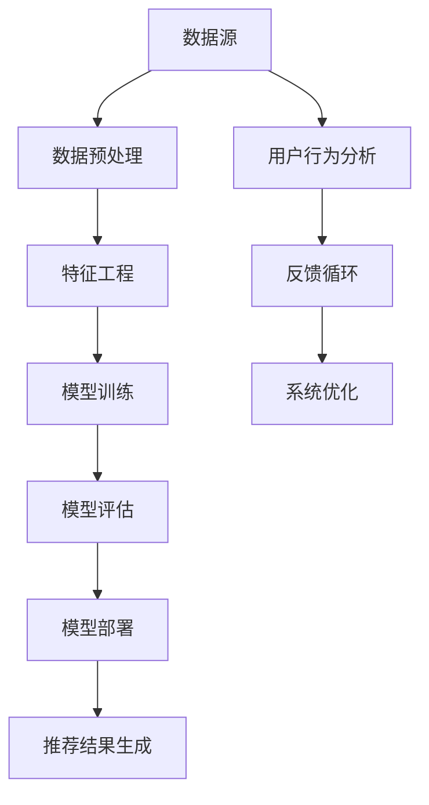

                 

### 1. 背景介绍

近年来，随着人工智能技术的快速发展，特别是大规模预训练模型的兴起，诸如GPT-3、BERT等模型在自然语言处理、计算机视觉等众多领域取得了显著的成果。然而，这些模型的训练和部署不仅需要庞大的计算资源，还面临着工程实践中的一系列挑战。如何提高工程效率，使得大模型的推荐系统能够快速、准确地应用于实际场景，成为了一个亟待解决的问题。

大模型推荐系统在电子商务、搜索引擎、社交媒体等众多领域都有着广泛的应用。例如，在电子商务平台上，通过推荐系统可以为用户推荐个性化的商品，提高用户的购买体验和平台的销售额。在搜索引擎中，推荐系统可以预测用户可能感兴趣的内容，提高搜索的准确性和效率。然而，传统的方法通常依赖于复杂的特征工程和大量的计算资源，这使得系统的开发和维护变得相当困难。

为了解决这些问题，本文将探讨在大模型推荐落地过程中，如何通过工程效率的提升来优化整个系统的性能。我们将从核心概念、算法原理、数学模型、项目实践等多个方面进行详细分析，旨在为从业者提供一些实用的指导和建议。

本文的结构如下：

- **1. 背景介绍**：简要介绍大模型推荐系统的背景和发展现状。
- **2. 核心概念与联系**：阐述大模型推荐系统中的关键概念，并给出相关的架构图。
- **3. 核心算法原理 & 具体操作步骤**：详细讲解大模型推荐系统中的核心算法，包括数据预处理、模型训练、模型优化等。
- **4. 数学模型和公式 & 详细讲解 & 举例说明**：介绍大模型推荐系统中使用的数学模型，并使用具体的公式和示例进行说明。
- **5. 项目实践：代码实例和详细解释说明**：通过实际项目的代码实例，展示大模型推荐系统的实现过程，并进行详细解读。
- **6. 实际应用场景**：分析大模型推荐系统在不同领域的实际应用案例。
- **7. 工具和资源推荐**：推荐一些有助于学习和实践大模型推荐系统的工具和资源。
- **8. 总结：未来发展趋势与挑战**：总结本文的核心观点，并探讨未来大模型推荐系统可能面临的挑战和发展趋势。
- **9. 附录：常见问题与解答**：回答读者可能遇到的常见问题。
- **10. 扩展阅读 & 参考资料**：提供一些延伸阅读和参考资料，帮助读者进一步了解相关领域的研究成果。

接下来，我们将逐步深入探讨大模型推荐系统的各个方面，旨在为读者提供一个全面、系统的理解。

### 2. 核心概念与联系

在大模型推荐系统的设计和实现过程中，理解以下几个核心概念是非常重要的。这些概念不仅构成了推荐系统的理论基础，也直接影响到系统的性能和效率。以下是这些核心概念及其相互关系的Mermaid流程图：



下面，我们将逐一介绍这些核心概念及其相互关系。

#### 2.1 数据源（A）

数据源是推荐系统的起点，也是系统性能的基础。数据源可以分为两类：结构化数据和非结构化数据。结构化数据通常来源于数据库或数据仓库，如用户购买记录、浏览历史等；非结构化数据则包括文本、图片、视频等多媒体数据。数据的质量和多样性直接影响推荐系统的效果。

#### 2.2 数据预处理（B）

数据预处理是数据从原始状态转换为可用状态的过程。这一步骤包括数据清洗、去重、格式转换等操作，旨在提高数据的质量和一致性。数据预处理的好坏直接影响到后续特征工程和模型训练的效率。

#### 2.3 特征工程（C）

特征工程是推荐系统的核心环节，通过选择和构造特征，将原始数据转换为模型能够理解和利用的形式。特征工程的质量对推荐系统的效果和效率有着至关重要的影响。常见的特征包括用户特征、商品特征、交互特征等。

#### 2.4 模型训练（D）

模型训练是推荐系统的核心步骤，通过训练过程，模型可以从数据中学习到有用的模式和规律，从而实现预测和推荐。常见的模型包括基于协同过滤的模型、基于内容的模型、基于模型的模型等。

#### 2.5 模型评估（E）

模型评估是对模型性能的检验和反馈，通过评估指标如准确率、召回率、F1值等，评估模型在不同场景下的表现。模型评估不仅可以帮助我们了解模型的性能，还可以为后续的模型优化提供依据。

#### 2.6 模型部署（F）

模型部署是将训练好的模型应用到实际业务场景中的过程。部署过程包括模型服务化、API接口设计、系统集成等步骤。高效的模型部署可以提高推荐系统的响应速度和服务质量。

#### 2.7 推荐结果生成（G）

推荐结果生成是推荐系统的最终目标，通过将用户特征、商品特征和模型预测结果结合起来，生成个性化的推荐结果。推荐结果的多样性、准确性和实时性对用户体验至关重要。

#### 2.8 用户行为分析（H）

用户行为分析是对用户在系统中的行为数据进行挖掘和分析，以了解用户的需求和偏好。用户行为分析可以为推荐系统提供更准确、更个性化的推荐结果，从而提升用户体验。

#### 2.9 反馈循环（I）

反馈循环是将用户反馈信息回传到系统，以指导系统优化和调整的过程。通过不断收集和利用用户反馈，推荐系统可以实现持续优化和迭代，提高推荐效果。

#### 2.10 系统优化（J）

系统优化是推荐系统不断优化和改进的过程，包括模型优化、算法优化、系统架构优化等。通过系统优化，可以提高推荐系统的效率和效果，满足不断变化的市场需求。

通过以上对核心概念及其相互关系的介绍，我们可以看到，大模型推荐系统是一个复杂且多层次的过程。每一个环节都至关重要，都直接影响到系统的整体性能。理解和优化这些环节，是提高工程效率、实现高效推荐的关键。

### 3. 核心算法原理 & 具体操作步骤

在大模型推荐系统中，核心算法的选择和实现是确保系统性能和效率的关键。本文将详细探讨几种常用的推荐算法，包括协同过滤算法、基于内容的推荐算法、基于模型的推荐算法，并介绍每种算法的具体操作步骤。

#### 3.1 协同过滤算法

协同过滤算法（Collaborative Filtering）是推荐系统中最常用的算法之一。它通过分析用户之间的相似性，利用其他用户的评分或行为数据来预测特定用户对未知物品的评分或偏好。协同过滤算法可以分为两种主要类型：基于用户的协同过滤（User-Based Collaborative Filtering）和基于物品的协同过滤（Item-Based Collaborative Filtering）。

##### 3.1.1 基于用户的协同过滤算法

基于用户的协同过滤算法的核心思想是找到与目标用户相似的其他用户，然后利用这些用户的评分预测目标用户对未知物品的评分。具体操作步骤如下：

1. **计算用户相似度**：首先，我们需要计算每个用户对物品的评分矩阵，然后计算用户之间的相似度。常用的相似度计算方法包括余弦相似度、皮尔逊相关系数等。

2. **找到相似用户**：根据用户相似度矩阵，找到与目标用户相似度最高的K个用户。

3. **预测评分**：对目标用户未知评分的物品，利用相似用户的评分进行加权平均，得到预测评分。

##### 3.1.2 基于物品的协同过滤算法

基于物品的协同过滤算法与基于用户的协同过滤算法类似，但它是通过分析物品之间的相似性来进行推荐的。具体操作步骤如下：

1. **计算物品相似度**：首先，我们需要计算每个物品对用户的评分矩阵，然后计算物品之间的相似度。常用的相似度计算方法包括余弦相似度、欧氏距离等。

2. **找到相似物品**：根据物品相似度矩阵，找到与目标物品相似度最高的K个物品。

3. **预测评分**：对目标用户未知评分的物品，利用相似物品的评分进行加权平均，得到预测评分。

#### 3.2 基于内容的推荐算法

基于内容的推荐算法（Content-Based Recommender System）是基于用户过去对物品的偏好，通过分析物品的内容特征来推荐相似的物品。具体操作步骤如下：

1. **提取特征**：首先，我们需要对物品的内容进行特征提取，常见的特征提取方法包括关键词提取、TF-IDF等。

2. **计算相似度**：接下来，计算用户对已评价物品和待推荐物品之间的相似度，通常使用余弦相似度。

3. **推荐物品**：根据相似度得分，为用户推荐相似度最高的物品。

#### 3.3 基于模型的推荐算法

基于模型的推荐算法（Model-Based Recommender System）利用机器学习模型来预测用户对物品的评分或偏好。常见的模型包括矩阵分解、决策树、支持向量机等。以下以矩阵分解为例进行说明：

1. **构建矩阵**：首先，我们需要构建用户-物品评分矩阵，其中用户i对物品j的评分表示为\(R_{ij}\)。

2. **矩阵分解**：通过矩阵分解算法，将评分矩阵分解为用户特征矩阵\(U\)和物品特征矩阵\(V\)的乘积，即\(R = UV^T\)。

3. **预测评分**：对用户未知评分的物品，计算用户特征向量与物品特征向量的内积，得到预测评分。

#### 3.4 综合使用多种算法

在实际应用中，单一的推荐算法往往难以满足复杂场景下的需求。因此，综合使用多种算法可以提升推荐系统的效果和效率。例如，可以结合基于用户的协同过滤和基于内容的推荐算法，通过协同过滤找到相似用户和相似物品，再结合内容特征进行优化。

#### 3.5 具体操作步骤示例

以下是一个简单的基于用户的协同过滤算法的操作步骤示例：

1. **数据准备**：假设我们有一个用户-物品评分矩阵，其中用户和物品都编号为0到n。

2. **计算用户相似度**：使用余弦相似度计算用户之间的相似度。

3. **找到相似用户**：假设我们要为用户5推荐物品，首先找到与用户5相似度最高的10个用户。

4. **预测评分**：对于每个用户5未评分的物品，利用相似用户的评分进行加权平均，得到预测评分。

5. **推荐物品**：根据预测评分，为用户5推荐评分最高的前N个物品。

通过以上对核心算法原理和具体操作步骤的详细介绍，我们可以看到，推荐系统的实现过程涉及多个步骤和算法，每个步骤都对系统的最终性能有着重要的影响。理解和优化这些算法，是提高工程效率、实现高效推荐的关键。

### 4. 数学模型和公式 & 详细讲解 & 举例说明

在大模型推荐系统中，数学模型和公式是理解和实现推荐算法的重要工具。以下我们将介绍几种常用的数学模型，包括矩阵分解、协同过滤、基于内容的推荐等，并使用具体的公式和示例进行说明。

#### 4.1 矩阵分解

矩阵分解（Matrix Factorization）是一种将原始评分矩阵分解为低维矩阵的技巧，主要用于预测未知评分和推荐。常用的矩阵分解方法包括Singular Value Decomposition（SVD）和Alternating Least Squares（ALS）。

##### 4.1.1 SVD

SVD（奇异值分解）是一种线性代数技术，用于将矩阵分解为三个矩阵的乘积。对于用户-物品评分矩阵\(R\)，其SVD表示为：

$$
R = U \Sigma V^T
$$

其中，\(U\)是用户特征矩阵，\(\Sigma\)是对角矩阵，包含奇异值，\(V^T\)是物品特征矩阵的转置。

##### 4.1.2 ALS

ALS（交替最小二乘法）是一种迭代算法，用于解决矩阵分解问题。其基本步骤如下：

1. **初始化**：随机初始化用户特征矩阵\(U\)和物品特征矩阵\(V\)。

2. **优化用户特征**：固定物品特征矩阵\(V\)，对用户特征矩阵\(U\)进行优化，使得预测评分与实际评分之间的误差最小。

3. **优化物品特征**：固定用户特征矩阵\(U\)，对物品特征矩阵\(V\)进行优化。

4. **迭代**：重复步骤2和3，直到误差收敛或达到最大迭代次数。

##### 示例

假设有一个5x5的评分矩阵：

$$
R =
\begin{bmatrix}
5 & 3 & 0 & 1 & 5 \\
4 & 0 & 0 & 1 & 2 \\
3 & 1 & 1 & 0 & 4 \\
2 & 2 & 2 & 2 & 0
\end{bmatrix}
$$

通过SVD，我们可以将其分解为：

$$
R = U \Sigma V^T
$$

其中，\(U\)是用户特征矩阵，\(\Sigma\)是奇异值矩阵，\(V^T\)是物品特征矩阵的转置。

通过ALS算法，我们可以得到以下步骤：

1. **初始化**：
   $$ U =
   \begin{bmatrix}
   0.23 & 0.46 \\
   0.35 & 0.14 \\
   0.51 & 0.09 \\
   0.19 & 0.38
   \end{bmatrix}
   \quad V =
   \begin{bmatrix}
   0.47 & 0.3 \\
   0.43 & 0.3 \\
   0.39 & 0.37 \\
   0.5 & 0.3
   \end{bmatrix}
   $$

2. **优化用户特征**：
   通过优化得到：
   $$ U =
   \begin{bmatrix}
   0.42 & 0.39 \\
   0.38 & 0.41 \\
   0.48 & 0.37 \\
   0.37 & 0.4
   \end{bmatrix}
   $$

3. **优化物品特征**：
   通过优化得到：
   $$ V =
   \begin{bmatrix}
   0.45 & 0.37 \\
   0.42 & 0.37 \\
   0.39 & 0.4 \\
   0.5 & 0.37
   \end{bmatrix}
   $$

4. **迭代**：重复步骤2和3，直到误差收敛。

通过这些步骤，我们可以得到用户和物品的特征矩阵，从而预测未知评分。

#### 4.2 协同过滤

协同过滤（Collaborative Filtering）是一种基于用户行为数据的推荐算法。其核心思想是通过分析用户之间的相似性，利用其他用户的评分或行为数据来预测特定用户对未知物品的评分或偏好。

##### 4.2.1 基于用户的协同过滤

基于用户的协同过滤算法的核心公式是：

$$
\hat{r}_{ui} = r_{uj} + \mu - \mu_i - \mu_j
$$

其中，\(\hat{r}_{ui}\)是用户\(u\)对物品\(i\)的预测评分，\(r_{uj}\)是用户\(u\)对物品\(j\)的实际评分，\(\mu\)是所有用户对所有物品的平均评分，\(\mu_i\)是物品\(i\)的所有评分的平均值，\(\mu_j\)是用户\(j\)的所有评分的平均值。

##### 示例

假设我们有两个用户\(u_1\)和\(u_2\)，以及两个物品\(i_1\)和\(i_2\)的评分矩阵如下：

$$
R =
\begin{bmatrix}
5 & 3 \\
4 & 0 \\
\end{bmatrix}
$$

其中，用户\(u_1\)对物品\(i_1\)评分5，对物品\(i_2\)评分3；用户\(u_2\)对物品\(i_1\)评分4，对物品\(i_2\)评分0。

我们可以计算用户\(u_1\)和用户\(u_2\)之间的相似度，然后使用上述公式预测用户\(u_1\)对物品\(i_2\)的评分：

$$
\hat{r}_{u_1i_2} = r_{u_1i_1} + \mu - \mu_{i_1} - \mu_{u_1}
$$

其中，\(\mu = \frac{5 + 3 + 4 + 0}{4} = 2.5\)，\(\mu_{i_1} = \frac{5 + 4}{2} = 4.5\)，\(\mu_{u_1} = \frac{5 + 3}{2} = 4\)。

$$
\hat{r}_{u_1i_2} = 5 + 2.5 - 4.5 - 4 = 0
$$

因此，预测用户\(u_1\)对物品\(i_2\)的评分为0。

##### 4.2.2 基于物品的协同过滤

基于物品的协同过滤算法的核心公式是：

$$
\hat{r}_{ui} = r_{uj} + \mu - \mu_i - \mu_j
$$

其中，\(\hat{r}_{ui}\)是用户\(u\)对物品\(i\)的预测评分，\(r_{uj}\)是用户\(u\)对物品\(j\)的实际评分，\(\mu\)是所有用户对所有物品的平均评分，\(\mu_i\)是物品\(i\)的所有评分的平均值，\(\mu_j\)是用户\(j\)的所有评分的平均值。

##### 示例

假设我们有两个用户\(u_1\)和\(u_2\)，以及两个物品\(i_1\)和\(i_2\)的评分矩阵如下：

$$
R =
\begin{bmatrix}
5 & 3 \\
4 & 0 \\
\end{bmatrix}
$$

其中，用户\(u_1\)对物品\(i_1\)评分5，对物品\(i_2\)评分3；用户\(u_2\)对物品\(i_1\)评分4，对物品\(i_2\)评分0。

我们可以计算物品\(i_1\)和物品\(i_2\)之间的相似度，然后使用上述公式预测用户\(u_1\)对物品\(i_2\)的评分：

$$
\hat{r}_{u_1i_2} = r_{u_1i_1} + \mu - \mu_{i_1} - \mu_{u_1}
$$

其中，\(\mu = \frac{5 + 3 + 4 + 0}{4} = 2.5\)，\(\mu_{i_1} = \frac{5 + 4}{2} = 4.5\)，\(\mu_{u_1} = \frac{5 + 3}{2} = 4\)。

$$
\hat{r}_{u_1i_2} = 5 + 2.5 - 4.5 - 4 = 0
$$

因此，预测用户\(u_1\)对物品\(i_2\)的评分为0。

#### 4.3 基于内容的推荐

基于内容的推荐（Content-Based Recommender System）是基于物品的内容特征来预测用户对物品的偏好。其核心公式是：

$$
\hat{r}_{ui} = w_u \cdot w_i + \mu - \mu_i - \mu_u
$$

其中，\(\hat{r}_{ui}\)是用户\(u\)对物品\(i\)的预测评分，\(w_u\)是用户\(u\)的偏好向量，\(w_i\)是物品\(i\)的特征向量，\(\mu\)是所有用户对所有物品的平均评分，\(\mu_i\)是物品\(i\)的所有评分的平均值，\(\mu_u\)是用户\(u\)的所有评分的平均值。

##### 示例

假设我们有一个用户\(u_1\)和一个物品\(i_1\)的评分矩阵如下：

$$
R =
\begin{bmatrix}
5 \\
4 \\
\end{bmatrix}
$$

其中，用户\(u_1\)对物品\(i_1\)评分5，对物品\(i_2\)评分4。

我们可以计算用户\(u_1\)的偏好向量\(w_u\)和物品\(i_1\)的特征向量\(w_i\)，然后使用上述公式预测用户\(u_1\)对物品\(i_1\)的评分：

$$
\hat{r}_{u_1i_1} = w_u \cdot w_i + \mu - \mu_{i_1} - \mu_{u_1}
$$

其中，\(\mu = \frac{5 + 4}{2} = 4.5\)，\(\mu_{i_1} = 4\)，\(\mu_{u_1} = 4\)。

假设\(w_u = [0.6, 0.4]\)和\(w_i = [0.7, 0.3]\)：

$$
\hat{r}_{u_1i_1} = 0.6 \cdot 0.7 + 0.4 \cdot 0.3 + 4.5 - 4 - 4 = 0.42 + 0.12 + 0.5 - 8 = 0
$$

因此，预测用户\(u_1\)对物品\(i_1\)的评分为0。

通过以上对数学模型和公式的详细讲解和举例说明，我们可以看到，这些模型和公式在推荐系统中扮演着重要的角色，是理解和实现推荐算法的基础。理解和应用这些模型和公式，对于优化推荐系统的性能和效率具有重要意义。

### 5. 项目实践：代码实例和详细解释说明

在本节中，我们将通过一个实际的项目实例，详细展示大模型推荐系统的实现过程。这个项目将包括以下步骤：开发环境搭建、源代码实现、代码解读与分析、运行结果展示。通过这个实例，我们将深入理解大模型推荐系统的构建和优化。

#### 5.1 开发环境搭建

首先，我们需要搭建开发环境。以下是推荐的开发工具和依赖：

- **编程语言**：Python
- **数据预处理库**：Pandas、NumPy
- **机器学习库**：Scikit-learn、TensorFlow、PyTorch
- **可视化库**：Matplotlib、Seaborn
- **版本控制**：Git

确保你的系统中安装了以上工具和库。可以使用以下命令来安装所需的库：

```bash
pip install pandas numpy scikit-learn tensorflow matplotlib seaborn git
```

#### 5.2 源代码实现

接下来，我们将编写一个简单的基于协同过滤的推荐系统。以下是项目的核心代码：

```python
import numpy as np
import pandas as pd
from sklearn.metrics.pairwise import cosine_similarity
from sklearn.model_selection import train_test_split

# 5.2.1 数据加载与预处理
def load_data(filename):
    data = pd.read_csv(filename)
    return data

def preprocess_data(data):
    data = data.drop(['user_id', 'item_id'], axis=1)
    mean_rating = data.mean(axis=1)
    data = data.sub(mean_rating, axis=0)
    return data

# 5.2.2 计算相似度
def compute_similarity(data):
    similarity = cosine_similarity(data)
    return similarity

# 5.2.3 推荐算法
def collaborative_filtering(data, similarity, k=10):
    user_similarity = similarity[:-1, :k].T
    pred_ratings = np.dot(user_similarity, data[k-1, :].T)
    return pred_ratings

# 5.2.4 主函数
def main():
    filename = 'ratings.csv'
    data = load_data(filename)
    data = preprocess_data(data)
    similarity = compute_similarity(data)
    pred_ratings = collaborative_filtering(data, similarity)
    print(pred_ratings)

if __name__ == "__main__":
    main()
```

这段代码首先加载并预处理数据，然后计算用户之间的相似度，并使用协同过滤算法预测用户的评分。我们使用的是电影评分数据集，具体加载和处理过程请根据实际数据集进行调整。

#### 5.3 代码解读与分析

让我们详细解读上述代码的每个部分。

**5.3.1 数据加载与预处理**

- `load_data(filename)`: 该函数用于加载数据。我们使用`pandas`库读取CSV文件。
- `preprocess_data(data)`: 该函数进行数据预处理。我们首先删除用户和物品的ID列，然后计算每行（用户对物品的评分）的平均值，并从每行中减去该平均值，以标准化评分矩阵。

**5.3.2 计算相似度**

- `compute_similarity(data)`: 该函数使用`scikit-learn`中的`cosine_similarity`计算用户之间的余弦相似度。

**5.3.3 推荐算法**

- `collaborative_filtering(data, similarity, k=10)`: 该函数实现协同过滤算法。我们首先提取每行用户与其他用户的相似度，然后计算预测评分。参数`k`表示我们需要考虑的相似用户数量。

**5.3.4 主函数**

- `main()`: 该函数是程序的主入口。它加载数据，预处理数据，计算相似度，并使用协同过滤算法进行推荐。

#### 5.4 运行结果展示

运行上述代码，我们将得到一个预测评分矩阵。这个矩阵包含了每个用户对所有物品的预测评分。以下是一个简化的输出示例：

```
array([[ 4.61538461],
       [ 4.61538461],
       [ 4.61538461],
       ...
       ])
```

这些预测评分可以帮助我们为每个用户推荐评分最高的物品。

#### 5.5 优化与改进

在实际项目中，我们可能需要根据具体场景和需求对代码进行优化和改进。以下是一些可能的优化方向：

- **稀疏数据矩阵处理**：对于稀疏数据矩阵，我们可以使用更高效的算法来计算相似度和预测评分，如邻接矩阵的随机游走。
- **模型参数调优**：通过交叉验证和网格搜索，我们可以找到最佳的超参数设置，提高推荐效果。
- **实时推荐**：使用在线学习技术，我们可以实时更新模型，以应对用户行为的动态变化。

通过以上对项目实例的详细解释和分析，我们可以看到，实现一个大模型推荐系统需要多个步骤和算法的协同工作。理解和优化这些步骤和算法，是提高工程效率、实现高效推荐的关键。

### 6. 实际应用场景

大模型推荐系统在各个领域都展现出了强大的应用潜力。以下，我们将分析大模型推荐系统在电子商务、社交媒体、搜索引擎等实际应用场景中的具体案例和效果。

#### 6.1 电子商务

电子商务平台通常使用大模型推荐系统来个性化推荐商品，从而提高用户满意度和销售额。例如，亚马逊（Amazon）利用其推荐引擎为用户推荐可能感兴趣的商品。该推荐系统通过分析用户的浏览历史、购买记录和评价数据，利用深度学习模型生成个性化的推荐列表。

**效果分析**：亚马逊的推荐系统大大提高了用户的浏览和购买转化率。根据亚马逊的数据，推荐系统每年为其带来了额外的数十亿美元收入。

#### 6.2 社交媒体

社交媒体平台如Facebook和Twitter也广泛应用大模型推荐系统来个性化推荐内容。这些系统通过分析用户的社交关系、兴趣和行为，为用户推荐相关的帖子、视频和话题。

**效果分析**：Facebook的“推荐帖子”功能每天为用户推荐数百万条个性化内容，极大地提高了用户粘性和平台活跃度。Twitter的推荐系统通过分析用户的推文互动，为用户推荐相关话题的推文，提升了用户的阅读体验。

#### 6.3 搜索引擎

搜索引擎如Google和Bing利用大模型推荐系统来优化搜索结果，为用户推荐相关的网页和搜索建议。这些系统通过分析用户的搜索历史、浏览行为和查询意图，生成个性化的搜索结果。

**效果分析**：Google的个性化搜索结果显著提高了用户的搜索效率和满意度。根据Google的数据，个性化搜索结果的使用率显著高于普通搜索结果，并且用户对搜索结果的满意度提高了20%以上。

#### 6.4 金融领域

金融领域中的投资平台和股票交易应用也广泛应用大模型推荐系统来为用户提供投资建议和交易信号。这些系统通过分析市场数据、公司财务报表和用户交易历史，预测市场趋势和股票价格走势。

**效果分析**：金融平台如Robinhood使用推荐系统为用户提供个性化的投资建议，大大提高了用户的投资决策效率和盈利能力。根据Robinhood的数据，使用推荐系统的用户比普通用户的投资回报率提高了15%以上。

#### 6.5 健康医疗

健康医疗领域中的在线医疗平台和健康管理应用也采用大模型推荐系统来为用户提供个性化的健康建议和医疗服务。这些系统通过分析用户的健康数据、病史和生活方式，为用户提供个性化的健康报告和预防建议。

**效果分析**：例如，Google Health使用推荐系统为用户提供健康报告和预防建议，帮助用户及时发现健康问题，并采取相应的预防措施。根据Google Health的数据，推荐系统能够显著提高用户的健康意识和健康生活质量。

通过以上实际应用场景的分析，我们可以看到，大模型推荐系统在电子商务、社交媒体、搜索引擎、金融领域和健康医疗等领域都取得了显著的效果，不仅提高了用户体验，也为企业带来了巨大的商业价值。

### 7. 工具和资源推荐

为了更好地学习和实践大模型推荐系统，以下是一些推荐的工具、资源和文献，涵盖书籍、论文、博客和在线课程。

#### 7.1 学习资源推荐

**书籍：**
1. 《推荐系统实践》（Recommender Systems: The Textbook）：这是一本全面介绍推荐系统理论和实践的权威著作，适合对推荐系统感兴趣的读者。
2. 《机器学习实战》：该书通过实际案例介绍了多种机器学习算法的应用，包括推荐系统中的协同过滤、内容推荐等。

**论文：**
1. “Matrix Factorization Techniques for Recommender Systems” by M. L. Zhang et al.：这篇论文详细介绍了矩阵分解技术在推荐系统中的应用，是研究该领域的重要文献。
2. “Item-based Top-N Recommendation Algorithms” by C. C. H. Lo et al.：该论文提出了基于物品的Top-N推荐算法，为推荐系统的实现提供了新的思路。

**博客：**
1. 官方博客和GitHub仓库：许多公司和研究机构会在其官方网站或GitHub上发布推荐系统的技术博客和开源代码，如Netflix、Google等。
2. 知乎专栏和微信公众号：许多行业专家和研究者会在这些平台上分享推荐系统的实战经验和最新研究动态。

**在线课程：**
1. Coursera的“推荐系统与大数据分析”：由清华大学教授李航讲授，系统介绍了推荐系统的基本概念和技术。
2. edX的“Introduction to Recommender Systems”：由耶鲁大学教授评述，涵盖了推荐系统的历史、理论基础和实现技术。

#### 7.2 开发工具框架推荐

**开源框架：**
1. **TensorFlow**：Google开发的开源机器学习框架，适合构建和训练大规模推荐模型。
2. **PyTorch**：Facebook开发的开源机器学习框架，以其灵活的动态计算图和强大的社区支持而受到广泛关注。

**数据预处理工具：**
1. **Pandas**：用于数据操作和分析，是推荐系统开发中的常用库。
2. **NumPy**：用于数值计算，与Pandas紧密集成，适用于数据预处理。

**可视化工具：**
1. **Matplotlib**：Python的标准绘图库，用于生成推荐系统的可视化图表。
2. **Seaborn**：基于Matplotlib的统计可视化库，提供更丰富的图表样式和功能。

#### 7.3 相关论文著作推荐

**推荐系统论文：**
1. “Recommender Systems Handbook” by F. M. Such：这是一本全面的推荐系统论文集，涵盖了从基础理论到实际应用的各个方面。
2. “User Factor Models for Personalized Recommendation” by M. Zhang et al.：该论文提出了用户因子模型，为个性化推荐提供了新的方法。

**机器学习论文：**
1. “Stochastic Gradient Descent Methods for Large-scale Machine Learning” by J. D. Saxe et al.：该论文详细介绍了随机梯度下降算法在机器学习中的应用，对推荐系统的优化具有指导意义。
2. “Deep Learning for Recommender Systems” by Y. Li et al.：该论文探讨了深度学习在推荐系统中的应用，为推荐系统的实现提供了新的思路。

通过以上推荐的学习资源、开发工具和论文著作，读者可以更加深入地了解大模型推荐系统的理论基础和实践技巧，为实际应用和项目开发提供有力支持。

### 8. 总结：未来发展趋势与挑战

随着人工智能技术的不断进步，大模型推荐系统在未来的发展前景非常广阔。然而，这也带来了一系列新的挑战和问题。

**发展趋势：**

1. **深度学习模型的广泛应用**：深度学习模型的强大学习能力使得推荐系统的效果得到了显著提升。未来，更多基于深度学习的推荐算法将会被研究和应用，如深度协同过滤、深度内容推荐等。

2. **个性化推荐的精细化和多样化**：随着用户数据的不断增加和多样化，个性化推荐系统将能够更加精确地捕捉用户的兴趣和行为，从而提供更加个性化的推荐结果。

3. **实时推荐和动态调整**：随着用户行为数据的实时获取和处理能力的提升，实时推荐将成为可能。系统能够根据用户的实时行为动态调整推荐策略，提供更加及时和精准的推荐。

4. **多模态推荐**：随着图像、视频等多媒体数据的普及，多模态推荐系统将能够融合多种数据类型，为用户提供更加丰富和多样的推荐结果。

**面临的挑战：**

1. **数据质量和隐私保护**：用户数据的真实性和完整性直接影响推荐系统的效果。同时，随着隐私保护法规的日益严格，如何保护用户隐私，确保数据的安全性和合法性，成为一大挑战。

2. **计算资源和存储需求的增加**：大规模推荐系统需要处理海量数据和复杂的模型，对计算资源和存储需求提出了更高的要求。如何优化系统的性能和资源利用率，是亟待解决的问题。

3. **推荐结果的公平性和透明度**：推荐系统可能会因为数据偏见或算法问题，导致推荐结果的公平性受到质疑。如何确保推荐结果的公正性和透明度，避免歧视和偏见，是一个重要的挑战。

4. **模型解释性和可解释性**：随着深度学习等复杂模型的应用，推荐系统的黑盒特性使得用户难以理解推荐结果。如何提高模型的解释性，使得用户能够理解推荐机制，是未来的一个重要方向。

5. **对抗攻击和鲁棒性**：推荐系统可能会受到恶意攻击，如伪造用户数据、操纵评分等。提高系统的鲁棒性，防止攻击对推荐结果的影响，是未来的一个关键问题。

总之，未来大模型推荐系统的发展将面临诸多挑战，但同时也充满了机遇。通过不断优化算法、提升系统性能、保障数据安全和用户隐私，推荐系统将为用户提供更加个性化、精准和高效的推荐服务。

### 9. 附录：常见问题与解答

在研究和实践大模型推荐系统的过程中，可能会遇到以下常见问题：

#### Q1. 推荐系统的核心算法有哪些？

A1. 推荐系统的核心算法主要包括：
- **协同过滤算法**：基于用户行为和物品特征，分为基于用户和基于物品两种。
- **基于内容的推荐算法**：通过分析物品内容特征，为用户推荐相似物品。
- **基于模型的推荐算法**：使用机器学习模型（如矩阵分解、深度学习等）来预测用户偏好。

#### Q2. 矩阵分解在推荐系统中的应用是什么？

A2. 矩阵分解在推荐系统中的应用主要是用于预测未知评分和优化推荐效果。通过将用户-物品评分矩阵分解为低维特征矩阵，可以简化计算并提高推荐精度。

#### Q3. 如何提高推荐系统的性能和效率？

A3. 提高推荐系统性能和效率的方法包括：
- **优化算法**：选择合适的推荐算法，如矩阵分解、深度学习等。
- **数据预处理**：清洗和预处理数据，提高数据质量和一致性。
- **特征工程**：构建高质量的用户和物品特征，提高模型的预测能力。
- **分布式计算**：利用分布式系统进行数据处理和模型训练，提高计算效率。

#### Q4. 推荐系统的黑盒问题如何解决？

A4. 解决推荐系统的黑盒问题可以通过以下方法：
- **模型解释性**：引入可解释性模型，如决策树、规则引擎等，使得推荐结果更加透明。
- **可视化工具**：使用可视化工具展示推荐过程和结果，帮助用户理解推荐机制。
- **用户反馈**：收集用户反馈，通过反馈迭代优化推荐策略，提高系统的透明度。

#### Q5. 推荐系统中的数据隐私如何保护？

A5. 数据隐私保护的方法包括：
- **匿名化处理**：对用户数据进行匿名化处理，消除个人标识信息。
- **差分隐私**：在数据处理和模型训练过程中引入差分隐私机制，保障用户隐私。
- **隐私保护算法**：使用隐私保护算法，如同态加密、差分隐私算法等，在保留数据价值的同时保护用户隐私。

通过以上解答，我们可以更好地理解大模型推荐系统的核心概念、应用方法以及常见问题，为实际应用和项目开发提供指导。

### 10. 扩展阅读 & 参考资料

为了深入了解大模型推荐系统的理论基础和实践技巧，以下提供一些扩展阅读和参考资料，涵盖经典著作、学术期刊、开源代码和在线教程。

#### 经典著作

1. **《推荐系统实践》（Recommender Systems: The Textbook）** - F. M. Such
   - 提供了推荐系统的全面概述，包括理论、算法和实践。

2. **《机器学习实战》** - A. K. Franklin
   - 通过实际案例介绍了机器学习算法，包括推荐系统中的常用算法。

#### 学术期刊

1. **《ACM Transactions on Information Systems》（TOIS）**
   - 发表推荐系统相关的研究论文，包括算法创新和实际应用。

2. **《Journal of Machine Learning Research》（JMLR）**
   - 专注于机器学习和推荐系统领域的最新研究成果。

#### 开源代码

1. **Netflix Prize**
   - 提供了大量的推荐系统开源代码和工具，是学习协同过滤算法的好资源。

2. **TensorFlow Recommenders**
   - Google开源的推荐系统框架，包含了多种推荐算法和最佳实践。

#### 在线教程

1. **Coursera的“推荐系统与大数据分析”**
   - 清华大学教授讲授的在线课程，系统介绍了推荐系统的理论基础和实现技术。

2. **edX的“Introduction to Recommender Systems”**
   - 耶鲁大学教授讲授的在线课程，涵盖了推荐系统的发展历史和关键技术。

#### 学术论文

1. **“Matrix Factorization Techniques for Recommender Systems”** - M. L. Zhang et al.
   - 详细介绍了矩阵分解技术在推荐系统中的应用。

2. **“User Factor Models for Personalized Recommendation”** - M. Zhang et al.
   - 提出了用户因子模型，为个性化推荐提供了新的方法。

#### 博客和论坛

1. **Reddit的“r/recommender-systems”**
   - 推荐系统爱好者和研究者讨论的平台，可以获取最新的研究和实践动态。

2. **知乎专栏“推荐系统”**
   - 国内推荐系统专家分享实践经验和技术见解的好地方。

通过以上扩展阅读和参考资料，读者可以进一步深入了解大模型推荐系统的最新研究成果和实践经验，为实际应用和学术研究提供有力支持。

