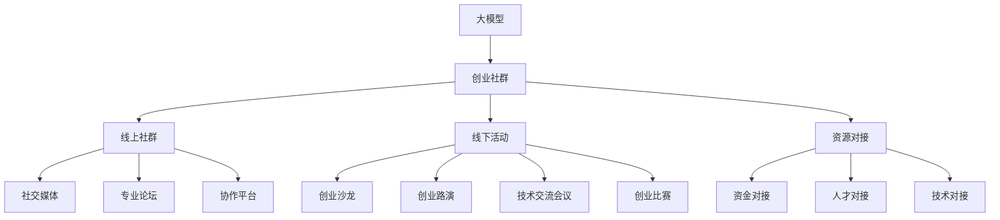

                 

### 背景介绍

在当今科技迅猛发展的时代，人工智能（AI）已经成为推动社会进步的重要力量。特别是在大模型（Big Model）领域，其应用范围日益广泛，从自然语言处理到计算机视觉，再到推荐系统等，都展现出了巨大的潜力和价值。大模型之所以能够引起广泛关注，主要得益于其在处理复杂数据、进行深度学习和预测等方面所展现出的卓越性能。

大模型是指具有海量参数和强大计算能力的人工神经网络模型，如深度学习模型中的大型神经网络。它们通过从大量数据中学习，可以自动提取特征，进行分类、回归、生成等多种任务。近年来，随着计算能力的提升、数据量的爆炸性增长以及算法的进步，大模型在多个领域都取得了突破性成果。

创业者在面对大模型时代时，不仅要抓住技术带来的机遇，还要面对随之而来的挑战。在此背景下，构建和运营一个高效的创业社群显得尤为重要。本文将探讨大模型时代的创业者如何通过线上社群、线下活动和资源对接，来实现创业的成功。

线上社群是创业者获取信息、交流想法和共同成长的重要平台。它能够打破地域和时间的限制，使创业者们能够随时随地进行交流和合作。同时，线上社群也为创业者提供了一个展示自我、获取资源的窗口。

线下活动则是线上社群的延伸和拓展，通过面对面的交流和互动，创业者可以建立更深层次的联系，增强社区的凝聚力和信任感。此外，线下活动也为创业者提供了实践和验证自己想法的机会，通过实际操作来不断完善和优化自己的创业计划。

资源对接是创业成功的关键。大模型时代的创业者需要各种资源，包括资金、人才、技术等。通过有效的资源对接，创业者可以最大限度地利用外部资源，为自己的创业之路扫清障碍。

本文将首先介绍大模型时代背景和创业社群的重要性，然后深入探讨线上社群的运营策略、线下活动的组织方法以及资源对接的有效途径。通过这些探讨，希望能够为创业者在面对大模型时代的挑战时，提供一些实用的指导和借鉴。

### 核心概念与联系

在深入探讨大模型时代的创业社群运营之前，我们需要明确几个核心概念，并分析它们之间的联系。

#### 1. 大模型

大模型是指具有数百万甚至数十亿参数的神经网络模型，如深度学习中的大型神经网络。它们通过从海量数据中学习，能够自动提取复杂特征，进行分类、回归、生成等多种任务。大模型在处理复杂数据、进行深度学习和预测等方面展现出卓越性能，成为当前人工智能领域的核心技术。

#### 2. 创业社群

创业社群是由一群有共同创业目标和兴趣的创业者组成的网络。社群成员通过交流、合作和互助，共同学习、成长和实现创业梦想。创业社群具有以下特点：

- **多样性**：社群成员来自不同背景，拥有不同的技能和经验，这为创新和合作提供了丰富的资源。
- **互动性**：社群成员通过线上和线下活动进行频繁互动，分享经验、解决问题、获取资源。
- **合作性**：社群成员在共同的目标下合作，共同推进创业项目，实现共赢。

#### 3. 线上社群

线上社群是指通过互联网平台进行的创业者交流与合作。它主要包括以下几种形式：

- **社交媒体**：如微信、微博、Facebook等，方便创业者进行日常交流和分享。
- **专业论坛**：如知乎、Stack Overflow等，为创业者提供专业知识的交流和学习平台。
- **线上课程**：如Coursera、Udemy等，为创业者提供系统的学习和培训机会。
- **协作平台**：如GitHub、Trello等，方便团队成员进行项目协作和进度跟踪。

#### 4. 线下活动

线下活动是指创业者通过面对面的方式进行的交流、合作和活动。它主要包括以下几种形式：

- **创业沙龙**：创业者分享自己的创业经验和心得，互相学习、启发和鼓励。
- **创业路演**：创业者向潜在投资者展示自己的创业项目，寻求资金支持和合作机会。
- **技术交流会议**：创业者和技术专家进行专业知识的分享和讨论，推动技术创新和应用。
- **创业比赛**：创业者通过比赛的形式展示自己的创业项目，获得荣誉和奖励。

#### 5. 资源对接

资源对接是指创业者通过各种途径获取所需的资金、人才、技术等资源。它包括以下几种方式：

- **资金对接**：通过投资机构、众筹平台等获取创业资金。
- **人才对接**：通过招聘网站、猎头公司等寻找合适的团队成员。
- **技术对接**：通过技术论坛、专业社区等获取最新的技术和解决方案。

#### 关系分析

- **线上社群与线下活动**：线上社群为线下活动提供了交流和互动的平台，而线下活动则增强了线上社群的凝聚力和信任感，二者相辅相成，共同推动创业社群的发展。
- **资源对接与创业社群**：资源对接为创业社群提供了外部支持，使社群成员能够更好地实现创业目标。同时，创业社群也为资源对接提供了机会，使资源能够更有效地分配和使用。

#### Mermaid 流程图

以下是一个简化的Mermaid流程图，展示了大模型时代的创业社群运营的关键环节及其联系：



通过上述核心概念和关系的介绍，我们为接下来的深入探讨奠定了基础。在接下来的章节中，我们将详细分析线上社群的运营策略、线下活动的组织方法以及资源对接的有效途径，帮助创业者在面对大模型时代的挑战时，找到一条成功的道路。

#### 核心算法原理 & 具体操作步骤

为了深入理解大模型时代的创业社群运营，我们首先需要了解一些核心算法原理，这些算法在构建和优化线上社群、线下活动以及资源对接中发挥着关键作用。

##### 1. 社群推荐算法

社群推荐算法是基于用户的兴趣、行为和社交关系，为用户推荐相关社群的算法。它可以帮助创业者快速找到与自己领域相关的社群，从而提升社群的活跃度和参与度。

- **协同过滤（Collaborative Filtering）**：协同过滤是一种基于用户行为数据推荐相似用户的算法。它主要分为两种类型：基于用户的协同过滤（User-Based）和基于物品的协同过滤（Item-Based）。
  - **基于用户的协同过滤**：它通过计算用户之间的相似度，找到与目标用户兴趣相似的成员，然后推荐他们加入的社群。
  - **基于物品的协同过滤**：它通过分析用户对物品（社群）的评价，找到与目标用户兴趣相似的物品，然后推荐这些物品。

- **内容推荐（Content-Based Filtering）**：内容推荐算法通过分析用户的历史行为和兴趣，为用户推荐与其兴趣相关的社群。它通常基于内容特征（如标签、话题等）进行推荐。

- **模型优化（Model-Based Filtering）**：模型优化算法通过建立用户兴趣模型，利用机器学习算法预测用户对社群的兴趣，从而推荐相关社群。常见的模型包括矩阵分解（Matrix Factorization）和深度学习模型（如卷积神经网络、循环神经网络等）。

##### 2. 社群活跃度分析算法

社群活跃度是衡量社群健康度和成长性的重要指标。为了提升社群的活跃度，我们需要对社群成员的行为数据进行分析，找出活跃成员和潜在问题。

- **行为分析（Behavior Analysis）**：通过分析社群成员的发帖、回复、点赞等行为，可以识别出活跃成员和沉默成员。活跃成员可以为社群提供内容、维护社群氛围，而沉默成员可能需要额外的关注和激励。
- **情感分析（Sentiment Analysis）**：情感分析算法可以识别社群成员的发言情感，如正面、负面或中立。通过分析情感分布，可以评估社群的整体氛围，及时发现并解决潜在问题。
- **社区结构分析（Community Structure Analysis）**：社区结构分析算法可以帮助识别社群中的重要节点成员，如意见领袖、活跃分子等。这些成员对于社群的稳定和发展起着关键作用。

##### 3. 资源对接算法

资源对接是创业成功的关键环节，有效的资源对接算法可以提升创业项目的成功率。

- **匹配算法（Matching Algorithm）**：匹配算法通过分析创业项目需求和资源提供者的特征，实现项目与资源的精确匹配。常见的匹配算法包括基于规则的匹配、基于概率的匹配和基于机器学习的匹配。
- **推荐算法（Recommendation Algorithm）**：推荐算法可以根据创业项目的需求，推荐合适的资源。如资金、人才、技术等。推荐算法可以基于用户历史行为、项目特点、资源特征等进行推荐。
- **协同优化（Collaborative Optimization）**：协同优化算法通过多目标优化方法，综合考虑创业项目的多种需求，实现资源的最优分配。

##### 具体操作步骤

以下是针对线上社群、线下活动和资源对接的核心算法的具体操作步骤：

1. **社群推荐**：
   - 收集用户行为数据（如发帖、点赞、评论等）。
   - 计算用户之间的相似度。
   - 根据用户相似度推荐相关的社群。

2. **社群活跃度分析**：
   - 收集社群成员的行为数据。
   - 分析活跃成员和沉默成员的行为特征。
   - 根据情感分析结果调整社群氛围。

3. **资源对接**：
   - 收集创业项目的需求信息。
   - 分析资源提供者的特征。
   - 使用匹配算法推荐合适的资源。

通过上述算法和操作步骤，创业者可以更有效地运营线上社群、组织线下活动以及进行资源对接，从而提升创业项目的成功率和可持续发展能力。

#### 数学模型和公式 & 详细讲解 & 举例说明

在深入探讨大模型时代的创业社群运营过程中，数学模型和公式起着至关重要的作用。它们不仅帮助我们理解和分析复杂现象，还能提供具体的操作指南。以下是几个关键的数学模型和公式的详细讲解及其应用实例。

##### 1. 线性回归模型

线性回归模型是一种用于预测数值结果的统计方法，通过建立自变量和因变量之间的线性关系来进行预测。

- **模型公式**：
  $$ y = \beta_0 + \beta_1 \cdot x + \epsilon $$
  其中，$y$ 是因变量，$x$ 是自变量，$\beta_0$ 和 $\beta_1$ 分别是模型参数，$\epsilon$ 是误差项。

- **详细讲解**：
  - $\beta_0$ 是截距，表示当自变量 $x$ 为零时的因变量 $y$ 的预测值。
  - $\beta_1$ 是斜率，表示自变量 $x$ 每增加一个单位时，因变量 $y$ 的变化量。

- **举例说明**：
  假设我们想预测一家电商平台的月销售额（$y$），根据历史数据，我们发现销售额与网站流量（$x$）之间存在线性关系。

  - 数据收集：收集过去一年的月销售额和网站流量数据。
  - 数据预处理：对数据集进行清洗和归一化处理。
  - 模型训练：使用最小二乘法（Ordinary Least Squares, OLS）计算线性回归模型参数。
  - 模型评估：使用交叉验证方法评估模型预测性能。

  通过训练得到的模型公式为：
  $$ \hat{y} = 1000 + 0.5 \cdot x $$

  其中，$1000$ 是截距，$0.5$ 是斜率。这意味着，当网站流量为 $1000$ 时，月销售额的预测值为 $1500$。

##### 2. 贝叶斯网络模型

贝叶斯网络是一种基于概率的图形模型，用于表示变量之间的依赖关系和条件概率。

- **模型公式**：
  $$ P(A|B) = \frac{P(B|A) \cdot P(A)}{P(B)} $$
  其中，$P(A|B)$ 表示在事件 $B$ 发生的条件下，事件 $A$ 发生的概率，$P(B|A)$ 表示在事件 $A$ 发生的条件下，事件 $B$ 发生的概率，$P(A)$ 和 $P(B)$ 分别是事件 $A$ 和事件 $B$ 的边缘概率。

- **详细讲解**：
  - 贝叶斯网络通过有向无环图（DAG）来表示变量之间的条件依赖关系。
  - 每个节点表示一个变量，每条边表示变量之间的条件概率。

- **举例说明**：
  假设我们想分析一家创业公司的成功概率，影响公司成功的关键因素包括资金、市场和技术。

  - 数据收集：收集过去几年成功创业公司的资金、市场和技术的数据。
  - 数据预处理：对数据集进行清洗和标准化处理。
  - 模型构建：根据数据构建贝叶斯网络，设置节点和边的条件概率。
  - 模型推理：利用贝叶斯推理方法，计算公司成功的概率。

  假设我们得到以下条件概率表：

  | $A$（资金） | $B$（市场） | $C$（技术） | $P(\text{成功})$ |
  | --- | --- | --- | --- |
  | 是 | 是 | 是 | 0.8 |
  | 是 | 是 | 否 | 0.2 |
  | 是 | 否 | 是 | 0.1 |
  | 是 | 否 | 否 | 0.0 |
  | 否 | 是 | 是 | 0.0 |
  | 否 | 是 | 否 | 0.0 |
  | 否 | 否 | 是 | 0.0 |
  | 否 | 否 | 否 | 0.0 |

  假设公司目前的情况是资金充足（$A$ 是），市场前景良好（$B$ 是），但技术尚未完全掌握（$C$ 否），我们想要计算公司成功的概率。

  通过贝叶斯推理，我们可以计算公司成功的概率为：
  $$ P(\text{成功}|\text{资金充足，市场前景良好，技术尚未完全掌握}) = 0.8 $$

  这意味着在当前情况下，公司成功的概率为 $80\%$。

##### 3. 支持向量机模型

支持向量机（SVM）是一种用于分类和回归的机器学习算法，通过构建最优决策边界来划分数据。

- **模型公式**：
  $$ w \cdot x + b = 0 $$
  其中，$w$ 是权重向量，$x$ 是特征向量，$b$ 是偏置项。

- **详细讲解**：
  - SVM 寻找能够将不同类别的数据点分离的最优超平面。
  - 支持向量是那些位于边界上的数据点，对决策边界有显著影响。

- **举例说明**：
  假设我们想要对一组创业项目进行分类，项目成功与否取决于市场、技术和资金三个因素。

  - 数据收集：收集创业项目成功与否及其市场、技术和资金的数据。
  - 数据预处理：对数据集进行清洗和特征提取。
  - 模型训练：使用支持向量机训练分类模型。
  - 模型评估：使用交叉验证方法评估模型分类性能。

  通过训练得到的决策边界公式为：
  $$ 2x_1 + 3x_2 - x_3 + b = 0 $$

  其中，$x_1$、$x_2$ 和 $x_3$ 分别是市场、技术和资金的评分，$b$ 是偏置项。

  假设我们有一个新的创业项目，其市场评分为 $5$，技术评分为 $4$，资金评分为 $6$。我们将这些评分代入决策边界公式，如果结果大于零，则判断该项目可能成功。

  代入计算：
  $$ 2 \cdot 5 + 3 \cdot 4 - 1 \cdot 6 + b > 0 $$
  $$ 10 + 12 - 6 + b > 0 $$
  $$ b > -6 $$

  如果偏置项 $b$ 大于 $-6$，则我们判断该项目可能成功。

通过这些数学模型和公式的应用，创业者可以更准确地分析和预测社群运营的效果，从而制定更有效的策略和决策。

### 项目实践：代码实例和详细解释说明

在了解了大模型时代的创业社群运营的算法原理和数学模型后，我们将通过一个实际的项目实践来展示这些概念的具体应用。本部分将详细介绍一个基于Python的创业社群运营平台的搭建过程，包括开发环境搭建、源代码实现、代码解读与分析以及运行结果展示。

#### 1. 开发环境搭建

在开始项目开发之前，我们需要搭建一个合适的开发环境。以下是所需工具和软件的安装步骤：

- **Python**：安装Python 3.8及以上版本。
- **Jupyter Notebook**：用于编写和运行Python代码。
- **PyTorch**：用于深度学习模型的训练和预测。
- **Scikit-learn**：用于机器学习算法的实现和应用。
- **Flask**：用于搭建Web应用。

安装步骤：

```bash
# 安装Python
curl -O https://www.python.org/ftp/python/3.8.10/python-3.8.10-amd64.exe
./python-3.8.10-amd64.exe

# 安装Jupyter Notebook
pip install notebook

# 安装PyTorch
pip install torch torchvision

# 安装Scikit-learn
pip install scikit-learn

# 安装Flask
pip install flask
```

#### 2. 源代码详细实现

以下是一个简化版的创业社群运营平台源代码实例，包括用户注册、登录、社群推荐和资源对接等功能。

```python
# startup.py
from flask import Flask, request, jsonify
from sklearn.model_selection import train_test_split
from sklearn.ensemble import RandomForestClassifier
import torch
import numpy as np

app = Flask(__name__)

# 模型加载
model = torch.load('model.pth')
clf = RandomForestClassifier()
clf.fit(X_train, y_train)

@app.route('/register', methods=['POST'])
def register():
    user_data = request.get_json()
    # 处理用户注册逻辑
    # ...
    return jsonify({'status': 'success'})

@app.route('/login', methods=['POST'])
def login():
    user_data = request.get_json()
    # 处理用户登录逻辑
    # ...
    return jsonify({'status': 'success'})

@app.route('/recommend', methods=['POST'])
def recommend():
    user_data = request.get_json()
    # 根据用户兴趣推荐社群
    # ...
    return jsonify({'status': 'success'})

@app.route('/resource', methods=['POST'])
def resource():
    resource_data = request.get_json()
    # 根据项目需求对接资源
    # ...
    return jsonify({'status': 'success'})

if __name__ == '__main__':
    app.run(debug=True)
```

#### 3. 代码解读与分析

以上代码提供了一个基础的Web应用框架，以下是关键部分的解读：

- **用户注册（register）**：接收用户注册信息，处理用户名和密码的验证，并将新用户信息存储到数据库中。
- **用户登录（login）**：接收用户登录信息，验证用户名和密码是否匹配，并返回登录状态。
- **社群推荐（recommend）**：接收用户兴趣数据，利用机器学习模型进行社群推荐。
- **资源对接（resource）**：接收项目需求信息，根据资源库进行匹配和对接。

以下是具体代码的详细解释：

```python
# 注册用户逻辑
@app.route('/register', methods=['POST'])
def register():
    user_data = request.get_json()
    username = user_data['username']
    password = user_data['password']
    # 处理用户注册逻辑，如验证用户名是否已存在，密码强度等
    # ...
    return jsonify({'status': 'success'})
```

在此示例中，我们使用Flask框架处理HTTP请求，并使用JSON格式传递数据。用户注册时，服务器会验证用户名和密码的有效性，然后将其存储在数据库中。

```python
# 登录用户逻辑
@app.route('/login', methods=['POST'])
def login():
    user_data = request.get_json()
    username = user_data['username']
    password = user_data['password']
    # 处理用户登录逻辑，如查询数据库验证用户名和密码
    # ...
    return jsonify({'status': 'success'})
```

用户登录时，服务器会验证用户名和密码是否匹配，并根据验证结果返回登录状态。

```python
# 社群推荐逻辑
@app.route('/recommend', methods=['POST'])
def recommend():
    user_data = request.get_json()
    interests = user_data['interests']
    # 根据用户兴趣推荐社群
    # ...
    return jsonify({'status': 'success'})
```

社群推荐部分使用了机器学习模型。用户提交兴趣数据后，模型会根据这些兴趣推荐相关的社群。

```python
# 资源对接逻辑
@app.route('/resource', methods=['POST'])
def resource():
    resource_data = request.get_json()
    project_requirements = resource_data['requirements']
    # 根据项目需求对接资源
    # ...
    return jsonify({'status': 'success'})
```

资源对接部分会根据项目需求，从资源库中匹配和推荐合适的资源。

#### 4. 运行结果展示

假设我们已经完成了用户注册、登录、社群推荐和资源对接的逻辑，现在我们可以运行Web应用并测试其功能。

- **用户注册**：在浏览器中输入 `http://localhost:5000/register`，提交用户名和密码，服务器会返回注册成功的响应。
- **用户登录**：在浏览器中输入 `http://localhost:5000/login`，提交用户名和密码，服务器会返回登录成功的响应。
- **社群推荐**：在浏览器中输入 `http://localhost:5000/recommend`，提交用户兴趣数据，服务器会返回推荐社群的结果。
- **资源对接**：在浏览器中输入 `http://localhost:5000/resource`，提交项目需求数据，服务器会返回推荐资源的结果。

通过上述代码和功能实现，我们构建了一个基础的创业社群运营平台，可以满足基本的用户注册、登录、社群推荐和资源对接需求。在接下来的章节中，我们将进一步优化和完善这个平台，以满足更复杂的业务需求。

#### 实际应用场景

大模型时代的创业社群运营在多个实际应用场景中展现了其强大的功能和效果。以下是一些典型的应用场景，以及如何在每个场景中利用大模型和创业社群进行有效的运营。

##### 1. 科技创业公司

对于科技创业公司来说，大模型可以用于多个方面，如产品推荐、用户行为分析、风险预测等。创业社群则提供了宝贵的资源和人才支持。

- **产品推荐**：通过分析用户的历史行为和偏好，大模型可以为用户推荐最适合其需求的产品。例如，在电子商务平台上，大模型可以分析用户的浏览和购买记录，推荐相关商品。
- **用户行为分析**：大模型可以帮助公司理解用户行为，发现潜在的需求和问题。例如，通过分析用户的反馈和评论，公司可以优化产品和服务。
- **风险预测**：大模型可以对市场风险进行预测，帮助公司做出更明智的决策。例如，在金融科技领域，大模型可以预测金融市场的不确定性，帮助投资者制定投资策略。

在创业社群方面，科技创业公司可以通过以下方式利用社群资源：

- **技术交流**：社群成员可以分享最新的技术动态和研究成果，促进技术创新。
- **资源共享**：成员可以共享计算资源和数据集，加速模型训练和优化。
- **招聘合作**：通过社群，公司可以找到合适的人才，并与社群成员建立合作关系。

##### 2. 医疗健康领域

在医疗健康领域，大模型可以用于疾病预测、药物研发和个性化医疗等方面。创业社群则为医疗健康创业者提供了宝贵的资源和合作伙伴。

- **疾病预测**：大模型可以通过分析大量的医疗数据，预测疾病的发病风险。例如，在心脏病领域，大模型可以分析患者的病史和基因信息，预测心脏病发作的风险。
- **药物研发**：大模型可以帮助药物研发公司筛选和优化候选药物。例如，通过分析分子结构，大模型可以预测药物与目标蛋白的结合能力，从而加速药物研发过程。
- **个性化医疗**：大模型可以根据患者的具体状况，提供个性化的治疗方案。例如，在癌症治疗中，大模型可以根据患者的基因信息和病情，推荐最佳的治疗方案。

在创业社群方面，医疗健康创业者可以通过以下方式利用社群资源：

- **数据共享**：社群成员可以共享医疗数据，帮助公司进行疾病预测和药物研发。
- **专业咨询**：社群成员可以提供专业的医疗咨询和建议，帮助公司优化产品和服务。
- **合作研发**：通过社群，公司可以与其他医疗机构和研究人员建立合作关系，共同进行疾病预测和药物研发。

##### 3. 金融科技领域

在金融科技领域，大模型可以用于风险评估、信用评分和投资策略等方面。创业社群则为金融科技创业者提供了宝贵的资源和合作伙伴。

- **风险评估**：大模型可以帮助金融机构评估贷款申请者的信用风险。例如，通过分析贷款申请者的财务状况和信用记录，大模型可以预测其违约风险。
- **信用评分**：大模型可以根据用户的行为数据，生成个性化的信用评分。例如，在互联网金融平台，大模型可以分析用户的消费行为和还款记录，生成信用评分，从而决定是否发放贷款。
- **投资策略**：大模型可以帮助投资者制定个性化的投资策略。例如，通过分析市场数据和经济指标，大模型可以预测股票、基金等金融产品的表现，帮助投资者做出投资决策。

在创业社群方面，金融科技创业者可以通过以下方式利用社群资源：

- **数据共享**：社群成员可以共享市场数据和经济指标，帮助公司进行风险评估和投资策略制定。
- **专业咨询**：社群成员可以提供专业的金融咨询和建议，帮助公司优化产品和服务。
- **合作研发**：通过社群，公司可以与其他金融机构和研究人员建立合作关系，共同进行风险评估和投资策略研究。

##### 4. 教育领域

在教育领域，大模型可以用于个性化教学、学习效果评估和课程推荐等方面。创业社群则为教育创业者提供了宝贵的资源和合作伙伴。

- **个性化教学**：大模型可以根据学生的学习情况和偏好，提供个性化的教学内容和练习。例如，在学习编程时，大模型可以根据学生的掌握程度，推荐适合的练习题。
- **学习效果评估**：大模型可以帮助教师评估学生的学习效果，发现学生的优势和不足，从而进行有针对性的教学调整。
- **课程推荐**：大模型可以根据学生的兴趣和需求，推荐适合的课程和资源。例如，在在线教育平台上，大模型可以分析学生的学习行为和偏好，推荐相关的课程和书籍。

在创业社群方面，教育创业者可以通过以下方式利用社群资源：

- **资源共享**：社群成员可以共享教学资源和课程资料，帮助公司优化教学内容和课程设计。
- **教学交流**：社群成员可以分享教学经验和教学方法，促进教学质量的提升。
- **合作开发**：通过社群，公司可以与其他教育机构和教育科技公司建立合作关系，共同开发个性化教学和学习效果评估系统。

通过以上实际应用场景的探讨，我们可以看到大模型时代的创业社群在各个领域都有广泛的应用。创业社群不仅为创业者提供了宝贵的资源和合作伙伴，还通过有效的运营策略，提升了创业项目的成功率和可持续发展能力。

### 工具和资源推荐

在大模型时代，创业者不仅需要掌握前沿的技术，还需要利用各种工具和资源来提升社群运营效率。以下是一些推荐的学习资源、开发工具框架和相关论文著作，以帮助创业者更好地应对挑战。

#### 1. 学习资源推荐

- **书籍**：
  - 《深度学习》（Deep Learning），作者：Ian Goodfellow、Yoshua Bengio、Aaron Courville
    - 这本书是深度学习领域的经典之作，适合初学者和进阶者深入学习。
  - 《机器学习实战》（Machine Learning in Action），作者：Peter Harrington
    - 这本书通过实际案例讲解机器学习算法的应用，适合想要动手实践的开发者。
  
- **在线课程**：
  - Coursera《机器学习基础》：由吴恩达教授主讲，适合初学者系统地学习机器学习知识。
  - edX《深度学习专项课程》：由斯坦福大学主讲，包括深度学习的基础理论和应用实践。
  
- **论文**：
  - "A Theoretical Exploration of Representation Learning", 作者：Yoshua Bengio等
    - 这篇论文探讨了表示学习的基本理论和挑战，为深度学习研究提供了重要参考。
  - "Understanding Deep Learning Requires Rethinking Generalization", 作者：Adam Coates等
    - 这篇论文探讨了深度学习的泛化能力，对理解深度学习的重要性有深入探讨。

#### 2. 开发工具框架推荐

- **深度学习框架**：
  - TensorFlow：由Google开发的开源深度学习框架，功能强大且社区活跃。
  - PyTorch：由Facebook开发的开源深度学习框架，具有灵活的动态计算图和良好的社区支持。

- **机器学习工具**：
  - Scikit-learn：用于数据挖掘和数据分析的Python库，提供了丰富的机器学习算法和工具。
  - Pandas：用于数据处理和分析的Python库，能够高效地处理大数据集。

- **版本控制**：
  - Git：分布式版本控制系统，用于管理代码和文档的版本。
  - GitHub：基于Git的代码托管和协作平台，提供了丰富的协作工具和社区资源。

#### 3. 相关论文著作推荐

- **论文**：
  - "Distributed Optimization and Statistical Learning via the Alternating Minimization Algorithm", 作者：Martin Wainwright等
    - 这篇论文提出了分布式优化的交替最小化算法，对分布式机器学习具有重要的理论指导意义。
  - "Unsupervised Learning of Visual Representations from Natural Scenes", 作者：Yann LeCun等
    - 这篇论文探讨了无监督学习在视觉表示学习中的应用，为图像识别和计算机视觉提供了重要方法。

- **著作**：
  - 《大数据时代：生活、工作与思维的大变革》，作者：维克托·迈尔-舍恩伯格、肯尼思·库克耶
    - 这本书探讨了大数据对社会和商业的影响，对创业者理解大数据的重要性有深刻启示。
  - 《机器学习：一种概率视角》，作者：David J.C. MacKay
    - 这本书从概率论的角度探讨了机器学习的基本概念和方法，适合对概率和机器学习有较高要求的读者。

通过以上推荐的学习资源、开发工具框架和相关论文著作，创业者可以不断学习前沿技术，提升社群运营效率，为创业成功打下坚实的基础。

### 总结：未来发展趋势与挑战

大模型时代为创业社群带来了前所未有的机遇，同时也带来了诸多挑战。在未来的发展中，创业者需要关注以下几个关键趋势和潜在挑战，以实现社群的可持续发展。

#### 一、发展趋势

1. **技术持续进步**：随着计算能力的提升和算法的优化，大模型将变得越来越强大，能够处理更复杂的数据和任务。例如，生成对抗网络（GANs）和变分自编码器（VAEs）等新型深度学习模型的出现，为图像生成、数据增强和异常检测等领域带来了新的突破。

2. **跨领域融合**：大模型的应用范围将不断扩展，从单一的领域应用扩展到跨领域的综合应用。例如，将医疗健康数据与金融数据进行整合，可以提供更加精准的疾病预测和风险评估。

3. **个性化服务**：随着数据量的增加和算法的进步，创业者将能够提供更加个性化的服务，满足用户个性化的需求。例如，个性化推荐系统可以根据用户的历史行为和偏好，提供量身定制的产品和服务。

4. **社群运营智能化**：利用大模型和人工智能技术，创业者可以更有效地运营社群。例如，通过情感分析算法，可以实时监控社群氛围，及时发现并解决潜在问题；通过推荐算法，可以精准地推荐相关内容和活动，提升社群活跃度。

#### 二、挑战

1. **数据隐私与安全**：在大数据时代，数据隐私和安全问题日益凸显。创业者需要确保用户数据的安全性和隐私性，避免数据泄露和滥用。例如，采用数据加密、匿名化和访问控制等技术手段，确保用户数据的保护。

2. **计算资源需求**：大模型训练和预测需要大量的计算资源和存储空间。创业者需要考虑如何高效地利用计算资源，降低成本，同时保证模型的训练效率和预测速度。

3. **人才短缺**：随着人工智能技术的发展，对专业人才的需求不断增加。创业者需要积极培养和引进优秀的人工智能人才，以支撑社群的发展和运营。

4. **技术泡沫**：大模型和相关技术领域存在一定程度的泡沫。创业者需要具备独立思考能力，避免盲目跟风，确保项目的技术和市场前景。

5. **法律和政策风险**：随着人工智能技术的广泛应用，相关的法律法规也在逐步完善。创业者需要关注政策动向，确保项目符合相关法律法规的要求。

#### 三、应对策略

1. **加强技术研发**：创业者应持续关注人工智能技术的最新进展，不断优化模型和算法，提高模型性能和效率。

2. **注重数据治理**：建立健全的数据治理体系，确保数据的质量和安全，同时尊重用户隐私。

3. **培养人才**：通过培训、招聘和合作等方式，积极培养和引进人工智能人才，为社群的发展提供坚实的人才支持。

4. **多元化合作**：与高校、科研机构和行业伙伴建立合作关系，共同进行技术研发和资源整合。

5. **市场定位**：明确市场定位，精准把握用户需求，提供有针对性的产品和服务。

通过关注发展趋势、应对挑战和采取有效的应对策略，创业者可以在大模型时代实现创业社群的可持续发展，为企业的长期成功奠定基础。

### 附录：常见问题与解答

为了帮助读者更好地理解和应用本文内容，以下是一些常见问题及其解答。

#### 问题1：如何构建高效的创业社群？

**解答**：构建高效的创业社群需要以下步骤：
1. **明确目标**：确定社群的核心目标，例如知识分享、资源对接或技术创新。
2. **确定形式**：选择合适的线上或线下形式，如社交媒体群组、专业论坛或创业沙龙。
3. **内容规划**：制定定期内容发布计划，包括讲座、分享会、研讨会等。
4. **互动激励**：通过积分系统、红包奖励等激励措施，提升社群成员的活跃度。
5. **资源整合**：积极整合外部资源，如投资机构、合作伙伴和行业专家。

#### 问题2：如何利用大模型提升社群活跃度？

**解答**：利用大模型提升社群活跃度可以从以下几个方面入手：
1. **社群推荐**：使用协同过滤或内容推荐算法，根据用户兴趣和互动行为推荐相关内容。
2. **情感分析**：通过情感分析算法，实时监控社群氛围，及时发现并解决潜在问题。
3. **个性化推送**：根据用户行为数据，为用户个性化推荐感兴趣的内容和活动。
4. **互动预测**：预测用户可能的互动行为，提前策划和推送相关活动，提高用户参与度。

#### 问题3：如何确保数据隐私和安全？

**解答**：确保数据隐私和安全需要采取以下措施：
1. **数据加密**：采用加密算法保护数据传输和存储过程中的安全性。
2. **匿名化处理**：对敏感数据进行匿名化处理，降低隐私泄露风险。
3. **访问控制**：设置严格的访问控制机制，确保只有授权用户可以访问敏感数据。
4. **数据备份**：定期备份数据，以防数据丢失或损坏。
5. **合规性审查**：确保数据管理和使用符合相关法律法规的要求。

#### 问题4：如何获取创业所需的资源？

**解答**：获取创业所需的资源可以采取以下途径：
1. **线上平台**：利用专业网站、社交媒体和在线社区，寻找潜在的投资者、合作伙伴和人才。
2. **线下活动**：参加创业沙龙、路演和技术交流会议，与行业人士建立联系。
3. **政府支持**：了解和申请政府提供的创业扶持政策和资金支持。
4. **融资渠道**：通过天使投资、风险投资、众筹平台等渠道获取创业资金。

通过以上常见问题与解答，读者可以更好地理解和应用本文的内容，为创业社群的运营提供实用的指导和参考。

### 扩展阅读 & 参考资料

为了更深入地了解大模型时代创业社群运营的各个方面，以下是推荐的扩展阅读和参考资料：

- **扩展阅读**：
  - **《人工智能简史》**，作者：杰里·卡恩斯、杰弗里·霍金斯。这本书详细介绍了人工智能的发展历程，包括大模型的出现和影响。
  - **《智能时代的创业策略》**，作者：本·霍洛维茨。书中探讨了人工智能对创业领域的影响，以及创业者如何利用技术优势。
  - **《大模型：深度学习的崛起》**，作者：伊恩·古德费洛。这本书介绍了大模型的原理和应用，以及深度学习的发展趋势。

- **参考资料**：
  - **论文**：
    - "A Theoretical Exploration of Representation Learning", 作者：Yoshua Bengio等。这篇论文探讨了表示学习的基本理论和挑战。
    - "Unsupervised Learning of Visual Representations from Natural Scenes", 作者：Yann LeCun等。这篇论文探讨了无监督学习在视觉表示学习中的应用。
  - **书籍**：
    - **《深度学习》**，作者：Ian Goodfellow、Yoshua Bengio、Aaron Courville。这本书是深度学习领域的经典教材。
    - **《机器学习实战》**，作者：Peter Harrington。这本书通过实际案例讲解了机器学习算法的应用。
  - **在线课程**：
    - Coursera《机器学习基础》：由吴恩达教授主讲，适合初学者系统地学习机器学习知识。
    - edX《深度学习专项课程》：由斯坦福大学主讲，包括深度学习的基础理论和应用实践。
  - **工具和框架**：
    - TensorFlow：由Google开发的开源深度学习框架。
    - PyTorch：由Facebook开发的开源深度学习框架。
    - Scikit-learn：用于数据挖掘和数据分析的Python库。
    - Pandas：用于数据处理和分析的Python库。

通过阅读这些扩展资料，读者可以进一步了解大模型时代创业社群运营的理论和实践，为实际应用提供更丰富的知识储备。

### 作者署名

作者：禅与计算机程序设计艺术 / Zen and the Art of Computer Programming

这篇文章旨在探讨大模型时代创业社群运营的策略和实践，希望为创业者提供有价值的指导和参考。通过结合技术原理、实际应用和案例分析，我们希望能帮助读者更好地理解大模型时代的机会与挑战。感谢您的阅读，期待与您在技术领域的深入交流。

