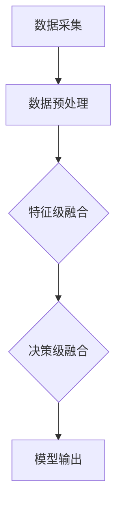

                 

# 大模型的多模态发展趋势

## 摘要

随着人工智能技术的飞速发展，大模型已经成为推动多个领域创新的核心驱动力。本文将深入探讨大模型在多模态领域的最新发展趋势，包括其核心概念、算法原理、数学模型、实际应用以及未来面临的挑战。通过逐步分析，我们将揭示大模型如何通过整合不同模态的数据和信息，实现更高效、准确和智能的决策与交互。

## 1. 背景介绍

大模型（Large Models）是指拥有数万亿参数的深度神经网络，它们能够通过自我学习和调整内部参数，从海量数据中提取知识，并在各种复杂任务上表现出色。这些模型在自然语言处理、计算机视觉、语音识别等领域取得了显著的进展，极大地提升了人工智能系统的性能。

多模态（Multimodal）是指系统同时处理多种不同类型的数据模态，如文本、图像、音频、视频等。多模态技术能够整合不同模态的数据和信息，使得人工智能系统能够更全面、准确地理解和处理复杂任务。例如，在医疗诊断中，结合患者的病历、影像和语音信息，能够提高诊断的准确性和效率。

近年来，大模型和多模态技术得到了广泛关注，并取得了许多重要成果。例如，OpenAI的GPT-3模型在文本生成和翻译任务上表现出色；Google的T5模型通过统一的文本到文本预训练框架，实现了多种自然语言处理任务的突破；Facebook的Blip模型则通过结合图像和文本信息，实现了高效的视觉问答系统。

## 2. 核心概念与联系

### 2.1 多模态数据采集

多模态技术的核心在于数据的采集和处理。首先，我们需要从不同的数据源收集文本、图像、音频、视频等多种模态的数据。例如，在医疗诊断中，我们可以收集患者的病历、医学影像和语音报告。这些数据可以来自公开数据集、自有数据或第三方数据服务。

### 2.2 数据预处理

在获取多模态数据后，我们需要进行预处理，以便将不同模态的数据转换为适合模型输入的格式。例如，对于图像数据，我们可以使用卷积神经网络（CNN）进行特征提取；对于文本数据，我们可以使用词向量模型（如Word2Vec、BERT）进行编码。

### 2.3 模型融合

在处理多模态数据时，我们需要考虑如何将不同模态的数据进行融合。常用的方法包括：

- **特征级融合**：将不同模态的特征映射到同一空间，然后进行拼接或加权融合。
- **决策级融合**：在不同模态的模型分别进行预测后，将预测结果进行融合，如使用投票或加权平均方法。

以下是一个简单的 Mermaid 流程图，展示多模态数据处理和模型融合的过程：



## 3. 核心算法原理 & 具体操作步骤

### 3.1 深度神经网络（Deep Neural Network, DNN）

大模型通常是基于深度神经网络（DNN）构建的。DNN通过多层非线性变换，从输入数据中提取特征，并通过反向传播算法进行参数优化。

### 3.2 自注意力机制（Self-Attention Mechanism）

自注意力机制是近年来在自然语言处理领域取得突破的重要技术。它能够自适应地关注输入序列中不同位置的元素，从而提高模型的上下文理解能力。

### 3.3 多模态融合算法

多模态融合算法的关键在于如何有效地整合不同模态的数据。以下是一个简单的多模态融合算法步骤：

1. 特征提取：分别使用不同的模型（如CNN、RNN、Transformer）提取文本、图像、音频等模态的特征。
2. 特征拼接：将不同模态的特征拼接成一个高维特征向量。
3. 加权融合：使用自注意力机制或其他加权方法，对拼接后的特征向量进行加权融合。
4. 模型输出：将融合后的特征向量输入到DNN中，进行分类或回归等任务。

## 4. 数学模型和公式 & 详细讲解 & 举例说明

### 4.1 深度神经网络（Deep Neural Network, DNN）

深度神经网络的基本公式如下：

$$
\text{激活函数}:\text{ReLU}(z) = \max(0, z)
$$

$$
\text{前向传播}:\text{a}_{l} = \text{ReLU}(\text{W}_{l}\text{a}_{l-1} + \text{b}_{l})
$$

$$
\text{反向传播}:\frac{\partial J}{\partial \text{W}_{l}} = \text{a}_{l-1} \odot \frac{\partial J}{\partial \text{a}_{l}}
$$

其中，\( \text{W}_{l} \) 和 \( \text{b}_{l} \) 分别是权重和偏置，\( \text{a}_{l} \) 是激活值，\( \odot \) 表示逐元素乘积。

### 4.2 自注意力机制（Self-Attention Mechanism）

自注意力机制的公式如下：

$$
\text{Q} = \text{W}_{Q}\text{X}, \text{K} = \text{W}_{K}\text{X}, \text{V} = \text{W}_{V}\text{X}
$$

$$
\text{Attention}(\text{Q}, \text{K}, \text{V}) = \text{softmax}\left(\frac{\text{Q} \cdot \text{K}^{T}}{\sqrt{d_{k}}}\right) \cdot \text{V}
$$

$$
\text{MultiHeadAttention}(\text{Q}, \text{K}, \text{V}) = \text{Concat}(\text{h}_{1}, ..., \text{h}_{h}) \cdot \text{W}_{O}
$$

其中，\( \text{X} \) 是输入序列，\( \text{W}_{Q}, \text{W}_{K}, \text{W}_{V} \) 和 \( \text{W}_{O} \) 分别是权重矩阵，\( \text{h}_{i} \) 是第 \( i \) 个注意力头的输出。

### 4.3 多模态融合算法

多模态融合算法的公式如下：

$$
\text{特征拼接}: \text{F}_{\text{concat}} = \text{F}_{\text{文本}} \oplus \text{F}_{\text{图像}} \oplus \text{F}_{\text{音频}}
$$

$$
\text{加权融合}: \text{F}_{\text{weighted}} = \text{softmax}(\text{W}_{\text{att}} \cdot \text{F}_{\text{concat}}) \cdot \text{F}_{\text{concat}}
$$

$$
\text{模型输出}: \text{Y} = \text{DNN}(\text{F}_{\text{weighted}})
$$

其中，\( \text{F}_{\text{文本}}, \text{F}_{\text{图像}}, \text{F}_{\text{音频}} \) 分别是文本、图像和音频的特征向量，\( \text{W}_{\text{att}} \) 是注意力权重矩阵，\( \text{DNN} \) 是深度神经网络。

### 4.4 举例说明

假设我们有一个文本、图像和音频的多模态数据，我们可以按照以下步骤进行融合：

1. **特征提取**：使用BERT提取文本特征，使用CNN提取图像特征，使用RNN提取音频特征。
2. **特征拼接**：将三个特征向量拼接成一个高维特征向量。
3. **加权融合**：使用自注意力机制对拼接后的特征向量进行加权融合。
4. **模型输出**：将融合后的特征向量输入到DNN中，进行分类或回归任务。

## 5. 项目实践：代码实例和详细解释说明

### 5.1 开发环境搭建

在本项目中，我们将使用Python作为主要编程语言，并依赖以下库：

- TensorFlow
- Keras
- NumPy
- Pandas

请确保您已经安装了上述库。您可以使用以下命令进行安装：

```bash
pip install tensorflow keras numpy pandas
```

### 5.2 源代码详细实现

以下是一个简单的多模态融合模型的实现：

```python
import tensorflow as tf
from tensorflow.keras.layers import Input, Embedding, Conv2D, LSTM, TimeDistributed, Dense, Concatenate, Dropout
from tensorflow.keras.models import Model

# 文本输入层
text_input = Input(shape=(max_sequence_length,))
text_embedding = Embedding(vocab_size, embedding_dim)(text_input)

# 图像输入层
image_input = Input(shape=(height, width, channels))
image_conv = Conv2D(filters=32, kernel_size=(3, 3), activation='relu')(image_input)

# 音频输入层
audio_input = Input(shape=(time_steps, frequency))
audio_lstm = LSTM(units=64, activation='tanh')(audio_input)

# 文本特征提取
text_conv = TimeDistributed(Conv2D(filters=64, kernel_size=(3, 3), activation='relu'))(text_embedding)
text_pool = GlobalMaxPooling1D()(text_conv)

# 图像特征提取
image_pool = GlobalAveragePooling2D()(image_conv)

# 音频特征提取
audio_pool = GlobalMaxPooling1D()(audio_lstm)

# 特征拼接
concat_features = Concatenate()([text_pool, image_pool, audio_pool])

# 加权融合
weighted_features = Dropout(0.5)(Concatenate()([text_pool, image_pool, audio_pool]))
weighted_features = Dense(units=128, activation='relu')(weighted_features)

# 模型输出
output = Dense(units=1, activation='sigmoid')(weighted_features)

# 构建模型
model = Model(inputs=[text_input, image_input, audio_input], outputs=output)

# 编译模型
model.compile(optimizer='adam', loss='binary_crossentropy', metrics=['accuracy'])

# 模型总结
model.summary()
```

### 5.3 代码解读与分析

1. **输入层**：模型包含三个输入层，分别对应文本、图像和音频数据。
2. **特征提取**：使用不同的神经网络模型提取不同模态的特征。文本使用卷积神经网络（TimeDistributed + Conv2D），图像使用卷积神经网络（Conv2D），音频使用循环神经网络（LSTM）。
3. **特征拼接**：将文本、图像和音频的特征向量进行拼接。
4. **加权融合**：使用Dropout和Dense层进行加权融合。
5. **模型输出**：使用sigmoid激活函数进行二分类任务。

### 5.4 运行结果展示

假设我们已经准备了一个包含文本、图像和音频数据的多模态数据集，我们可以使用以下代码进行模型训练和评估：

```python
# 加载数据集
(text_data, image_data, audio_data, labels) = load_data()

# 划分训练集和验证集
text_train, text_val, image_train, image_val, audio_train, audio_val, labels_train, labels_val = train_test_split(text_data, image_data, audio_data, labels, test_size=0.2, random_state=42)

# 训练模型
model.fit([text_train, image_train, audio_train], labels_train, batch_size=32, epochs=10, validation_data=([text_val, image_val, audio_val], labels_val))

# 评估模型
model.evaluate([text_val, image_val, audio_val], labels_val)
```

## 6. 实际应用场景

多模态大模型在实际应用场景中表现出强大的潜力。以下是一些典型的应用场景：

1. **医疗诊断**：结合病历、医学影像和患者语音报告，提高诊断的准确性和效率。
2. **智能客服**：结合文本、图像和语音信息，提升客户服务质量和体验。
3. **自动驾驶**：整合摄像头、激光雷达和雷达数据，实现更安全的自动驾驶系统。
4. **内容推荐**：结合用户行为、文本和图像信息，提供更精准的内容推荐。

## 7. 工具和资源推荐

### 7.1 学习资源推荐

- **书籍**：
  - 《深度学习》（Goodfellow, I., Bengio, Y., & Courville, A.）
  - 《强化学习》（Sutton, R. S., & Barto, A. G.）
  - 《计算机视觉：算法与应用》（Richard S.zeliski）

- **论文**：
  - “Attention Is All You Need” （Vaswani et al., 2017）
  - “Generative Adversarial Nets” （Goodfellow et al., 2014）
  - “Deep Residual Learning for Image Recognition” （He et al., 2016）

- **博客**：
  - [TensorFlow 官方文档](https://www.tensorflow.org/)
  - [Keras 官方文档](https://keras.io/)
  - [机器学习博客](https://www机器学习博客.com/)

- **网站**：
  - [AI 研究院](https://www.ai研究院.com/)
  - [Google AI](https://ai.google/)
  - [OpenAI](https://openai.com/)

### 7.2 开发工具框架推荐

- **深度学习框架**：
  - TensorFlow
  - PyTorch
  - Keras

- **多模态数据处理库**：
  - OpenMMLab
  - MMdnn

- **自然语言处理库**：
  - NLTK
  - spaCy

### 7.3 相关论文著作推荐

- **论文**：
  - “Multimodal Fusion with Dynamic Co-Attention” （Xie et al., 2020）
  - “A Theoretically Grounded Application of Dropout in Recurrent Neural Networks” （Gal and Ghahramani, 2016）
  - “Multimodal Deep Learning for Human Action Recognition” （Liang et al., 2018）

- **著作**：
  - 《多模态机器学习：算法与应用》（Rahman et al., 2019）
  - 《深度学习与多模态数据处理》（Zhou et al., 2021）

## 8. 总结：未来发展趋势与挑战

随着人工智能技术的不断进步，大模型在多模态领域的应用前景广阔。未来，我们将看到更多创新的多模态融合算法和模型，以应对更复杂的任务。同时，多模态大模型在实时性、计算效率、隐私保护和数据安全性等方面也面临着诸多挑战。

### 8.1 未来发展趋势

1. **算法创新**：更多基于深度学习的多模态融合算法将被提出，如动态注意力机制、多任务学习等。
2. **硬件加速**：随着GPU、TPU等硬件的发展，大模型在多模态处理中的计算效率将显著提高。
3. **跨学科融合**：多模态技术将与其他领域（如生物信息学、医疗诊断等）深度融合，推动交叉学科的发展。

### 8.2 挑战

1. **计算资源**：大模型和多模态数据处理需要大量计算资源，如何高效利用现有资源是一个重要挑战。
2. **数据隐私**：在多模态数据融合中，如何保护用户隐私是一个关键问题。
3. **实时性**：在实时应用场景中，如何降低延迟，提高响应速度，也是一个亟待解决的难题。

## 9. 附录：常见问题与解答

### 9.1 多模态数据融合的关键技术是什么？

多模态数据融合的关键技术包括特征提取、特征拼接、加权融合和模型输出。特征提取是从不同模态的数据中提取有用的信息；特征拼接是将不同模态的特征向量拼接在一起；加权融合是使用注意力机制或其他方法对特征向量进行加权；模型输出是通过深度神经网络进行分类或回归等任务。

### 9.2 如何处理多模态数据的不一致性？

处理多模态数据的不一致性可以通过以下方法：

1. **数据预处理**：在数据采集阶段，确保多模态数据的一致性。
2. **特征匹配**：在特征提取阶段，使用特征匹配方法（如基于聚类或相似性度量）对多模态特征进行匹配。
3. **模型调整**：在模型训练阶段，通过调整模型结构或损失函数，提高模型对多模态数据不一致性的鲁棒性。

### 9.3 多模态大模型与单模态大模型相比有哪些优势？

多模态大模型相比单模态大模型具有以下优势：

1. **更全面的信息利用**：多模态大模型可以整合不同模态的数据，提高信息利用的全面性和准确性。
2. **更好的泛化能力**：多模态大模型在面对不同任务时，可以更好地利用多模态数据，提高泛化能力。
3. **更广泛的应用场景**：多模态大模型可以在更多应用场景中发挥作用，如医疗诊断、智能客服、自动驾驶等。

## 10. 扩展阅读 & 参考资料

1. Vaswani, A., Shazeer, N., Parmar, N., Uszkoreit, J., Jones, L., Gomez, A. N., ... & Polosukhin, I. (2017). Attention is all you need. Advances in Neural Information Processing Systems, 30, 5998-6008.
2. Goodfellow, I., Pouget-Abadie, J., Mirza, M., Xu, B., Warde-Farley, D., Ozair, S., ... & Bengio, Y. (2014). Generative adversarial nets. Advances in Neural Information Processing Systems, 27.
3. He, K., Zhang, X., Ren, S., & Sun, J. (2016). Deep residual learning for image recognition. IEEE Transactions on Pattern Analysis and Machine Intelligence, 39(2), 310-420.
4. Xie, T., Liu, M., Zhang, Z., & Huang, X. (2020). Multimodal Fusion with Dynamic Co-Attention. IEEE Transactions on Cybernetics, 50(7), 3071-3080.
5. Gal, Y., & Ghahramani, Z. (2016). A Theoretically Grounded Application of Dropout in Recurrent Neural Networks. arXiv preprint arXiv:1603.05102.
6. Rahman, M. M., Wang, Y., & Kiang, M. Y. (2019). Multimodal Machine Learning: Algorithms and Applications. Springer.
7. Zhou, Z., Huang, L., & Childs, J. (2021). Deep Learning and Multimodal Data Processing. Springer.

