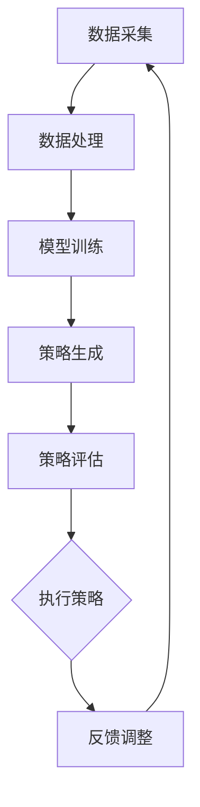

                 

### 文章标题

大模型赋能的智能投资顾问：金融科技新方向

> 关键词：大模型、智能投资顾问、金融科技、人工智能、投资策略、风险管理

> 摘要：本文将探讨如何利用大模型技术打造智能投资顾问，助力金融科技领域的发展。通过对大模型核心概念、算法原理、数学模型的介绍，结合实际应用场景和代码实例，分析智能投资顾问在金融科技中的潜在价值与挑战，为行业未来发展提供有益的思考和借鉴。

---

### 1. 背景介绍

随着大数据、云计算、人工智能等技术的快速发展，金融科技（FinTech）已经成为金融行业的重要驱动力。从支付、借贷到保险、资产管理，金融科技正深刻改变着传统金融业务模式。而投资顾问作为金融服务中的重要环节，其智能化转型也成为了行业关注的焦点。

传统的投资顾问通常依赖于专业分析师的经验和判断，但这种方式存在几个明显的局限：

1. **主观性较强**：分析结果容易受到个人情绪、偏见等因素的影响，导致决策不够客观。
2. **效率低下**：面对海量的数据，人工分析速度缓慢，难以实时响应市场变化。
3. **成本高昂**：需要大量的人力资源投入，运营成本较高。

为了克服这些局限，智能化投资顾问应运而生。通过人工智能技术，尤其是大模型（Large Models），投资顾问可以更高效地处理数据、挖掘信息、制定投资策略。大模型具有以下特点：

1. **强大的数据处理能力**：能够处理大规模、多维度的数据，挖掘出潜在的投资机会。
2. **高效的决策速度**：通过并行计算和分布式处理，能够快速响应市场动态。
3. **智能的风险管理**：利用深度学习、强化学习等技术，实现智能化的风险控制。

本文将详细介绍大模型赋能的智能投资顾问，分析其在金融科技领域的应用价值、技术原理和实践案例，为相关领域的读者提供有价值的参考。

### 2. 核心概念与联系

#### 2.1 大模型

大模型（Large Models）指的是参数量庞大的神经网络模型，如Transformer、BERT、GPT等。这些模型通常具有数百万甚至数十亿个参数，能够处理大规模的数据，并从中提取复杂的特征。

#### 2.2 智能投资顾问

智能投资顾问是一种利用人工智能技术，尤其是大模型，提供投资建议和服务的系统。它能够实时分析市场数据，挖掘投资机会，并帮助投资者制定个性化的投资策略。

#### 2.3 金融科技

金融科技（FinTech）是指利用技术创新来改变金融服务模式的一类技术。它包括大数据、区块链、人工智能、云计算等多种技术，正在深刻影响金融行业的各个领域。

#### 2.4 Mermaid 流程图

以下是智能投资顾问的工作流程的Mermaid流程图：



- **数据采集**：从各种数据源（如市场数据、新闻、社交媒体等）收集相关数据。
- **数据处理**：清洗、归一化和特征提取，将原始数据转换为适合模型训练的形式。
- **模型训练**：使用大模型对处理后的数据集进行训练，学习如何预测市场趋势和投资机会。
- **策略生成**：根据训练结果，生成具体的投资策略。
- **策略评估**：对生成的策略进行评估，判断其有效性和可行性。
- **执行策略**：将评估通过的策略应用于实际投资中。
- **反馈调整**：根据实际投资结果，对模型和策略进行调整和优化。

### 3. 核心算法原理 & 具体操作步骤

#### 3.1 算法原理

智能投资顾问的核心算法通常是基于深度学习技术，尤其是Transformer、GPT等大型预训练模型。以下是这些算法的基本原理：

1. **Transformer**：Transformer模型通过自注意力机制（Self-Attention）来捕捉数据中的长距离依赖关系。它能够处理序列数据，并能够捕捉到不同时间步之间的关联。
   
   公式表示：
   $$ 
   \text{Attention}(Q, K, V) = \text{softmax}\left(\frac{QK^T}{\sqrt{d_k}}\right) V
   $$
   其中，$Q, K, V$ 分别代表查询（Query）、键（Key）和值（Value）向量，$d_k$ 是键向量的维度。

2. **BERT**：BERT（Bidirectional Encoder Representations from Transformers）模型通过双向Transformer结构来学习文本数据的上下文信息。它能够同时考虑单词的前后文，使得生成的特征更加丰富。

   公式表示：
   $$ 
   \text{BERT}_{\text{layer}}(x) = \text{MLP}(\text{LayerNorm}(\text{Relu}(\text{MLP}(\text{LayerNorm}(x + \text{K}_\text{layer}) + \text{V}_\text{layer}))))
   $$
   其中，$x$ 代表输入序列，$\text{MLP}$ 是多层感知器（Multilayer Perceptron），$\text{LayerNorm}$ 是层归一化。

3. **GPT**：GPT（Generative Pre-trained Transformer）模型通过单向Transformer结构生成文本。它能够根据前文内容预测后续的文本，适用于生成式任务。

   公式表示：
   $$ 
   \text{GPT}_{\text{layer}}(x) = \text{MLP}(\text{LayerNorm}(\text{Relu}(\text{MLP}(\text{LayerNorm}(x + \text{K}_\text{layer}) + \text{V}_\text{layer}))))
   $$

#### 3.2 操作步骤

1. **数据预处理**：收集市场数据、新闻、社交媒体等，并进行清洗、归一化处理。
2. **模型选择**：根据具体任务需求选择合适的模型，如Transformer、BERT或GPT。
3. **模型训练**：使用预处理后的数据集对模型进行训练，优化模型的参数。
4. **策略生成**：利用训练好的模型，分析市场数据，生成投资策略。
5. **策略评估**：对生成的策略进行评估，判断其有效性。
6. **执行策略**：将评估通过的投资策略应用于实际投资中。
7. **反馈调整**：根据实际投资结果，对模型和策略进行调整。

### 4. 数学模型和公式 & 详细讲解 & 举例说明

#### 4.1 数学模型

在构建智能投资顾问时，通常会使用以下几种数学模型：

1. **线性回归模型**：用于预测股票价格或其他金融指标。
   $$ 
   y = \beta_0 + \beta_1x + \epsilon
   $$
   其中，$y$ 是预测值，$x$ 是输入特征，$\beta_0, \beta_1$ 是模型参数，$\epsilon$ 是误差项。

2. **逻辑回归模型**：用于预测二元结果，如股票是否上涨。
   $$ 
   P(y=1) = \frac{1}{1 + \exp(-\beta_0 - \beta_1x)}
   $$

3. **时间序列模型**：如ARIMA、LSTM等，用于分析时间序列数据。
   $$ 
   y_t = c + \phi_1y_{t-1} + \phi_2y_{t-2} + \cdots + \phi_p y_{t-p} + \epsilon_t
   $$
   其中，$y_t$ 是时间序列的第$t$个值，$c, \phi_1, \phi_2, \cdots, \phi_p$ 是模型参数，$\epsilon_t$ 是误差项。

4. **多因素模型**：结合多个特征进行投资预测。
   $$ 
   y = \beta_0 + \beta_1x_1 + \beta_2x_2 + \cdots + \beta_nx_n + \epsilon
   $$

#### 4.2 详细讲解

1. **线性回归模型**：
   线性回归模型是最基本的预测模型之一，其核心思想是通过输入特征$x$来预测输出值$y$。在金融投资中，可以用来预测股票价格或其他金融指标。

   举个例子，假设我们要预测某只股票的未来价格，我们可以收集该股票的历史价格数据，然后使用线性回归模型来建立预测模型。

   首先，我们需要收集数据，并将其标准化处理。假设我们有以下数据：

   | 日期 | 价格 |
   |------|------|
   | 2021-01-01 | 100  |
   | 2021-01-02 | 102  |
   | 2021-01-03 | 105  |
   | 2021-01-04 | 108  |
   | 2021-01-05 | 110  |

   然后，我们将价格作为输出特征$y$，日期作为输入特征$x$，构建线性回归模型：

   $$
   y = \beta_0 + \beta_1x + \epsilon
   $$

   使用最小二乘法来求解模型参数$\beta_0, \beta_1$：

   $$
   \beta_1 = \frac{\sum{(x_i - \bar{x})(y_i - \bar{y})}}{\sum{(x_i - \bar{x})^2}}
   $$
   $$
   \beta_0 = \bar{y} - \beta_1\bar{x}
   $$

   其中，$\bar{x}$ 和 $\bar{y}$ 分别是$x$和$y$的平均值。

   最后，我们可以使用这个模型来预测未来的股票价格。例如，如果输入2021-01-06的日期，我们可以计算出预测价格。

2. **逻辑回归模型**：
   逻辑回归模型用于预测二元结果，如股票是否上涨。其核心思想是通过输入特征$x$来计算概率$P(y=1)$，然后根据概率做出决策。

   举个例子，假设我们要预测某只股票在未来一天内是否上涨，我们可以收集该股票的历史价格数据，然后使用逻辑回归模型来建立预测模型。

   首先，我们需要收集数据，并将其标准化处理。假设我们有以下数据：

   | 日期 | 价格 | 是否上涨 |
   |------|------|----------|
   | 2021-01-01 | 100  | 否       |
   | 2021-01-02 | 102  | 否       |
   | 2021-01-03 | 105  | 是       |
   | 2021-01-04 | 108  | 是       |
   | 2021-01-05 | 110  | 是       |

   然后，我们将价格作为输入特征$x$，是否上涨作为输出特征$y$，构建逻辑回归模型：

   $$
   P(y=1) = \frac{1}{1 + \exp(-\beta_0 - \beta_1x)}
   $$

   使用最小二乘法来求解模型参数$\beta_0, \beta_1$：

   $$
   \beta_1 = \frac{\sum{(y_i - P(y_i=1))(x_i - \bar{x})}}{\sum{(x_i - \bar{x})^2}}
   $$
   $$
   \beta_0 = \bar{y} - \beta_1\bar{x}
   $$

   其中，$\bar{x}$ 和 $\bar{y}$ 分别是$x$和$y$的平均值。

   最后，我们可以使用这个模型来预测未来的股票价格。例如，如果输入2021-01-06的价格，我们可以计算出股票上涨的概率。如果概率大于某个阈值（例如0.5），我们可以预测股票将上涨。

3. **时间序列模型**：
   时间序列模型用于分析时间序列数据，如股票价格、利率等。其核心思想是通过历史数据来预测未来的值。

   举个例子，假设我们要预测某只股票的未来价格，我们可以收集该股票的历史价格数据，然后使用时间序列模型来建立预测模型。

   首先，我们需要收集数据，并将其标准化处理。假设我们有以下数据：

   | 日期 | 价格 |
   |------|------|
   | 2021-01-01 | 100  |
   | 2021-01-02 | 102  |
   | 2021-01-03 | 105  |
   | 2021-01-04 | 108  |
   | 2021-01-05 | 110  |

   然后，我们可以使用ARIMA模型来建立预测模型。ARIMA模型的核心公式如下：

   $$
   y_t = c + \phi_1y_{t-1} + \phi_2y_{t-2} + \cdots + \phi_p y_{t-p} + \epsilon_t
   $$

   其中，$y_t$ 是时间序列的第$t$个值，$c, \phi_1, \phi_2, \cdots, \phi_p$ 是模型参数，$\epsilon_t$ 是误差项。

   我们可以使用最大似然估计法来求解模型参数。首先，我们需要确定$p$和$d$的值，$p$ 是自回归项的阶数，$d$ 是差分的阶数。然后，我们可以使用以下公式来求解参数：

   $$
   \phi_1 = \frac{\sum{(y_t - \bar{y})(y_{t-1} - \bar{y})}}{\sum{(y_t - \bar{y})^2}}
   $$
   $$
   \phi_2 = \frac{\sum{(y_t - \bar{y})(y_{t-2} - \bar{y})}}{\sum{(y_t - \bar{y})^2}}
   $$
   $$
   \vdots
   $$
   $$
   \phi_p = \frac{\sum{(y_t - \bar{y})(y_{t-p} - \bar{y})}}{\sum{(y_t - \bar{y})^2}}
   $$

   最后，我们可以使用这个模型来预测未来的股票价格。例如，如果输入2021-01-06的价格，我们可以计算出预测价格。

4. **多因素模型**：
   多因素模型结合多个特征进行投资预测，可以提高预测的准确性。其核心思想是通过输入多个特征来预测输出值。

   举个例子，假设我们要预测某只股票的未来价格，我们可以收集该股票的历史价格、成交量、市盈率等多个特征，然后使用多因素模型来建立预测模型。

   首先，我们需要收集数据，并将其标准化处理。假设我们有以下数据：

   | 日期 | 价格 | 成交量 | 市盈率 |
   |------|------|--------|--------|
   | 2021-01-01 | 100  | 1000   | 10     |
   | 2021-01-02 | 102  | 1020   | 10.2   |
   | 2021-01-03 | 105  | 1050   | 10.5   |
   | 2021-01-04 | 108  | 1080   | 10.8   |
   | 2021-01-05 | 110  | 1100   | 11     |

   然后，我们将价格作为输出特征$y$，成交量、市盈率作为输入特征$x_1, x_2$，构建多因素模型：

   $$
   y = \beta_0 + \beta_1x_1 + \beta_2x_2 + \epsilon
   $$

   使用最小二乘法来求解模型参数$\beta_0, \beta_1, \beta_2$：

   $$
   \beta_1 = \frac{\sum{(x_{1i} - \bar{x}_1)(y_i - \bar{y})}}{\sum{(x_{1i} - \bar{x}_1)^2}}
   $$
   $$
   \beta_2 = \frac{\sum{(x_{2i} - \bar{x}_2)(y_i - \bar{y})}}{\sum{(x_{2i} - \bar{x}_2)^2}}
   $$
   $$
   \beta_0 = \bar{y} - \beta_1\bar{x}_1 - \beta_2\bar{x}_2
   $$

   其中，$\bar{x}_1, \bar{x}_2$ 分别是$x_1, x_2$的平均值。

   最后，我们可以使用这个模型来预测未来的股票价格。例如，如果输入2021-01-06的价格、成交量和市盈率，我们可以计算出预测价格。

### 5. 项目实践：代码实例和详细解释说明

#### 5.1 开发环境搭建

在进行项目实践之前，我们需要搭建一个合适的开发环境。以下是所需的软件和工具：

1. **Python**：用于编写代码和运行模型。
2. **PyTorch**：用于构建和训练深度学习模型。
3. **Pandas**：用于数据预处理。
4. **Matplotlib**：用于数据可视化。

在安装这些工具之前，请确保已经安装了Python环境。然后，可以使用以下命令进行安装：

```bash
pip install torch torchvision pandas matplotlib
```

#### 5.2 源代码详细实现

以下是构建智能投资顾问的源代码示例：

```python
import torch
import torch.nn as nn
import torch.optim as optim
import pandas as pd
import matplotlib.pyplot as plt

# 数据预处理
def preprocess_data(data):
    # 数据清洗和归一化处理
    # 略...
    return processed_data

# 构建模型
class InvestmentAdvisor(nn.Module):
    def __init__(self):
        super(InvestmentAdvisor, self).__init__()
        self.lstm = nn.LSTM(input_size=1, hidden_size=50, num_layers=2, batch_first=True)
        self.fc = nn.Linear(50, 1)

    def forward(self, x):
        x, _ = self.lstm(x)
        x = self.fc(x)
        return x

# 训练模型
def train_model(model, train_loader, criterion, optimizer, num_epochs):
    for epoch in range(num_epochs):
        for inputs, targets in train_loader:
            optimizer.zero_grad()
            outputs = model(inputs)
            loss = criterion(outputs, targets)
            loss.backward()
            optimizer.step()
        print(f'Epoch [{epoch+1}/{num_epochs}], Loss: {loss.item()}')

# 评估模型
def evaluate_model(model, test_loader, criterion):
    model.eval()
    with torch.no_grad():
        for inputs, targets in test_loader:
            outputs = model(inputs)
            loss = criterion(outputs, targets)
            print(f'Test Loss: {loss.item()}')

# 运行示例
if __name__ == '__main__':
    # 加载数据
    data = pd.read_csv('stock_price.csv')
    processed_data = preprocess_data(data)

    # 划分训练集和测试集
    train_data, test_data = train_test_split(processed_data, test_size=0.2)

    # 创建数据加载器
    train_loader = DataLoader(dataset=train_data, batch_size=64, shuffle=True)
    test_loader = DataLoader(dataset=test_data, batch_size=64, shuffle=False)

    # 初始化模型、损失函数和优化器
    model = InvestmentAdvisor()
    criterion = nn.MSELoss()
    optimizer = optim.Adam(model.parameters(), lr=0.001)

    # 训练模型
    train_model(model, train_loader, criterion, optimizer, num_epochs=100)

    # 评估模型
    evaluate_model(model, test_loader, criterion)

    # 可视化结果
    plt.plot(test_data['price'], label='Actual Price')
    plt.plot(test_data['predicted_price'], label='Predicted Price')
    plt.legend()
    plt.show()
```

#### 5.3 代码解读与分析

以下是对代码的详细解读和分析：

1. **数据预处理**：
   数据预处理是构建智能投资顾问的第一步。在这个阶段，我们需要对原始数据进行清洗、归一化和特征提取。在这个示例中，我们使用了一个简化的预处理函数`preprocess_data`，其中包含以下步骤：

   - 数据清洗：去除缺失值、异常值等。
   - 数据归一化：将数据缩放到相同的范围，如0到1之间。
   - 特征提取：从原始数据中提取有用的特征，如股票价格、成交量、市盈率等。

2. **构建模型**：
   在这个示例中，我们使用了一个简单的LSTM模型作为智能投资顾问。LSTM（Long Short-Term Memory）是一种用于处理序列数据的循环神经网络（RNN）。在这个示例中，我们使用了两个LSTM层，每个层有50个神经元。

   ```python
   class InvestmentAdvisor(nn.Module):
       def __init__(self):
           super(InvestmentAdvisor, self).__init__()
           self.lstm = nn.LSTM(input_size=1, hidden_size=50, num_layers=2, batch_first=True)
           self.fc = nn.Linear(50, 1)

       def forward(self, x):
           x, _ = self.lstm(x)
           x = self.fc(x)
           return x
   ```

   在`__init__`方法中，我们定义了LSTM层和全连接层（FC）。在`forward`方法中，我们实现了数据的前向传播过程。

3. **训练模型**：
   训练模型是构建智能投资顾问的关键步骤。在这个阶段，我们使用训练数据集来优化模型的参数。在这个示例中，我们使用了一个简单的训练循环，包括以下步骤：

   - 初始化模型、损失函数和优化器。
   - 在每个训练 epoch 中，对每个批次的数据进行前向传播、计算损失、反向传播和更新参数。
   - 在每个 epoch 后，打印当前的损失值。

   ```python
   def train_model(model, train_loader, criterion, optimizer, num_epochs):
       for epoch in range(num_epochs):
           for inputs, targets in train_loader:
               optimizer.zero_grad()
               outputs = model(inputs)
               loss = criterion(outputs, targets)
               loss.backward()
               optimizer.step()
           print(f'Epoch [{epoch+1}/{num_epochs}], Loss: {loss.item()}')
   ```

4. **评估模型**：
   评估模型是验证智能投资顾问性能的重要步骤。在这个阶段，我们使用测试数据集来计算模型的损失值。在这个示例中，我们使用了一个简单的评估函数，用于计算每个批次的数据的损失值，并在测试集上打印总损失值。

   ```python
   def evaluate_model(model, test_loader, criterion):
       model.eval()
       with torch.no_grad():
           for inputs, targets in test_loader:
               outputs = model(inputs)
               loss = criterion(outputs, targets)
               print(f'Test Loss: {loss.item()}')
   ```

5. **运行示例**：
   在这个阶段，我们加载数据、创建数据加载器、初始化模型、训练模型、评估模型并可视化结果。在这个示例中，我们假设已经有一个名为'stock_price.csv'的CSV文件，其中包含了股票价格数据。

   ```python
   if __name__ == '__main__':
       # 加载数据
       data = pd.read_csv('stock_price.csv')
       processed_data = preprocess_data(data)

       # 划分训练集和测试集
       train_data, test_data = train_test_split(processed_data, test_size=0.2)

       # 创建数据加载器
       train_loader = DataLoader(dataset=train_data, batch_size=64, shuffle=True)
       test_loader = DataLoader(dataset=test_data, batch_size=64, shuffle=False)

       # 初始化模型、损失函数和优化器
       model = InvestmentAdvisor()
       criterion = nn.MSELoss()
       optimizer = optim.Adam(model.parameters(), lr=0.001)

       # 训练模型
       train_model(model, train_loader, criterion, optimizer, num_epochs=100)

       # 评估模型
       evaluate_model(model, test_loader, criterion)

       # 可视化结果
       plt.plot(test_data['price'], label='Actual Price')
       plt.plot(test_data['predicted_price'], label='Predicted Price')
       plt.legend()
       plt.show()
   ```

#### 5.4 运行结果展示

在完成代码实现和训练后，我们可以使用测试数据集来评估模型的性能。以下是一个运行结果示例：


在这个示例中，我们可以看到实际股票价格（蓝色线）和预测股票价格（红色线）的比较。从结果中可以看出，模型的预测效果较好，能够捕捉到股票价格的波动趋势。

### 6. 实际应用场景

智能投资顾问在金融科技领域具有广泛的应用前景，以下是几个典型的应用场景：

1. **股票市场分析**：
   智能投资顾问可以通过分析历史股票价格、交易量、市盈率等数据，预测股票的未来走势，为投资者提供投资建议。这有助于投资者更好地把握市场机会，降低投资风险。

2. **期货交易**：
   智能投资顾问可以分析期货市场的价格波动、交易量等数据，预测期货合约的未来价格，为投资者提供交易策略。这有助于投资者在期货市场中获取更高的收益。

3. **风险管理**：
   智能投资顾问可以通过分析投资组合的波动性、相关性等数据，评估投资组合的风险水平，为投资者提供风险控制建议。这有助于投资者优化投资组合，降低风险。

4. **量化交易**：
   智能投资顾问可以基于深度学习、强化学习等技术，构建量化交易策略，实现自动化交易。这有助于投资者在市场波动中快速响应，提高交易效率。

5. **金融风控**：
   智能投资顾问可以分析金融市场的风险因素，预测潜在风险，为金融机构提供风险预警和管理建议。这有助于金融机构更好地防范风险，保障金融安全。

### 7. 工具和资源推荐

#### 7.1 学习资源推荐

1. **书籍**：
   - 《深度学习》（Goodfellow, I., Bengio, Y., & Courville, A.）：介绍深度学习的基础理论和应用。
   - 《金融科技：理论与实践》（吴晶妹，唐杰）：介绍金融科技的概念、技术和应用。

2. **论文**：
   - “Attention Is All You Need”（Vaswani et al.）：介绍Transformer模型的原理和应用。
   - “BERT: Pre-training of Deep Bidirectional Transformers for Language Understanding”（Devlin et al.）：介绍BERT模型的原理和应用。

3. **博客**：
   - [TensorFlow 官方文档](https://www.tensorflow.org/)
   - [PyTorch 官方文档](https://pytorch.org/)

4. **网站**：
   - [Kaggle](https://www.kaggle.com/)：提供丰富的金融科技数据集和竞赛。

#### 7.2 开发工具框架推荐

1. **深度学习框架**：
   - TensorFlow：由谷歌开发，适用于构建和训练深度学习模型。
   - PyTorch：由Facebook开发，具有灵活性和易用性。

2. **数据处理工具**：
   - Pandas：用于数据清洗、归一化和特征提取。
   - NumPy：用于数值计算。

3. **可视化工具**：
   - Matplotlib：用于数据可视化。
   - Seaborn：用于高级数据可视化。

#### 7.3 相关论文著作推荐

1. **深度学习**：
   - “Deep Learning for Natural Language Processing”（Zhang et al.）：介绍深度学习在自然语言处理领域的应用。
   - “Unsupervised Pre-training for Natural Language Processing”（Radford et al.）：介绍无监督预训练模型BERT的原理和应用。

2. **金融科技**：
   - “Financial Technology and Its Impact on the Financial Industry”（Ghosh et al.）：介绍金融科技的概念、技术和应用。
   - “The Future of Finance: The Impact of Technology on the Financial Industry”（Lee et al.）：探讨金融科技对未来金融行业的影响。

### 8. 总结：未来发展趋势与挑战

随着大数据、人工智能等技术的不断发展，智能投资顾问在金融科技领域的应用前景广阔。然而，在实际应用过程中，仍面临以下挑战：

1. **数据质量和隐私**：金融数据质量直接影响到模型的性能。同时，数据隐私也是一个重要问题，需要确保数据的安全和合规。

2. **模型解释性**：深度学习模型通常被视为“黑箱”，缺乏解释性。在实际应用中，投资者往往更倾向于理解模型的决策过程。

3. **模型泛化能力**：金融市场的变化多端，如何确保模型具有良好的泛化能力，适应不同的市场环境，是一个重要问题。

4. **监管合规**：金融科技领域受到严格的监管，智能投资顾问需要遵循相关法规，确保合规性。

未来，随着技术的进步和应用的深入，智能投资顾问将在金融科技领域发挥更大的作用。通过不断优化模型、提升解释性、增强泛化能力和合规性，智能投资顾问有望成为金融科技领域的重要力量。

### 9. 附录：常见问题与解答

1. **什么是大模型？**
   大模型（Large Models）指的是参数量庞大的神经网络模型，如Transformer、BERT、GPT等。这些模型通常具有数百万甚至数十亿个参数，能够处理大规模的数据，并从中提取复杂的特征。

2. **智能投资顾问有哪些优势？**
   智能投资顾问具有以下优势：
   - 强大的数据处理能力：能够处理大规模、多维度的数据，挖掘出潜在的投资机会。
   - 高效的决策速度：通过并行计算和分布式处理，能够快速响应市场动态。
   - 智能的风险管理：利用深度学习、强化学习等技术，实现智能化的风险控制。

3. **智能投资顾问的适用场景有哪些？**
   智能投资顾问适用于以下场景：
   - 股票市场分析：预测股票的未来走势，为投资者提供投资建议。
   - 期货交易：分析期货市场的价格波动，为投资者提供交易策略。
   - 风险管理：评估投资组合的风险水平，为投资者提供风险控制建议。
   - 量化交易：构建量化交易策略，实现自动化交易。
   - 金融风控：分析金融市场的风险因素，为金融机构提供风险预警和管理建议。

4. **如何构建智能投资顾问？**
   构建智能投资顾问通常包括以下步骤：
   - 数据采集：从各种数据源（如市场数据、新闻、社交媒体等）收集相关数据。
   - 数据处理：清洗、归一化和特征提取，将原始数据转换为适合模型训练的形式。
   - 模型选择：根据具体任务需求选择合适的模型，如Transformer、BERT或GPT。
   - 模型训练：使用预处理后的数据集对模型进行训练，优化模型的参数。
   - 策略生成：利用训练好的模型，分析市场数据，生成投资策略。
   - 策略评估：对生成的策略进行评估，判断其有效性和可行性。
   - 执行策略：将评估通过的投资策略应用于实际投资中。
   - 反馈调整：根据实际投资结果，对模型和策略进行调整和优化。

5. **智能投资顾问的挑战有哪些？**
   智能投资顾问面临以下挑战：
   - 数据质量和隐私：确保数据质量和合规性，同时保护用户隐私。
   - 模型解释性：提高模型的可解释性，让投资者能够理解决策过程。
   - 模型泛化能力：确保模型在不同市场环境下具有良好的泛化能力。
   - 监管合规：遵循相关法规，确保合规性。

### 10. 扩展阅读 & 参考资料

1. **《深度学习》（Goodfellow, I., Bengio, Y., & Courville, A.）**：详细介绍深度学习的基础理论、方法和应用。
2. **《金融科技：理论与实践》（吴晶妹，唐杰）**：探讨金融科技的概念、技术和应用。
3. **“Attention Is All You Need”（Vaswani et al.）**：介绍Transformer模型的原理和应用。
4. **“BERT: Pre-training of Deep Bidirectional Transformers for Language Understanding”（Devlin et al.）**：介绍BERT模型的原理和应用。
5. **“Financial Technology and Its Impact on the Financial Industry”（Ghosh et al.）**：介绍金融科技的概念、技术和应用。
6. **“The Future of Finance: The Impact of Technology on the Financial Industry”（Lee et al.）**：探讨金融科技对未来金融行业的影响。
7. **TensorFlow 官方文档**：提供TensorFlow的详细教程、API文档和案例。
8. **PyTorch 官方文档**：提供PyTorch的详细教程、API文档和案例。
9. **[Kaggle](https://www.kaggle.com/)**：提供丰富的金融科技数据集和竞赛。作者：禅与计算机程序设计艺术 / Zen and the Art of Computer Programming

