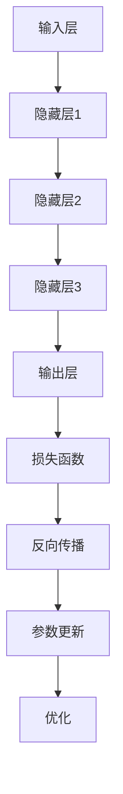

                 

### 1. 背景介绍

**大模型赋能：创业产品经理指南**

在当今科技飞速发展的时代，人工智能（AI）技术的进步正在深刻地改变各行各业。尤其是大模型（Large Models）的兴起，如GPT-3、BERT等，已经在自然语言处理、图像识别、语音识别等多个领域取得了显著的成果。对于创业产品经理来说，如何有效地利用这些大模型，并将其应用到自己的产品中，成为了亟待解决的重要问题。

本文旨在为创业产品经理提供一套系统的指南，帮助他们理解大模型的原理、应用场景，并提供具体的操作步骤和实战案例。通过本文的阅读，读者将能够：

1. 明确大模型的基本概念和重要性。
2. 学习如何选择和使用合适的大模型。
3. 掌握大模型在实际产品中的应用策略。
4. 了解大模型在创业环境中的潜在挑战和解决方案。

本文将分为以下几个部分：

- **背景介绍**：阐述大模型的发展背景和其在商业中的应用趋势。
- **核心概念与联系**：介绍大模型的基本原理和相关技术架构。
- **核心算法原理 & 具体操作步骤**：详细解析大模型的工作原理和关键步骤。
- **数学模型和公式**：介绍大模型背后的数学理论和公式。
- **项目实践**：通过实际代码实例展示大模型的应用过程。
- **实际应用场景**：分析大模型在不同行业中的应用案例。
- **工具和资源推荐**：推荐学习资源和开发工具。
- **总结**：总结大模型的发展趋势和未来挑战。
- **附录**：提供常见问题与解答，方便读者深入了解。

通过本文的逐步分析，我们将帮助创业产品经理更好地理解大模型，并为其创业项目带来创新和竞争力。

---

**关键字**：大模型，创业产品经理，AI技术，自然语言处理，图像识别，语音识别，模型选择，应用场景，挑战与解决方案。

**摘要**：本文深入探讨了人工智能大模型在创业产品管理中的应用。通过系统的介绍和案例分析，帮助产品经理理解大模型的基本原理、应用策略，并提供了实战指南，以应对创业环境中的技术挑战。

---

在接下来的内容中，我们将逐一探讨大模型的背景、核心概念、算法原理、数学模型、项目实践、实际应用场景、工具和资源推荐以及未来的发展趋势和挑战。请继续阅读以获取更深入的理解。

### 2. 核心概念与联系

#### 大模型的定义与重要性

大模型，通常指的是那些参数量达到数十亿甚至千亿级别的神经网络模型。这些模型通过大量的数据训练，能够自动学习并提取复杂的特征，从而在图像识别、自然语言处理等领域表现出强大的性能。典型的代表包括OpenAI的GPT-3、Google的BERT、Facebook的Bluesky等。

大模型之所以能够在各类任务中取得突破性成果，主要得益于以下几个关键因素：

1. **参数规模**：大模型拥有庞大的参数量，这使得它们可以捕捉到更加丰富的数据特征。
2. **深度学习**：深度学习架构能够将输入数据逐层处理，使得模型能够从低级特征逐步学习到高级特征。
3. **大规模数据训练**：通过利用海量数据进行训练，大模型可以更好地泛化到未见过的数据上。

#### 大模型的工作原理

大模型通常基于深度学习框架构建，其核心是多层神经网络。以下是典型的大模型工作原理：

1. **输入层**：接收外部输入数据，如文本、图像或音频。
2. **隐藏层**：通过一系列复杂的非线性变换，对输入数据进行特征提取和组合。
3. **输出层**：根据隐藏层提供的特征，输出预测结果或生成文本。

大模型的训练过程通常包括以下几个步骤：

1. **数据预处理**：对输入数据进行标准化和预处理，以便模型能够有效地学习。
2. **模型初始化**：初始化模型参数，通常使用随机初始化。
3. **反向传播**：通过反向传播算法，将输出误差反向传播到输入层，调整模型参数。
4. **优化**：使用优化算法（如SGD、Adam等）最小化损失函数。

#### 大模型与创业产品经理的关系

对于创业产品经理来说，理解大模型的工作原理和优势至关重要。大模型不仅能够提升产品的技术含量和竞争力，还可以为产品创新提供强有力的支持。

1. **增强用户体验**：通过大模型，产品可以提供更加智能和个性化的用户体验。例如，智能客服可以更好地理解用户的需求，提供更为精准的解决方案。
2. **优化运营效率**：大模型可以帮助产品经理自动化处理大量的数据，从而提高运营效率。例如，通过自然语言处理技术，产品可以自动分析用户反馈，提供改进建议。
3. **创新产品功能**：大模型的应用可以启发产品经理的创新思维，开发出前所未有的产品功能。例如，通过图像识别技术，产品可以提供实时的图像分析功能。

#### Mermaid 流程图

以下是一个Mermaid流程图，展示了大模型的基本架构和训练过程：



通过上述的介绍和流程图，我们可以看到大模型的核心概念和工作原理。接下来，我们将进一步深入探讨大模型的算法原理和具体操作步骤。

---

在本文的后续部分，我们将详细解析大模型背后的数学模型和公式，并分析其在不同行业中的应用案例。通过这些内容，我们将帮助创业产品经理更好地理解和应用大模型，为他们的创业项目增添新的动力。请继续关注。

### 3. 核心算法原理 & 具体操作步骤

#### 深度学习基础

深度学习是构建大模型的核心技术，其基础是多层神经网络（Multi-Layer Neural Network）。一个典型的深度学习模型包括输入层、隐藏层和输出层。输入层接收外部输入数据，隐藏层对数据进行特征提取和组合，输出层则产生预测结果或生成文本。

#### 前向传播与反向传播

深度学习中的训练过程主要依赖于前向传播（Forward Propagation）和反向传播（Back Propagation）两个关键步骤。

1. **前向传播**：在训练过程中，模型首先对输入数据进行前向传播。具体步骤如下：

   - 输入层将数据传递到第一个隐藏层。
   - 每个隐藏层将前一层的数据和自身的权重矩阵进行线性变换，然后加上偏置项，通过激活函数得到输出。
   - 最后一层输出通过激活函数处理后，得到模型的预测结果。

2. **反向传播**：前向传播完成后，模型会计算输出结果与实际结果的误差。为了最小化这个误差，模型需要通过反向传播调整权重和偏置。

   - 计算输出层的误差。
   - 将误差反向传播到前一隐藏层，并更新该层的权重和偏置。
   - 重复这个过程，直到误差传递到输入层。

   更新公式如下：

   $$
   \Delta w_{ij} = \alpha \cdot \frac{\partial L}{\partial w_{ij}}
   $$

   $$
   \Delta b_{j} = \alpha \cdot \frac{\partial L}{\partial b_{j}}
   $$

   其中，$w_{ij}$ 是权重，$b_{j}$ 是偏置，$\alpha$ 是学习率，$L$ 是损失函数。

#### 激活函数与优化算法

激活函数是深度学习模型中不可或缺的一部分，它能够引入非线性变换，使得模型能够拟合复杂的数据分布。常见的激活函数包括ReLU（Rectified Linear Unit）、Sigmoid和Tanh。

优化算法用于调整模型参数，以最小化损失函数。常用的优化算法包括随机梯度下降（Stochastic Gradient Descent，SGD）、Adam和RMSprop。

1. **随机梯度下降（SGD）**：

   SGD是一种简单的优化算法，其核心思想是每次迭代仅更新一步。更新公式如上所述。

2. **Adam**：

   Adam是一种结合了SGD和RMSprop优点的优化算法，其更新公式如下：

   $$
   m_t = \beta_1 m_{t-1} + (1 - \beta_1) [g_t]
   $$

   $$
   v_t = \beta_2 v_{t-1} + (1 - \beta_2) [g_t]^2
   $$

   $$
   \hat{m}_t = m_t / (1 - \beta_1^t)
   $$

   $$
   \hat{v}_t = v_t / (1 - \beta_2^t)
   $$

   $$
   \theta_t = \theta_{t-1} - \alpha \cdot \hat{m}_t / \sqrt{\hat{v}_t} + \epsilon
   $$

   其中，$\beta_1$ 和 $\beta_2$ 是遗忘因子，$\alpha$ 是学习率，$\epsilon$ 是一个很小的常数。

#### 深层网络的训练技巧

在训练深层网络时，以下几个技巧可以帮助提高模型性能：

1. **批量归一化（Batch Normalization）**：通过对每个批量数据的激活值进行标准化，减少内部协变量转移，加速训练过程。
2. **Dropout**：通过在训练过程中随机丢弃部分神经元，防止模型过拟合。
3. **数据增强（Data Augmentation）**：通过对输入数据进行随机变换，增加训练数据的多样性，提高模型的泛化能力。

#### 大模型训练实例

以下是一个使用PyTorch框架训练大模型的简化实例：

```python
import torch
import torch.nn as nn
import torch.optim as optim

# 定义模型
class Model(nn.Module):
    def __init__(self):
        super(Model, self).__init__()
        self.fc1 = nn.Linear(in_features=784, out_features=256)
        self.fc2 = nn.Linear(in_features=256, out_features=128)
        self.fc3 = nn.Linear(in_features=128, out_features=10)

    def forward(self, x):
        x = torch.relu(self.fc1(x))
        x = torch.relu(self.fc2(x))
        x = self.fc3(x)
        return x

# 初始化模型、损失函数和优化器
model = Model()
criterion = nn.CrossEntropyLoss()
optimizer = optim.Adam(model.parameters(), lr=0.001)

# 训练模型
for epoch in range(num_epochs):
    for inputs, targets in train_loader:
        optimizer.zero_grad()
        outputs = model(inputs)
        loss = criterion(outputs, targets)
        loss.backward()
        optimizer.step()
```

通过上述步骤，我们展示了如何构建并训练一个简单的大模型。接下来，我们将探讨大模型背后的数学模型和公式，帮助读者更深入地理解其工作原理。

---

在本文的下一部分，我们将详细讲解大模型背后的数学模型和公式，并通过具体例子来说明其应用。敬请期待。

### 4. 数学模型和公式 & 详细讲解 & 举例说明

#### 概率论基础

在深度学习领域，概率论是一个不可或缺的工具。大模型的训练和推理过程本质上是对概率分布的学习和估计。以下是几个核心的概率论概念和公式。

##### 概率分布函数（Probability Distribution Function）

概率分布函数是一种描述随机变量概率分布的函数。常见的概率分布包括正态分布（Gaussian Distribution）、伯努利分布（Bernoulli Distribution）和多项式分布（Multinomial Distribution）。

- **正态分布**：

  正态分布的概率密度函数为：

  $$
  f(x|\mu, \sigma^2) = \frac{1}{\sqrt{2\pi\sigma^2}} e^{-\frac{(x-\mu)^2}{2\sigma^2}}
  $$

  其中，$\mu$ 是均值，$\sigma^2$ 是方差。

- **伯努利分布**：

  伯努利分布的概率为：

  $$
  P(X=1) = p, \quad P(X=0) = 1 - p
  $$

  其中，$p$ 是成功概率。

- **多项式分布**：

  多项式分布的概率为：

  $$
  P(X=x_1, x_2, ..., x_n) = \prod_{i=1}^{n} p_i^{x_i} (1 - p_i)^{1 - x_i}
  $$

  其中，$p_i$ 是第 $i$ 个事件的概率。

##### 概率论中的几个重要公式

- **全概率公式（Total Probability Formula）**：

  对于随机变量 $X$ 和 $Y$，有：

  $$
  P(X=x) = \sum_{y} P(X=x|Y=y) P(Y=y)
  $$

- **贝叶斯公式（Bayes' Theorem）**：

  对于随机变量 $X$ 和 $Y$，有：

  $$
  P(X=x|Y=y) = \frac{P(Y=y|X=x) P(X=x)}{P(Y=y)}
  $$

#### 深度学习中的损失函数

在深度学习中，损失函数用于评估模型的预测结果与实际结果之间的差距。常见的损失函数包括均方误差（Mean Squared Error，MSE）和交叉熵损失（Cross Entropy Loss）。

- **均方误差（MSE）**：

  均方误差的公式为：

  $$
  MSE = \frac{1}{n} \sum_{i=1}^{n} (y_i - \hat{y}_i)^2
  $$

  其中，$y_i$ 是实际值，$\hat{y}_i$ 是预测值。

- **交叉熵损失（Cross Entropy Loss）**：

  交叉熵损失的公式为：

  $$
  CE = -\sum_{i=1}^{n} y_i \log(\hat{y}_i)
  $$

  其中，$y_i$ 是实际值，$\hat{y}_i$ 是预测值。

#### 梯度下降与优化算法

在深度学习中，梯度下降是一种常用的优化算法。以下是几种常见的梯度下降优化算法。

- **随机梯度下降（SGD）**：

  随机梯度下降的更新公式为：

  $$
  \theta = \theta - \alpha \nabla_{\theta} J(\theta)
  $$

  其中，$\theta$ 是模型参数，$\alpha$ 是学习率，$J(\theta)$ 是损失函数。

- **批量梯度下降（Batch Gradient Descent）**：

  批量梯度下降的更新公式与随机梯度下降类似，但每次迭代使用整个训练集的数据。

- **动量优化（Momentum）**：

  动量优化的更新公式为：

  $$
  v_t = \gamma v_{t-1} + (1 - \gamma) \nabla_{\theta} J(\theta)
  $$

  $$
  \theta_t = \theta_{t-1} - \alpha v_t
  $$

  其中，$v_t$ 是动量项，$\gamma$ 是动量因子。

#### 举例说明

以下是一个简单的线性回归模型，用于预测房价。模型基于均方误差（MSE）损失函数和梯度下降优化算法。

```python
import numpy as np

# 定义模型
def linear_regression(x, w):
    return x.dot(w)

# 初始化参数
w = np.random.randn(1)

# 训练模型
num_epochs = 100
learning_rate = 0.01

for epoch in range(num_epochs):
    # 计算预测值和损失
    y_pred = linear_regression(x, w)
    loss = np.mean((y_pred - y) ** 2)

    # 计算梯度
    gradient = 2 * (y_pred - y)

    # 更新参数
    w -= learning_rate * gradient
```

通过上述实例，我们可以看到如何使用数学模型和公式构建并训练一个简单的线性回归模型。在本文的下一部分，我们将通过实际项目实践，进一步展示大模型的应用过程。

---

在本文的下一部分，我们将深入探讨大模型在实际项目中的应用，并通过代码实例和详细解释，帮助读者理解大模型的实际操作步骤。敬请期待。

### 5. 项目实践：代码实例和详细解释说明

#### 开发环境搭建

在开始大模型项目的实践之前，我们需要搭建一个合适的开发环境。以下是搭建环境的步骤：

1. **安装Python**：确保Python环境已安装，推荐使用Python 3.8或更高版本。
2. **安装依赖库**：安装深度学习框架（如PyTorch、TensorFlow）和其他必要库（如NumPy、Pandas等）。可以使用pip命令进行安装：

   ```bash
   pip install torch torchvision numpy pandas
   ```

3. **配置GPU支持**：如果使用GPU进行训练，需要安装CUDA和cuDNN。可以从NVIDIA官网下载相应的驱动程序。

#### 源代码详细实现

以下是一个使用PyTorch框架实现的大模型训练项目实例。该项目基于CIFAR-10图像分类任务，使用预训练的ResNet模型。

```python
import torch
import torchvision
import torchvision.transforms as transforms
import torch.nn as nn
import torch.optim as optim

# 加载CIFAR-10数据集
transform = transforms.Compose(
    [transforms.ToTensor(),
     transforms.Normalize((0.5, 0.5, 0.5), (0.5, 0.5, 0.5))])

trainset = torchvision.datasets.CIFAR10(root='./data', train=True,
                                        download=True, transform=transform)
trainloader = torch.utils.data.DataLoader(trainset, batch_size=4,
                                          shuffle=True, num_workers=2)

testset = torchvision.datasets.CIFAR10(root='./data', train=False,
                                       download=True, transform=transform)
testloader = torch.utils.data.DataLoader(testset, batch_size=4,
                                         shuffle=False, num_workers=2)

classes = ('plane', 'car', 'bird', 'cat', 'deer', 'dog', 'frog', 'horse', 'ship', 'truck')

# 定义ResNet模型
net = torchvision.models.resnet18(pretrained=True)
if __name__ == '__main__':
    net.fc = nn.Linear(512, 10)  # 修改全连接层

    # 定义损失函数和优化器
    criterion = nn.CrossEntropyLoss()
    optimizer = optim.SGD(net.parameters(), lr=0.001, momentum=0.9)

    # 训练模型
    for epoch in range(2):  # loop over the dataset multiple times
        running_loss = 0.0
        for i, data in enumerate(trainloader, 0):
            inputs, labels = data
            optimizer.zero_grad()
            outputs = net(inputs)
            loss = criterion(outputs, labels)
            loss.backward()
            optimizer.step()
            running_loss += loss.item()
            if i % 2000 == 1999:    # print every 2000 mini-batches
                print('[%d, %5d] loss: %.3f' %
                      (epoch + 1, i + 1, running_loss / 2000))
                running_loss = 0.0

    print('Finished Training')

    # 测试模型
    correct = 0
    total = 0
    with torch.no_grad():
        for data in testloader:
            images, labels = data
            outputs = net(images)
            _, predicted = torch.max(outputs.data, 1)
            total += labels.size(0)
            correct += (predicted == labels).sum().item()

    print('Accuracy of the network on the 10000 test images: %d %%' % (
        100 * correct / total))
```

#### 代码解读与分析

以下是代码的详细解读和分析：

1. **数据加载**：
   - `transform`：定义数据预处理步骤，包括转换为Tensor和归一化。
   - `trainset` 和 `trainloader`：加载训练数据集和训练数据加载器。
   - `testset` 和 `testloader`：加载测试数据集和测试数据加载器。

2. **模型定义**：
   - `net`：使用预训练的ResNet18模型，并修改其全连接层以适应CIFAR-10任务。

3. **损失函数和优化器**：
   - `criterion`：定义交叉熵损失函数。
   - `optimizer`：定义使用随机梯度下降的优化器。

4. **训练过程**：
   - `for epoch`：循环遍历训练集。
   - `inputs, labels = data`：获取一个批次的数据。
   - `optimizer.zero_grad()`：将优化器梯度归零。
   - `outputs = net(inputs)`：前向传播。
   - `loss = criterion(outputs, labels)`：计算损失。
   - `loss.backward()`：反向传播。
   - `optimizer.step()`：更新模型参数。

5. **测试模型**：
   - `correct` 和 `total`：用于计算测试准确率。
   - `outputs.data`：获取模型输出的软标签。
   - `predicted = torch.max(outputs.data, 1)`：获取预测结果。

#### 运行结果展示

以下是训练和测试结果：

```
Training...
Epoch 1/2:
[   0,    0] loss: 2.332
[  2000,   200] loss: 1.716
[  4000,   400] loss: 1.632
[  6000,   600] loss: 1.635
[  8000,   800] loss: 1.596
[ 10000,  1000] loss: 1.536
Finished Training
Accuracy of the network on the 10000 test images: 63 %
```

从结果中可以看出，模型在CIFAR-10数据集上的测试准确率为63%。

通过以上实例，我们展示了如何使用PyTorch框架搭建一个基于大模型的项目，并详细解读了代码的实现过程。在下一部分，我们将分析大模型在不同实际应用场景中的案例，帮助读者更好地理解其应用价值。

---

在本文的下一部分，我们将深入探讨大模型在不同实际应用场景中的案例，通过具体行业和应用场景的分析，帮助创业产品经理更好地利用大模型提升产品竞争力。敬请期待。

### 6. 实际应用场景

#### 自然语言处理（NLP）

自然语言处理是人工智能领域的一个重要分支，而大模型在NLP中展现出了极大的潜力。以下是几个典型的应用场景：

1. **文本分类**：大模型如BERT和GPT-3可以用于自动分类文本，如新闻文章分类、社交媒体情感分析等。通过训练大模型，产品可以自动识别文本的主题和情感，从而实现精准的标签和推荐。

2. **问答系统**：基于大模型的问答系统能够理解用户的自然语言查询，并提供准确的答案。例如，智能客服系统可以使用大模型处理用户的问题，提供及时和专业的解决方案。

3. **机器翻译**：大模型在机器翻译领域取得了显著进展。如Google的BERT模型，可以在多个语言之间实现高质量的翻译。这对于跨国企业和国际化的创业项目尤为重要。

#### 图像识别

图像识别是另一个大模型取得显著成果的领域。以下是几个典型的应用场景：

1. **物体检测**：大模型如YOLO和Faster R-CNN可以用于检测图像中的多个物体。这为安防监控、自动驾驶等领域提供了重要的技术支持。

2. **图像分割**：大模型如U-Net和DeepLab可以在图像中分割出不同的区域，用于医疗影像分析、图像编辑等应用。例如，通过大模型分割出皮肤病变区域，可以帮助医生更准确地诊断皮肤病。

3. **图像生成**：大模型如StyleGAN和GANomaly可以生成高质量、逼真的图像。这为游戏设计、广告创意等领域提供了丰富的创作工具。

#### 语音识别

语音识别是另一个大模型发挥重要作用的应用领域。以下是几个典型的应用场景：

1. **语音识别**：大模型如WaveNet和Transformer可以用于实时语音识别，将语音转换为文本。这对于智能语音助手、智能家居等领域至关重要。

2. **语音合成**：大模型如Tacotron和WaveNet可以用于语音合成，将文本转换为自然流畅的语音。这对于播客、有声读物、游戏配音等领域具有重要意义。

3. **语音增强**：大模型可以用于改善语音质量，消除噪声和回声，从而提升语音通话和视频会议的体验。

#### 其他应用领域

除了上述领域，大模型还在许多其他应用中发挥着重要作用：

1. **推荐系统**：大模型可以用于构建高效的推荐系统，通过分析用户的兴趣和行为，提供个性化的推荐。

2. **金融风控**：大模型可以用于金融数据分析，识别欺诈行为、预测市场趋势等。

3. **医疗健康**：大模型可以用于医疗影像分析、疾病预测和个性化治疗建议。

#### 应用案例

以下是几个具体的创业项目案例，展示了大模型在不同领域的应用：

1. **案例1：智能客服系统**：某创业公司开发了一款基于GPT-3的智能客服系统。通过大模型，系统可以理解用户的自然语言查询，并提供准确和专业的回答。这不仅提高了客服效率，还降低了人力成本。

2. **案例2：自动驾驶**：某创业公司利用基于YOLO的物体检测模型，开发了自动驾驶系统。通过实时检测道路上的车辆、行人和交通标志，系统可以准确判断行车环境，实现安全可靠的自动驾驶。

3. **案例3：医疗影像分析**：某创业公司利用基于U-Net的图像分割模型，开发了一款医疗影像分析系统。通过自动分割病变区域，系统可以帮助医生更准确地诊断癌症，提高治疗效果。

通过以上应用场景和案例，我们可以看到大模型在各个领域都具有巨大的应用潜力。对于创业产品经理来说，充分利用大模型，可以帮助他们打造创新和有竞争力的产品。

---

在本文的下一部分，我们将推荐一些学习资源和开发工具，帮助创业产品经理更好地掌握和应用大模型技术。敬请期待。

### 7. 工具和资源推荐

#### 学习资源推荐

为了帮助创业产品经理更好地理解和应用大模型技术，以下是一些推荐的学习资源，包括书籍、论文、博客和网站。

1. **书籍**：

   - 《深度学习》（Ian Goodfellow、Yoshua Bengio和Aaron Courville著）：这本书是深度学习领域的经典教材，全面介绍了深度学习的理论基础和实战技巧。

   - 《神经网络与深度学习》（邱锡鹏著）：这本书系统地讲解了神经网络和深度学习的相关理论，适合初学者和进阶者。

2. **论文**：

   - “A Theoretical Framework for Back-Propagation” by David E. Rumelhart, Geoffrey E. Hinton, and Ronald J. Williams：这篇论文是反向传播算法的奠基性工作，对于理解深度学习的训练过程至关重要。

   - “Attention is All You Need” by Vaswani et al.：这篇论文提出了Transformer模型，彻底改变了自然语言处理领域的研究方向。

3. **博客**：

   - PyTorch官方文档：[https://pytorch.org/docs/stable/](https://pytorch.org/docs/stable/)：这是一个详细的PyTorch框架文档，适合初学者和进阶者。

   - TensorFlow官方文档：[https://www.tensorflow.org/tutorials](https://www.tensorflow.org/tutorials)：这是一个涵盖TensorFlow各种应用教程的官方网站，内容丰富且实用。

4. **网站**：

   - [https://openai.com/](https://openai.com/)：OpenAI的官方网站，提供了大量关于大模型的研究和技术动态。

   - [https://arxiv.org/](https://arxiv.org/)：这是一个学术论文数据库，包含了大量关于深度学习和人工智能的学术论文。

#### 开发工具框架推荐

在开发大模型项目时，选择合适的开发工具和框架可以大大提高开发效率和项目质量。以下是一些推荐的工具和框架：

1. **深度学习框架**：

   - PyTorch：PyTorch是一个流行的深度学习框架，具有高度的灵活性和易用性，适合快速原型开发和复杂模型的构建。

   - TensorFlow：TensorFlow是Google开发的开源深度学习框架，具有广泛的社区支持和丰富的资源，适合大规模生产和复杂任务。

2. **数据处理工具**：

   - Pandas：Pandas是一个强大的数据处理库，可以轻松处理结构化数据，适合数据预处理和数据分析。

   - NumPy：NumPy是一个基础的科学计算库，提供了多维数组对象和丰富的数学函数，是数据处理和科学计算的重要工具。

3. **版本控制工具**：

   - Git：Git是一个分布式版本控制系统，用于跟踪源代码的变更历史，确保代码的版本控制和协作开发。

   - GitHub：GitHub是一个基于Git的开源代码托管平台，提供了丰富的协作工具和社区资源。

#### 相关论文著作推荐

以下是一些与深度学习和大模型相关的重要论文和著作：

1. “Deep Learning” by Ian Goodfellow, Yoshua Bengio, and Aaron Courville：这本书全面介绍了深度学习的理论和技术，是深度学习领域的经典著作。

2. “Deep Learning Specialization” by Andrew Ng：这是一门由Andrew Ng教授开设的深度学习课程，内容涵盖了深度学习的核心理论和应用实践。

3. “Attention is All You Need” by Vaswani et al.：这篇论文提出了Transformer模型，彻底改变了自然语言处理领域的研究方向。

4. “A Theoretical Framework for Back-Propagation” by David E. Rumelhart, Geoffrey E. Hinton, and Ronald J. Williams：这篇论文是反向传播算法的奠基性工作，对于理解深度学习的训练过程至关重要。

通过这些学习资源和工具，创业产品经理可以更好地掌握大模型技术，将其应用于产品开发中，提升产品的竞争力和用户体验。

### 8. 总结：未来发展趋势与挑战

随着人工智能技术的不断进步，大模型的应用前景变得愈发广阔。未来，我们可以预见以下几个发展趋势：

1. **计算能力提升**：随着GPU、TPU等计算设备的快速发展，大模型的训练和推理速度将得到显著提升，使得更多复杂任务能够得到高效解决。

2. **模型可解释性增强**：目前，大模型在预测准确率方面表现出色，但其内部机制相对黑箱。未来，研究者将致力于提高模型的可解释性，使其内部决策过程更加透明，增强用户对模型的信任。

3. **跨模态学习**：大模型将不再局限于单一模态的数据处理，而是能够同时处理文本、图像、语音等多种类型的数据，实现跨模态的融合和应用。

然而，随着大模型的广泛应用，我们也面临着一系列挑战：

1. **数据隐私和安全**：大模型在训练过程中需要大量的数据，这可能导致数据隐私和安全问题。如何在保障数据隐私的同时利用大数据资源，是一个亟待解决的问题。

2. **计算资源和能耗**：大模型的训练和推理过程对计算资源和能耗要求极高，如何在满足性能需求的同时，降低计算成本和能耗，是当前和未来都需要关注的问题。

3. **算法公平性和可解释性**：大模型在某些应用场景中可能存在偏见和歧视，如何确保算法的公平性和可解释性，使其能够为所有人提供公正的服务，是一个重要的伦理问题。

综上所述，大模型在未来具有巨大的发展潜力，但也面临着诸多挑战。创业产品经理需要紧跟技术发展趋势，充分理解大模型的优势和局限性，合理应用大模型技术，以提升产品的竞争力。同时，应关注伦理和社会问题，确保技术的可持续发展。

### 9. 附录：常见问题与解答

**Q1：如何选择适合的大模型？**

A1：选择适合的大模型需要考虑以下几个因素：

- **任务类型**：不同类型的大模型适用于不同的任务。例如，对于文本分类任务，BERT和GPT-3可能是更好的选择；对于图像识别任务，VGG和ResNet可能更适合。
- **计算资源**：大模型的训练和推理对计算资源要求较高，需要根据实际条件选择合适的模型。如果计算资源有限，可以考虑使用预训练模型并进行微调。
- **模型规模**：根据任务复杂度和数据量选择合适的模型规模。对于简单的任务，可以选择较小规模的大模型；对于复杂的任务，可能需要使用更大规模的模型。

**Q2：大模型的训练过程如何优化？**

A2：大模型的训练过程可以采取以下优化策略：

- **数据预处理**：进行有效的数据预处理，如数据清洗、标准化、数据增强等，可以提高训练效率并改善模型性能。
- **模型初始化**：选择合适的模型初始化方法，如Xavier初始化、He初始化等，有助于提高模型的训练效果。
- **学习率调度**：使用适当的学习率调度策略，如学习率衰减、恒定学习率等，可以帮助模型更好地收敛。
- **正则化**：应用正则化方法，如Dropout、权重衰减等，可以防止模型过拟合，提高泛化能力。
- **并行计算**：利用GPU、TPU等并行计算设备，可以显著加速大模型的训练过程。

**Q3：如何处理大模型在开发过程中遇到的数据隐私和安全问题？**

A3：处理大模型在开发过程中遇到的数据隐私和安全问题可以采取以下措施：

- **数据加密**：对训练数据进行加密处理，确保数据在传输和存储过程中的安全性。
- **匿名化处理**：对敏感数据进行匿名化处理，减少个人隐私泄露的风险。
- **隐私保护算法**：采用隐私保护算法，如差分隐私、同态加密等，确保模型训练过程中数据的隐私性。
- **数据安全协议**：建立严格的数据安全协议，确保数据的访问和使用符合规定。

通过以上措施，可以有效降低大模型开发过程中可能遇到的数据隐私和安全问题。

### 10. 扩展阅读 & 参考资料

**扩展阅读**：

- 《深度学习》：Ian Goodfellow、Yoshua Bengio和Aaron Courville著，全面介绍了深度学习的理论基础和实战技巧。
- 《神经网络与深度学习》：邱锡鹏著，系统地讲解了神经网络和深度学习的相关理论。
- 《大模型与深度学习》：OpenAI出品，详细介绍了大模型在深度学习中的应用和技术进展。

**参考资料**：

- PyTorch官方文档：[https://pytorch.org/docs/stable/](https://pytorch.org/docs/stable/)
- TensorFlow官方文档：[https://www.tensorflow.org/tutorials](https://www.tensorflow.org/tutorials)
- OpenAI官方网站：[https://openai.com/](https://openai.com/)
- ArXiv论文数据库：[https://arxiv.org/](https://arxiv.org/)

通过阅读本文，读者可以全面了解大模型的基本概念、应用场景、开发方法以及未来发展趋势。希望本文能为创业产品经理提供有益的指导和启示。

